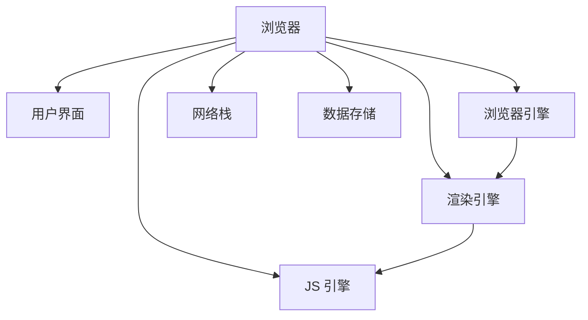
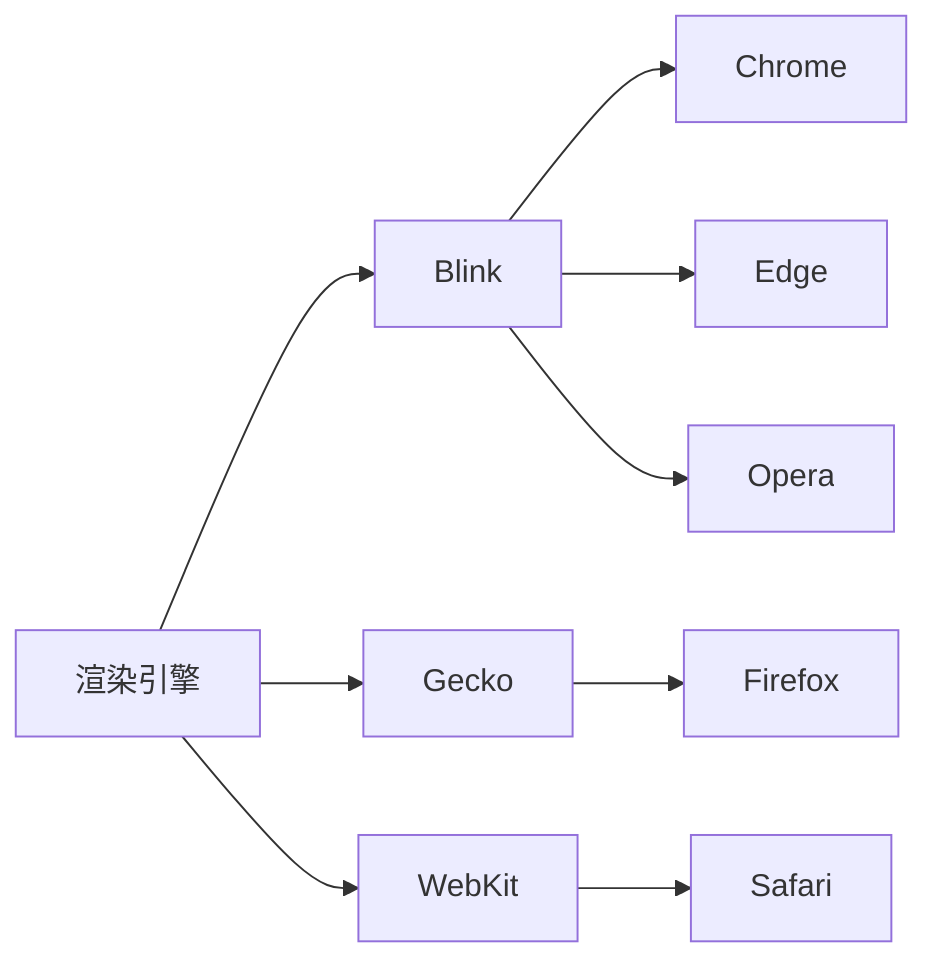
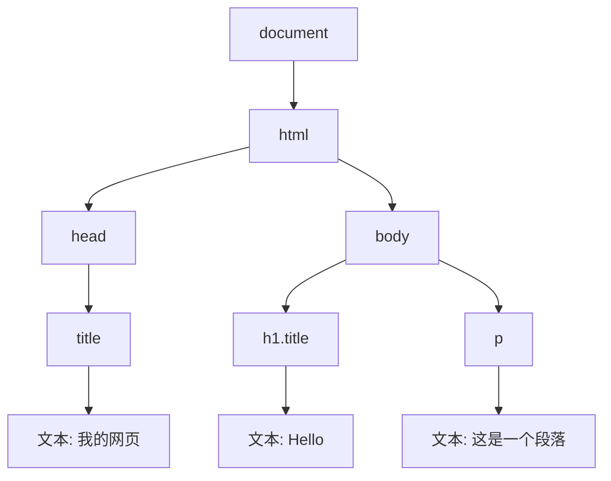
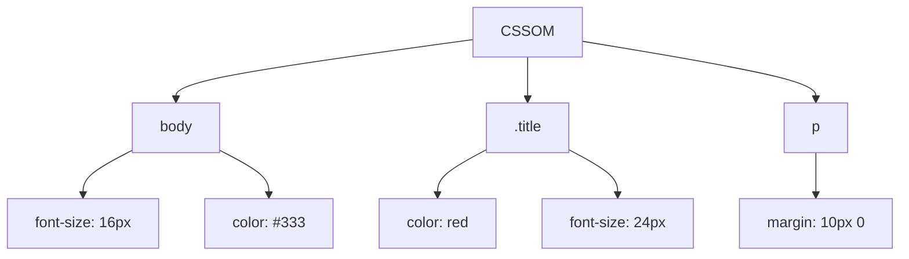
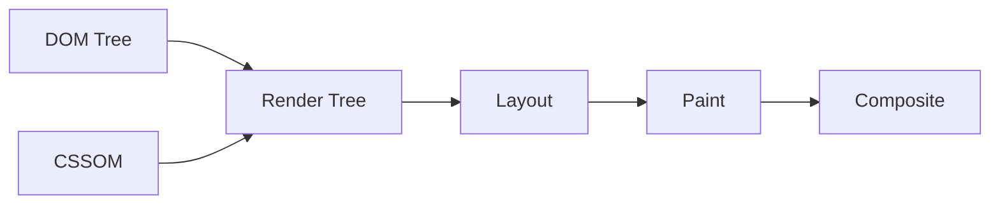
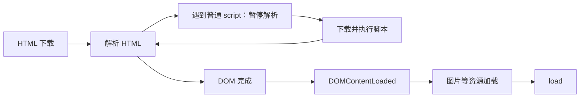
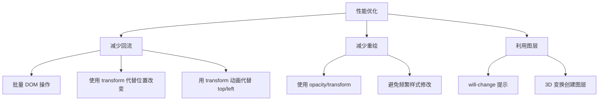

+++
title = "第 24 章 浏览器工作原理"
weight = 240
date = "2026-03-24T22:08:00+08:00"
type = "docs"
description = ""
isCJKLanguage = true
draft = false
+++
# 第 24 章 浏览器工作原理

> 打开网页时，浏览器里发生了什么？比你想象的复杂多了！

## 24.1 浏览器组成

### 用户界面 / 浏览器引擎 / 渲染引擎 / JS 引擎

你以为浏览器只是一个"显示网页"的软件？too young too simple！

浏览器其实是一个超级复杂的系统，由多个组件构成：



#### 1. 用户界面（UI）

地址栏、书签栏、前进/后退按钮、刷新按钮...都是用户界面的一部分。

#### 2. 浏览器引擎（Browser Engine）

浏览器引擎是用户界面和渲染引擎之间的"桥梁"，它负责协调两者的通信。

#### 3. 渲染引擎（Rendering Engine）

渲染引擎负责解析 HTML 和 CSS，计算布局并绘制页面。

#### 4. JS 引擎（JavaScript Engine）

JS 引擎负责执行 JavaScript 代码。

#### 5. 网络栈（Networking）

负责处理 HTTP 请求、网络图片加载等。

#### 6. 数据存储（Data Storage）

Cookie、LocalStorage、IndexedDB 等。

---

### 渲染引擎：Blink（Chrome）/ Gecko（Firefox）/ WebKit（Safari）

不同的浏览器使用不同的渲染引擎：

| 浏览器 | 渲染引擎 | JS 引擎 |
|--------|----------|---------|
| Chrome | Blink | V8 |
| Firefox | Gecko | SpiderMonkey |
| Safari | WebKit | JavaScriptCore |
| Edge（旧版） | EdgeHTML | Chakra |
| Edge（新版） | Blink | V8 |



---

### JS 引擎：V8 / SpiderMonkey / JavaScriptCore

**V8** 是 Chrome 和 Node.js 使用的 JS 引擎，由 Google 开发，是目前最流行的 JS 引擎。

```javascript
// V8 的工作原理
// 1. 解析器（Parser）把源码变成 AST（抽象语法树）
// 2. Ignition 解释器把 AST 编译成字节码并执行（先跑起来，启动快）
// 3. 同时 V8 会收集运行时的类型信息，给函数"画像"（反馈向量）
// 4. 热点代码（反复执行的函数）交给优化编译器编译成机器码
//    —— 早期只有 TurboFan，后来加了基线编译器 Sparkplug 和中层编译器 Maglev，
//       形成"解释 → 基线 → 中层 → 顶层"的多级阶梯，避免一上来就重编译
// 5. 如果运行中类型假设被打破，就"去优化"（Deoptimization）退回字节码

// 热点函数会被 V8 优化
function add(a, b) {
  return a + b;
}

// 多次调用（且参数类型稳定）后，V8 会把 add 编译成高度优化的机器码
for (let i = 0; i < 10000; i++) {
  add(1, 2);
}
```

```javascript
// ⚠️ 关于"怎么写才能让 V8 更快"，网上流传的很多建议已经过时了。
// 那些说法大多来自 2017 年之前，如今的 V8 早就不在乎这些了：
//   ❌ "不要用 arguments"        —— 现代 V8 处理 arguments 完全没问题
//   ❌ "不要用 try/catch"        —— 早就不是性能杀手了
//   ❌ "不要用 delete"           —— 只有删对象属性影响隐藏类，本身不算大问题
//   ❌ "函数不要超过 600 字节"    —— 内联阈值早就换成了别的度量方式
//
// 真正值得注意的只有一条：
// ✅ 让数据形状保持稳定（同一个对象的结构别变来变去），
//    这样 V8 的隐藏类（Hidden Class）机制才能持续命中同一条快路径。

// 反面示例：同一个位置一会儿是对象、一会儿是数字，
// 每次赋值都会让隐藏类发生迁移，最终退化成"慢属性"字典模式
const point = {};
point.x = 1;        // 形状 A
point.y = 2;        // 形状 B
point.z = 'hello';  // 形状 C
point.x = 'oops';   // 类型又变了，之前为数值类型做的优化直接作废

// 推荐：一开始就把形状定好
const betterPoint = { x: 1, y: 2, z: 'hello' };
```

> 💡 **本章小结（第24章第1节）**
> 
> 浏览器由多个组件构成：用户界面、浏览器引擎、渲染引擎、JS 引擎、网络栈、数据存储。渲染引擎负责解析 HTML/CSS 并绘制页面，主流的渲染引擎有 Blink（Chrome）、Gecko（Firefox）、WebKit（Safari）。JS 引擎负责执行 JavaScript 代码，主流的有 V8（Chrome/Node.js）、SpiderMonkey（Firefox）、JavaScriptCore（Safari）。了解这些组件有助于理解浏览器的工作方式。

---

## 24.2 渲染过程

### HTML → DOM Tree

浏览器首先解析 HTML 文档，构建 DOM 树。

```html
<!DOCTYPE html>
<html>
<head>
  <title>我的网页</title>
</head>
<body>
  <h1 class="title">Hello</h1>
  <p>这是一个段落</p>
</body>
</html>
```



```javascript
// DOM 树是由 DOM 节点组成的树形结构
// 每个 HTML 标签都是一个 DOM 节点
// 节点类型：
// - Element node (1) - HTML 标签
// - Text node (3) - 文本
// - Comment node (8) - 注释
// - Document node (9) - document 对象
```

---

### CSS → CSSOM

同时，浏览器也会解析 CSS，构建 CSSOM（CSS Object Model）。

```css
body {
  font-size: 16px;
  color: #333;
}

.title {
  color: red;
  font-size: 24px;
}

p {
  margin: 10px 0;
}
```



---

### DOM + CSSOM → Render Tree

DOM 树和 CSSOM 结合，生成 Render 树（渲染树）。



```javascript
// Render 树的特点：
// 1. 只包含可见元素（display: none 的不会包含）
// 2. 每个节点包含计算后的样式信息
// 3. 顺序与 DOM 类似，但不是完全一致
```

```javascript
// visibility: hidden vs display: none
// visibility: hidden 会显示在渲染树中，但不绘制
// display: none 完全不显示，不在渲染树中
```

---

### Layout（回流）：计算元素位置和尺寸

**Layout（布局）**，也叫 **Reflow（回流）**，是计算每个元素在屏幕上的位置和尺寸的过程。

```javascript
// 触发 Layout 的操作
// 1. 添加或删除可见元素
// 2. 元素位置/尺寸改变
// 3. 浏览器窗口大小改变、字体加载完成（FOUT/FOIT）
// 4. ⭐ 读取某些属性（offsetWidth、clientHeight、getBoundingClientRect、
//    getComputedStyle 等）——这才是最容易出性能问题的一类
```

```javascript
// ⭐ 一个非常容易被讲错的知识点：改样式并不会"立刻"触发 Layout
//
// 现代浏览器不会改一次样式就算一次布局。它会把这一轮的所有样式改动
// 攒起来，等到"下一次渲染时机"再统一算一次布局，所以下面这两行合起来
// 只算一次布局：
element.style.width = '100px';
element.style.height = '200px';

// 真正致命的是"写完马上读"：读取布局属性会强迫浏览器
// 立刻把攒着的改动全部算出来，这叫"强制同步布局"（forced synchronous layout）。
element.style.width = '100px';
const w = element.offsetWidth;   // 💥 强制立刻算一次布局
element.style.width = '200px';
const w2 = element.offsetWidth;  // 💥 又算一次

// 在循环里这样写，就形成了著名的「布局抖动」（layout thrashing）：
// 每次迭代都触发一次完整布局，元素一多页面就卡死。

// 正确做法：批量写 → 批量读，读写分离
element.style.cssText = 'width: 100px; height: 200px;';
const w3 = element.offsetWidth;  // 只在这一刻算一次
```

---

### Paint（重绘）：绘制元素外观

**Paint（绘制）**是根据 Layout 阶段计算的布局信息，把元素绘制到屏幕上的过程。

```javascript
// 触发 Paint 的操作
// 1. 颜色/背景/边框等外观改变
// 2. 阴影、圆角、滤镜等视觉效果
// 3. visibility 在 hidden / visible 之间切换
// 4. 文字内容变化
```

```javascript
// Layout 比 Paint 更昂贵
// Layout 一定会触发 Paint（布局变了，画的位置也就变了）
// Paint 不一定需要 Layout（只是换了个颜色，位置没动）

// ⭐ 还有第三层：有些改动连 Paint 都能省掉，直接交给合成器处理，
// 前提是这个元素已经被提升为独立的合成层（compositing layer）。
// 这类"只走合成"的属性主要是 transform 和 opacity。
// 也就是说，性能代价大致是：Layout > Paint > Composite，而 Composite 最便宜。
```

---

### Composite（合成）：图层合并

**Composite（合成）**阶段，浏览器将多个图层合并成最终画面。

```javascript
// 浏览器使用多层合成来优化渲染性能
// 每个图层独立绘制，最后由 GPU 合并成一张画面
```

```css
/* will-change 提示浏览器：这个元素马上要动，提前把它提升为独立图层 */
.animated-element {
  will-change: transform;
}
```

```javascript
// 图层的好处：
// 1. 动画/变换不需要触发 Layout 和 Paint
// 2. 可以利用 GPU 加速
// 3. 不影响其他图层

// 图层的坏处：
// 1. 占用更多内存
// 2. 创建图层本身也有开销
// 3. 过多图层会影响性能
```

---

### 渲染阻塞：为什么 `script` 标签会卡住页面

上面这条流水线有个关键特性：**HTML 是一边下载一边解析的**，但遇到某些资源时会被迫停下来。理解这一点，比记住"回流重绘"更能解释真实的页面卡顿。

```html
<!-- 1. 普通 <script>：阻塞解析 -->
<!-- 浏览器必须立刻下载并执行它，因为脚本里可能有 document.write -->
<script src="./heavy.js"></script>

<!-- 2. defer：延迟执行，不阻塞解析 -->
<!-- 下载与 HTML 解析并行，等文档解析完、DOMContentLoaded 之前按顺序执行 -->
<script defer src="./app.js"></script>

<!-- 3. async：下载完成后立刻执行，不保证顺序 -->
<!-- 适合独立、无依赖的脚本，比如统计代码 -->
<script async src="./analytics.js"></script>

<!-- 4. ES 模块默认相当于 defer，还能用 import 组织依赖 -->
<script type="module" src="./main.js"></script>
```

```html
<!-- CSS 也是"渲染阻塞"资源 -->
<!-- 浏览器要等 CSSOM 建好才能开始渲染，因为不知道元素该长什么样 -->
<link rel="stylesheet" href="./main.css">

<!-- 首屏关键 CSS 内联，剩下的异步加载，可以减少白屏时间 -->
<style>/* 首屏关键样式 */</style>
<link rel="stylesheet" href="./rest.css" media="print" onload="this.media='all'">
```

```javascript
// 三个时间点的区别（很容易记混）
document.addEventListener('DOMContentLoaded', () => {
  // DOM 树构建完成（defer 脚本已执行）
  // 此时图片、iframe 可能还没加载完
});

window.addEventListener('load', () => {
  // 包括图片、样式表、iframe 在内的所有资源都加载完成
});
```



> 💡 **本章小结（第24章第2节）**
> 
> 渲染过程是：HTML → DOM Tree，CSS → CSSOM，DOM + CSSOM → Render Tree，然后 Layout（计算布局）、Paint（绘制）、Composite（合成）。**回流（Layout）**计算位置和尺寸，**重绘（Paint）**绘制外观。回流必定触发重绘，重绘不一定回流。另外要记住两条真实影响体验的规则：CSS 阻塞渲染、普通 `script` 阻塞解析，所以首屏脚本该加 `defer` 或 `async`。了解这条流水线，才能写出真正高性能的页面。

---

## 24.3 回流与重绘

### 触发回流的操作：元素尺寸 / 位置 / 字体大小变化

回流（Reflow/Layout）是最昂贵的操作之一，以下改动会让浏览器"需要重新布局"：

```javascript
// 1. 元素尺寸变化
element.style.width = '200px';  // 宽度改变
element.style.height = '100px'; // 高度改变
element.style.padding = '20px'; // 内边距改变

// 2. 元素位置变化
element.style.margin = '10px';
element.style.top = '100px';

// 3. 字体大小变化
element.style.fontSize = '18px';

// 4. 添加或删除可见元素
document.body.appendChild(newElement);
element.remove();

// 5. 浏览器窗口大小变化（用户拖动窗口、手机横竖屏切换）
window.addEventListener('resize', () => { /* 这里之后浏览器会重新布局 */ });

// 注意：window.resizeTo() 只能调整"由脚本打开"的窗口，
// 在普通标签页里调用通常直接被忽略，不要拿它当触发回流的例子。

// 6. ⭐ 获取某些属性（会强迫浏览器立即执行之前攒下的所有布局）
const width = element.offsetWidth;  // 强制 Layout
const height = element.clientHeight;
const rect = element.getBoundingClientRect();

// ⭐ 前后语境的区别很重要：
// 前 5 条只是"把布局标记为脏"，浏览器会在下一次渲染时机统一算；
// 只有第 6 条会"当场逼着浏览器算完"，所以它才是循环里最危险的操作。
```

```javascript
// 批量操作避免多次回流
// 不推荐：一行行改，样式合并靠自己想像
element.style.left = '10px';
element.style.top = '20px';
element.style.width = '100px';

// 推荐做法一：一次性设置
element.style.cssText = 'left: 10px; top: 20px; width: 100px;';

// 推荐做法二：换成 CSS 类，样式与逻辑分离（实际项目里更常用）
element.classList.add('element-transform');
```

```css
/* 配合上面的 classList.add 使用 */
.element-transform {
  left: 10px;
  top: 20px;
  width: 100px;
}
```

---

### 触发重绘的操作：颜色 / 背景等外观变化

不改变布局的外观变化只触发重绘：

```javascript
// ✅ 只触发重绘（不改变盒子尺寸和位置）
element.style.backgroundColor = 'red';
element.style.color = 'white';
element.style.borderColor = 'black';        // 只改颜色
element.style.visibility = 'hidden';        // 占位不变，只是不画出来
element.style.opacity = '0.5';              // 通常只重绘；已提升为合成层时连重绘都能省
element.style.boxShadow = '0 2px 4px rgba(0,0,0,0.1)';

// ❌ 下面这些看着像"外观"，其实会触发回流！因为改变了盒子大小
element.style.border = '1px solid black';   // 边框宽度会撑大盒子
element.style.padding = '10px';
element.style.fontWeight = 'bold';          // 可能让文字变宽，进而影响布局
```

> 💡 判断标准很简单：**这个改动会不会让元素的尺寸或位置变化？**
> 会 → 回流；不会 → 只重绘。`border-color` 不会，`border-width` 会。

---

### 回流必定触发重绘，重绘不一定回流

```javascript
// 回流 → 重绘
element.style.width = '200px';  // 回流 + 重绘

// 只有重绘
element.style.backgroundColor = 'blue';  // 只有重绘
```

---

### will-change：提示浏览器创建独立图层

`will-change` 属性告诉浏览器某个元素即将发生变化，让浏览器提前做好准备。

```css
/* 为动画元素创建独立图层 */
.animated {
  will-change: transform;
  /* 或 */
  will-change: opacity;
  /* 或多个属性 */
  will-change: transform, opacity;
}

/* 3D 变换自动创建图层 */
.uses-3d {
  transform: translateZ(0);  /* 或 perspective(1px) */
}
```

```javascript
// JavaScript 中的 will-change
element.style.willChange = 'transform';
// 动画结束后移除
element.style.willChange = 'auto';
```

```css
/* will-change 使用建议 */
/* 1. 不要滥用，只有在必要时使用 */
.bad {
  will-change: all;  /* 坏例子！创建太多图层 */
}

.good {
  will-change: transform;  /* 只声明需要的属性 */
}

/* 2. 不要太早设置 */
.early {
  will-change: transform;  /* 从页面加载就设置 */
}

/* 3. 动画结束后移除 */
.element {
  will-change: transform;
  transition: transform 0.3s;
}

.element:hover {
  transform: translateX(100px);
}
```

```javascript
// 使用 will-change 的正确姿势：提前声明 + 用完撤掉

// 1. 交互开始前（比如 hover 到按钮那一刻）声明
button.addEventListener('mouseenter', () => {
  panel.style.willChange = 'transform';   // 和稍后真正动的属性保持一致
});

// 2. 动画结束后撤销，把图层还回去
panel.addEventListener('transitionend', () => {
  panel.style.willChange = 'auto';
});

// 💡 选属性的原则：will-change 只对"能被合成器接管的属性"有明显收益，
// 典型代表就是 transform 和 opacity。
// 写成 will-change: height / width / top / left 基本没用——
// 这些属性每次变化仍然要重新布局，浏览器也没法提前算什么。
```



```javascript
// 实战优化技巧

// 1. 使用 transform 和 opacity 做动画（不触发 Layout 和 Paint）
// bad
element.style.left = x + 'px';
element.style.top = y + 'px';

// good
element.style.transform = `translate(${x}px, ${y}px)`;

// 2. 批量读取，批量写入
// bad
for (const elem of elements) {
  const width = elem.offsetWidth;  // 触发 Layout
  elem.style.width = (width / 2) + 'px';  // 触发 Layout + Paint
}

// good
const widths = elements.map(e => e.offsetWidth);  // 读取全部
elements.forEach((elem, i) => {
  elem.style.width = (widths[i] / 2) + 'px';  // 写入
});
```

```javascript
// 3. 用 requestAnimationFrame 驱动动画，并且"只在帧里写、不读布局"

// ✅ 推荐：状态自己用变量记着，每帧只写 transform
let x = 0;
function animate() {
  x += 1;
  element.style.transform = `translateX(${x}px)`;   // 只写，不读 → 不触发同步布局
  requestAnimationFrame(animate);
}
requestAnimationFrame(animate);

// ❌ 反面教材：每帧都去读一次布局，再改 left（会同时触发同步布局和重绘）
function animateBad() {
  const currentX = parseFloat(getComputedStyle(element).left);  // 💥 强制同步布局
  element.style.left = (currentX + 1) + 'px';                   // 💥 又改布局属性
  requestAnimationFrame(animateBad);
}

// 两个坑叠在一起：getComputedStyle 每帧强制算布局 + 动画 left 每帧重新布局。
// 改成 transform 并让状态留在 JS 变量里，两个问题一起消失。
```

> 💡 **本章小结（第24章第3节）**
> 
> 回流（Layout）计算元素位置和尺寸，是最昂贵的操作；重绘（Paint）只改变外观，代价较小。回流必定触发重绘，重绘不一定回流。优化性能的关键是：**尽量使用 transform/opacity 做动画**、**批量 DOM 操作**、**读写分离**、**使用 will-change 提示浏览器创建图层**。记住：**永远不要在动画帧中同时读写布局属性**！

---

## 本章小结（第24章）

### 1. 浏览器组成
- 用户界面、浏览器引擎、渲染引擎、JS 引擎、网络栈、数据存储
- 主流渲染引擎：Blink（Chrome）、Gecko（Firefox）、WebKit（Safari）
- 主流 JS 引擎：V8（Chrome）、SpiderMonkey（Firefox）、JavaScriptCore（Safari）
- V8 的执行流水线：解析 → Ignition 解释执行 → 收集类型反馈 → 分层优化编译 → 必要时去优化

### 2. 渲染过程
- HTML → DOM Tree
- CSS → CSSOM
- DOM + CSSOM → Render Tree
- Layout（回流）：计算位置和尺寸
- Paint（重绘）：绘制外观
- Composite（合成）：图层合并
- CSS 阻塞渲染，普通 `script` 阻塞解析；`defer` / `async` / `type="module"` 可避免
- 事件时间点：`DOMContentLoaded`（DOM 就绪）早于 `load`（所有资源就绪）

### 3. 回流与重绘
- 触发回流：尺寸、位置、字体变化，添加/删除可见元素，读取布局属性（强制同步布局）
- 触发重绘：颜色、背景色、边框**颜色**等不改变盒子大小的外观变化
- 回流必定触发重绘，重绘不一定回流
- 改样式本身是异步批处理的，真正致命的是"写完马上读"造成的布局抖动
- will-change 提示浏览器创建独立图层，但只对 transform / opacity 这类可合成属性有意义，用完要撤销

### 性能优化口诀
```
动画用 transform 和 opacity，
批量操作少回流，
读写分离要记住，
will-change 勿滥用，
动画帧中不读布局！
```
