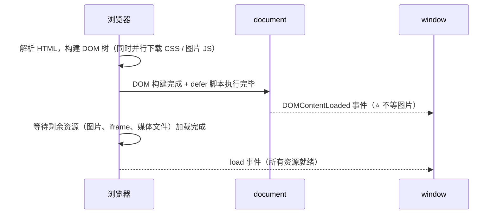

+++
title = "第 29 章 事件类型"
weight = 290
date = "2026-03-24T22:08:00+08:00"
type = "docs"
description = ""
isCJKLanguage = true
draft = false
+++
# 第 29 章 事件类型

如果说事件是 JavaScript 和用户之间的"对讲机"，那事件类型就是不同的"频道"——有的是"点击频道"，有的是"键盘频道"，有的是"表单频道"。不同的事件类型，让你响应不同的用户行为。

## 29.1 鼠标事件

### click / dblclick：单击与双击

```javascript
const button = document.getElementById('myButton');

// 单击
button.addEventListener('click', function(event) {
    console.log('单击了一次');
});

// 双击
button.addEventListener('dblclick', function(event) {
    console.log('双击了');
});
```

### mousedown / mouseup：按下与抬起

鼠标按下和抬起是两个独立的事件，可以用来区分"拖拽开始"和"拖拽结束"。

```javascript
const box = document.getElementById('box');

box.addEventListener('mousedown', function(event) {
    console.log('鼠标按下');
});

box.addEventListener('mouseup', function(event) {
    console.log('鼠标抬起');
});
```

### mousemove：鼠标移动

当鼠标在元素上移动时触发，可以用来实现"鼠标追踪"等效果。

```javascript
const area = document.getElementById('moveArea');

area.addEventListener('mousemove', function(event) {
    console.log('鼠标位置：', event.clientX, event.clientY);
});
```

### mouseenter / mouseleave：不冒泡，不重复触发

```javascript
const box = document.getElementById('box');

// mouseenter：鼠标进入元素时触发（不冒泡）
box.addEventListener('mouseenter', function(event) {
    console.log('鼠标进入了');
    this.style.backgroundColor = 'lightblue'; // 变蓝
});

// mouseleave：鼠标离开元素时触发（不冒泡）
box.addEventListener('mouseleave', function(event) {
    console.log('鼠标离开了');
    this.style.backgroundColor = '';
});
```

### mouseover / mouseout：冒泡，会重复触发

```javascript
const parent = document.getElementById('parent');
const child = document.getElementById('child');

parent.addEventListener('mouseover', function(event) {
    console.log('mouseover: 鼠标移入了', event.target.id);
});

parent.addEventListener('mouseout', function(event) {
    console.log('mouseout: 鼠标移出了', event.target.id);
});
```

### mouseenter vs mouseleave vs mouseover vs mouseout 对比

| 特性 | mouseenter | mouseleave | mouseover | mouseout |
|------|------------|------------|----------|----------|
| 是否冒泡 | ❌ 不冒泡 | ❌ 不冒泡 | ✅ 冒泡 | ✅ 冒泡 |
| 子元素影响 | 不受子元素影响 | 不受子元素影响 | 受子元素影响 | 受子元素影响 |
| 重复触发 | 离开再进入才触发 | 进入再离开才触发 | 子元素进出会重复触发 | 子元素进出会重复触发 |

```javascript
// mouseenter/mouseleave 更适合做"鼠标悬停高亮"
box.addEventListener('mouseenter', function() {
    this.style.boxShadow = '0 0 10px blue';
});
box.addEventListener('mouseleave', function() {
    this.style.boxShadow = '';
});
```

### contextmenu：右键菜单

```javascript
document.addEventListener('contextmenu', function(event) {
    event.preventDefault(); // 阻止默认右键菜单
    console.log('右键被点击了');
    console.log('位置：', event.clientX, event.clientY);
});
```

### 坐标：clientX / clientY / pageX / pageY / offsetX / offsetY / screenX / screenY

```javascript
document.addEventListener('click', function(event) {
    // 相对于视口的坐标（不包含滚动）
    console.log('clientX/Y:', event.clientX, event.clientY);
    
    // 相对于页面的坐标（包含滚动）
    console.log('pageX/Y:', event.pageX, event.pageY);
    
    // 相对于屏幕的坐标
    console.log('screenX/Y:', event.screenX, event.screenY);
    
    // 相对于元素自身的坐标
    console.log('offsetX/Y:', event.offsetX, event.offsetY);
});
```

### 拖拽元素实现

```javascript
// 一个能真正跑起来的鼠标拖拽实现
// 前提：元素需要 position: absolute / fixed，否则改 left/top 不会动
// 建议再加一句 CSS：user-select: none; 防止拖拽时选中文字
const draggable = document.getElementById('draggable');
let isDragging = false;
let offsetX = 0, offsetY = 0;

draggable.addEventListener('mousedown', function(event) {
  isDragging = true;

  // ⭐ 不要用 offsetLeft 来算偏移！
  // offsetLeft 是相对于 offsetParent 的，而鼠标坐标是相对于视口的，
  // 只要 offsetParent 不在视口左上角，算出来的位置就是错的。
  // 用 getBoundingClientRect() 拿到的才是视口坐标。
  const rect = draggable.getBoundingClientRect();
  offsetX = event.clientX - rect.left;
  offsetY = event.clientY - rect.top;

  // 阻止按下时触发浏览器自带的文本选择 / 图片拖拽
  event.preventDefault();
});

// ⭐ mousemove 监听挂在 document 上，鼠标快速移动跑出元素也不会"掉"
document.addEventListener('mousemove', function(event) {
  if (!isDragging) return;
  draggable.style.left = (event.clientX - offsetX) + 'px';
  draggable.style.top = (event.clientY - offsetY) + 'px';
});

document.addEventListener('mouseup', function() {
  isDragging = false;
});
```

> 💡 **更好的写法是用 Pointer Events**：`pointerdown` / `pointermove` / `pointerup` 一套代码同时支持鼠标、触摸屏和手写笔，还能用 `element.setPointerCapture(e.pointerId)` 把后续事件直接锁定到这个元素上，不用再往 document 上挂监听。做拖拽、画板这类交互时优先考虑它。

下一节，我们来学习键盘事件！

## 29.2 键盘事件

### keydown / keyup / keypress（已废弃）

```javascript
// keydown：键盘按下时触发
document.addEventListener('keydown', function(event) {
    console.log('按键按下：', event.key);
});

// keyup：键盘抬起时触发
document.addEventListener('keyup', function(event) {
    console.log('按键抬起：', event.key);
});

// keypress：已废弃，不推荐使用
// 这个事件在 keydown 之后、keyup 之前触发，但已经被废弃
```

### e.key vs e.code：按键值 vs 物理键代码

```javascript
// key：返回按键的实际值（考虑大小写、语言）
// code：返回物理键代码（不考虑大小写、语言）

document.addEventListener('keydown', function(event) {
    console.log('key:', event.key);     // 'a' 或 'A'
    console.log('code:', event.code);   // 'KeyA'
});
```

```javascript
// 常见按键的 event.key 取值（注意是"名字"，不是字符）
// 字母/数字：'a'、'A'、'1'
// 功能键：'Enter'、'Escape'、'Tab'、'Backspace'、'ArrowUp'、' '
// 空格键的 key 是 ' '（一个空格），不是 'Space'！

document.addEventListener('keydown', function(event) {
  if (event.key === 'Escape') {
    console.log('按下 ESC，关闭弹窗');
  }
  if (event.key === 'Enter') {
    console.log('按下回车，提交');
  }

  // 组合键：Ctrl/Cmd + S 保存
  if ((event.ctrlKey || event.metaKey) && event.key.toLowerCase() === 's') {
    event.preventDefault();   // 阻止浏览器默认的"保存网页"
    console.log('执行自定义保存');
  }

  // e.repeat 表示这是"按住不放"产生的重复触发
  if (event.repeat) return;
});
```

> ⚠️ **处理中文等输入法时必须小心 `keydown`**：
> 用拼音输入法打字时，`keydown` 会先收到一堆字母（`n`、`i`、`h`、`a`、`o`……），
> 此时 `event.isComposing` 为 `true`。如果你在这里做实时校验或阻止默认行为，会打断输入法。
>
> ```javascript
> input.addEventListener('keydown', (event) => {
>   if (event.isComposing) return;   // 正在拼字，什么都别做
>   // ... 正常处理
> });
>
> // 更完整的方式是监听输入法的组成事件：
> input.addEventListener('compositionstart', () => { console.log('开始拼字'); });
> input.addEventListener('compositionend', (e) => { console.log('拼字结束，最终内容：', e.data); });
> ```

### e.ctrlKey / e.shiftKey / e.altKey / e.metaKey：修饰键

```javascript
document.addEventListener('keydown', function(event) {
    // Ctrl 键
    if (event.ctrlKey) {
        console.log('Ctrl + ' + event.key);
    }
    
    // Shift 键
    if (event.shiftKey) {
        console.log('Shift + ' + event.key);
    }
    
    // Alt 键
    if (event.altKey) {
        console.log('Alt + ' + event.key);
    }
    
    // Command 键（Mac）
    if (event.metaKey) {
        console.log('Command + ' + event.key);
    }
});
```

下一节，我们来学习表单事件！

## 29.3 表单事件

### focus / blur：不冒泡

```javascript
const input = document.getElementById('myInput');

// focus：获得焦点时触发
input.addEventListener('focus', function(event) {
    console.log('输入框获得焦点');
    this.style.borderColor = 'blue';
});

// blur：失去焦点时触发
input.addEventListener('blur', function(event) {
    console.log('输入框失去焦点');
    this.style.borderColor = '';
});
```

### focusin / focusout：冒泡

```javascript
const form = document.getElementById('myForm');

// focusin：在表单内任意元素获得焦点时触发（冒泡）
form.addEventListener('focusin', function(event) {
    console.log('表单内元素获得焦点：', event.target.id);
});

// focusout：在表单内任意元素失去焦点时触发（冒泡）
form.addEventListener('focusout', function(event) {
    console.log('表单内元素失去焦点：', event.target.id);
});
```

### focus vs focusin 对比

| 特性 | focus | focusin |
|------|-------|---------|
| 是否冒泡 | ❌ 不冒泡 | ✅ 冒泡 |
| 适合场景 | 单一元素 | 表单整体 |

### input：输入时实时触发

```javascript
const input = document.getElementById('myInput');

input.addEventListener('input', function(event) {
    console.log('输入了：', this.value);
    console.log('输入内容长度：', this.value.length);
});
```

### change：值改变并且"确认"之后触发

```javascript
const input = document.getElementById('myInput');

input.addEventListener('change', function(event) {
    console.log('值改变了：', this.value);
});
```

> ⚠️ **`change` 的触发时机因控件而异，这点经常把初学者绕晕**：
>
> | 控件 | 什么时候触发 `change` |
> |------|----------------------|
> | 文本框 / 文本域 | 值**确实变了**，且元素**失去焦点**（或按回车触发提交）时 |
> | 下拉框 `select` | 选项一变就立刻触发，不用失焦 |
> | 复选框 / 单选框 | 勾选状态一变就立刻触发 |
> | 日期、颜色选择器 | 选好之后立刻触发 |
>
> 所以"想要实时响应每一次按键"要用 `input`，"只关心最终确认的结果"才用 `change`。
> 另外，脚本直接改 `input.value` **不会**触发任何事件——需要自己手动派发。

### submit / reset：表单提交与重置

```javascript
const form = document.getElementById('myForm');

form.addEventListener('submit', function(event) {
    event.preventDefault(); // 阻止表单提交
    console.log('表单提交了');
    console.log('表单数据：', new FormData(this));
});

form.addEventListener('reset', function(event) {
    event.preventDefault();
    console.log('表单重置了');
});
```

下一节，我们来学习资源与视图事件！

## 29.4 资源与视图事件

### load / DOMContentLoaded：资源加载完成

```javascript
// DOMContentLoaded：DOM 构建完成时触发（不等待外部资源）
document.addEventListener('DOMContentLoaded', function() {
    console.log('DOM 已加载完成');
});

// load：所有资源（包括图片、CSS等）都加载完成时触发
window.addEventListener('load', function() {
    console.log('页面所有资源都加载完成了');
});
```

### DOMContentLoaded vs load 先后顺序



> ⚠️ 注意图中的关键差别：
> - `DOMContentLoaded` 只等 **DOM 树 + `defer` 脚本**，**不等图片和 iframe**；
> - `load` 要等页面上**所有资源**（图片、样式、iframe、媒体）都加载完；
> - 所以 `DOMContentLoaded` **一定早于或等于** `load`，页面越重两者间隔越大。
> - 如果页面上有普通的（非 defer/async）`<script>`，它必须下载并执行完才能继续解析 HTML，
>   这会同时推迟这两个时间点。

```javascript
// 常用写法：脚本放在 <head> 里时，用 DOMContentLoaded 包一层再操作 DOM
document.addEventListener('DOMContentLoaded', () => {
  // 此时页面元素已经存在，可以放心 querySelector
  document.getElementById('app').textContent = '准备就绪';
});

// 如果需要知道"图片都加载完了没"（比如要拿图片的真实尺寸），才用 load
window.addEventListener('load', () => {
  const img = document.getElementById('hero');
  console.log('图片真实宽度：', img.naturalWidth);
});
```

### scroll：滚动（防抖优化）

```javascript
// 基本用法
window.addEventListener('scroll', function(event) {
    console.log('滚动了，当前位置：', window.scrollY);
});

// ⭐ 优化方案一：requestAnimationFrame 节流
// 滚动事件触发得非常密集（一帧可能好几次），
// 用 rAF 把回调压到"每帧最多一次"，既能保证跟手，又不会浪费性能。
let ticking = false;
window.addEventListener('scroll', function() {
  if (ticking) return;
  ticking = true;
  requestAnimationFrame(() => {
    console.log('滚动了（rAF 节流）', window.scrollY);
    ticking = false;
  });
}, { passive: true });   // ⭐ passive 让浏览器不必等回调结束就能滚动

// ⭐ 优化方案二：防抖（debounce）
// 适合"滚动停下来之后才需要计算一次"的场景，比如保存滚动位置。
function debounce(func, delay) {
    let timer = null;
    return function(...args) {
        clearTimeout(timer);
        timer = setTimeout(() => func.apply(this, args), delay);
    };
}

window.addEventListener('scroll', debounce(function() {
    console.log('滚动了（防抖）');
}, 200), { passive: true });

// 💡 节流 vs 防抖怎么选？
// 需要"过程中持续响应"→ 用 rAF 节流；只需要"结束后算一次"→ 用防抖。
```

> ⚠️ **`window` 上的 `scroll` 只监听页面整体滚动**。如果滚动发生在内部容器里
> （比如 `overflow: auto` 的 div，或者 `position: fixed` 的弹层），
> `window` 收不到任何事件，必须把监听挂到那个真正滚动的元素上。

### resize：窗口大小改变（防抖优化）

```javascript
window.addEventListener('resize', debounce(function() {
    console.log('窗口大小改变了');
    console.log('当前尺寸：', window.innerWidth, window.innerHeight);
}, 200));
```

### error：资源加载失败

```javascript
const img = document.getElementById('myImage');

img.addEventListener('error', function(event) {
  console.log('图片加载失败了');

  // ⚠️ 一定要防止无限循环：如果备用图也加载失败，
  // 它会再次触发 error，然后又设置 src …… 浏览器会一直请求下去。
  if (this.dataset.fallbackApplied) return;
  this.dataset.fallbackApplied = '1';
  this.src = 'fallback.png';
});
```

> 📌 **两个容易忽略的点**：
> 1. 资源的 `error` 事件**不冒泡**。想统一监听页面上所有图片的加载失败，必须用捕获阶段：
>    `window.addEventListener('error', handler, true)`。
> 2. 想拿到"是哪个资源失败"，要看 `event.target`；但错误详情（`event.message`、`event.filename`）只在全局脚本错误里才有。

### visibilitychange / document.hidden：页面可见性变化

```javascript
document.addEventListener('visibilitychange', function(event) {
    if (document.hidden) {
        console.log('页面被隐藏了');
        // 停止动画、暂停视频等
    } else {
        console.log('页面可见了');
        // 恢复动画、继续视频等
    }
});
```

> 💡 **为什么推荐用它而不是 `window` 的 `blur` / `focus`？**
> 因为切换标签页、最小化窗口、手机锁屏都会触发 `visibilitychange`，
> 而 `blur` / `focus` 更"敏感"——点一下地址栏、点了开发者工具都会触发，
> 用它来暂停视频会误伤。
>
> 另外 `document.visibilityState` 比 `document.hidden` 信息更全：
> 取值有 `'visible'`、`'hidden'`、`'prerender'`。做"用户离开就暂停"的逻辑时，
> 记得配合 `pagehide` / `pageshow` 处理页面被放进往返缓存（bfcache）的情况。

下一节，我们来学习自定义事件！

## 29.5 自定义事件

### new Event()：创建事件

```javascript
const myEvent = new Event('myCustomEvent', {
    bubbles: true,  // 是否冒泡
    cancelable: true // 是否可取消
});

document.addEventListener('myCustomEvent', function(event) {
    console.log('自定义事件触发了！');
});

document.dispatchEvent(myEvent);
```

> 💡 `bubbles` 的默认值是 `false`。这意味着事件只会派发到"你 `dispatchEvent` 的那个元素"上，
> 不会向上传播——**想让父元素上的事件委托也能收到，必须显式写 `bubbles: true`**。
> `cancelable` 决定这个事件能不能被 `preventDefault()` 取消；默认也是 `false`。

### new CustomEvent()：带数据的事件

```javascript
const myEvent = new CustomEvent('userAction', {
    detail: { name: '小明', action: 'click' }
});

document.addEventListener('userAction', function(event) {
    console.log('事件名：', event.type);
    console.log('携带的数据：', event.detail);
});

document.dispatchEvent(myEvent);
```

### dispatchEvent()：触发事件

```javascript
const button = document.getElementById('myButton');

button.addEventListener('myEvent', function(event) {
    console.log('自定义事件触发了！');
});

// 触发事件
button.dispatchEvent(new Event('myEvent'));
```

```javascript
// dispatchEvent 的返回值：事件是否"没有被取消"
const cancelableEvent = new Event('ask', { cancelable: true });

document.addEventListener('ask', (e) => e.preventDefault());

console.log(document.dispatchEvent(cancelableEvent));  // false（被 preventDefault 了）
console.log(document.dispatchEvent(new Event('never-cancelable')));  // true

// ⭐ 实用场景：自定义事件表示"某个动作能否执行"，
//    外部监听器可以调用 preventDefault() 来"否决"它，
//    发起方根据返回值决定要不要继续：
function beforeSave(data) {
  const ok = form.dispatchEvent(new CustomEvent('before-save', {
    detail: { data },
    cancelable: true,
    bubbles: true
  }));
  if (!ok) return;      // 有人否决了这次保存
  // ... 真正执行保存
}
```

下一节，我们来学习跨文档通信！

## 29.6 跨文档通信

### postMessage / message：不同源间通信

```javascript
// 发送消息：第二个参数是"接收方的来源"，必须写清楚，不要用 '*'
iframe.contentWindow.postMessage('Hello from parent!', 'https://example.com');

// 接收消息
window.addEventListener('message', function(event) {
    // ⭐ 安全检查一：验证发送方来源，否则任何页面都能给你发消息
    if (event.origin !== 'https://example.com') return;

    // ⭐ 安全检查二：如果对方是多个 iframe 中的一个，还要确认是哪一个
    if (event.source !== iframe.contentWindow) return;

    // ⭐ 消息内容必须当成"不可信输入"处理，绝不能直接丢给 innerHTML
    console.log('收到消息：', event.data);
    console.log('来源：', event.origin);
});

// 子页面向父页面回消息
// window.parent.postMessage({ type: 'ready' }, 'https://parent.example.com');
```

> ⚠️ **把 targetOrigin 写成 `'*'` 是常见的安全漏洞**：任何页面都能收到这条消息。
> 只有在确实不关心接收方是谁时才这么写。
> 另外消息内容可以是任意结构化数据（对象、数组等），传输时会通过结构化克隆做一次拷贝——
> 所以接收到的对象和发送方的对象**不是同一个引用**，函数、DOM 节点这类东西传不过去。

### storage 事件：同源标签页间通信

```javascript
// 标签页 A
localStorage.setItem('message', 'Hello from tab A!');

// 标签页 B（在同一个域下）
window.addEventListener('storage', function(event) {
    console.log('key:', event.key);
    console.log('newValue:', event.newValue);
    console.log('oldValue:', event.oldValue);
});
```

> ⭐ **最重要的一条**：`storage` 事件**不会**在"做出修改的那个标签页"里触发，
> 只在**同源的其他标签页/窗口**里触发。上面的例子里，标签页 A 自己收不到这个事件，只有 B 能收到。
>
> 另外几个细节：
> - 触发条件是 `localStorage` 的值**真的发生了变化**；`setItem` 写入相同的值不会触发；
> - `localStorage.clear()` 会触发，此时 `key` 是 `null`；
> - `sessionStorage` 的变更不会触发 `storage` 事件；
> - 页面自己也能收到 `storage` 事件的情况只有一种：同一个页面里的**其他 iframe** 做了修改。

```javascript
// 一个实用的封装：同源标签页之间"广播"一条消息
// 发送方
localStorage.setItem('app-broadcast', JSON.stringify({ type: 'logout', at: Date.now() }));

// 接收方（其他标签页）
window.addEventListener('storage', (event) => {
  if (event.key !== 'app-broadcast' || !event.newValue) return;
  const message = JSON.parse(event.newValue);
  if (message.type === 'logout') {
    console.log('其他标签页已登出，本页也同步退出');
  }
});

// 💡 同一个标签页内通信（不走 localStorage）：用 BroadcastChannel 更清爽
// const channel = new BroadcastChannel('app');
// channel.postMessage({ type: 'logout' });
// channel.onmessage = (e) => console.log('收到广播：', e.data);
```

---

## 本章小结

本章我们学习了各种事件类型：

1. **鼠标事件**：click、dblclick、mousedown、mouseup、mousemove、mouseenter、mouseleave、mouseover、mouseout、contextmenu。
2. **键盘事件**：keydown、keyup、keypress（废弃）、event.key vs event.code、修饰键。
3. **表单事件**：focus、blur、focusin、focusout、input、change、submit、reset。
4. **资源与视图事件**：load、DOMContentLoaded、scroll、resize、error、visibilitychange。
5. **自定义事件**：new Event()、new CustomEvent()、dispatchEvent()。
6. **跨文档通信**：postMessage、storage 事件。

补充一些实战中容易被忽略的点：

- **拖拽**不要用 `offsetLeft` 算偏移（它相对的是 `offsetParent`），要用 `getBoundingClientRect()`；更现代的做法是 Pointer Events + `setPointerCapture()`。
- **`change` 的时机因控件而异**：文本框要失焦才触发，下拉框和复选框立刻触发；要实时响应请用 `input`。
- **`input.value` 被脚本直接赋值时不会触发任何事件**。
- **资源的 `error` 事件不冒泡**，想在 window 上统一捕获必须用捕获阶段；替换备用图时要防止无限循环。
- **`scroll` 只监听页面整体滚动**，内部滚动容器要单独监听；高频事件记得用 rAF 节流或防抖，并加上 `passive: true`。
- **`DOMContentLoaded` 不等图片，`load` 才等全部资源**，`DOMContentLoaded` 一定不晚于 `load`。
- **自定义事件默认 `bubbles: false`**，要让事件委托收到就必须显式开启；`dispatchEvent` 的返回值表示事件有没有被取消。
- **`storage` 事件不会在修改数据的那一个标签页里触发**，只通知同源的其他标签页；`BroadcastChannel` 是更清爽的替代方案。
- **中文输入法**下要留意 `event.isComposing`，配合 `compositionstart` / `compositionend` 处理拼音拼字过程。

下一章，我们要学习网络请求——让 JavaScript 和服务器"对话"！
