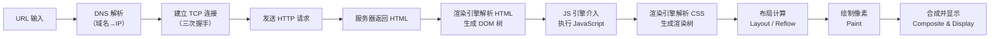
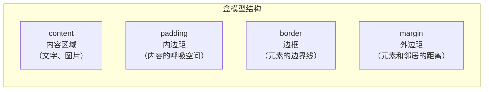
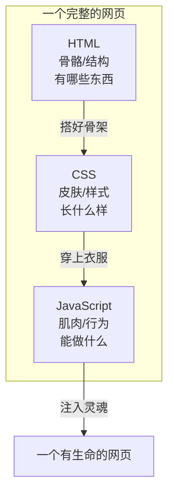
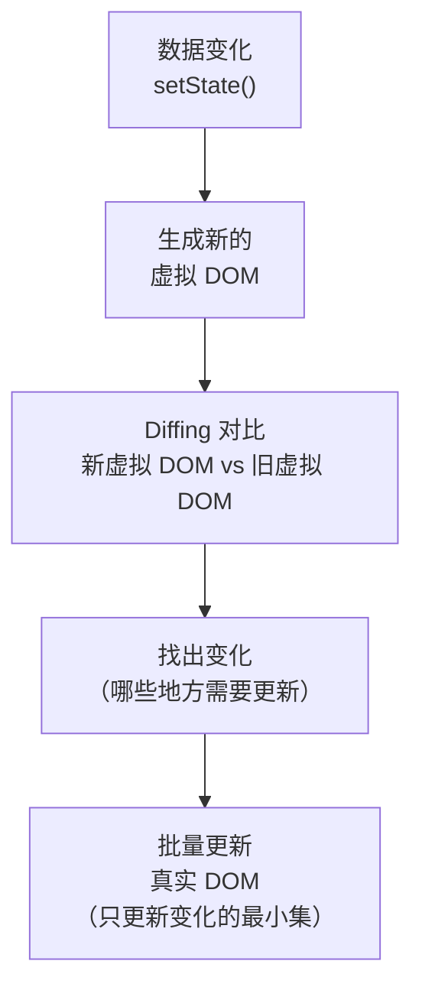

+++
title = "第1章 前端基础与React概述"
weight = 10
date = "2026-03-25T12:56:00+08:00"
type = "docs"
description = ""
isCJKLanguage = true
draft = false
+++


# Chapter-01 - 前端基础与 React 概述

## 1.1 网页是如何工作的

> 你有没有想过，当你往浏览器地址栏里敲下 `www.baidu.com`，按下回车的那一瞬间，到底发生了什么？是什么力量让那些文字、图片、视频神奇地出现在你的屏幕上？是什么让一个"白纸一张"的浏览器变成了一个五彩斑斓的网页？这一切的幕后英雄，就是我们今天要揭开的秘密。

### 1.1.1 浏览器的工作原理：渲染引擎与 JS 引擎

要讲清楚浏览器的工作原理，我们得先请出两位超级英雄——**渲染引擎**和 **JavaScript 引擎**（也叫 JS 引擎）。它们俩的关系，怎么说呢，有点像一对欢喜冤家：配合起来天下无敌，但偶尔也会因为一点小事闹别扭。

#### 渲染引擎：网页的"美容师"

渲染引擎的工作简单来说就是：**把 HTML、CSS 这类"原材料"变成你在屏幕上看到的漂亮页面**。你可以把它想象成一位手艺精湛的美容师，HTML 是骨架，CSS 是化妆品，渲染引擎负责把这两样东西组合起来，画出一张完美的脸。

主流的渲染引擎有以下几位"大佬"：

| 渲染引擎 | 所属浏览器 | 备注 |
|---------|-----------|------|
| **Blink** | Chrome / Edge / Opera | 没错，Edge 早就叛变到 Chromium 阵营了 |
| **WebKit** | Safari | 苹果的亲儿子，性能优秀但更新较慢 |
| **Gecko** | Firefox | Mozilla 的心头宝，开源界的骄傲 |
| **Trident** | 旧版 IE | 远古生物，现在已经基本灭绝 |

> 悄悄话：当年 Trident 还在世的时候，前端开发者写网页有句口头禅——"兼容 IE6"，那简直是噩梦级别的挑战。如今 Trident 已经入土为安，我们要感谢现代浏览器的飞速发展。

#### JavaScript 引擎：网页的"大脑"

如果说渲染引擎是美容师，那 **JavaScript 引擎**就是网页的大脑——它负责执行 JavaScript 代码，让网页变得"聪明"起来。没有 JS 引擎，网页就是一个只会静态展示的花瓶；有了 JS 引擎，网页才能跟你互动、响应你的点击、播放动画、甚至跟你聊天（就像现在的我一样！）。

主流的 JS 引擎有这些：

| JS 引擎 | 所属浏览器 | 你可能听说过的它 |
|--------|-----------|---------------|
| **V8** | Chrome / Node.js | 性能怪兽，Google 出品必属精品 |
| **SpiderMonkey** | Firefox | 历史悠久，最早的 JS 引擎之一 |
| **JavaScriptCore** | Safari | 苹果自研，也叫 Nitro |
| **Chakra** | 旧版 Edge | 已经退役，被 V8 取代 |

#### 两者如何配合？

这里有个关键概念叫**渲染流水线**（Rendering Pipeline），大致流程如下：



你可以把浏览器想成一家餐厅：
- **渲染引擎**是前台的接待员和服务员，负责把"菜单"（HTML/CSS）展示给你看
- **JS 引擎**是后厨的大厨，负责根据你的"特殊要求"（JS 代码）现场制作"菜品"

客人进门 → 前台领位（解析 HTML）→ 服务员摆盘（上样式）→ 大厨做菜（执行 JS）→ 你吃到了热腾腾的网页！🍳

> 小知识：Chrome 浏览器实际上是**多进程架构**。渲染进程负责页面渲染，JS 引擎运行在渲染进程中。而 Node.js 则是**V8 引擎 + libuv（处理 I/O）**的组合，所以 Node 能跑 JS 不奇怪，它把 V8 直接搬过来用了。

#### 渲染引擎和 JS 引擎会"打架"吗？

会的！而且有一个专门的名词叫**"渲染阻塞"**（Render Blocking）和**"脚本阻塞"**（Script Blocking）。

JavaScript 在执行时默认会阻塞 DOM 的构建——简单说就是：JS 引擎在工作的时候，渲染引擎得在旁边"稍等片刻"，因为 JS 代码可能会修改 DOM 结构。这种等待如果太多太久，页面就会出现白屏或卡顿。

React 等现代框架为什么要"虚拟 DOM"？为什么要强调"不要在渲染函数里做复杂计算"？根本原因就在这里——**让 JS 引擎和渲染引擎和谐共处，别让它们打架**。关于这一点，我们后面会详细展开。

### 1.1.2 HTML 的结构：标签、元素、属性

如果说网页是一栋房子，那 **HTML** 就是这栋房子的**建筑蓝图**。它告诉浏览器：这栋房子有几层楼（`<html>`），每个房间在什么位置（`<div>`），门口挂什么牌子（`<a>`），桌上摆什么物品（``）。

#### 标签（Tag）：HTML 的基本单元

HTML 的核心是**标签**，也叫**标记**。标签通常成对出现，像这样：

```html
<p>这是一段文字</p>
```

- `<p>` 叫**开始标签**（Opening Tag）
- `</p>` 叫**结束标签**（Closing Tag）
- 两者夹着的内容叫**标签的内容**（Content）

也有"单打独斗"的标签，叫做**自闭合标签**（Self-closing Tag），比如：

```html

<br />
<hr />
<input type="text" />
```

> 小段子：一个程序员去相亲，对方问："你平时有什么爱好？"程序员说："写 HTML。"对方："HTML 是什么？"程序员："就是成双成对的东西。比如 `<div>` 和 `</div>`，永远在一起。"对方："……那你有没有想过一个人？"程序员："没有，`</body>` 之前都要有 `</html>`，我从不落单。" 🤦

#### 元素（Element）：标签 + 内容 = 元素

一个完整的 HTML 元素长这样：

```html
<h1 class="title" id="main-title">Hello, World!</h1>
```

- `<h1>` 开始标签
- `class="title"` 属性
- `id="main-title"` 属性
- `Hello, World!` 内容
- `</h1>` 结束标签

这几样合在一起，才叫一个完整的**元素**。

#### 属性（Attribute）：元素的"身份证信息"

属性用来给元素添加额外的描述信息，就像给你的身份证加上地址、血型、签名一样。属性写在开始标签里，格式是：

```html
<标签名 属性名="属性值" 另一个属性名="另一个值">
```

常见属性有哪些？

```html
<!-- id：元素的唯一身份证号 -->
<div id="container">

<!-- class：元素的"班级"名，一个元素可以属于多个班级 -->
<div class="header home-page">

<!-- src：图片、视频、音频的来源地址 -->


<!-- href：跳转链接的目标地址 -->
<a href="https://www.google.com">去 Google 串门</a>

<!-- alt：图片的备用文字说明（给搜索引擎和视障人士看） -->


<!-- style：直接写 CSS 样式（不推荐，但有时候很方便） -->
<p style="color: red; font-size: 20px;">我是红色的字</p>

<!-- data-*：自定义数据属性，React 中经常用到 -->
<div data-user-id="12345" data-role="admin">管理员你好</div>
</div>
```

> 友情提示：`data-*` 属性超级重要，在 React 里你经常会看到类似 `data-id={item.id}` 这样的写法，它是连接 DOM 和 JS 数据的桥梁之一。

#### HTML 文档的基本结构

一个标准的 HTML 页面长这样：

```html
<!DOCTYPE html>
<!-- 告诉浏览器：这是一份 HTML5 文档，请用现代标准渲染我！ -->
<html lang="zh-CN">
  <!-- 这里是网页的"头部"，给浏览器和搜索引擎看的内容 -->
  <head>
    <meta charset="UTF-8" />
    <!-- charset：字符编码，UTF-8 几乎能表示地球上所有文字 -->
    <meta name="viewport" content="width=device-width, initial-scale=1.0" />
    <!-- viewport：让手机浏览器也知道如何缩放页面 -->
    <title>我的第一个网页</title>
    <!-- title：浏览器标签页上显示的文字，也是搜索引擎的标题 -->
  </head>

  <!-- 这里是网页的"身体"，真正显示给用户看的内容都在这 -->
  <body>
    <h1>欢迎来到我的网页！</h1>
    <p>这是一段文字，你可以在这里写任何内容。</p>
    
    <a href="https://example.com">点击这里去别的地方逛逛</a>
  </body>
</html>
```

把这段代码保存为 `index.html`，用浏览器打开，你人生中第一个网页就诞生了！虽然它丑得可能让你想哭，但它是你的第一个孩子，请珍惜它。😭

#### 常见的 HTML 标签家族

| 标签 | 作用 | 日常"座右铭" |
|-----|------|------------|
| `<div>` | 无所事事、专门用来分区的"工具人" | "我没啥功能，但我哪儿都能放" |
| `<p>` | 段落，一段独立的文字 | "段落就是我，我就是段落" |
| `<a>` | 链接，点击能跳转到其他页面 | "世界那么大，我想去链接里看看" |
| `` | 图片，展示一张图片 | "一图胜千言，但我不会动" |
| `<ul>/<ol>` | 无序列表 / 有序列表 | "我们是一群排队的小点" |
| `<button>` | 按钮，用户可以点击 | "按我按我按我！" |
| `<input>` | 输入框，用户可以输入文字 | "把你的秘密告诉我" |
| `<span>` | 行内文字容器，一小段文字的"保镖" | "我不换行，我只是个安静的文字容器" |

### 1.1.3 CSS 的作用：选择器、盒模型、布局基础

如果说 HTML 是网页的**骨架**，那 **CSS** 就是网页的**衣服和化妆品**。没有 CSS，网页就是一个光溜溜的骨架，看起来苍白无力、毫无美感。有了 CSS，骨架才能变成走在时装周上的超模。

#### CSS 是什么？

CSS 的全称是 **Cascading Style Sheets**（层叠样式表）。名字里有个"层叠"（Cascading），意思是**样式可以叠加，后面的可以覆盖前面的**，就像画画一样，一层层往上叠加色彩。

CSS 的基本语法非常简单，一看就会：

```css
/* 选择器 { 属性: 值; } */
h1 {
  color: red;           /* 文字颜色变红 */
  font-size: 48px;      /* 字体大小 48 像素 */
  text-align: center;   /* 文字居中对齐 */
}
```

#### 选择器（Selector）：谁来穿这件衣服？

CSS 的第一步是**找到你要打扮的元素**，这一步叫做"选择"。选择的方式有很多种，就像你去商场买衣服，可以按尺码选、按颜色选、按款式选。

```css
/* 1. 标签选择器：所有 h1 都穿这件衣服 */
h1 {
  color: blue;
}

/* 2. class 选择器：所有 class="intro" 的元素都穿这件 */
/* class 用 . 开头，因为 class 是一群人共用的 */
.intro {
  font-size: 20px;
}

/* 3. id 选择器：id="unique" 的那个唯一元素穿这件 */
/* id 用 # 开头，而且 id 是独一无二的，一个页面只能有一个 */
#unique {
  border: 2px solid gold;
}

/* 4. 后代选择器：所有 ul 里面的 li 都穿这件 */
ul li {
  list-style: none;
}

/* 5. 组合选择器：既满足 class="btn" 又是 button 标签的元素 */
button.btn {
  cursor: pointer;
}
```

> 选衣服的比喻：标签选择器就像"所有穿 L 码的人"，class 选择器就像"所有穿红色衣服的人"，id 选择器就像"那个身份证号是 110105199501011234 的人"——独一无二！

#### 盒模型（Box Model）：CSS 的空间哲学

盒模型是 CSS 最核心、最重要、最让新手崩溃的概念之一（别怕，我来拯救你）。

简单来说，**每一个 HTML 元素在页面上都占据一个矩形区域**，这个矩形从内到外由四层组成：



```css
/* 盒模型示例 */
.box {
  /* 内容区：里面的文字或图片 */
  width: 200px;    /* 内容的宽度 */
  height: 100px;  /* 内容的高度 */

  /* 内边距：内容到边框之间的距离（透明的） */
  padding: 20px;  /* 四周统一 20px */
  /* 也可以分别设置：padding-top/right/bottom/left */

  /* 边框：元素的边界线 */
  border: 2px solid #333;  /* 2px 实线 灰色 */
  border-radius: 8px;       /* 圆角 8px */

  /* 外边距：边框到其他元素之间的距离（透明的） */
  margin: 30px;  /* 四周统一 30px */
}
```

> 小技巧：`box-sizing: border-box` 是 CSS 的"作弊码"。加上它之后，`width` 和 `height` 会包含 padding 和 border，让计算变得超级简单！强烈建议在所有项目里都全局加上这个：

```css
/* 强烈推荐！加了这行，盒模型瞬间变友好 */
* {
  box-sizing: border-box;
}
```

#### 布局基础：让元素"排排坐"

CSS 布局经历了三个时代（或者说是"三代掌门"）：

1. **第一代：Display + Position**（古老而经典）
   - `display: block` / `inline` / `inline-block`
   - `position: relative` / `absolute` / `fixed`
   - 优点：简单直接；缺点：复杂布局要写很多代码

2. **第二代：Float + Flexbox**（过渡期）
   - `float` 浮动布局（曾经统治网页多年，但很反人类）
   - `display: flex` 弹性盒模型（2012 年横空出世，拯救了全世界）

3. **第三代：CSS Grid**（现代布局之王）
   - `display: grid` 网格布局（2017 年正式标准，二维布局无敌手）

```css
/* Flexbox 布局示例：让子元素水平居中 */
.flex-container {
  display: flex;
  justify-content: center;  /* 主轴（水平）居中 */
  align-items: center;     /* 交叉轴（垂直）居中 */
  height: 100vh;           /* 全屏高度 */
}

/* Grid 布局示例：经典 12 栏网格 */
.grid-container {
  display: grid;
  grid-template-columns: repeat(12, 1fr);  /* 12 等分栏 */
  gap: 20px;  /* 格子之间的间距 */
}
```

> 记住这个口诀：**Flexbox 适合一维布局（一行或一列），Grid 适合二维布局（行和列都有）**。就像筷子🥢适合夹单根面条，勺子🥄适合舀有深度的东西——工具要用对场合！

### 1.1.4 JavaScript 的角色：让网页"动"起来

HTML 负责结构，CSS 负责样式，而 **JavaScript**（以下简称 JS）负责**行为**——让网页能动起来，能跟你互动，能记住你的选择，能跟服务器"打电话"。

没有 JS 的网页，就像一个精致的博物馆——漂亮，但你只能看，不能摸，不能互动。有了 JS，博物馆就变成了游乐场——你可以按下按钮、触发机关、看到惊喜。

#### JS 能做什么？

答案是：**几乎什么都能做**。

- **操作网页内容**：点击按钮，文字从"点我"变成"点过了！"——JS 能直接修改 HTML 元素的内容。
- **响应用户事件**：鼠标点击、键盘输入、窗口滚动、触摸滑动——JS 都能"听到"并作出反应。
- **发送网络请求**：不用刷新页面，JS 就能跟服务器要数据（AJAX/Fetch）——这就是为什么网页能做到"局部刷新"。
- **存储数据**：浏览器的 LocalStorage 可以让数据在关闭浏览器后依然保留——JS 能读写它。
- **动画效果**：让元素移动、旋转、淡入淡出——JS 配合 CSS 能做出炫酷动画。

```javascript
// 一个经典的 JS 示例：点击按钮，弹出问候语
document.getElementById('greetBtn').addEventListener('click', function() {
  alert('你好呀！欢迎来到 JavaScript 的世界 🎉');
  console.log('按钮被点击了！');  // 打印结果：按钮被点击了！
});

// 用 JS 修改网页内容
document.querySelector('h1').textContent = 'Hello, JavaScript!';
// 上面的代码把 h1 的文字改成了 Hello, JavaScript!

// 用 JS 发送网络请求
fetch('https://api.example.com/data')
  .then(response => response.json())  // 把服务器返回的 JSON 转成 JS 对象
  .then(data => {
    console.log('服务器返回的数据:', data);  // 打印结果：服务器返回的数据: {...}
  });
```

#### JS 在浏览器里是怎么运行的？

我们前面说过，浏览器里有 **JS 引擎**（比如 Chrome 的 V8）。当你打开一个网页时：

1. 浏览器下载 HTML 文件
2. 渲染引擎解析 HTML，遇到 `<script>` 标签就把 JS 代码交给 JS 引擎
3. JS 引擎**从上到下**一条一条执行代码
4. 执行过程中可能触发各种事件（点击、滚动等），这些事件会进入**事件队列**
5. JS 引擎在空闲时会从事件队列里取事件来执行

> 等等！这里有个重要的坑——**JS 是单线程的**。这意味着 JS 引擎一次只能做一件事，不能同时干两件事。所以如果有一段很慢的代码，网页就会"卡住"（专业术语叫"阻塞"）。这也是为什么 React 要强调不要在渲染函数里做耗时操作！

#### JS、HTML、CSS 三兄弟的关系

用一个形象的比喻来结束这一节：

- **HTML** 是网页的**骨骼**，决定了"有什么"
- **CSS** 是网页的**皮肤**，决定了"长什么样"
- **JavaScript** 是网页的**肌肉和神经系统**，决定了"能做什么"



只有三者齐心协力，网页才能成为一个真正有魅力、有灵魂的网页。这，就是前端开发的起点！

---

## 1.2 什么是 React？它解决什么问题？

> 话说 2010 年代初，Facebook 的工程师们正忙着应付一个超级复杂的社交网络——用户量爆炸、功能越来越多、代码越来越乱，维护一个页面的成本比写一个新功能还高。于是，一群人坐在一起，眉头紧锁，开始思考：**能不能有一种方式，让前端代码也能像搭积木一样，模块化、组件化、可复用？** 就这样，React 诞生了。

### 1.2.1 React 的诞生背景与 Meta 的起源

React 最早是 Facebook（现在叫 Meta）的工程师 **Jordan Walke** 在 2011 年捣鼓出来的。最开始用在了 Facebook 的广告系统上——那个页面的复杂度，你懂的，广告主有几十种定向条件、无数种投放策略，代码乱得像一锅粥。

2012 年，Instagram 也被 Facebook 收购了，React 被移植到了 Instagram 的 Web 版本上，效果出奇地好。

2013 年，Facebook 做了一个震惊世界的决定——**把 React 开源了**。免费发布在 GitHub 上，任何人都可以使用和改进。一时间，前端圈沸腾了。

> 小八卦：React 最早叫"FaxJS"，后来改名了——至于为什么改成 React，有一种说法是"reactive"（响应式的）这个词的缩写，暗示 React 的核心理念：数据驱动，视图响应变化。另一个更接地气的说法是：团队里有人随手敲了个 "React"，大家觉得挺顺口，就定了。

React 的诞生，本质上是为了解决一个问题：**如何高效地构建大型、复杂的用户界面？** 传统的方式（直接操作 DOM）在数据频繁变化时简直是噩梦——每次数据变了，都要手动找出哪个 DOM 节点要更新，然后一行一行地改。这在功能少的时候还好，一旦功能多了，代码就变成了一碗"意大利面条"（spaghetti code）。

### 1.2.2 组件化思想：像搭积木一样构建 UI

React 的第一个核心理念是**组件化**（Component-based）。

什么是组件？简单说，**组件就是一段可以被复用的 UI 代码**。它可以是：
- 一个按钮（Button）
- 一个输入框（Input）
- 一张卡片（Card）
- 一个导航栏（Navbar）
- 甚至整个页面（Page）

React 组件的基本结构是这样的：

```jsx
// 一个最简单的 React 组件
function Welcome(props) {
  // props 是从外部传进来的"参数"
  return <h1>你好, {props.name}!</h1>;
  // 这不是 HTML！这是 JSX——React 的语法糖，我们后面会重点讲
}
```

组件化的好处，用大白话说就是：

1. **复用**：同一个按钮组件，写一次，到处用，维护一次就够了
2. **独立**：每个组件都是独立的，不会因为改了 A 组件影响 B 组件
3. **可组合**：大组件可以由小组件组合而成，就像乐高积木

```jsx
// 乐高式的组合：小的组件拼成大的组件

// 先定义几个小积木
function Avatar({ src, alt }) {
  return ;
}

function UserInfo({ name, avatar }) {
  return (
    <div className="user-info">
      <Avatar src={avatar} alt={name} />
      <span className="user-name">{name}</span>
    </div>
  );
}

// 再用小积木搭一个大组件
function Comment({ author, text, date }) {
  return (
    <div className="comment">
      <UserInfo name={author.name} avatar={author.avatar} />
      <p className="comment-text">{text}</p>
      <time className="comment-date">{date}</time>
    </div>
  );
}

// 用的时候就是这样：
<Comment
  author={{ name: '张三', avatar: '/avatars/zhang.jpg' }}
  text="这篇文章写得真棒！"
  date="2024-01-01"
/>
```

> 有趣的比喻：组件就像是餐厅里的"菜品模板"。后厨定义好"宫保鸡丁"的做法，前台服务员只需要说"来一份宫保鸡丁"，后厨就知道该怎么做。如果某天花生涨价了，改一下模板，所有"宫保鸡丁"就都自动更新了——这就是组件化的高效！

### 1.2.3 虚拟 DOM：性能优化的核心机制

这是 React 最广为人知的"黑科技"了。

在说虚拟 DOM 之前，先科普一下 **DOM** 是什么。

DOM 的全称是 **Document Object Model**（文档对象模型）。你可以简单理解为：浏览器把 HTML 文档转换成一颗"树"，树的每个节点是一个 DOM 对象，JS 通过操作这些对象来改变页面。

问题来了——**直接操作真实 DOM 是很慢的**！想象一下，你要在人民大会堂里换一盏灯：
1. 先找到那盏灯在哪（遍历 DOM 树）
2. 拆掉旧灯（移除旧的 DOM 节点）
3. 安装新灯（插入新的 DOM 节点）

如果每次数据变化都要这么"拆灯装灯"，页面早就卡成 PPT 了。

**虚拟 DOM（Virtual DOM）** 就是来解决这个问题的！它的思路非常聪明：

> 不直接操作真实 DOM，而是先在内存里"虚拟地"操作一份 DOM 的副本。操作完了之后，React 会对比新虚拟 DOM 和旧虚拟 DOM 的区别（这个对比的过程叫做 **Diffing**），找出真正需要变化的部分，最后才一次性地把变化应用到真实 DOM 上。



这样做的好处是：
- 减少了对真实 DOM 的直接操作次数
- 对比和计算在内存中进行，速度极快
- 批量更新 DOM，避免了"频繁更新导致页面抖动"的性能问题

> 生活中的例子：虚拟 DOM 就像游戏里的"存档"系统。你要改动游戏世界里的很多东西，不需要实时改真实世界，你先在一个测试环境里模拟所有的改动，对比一下哪些真的需要改，最后才一次性把改动同步到真实世界——这样既高效又安全！

### 1.2.4 单向数据流：让状态管理清晰可控

React 的第四个核心理念是**单向数据流**（Unidirectional Data Flow）。

"单向数据流"听起来很玄乎，其实概念很简单：

> **数据只能从父组件流向子组件，不能从子组件反向传给父组件（除非通过特殊手段）。** 数据流的方向是固定的，从上往下，一级一级地传递。

这个设计是为了**让数据流向清晰可追踪**。当页面出问题的时候，你知道去哪里找数据源头——顺着数据流往上游追溯就行了，不用满世界乱找。

```jsx
// 单向数据流的例子
// 父组件 App 拥有"状态"（state）
function App() {
  const [userName, setUserName] = React.useState('小明');
  // userName 是状态，setUserName 是更新状态的函数

  return (
    <div>
      {/* 把数据往下传给子组件 */}
      <Navbar username={userName} />
      {/* 传一个更新函数下去，让子组件有机会"请求"修改数据 */}
      <Profile name={userName} onNameChange={setUserName} />
    </div>
  );
}

// 子组件 Navbar 接收 props
function Navbar({ username }) {
  return (
    <nav>
      <span>欢迎, {username}!</span>
    </nav>
  );
}

// 子组件 Profile 接收 props 和更新函数
function Profile({ name, onNameChange }) {
  return (
    <div>
      <p>当前名字: {name}</p>
      {/* 用户输入框变化时，调用父组件传下来的更新函数 */}
      <input
        value={name}
        onChange={e => onNameChange(e.target.value)}
        placeholder="输入新名字"
      />
    </div>
  );
}
```

在上面的例子里：
- `userName` 状态在 `App` 组件里
- `App` 把 `username` 和 `onNameChange` 作为 props 传给子组件
- 子组件只能**读取**和**"请求修改"**（通过调用回调函数），不能直接修改父组件的状态
- 数据的拥有者是 `App`，修改数据的权力也在 `App`

这样做的好处就是：**数据的所有者和修改者永远是同一个地方**，追踪问题轻而易举。

> 类比：单向数据流就像微信的"转账"——你不能从对方的账户里"偷钱"，你只能发起转账请求，对方同意并确认之后，钱才会从他的账户转到你的账户。整个过程有记录、可追溯、安全可控。🔒

---

## 1.3 前端框架三分天下：React vs Vue vs Angular

> 话说 2014 年，前端江湖风云变幻。React 刚刚开源一年，Vue 还只是个名不见经传的新秀，Angular 则顶着 Google 的光环横空出世。前端开发者们陷入了世纪难题：**我该学哪个框架？**

### 1.3.1 三大框架的核心理念对比

| 对比维度 | React | Vue | Angular |
|---------|-------|-----|---------|
| **出生年份** | 2011/2013 开源 | 2014 | 2010（AngularJS）/ 2016（Angular 2+） |
| **亲爹** | Meta（Facebook） | 尤雨溪（个人开发者，一个人肝出来的！）| Google |
| **语言** | JSX（JavaScript 语法扩展） | 单文件组件（`.vue`），模板 + JS + CSS 在一起 | TypeScript 强制的，面向企业 |
| **学习曲线** | 中等（JSX 需要适应） | 友好（像写 HTML 一样写模板） | 陡峭（概念很多，RxJS、依赖注入等） |
| **生态** | 庞大（第三方库超多） | 完善（官方维护得比较好） | 完整（官方全家桶，什么都有） |
| **灵活性** | 超高（只管视图，其他自己选） | 中等（官方有推荐但不强求） | 低（官方什么都定好了，按规矩来就行） |
| **适合场景** | 各种场景，尤其是复杂交互 | 中小型项目，体验好 | 大型企业级应用 |

### 1.3.2 React 的优势：生态、社区、灵活性

React 之所以能成为目前使用最广泛的前端框架，有以下几个原因：

**1. 生态超级庞大**

React 本身只负责视图层（View），其他的东西（路由、状态管理、网络请求等）都交给了社区。看起来是缺点，实际上是巨大的优点——因为你可以自由选择最适合你项目的工具，而不是被框架绑死。

- **状态管理**：Redux、Zustand、Jotai、MobX……总有一款适合你
- **路由**：`react-router` 是事实标准
- **UI 组件库**：Ant Design、Material UI、Chakra UI……应有尽有
- **构建工具**：Vite、Next.js（SSR）、Remix……任你挑选

**2. 社区超级活跃**

React 的社区大到你无法想象。Stack Overflow 上 React 相关的问题数量常年霸榜，GitHub 上 React 的 star 数高达二十多万，各种教程、博客、视频多如牛毛。学 React 的过程中遇到问题？百度/Google 一下，99% 的问题都能找到答案。

**3. 灵活性——没有"正确答案"**

React 的哲学是：**给你最小的约束，最大的自由。** 它不会告诉你"你必须这样做"，而是告诉你"这个工具可以这样用，怎么组织代码是你的事"。这种灵活性对于有经验的大型团队来说简直是福音。

### 1.3.3 React 的劣势：学习曲线、版本变迁

说了这么多优点，也得谈谈 React 的"槽点"：

**槽点一：学习曲线**

React 的核心概念（虚拟 DOM、JSX、Hooks、Context 等）本身不难，但把这些概念组合起来解决问题的方式多种多样，对于新手来说容易产生"我该怎么做"的困惑。再加上 React 没有官方的状态管理方案，新手往往会在 Redux 和各种 Hook 之间迷失方向。

**槽点二：版本变迁太快**

React 从 Class 组件到 Hooks，从 Redux 到各种轻量方案，从 CRA（Create React App）到 Vite，版本更迭的速度让很多人吐槽："刚学会这个，框架又变了！"

- 2013 年：React 发布（Class 组件时代）
- 2019 年：React Hooks 发布（Hooks 时代开启）
- 2020 年：React 17 发布（代号"Tahoe"，主要做渐进式升级）
- 2022 年：React 18 发布（并发渲染、Suspense 正式登场）
- 2024 年：React 19 发布（Server Components、ref 作为 prop……）

**槽点三：TypeScript 支持不够原生**

React 最初是用原生 JS 写的，虽然后来添加了 TypeScript 类型定义，但相比 Angular（从第一天就 TypeScript-first），React 对 TypeScript 的支持总有点"后来添加"的感觉。好消息是，随着 React 19 的发展，TypeScript 集成的体验在不断改善。

> 总的来说，**React 就像一把瑞士军刀**——功能强大、灵活多变、社区庞大，但需要你花点时间去熟悉每一把刀的用法。一旦你熟练掌握了，它能帮你解决几乎所有前端问题！🛠️

---

## 本章小结

本章我们从零开始，认识了前端世界的"三位一体"——HTML（结构）、CSS（样式）、JavaScript（行为）。

- **HTML** 是网页的骨架，用标签和属性构建页面的基本结构
- **CSS** 是网页的化妆品，用选择器找到元素，用盒模型管理空间，用各种布局方式让元素各就各位
- **JavaScript** 是网页的大脑和肌肉，让网页能动起来，能响应用户的操作

而 **React** 则是站在这三者肩膀上的视图层框架，它用组件化思想、虚拟 DOM 机制和单向数据流三大法宝，解决了传统前端开发中代码难维护、DOM 操作性能差、数据流向混乱的问题。

React 并不是唯一的选择，但它确实是目前生态最活跃、社区最庞大、灵活性最高的选择。这也是为什么我们选择了 React 作为这本教程的主角。

下一章，我们将安装好 Node.js 和包管理器，为 React 开发准备好一切工具！

> 🚀预告：第二章——没有 Node.js，你连 React 的门槛都迈不进去！所以赶紧准备好你的"武器"，我们马上出发！