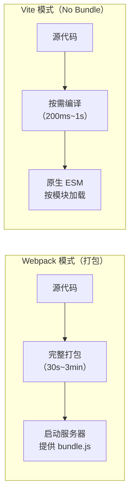

+++
title = "第4章 第一个React项目——Vite与React 19"
weight = 40
date = "2026-03-25T12:56:00+08:00"
type = "docs"
description = ""
isCJKLanguage = true
draft = false
+++


# Chapter-04 - 第一个 React 项目——Vite + React 19

## 4.1 为什么选 Vite？

> 在正式开始写代码之前，我们先来聊聊为什么是 Vite。可能有些同学听说过 Webpack，这个老牌构建工具曾经统治前端江湖近十年。而 Vite 是 2020 年才诞生的"小鲜肉"，但它一出场就以"闪电般的速度"征服了无数开发者。

### 4.1.1 Vite vs Webpack vs CRA：速度对比

在 React 项目构建工具的世界里，有三个主要的"门派"：

**Webpack**：前端构建工具的"老大哥"，2009 年诞生，配置极其灵活，但学习曲线陡峭，配置复杂时能让人怀疑人生。

**Create React App（CRA）**：Facebook 官方出品的 React 项目脚手架，特点是"零配置"，一行命令就能创建一个 React 项目。但问题是，随着项目变大，它背后的 Webpack 配置变得非常慢。

**Vite**：由 Vue.js 的作者尤雨溪开发的下一代构建工具，核心思路是"利用浏览器的原生 ES 模块支持，按需编译"，速度快到离谱。

**速度对比（冷启动时间，1000 个组件的项目）：**

| 构建工具 | 冷启动时间 | 开发体验 |
|---------|-----------|---------|
| Webpack | 30s ~ 3min（项目越大越慢） | 慢，热更新也慢 |
| CRA | 20s ~ 1min | 一般，热更新尚可 |
| **Vite** | **200ms ~ 1s** ⚡ | 极快，热更新几乎是瞬间 |

> 搞笑比喻：Webpack 就像坐绿皮火车去北京，Vite 就像坐高铁去北京。目的地一样，但体验完全不在一个层次！

### 4.1.2 Vite 原理：ESM 按需编译 + HMR

Vite 为什么这么快？它的核心原理有两点：

**1. ESM 按需编译（Native ESM）**

传统打包工具（Webpack）的工作方式是：**先把所有源代码打包成一个（或几个）巨大的 bundle 文件，然后才启动开发服务器**。想象一下你要装修一栋 100 层的大楼，得先把整栋楼的图纸都画完才能开始施工。

Vite 的做法是：**不打包！直接用浏览器的原生 ES Module（ESM）来加载源代码。** 浏览器需要什么模块，Vite 就实时编译什么模块。像点外卖一样——你要一份炒饭，就只做一份炒饭，而不是先做完整桌酒席再端上来。



**2. 热模块替换（Hot Module Replacement，HMR）**

当你的代码发生改变时，Vite 只需要重新编译**发生变化的那一个模块**，然后通过 WebSocket 告诉浏览器"这部分代码变了，你更新一下"，浏览器再局部替换。整个过程几乎是瞬间完成，页面状态还能保留！

对比 Webpack 的热更新：改动一个文件，可能要重新打包整个项目，然后刷新整个页面。

> 生活类比：Webpack 就像改装修方案就要把整栋楼推倒重建，Vite 就像只换掉坏掉的那块砖。

---

## 4.2 创建 React 19 项目

好了，废话不多说，我们马上开始创建第一个 React 19 项目！

### 4.2.1 命令行创建：`npm create vite@latest my-app -- --template react`

打开你的终端（Windows 用 PowerShell，macOS/Linux 用 Terminal），依次执行以下命令：

```bash
# 第一步：使用 Vite 创建项目
# npm create vite@latest：调用 npm 执行 create-vite 包，@latest 表示用最新版本
# my-app：项目名称（可以改成你喜欢的任意名字）
# -- --template react：这里用了两个短横线（--），各有不同含义：
#   第一个 --（create 前）：是 npm create 的标准分隔符，告诉 npm "后面的都是参数"
#   第二个 --（template 前）：是 create-vite 自己的参数分隔符，表示"接下来是 create-vite 的选项"
#   --template react：指定使用 React 模板（不写这部分会进入交互式菜单，让你手动选择框架）
npm create vite@latest my-app -- --template react

# 运行后会看到类似这样的输出：
# ? Select a framework: react
# ? Select a variant: react
# Scaffolding project in ./my-app...
# Done! Now run:
#   cd my-app
#   npm install
#   npm run dev

# 第二步：进入项目目录
cd my-app

# 第三步：安装依赖（npm 会根据 package.json 自动下载所有需要的包）
npm install
# 打印结果示例：
# added 125 packages in 8s   （安装完成，总共 125 个包）

# 第四步：启动开发服务器！
npm run dev
# 打印结果示例：
#   VITE v5.0.0  ready in 320 ms
#
#   ➜  Local:   http://localhost:5173/
#   ➜  Network: use --host to expose
#   ➜  press h + enter to show help
```

> 🎉 看到 `http://localhost:5173/` 了吗？打开浏览器，访问这个地址，你的第一个 React 项目就跑起来了！

### 4.2.2 创建后的目录结构全解

项目创建好了之后，你的 `my-app` 目录大概长这样：

```
my-app/
├── public/              # 静态资源目录（不会被构建工具处理）
│   └── vite.svg         # Vite 的 logo 图片
│
├── src/                 # 源代码目录（你的代码都在这里！）
│   ├── assets/           # 资源文件夹（图片、字体等会被 Vite 处理）
│   │   └── react.svg     # React 的 logo
│   ├── App.css           # App 组件的样式文件
│   ├── App.jsx           # App 组件（主组件）
│   ├── index.css          # 全局样式文件
│   └── main.jsx          # 入口文件（React 应用的起点！）
│
├── index.html            # 入口 HTML 文件（浏览器的访问起点）
├── package.json          # 项目配置文件（依赖、脚本命令）
├── vite.config.js       # Vite 配置文件
└── README.md             # 项目说明文件
```

> 📁 解释一下最关键的两个文件：`main.jsx` 是 React 应用的入口，相当于 Java 里的 `main` 方法；`index.html` 是浏览器加载的第一个 HTML 文件，`<script type="module" src="/src/main.jsx">` 标签会把 `main.jsx` 引进来。

### 4.2.3 启动开发服务器：npm run dev

项目创建完成后，每次开发时只需要运行：

```bash
npm run dev
```

开发服务器会在 `http://localhost:5173` 启动。任何代码改动，Vite 都会自动检测并热更新，浏览器会自动刷新（或者局部更新）。

> 💡 小技巧：
> - 如果 `npm run dev` 提示"端口被占用"，说明 5173 端口已经被其他程序占用了。你可以加 `-- --port 3000` 参数换端口：`npm run dev -- --port 3000`
> - 如果想在本局域网内访问（比如用手机测试），加上 `--host` 参数：`npm run dev -- --host`

### 4.2.4 第一个组件：App.jsx 的结构

打开 `src/App.jsx`，你看到了什么？让我来给你逐行解读：

```jsx
// src/App.jsx
// 第一行：引入 React（React 17 之后，在 JSX 文件里其实可以省略这行，但保留它是好习惯）
import { useState } from 'react'
import reactLogo from './assets/react.svg'  // 引入图片资源
import './App.css'                           // 引入样式文件
import viteLogo from '/vite.svg'            // 引入 public 目录下的静态资源

// 第二步：定义 App 函数组件
function App() {
  // useState 是 React 的 Hook，用来创建"状态"
  // count 是状态的值，setCount 是用来修改状态的方法
  const [count, setCount] = useState(0)

  // 第三步：返回 JSX——这就是组件的"样子"
  return (
    <div className="App">
      {/* JSX 注释这样写 */}
      <header className="App-header">
        {/* img 标签：显示 React logo */}
        
        {/* p 标签：显示计数 */}
        <p>
          Hello Vite + React!
        </p>
        {/* p 标签：显示当前 count 的值 */}
        <p>
          <button onClick={() => setCount((count) => count + 1)}>
            count is: {count}
          </button>
        </p>
        <p>
          Edit <code>src/App.jsx</code> and save to test HMR
        </p>
      </header>
    </div>
  )
}

// 第四步：导出组件，让其他文件可以引入它
export default App
```

> 🎯 核心流程记住：引入 → 定义函数 → 返回 JSX → 导出。万事开头难，后面的组件都是这个套路！

---

## 4.3 项目配置文件详解

### 4.3.1 package.json：项目元数据与 scripts

`package.json` 是 Node.js 项目的"身份证"，包含了项目的名称、版本、依赖、脚本命令等信息。

```json
{
  "name": "my-app",              // 项目名称
  "private": true,               // 私有项目（防止意外 npm publish）
  "version": "0.0.0",            // 项目版本号（语义化版本：主版本.次版本.修订号）
  "type": "module",              // ES 模块化项目（重要！ESM 模式下 .js 文件被认为是 ES 模块）
  "scripts": {                   // 脚本命令（核心！）
    "dev": "vite",              // npm run dev -> 启动开发服务器
    "build": "vite build",      // npm run build -> 构建生产版本
    "lint": "eslint .",         // npm run lint -> 代码检查
    "preview": "vite preview"    // npm run preview -> 预览生产构建结果
  },
  "dependencies": {              // 生产依赖（项目运行时需要）
    "react": "^19.0.0",         // React 核心库（React 19！）
    "react-dom": "^19.0.0"      // React DOM 渲染库
  },
  "devDependencies": {           // 开发依赖（仅开发时需要）
    "@types/react": "^19.0.0", // React 的 TypeScript 类型定义
    "@types/react-dom": "^19.0.0",  // React DOM 的类型定义
    "@vitejs/plugin-react": "^4.2.1", // Vite 的 React 插件
    "eslint": "^8.55.0",        // 代码检查工具
    "eslint-plugin-react": "^7.33.2",  // ESLint 的 React 插件
    "eslint-plugin-react-hooks": "^4.6.0",  // 检查 React Hooks 规则的插件
    "eslint-plugin-react-refresh": "^0.4.5",  // 检查 HMR 安全性的插件
    "vite": "^5.0.8"           // Vite 构建工具
  }
}
```

> 📝 补充：`"type": "module"` 这个字段非常重要！它告诉 Node.js，这个项目使用的是 ES Module 语法（import/export），而不是 CommonJS 语法（require/module.exports）。

### 4.3.2 vite.config.js/ts：Vite 构建配置（基础）

`vite.config.js` 是 Vite 的配置文件，用来定制 Vite 的构建行为。

```javascript
// vite.config.js
import { defineConfig } from 'vite'        // Vite 提供的配置函数
import react from '@vitejs/plugin-react'   // Vite 的 React 插件（支持 JSX、Fast Refresh）

// defineConfig 是一个智能提示工具，让你的配置有类型检查和自动补全
export default defineConfig({
  // plugins 是最重要的配置项
  // react() 插件让 Vite 能够处理 JSX 文件，并启用 Fast Refresh（类比 HMR）
  plugins: [react()],

  // server 是开发服务器的配置
  server: {
    port: 5173,              // 开发服务器端口（默认 5173）
    host: false,            // 是否监听所有网卡（true = 可以用手机访问）
    open: true,             // 启动时自动打开浏览器
    proxy: {                // 代理配置（解决跨域问题）
      '/api': {
        target: 'http://localhost:3000',  // 真实 API 地址
        changeOrigin: true,  // 修改 Origin 头（防止代理失效）
      }
    }
  },

  // build 是生产构建的配置
  build: {
    outDir: 'dist',         // 构建输出目录（默认 dist）
    sourcemap: true,        // 生成 source map（方便生产环境调试）
    chunkSizeWarningLimit: 500,  // 超过 500KB 时警告（单位：KB）
  },

  // resolve 是模块解析的配置
  resolve: {
    alias: {                // 路径别名（简化 import 路径）
      '@': '/src',         // src 目录的简写
    }
  }
})
```

### 4.3.3 index.html：入口 HTML

`index.html` 是浏览器加载的第一个 HTML 文件，是整个 React 应用的"根容器"。

```html
<!DOCTYPE html>
<html lang="zh-CN">
  <head>
    <meta charset="UTF-8" />
    <!-- charset：字符编码，UTF-8 支持几乎所有文字 -->
    <link rel="icon" type="image/svg+xml" href="/vite.svg" />
    <!-- favicon：浏览器标签页上的小图标 -->

    <!-- viewport：移动端适配的关键配置！ -->
    <meta name="viewport" content="width=device-width, initial-scale=1.0" />
    <!--
      width=device-width  -> 让页面宽度等于设备宽度
      initial-scale=1.0   -> 初始缩放比例为 100%
      没有这行代码，移动端的页面会被缩得很小很丑！
    -->

    <title>Vite + React</title>
    <!-- title：浏览器标签页上显示的文字，也是搜索引擎的标题 -->
  </head>
  <body>
    <!-- id="root" 是 React 应用的挂载点 -->
    <!-- React 会把所有组件渲染在这个 div 内部 -->
    <div id="root"></div>

    <!-- 这行 script 标签引入了 React 应用的入口文件 main.jsx -->
    <!-- type="module" 表示这是一个 ES Module，可以写 import/export -->
    <script type="module" src="/src/main.jsx"></script>
  </body>
</html>
```

### 4.3.4 .gitignore / .env / .eslintrc.cjs

**`.gitignore`**：告诉 Git 哪些文件/文件夹不需要提交到版本库

```
# 依赖目录（node_modules 太大了，而且每个人本地安装就行，不需要上传）
node_modules/

# 构建输出目录（npm run build 之后生成，CI/CD 服务器会自动构建）
dist/

# Vite 的调试配置文件
.vite/

# 本地环境变量文件（包含敏感信息，如 API 密钥、数据库密码）
.env.local
.env.*.local

# 操作系统自动生成的文件
.DS_Store      # macOS
Thumbs.db       # Windows

# IDE 配置文件（可选）
.idea/
.vscode/

# 日志文件
*.log
npm-debug.log*
```

**`.env` 和 `.env.local`**：环境变量文件，存储敏感配置

```bash
# .env.local（不会被提交到 Git，适合放敏感信息）
VITE_API_BASE_URL=https://api.example.com
VITE_API_KEY=sk-1234567890abcdef
```

```javascript
// 在 React 代码里读取环境变量
// 必须是 VITE_ 开头的变量才能被前端访问到！
const apiBaseUrl = import.meta.env.VITE_API_BASE_URL
console.log(apiBaseUrl)  // 打印结果：https://api.example.com
```

**`.eslintrc.cjs`**：ESLint 代码检查规则配置文件

```javascript
// .eslintrc.cjs
module.exports = {
  root: true,                    // 声明这是 ESLint 的根配置文件，找到此文件后不再向上查找
                               // 如果不写 root: true，ESLint 会继续往上级目录找 .eslintrc 文件
                               // 建议所有项目都加上，避免 eslint 配置"污染"或被覆盖
  env: {
    browser: true,              // 浏览器环境（有 window、document 等全局对象）
    es2021: true,               // ES2021 环境
  },
  extends: [
    // 使用 React 推荐的 ESLint 配置（自动启用 React Hooks 规则）
    'eslint:recommended',
    'plugin:react/recommended',
    'plugin:react/jsx-runtime', // 使用新的 JSX 转换器（不需要每个文件手动 import React）
    'plugin:react-hooks/recommended',  // React Hooks 规则
  ],
  parserOptions: {
    ecmaVersion: 'latest',      // 支持最新版本的 ECMAScript
    sourceType: 'module',       // 使用 ES Module
  },
  settings: {
    react: {
      version: '19.0',          // 告诉 ESLint 你的 React 版本
    },
  },
  // 一些自定义规则覆盖
  rules: {
    'react/react-in-jsx-scope': 'off',  // 关闭"必须在 JSX 文件里 import React"规则（React 17 新语法）
    'react/prop-types': 'off',         // 关闭 PropTypes 运行时类型检查
                                       // PropTypes 是 React 官方提供的运行时类型检查库（如 PropTypes.string）
                                       // 如果你使用 TypeScript（编译时类型检查），则不需要 PropTypes，可以关闭此规则
                                       // 如果你既不用 TypeScript 也不用 PropTypes，则应将此规则设为 'error'
    'react/jsx-uses-react': 'off',    // 关闭 React 未使用的检查（React 17+ 新语法）
  },
}
```

---

## 4.4 React 19 项目结构最佳实践

一个好的项目结构，应该让开发者能够**快速找到想要的代码**，并且能够**清晰地划分不同职责的代码**。

### 4.4.1 src 目录的组织方式

常见的 React 项目 `src` 目录有以下几种组织方式：

**方式一：按文件类型分（适合小型项目）**

```
src/
├── components/      # 所有组件
├── pages/          # 所有页面
├── hooks/          # 所有自定义 Hooks
├── utils/          # 所有工具函数
├── api/            # 所有 API 请求
└── stores/        # 所有状态管理
```

**方式二：按功能/业务分（适合中大型项目）**

```
src/
├── features/               # 功能模块目录
│   ├── auth/               # 认证模块
│   │   ├── components/    # 认证相关的组件
│   │   ├── hooks/         # 认证相关的 Hooks
│   │   └── api/           # 认证相关的 API
│   ├── products/          # 产品模块
│   │   ├── components/
│   │   ├── hooks/
│   │   └── api/
│   └── users/             # 用户模块
│       ├── components/
│       ├── hooks/
│       └── api/
├── components/             # 公共组件（所有模块都能用）
├── hooks/                  # 公共 Hooks
├── utils/                  # 工具函数
├── layouts/               # 布局组件
└── routes/               # 路由配置
```

### 4.4.2 components / pages / hooks / utils / api / stores 目录划分

这里详细介绍每个目录的职责：

**`components/`** —— 可复用的 UI 组件

```
components/
├── Button/               # 按钮组件（包含 Button.jsx + Button.css）
│   ├── Button.jsx
│   └── Button.css
├── Modal/                # 弹窗组件
│   ├── Modal.jsx
│   └── Modal.css
├── Card/                 # 卡片组件
│   ├── Card.jsx
│   └── Card.css
└── index.js              # 统一导出，方便其他文件 import
```

```javascript
// components/index.js
// 统一导出所有组件，这样引入时一行搞定
export { default as Button } from './Button/Button'
export { default as Modal } from './Modal/Modal'
export { default as Card } from './Card/Card'
```

```javascript
// 使用方式（清爽！）
import { Button, Modal, Card } from '@/components'
```

**`pages/`** —— 页面组件（对应路由）

```
pages/
├── Home/                 # 首页
│   └── Home.jsx
├── About/                # 关于页
│   └── About.jsx
└── ProductList/          # 产品列表页
    └── ProductList.jsx
```

**`hooks/`** —— 自定义 React Hooks（复用状态逻辑）

```
hooks/
├── useLocalStorage.js    # 读写 localStorage 的 Hook
├── useDebounce.js        # 防抖 Hook
└── useFetch.js           # 数据请求 Hook
```

```javascript
// hooks/useLocalStorage.js
// 自定义 Hook：用 useState 的方式操作 localStorage
import { useState } from 'react'

function useLocalStorage(key, initialValue) {
  // 初次加载时，从 localStorage 读取值
  const [storedValue, setStoredValue] = useState(() => {
    try {
      const item = window.localStorage.getItem(key)
      return item ? JSON.parse(item) : initialValue
    } catch (error) {
      return initialValue
    }
  })

  // 写入时，同步更新 state 和 localStorage
  const setValue = (value) => {
    try {
      const valueToStore = value instanceof Function ? value(storedValue) : value
      setStoredValue(valueToStore)
      window.localStorage.setItem(key, JSON.stringify(valueToStore))
    } catch (error) {
      console.error('localStorage 写入失败:', error)
    }
  }

  return [storedValue, setValue]
}

export default useLocalStorage
```

**`utils/`** —— 纯工具函数（无副作用）

```
utils/
├── formatDate.js         # 日期格式化
├── debounce.js           # 防抖函数
├── throttle.js           # 节流函数
└── validator.js          # 表单验证
```

```javascript
// utils/formatDate.js
/**
 * 格式化日期
 * @param {Date|string|number} date - 日期
 * @param {string} format - 格式字符串，如 'YYYY-MM-DD HH:mm:ss'
 * @returns {string} 格式化后的日期字符串
 */
export function formatDate(date, format = 'YYYY-MM-DD') {
  const d = new Date(date)
  const year = d.getFullYear()
  const month = String(d.getMonth() + 1).padStart(2, '0')
  const day = String(d.getDate()).padStart(2, '0')
  const hours = String(d.getHours()).padStart(2, '0')
  const minutes = String(d.getMinutes()).padStart(2, '0')
  const seconds = String(d.getSeconds()).padStart(2, '0')

  return format
    .replace('YYYY', year)
    .replace('MM', month)
    .replace('DD', day)
    .replace('HH', hours)
    .replace('mm', minutes)
    .replace('ss', seconds)
}
```

**`api/`** —— 网络请求相关

```
api/
├── request.js            # axios 实例配置（拦截器、超时、baseURL）
├── auth.js               # 认证相关 API
└── products.js           # 产品相关 API
```

```javascript
// api/request.js
import axios from 'axios'

// 创建 axios 实例
const request = axios.create({
  baseURL: import.meta.env.VITE_API_BASE_URL,  // API 基础地址
  timeout: 10000,        // 请求超时 10 秒
  headers: {
    'Content-Type': 'application/json',
  },
})

// 请求拦截器：在请求发送之前做一些处理
request.interceptors.request.use(
  (config) => {
    // 比如在这里添加 token
    const token = localStorage.getItem('token')
    if (token) {
      config.headers.Authorization = `Bearer ${token}`
    }
    return config
  },
  (error) => {
    return Promise.reject(error)
  }
)

// 响应拦截器：在响应回来之后做一些处理
request.interceptors.response.use(
  (response) => {
    // 如果响应的状态码是 2xx，直接返回数据
    return response.data
  },
  (error) => {
    // 如果是 401（未授权），跳转到登录页
    if (error.response?.status === 401) {
      window.location.href = '/login'
    }
    return Promise.reject(error)
  }
)

export default request
```

```javascript
// api/products.js
import request from './request'

// 获取产品列表
export function getProducts(params) {
  return request.get('/products', { params })
}

// 获取单个产品详情
export function getProductById(id) {
  return request.get(`/products/${id}`)
}

// 创建新产品
export function createProduct(data) {
  return request.post('/products', data)
}

// 更新产品
export function updateProduct(id, data) {
  return request.put(`/products/${id}`, data)
}

// 删除产品
export function deleteProduct(id) {
  return request.delete(`/products/${id}`)
}
```

**`stores/`** —— 状态管理（使用 Context、Zustand、Redux 等）

```
stores/
├── authStore.js           # 认证状态（用户信息、登录状态）
└── cartStore.js           # 购物车状态
```

```javascript
// stores/authStore.js
// 使用 Zustand 进行状态管理（比 Redux 简洁得多！）
import { create } from 'zustand'

const useAuthStore = create((set) => ({
  // 状态
  user: null,       // 用户信息
  token: null,      // 登录 token
  isAuthenticated: false,  // 是否已登录

  // 方法（更新状态）
  login: (user, token) => set({
    user,
    token,
    isAuthenticated: true
  }),

  logout: () => set({
    user: null,
    token: null,
    isAuthenticated: false
  }),

  updateUser: (updates) => set((state) => ({
    user: { ...state.user, ...updates }
  })),
}))

export default useAuthStore
```

### 4.4.3 public vs assets：静态资源的选择

**`public/` 目录**：原封不动地复制到构建输出目录，适合放不需要构建工具处理的静态资源

- 网站的 favicon（`favicon.ico`）
- 不支持 SCSS/Less/TypeScript 的图片
- 需要通过绝对路径（`/xxx.png`）访问的文件

```javascript
// public 目录的文件，引用方式：
// 假设 public/robots.txt 存在
// 在代码里这样引用：
const robotsUrl = '/robots.txt'
console.log(robotsUrl)  // 打印结果：/robots.txt
```

**`src/assets/` 目录**：会被 Vite 构建工具处理的资源

- 图片、字体等小文件
- 文件名会被哈希化（有利于缓存）
- 可以通过相对路径或别名导入

```javascript
// src/assets/ 的文件，引用方式：
import logo from '@/assets/logo.png'
// 或者
import logo from './assets/logo.png'

// 在 JSX 里使用：

```

> 💡 记忆口诀：**需要构建处理的文件放 assets，原封不动上线放 public**。

---

## 本章小结

本章我们完成了 React 开发环境的搭建，并创建了第一个 React 19 项目：

- **Vite** 是目前最快的 React 构建工具，核心原理是 ESM 按需编译 + 热模块替换（HMR）
- 创建项目只需要三步：`npm create vite@latest my-app -- --template react` → `cd my-app` → `npm install` → `npm run dev`
- `package.json` 管理项目依赖和脚本命令，`vite.config.js` 配置 Vite 构建行为，`index.html` 是应用的入口
- 良好的项目结构应该清晰划分 `components`、`pages`、`hooks`、`utils`、`api`、`stores` 等目录的职责
- `public` 目录存放不需要构建的静态资源，`src/assets` 存放需要构建工具处理的资源

下一章，我们将深入学习 React 的核心语法——**JSX**！这是 React 独有的"语法糖"，也是 React 组件的"脸面"！准备好了吗？🔥