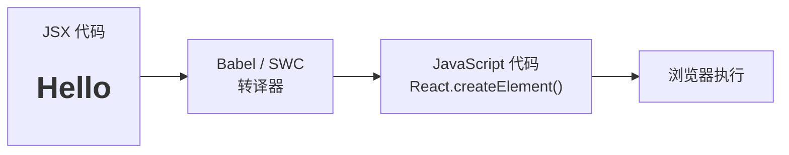
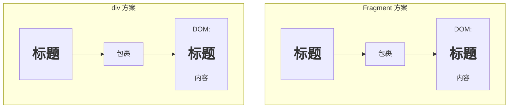

+++
title = "第5章 JSX语法"
weight = 50
date = "2026-03-25T12:56:00+08:00"
type = "docs"
description = ""
isCJKLanguage = true
draft = false
+++


# Chapter-05 - JSX——React 的语法糖

## 5.1 JSX——React 的语法糖

> 终于到了 React 最独特、最让人"又爱又恨"的部分——JSX。如果你之前没接触过 JSX，第一次看到它的时候可能会产生一种"这到底是 HTML 还是 JavaScript"的困惑。没错，这就是 JSX 的魔力所在——它让 HTML 和 JavaScript 共处一室，在同一个文件里眉来眼去。

### 5.1.1 JSX 的本质：语法糖还是魔法？

先说结论：**JSX 是一种语法糖（Syntactic Sugar）**，它最终会被编译成普通的 JavaScript 函数调用。

JSX 的全称是 **JavaScript XML**，名字听起来很玄乎，但实际上它就是一种"让你用类似 HTML 的语法写 React 元素"的写法。

**JSX 写法（看起来像 HTML）：**

```jsx
const element = <h1 className="title">Hello, JSX!</h1>
```

**编译后的 JavaScript 写法（React.createElement 调用）：**

```javascript
const element = React.createElement(
  'h1',
  { className: 'title' },
  'Hello, JSX!'
)
```

> 语法糖就像糖衣药丸——药效（功能）是一样的，只是吃法更甜更好吃。JSX 就是 React 的"糖衣"，让写 UI 组件这件事变得像写 HTML 一样直观。

**JSX 为什么不是魔法？**

因为 JSX 需要被转译（Transpile）成 JavaScript 才能在浏览器里运行。这个转译工作通常由 **Babel** 或 **Vite 里的 SWC** 来完成。



### 5.1.2 JSX 与 HTML 的核心区别一览表

JSX 看起来像 HTML，但它们有本质的区别。以下是关键区别：

| 对比项 | HTML | JSX |
|--------|------|-----|
| **class 属性** | `class="xxx"` | `className="xxx"` |
| **for 属性** | `for="xxx"` | `htmlFor="xxx"` |
| **自闭合标签** | `<br>` 或 `<br />` | **必须** `<br />`（必须加斜杠！） |
| **标签必须闭合** | `<p>文字` | `<p>文字</p>`（必须闭合！） |
| **属性命名** | 小写：`maxlength` | camelCase：`maxLength` |
| **style 属性** | `style="color:red"` | `style={{ color: 'red' }}` |
| **注释** | `<!-- 注释 -->` | `{/* 注释 */}` |
| **布尔属性** | `<input disabled>` | `<input disabled={true} />` |
| **表达式** | 不支持 | 支持：`{1 + 1}` / `{variable}` |

---

## 5.2 JSX 语法规则

### 5.2.1 className：不是 class

在 HTML 里，元素的类名用的是 `class` 属性。但在 JSX 里，**必须用 `className`**！

为什么？因为 `class` 是 JavaScript 的保留字（用来定义类），JSX 作为 JavaScript 的语法扩展，不能和 JavaScript 的关键字冲突。所以 React 的设计师们把它改成了 `className`。

**HTML 写法：**

```html
<div class="container">
  <h1 class="title">Hello</h1>
</div>
```

**JSX 写法：**

```jsx
<div className="container">
  <h1 className="title">Hello</h1>
</div>
```

> 小段子：有一天，前端新人小张写了一段 JSX：
> `<div class="my-div">内容</div>`
> 保存 → 运行 → 浏览器报错："className is not defined"
> 小张慌了，疯狂 Google，半小时后终于发现：`class` 要改成 `className`
> 从此，小张每次写 JSX 都会条件反射地想起这个坑，并教育后来的新人："记住了，`class` 是 HTML 的，`className` 才是 JSX 的！"

### 5.2.2 htmlFor：不是 for

同样的道理，HTML 里的 `<label for="xxx">` 在 JSX 里要写成 `<label htmlFor="xxx">`。

**HTML 写法：**

```html
<label for="username">用户名</label>
<input id="username" type="text" />
```

**JSX 写法：**

```jsx
<label htmlFor="username">用户名</label>
<input id="username" type="text" />
```

### 5.2.3 自闭合标签必须加斜杠：``

在 HTML 里，自闭合标签（Self-closing Tag）可以不用斜杠：

```html
<!-- HTML 允许这样写 -->

<br>
<input type="text">
```

但在 JSX 里，**所有自闭合标签必须加斜杠**！否则编译器会报错。

**JSX 写法（正确）：**

```jsx

<br />
<input type="text" />
<hr />
```

**JSX 写法（错误 ❌）：**

```jsx
        // ❌ 报错！
<input type="text">       // ❌ 报错！
```

> 记忆口诀：JSX 是一个"严谨的强迫症"，每个标签都得"有头有尾"，自闭合标签也得画上句号 `/`。

### 5.2.4 标签必须正确嵌套

JSX 跟 HTML 一样，标签必须正确嵌套——**先开的标签后关，后开的标签先关**，像叠纸一样，一层套一层。

**正确写法 ✅：**

```jsx
<div>
  <h1>
    <span>嵌套内容</span>
  </h1>
</div>
```

**错误写法 ❌：**

```jsx
<div>
  <h1>
    <span>嵌套内容</span>
  <!-- h1 没有关闭！ -->
</div>
```

> 这就像俄罗斯套娃🪆——打开顺序是 A→B→C，关闭顺序也必须是 C→B→A。

### 5.2.5 使用 camelCase 写属性名

在 HTML 里，属性名是 kebab-case（小写加连字符）的：

```html
<input maxlength="50" tabindex="1" onclick="handleClick()" />
```

在 JSX 里，属性名要改成 camelCase（驼峰命名法）：

```jsx
<input maxLength={50} tabIndex={1} onClick={handleClick} />
```

**常见的 HTML → JSX 属性名对照：**

| HTML 属性名 | JSX 属性名 |
|-----------|-----------|
| `maxlength` | `maxLength` |
| `tabindex` | `tabIndex` |
| `onclick` | `onClick` |
| `onchange` | `onChange` |
| `onsubmit` | `onSubmit` |
| `onkeyup` | `onKeyUp` |
| `readonly` | `readOnly` |
| `disabled` | `disabled`（不变） |
| `autofocus` | `autoFocus` |
| `enctype` | `encType` |

### 5.2.6 style 属性接收对象而非字符串

在 HTML 里，style 是一个字符串：

```html
<div style="color: red; font-size: 20px;">红色大字</div>
```

在 JSX 里，style 接收的是一个 JavaScript **对象**，CSS 属性名也要用 camelCase：

**JSX 写法（正确 ✅）：**

```jsx
const myStyle = {
  color: 'red',           // 注意：这里是字符串，不是 red
  fontSize: '20px',        // CSS 属性名用 camelCase：font-size → fontSize
  backgroundColor: '#f0f0f0',  // background-color → backgroundColor
  marginTop: '10px',       // margin-top → marginTop
}

return <div style={myStyle}>红色大字</div>

// 也可以直接写内联对象
return <div style={{ color: 'red', fontSize: '20px' }}>红色大字</div>
```

**JSX 写法（错误 ❌）：**

```jsx
return <div style="color: red;">红色大字</div>  // ❌ 字符串不行！
```

> 💡 实战建议：内联 style 适合动态样式（根据状态变化），但不要滥用。建议大多数情况下用 CSS 类（`className`）来管理样式，只有在需要动态计算样式时才用 `style`。

### 5.2.7 注释的写法：`{/* 注释内容 */}`

在 HTML 里，注释是 `<!-- 注释内容 -->`。
在 JSX 里，注释要用 **{/* 注释内容 */}** 包裹起来，因为它本质上是 JavaScript 表达式。

**JSX 中注释的写法：**

```jsx
function MyComponent() {
  return (
    <div>
      {/* 这是单行注释 */}

      {/*
       * 这是多行注释
       * 可以写很多很多内容
       * 就像这样
       */}

      <h1>标题</h1>

      {/* 条件注释：只在开发环境显示 */}
      {process.env.NODE_ENV === 'development' && (
        <div>🔧 开发模式调试工具</div>
      )}
    </div>
  )
}
```

---

## 5.3 在 JSX 中嵌入表达式

JSX 最大的威力之一，就是可以在 JSX 里**嵌入 JavaScript 表达式**！只需要用 `{}` 包裹即可。

### 5.3.1 如何在 JSX 中插入变量

```jsx
function App() {
  const name = '小明'
  const age = 25

  return (
    <div>
      {/* 用 {} 包裹变量名，变量值就会被渲染出来 */}
      <p>姓名：{name}</p>
      <p>年龄：{age}</p>
    </div>
  )
}
```

渲染结果：

```html
<div>
  <p>姓名：小明</p>
  <p>年龄：25</p>
</div>
```

### 5.3.2 支持的表达式类型：运算、函数调用、三元、条件

`{}` 里可以放任何 JavaScript **表达式**（Expression），不能放**语句**（Statement）。

| 表达式（✅ 可以放） | 语句（❌ 不能放） |
|-----------------|----------------|
| 变量 | if 语句 |
| 算术运算 `1 + 2` | for 语句 |
| 三元运算符 `a ? b : c` | switch 语句 |
| 函数调用 `getName()` | while 语句 |
| 数组方法 `arr.map()` | do-while 语句 |
| 逻辑运算符 `a && b` | try-catch 语句 |
| 模板字符串 `` `Hello ${name}` `` | throw 语句 |

```jsx
function Demo() {
  const a = 10
  const b = 3
  const isLoggedIn = true
  const user = { name: '张三', age: 30 }

  return (
    <div>
      {/* 算术运算 */}
      <p>{a} + {b} = {a + b}</p>  {/* 打印结果：10 + 3 = 13 */}

      {/* 三元运算符 */}
      <p>{isLoggedIn ? '欢迎回来！' : '请登录'}</p>  {/* 打印结果：欢迎回来！ */}

      {/* 模板字符串 */}
      <p>{`我叫${user.name}，今年${user.age}岁`}</p>
      {/* 打印结果：我叫张三，今年30岁 */}

      {/* 调用函数 */}
      <p>{user.name.toUpperCase()}</p>  {/* 打印结果：张三 */}

      {/* 数组方法 */}
      <ul>
        {[1, 2, 3].map(n => (
          <li key={n}>{n * 2}</li>  {/* 打印结果：2, 4, 6 */}
        ))}
      </ul>
    </div>
  )
}
```

### 5.3.3 禁止在 {} 中放置语句（if/for/switch）

**不能直接写 if/for/switch**，但可以用其他方式实现相同效果：

```jsx
// ❌ 错误写法：if 语句不能直接放在 {} 里
return (
  <div>
    {if (isLoggedIn) { return <p>已登录</p> }}  // 语法错误！
  </div>
)

// ✅ 正确写法一：三元运算符（适合简单的条件）
return (
  <div>
    {isLoggedIn ? <p>已登录</p> : <p>未登录</p>}
  </div>
)

// ✅ 正确写法二：逻辑运算符（适合只显示/不显示）
return (
  <div>
    {isLoggedIn && <p>已登录</p>}
  </div>
)

// ✅ 正确写法三：IIFE（立即调用函数表达式，适合复杂逻辑）
return (
  <div>
    {(() => {
      if (isLoggedIn) return <p>已登录</p>
      if (isPending) return <p>加载中...</p>
      return <p>未登录</p>
    })()}
  </div>
)

// ✅ 正确写法四：在组件外部判断（适合复杂的条件分支）
function Welcome({ user, isPending }) {
  if (isPending) return <p>加载中...</p>
  if (!user) return <p>请登录</p>
  return <p>欢迎，{user.name}！</p>
}
```

---

## 5.4 条件渲染

条件渲染就是"根据条件决定要不要显示某个元素"。React 里实现条件渲染有多种方式，各有适用场景。

### 5.4.1 三元表达式：`condition ? <A /> : <B />`

最基础的条件渲染写法，适合"二选一"的场景。

```jsx
function UserStatus({ isLoggedIn }) {
  return (
    <div>
      {isLoggedIn ? (
        <p>欢迎回来！🎉</p>
      ) : (
        <p>请登录 🔐</p>
      )}
    </div>
  )
}
```

渲染结果（`isLoggedIn = true` 时）：

```html
<div><p>欢迎回来！🎉</p></div>
```

渲染结果（`isLoggedIn = false` 时）：

```html
<div><p>请登录 🔐</p></div>
```

### 5.4.2 逻辑与运算符：`&&` 的妙用与陷阱（&& 前不能是 0/false）

`&&` 运算符用于"条件成立时显示，条件不成立时什么都不显示"的场景。

```jsx
function Notification({ count }) {
  return (
    <div>
      {/* 有新消息时显示红点 */}
      {count > 0 && <span className="badge">{count}</span>}
      {/* 没有新消息时，什么都不显示 */}
    </div>
  )
}
```

**⚠️ 重要陷阱：&& 前面不能是 0、false、undefined 或 null！**

```jsx
// ❌ 错误示例：0 是 falsy 值，会导致页面显示一个 0！
const messageCount = 0
return (
  <div>
    {messageCount && <span>你有 {messageCount} 条新消息</span>}
    {/* 结果：页面显示 "0"，而不是什么都不显示！ */}
  </div>
)

// ✅ 正确写法：把判断条件放在前面，渲染内容放在后面
const messageCount = 0
return (
  <div>
    {messageCount > 0 && <span>你有 {messageCount} 条新消息</span>}
    {/* 结果：什么都不显示 ✅ */}
  </div>
)

// ✅ 另一个正确写法：用三元运算符兜底
return (
  <div>
    {messageCount ? <span>你有 {messageCount} 条新消息</span> : null}
  </div>
)
```

> 🎯 记住这个规则：**&& 前面放判断表达式，不要放可能为 0 或 false 的值**。如果不确定，用三元运算符！

### 5.4.3 逻辑或运算符：`||` 的备用值模式

`||` 运算符用于"如果值是 falsy，就用备用值"的场景。

```jsx
function Greeting({ name }) {
  return (
    <div>
      <p>欢迎，{name || '陌生人'}！</p>
      {/* 如果 name 是 undefined/null/空字符串，就显示"陌生人" */}
    </div>
  )
}

// Greeting({ name: '张三' }) -> 打印结果：欢迎，张三！
// Greeting({ name: '' }) -> 打印结果：欢迎，陌生人！
```

### 5.4.4 立即调用函数表达式（IIFE）处理复杂条件

当条件判断很复杂时，可以用 IIFE（Immediately Invoked Function Expression）来组织代码。

```jsx
function OrderStatus({ status }) {
  return (
    <div>
      {(() => {
        switch (status) {
          case 'pending':
            return <span>⏳ 待处理</span>
          case 'processing':
            return <span>🔄 处理中</span>
          case 'shipped':
            return <span>🚚 已发货</span>
          case 'delivered':
            return <span>✅ 已送达</span>
          case 'cancelled':
            return <span>❌ 已取消</span>
          default:
            return <span>❓ 未知状态</span>
        }
      })()}
    </div>
  )
}
```

> 💡 小技巧：IIFE 虽然功能强大，但不要滥用。如果逻辑特别复杂，建议把判断逻辑抽离成一个独立的函数或组件，JSX 里只负责调用。

### 5.4.5 条件渲染 vs 显隐切换（display:none）

有时你不想真正"移除"元素，只想让元素"消失但还在 DOM 里"。这时候可以用 CSS 的 `display: none` 来控制显隐。

```jsx
function ToggleComponent() {
  const [isVisible, setIsVisible] = React.useState(true)

  return (
    <div>
      <button onClick={() => setIsVisible(!isVisible)}>
        {isVisible ? '隐藏' : '显示'}
      </button>

      {/* 方式一：条件渲染（组件会从 DOM 中完全移除） */}
      {isVisible && <div className="content">我会消失和出现</div>}

      {/* 方式二：display:none（组件始终在 DOM 中，只是隐藏了） */}
      <div style={{ display: isVisible ? 'block' : 'none' }} className="content">
        我只是隐藏，没有消失（DOM 里还有我）
      </div>
    </div>
  )
}
```

**如何选择？**

- **用条件渲染**（`&&` / 三元）：元素不在 DOM 中，性能更好（少一些 DOM 节点）
- **用 display:none**：元素保留在 DOM 中，适合需要保持状态（比如 input 的值）的场景

---

## 5.5 列表渲染

React 里渲染列表的核心是 **`map()`** 方法——它遍历数组中的每个元素，返回一个 JSX 元素。

### 5.5.1 map 的基本用法

```jsx
function ColorList() {
  const colors = ['红色', '蓝色', '绿色', '黄色']

  return (
    <ul>
      {colors.map(color => (
        <li>{color}</li>
      ))}
    </ul>
  )
}

// 渲染结果：
// <ul>
//   <li>红色</li>
//   <li>蓝色</li>
//   <li>绿色</li>
//   <li>黄色</li>
// </ul>
```

### 5.5.2 key 的作用：为什么每个列表项都需要唯一 key

React 的虚拟 DOM 在更新列表时，需要知道"哪些元素变了，哪些没变"。**key 就是 React 用来追踪列表中每个元素身份的东西**。

```jsx
const fruits = ['苹果', '香蕉', '橙子']

// ❌ 错误：没有 key
fruits.map(fruit => <li>{fruit}</li>)
// 控制台会报警告：Warning: Each child in a list should have a unique "key" prop.

// ✅ 正确：添加 key
fruits.map((fruit, index) => (
  <li key={index}>{fruit}</li>
))

// ✅ 更好的方式：用数据本身的唯一 ID 作为 key
const users = [
  { id: 1, name: '张三' },
  { id: 2, name: '李四' },
  { id: 3, name: '王五' },
]

users.map(user => (
  <li key={user.id}>{user.name}</li>  // 用 id 作为 key ✅
))
```

**为什么 key 很重要？**

想象一下这个场景：你有一个用户列表，用户 A（id=1）、用户 B（id=2）、用户 C（id=3）。如果你删除了用户 B：

- **没有 key 或用 index 做 key**：React 可能会"傻傻地"更新 A 和 C 的内容，而不是真正删除 B 的节点
- **用唯一 id 做 key**：React 能精确定位到 id=2 的那个节点，精准删除，不影响其他节点

### 5.5.3 key 的最佳实践：避免使用 index 的场景

**什么时候可以用 index 作为 key？**

- 列表是静态的，不会重新排序
- 列表不会增加或删除元素（只有展示）
- 列表项没有兄弟节点之间的唯一性要求

```jsx
// ✅ 可以用 index 的场景：静态列表，不会增删
const staticLabels = ['首页', '关于我们', '联系我们']
staticLabels.map((label, index) => <span key={index}>{label}</span>)
```

**什么时候绝对不能用 index 做 key？**

- 列表会动态添加、删除
- 列表会重新排序（如拖拽排序、搜索过滤后重新排序）
- 列表项有兄弟节点之间的区分需求

```jsx
// ❌ 错误场景：列表会增删，用 index 做 key 会导致渲染错乱
function TodoList() {
  const [todos, setTodos] = React.useState([
    { id: 1, text: '吃饭' },
    { id: 2, text: '睡觉' },
    { id: 3, text: '写代码' },
  ])

  const deleteTodo = (id) => {
    setTodos(todos.filter(t => t.id !== id))
  }

  return (
    <ul>
      {todos.map((todo, index) => (
        // ❌ 用 index 当 key！删除中间项时会导致渲染错误
        <li key={index}>
          {todo.text}
          <button onClick={() => deleteTodo(todo.id)}>删除</button>
        </li>
      ))}
    </ul>
  )
}

// ✅ 正确写法：用 id 当 key
{todos.map(todo => (
  <li key={todo.id}>  {/* ✅ 用数据 id 当 key */}
    {todo.text}
    <button onClick={() => deleteTodo(todo.id)}>删除</button>
  </li>
))}
```

### 5.5.4 嵌套列表的渲染方法

列表里面可以有列表，即嵌套列表：

```jsx
function CategoryList() {
  const categories = [
    {
      id: 1,
      name: '水果',
      items: ['苹果', '香蕉', '橙子']
    },
    {
      id: 2,
      name: '蔬菜',
      items: ['白菜', '萝卜', '黄瓜']
    }
  ]

  return (
    <div>
      {categories.map(category => (
        <div key={category.id} className="category">
          <h3>{category.name}</h3>
          <ul>
            {category.items.map((item, index) => (
              <li key={index}>{item}</li>  // 同一分类下的 item 用 index 是可以的
            ))}
          </ul>
        </div>
      ))}
    </div>
  )
}
```

### 5.5.5 map 中 return 的简化：括号 vs 花括号

在 `map()` 回调里：
- 用**括号 `()`** 包裹 → 直接返回 JSX（隐式 return）
- 用**花括号 `{}`** 包裹 → 需要手动写 `return` 语句

```jsx
const numbers = [1, 2, 3]

// 方式一：括号写法（推荐，简洁）
numbers.map(n => (
  <span key={n}>{n * 2}</span>
))

// 方式二：花括号写法（需要 return）
numbers.map(n => {
  return <span key={n}>{n * 2}</span>
})

// 方式三：花括号 + 箭头函数隐式 return（ES6 特性）
numbers.map(n => n * 2)  // 直接返回数字，不是 JSX！
```

> 💡 小提示：括号写法更直观，一看就知道"返回的是 JSX"，推荐优先使用。

---

## 5.6 Fragment 与空标签

### 5.6.1 Fragment 的作用与用法

React 的组件**只能返回一个根元素**。但有时候我们不想在外层包裹一个 `<div>`（因为可能影响 CSS 布局），这时候就用 **`<Fragment>`** 来解决这个问题。

**问题场景：想返回两个元素，但不想用 div 包裹**

```jsx
// ❌ 错误：组件返回了两个并列的根元素
function BadComponent() {
  return (
    <h1>标题</h1>
    <p>内容</p>
  )
  // 编译错误：JSX 表达式必须有一个父元素！
}

// ❌ 不好：用 div 包裹（但 div 可能会破坏 CSS 布局）
function BadComponent() {
  return (
    <div>
      <h1>标题</h1>
      <p>内容</p>
    </div>
  )
}

// ✅ 好：用 Fragment 包裹（不产生额外的 DOM 节点）
import { Fragment } from 'react'

function GoodComponent() {
  return (
    <Fragment>
      <h1>标题</h1>
      <p>内容</p>
    </Fragment>
  )
}
```

**Fragment 的优势：**



### 5.6.2 `<>` 简写与 `<Fragment key={...}>` 的区别

React 提供了 `<>` 作为 `<Fragment>` 的简写，但要注意：**简写形式不支持 key 属性**！

```jsx
import { Fragment } from 'react'

function TagList({ tags }) {
  return (
    <>
      {tags.map(tag => (
        // ❌ 错误：<> 简写不支持 key
        // <span key={tag.id}>{tag.name}</span>
      ))}
    </>
  )
}

function TagListFixed({ tags }) {
  return (
    <>
      {tags.map(tag => (
        // ✅ 正确：需要 key 时，用完整的 <Fragment key={...}>
        <Fragment key={tag.id}>
          <span>{tag.name}</span>
          <span>、</span>
        </Fragment>
      ))}
    </>
  )
}
```

> 💡 小总结：
> - 普通的 `<></>` 或 `<Fragment></Fragment>`：不需要 key 时用，简洁
> - `<Fragment key={...}></Fragment>`：需要 key 时用，完整写法

---

## 本章小结

本章我们系统地学习了 React 的"脸面"——JSX 语法：

- **JSX 是语法糖**，本质是 `React.createElement()` 调用，经过 Babel/SWC 转译后变成普通 JavaScript
- **JSX 与 HTML 的核心区别**：`class`→`className`、`for`→`htmlFor`、自闭合标签必须加 `/`、属性名用 camelCase、`style` 接收对象、注释用 `{/* */}`
- **在 JSX 中嵌入表达式**：`{}` 里可以放任何 JS 表达式（变量、运算、三元、函数调用、map），但不能放语句（if/for/switch）
- **条件渲染**：`&&` 适合"显示/隐藏"、三元适合"二选一"、IIFE 适合复杂逻辑；注意 `&&` 前面不能是 0/false
- **列表渲染**：`map()` 是核心，记得给每个列表项加 `key`；优先用数据 id 而非 index 作为 key
- **Fragment**：解决"只能返回根元素"的问题，`<>` 是简写形式，需要 key 时用完整 `<Fragment key={...}>`

下一章，我们将深入学习 React 的**组件（Component）**——React 的核心概念！组件是 React 的灵魂，没有组件就没有 React。准备好了吗？💪