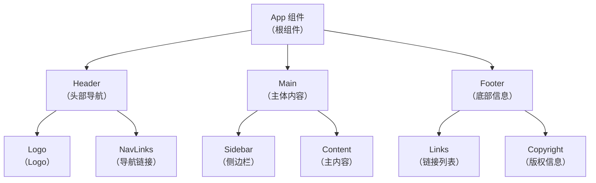
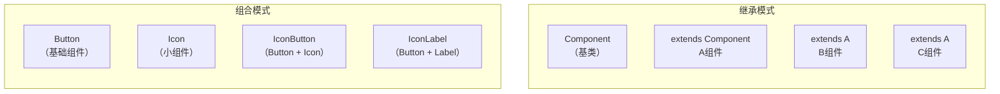
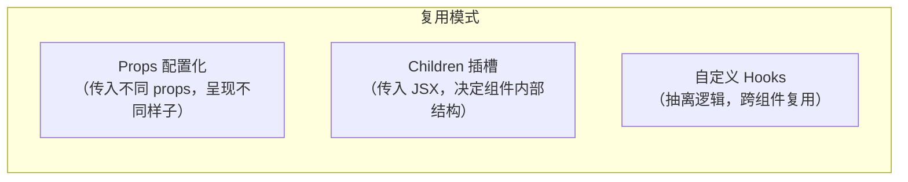

+++
title = "第6章 组件——React核心概念"
weight = 60
date = "2026-03-25T12:56:00+08:00"
type = "docs"
description = ""
isCJKLanguage = true
draft = false
+++


# Chapter-06 - 组件——React 的核心

## 6.1 组件化开发的思想

> 如果把 React 应用比作一座城市，那组件就是这座城市的每一栋建筑。有的建筑是摩天大楼（页面组件），有的是小卖部（按钮组件），有的是公交站牌（导航组件）。每一栋建筑都有自己的职责，自己的一亩三分地，不会跑去管别人的闲事——这就是组件化开发的核心思想。

### 6.1.1 组件的定义：独立、可复用、承担单一职责

**组件的官方定义**：React 组件是一个接受 props（输入）并返回 React 元素（输出）的 JavaScript 函数或类。

翻译成人话就是：**组件是一个"吃进数据，吐出界面"的小工厂**。

组件有三大特征：

**1. 独立（Independent）**

每个组件都是独立的"孤岛"——它有自己的内部逻辑，有自己的样式（通常），不依赖其他组件的内部实现。就像一个好的员工：做好自己的本职工作，不打探别人的隐私。

```jsx
// 这是一个独立的 Button 组件
// 它不需要知道页面上其他组件在干什么
function Button({ label, onClick }) {
  return (
    <button className="btn-primary" onClick={onClick}>
      {label}
    </button>
  )
}
```

**2. 可复用（Reusable）**

同一个组件，可以在不同的地方使用——就像乐高积木，同一块砖可以搭出无数种造型。写一个 Button 组件，全项目几百个地方都能用，维护一次，到处生效。

```jsx
// 同一个 Button 组件，在不同场景下复用
function LoginForm() {
  return (
    <form>
      <input type="text" />
      <input type="password" />
      {/* 场景1：登录按钮 */}
      <Button label="登录" onClick={handleLogin} />
    </form>
  )
}

function RegisterForm() {
  return (
    <form>
      <input type="text" />
      <input type="email" />
      {/* 场景2：注册按钮 —— 同一个 Button 组件，换个 label 和 onClick 就行！ */}
      <Button label="注册" onClick={handleRegister} />
    </form>
  )
}
```

**3. 承担单一职责（Single Responsibility）**

每个组件只做一件事，而且要把这件事做到极致。就像一家餐厅：
- 厨师负责做菜（Cook 组件）
- 服务员负责端菜（Waiter 组件）
- 收银员负责收钱（Cashier 组件）

你不会让厨师去收钱，也不会让收银员去做菜——各司其职，效率最高。

```jsx
// ❌ 职责不单一的组件：它既管数据获取，又管列表展示，还管样式
function UserList() {
  const [users, setUsers] = useState([])
  useEffect(() => { fetchUsers().then(setUsers) }, [])
  return (
    <div style={{ padding: 20 }}>
      <ul>{users.map(u => <li>{u.name}</li>)}</ul>
    </div>
  )
}

// ✅ 单一职责：数据获取是 UserList 的活儿，样式是 UserListStyles 的活儿
function UserList({ users }) {
  return (
    <ul className="user-list">
      {users.map(u => <li key={u.id}>{u.name}</li>)}
    </ul>
  )
}
```

### 6.1.2 组件化开发的优势：复用、维护、协作

组件化开发的优势，说白了就是"让复杂的事情变简单"。

**优势一：复用——一次编写，到处使用**

没有组件化的时候，如果页面里有 100 个按钮，每个按钮的样式都要写一遍。改一次按钮样式，就要改 100 个地方——这叫"重复代码灾难"。

有了组件化，写一个 Button 组件，100 个地方引用。改一次按钮样式，只改 Button 组件一处——"一处修改，处处生效"。

**优势二：维护——问题定位像侦探破案**

当页面出 bug 时，组件化结构让你能快速定位问题——"哦，Header 组件里的 Logo 不显示"，而不是"整个页面乱成一锅粥，不知道从哪下手"。



如上所示，每个组件职责清晰，如果 Footer 出问题，只查 Footer 及其子组件，不用动 Header 和 Main 一根毫毛。

**优势三：协作——分工明确，并行开发**

一个团队 5 个人，可以这样分工：
- 小明：负责 Header 组件
- 小红：负责 Sidebar 组件
- 小刚：负责 Content 组件
- 小丽：负责 Footer 组件
- 小强：负责整体布局和状态管理

大家各写各的，互不干扰，最后拼在一起就是完整的页面。就像装修房子：水电工、木工、油漆工同时施工，最后组装成一栋完整的房子。

### 6.1.3 组件的原子化思维：从大到小拆分

**原子化设计（Atomic Design）** 是一种组件拆分的思维方式，灵感来自化学——世间万物由原子组成，原子组成分子，分子组成有机体，有机体组成生命。

React 组件也可以用这套逻辑来拆分：

| 层级 | 名称 | 说明 | 例子 |
|------|------|------|------|
| 原子（Atom） | 最小单位 | 不能拆分的 UI 元素 | Button、Input、Icon |
| 分子（Molecule） | 简单组合 | 几个原子组合成一个功能单元 | SearchBar（Input + Button）、FormField（Label + Input + Error） |
| 有机体（Organism） | 复杂组合 | 多个分子组成，提供完整功能 | Header（Logo + NavLinks + SearchBar）、Comment（Avatar + UserInfo + Content） |
| 模板（Template） | 页面框架 | 多个有机体的布局结构 | PageLayout（Header + Sidebar + Main + Footer） |
| 页面（Page） | 具体实例 | 填入真实数据后的模板 | HomePage、ProfilePage |

```jsx
// ========== 原子层（Atom）==========
function Icon({ name }) {
  // 图标组件，接收图标名称，返回对应图标
  const icons = { search: '🔍', home: '🏠', user: '👤' }
  return <span>{icons[name]}</span>
}

function Button({ children, variant = 'primary' }) {
  return <button className={`btn btn-${variant}`}>{children}</button>
}

// ========== 分子层（Molecule）==========
function SearchBar({ value, onChange }) {
  return (
    <div className="search-bar">
      <Icon name="search" />
      <input value={value} onChange={onChange} placeholder="搜索..." />
    </div>
  )
}

// ========== 有机体层（Organism）==========
function Header({ searchValue, onSearchChange }) {
  return (
    <header className="header">
      <Icon name="home" />
      <SearchBar value={searchValue} onChange={onSearchChange} />
      <Icon name="user" />
    </header>
  )
}

// ========== 模板层（Template）==========
function PageLayout({ children, searchValue, onSearchChange }) {
  return (
    <div className="page">
      <Header searchValue={searchValue} onSearchChange={onSearchChange} />
      <main className="main">{children}</main>
      <footer className="footer">© 2024 My App</footer>
    </div>
  )
}

// ========== 页面层（Page）==========
function HomePage() {
  const [search, setSearch] = useState('')
  return (
    <PageLayout searchValue={search} onSearchChange={setSearch}>
      <h1>欢迎来到首页</h1>
      <p>搜索内容：{search}</p>
    </PageLayout>
  )
}
```

> 💡 实战建议：原子化思维是一个指导原则，不必教条化。关键是**让组件的粒度合理**——太大则复用性差，太小则管理成本高。实践中，多问问自己："这个组件以后能复用吗？"如果答案是"可能不会"，那就考虑合并。

---

## 6.2 函数组件 vs Class 组件

React 里写组件有两种方式：**函数组件**（Functional Component）和 **Class 组件**（Class Component）。历史上它们各有优劣，但 2019 年 React Hooks 发布之后，函数组件彻底称霸了 React 世界。

### 6.2.1 函数组件的诞生：最简单的组件形式

函数组件从 React 诞生之初就存在，但早期的函数组件只能当"哑组件"——只能根据 props 渲染 UI，不能有自己的状态（state）和生命周期逻辑。

```jsx
// 早期的函数组件（React 16.8 之前）
function Greeting({ name }) {
  return <h1>你好，{name}！</h1>
}
```

就这么简单——一个接受 props、返回 JSX 的函数。没有 state，没有副作用，没有生命周期。功能上有点像"纯函数"：相同的 props 输入，永远产生相同的 JSX 输出。

### 6.2.2 Class 组件的历史：曾经的唯一选择

在 Hooks 出现之前，如果组件需要"有状态"或有"生命周期"功能（如组件挂载时请求数据、组件更新时做点什么、组件卸载时清理资源），**Class 组件是唯一的出路**。

```jsx
// Class 组件（React 16.8 之前的写法）
class Counter extends React.Component {
  constructor(props) {
    super(props)
    // state 是组件的私有数据
    this.state = { count: 0 }
    // this 绑定是 Class 组件的经典坑
    this.handleClick = this.handleClick.bind(this)
  }

  handleClick() {
    // 更新 state 必须用 setState()
    this.setState({ count: this.state.count + 1 })
  }

  render() {
    // render 是 Class 组件唯一必须有的方法
    return (
      <div>
        <p>计数：{this.state.count}</p>
        <button onClick={this.handleClick}>点我+1</button>
      </div>
    )
  }
}
```

Class 组件的特点：
- 继承 `React.Component`
- 必须有 `render()` 方法
- 状态放在 `this.state` 里
- 用 `this.setState()` 更新状态
- 生命周期方法：`componentDidMount`、`componentDidUpdate`、`componentWillUnmount`

### 6.2.3 两种组件的异同点

| 对比维度 | 函数组件 | Class 组件 |
|---------|---------|-----------|
| **语法** | ES6 函数 | ES6 Class |
| **状态管理** | useState Hook | this.state + this.setState |
| **生命周期** | useEffect Hook | componentDidMount / DidUpdate / WillUnmount |
| **this 指向** | 无 this 问题 | 需要 bind 或箭头函数 |
| **代码量** | 简洁 | 冗长 |
| **复用逻辑** | 自定义 Hooks | HOC / Render Props |
| **打包体积** | 更小 | 稍大（需要 React.Component） |
| **性能** | 略优（无 this 查找开销） | 略差 |

```jsx
// 同样的功能，函数组件 vs Class 组件的代码量对比

// 函数组件（简洁！）
function Counter() {
  const [count, setCount] = useState(0)
  return (
    <div>
      <p>计数：{count}</p>
      <button onClick={() => setCount(count + 1)}>点我+1</button>
    </div>
  )
}

// Class 组件（冗长！）
class CounterClass extends React.Component {
  constructor(props) {
    super(props)
    this.state = { count: 0 }
    this.handleClick = this.handleClick.bind(this)  // 绑定的坑！
  }
  handleClick() {
    this.setState({ count: this.state.count + 1 })
  }
  render() {
    return (
      <div>
        <p>计数：{this.state.count}</p>
        <button onClick={this.handleClick}>点我+1</button>
      </div>
    )
  }
}
```

### 6.2.4 现代 React 推荐：函数组件 + Hooks

2019 年，React 16.8 引入了 **Hooks**，彻底改变了 React 的写法。Hooks 让函数组件拥有了 state 和生命周期能力，从此函数组件一统江湖。

**为什么函数组件 + Hooks 是主流？**

1. **代码更简洁**：同样的功能，代码量少 30%~50%
2. **没有 this 地狱**：JavaScript 的 this 指向问题困扰了无数 Class 组件开发者
3. **逻辑复用更容易**：自定义 Hook 让逻辑复用变得直观，而不是 HOC/Render Props 的嵌套地狱
4. **更容易测试**：纯函数天然更容易单元测试
5. **Tree Shaking 更友好**：未使用的代码更容易被排除

```jsx
// Hooks 时代的函数组件：既有 state，又有生命周期，还很简洁
import { useState, useEffect, useCallback } from 'react'

function UserProfile({ userId }) {
  const [user, setUser] = useState(null)        // state
  const [loading, setLoading] = useState(true)  // state
  const [error, setError] = useState(null)     // state

  // 生命周期：组件挂载和 userId 变化时执行
  useEffect(() => {
    async function fetchUser() {
      setLoading(true)
      try {
        const data = await api.getUser(userId)
        setUser(data)
      } catch (err) {
        setError(err.message)
      } finally {
        setLoading(false)
      }
    }
    fetchUser()
  }, [userId])

  // 回调函数缓存：避免子组件不必要的重渲染
  const handleUpdate = useCallback((updates) => {
    setUser(prev => ({ ...prev, ...updates }))
  }, [])

  // 渲染
  if (loading) return <div>加载中...</div>
  if (error) return <div>错误：{error}</div>
  if (!user) return <div>用户不存在</div>

  return (
    <div>
      <h1>{user.name}</h1>
      <button onClick={() => handleUpdate({ name: '新名字' })}>改名</button>
    </div>
  )
}
```

### 6.2.5 React 19 中函数组件的改进（ref 作为 prop，forwardRef 仍可用）

React 19 给函数组件带来了一个重要的改进：**ref 可以直接作为 prop 传递，不需要再通过 `forwardRef` 包装**。

```jsx
// React 18 及之前：需要用 forwardRef 才能接收 ref
const Button = React.forwardRef(({ children }, ref) => {
  return <button ref={ref} className="btn">{children}</button>
})

// 使用时
const buttonRef = useRef()
<Button ref={buttonRef}>点我</Button>

// React 19：函数组件可以直接接收 ref 作为 prop！
function Button({ children, ref }) {
  return <button ref={ref} className="btn">{children}</button>
}

// React 19 也依然支持 forwardRef（向后兼容），两种写法都可以
```

> 📝 注意：React 19 的这个改进让 `forwardRef` 变成了可选的，但并不意味着它被废弃了。对于一些需要高阶包装的场景（如 `memo` + `ref` 的组合），`forwardRef` 仍然有用。

---

## 6.3 组件的基本结构

### 6.3.1 函数组件的骨架

一个完整的函数组件大概长这样：

```jsx
// 1. 引入 React（React 17 之后理论上可以省略，但建议保留）
import React from 'react'

// 2. 引入需要的 Hooks（如果有的话）
import { useState, useEffect } from 'react'

// 3. 定义组件（函数名必须首字母大写）
function MyComponent(props) {
  // 4. 如果需要 state，在这里定义
  const [count, setCount] = useState(0)
  const [user, setUser] = useState(null)

  // 5. 如果需要副作用（请求数据、订阅等），用 useEffect
  useEffect(() => {
    // 副作用逻辑
    return () => {
      // 清理逻辑（可选）
    }
  }, [])  // 依赖数组

  // 6. 其他业务逻辑函数
  function handleClick() {
    setCount(count + 1)
  }

  // 7. 返回 JSX（组件的 UI）
  return (
    <div className="my-component">
      <h1>计数：{count}</h1>
      <button onClick={handleClick}>点我</button>
    </div>
  )
}

// 8. 导出组件
export default MyComponent

// 或者命名导出（适合导出多个组件）
export { MyComponent, AnotherComponent }
```

### 6.3.2 组件的返回值：只能返回一个根元素

React 组件的返回值**必须是一个单一的根元素**——不能返回两个或多个并列的元素。这是 JSX 的语法要求。

```jsx
// ❌ 错误：返回了两个并列的根元素
function BadComponent() {
  return (
    <h1>标题</h1>
    <p>内容</p>
  )
  // 编译错误！JSX 表达式必须有一个父元素！
}

// ✅ 正确：用 div 包裹
function GoodComponent() {
  return (
    <div>
      <h1>标题</h1>
      <p>内容</p>
    </div>
  )
}

// ✅ 也正确：用 Fragment 包裹（不产生额外的 DOM 节点）
function GoodComponent2() {
  return (
    <React.Fragment>
      <h1>标题</h1>
      <p>内容</p>
    </React.Fragment>
  )
}

// ✅ 也正确：<> 是 <React.Fragment> 的简写
function GoodComponent3() {
  return (
    <>
      <h1>标题</h1>
      <p>内容</p>
    </>
  )
}
```

### 6.3.3 组件的命名规范：首字母必须大写

React 组件的命名**必须首字母大写**！这是 React 用来区分"HTML 原生标签"和"React 组件"的方式。

- `<div>`、`<span>`、`<p>` → 原生 HTML 标签
- `<MyComponent>`、`<Button>`、`<UserCard>` → React 组件

```jsx
// ✅ 正确：首字母大写
function Button() { return <button>点我</button> }
function UserCard() { return <div>用户卡片</div> }

// ❌ 错误：首字母小写，React 会把它当成 HTML 标签！
function button() { return <button>点我</button> }
function userCard() { return <div>用户卡片</div> }
// 运行结果：React 找不到名为 "button" 和 "userCard" 的组件，可能报错或渲染空白！
```

> 💡 小技巧：为什么 HTML 标签用小写，React 组件用大写？因为 HTML 标签历史上就是小写的，而 React 的设计者希望用**首字母大写**来明确区分——"这是一个 React 组件，不是一个 HTML 标签"。这是一个简单但聪明的设计决策！

### 6.3.4 组件文件的命名与导出方式

React 社区有一些约定俗成的文件命名和导出方式，遵循它们能让代码更易读。

**文件命名规范：**

| 类型 | 命名方式 | 例子 |
|------|---------|------|
| 单组件文件 | PascalCase（大驼峰） | `Button.jsx`、`UserCard.jsx` |
| 多组件文件 | PascalCase | `Modal.jsx`（包含 Modal、ModalHeader、ModalBody 等） |
| 工具函数文件 | camelCase | `formatDate.js`、`useLocalStorage.js` |
| 常量文件 | camelCase | `constants.js`、`apiConfig.js` |

**导出方式：**

```javascript
// 方式一：默认导出（default export）
// 一个文件只能有一个 default export
// 引入时名字可以随便起
// Button.jsx
function Button() { return <button>点我</button> }
export default Button

// App.jsx 中引入
import MyButton from './Button'  // 名字随便起，MyButton 也可以，PrimaryButton 也可以

// 方式二：命名导出（named export）
// 一个文件可以有多个命名导出
// 引入时名字必须完全一致（或者用 as 起别名）
// utils.js
export function formatDate(date) { /* ... */ }
export function formatCurrency(amount) { /* ... */ }

// App.jsx 中引入
import { formatDate, formatCurrency } from './utils'
// 或者
import { formatDate as format, formatCurrency as currency } from './utils'

// 方式三：混合使用
// components/Button.jsx
export function PrimaryButton() { /* ... */ }
export function SecondaryButton() { /* ... */ }
export default function Button() { /* 默认按钮 */ }

// App.jsx 中引入
import Button, { PrimaryButton, SecondaryButton } from './components/Button'
```

> 💡 建议：对于包含单个主要组件的文件，用默认导出；对于包含多个相关工具函数的文件，用命名导出。不要混用太多，保持一致性最重要。

---

## 6.4 组件的组合

### 6.4.1 组合的概念：把组件拼在一起

**组合（Composition）** 是 React 里最强大的代码复用模式之一。简单说就是：**用小组件拼成大组件，用大组件拼成更大的组件，最终拼出整个应用**。

就像搭乐高——你有一堆积木（小组件），按照说明书（父组件的 JSX 结构）把它们拼在一起，就成了各种造型的模型。

```jsx
// 小组件们
function Avatar({ src, name }) {
  return 
}

function UserName({ name }) {
  return <span className="username">{name}</span>
}

function Badge({ text }) {
  return <span className="badge">{text}</span>
}

// 中组件：用小组件组合而成
function UserCard({ avatar, name, role }) {
  return (
    <div className="user-card">
      <Avatar src={avatar} name={name} />
      <UserName name={name} />
      {role && <Badge text={role} />}
    </div>
  )
}

// 大组件：进一步组合
function UserList({ users }) {
  return (
    <div className="user-list">
      {users.map(user => (
        <UserCard
          key={user.id}
          avatar={user.avatar}
          name={user.name}
          role={user.role}
        />
      ))}
    </div>
  )
}
```

### 6.4.2 父子组件的通信基础

在 React 的组合模式下，**父组件通过 props 向子组件传递数据**——这是 React 里最基本的通信方式。

```jsx
// 父组件
function App() {
  const userData = {
    id: 1,
    name: '小明',
    avatar: '/avatars/xiaoming.jpg',
    role: '管理员'
  }

  return (
    <div>
      {/* 父组件把数据通过 props 传给子组件 */}
      <UserCard
        name={userData.name}
        avatar={userData.avatar}
        role={userData.role}
      />
    </div>
  )
}

// 子组件：通过 props 接收父组件传过来的数据
function UserCard({ name, avatar, role }) {
  return (
    <div className="user-card">
      
      <p>{name}</p>
      {role && <span className="role-tag">{role}</span>}
    </div>
  )
}
```

> 数据流向图：父组件 → props → 子组件 → props → 孙组件……这就是经典的**单向数据流**！

### 6.4.3 组合 vs 继承：为何 React 更喜欢组合

React 官方文档明确说：**"我们发现组合比继承更能解决问题"**。

为什么？让我们先看看继承的问题：

```jsx
// ❌ 继承的问题：父子类之间的耦合太强，牵一发动全身
class A { eat() {} }
class B extends A { eat() {} }  // B 继承了 A，但 A 改了，B 可能就崩了
class C extends B { sleep() {} } // C 继承 B，继承链越长越难维护

// 而且继承只能单线继承，不能同时继承多个"技能"
class D extends A, B { ... }  // 多继承？JavaScript 不支持！
```

组合的优势：

```jsx
// ✅ 组合：像搭积木一样自由组合
function Button({ children, variant = 'primary', onClick }) {
  return <button className={`btn btn-${variant}`} onClick={onClick}>{children}</button>
}

function Icon({ name }) {
  return <span className={`icon icon-${name}`}>{name}</span>
}

// 组合：把 Icon 和 Button 组合成一个带图标的按钮
function IconButton({ icon, children, onClick }) {
  return (
    <Button onClick={onClick}>
      <Icon name={icon} />
      {children}
    </Button>
  )
}

// 另一个组件也用了 Button，但它不需要 Icon
function PlainButton({ children, onClick }) {
  return <Button onClick={onClick}>{children}</Button>
}
```



> 💡 记忆口诀：**组合是"有什么"（has-a），继承是"是什么"（is-a）。** React 更喜欢"有什么"的关系，而不是"是什么"的关系。

---

## 6.5 组件的复用

### 6.5.1 组件复用模式概述

React 里有三种主要的组件复用模式：

1. **Props 复用**：通过 props 传递配置项，让组件变得通用
2. **组合复用（Children/Slot）**：通过 props.children 插槽，让组件结构可变
3. **逻辑复用**：通过自定义 Hooks，将逻辑抽离出来复用（HOC 和 Render Props 是老方法）



### 6.5.2 Props 复用：配置化组件

**配置化组件**是 React 里最简单也是最强大的复用方式——同一个组件，通过不同的 props 配置，可以呈现出完全不同的样子。

```jsx
// 一个高度可配置的 Card 组件
function Card({
  title,
  description,
  image,
  footer,
  variant = 'default',    // 样式变体
  clickable = false,     // 是否可点击
  badge,                 // 角标
  onClick                // 点击回调
}) {
  return (
    <div
      className={`card card-${variant} ${clickable ? 'card-clickable' : ''}`}
      onClick={clickable ? onClick : undefined}
    >
      {/* 角标 */}
      {badge && <span className="card-badge">{badge}</span>}

      {/* 图片 */}
      {image && (
        <div className="card-image">
          
        </div>
      )}

      {/* 内容区 */}
      <div className="card-content">
        <h3 className="card-title">{title}</h3>
        {description && <p className="card-desc">{description}</p>}
      </div>

      {/* 底部区 */}
      {footer && <div className="card-footer">{footer}</div>}
    </div>
  )
}

// 使用：同一个 Card 组件，用出完全不同的样子
function App() {
  return (
    <div>
      {/* 场景1：文章卡片 */}
      <Card
        title="React 入门教程"
        description="从零开始学习 React"
        image={{ src: '/react.jpg', alt: 'React logo' }}
        badge="热门"
        footer={<span>阅读量：1024</span>}
      />

      {/* 场景2：用户卡片 */}
      <Card
        title="小明"
        description="前端开发工程师"
        image={{ src: '/avatars/xiaoming.jpg', alt: '头像' }}
        variant="compact"
        footer={<button>关注</button>}
      />

      {/* 场景3：可点击的产品卡片 */}
      <Card
        title="iPhone 15"
        description="最新款苹果手机"
        image={{ src: '/iphone.jpg', alt: 'iPhone' }}
        clickable
        onClick={() => console.log('跳转到详情页')}
      />
    </div>
  )
}
```

### 6.5.3 组合复用：插槽（Children）模式

**插槽（Slot）模式**，也叫 **Children 模式**，是 React 组合复用的一种核心手段。它的思想是：**父组件在子组件标签之间传入 JSX 内容，子组件决定这些内容在哪里渲染**。

这就像一个电影院——不同的电影（JSX 内容）在同一个影厅（Card 组件）里播放，影厅本身是固定的，但播放的内容是变化的。

```jsx
// 实现一个基本的 Card 组件（用 children 插槽）
function Card({ children }) {
  return <div className="card">{children}</div>
}

// 使用插槽
function App() {
  return (
    <Card>
      {/* 这里的 JSX 就是 children，会被渲染在 Card 内部 */}
      <h2>卡片标题</h2>
      <p>卡片内容</p>
      <button>按钮</button>
    </Card>
  )
}
```

**进阶：多个具名插槽**

如果一个组件有多个"插口"，可以用对象的方式传入：

```jsx
// 具名插槽组件
function Modal({ header, body, footer }) {
  return (
    <div className="modal-overlay">
      <div className="modal">
        {header && <div className="modal-header">{header}</div>}
        <div className="modal-body">{body}</div>
        {footer && <div className="modal-footer">{footer}</div>}
      </div>
    </div>
  )
}

// 使用时：每个 slot 传不同的内容
function App() {
  return (
    <Modal
      header={<h2>确认删除</h2>}
      body={<p>确定要删除这个项目吗？此操作不可撤销。</p>}
      footer={
        <div>
          <button>取消</button>
          <button>确定</button>
        </div>
      }
    />
  )
}
```

**children 作为函数的插槽模式**

更高级的用法——把 children 设计成一个函数，组件内部调用这个函数并传入数据：

```jsx
// 这是一个数据列表组件，它把"渲染逻辑"交给外部决定
function List({ data, children }) {
  return (
    <ul className="list">
      {data.map((item, index) => (
        // children 是一个函数，调用它并传入数据
        <li key={item.id}>
          {children(item, index)}
        </li>
      ))}
    </ul>
  )
}

// 使用时：完全控制每一项的渲染方式
function App() {
  const users = [
    { id: 1, name: '小明', age: 25 },
    { id: 2, name: '小红', age: 23 },
    { id: 3, name: '小刚', age: 27 },
  ]

  return (
    <List data={users}>
      {(user, index) => (
        <div>
          <span>序号：{index + 1}</span>
          <span>姓名：{user.name}</span>
          <span>年龄：{user.age}</span>
        </div>
      )}
    </List>
  )
}
```

> 🎯 这种 children 作为函数的模式，就是 React 社区里常说的 **Render Props** 模式——组件把渲染逻辑通过 prop 暴露给外部。

---

## 本章小结

本章我们深入探讨了 React 组件的核心概念：

- **组件化开发**：组件是独立、可复用、承担单一职责的 UI 代码块，原子化思维帮助我们合理拆分组件粒度
- **函数组件 vs Class 组件**：Hooks 让函数组件彻底称霸，React 19 中 ref 作为 prop 直接传递成为可能
- **组件基本结构**：函数组件的骨架、返回值要求、命名规范（首字母大写）、文件导出方式
- **组件组合**：父子组件通过 props 通信，组合优于继承，插槽（children）模式让组件更加灵活
- **组件复用**：配置化组件通过 props 适配不同场景，插槽模式通过 children 实现结构复用

组件是 React 的灵魂，掌握了组件，就掌握了 React 的一半！下一章我们将学习 **Props**——组件的"参数"，让组件之间的数据传递变得清晰可控！💪