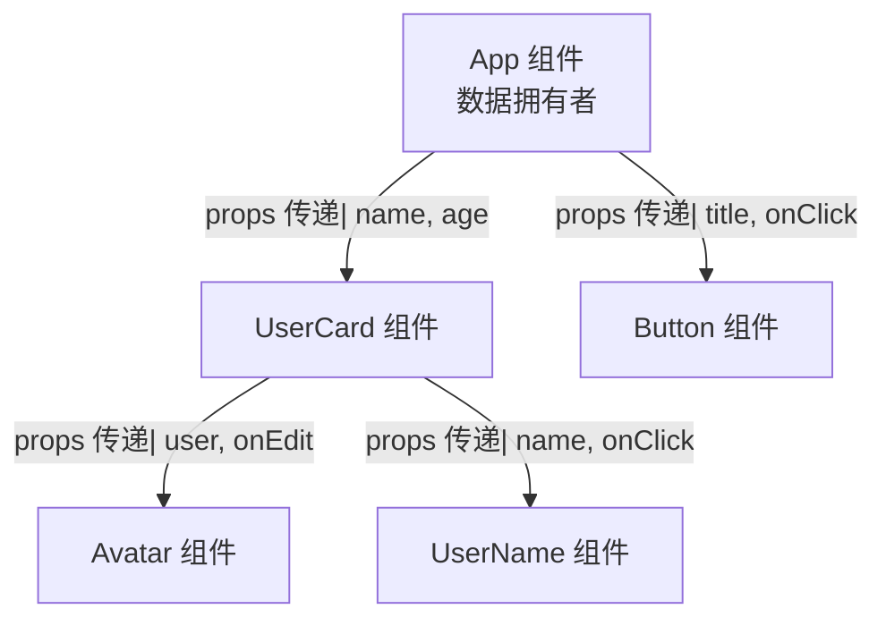

+++
title = "第7章 Props与组件参数"
weight = 70
date = "2026-03-25T12:56:00+08:00"
type = "docs"
description = ""
isCJKLanguage = true
draft = false
+++


# Chapter-07 - Props——组件的"参数"

## 7.1 Props 基础

> 如果把 React 组件比作一台饮料机，那 **Props** 就是投进去的硬币和选择按钮——它们是组件的"输入参数"，决定了组件最终输出什么样的"饮料"。 Props 是 React 组件之间传递数据的主要方式，也是 React 单向数据流的核心载体。

### 7.1.1 Props 的定义：父组件传递给子组件的数据

**Props** 是 "Properties" 的缩写，中文翻译是"属性"。从父组件传入子组件的数据，就是 props。

简单来说：
- **父组件**：数据的提供者和拥有者
- **子组件**：数据的接收者和使用者
- **Props**：数据传输的"管道"

```jsx
// 父组件：数据的拥有者，它决定传什么数据给子组件
function App() {
  const userName = '小明'
  const userAge = 25

  return (
    <div>
      {/* 把数据通过属性传递给 UserCard 组件 */}
      <UserCard name={userName} age={userAge} />
    </div>
  )
}

// 子组件：通过参数 props 接收父组件传来的数据
// props 是一个对象，里面包含了父组件传来的所有数据
function UserCard(props) {
  // props 看起来像这样：{ name: '小明', age: 25 }
  return (
    <div className="user-card">
      <h2>{props.name}</h2>
      <p>年龄：{props.age}</p>
    </div>
  )
}
```

> 🍺 饮料机的比喻：投币口就是 props 的入口，你投入什么硬币（数据），饮料机就吐出什么饮料（UI）。组件不会自己"变出"数据，它只是"接收"和"展示"数据。

### 7.1.2 单向数据流：数据只能从上往下流

React 的数据流是**单向的**——数据只能从父组件流向子组件，不能反过来。这听起来像限制，但实际上是一种精心设计的安全机制。

**单向数据流图解：**



**特点：**

1. **数据源清晰**：每个数据都有明确的"源头"——最顶层的组件
2. **数据流向明确**：顺着组件树往下流动，一级传一级
3. **便于追踪**：当数据出错时，只需往上游追溯，很快就能找到问题

```jsx
// 数据从上往下流：App -> Parent -> Child -> GrandChild
function App() {
  const appTitle = '我的应用'  // 数据源头

  return <Parent title={appTitle} />
}

function Parent({ title }) {
  // 中间商：Parent 只是"二传手"，把数据继续往下传
  return <Child title={title} />
}

function Child({ title }) {
  // 最终接收者：Child 使用这个数据
  return <h1>{title}</h1>
}
```

> 💡 单向数据流的好处：想象一下如果数据可以双向流动——子组件可以修改父组件的数据，父组件也可以修改子组件的数据——那代码就会乱成一锅粥，你改一下我，我改一下你，谁都不知道"真相"在哪里。单向数据流就像一条清澈的河流，水从上游往下游流，每个节点都清楚自己喝到的水是从哪来的。

### 7.1.3 Props 的只读性：子组件不能修改 props

Props 是**只读的**（Read-only）——子组件收到 props 之后，只能读取和使用，不能修改它。

这条规则是 React 的核心原则之一：**"React 组件必须像纯函数一样对待 props"**。

```jsx
// ❌ 错误：尝试修改 props（React 会报错！）
function BadComponent(props) {
  props.name = '新名字'  // 报错！Cannot assign to read only property 'name'
  return <div>{props.name}</div>
}

// ✅ 正确：props 是只读的，只能读取
function GoodComponent(props) {
  // props.name 是只读的，不能修改
  // 如果需要"修改"效果，应该通过回调函数通知父组件
  return (
    <div>
      <span>{props.name}</span>
      {/* 通过 onNameChange 回调，让父组件来修改数据 */}
      <button onClick={() => props.onNameChange('新名字')}>
        修改名字
      </button>
    </div>
  )
}
```

**为什么 props 不能修改？**

因为 React 的虚拟 DOM 依赖于"输入决定输出"的纯函数思想。如果组件能修改自己的输入（props），那每次渲染的结果就不可预测了——你不知道屏幕上显示的是不是上次修改后的值，React 的 Diffing 算法也无法正确判断哪些 DOM 需要更新。

---

## 7.2 传递各种类型的 Props

Props 可以传递任何 JavaScript 的合法数据类型——字符串、数字、布尔值、数组、对象、函数，甚至另一个 React 组件！

### 7.2.1 传递字符串 vs 传递数字/布尔值

**传递字符串**：最简单，不需要 `{}` 包裹，直接用引号。

```jsx
// 传递字符串
<UserCard name="小明" />
<Message text="你好呀！" />
<Title heading="欢迎来到我的网站" />

// 组件里接收
function UserCard(props) {
  console.log(typeof props.name)  // 打印结果：string
  return <span>{props.name}</span>
}
```

**传递数字和布尔值**：必须用 `{}` 包裹，因为它们是 JavaScript 表达式，不是字符串。

```jsx
// 传递数字
<UserCard age={25} />
<ItemList count={100} />
<ProgressBar percent={75} />

// 传递布尔值
<Button disabled={false} />
<Toggle isActive={true} />
<Checkbox checked={false} />

// 组件里接收
function Button({ disabled }) {
  console.log(typeof disabled)  // 打印结果：boolean
  return <button disabled={disabled}>点击</button>
}
```

> 💡 小技巧：布尔值 `true` 可以简写！`<Button disabled />` 等同于 `<Button disabled={true} />`。这是 JSX 的语法糖。

### 7.2.2 传递数组和对象

```jsx
// 传递数组
<TagList tags={['React', 'Vue', 'Angular']} />
<UserList users={[{id:1, name:'小明'}, {id:2, name:'小红'}]} />

// 传递对象
<UserProfile user={{ name: '小明', age: 25, city: '北京' }} />
<Config settings={{ theme: 'dark', language: 'zh-CN', fontSize: 16 }} />

// 组件里接收
function TagList({ tags }) {
  return (
    <div className="tag-list">
      {tags.map(tag => (
        <span key={tag} className="tag">{tag}</span>
      ))}
      {/* 打印结果：['React', 'Vue', 'Angular'] */}
    </div>
  )
}

function UserProfile({ user }) {
  return (
    <div>
      <p>姓名：{user.name}</p>
      <p>年龄：{user.age}</p>
      <p>城市：{user.city}</p>
    </div>
  )
}
```

### 7.2.3 传递函数：让子组件"呼叫"父组件

传递函数是 React 里实现**子组件通知父组件**的核心手段！子组件本身不能直接修改父组件的数据，但它可以通过调用父组件传下来的**回调函数**，让父组件知道"有情况"，然后由父组件来决定如何修改数据。

```jsx
// 父组件：提供数据和修改数据的方法
function Counter() {
  const [count, setCount] = useState(0)

  // 增量函数（子组件会调用它）
  function handleIncrement() {
    setCount(count + 1)
  }

  // 减量函数（子组件会调用它）
  function handleDecrement() {
    setCount(count - 1)
  }

  // 把函数作为 props 传给子组件
  return (
    <div>
      <p>当前计数：{count}</p>
      <CounterControls
        onIncrement={handleIncrement}
        onDecrement={handleDecrement}
      />
    </div>
  )
}

// 子组件：通过 props 接收函数，并调用
function CounterControls({ onIncrement, onDecrement }) {
  return (
    <div className="controls">
      <button onClick={onIncrement}>+1</button>
      <button onClick={onDecrement}>-1</button>
      {/* 注意：函数后面不跟 ()！onIncrement 而不是 onIncrement() */}
      {/* 因为 onIncrement 是把函数引用传过来，而不是调用它 */}
    </div>
  )
}
```

> 🔥 这是 React 中最重要的模式之一——**回调函数模式**。记住这个原则：**数据拥有者是父组件，修改数据的权力也在父组件。子组件只能"请求"修改，不能"擅自"修改。**

### 7.2.4 传递 JSX 元素：插槽机制

Props 不只可以传递"数据"，还可以传递"JSX 结构"——这就是插槽（Slot）机制，我们在第六章已经详细讲过。

```jsx
// Card 组件：通过 props.children 接收传入的 JSX
function Card({ children }) {
  return <div className="card">{children}</div>
}

// 使用：把一段 JSX 传进去
function App() {
  return (
    <Card>
      <h2>卡片标题</h2>
      <p>这是卡片的内容区域</p>
    </Card>
  )
}
```

### 7.2.5 传递组件本身

Props 还可以传递**组件类型**（Component Type）——这样可以让子组件"动态决定渲染什么"。

```jsx
// 定义两个不同的组件
function HomeIcon() { return <span>🏠</span> }
function UserIcon() { return <span>👤</span> }

// 接收组件类型作为 props
function NavItem({ icon: IconComponent, label }) {
  return (
    <div className="nav-item">
      <IconComponent />  {/* 把组件渲染出来 */}
      <span>{label}</span>
    </div>
  )
}

// 使用：把组件作为 prop 传进去
function App() {
  return (
    <nav>
      <NavItem icon={HomeIcon} label="首页" />
      <NavItem icon={UserIcon} label="我的" />
    </nav>
  )
}
```

### 7.2.6 传递日期、正则、React 元素等

```jsx
// 传递日期对象
<Clock currentDate={new Date()} />
<Calendar selectedDate={new Date('2024-01-01')} />

// 传递正则表达式
<FormField pattern={/^[a-zA-Z]+$/} error="只能输入英文字母" />
<Validator rule={/^\d{11}$/} value={phone} />

// 传递 React 元素
<Tooltip content={<span>这是提示文字</span>}>
  <button>悬停看提示</button>
</Tooltip>

<Badge count={<span>99+</span>} />
```

---

## 7.3 Props 的默认值与解构

### 7.3.1 defaultProps 的旧写法（了解）

在 Hooks 出现之前，给 props 设置默认值是用 `defaultProps` 来实现的。这种写法现在还能用，但**已经不太推荐了**，了解即可。

```jsx
// 旧写法：使用 defaultProps（即将被废弃）
function Button({ label, variant, size }) {
  return <button className={`btn btn-${variant} btn-${size}`}>{label}</button>
}

// 设置默认值
Button.defaultProps = {
  label: '按钮',       // 默认文字
  variant: 'primary',  // 默认样式
  size: 'medium'       // 默认尺寸
}

// 使用
<Button />  // label=按钮, variant=primary, size=medium
<Button label="提交" variant="danger" />  // label=提交, variant=danger, size=medium
```

> ⚠️ 注意：`defaultProps` 在 React 18 中已经被标记为 deprecated（废弃），在未来的 React 版本中会被移除。新的写法是用 ES6 的默认参数。

### 7.3.2 ES6 解构 + 默认值的现代写法

现代 React 推荐的写法是在函数参数中直接使用 ES6 的**解构赋值**和**默认值**：

```jsx
// 现代写法：在参数里直接解构 + 设置默认值
function Button({
  label = '按钮',           // 默认值
  variant = 'primary',
  size = 'medium',
  disabled = false,
  onClick
}) {
  return (
    <button
      className={`btn btn-${variant} btn-${size}`}
      disabled={disabled}
      onClick={onClick}
    >
      {label}
    </button>
  )
}

// 使用
<Button />  // 所有 props 都用默认值
<Button label="提交" onClick={() => alert('提交！')} />  // 只覆盖部分 props
```

**在参数中解构 vs 在函数体内解构：**

```jsx
// 方式一：在参数中直接解构（推荐！）
function UserCard({ name, age, avatar }) {
  return <div>{name} - {age}</div>
}

// 方式二：在函数体内解构
function UserCard(props) {
  const { name, age, avatar } = props
  return <div>{name} - {age}</div>
}

// 方式三：在函数体内解构（另一种写法）
function UserCard(props) {
  const name = props.name
  const age = props.age
  const avatar = props.avatar
  return <div>{name} - {age}</div>
}
```

方式一最简洁，推荐使用！

### 7.3.3 TypeScript 中 props 的类型定义

在 TypeScript 中，给组件的 props 定义类型是强烈推荐的——它能在编译阶段就发现错误，而不是等到运行时才崩溃。

下面是一个完整的 TypeScript Props 类型定义示例，我们为 Button 组件定义了 `ButtonProps` 接口，明确了每个 prop 的类型：

```tsx
// TypeScript 写法：为 props 定义接口
interface ButtonProps {
  label: string           // 必填
  variant?: 'primary' | 'secondary' | 'danger'  // 可选，枚举
  size?: 'small' | 'medium' | 'large'  // 可选，默认值
  disabled?: boolean      // 可选
  onClick?: () => void    // 可选，函数类型
}

// 函数组件的类型
function Button({
  label,
  variant = 'primary',
  size = 'medium',
  disabled = false,
  onClick
}: ButtonProps) {
  return (
    <button
      className={`btn btn-${variant} btn-${size}`}
      disabled={disabled}
      onClick={onClick}
    >
      {label}
    </button>
  )
}

// 使用时：如果传入类型错误，TypeScript 会报错！
// <Button label={123} />  // ❌ 报错：label 期望 string，传入了 number
// <Button variant="pink" />  // ❌ 报错：variant 只接受指定的三种值
```

---

## 7.4 Props.children：插槽机制

### 7.4.1 children 是什么？父组件标签内的内容

`props.children` 是 React 中一个特殊的 prop——它代表**父组件标签内部的所有内容**，不管你传的是文本、HTML、还是 React 组件，都会被收集到 `children` 里。

```jsx
// 定义一个 Card 组件
function Card({ children }) {
  return <div className="card">{children}</div>
}

// 使用 Card 组件
function App() {
  return (
    <Card>
      {/* 这些内容都会成为 Card 的 children */}
      <h2>卡片标题</h2>
      <p>这是卡片的内容</p>
      <button>点击我</button>
    </Card>
  )
}
```

### 7.4.2 children 的几种使用场景

**场景一：作为内容容器（最常见）**

```jsx
function Section({ title, children }) {
  return (
    <section className="section">
      <h2>{title}</h2>
      <div className="section-content">
        {children}
      </div>
    </section>
  )
}

function App() {
  return (
    <div>
      <Section title="功能特性">
        <p>特性一：速度快</p>
        <p>特性二：体积小</p>
        <p>特性三：易上手</p>
      </Section>

      <Section title="使用说明">
        <ol>
          <li>第一步：安装依赖</li>
          <li>第二步：配置项目</li>
          <li>第三步：开始开发</li>
        </ol>
      </Section>
    </div>
  )
}
```

**场景二：作为背景色块**

```jsx
function HighlightBox({ children, color = 'yellow' }) {
  return (
    <div style={{
      backgroundColor: color,
      padding: '16px',
      borderRadius: '8px'
    }}>
      {children}
    </div>
  )
}

function App() {
  return (
    <div>
      <HighlightBox color="#e3f2fd">
        <p>这是一段蓝色的高亮文字</p>
      </HighlightBox>
      <HighlightBox>
        <p>这是默认黄色背景的高亮文字</p>
      </HighlightBox>
    </div>
  )
}
```

### 7.4.3 具名插槽的实现方式

React 没有像 Vue 那样内置的"具名插槽"（Named Slots）语法，但可以通过**传多个 props** 来实现类似效果：

```jsx
// 通过 props 实现具名插槽
function Modal({ header, body, footer }) {
  return (
    <div className="modal-overlay">
      <div className="modal-content">
        {header && <div className="modal-header">{header}</div>}
        {body && <div className="modal-body">{body}</div>}
        {footer && <div className="modal-footer">{footer}</div>}
      </div>
    </div>
  )
}

function App() {
  return (
    <Modal
      header={<h2>确认操作</h2>}
      body={<p>您确定要删除这个文件吗？</p>}
      footer={
        <div className="modal-actions">
          <button>取消</button>
          <button>确认删除</button>
        </div>
      }
    />
  )
}
```

### 7.4.4 children 的类型：string / element / array / function

`props.children` 的类型根据传入内容的不同，可以是：

```jsx
function Demo({ children }) {
  console.log('children 类型:', typeof children)
  console.log('children:', children)

  // 可以用 React.Children 来操作 children
  // React.Children.map(children, child => ...) 遍历 children
  // React.Children.count(children) 计数
  // React.Children.only(children) 确保只有一个 children

  return <div>{children}</div>
}

function App() {
  return (
    <Demo>
      {/* 1. 字符串 children */}
      {'Hello, World!'}

      {/* 2. 数字/布尔值 children */}
      {42}
      {true}

      {/* 3. 单个元素 children */}
      {<span>单个元素</span>}

      {/* 4. 数组 children */}
      {[<span key={1}>元素1</span>, <span key={2}>元素2</span>]}

      {/* 5. 函数作为 children（Render Props 模式） */}
      {(data) => <div>渲染数据：{data}</div>}
    </Demo>
  )
}
```

---

## 7.5 解构 Props 的最佳实践

### 7.5.1 直接在参数中解构

这是最简洁、最推荐的写法：

```jsx
// ✅ 推荐：参数中直接解构
function UserCard({ name, age, avatar, onClick }) {
  return (
    <div onClick={onClick}>
      
      <span>{name}</span>
      <span>{age}岁</span>
    </div>
  )
}
```

### 7.5.2 解构重命名：避免变量名冲突

有时候从 props 解构出来的变量名和局部变量名冲突了，可以用**解构重命名**来解决：

```jsx
// 场景：props 里有 title，局部变量也有 title
// ❌ 错误写法：函数参数已经解构了 title，再用 const 声明会报错
function ArticleCard({ title, content, author }) {
  const title = '固定的标题'  // ❌ 报错！title 已经在参数中被解构，不能重复声明

  return (
    <div>
      <p>{content}</p>
    </div>
  )
}

// ✅ 正确写法：用解构重命名，把 props.title 改名为 articleTitle
function ArticleCardFixed(props) {
  const { title: articleTitle, content, author } = props
  const title = '固定的标题'  // ✅ 没问题！articleTitle 才是 props 里的 title

  return (
    <div>
      <h3>{title}</h3>
      <p>{articleTitle}</p>
    </div>
  )
}
```

### 7.5.3 解构与 TypeScript 类型结合

```tsx
// TypeScript 完整写法
interface UserCardProps {
  name: string
  age: number
  avatar: string
  onClick?: () => void
  className?: string
}

function UserCard({
  name,
  age,
  avatar,
  onClick,
  className = ''  // 有默认值的可选属性
}: UserCardProps) {
  return (
    <div
      className={`user-card ${className}`}
      onClick={onClick}
    >
      
      <span>{name}</span>
      <span>{age}岁</span>
    </div>
  )
}
```

---

## 本章小结

本章我们深入学习了 React 的"数据传输管道"——Props：

- **Props 基础**：Props 是父组件传递给子组件的数据，遵循单向数据流原则，子组件只能读取 props，不能修改它
- **传递各种类型的 Props**：字符串、数字、布尔值、数组、对象、函数、JSX 元素、React 组件、日期、正则……几乎任何 JavaScript 类型都可以作为 props 传递
- **传递函数**：回调函数是子组件"呼叫"父组件的核心手段，实现了子组件触发父组件状态更新的能力
- **默认值与解构**：ES6 解构 + 默认参数是现代 React 的推荐写法，比旧的 defaultProps 更简洁
- **children 插槽**：props.children 是一种特殊的 props，可以传入任意 JSX 内容，实现灵活的内容组合
- **解构最佳实践**：参数中直接解构、解构重命名、与 TypeScript 类型结合

Props 是 React 数据流的基础，掌握好 Props 就掌握了组件间通信的核心！下一章我们将学习 **State**——组件的"私有数据"！🚀