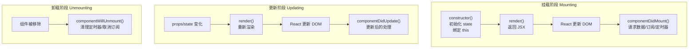

+++
title = "第8章 State与组件生命周期"
weight = 80
date = "2026-03-25T12:56:00+08:00"
type = "docs"
description = ""
isCJKLanguage = true
draft = false
+++


# Chapter-08 - State 与组件生命周期

## 8.1 State 基础

> Props 是从外部传入的数据，那组件内部自己产生的数据存在哪里呢？答案就是 **State**。如果说 Props 是组件的"身份证"（由父母给的，不能自己改），那 State 就是组件的"钱包"（自己挣的，自己管）。State 是组件内部的可变数据，当 State 变化时，组件会自动重新渲染。

### 8.1.1 State 的定义：组件内部的自有数据

**State**（状态）是 React 组件内部自行管理的数据。与 Props 的区别在于：
- **Props**：父组件给的，只读的，不能自己改
- **State**：自己生的，可以改，改了会触发重新渲染

```jsx
function Temperature() {
  // 这就是 State：组件自己管理的温度数据
  // 当 temperature 变化时，这个组件会重新渲染
  const [temperature, setTemperature] = useState(25)

  function handleIncrease() {
    setTemperature(temperature + 1)
  }

  return (
    <div>
      <p>当前温度：{temperature}°C</p>
      <button onClick={handleIncrease}>升温</button>
    </div>
  )
}
```

> 🌡️ 温度计的比喻：温度计显示的温度是"状态"。当你转动旋钮（调用 setState），温度会变化（状态更新），温度计的显示也会随之变化（重新渲染）。State 就是那个会随操作而变化、变化后会更新显示的数据。

### 8.1.2 Props vs State 核心对比表

| 对比维度 | Props | State |
|---------|-------|-------|
| **来源** | 父组件传入 | 组件自己初始化 |
| **修改权限** | 只读，不能改 | 可变，自己可以改 |
| **变化时** | 父组件重新传 props 才变 | 调用 setState 才变 |
| **用途** | 组件间通信 | 组件内部管理数据 |
| **是否触发渲染** | props 变 → 自身重新渲染 | state 变 → 自身重新渲染 |
| **是否应该变化** | 不应该变化（纯数据） | 应该变化（可变数据） |

```jsx
// Props 和 State 的典型使用场景
function UserCard({ name, age } /* ← Props：父组件给的 */) {
  // State：组件自己控制的"本地状态"
  const [isExpanded, setIsExpanded] = useState(false)  // 是否展开
  const [likeCount, setLikeCount] = useState(0)        // 点赞数

  return (
    <div className={`user-card ${isExpanded ? 'expanded' : ''}`}>
      {/* Props：只读，不应该被修改 */}
      <h2>{name}</h2>
      <p>年龄：{age}</p>

      {/* State：可以修改 */}
      <button onClick={() => setIsExpanded(!isExpanded)}>
        {isExpanded ? '收起' : '展开'}
      </button>

      <button onClick={() => setLikeCount(likeCount + 1)}>
        👍 {likeCount}
      </button>

      {/* 展开时显示更多信息 */}
      {isExpanded && (
        <div className="extra-info">
          <p>这是一个展开后的详细信息区域</p>
        </div>
      )}
    </div>
  )
}
```

### 8.1.3 什么时候该用 State？什么时候该用 Props？

这是一个让很多新手困惑的问题。记住这几个判断标准：

**用 State（组件内部可变数据）：**
- 数据是组件内部产生的
- 数据会随着用户操作而变化
- 数据不需要共享给其他组件
- 例如：表单输入值、开关状态、展开/收起、计时器当前值

**用 Props（外部传入的数据）：**
- 数据来自父组件
- 数据不应该在子组件内部被修改
- 数据需要在组件树中传递
- 例如：用户信息、文章列表、配置参数、回调函数

```jsx
// 判断：下面这些场景该用 State 还是 Props？

// 场景1：用户点击按钮，计数器+1
// → 用 State，因为是组件内部产生的变化
const [count, setCount] = useState(0)

// 场景2：父组件传入一个用户名，显示出来
// → 用 Props，因为是外部数据
function UserName({ name }) { return <span>{name}</span> }

// 场景3：输入框里用户正在输入的文字
// → 用 State，因为是组件内部产生的随时变化的数据
const [inputValue, setInputValue] = useState('')
<input value={inputValue} onChange={e => setInputValue(e.target.value)} />

// 场景4：从 API 获取的文章列表，传给列表组件
// → 用 Props，因为数据来自外部
<PostList posts={posts} />
```

---

## 8.2 useState Hook 详解

`useState` 是 React 最常用的 Hook，它让函数组件拥有了"记忆"可变数据的能力。

### 8.2.1 useState 的基本用法：`const [state, setState] = useState(initialValue)`

```jsx
import { useState } from 'react'

// useState 返回一个数组：[状态值, 更新状态的函数]
// 解构赋值拿到两个元素
const [count, setCount] = useState(0)

// count    → 当前的状态值
// setCount → 用来更新状态的函数（叫 setCount 是约定俗成的，但不是强制的）
// useState(0) → 初始值为 0
```

### 8.2.2 读取 state 的值

直接使用变量名读取：

```jsx
function Counter() {
  const [count, setCount] = useState(0)

  return (
    <div>
      {/* 直接在 JSX 里使用 count */}
      <p>当前计数：{count}</p>

      {/* 在事件处理器里读取 count */}
      <button onClick={() => {
        const newCount = count + 1
        console.log('当前是:', count, '即将变成:', newCount)
        setCount(newCount)
      }}>
        +1
      </button>
    </div>
  )
}
```

### 8.2.3 更新 state 的两种方式：直接值 vs 函数式更新

```jsx
const [count, setCount] = useState(0)

// 方式一：直接传新值（简单场景用这个）
setCount(10)  // count 变成 10

// 方式二：传一个函数（基于前一个 state 计算新 state 时用这个）
setCount(prevCount => prevCount + 1)  // count 变成 11
// prevCount 是更新前的 state 值
```

**什么时候必须用函数式更新？**

当你**基于当前 state 来计算新 state**时，必须用函数式更新！因为 React 的状态更新可能是**批量处理**的，直接值可能会遇到"闭包陷阱"。

```jsx
// ❌ 错误示例：连续调用 3 次 setCount(count + 1)
// 由于批量更新的存在，count 可能只会加 1，而不是加 3
function BadCounter() {
  const [count, setCount] = useState(0)

  function handleClick() {
    setCount(count + 1)  // 读取的是 0
    setCount(count + 1)  // 读取的还是 0（因为批量更新，count 还没变）
    setCount(count + 1)  // 读取的还是 0
  }
  // 结果：count = 1，而不是预期的 3
}

// ✅ 正确示例：用函数式更新，3 次都正确累加
function GoodCounter() {
  const [count, setCount] = useState(0)

  function handleClick() {
    setCount(prev => prev + 1)  // 1
    setCount(prev => prev + 1)  // 2
    setCount(prev => prev + 1)  // 3
  }
  // 结果：count = 3 ✅
}
```

### 8.2.4 useState 的返回值类型

`useState` 返回一个长度为 2 的数组，无论初始值是什么类型：

```jsx
// 初始值是数字
const [count, setCount] = useState(0)
// setCount: React.Dispatch<React.SetStateAction<number>>

// 初始值是字符串
const [name, setName] = useState('小明')
// setName: React.Dispatch<React.SetStateAction<string>>

// 初始值是对象
const [user, setUser] = useState({ name: '小明', age: 25 })
// setUser: React.Dispatch<React.SetStateAction<{ name: string; age: number }>>
```

### 8.2.5 多次调用 useState 的场景

一个组件里可以多次调用 `useState`，每个 `useState` 管理一个独立的状态：

```jsx
function UserForm() {
  // 每个 useState 管理一个独立的状态
  const [name, setName] = useState('')
  const [email, setEmail] = useState('')
  const [age, setAge] = useState(18)
  const [isSubmitting, setIsSubmitting] = useState(false)
  const [error, setError] = useState(null)

  function handleSubmit() {
    setIsSubmitting(true)
    setError(null)
    // 模拟提交
    setTimeout(() => {
      console.log({ name, email, age })
      setIsSubmitting(false)
    }, 1000)
  }

  return (
    <form>
      <input
        value={name}
        onChange={e => setName(e.target.value)}
        placeholder="姓名"
      />
      <input
        value={email}
        onChange={e => setEmail(e.target.value)}
        placeholder="邮箱"
      />
      <input
        type="number"
        value={age}
        onChange={e => setAge(Number(e.target.value))}
      />
      {error && <p className="error">{error}</p>}
      <button
        onClick={handleSubmit}
        disabled={isSubmitting}
      >
        {isSubmitting ? '提交中...' : '提交'}
      </button>
    </form>
  )
}
```

---

## 8.3 State 的初始化与更新

### 8.3.1 初始值的多种写法

```jsx
// 直接写初始值
const [count, setCount] = useState(0)
const [name, setName] = useState('小明')
const [isActive, setIsActive] = useState(false)
const [items, setItems] = useState([])

// 从变量传入初始值
const initialCount = 10
const [count, setCount] = useState(initialCount)

// 从函数计算初始值（惰性初始化）
const [data, setData] = useState(() => {
  // 这个函数只会在首次渲染时执行一次
  const saved = localStorage.getItem('data')
  return saved ? JSON.parse(saved) : defaultData
})
```

### 8.3.2 惰性初始化：只在首次渲染时执行一次

如果初始状态的计算比较耗时（比如从 localStorage 读取、复杂计算），不要直接传给 `useState()`，而是传一个**函数**。这样可以避免每次渲染都重新计算。

```jsx
// ❌ 低效：每次渲染都会重新解析 localStorage
const [data, setData] = useState(() => { const saved = localStorage.getItem('data'); return saved ? JSON.parse(saved) : null; })

// ✅ 高效：只在首次渲染时执行一次
const [data, setData] = useState(() => {
  const saved = localStorage.getItem('data')
  return saved ? JSON.parse(saved) : null
})
```

> 💡 什么时候需要惰性初始化？
> - 初始值需要从 localStorage / sessionStorage 读取
> - 初始值需要经过复杂计算
> - 初始值来自 props（但通常应该用 `useMemo` 或直接初始化）

### 8.3.3 批量更新：多次 setState 合并机制

在 React 18 之前，同一个事件处理器中的多次 `setState` 调用，**不会立即合并更新**——React 会等到事件处理结束后再统一更新（批量更新）。React 18 改进了这一点。

```jsx
// React 18+：所有 setState 自动批量更新
function handleClick() {
  setCount(1)    // 队列：count = 1
  setName('小明') // 队列：name = '小明'
  setAge(25)     // 队列：age = 25
  // React 会在这之后一次性重新渲染，只渲染一次！
}
```

### 8.3.4 批量更新在 React 18/19 中的改进

React 18 引入了**Automatic Batching（自动批处理）**，这意味着：

- **React 18 之前**：只有 React 事件处理函数中的 setState 会被批量处理
- **React 18 之后**：所有场景（包括 setTimeout、Promise、fetch 回调等）中的 setState 都会被批量处理

```jsx
// React 18 之前：fetch 回调中的 setState 不会被批量处理
function fetchUser() {
  fetch('/api/user')
    .then(res => res.json())
    .then(data => {
      setUser(data)        // 触发一次渲染
    })
    .then(() => {
      setLoading(false)    // 再触发一次渲染（性能浪费！）
    })
}

// React 18+：自动批量处理，只触发一次渲染
function fetchUser() {
  fetch('/api/user')
    .then(res => res.json())
    .then(data => {
      setUser(data)
      setLoading(false)  // 这次不会立即渲染，而是和上面的一起批量更新
    })
}
```

---

## 8.4 State 的组织与更新模式

### 8.4.1 按数据类型拆分 state

一个常见错误是把所有状态塞进一个对象里：

```jsx
// ❌ 不推荐：所有状态放一个对象
const [state, setState] = useState({
  name: '',
  age: 0,
  email: '',
  isLoading: false,
  error: null,
  data: []
})

// 更新时需要这样写：
setState(prev => ({ ...prev, name: '小明' }))  // 每次都要展开整个对象！
```

推荐**按数据类型拆分**多个 useState：

```jsx
// ✅ 推荐：按业务意义拆分
const [name, setName] = useState('')
const [age, setAge] = useState(0)
const [email, setEmail] = useState('')
const [isLoading, setIsLoading] = useState(false)
const [error, setError] = useState(null)
const [data, setData] = useState([])

// 更新时直接调用对应 setter，不需要展开对象
setName('小明')
setIsLoading(false)
```

### 8.4.2 按业务逻辑拆分 state

如果两个状态总是同时变化，可以考虑放在一起：

```jsx
// 场景：分页状态
// 当前的页码和每页条数通常一起变，放一起更方便
const [pagination, setPagination] = useState({
  page: 1,
  pageSize: 10
})

// 更新时一起更新
setPagination(prev => ({ ...prev, page: prev.page + 1 }))
// 或者一次性设置
setPagination({ page: 1, pageSize: 20 })
```

### 8.4.3 对象 state 的正确更新方式：展开运算符

当 state 本身是对象时，更新必须使用**展开运算符（...）** 保留其他属性：

```jsx
// ❌ 错误：直接覆盖整个对象，其他属性会丢失！
setUser({ name: '新名字' })  // age、email 等其他属性全丢了！

// ✅ 正确：展开 + 覆盖
setUser(prev => ({
  ...prev,    // 先展开旧对象，保留其他属性
  name: '新名字'  // 再覆盖要改的属性
}))

// ✅ 也正确：深度展开
setFormData(prev => ({
  ...prev,
  user: {
    ...prev.user,
    name: '新名字'
  }
}))
```

### 8.4.4 数组 state 的增删改查

```jsx
const [items, setItems] = useState(['苹果', '香蕉', '橙子'])

// 增加
function addItem(item) {
  setItems(prev => [...prev, item])  // 在末尾添加
  // 或者 setItems(prev => [item, ...prev]) 在开头添加
}

// 删除
function removeItem(index) {
  setItems(prev => prev.filter((_, i) => i !== index))
}

// 修改
function updateItem(index, newValue) {
  setItems(prev => prev.map((item, i) => i === index ? newValue : item))
}

// 查找
function findItem(name) {
  return items.find(item => item === name)
}
```

### 8.4.5 避免 state 冗余：计算属性不要放 state

**能够通过现有 state 计算出来的值，不需要单独放 state！** 因为每次渲染都会重新计算，直接算比存在 state 里更高效。

```jsx
// ❌ 冗余：firstName 和 lastName 已经存在了，fullName 不需要单独存
const [firstName, setFirstName] = useState('张')
const [lastName, setLastName] = useState('三')
const [fullName, setFullName] = useState('张三')  // 这就是冗余！

// ✅ 正确：fullName 通过计算得到，不需要单独的 state
function UserName() {
  const [firstName, setFirstName] = useState('张')
  const [lastName, setLastName] = useState('三')

  // 直接计算，永远是最新的
  const fullName = `${lastName}${firstName}`

  return (
    <div>
      <input value={firstName} onChange={e => setFirstName(e.target.value)} />
      <input value={lastName} onChange={e => setLastName(e.target.value)} />
      <p>全名：{fullName}</p>
    </div>
  )
}
```

---

## 8.5 Class 组件（旧写法，了解即可）

### 8.5.1 Class 组件的基本结构

虽然现代 React 推荐用函数组件，但 Class 组件的代码在老项目中还能见到，了解一下能帮助阅读旧代码：

```jsx
import React from 'react'

class Counter extends React.Component {
  // 1. 构造函数：初始化 state 和绑定 this
  constructor(props) {
    super(props)  // 必须调用 super(props)，否则 this.props 是 undefined
    this.state = {
      count: 0,
      name: '计数器'
    }
    // this 绑定：把 handleClick 的 this 绑定到当前组件实例
    this.handleClick = this.handleClick.bind(this)
  }

  // 2. 渲染方法：返回 JSX
  render() {
    // 通过 this.state 访问状态
    // 通过 this.props 访问 props
    return (
      <div>
        <h1>{this.state.name}</h1>
        <p>计数：{this.state.count}</p>
        <button onClick={this.handleClick}>+1</button>
      </div>
    )
  }

  // 3. 点击处理方法
  handleClick() {
    // 更新 state 必须用 this.setState()
    // this.setState() 会触发组件重新渲染
    this.setState({
      count: this.state.count + 1
    })
  }
}

export default Counter
```

### 8.5.2 this.state 的读取方式

```jsx
render() {
  // 直接读取
  const count = this.state.count
  const name = this.state.name

  // 解构赋值
  const { count, name } = this.state

  return <p>{count} - {name}</p>
}
```

### 8.5.3 this.setState 的用法与异步特性

`this.setState()` 的用法和函数组件的 `setState` 类似，但写法不同：

```jsx
// 方式一：直接传对象（会合并到 state）
this.setState({ count: 10 })

// 方式二：传函数（基于前一个 state）
this.setState(prevState => ({
  count: prevState.count + 1
}))

// setState 是异步的！
// 下面的代码中，直接读取 this.state.count 可能还是旧值
this.setState({ count: this.state.count + 1 })
console.log(this.state.count)  // 可能是更新前的值！

// 正确做法：使用 setState 的回调函数获取更新后的值
this.setState(
  { count: this.state.count + 1 },
  () => console.log('更新后的 count:', this.state.count)  // 这个回调在更新完成后调用
)
```

### 8.5.4 从 Class 组件迁移到函数组件的路径

| Class 组件 | 函数组件 |
|-----------|---------|
| `this.state` | `useState` |
| `this.setState()` | `setState()` |
| `this.props` | `props` 参数 |
| `componentDidMount` | `useEffect(..., [])` |
| `componentDidUpdate` | `useEffect(..., [deps])` |
| `componentWillUnmount` | `useEffect` 的清理函数 |
| `this.handleClick = this.handleClick.bind(this)` | 箭头函数直接定义 |
| 多个 state 放一个对象 | 多个 useState |

---

## 8.6 生命周期函数（旧版 Class 组件）

### 8.6.1 挂载阶段：constructor → render → componentDidMount

组件从创建到显示在页面上，经历三个步骤：

```jsx
class MyComponent extends React.Component {
  constructor(props) {
    super(props)
    console.log('1. constructor: 组件正在被创建')
    this.state = { data: null }
  }

  componentDidMount() {
    console.log('3. componentDidMount: 组件已经挂载到 DOM 上了')
    // 通常在这里：请求数据、添加事件监听、设置定时器
    this.fetchData()
  }

  render() {
    console.log('2. render: 正在渲染...')
    return <div>内容</div>
  }
}

// 打印顺序：constructor → render → componentDidMount
```

### 8.6.2 更新阶段：render → componentDidUpdate

当 props 或 state 变化时，组件会重新渲染：

```jsx
class MyComponent extends React.Component {
  componentDidUpdate(prevProps, prevState) {
    console.log('componentDidUpdate: 组件更新了！')
    console.log('之前的 props:', prevProps)
    console.log('当前的 props:', this.props)
    console.log('之前的状态:', prevState)
    console.log('当前的状态:', this.state)

    // 常见用法：根据某个 prop 的变化来做点什么
    if (prevProps.userId !== this.props.userId) {
      this.fetchUserData(this.props.userId)
    }
  }

  render() {
    return <div>{this.props.content}</div>
  }
}
```

### 8.6.3 卸载阶段：componentWillUnmount

组件从 DOM 上移除时调用，用于**清理资源**：

```jsx
class MyComponent extends React.Component {
  componentDidMount() {
    // 设置定时器
    this.timer = setInterval(() => {
      console.log('计时中...')
    }, 1000)

    // 添加事件监听
    window.addEventListener('resize', this.handleResize)
  }

  componentWillUnmount() {
    console.log('componentWillUnmount: 组件即将被卸载，清理资源！')

    // 清理定时器（必须！否则会造成内存泄漏）
    clearInterval(this.timer)

    // 移除事件监听（必须！否则会造成内存泄漏）
    window.removeEventListener('resize', this.handleResize)
  }

  render() {
    return <div>计时组件</div>
  }
}
```

### 8.6.4 生命周期图谱：一张图看懂所有阶段



### 8.6.5 已废弃的生命周期：componentWillMount / componentWillReceiveProps / componentWillUpdate

React 16.3 开始废弃了三个生命周期方法（React 17 中完全移除），原因是它们容易产生副作用和混淆：

| 废弃的生命周期 | 问题 | 现代替代方案 |
|-------------|------|------------|
| `componentWillMount` | 在渲染前执行，容易产生不一致的行为 | `componentDidMount` |
| `componentWillReceiveProps` | 命名混淆，实际是基于 props 更新的逻辑 | `getDerivedStateFromProps`（静态方法，不推荐）或重构代码 |
| `componentWillUpdate` | 在更新前执行，不能触发 setState | `componentDidUpdate` |

> ⚠️ **警告**：如果你在老代码里看到这些方法，不要再用它们了。现代 React 使用 `useEffect` 来处理所有副作用。

---

## 本章小结

本章我们深入学习了 React 的"状态管理"核心——State：

- **State 基础**：State 是组件内部的可变数据，与 Props 的核心区别是"谁拥有、谁能改"
- **useState Hook**：返回 `[state, setState]` 数组，用解构赋值获取；更新时优先使用函数式更新 `setState(prev => ...)` 避免闭包问题
- **State 初始化**：使用惰性初始化避免每次渲染重复计算；按数据类型拆分多个 useState 而非塞进一个对象
- **批量更新**：React 18+ 自动批处理所有场景的 setState，减少不必要的重新渲染
- **对象/数组 state 更新**：必须用展开运算符 `...` 保留其他属性
- **Class 组件（旧版）**：了解 `this.state`、`this.setState`、三个生命周期阶段的写法

State 和 Props 是 React 的两大数据支柱。Props 是"只读输入"，State 是"可变内存"。理解了两者的关系，就理解了 React 数据驱动的核心原理！下一章我们将学习 **useEffect**——React 处理"副作用"的神器！🪄