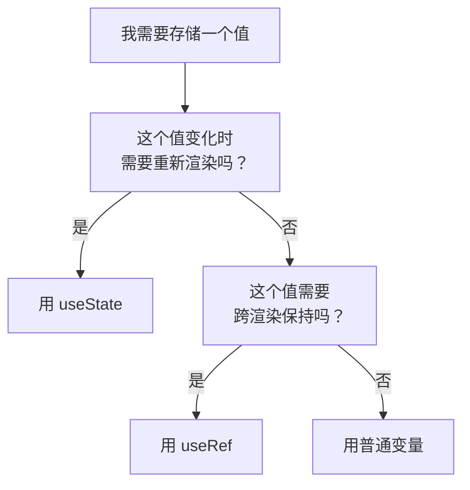

+++
title = "第10章 useState深入与自定义Hooks"
weight = 100
date = "2026-03-25T12:56:00+08:00"
type = "docs"
description = ""
isCJKLanguage = true
draft = false
+++


# Chapter-10 - useState 深入与自定义 Hook

## 10.1 函数式更新

### 10.1.1 什么是函数式更新：`setState(prevState => ...)`

函数式更新是 `setState` 的一种特殊用法——传入一个以**前一个状态**为参数的函数，返回新的状态。

```jsx
const [count, setCount] = useState(0)

// 普通更新：直接传值
setCount(10)

// 函数式更新：传一个函数
setCount(prevCount => prevCount + 1)
// prevCount 是更新前的状态值
// 返回值是新的状态值
```

### 10.1.2 何时必须用函数式更新：基于前一个 state 计算新 state

当新的状态**依赖于旧状态**时，必须用函数式更新。因为 React 的批量更新机制，直接值可能会读取到过期的状态。

```jsx
// ❌ 危险：连续调用 3 次，直接值可能出问题
function Counter() {
  const [count, setCount] = useState(0)

  function handleAddThree() {
    setCount(count + 1)  // 读取到的是 0
    setCount(count + 1)  // 读取到的还是 0（批量更新问题）
    setCount(count + 1)  // 读取到的仍然是 0
    // 结果：count = 1，不是预期的 3
  }

  return <button onClick={handleAddThree}>加3</button>
}

// ✅ 安全：连续调用 3 次，函数式更新保证每次都基于最新值
function Counter() {
  const [count, setCount] = useState(0)

  function handleAddThree() {
    setCount(prev => prev + 1)  // prev = 0，返回 1
    setCount(prev => prev + 1)  // prev = 1，返回 2
    setCount(prev => prev + 1)  // prev = 2，返回 3
    // 结果：count = 3 ✅
  }

  return <button onClick={handleAddThree}>加3</button>
}
```

### 10.1.3 函数式更新的优势：避免闭包陷阱

React 的函数组件在每次渲染时都会创建一个新的函数作用域。如果在 useEffect 或事件处理器中直接引用 state，会遇到"闭包陷阱"——引用的是旧状态的值。

```jsx
// ❌ 闭包陷阱：定时器回调里 count 永远是 0
function Counter() {
  const [count, setCount] = useState(0)

  useEffect(() => {
    const timer = setInterval(() => {
      setCount(count + 1)  // count 在这个闭包里永远是 0
    }, 1000)
    return () => clearInterval(timer)
  }, [])  // 空依赖，effect 只执行一次

  return <p>计数：{count}</p>
}

// ✅ 函数式更新解决闭包陷阱
function Counter() {
  const [count, setCount] = useState(0)

  useEffect(() => {
    const timer = setInterval(() => {
      setCount(prev => prev + 1)  // prev 总是最新的值
    }, 1000)
    return () => clearInterval(timer)
  }, [])

  return <p>计数：{count}</p>
}
```

---

## 10.2 惰性初始值

### 10.2.1 useState 的初始值可以是函数

`useState` 可以接受一个**函数**作为初始值，这个函数只会在**首次渲染时执行一次**。

```jsx
// 方式一：直接写初始值
const [data, setData] = useState(expensiveCalculation())
// 每次渲染都会执行 expensiveCalculation()，浪费性能！

// 方式二：惰性初始化（推荐）
const [data, setData] = useState(() => expensiveCalculation())
// expensiveCalculation() 只在首次渲染执行一次！
```

### 10.2.2 惰性初始化的适用场景：复杂计算

```jsx
// 场景一：从 localStorage 读取
const [theme, setTheme] = useState(() => {
  const saved = localStorage.getItem('theme')
  return saved || 'light'
})

// 场景二：复杂计算
const [filteredList, setFilteredList] = useState(() => {
  return allItems.filter(item => item.isActive)
})

// 场景三：从 props 派生（注意：通常这不是 useState 的最佳用法）
function UserCard({ userId }) {
  const [detail, setDetail] = useState(() => {
    // 只执行一次：根据初始 userId 获取详情
    return getUserDetail(userId)
  })
}
```

---

## 10.3 useRef 的深度用法

### 10.3.1 useRef 操作 DOM 元素：聚焦、选中文本

`useRef` 返回一个可变的 ref 对象，其 `.current` 属性指向一个 DOM 节点。

```jsx
import { useRef } from 'react'

function FocusInput() {
  // 创建一个 ref
  const inputRef = useRef(null)

  function handleFocus() {
    // 通过 ref.current 访问 DOM 节点
    inputRef.current.focus()  // 聚焦输入框
  }

  function handleSelect() {
    inputRef.current.select()  // 选中文本
  }

  return (
    <div>
      <input ref={inputRef} type="text" defaultValue="Hello" />
      <button onClick={handleFocus}>聚焦</button>
      <button onClick={handleSelect}>选中文本</button>
    </div>
  )
}
```

### 10.3.2 useRef 保存不需要触发重渲染的值

`useRef` 的另一个用途是：保存一个值，这个值**变化时不会触发组件重新渲染**。

```jsx
import { useState, useEffect, useRef } from 'react'

function Timer() {
  const [count, setCount] = useState(0)
  // 用来记录组件渲染了多少次（变化时不需要重新渲染）
  const renderCount = useRef(0)

  // 每次渲染都更新 ref，但不会触发重新渲染
  renderCount.current++

  useEffect(() => {
    const timer = setInterval(() => {
      setCount(prev => prev + 1)  // 用函数式更新，避免闭包陷阱
    }, 1000)
    return () => clearInterval(timer)
  }, [])  // ✅ 空数组：定时器只设置一次，不再依赖 count

  return (
    <div>
      <p>计数：{count}</p>
      {/* renderCount.current 变化了，但这里不会自动更新！ */}
      {/* 需要 forceUpdate 才能看到变化 */}
      <p>渲染次数：{renderCount.current}</p>
    </div>
  )
}
```

### 10.3.3 存储定时器 ID：避免闭包问题

定时器的 ID 需要存储，但存储在普通变量里会因为闭包问题导致无法清理。`useRef` 提供了解决方案。

```jsx
import { useState, useRef } from 'react'

function AutoCounter() {
  const [count, setCount] = useState(0)
  const timerRef = useRef(null)  // 用 ref 存储定时器 ID

  function start() {
    if (timerRef.current) return  // 防止重复启动
    timerRef.current = setInterval(() => {
      setCount(c => c + 1)
    }, 1000)
  }

  function stop() {
    if (timerRef.current) {
      clearInterval(timerRef.current)
      timerRef.current = null
    }
  }

  return (
    <div>
      <p>计数：{count}</p>
      <button onClick={start}>开始</button>
      <button onClick={stop}>停止</button>
    </div>
  )
}
```

### 10.3.4 存储前一个 state 值：prevState

```jsx
import { useState, useEffect, useRef } from 'react'

function PreviousValueDemo() {
  const [count, setCount] = useState(0)
  const prevCountRef = useRef()

  // 先把前一个值存起来
  useEffect(() => {
    prevCountRef.current = count
  })

  return (
    <div>
      <p>当前：{count}</p>
      <p>上一次：{prevCountRef.current}</p>
      <button onClick={() => setCount(c => c + 1)}>+1</button>
    </div>
  )
}
```

### 10.3.5 ref 不会被重置：每次渲染保持同一个对象

与 state 不同，ref 在每次渲染之间**保持同一个引用**，不会因为重新渲染而重置。

```jsx
import { useState, useRef } from 'react'

function Counter() {
  const [count, setCount] = useState(0)
  const countRef = useRef(0)  // 初始化为 0

  function handleClick() {
    countRef.current++  // ref 变化了
    setCount(count + 1)
    // 但 ref 的变化不会触发重新渲染
    console.log('ref:', countRef.current)  // 这个值会正确递增
  }

  return (
    <div>
      {/* 这里不会因为 countRef.current 变化而更新 */}
      <p>state: {count}</p>
      <button onClick={handleClick}>点我</button>
    </div>
  )
}
```

### 10.3.6 useRef vs useState 的选择决策树



| 场景 | useState | useRef |
|------|---------|--------|
| 渲染时需要显示的值 | ✅ | ❌ |
| 存储 DOM 节点引用 | ❌ | ✅ |
| 存储定时器 ID | ❌ | ✅ |
| 存储计算前的"前一个值" | ❌ | ✅ |
| 存储不需要渲染的计数器 | ❌ | ✅ |

---

## 10.4 自定义 Hook

### 10.4.1 自定义 Hook 是什么？以 use 开头的函数

**自定义 Hook**是一个以 `use` 开头的 JavaScript 函数，它内部可以使用其他 Hooks（useState、useEffect 等）。它的目的是**复用有状态的逻辑**。

```jsx
// 这是一个自定义 Hook：useWindowSize
function useWindowSize() {
  const [size, setSize] = useState({
    width: window.innerWidth,
    height: window.innerHeight
  })

  useEffect(() => {
    function handleResize() {
      setSize({
        width: window.innerWidth,
        height: window.innerHeight
      })
    }

    window.addEventListener('resize', handleResize)
    return () => window.removeEventListener('resize', handleResize)
  }, [])

  return size
}

// 使用：就像用普通 Hook 一样用！
function App() {
  const { width, height } = useWindowSize()
  return (
    <div>
      窗口尺寸：{width} x {height}
    </div>
  )
}
```

### 10.4.2 自定义 Hook 的规则：只在顶层调用 Hook

自定义 Hook 本质上还是 Hook，所以必须遵循 Hooks 的规则：
- 只在函数组件或自定义 Hook 的**顶层**调用
- 不能在循环、条件语句、嵌套函数里调用

> **为什么 Hook 必须在顶层调用？** 你可以把 Hook 想象成 React 的"状态快照"——每次渲染时，React 按调用顺序记录"第1个 Hook 返回 count，第2个 Hook 返回 user..."。如果把 Hook 放在 if 条件里，这次渲染调用了，下次渲染不调用，React 的记录就对不上了。所以 Hook 必须稳定、可预测地在每次渲染时都按相同顺序调用。

---

### 10.4.3 实战：useWindowSize Hook

```jsx
// hooks/useWindowSize.js
import { useState, useEffect } from 'react'

function useWindowSize() {
  const [windowSize, setWindowSize] = useState({
    width: typeof window !== 'undefined' ? window.innerWidth : 0,
    height: typeof window !== 'undefined' ? window.innerHeight : 0
  })

  useEffect(() => {
    function handleResize() {
      setWindowSize({
        width: window.innerWidth,
        height: window.innerHeight
      })
    }

    window.addEventListener('resize', handleResize)
    return () => window.removeEventListener('resize', handleResize)
  }, [])

  return windowSize
}

export default useWindowSize
```

### 10.4.4 实战：useLocalStorage Hook

```jsx
// hooks/useLocalStorage.js
import { useState, useEffect } from 'react'

function useLocalStorage(key, initialValue) {
  // 初始值：从 localStorage 读取，如果没有就用 initialValue
  const [storedValue, setStoredValue] = useState(() => {
    try {
      const item = window.localStorage.getItem(key)
      return item ? JSON.parse(item) : initialValue
    } catch (error) {
      console.error('读取 localStorage 失败:', error)
      return initialValue
    }
  })

  // 监听其他标签页的修改
  useEffect(() => {
    function handleStorageChange(e) {
      if (e.key === key && e.newValue !== null) {
        try {
          setStoredValue(JSON.parse(e.newValue))
        } catch (error) {
          console.error('解析 localStorage 失败:', error)
        }
      }
    }

    window.addEventListener('storage', handleStorageChange)
    return () => window.removeEventListener('storage', handleStorageChange)
  }, [key])

  // 写入 localStorage
  const setValue = (value) => {
    try {
      const valueToStore = value instanceof Function ? value(storedValue) : value
      setStoredValue(valueToStore)
      window.localStorage.setItem(key, JSON.stringify(valueToStore))
    } catch (error) {
      console.error('写入 localStorage 失败:', error)
    }
  }

  return [storedValue, setValue]
}

export default useLocalStorage
```

### 10.4.5 实战：useDebounce Hook

```jsx
// hooks/useDebounce.js
import { useState, useEffect } from 'react'

function useDebounce(value, delay = 500) {
  const [debouncedValue, setDebouncedValue] = useState(value)

  useEffect(() => {
    // 设置一个定时器，delay 毫秒后更新 debouncedValue
    const timer = setTimeout(() => {
      setDebouncedValue(value)
    }, delay)

    // 如果 value 在 delay 期间又变化了，清除上一个定时器
    return () => clearTimeout(timer)
  }, [value, delay])

  return debouncedValue
}

export default useDebounce

// 使用：搜索防抖
function SearchComponent() {
  const [keyword, setKeyword] = useState('')
  const debouncedKeyword = useDebounce(keyword, 300)  // 300ms 防抖

  // debouncedKeyword 变化时才发请求
  useEffect(() => {
    if (debouncedKeyword) {
      search(debouncedKeyword)
    }
  }, [debouncedKeyword])

  return (
    <input
      value={keyword}
      onChange={e => setKeyword(e.target.value)}
      placeholder="搜索..."
    />
  )
}
```

### 10.4.6 实战：useClickOutside Hook

```jsx
// hooks/useClickOutside.js
import { useEffect, useRef } from 'react'

function useClickOutside(callback) {
  const ref = useRef(null)

  useEffect(() => {
    function handleClickOutside(event) {
      // 如果点击发生在 ref 指向的元素外部，执行回调
      if (ref.current && !ref.current.contains(event.target)) {
        callback()
      }
    }

    document.addEventListener('mousedown', handleClickOutside)
    document.addEventListener('touchstart', handleClickOutside)

    return () => {
      document.removeEventListener('mousedown', handleClickOutside)
      document.removeEventListener('touchstart', handleClickOutside)
    }
  }, [callback])

  return ref
}

export default useClickOutside

// 使用：关闭弹窗
import { useState } from 'react'

function Dropdown() {
  const [isOpen, setIsOpen] = useState(false)
  const dropdownRef = useClickOutside(() => setIsOpen(false))

  return (
    <div ref={dropdownRef}>
      <button onClick={() => setIsOpen(!isOpen)}>
        {isOpen ? '关闭' : '打开'}下拉菜单
      </button>
      {isOpen && (
        <div className="dropdown-menu">
          <p>选项1</p>
          <p>选项2</p>
          <p>选项3</p>
        </div>
      )}
    </div>
  )
}
```

### 10.4.7 实战：useToggle Hook

```jsx
// hooks/useToggle.js
import { useState, useCallback } from 'react'

function useToggle(initialValue = false) {
  const [value, setValue] = useState(initialValue)

  const toggle = useCallback(() => {
    setValue(v => !v)
  }, [])

  const setTrue = useCallback(() => {
    setValue(true)
  }, [])

  const setFalse = useCallback(() => {
    setValue(false)
  }, [])

  return { value, toggle, setTrue, setFalse }
}

export default useToggle

// 使用：折叠面板
function Accordion({ title, children }) {
  const { value: isOpen, toggle } = useToggle(false)

  return (
    <div className="accordion">
      <button onClick={toggle}>
        {title} {isOpen ? '▲' : '▼'}
      </button>
      {isOpen && <div className="content">{children}</div>}
    </div>
  )
}
```

### 10.4.8 实战：usePrevious Hook

```jsx
// hooks/usePrevious.js
import { useRef, useEffect } from 'react'

function usePrevious(value) {
  // ref 的 current 属性会持久化，不会随着渲染重置
  const ref = useRef()

  // 每次渲染后更新 ref（因为没有依赖数组，effect 每次渲染后都会执行）
  // 注意：这里故意不加 [value] 依赖，因为我们的目的就是在渲染后"滞后"更新 ref
  // 这样 return 的 ref.current 永远是上一次的值
  // 注意：在 React 18 Strict Mode 下，effect 会执行两次（开发环境），这是正常现象
  useEffect(() => {
    ref.current = value
  })

  // 返回的是上一次渲染时的 value
  return ref.current
}

export default usePrevious

// 使用：比较值的变化
import { useState } from 'react'

function Counter() {
  const [count, setCount] = useState(0)
  const previousCount = usePrevious(count)

  return (
    <div>
      <p>当前：{count}</p>
      <p>上次：{previousCount}</p>
      <button onClick={() => setCount(c => c + 1)}>+1</button>
    </div>
  )
}
```

---

## 本章小结

本章我们深入探索了 React Hooks 的高级用法：

- **函数式更新**：当新状态依赖旧状态时，必须用 `setState(prev => ...)` 的函数式更新写法，避免批量更新和闭包陷阱
- **惰性初始化**：`useState(() => expensiveCalculation())` 确保初始值计算只在首次渲染执行一次
- **useRef 深度用法**：操作 DOM（聚焦/选中文本）、存储定时器 ID、保存跨渲染的临时值、存储前一个状态值
- **自定义 Hook**：以 `use` 开头的函数可以封装和复用有状态的逻辑；实战案例包括 useWindowSize、useLocalStorage、useDebounce、useClickOutside、useToggle、usePrevious

自定义 Hook 是 React 中最重要的逻辑复用模式——它比 HOC 和 Render Props 更直观、更灵活。学会编写自定义 Hook，就意味着你已经从"会用 React"进化到了"精通 React"！下一章我们将学习 **useContext**——跨组件共享数据的利器！🔗