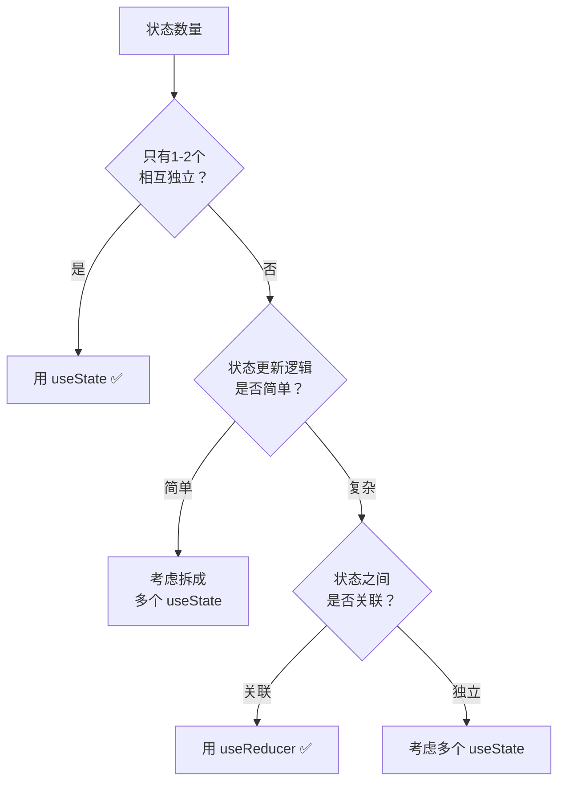

+++
title = "第12章 useReducer与复杂状态管理"
weight = 120
date = "2026-03-25T12:56:00+08:00"
type = "docs"
description = ""
isCJKLanguage = true
draft = false
+++


# Chapter-12 - useReducer——复杂状态逻辑管理

## 12.1 useState vs useReducer

### 12.1.1 useState 适用场景：简单、独立的状态

`useState` 适合管理**简单的、相互独立的状态**。

```jsx
// useState 最适合的场景：单个的、简单的状态
const [name, setName] = useState('')
const [isLoading, setIsLoading] = useState(false)
const [count, setCount] = useState(0)
```

### 12.1.2 useReducer 适用场景：状态逻辑复杂、多个子值相关联

当状态满足以下条件时，`useReducer` 比 `useState` 更好：
- **多个子状态相互关联**，一个状态的变化依赖于另一个
- **状态的更新逻辑很复杂**，涉及到多个条件判断
- **状态的变化有规律性**，可以归纳为"发生了什么类型的动作"

```jsx
// useReducer 适合的场景：购物车状态
// - 添加商品
// - 删除商品
// - 修改商品数量
// - 清空购物车
// - 应用优惠券

function cartReducer(state, action) {
  switch (action.type) {
    case 'ADD_ITEM':
      return { ...state, items: [...state.items, action.payload] }
    case 'REMOVE_ITEM':
      return {
        ...state,
        items: state.items.filter(item => item.id !== action.payload.id)
      }
    case 'UPDATE_QUANTITY':
      return {
        ...state,
        items: state.items.map(item =>
          item.id === action.payload.id
            ? { ...item, quantity: action.payload.quantity }
            : item
        )
      }
    case 'CLEAR_CART':
      return { ...state, items: [] }
    default:
      return state
  }
}
```

### 12.1.3 决策树：如何选择



**实际例子帮你理解：**

| 场景 | 推荐 | 原因 |
|------|------|------|
| 开关切换 `isOn` | `useState` | 单个布尔值，简单独立 |
| 计数器 `count` | `useState` | 只有一个数字，更新逻辑简单 |
| 表单多个字段 `name`/`email`/`phone` | 多个 `useState` 或 `useReducer` | 字段独立但更新逻辑可能复杂 |
| 购物车（商品列表、总价、优惠券） | `useReducer` | 商品数量变化影响总价，状态相互关联 |
| 多步骤表单（step1填完→step2→step3提交） | `useReducer` | 状态之间有流程关联 |
| 复杂编辑器（undo/redo、历史记录） | `useReducer` | 操作历史需要统一管理 |

---

## 12.2 reducer 函数

### 12.2.1 reducer 的结构：`(state, action) => newState`

`reducer` 是一个**纯函数**，它接收当前状态和动作，返回新状态。

```jsx
// reducer 的签名
function reducer(state, action) {
  // state: 当前状态
  // action: 描述"发生了什么"的对象
  // 返回值: 新的状态
  return newState
}
```

### 12.2.2 switch 语句 vs 对象映射表

**方式一：switch 语句（最常用）**

```jsx
function reducer(state, action) {
  switch (action.type) {
    case 'INCREMENT':
      return { ...state, count: state.count + 1 }
    case 'DECREMENT':
      return { ...state, count: state.count - 1 }
    case 'RESET':
      return { ...state, count: 0 }
    case 'SET_COUNT':
      return { ...state, count: action.payload }
    default:
      return state  // 未知 action，返回原状态
  }
}
```

**方式二：对象映射表（适合 action 类型很多的情况）**

```jsx
const actionHandlers = {
  INCREMENT: (state) => ({ ...state, count: state.count + 1 }),
  DECREMENT: (state) => ({ ...state, count: state.count - 1 }),
  RESET: (state) => ({ ...state, count: 0 }),
  SET_COUNT: (state, action) => ({ ...state, count: action.payload })
}

function reducer(state, action) {
  const handler = actionHandlers[action.type]
  return handler ? handler(state, action) : state
}
```

### 12.2.3 纯函数原则：reducer 必须是纯函数

**纯函数的原则：**
1. **同样的输入，永远得到同样的输出**
2. **不修改传入的参数**
3. **没有副作用**（不发起网络请求、不修改全局变量、不调用不纯的函数）

```jsx
// ❌ 错误：reducer 里有副作用
function reducer(state, action) {
  switch (action.type) {
    case 'FETCH_SUCCESS':
      // ❌ 不要在 reducer 里发请求！
      fetch('/api/data').then(res => res.json())
      return { ...state, data: ??? }  // 你根本不知道 data 是什么

    case 'LOG':
      // ❌ 不要在 reducer 里打印日志！
      console.log('action:', action)
      return state

    default:
      return state
  }
}

// ✅ 正确：reducer 只是一个计算新状态的纯函数
function reducer(state, action) {
  switch (action.type) {
    case 'SET_LOADING':
      return { ...state, isLoading: action.payload }
    case 'SET_DATA':
      return { ...state, data: action.payload, isLoading: false }
    case 'SET_ERROR':
      return { ...state, error: action.payload, isLoading: false }
    default:
      return state
  }
}
```

---

## 12.3 dispatch 与 action 设计

### 12.3.1 action 对象的结构：`{ type, payload }`

`action` 是描述"发生了什么"的普通对象，通常包含：
- `type`：动作类型，字符串，用来区分不同的操作
- `payload`：可选，携带的附加数据

```jsx
// 典型的 action 对象
{ type: 'ADD_ITEM', payload: { id: 1, name: 'iPhone', price: 7999, quantity: 1 } }
{ type: 'REMOVE_ITEM', payload: { id: 1 } }
{ type: 'UPDATE_QUANTITY', payload: { id: 1, quantity: 3 } }
{ type: 'CLEAR_CART' }
```

### 12.3.2 type 命名规范：常量化避免拼写错误

当 action type 很多时，容易出现拼写错误。推荐用**常量**来定义 action type：

```jsx
// actionTypes.js
export const CartActionTypes = {
  ADD_ITEM: 'cart/ADD_ITEM',
  REMOVE_ITEM: 'cart/REMOVE_ITEM',
  UPDATE_QUANTITY: 'cart/UPDATE_QUANTITY',
  CLEAR_CART: 'cart/CLEAR_CART',
  APPLY_COUPON: 'cart/APPLY_COUPON'
}

// reducer.js
import { CartActionTypes } from './actionTypes'

function cartReducer(state, action) {
  switch (action.type) {
    case CartActionTypes.ADD_ITEM:
      // ...
    case CartActionTypes.REMOVE_ITEM:
      // ...
    default:
      return state
  }
}
```

### 12.3.3 复杂的 payload 设计

有时 payload 里需要携带多个相关数据：

```jsx
// 多个相关数据放在 payload 对象里
{ type: 'UPDATE_USER_PROFILE', payload: { name: '新名字', email: 'new@email.com', avatar: '/new.jpg' } }

// 分页信息
{ type: 'SET_PAGE', payload: { page: 2, pageSize: 20, total: 100 } }

// 表单批量更新
{ type: 'UPDATE_FORM', payload: { field: 'email', value: 'test@example.com' } }
```

---

## 12.4 useReducer + useContext

### 12.4.1 将 reducer 和 dispatch 通过 Context 共享

当应用的状态逻辑变复杂时，可以把 `useReducer` 和 `useContext` 结合，创建一个**全局状态管理方案**。

```jsx
// store/CartContext.js
import { createContext, useContext, useReducer } from 'react'
import { cartReducer, initialCartState } from './cartReducer'

const CartContext = createContext(null)

function CartProvider({ children }) {
  const [state, dispatch] = useReducer(cartReducer, initialCartState)

  return (
    <CartContext.Provider value={{ state, dispatch }}>
      {children}
    </CartContext.Provider>
  )
}

function useCart() {
  const context = useContext(CartContext)
  if (!context) {
    throw new Error('useCart 必须在 CartProvider 内使用')
  }
  return context
}

export { CartProvider, useCart }
```

### 12.4.2 实现一个最简单的全局状态管理模式

这就是一个最原始的"状态管理库"！虽然简陋，但原理和 Redux 是一样的：

```jsx
// cartReducer.js
const initialCartState = {
  items: [],
  totalPrice: 0,
  coupon: null,
  isLoading: false
}

function cartReducer(state, action) {
  switch (action.type) {
    case 'ADD_ITEM': {
      const existingIndex = state.items.findIndex(
        item => item.id === action.payload.id
      )

      let newItems
      if (existingIndex >= 0) {
        // 商品已存在，只增加数量
        newItems = state.items.map((item, index) =>
          index === existingIndex
            ? { ...item, quantity: item.quantity + 1 }
            : item
        )
      } else {
        // 新商品
        newItems = [...state.items, { ...action.payload, quantity: 1 }]
      }

      return {
        ...state,
        items: newItems,
        totalPrice: newItems.reduce((sum, item) => sum + item.price * item.quantity, 0)
      }
    }

    case 'REMOVE_ITEM': {
      const newItems = state.items.filter(item => item.id !== action.payload.id)
      return {
        ...state,
        items: newItems,
        totalPrice: newItems.reduce((sum, item) => sum + item.price * item.quantity, 0)
      }
    }

    case 'CLEAR_CART':
      return initialCartState

    default:
      return state
  }
}

export { cartReducer, initialCartState }
```

```jsx
// 任意组件中使用
import { useCart } from '../store/CartContext'

function AddToCartButton({ product }) {
  const { dispatch } = useCart()

  function handleAddToCart() {
    dispatch({
      type: 'ADD_ITEM',
      payload: {
        id: product.id,
        name: product.name,
        price: product.price
      }
    })
  }

  return <button onClick={handleAddToCart}>加入购物车</button>
}

function CartSummary() {
  const { state } = useCart()

  return (
    <div>
      <p>商品数量：{state.items.length}</p>
      <p>总价：¥{state.totalPrice}</p>
    </div>
  )
}
```

### 12.4.3 与 Redux 的对比

| 对比项 | useReducer + Context | Redux |
|-------|---------------------|-------|
| **学习曲线** | 低，几乎零配置 | 高，有很多概念要学 |
| **代码量** | 少 | 多（action、reducer、store、middleware...） |
| **DevTools** | 无官方支持 | 有官方 Redux DevTools |
| **中间件** | 自己实现 | 有现成的中间件体系 |
| **适用场景** | 中小型应用 | 中大型、复杂应用 |
| **第三方库依赖** | 无（只用 React 内置） | 需要安装 redux、react-redux 等 |

---

## 本章小结

本章我们学习了 React 中处理复杂状态逻辑的利器——useReducer：

- **useState vs useReducer**：useState 适合简单独立的状态，useReducer 适合状态逻辑复杂、多个子值相互关联的场景
- **reducer 函数结构**：`reducer(state, action) => newState`，是纯函数，不能有副作用
- **action 设计**：`{ type, payload }` 结构，type 用常量避免拼写错误，payload 携带相关数据
- **useReducer + useContext**：结合使用可以创建简单的全局状态管理方案，原理与 Redux 一致

useReducer 是 React 内置的"状态管理工具"，在复杂表单、购物车、多步骤流程等场景非常有用。掌握了 useReducer，就为学习 Redux/Zustand 等外部状态管理库打下了坚实基础！下一章我们将学习 **useMemo、useCallback 和 React.memo**——React 性能优化的三剑客！⚡