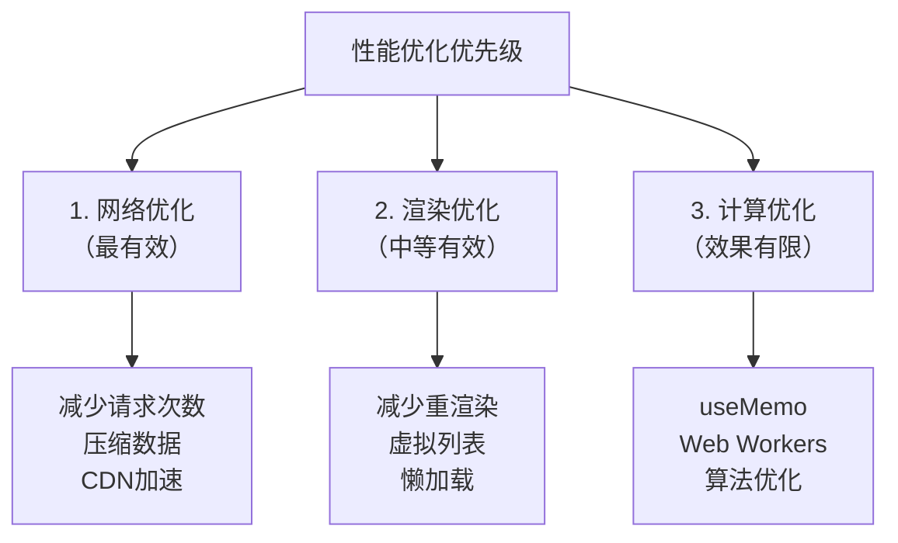

+++
title = "第13章 useMemo、useCallback与性能优化"
weight = 130
date = "2026-03-25T12:56:00+08:00"
type = "docs"
description = ""
isCJKLanguage = true
draft = false
+++


# Chapter-13 - useMemo、useCallback 与 React.memo——性能优化

## 13.1 useMemo：缓存计算结果

### 13.1.1 为什么需要 useMemo？

假设你有一个组件，每次渲染时都需要对大量数据做过滤、排序、统计——这些计算可能很耗时（想象一下对10万条数据排序）。问题是：**即使数据没变，这些计算在每次渲染时都会重复执行**。

```jsx
function ProductList({ products, category }) {
  // ❌ 问题：每次渲染都重新排序10万条数据，即使 products 没变！
  const sorted = expensiveSort(products)

  return <div>{/* ... */}</div>
}
```

`useMemo` 就是来解决这个问题的——它像一个"计算结果缓存器"，只有当依赖变化时才重新计算，否则直接返回上次的结果。

### 13.1.2 useMemo 的签名：`useMemo(() => computedValue, [deps])`

```jsx
import { useMemo } from 'react'

function expensiveCalculation(n) {
  // 假设这是一个非常耗时的计算
  let result = 0
  for (let i = 0; i < n * 10000000; i++) {
    result += i
  }
  return result
}

function Component({ numbers, factor }) {
  // ❌ 每次渲染都重新计算（即使 numbers 没变）
  const filteredNoMemo = numbers.filter(n => n > factor)

  // ✅ 只有当 numbers 或 factor 变化时才重新计算
  const filtered = useMemo(() => {
    console.log('计算中...')
    return numbers.filter(n => n > factor)
  }, [numbers, factor])

  return <div>结果：{filtered.length}</div>
}
```

### 13.1.3 适用场景：昂贵计算、避免重复计算

**场景一：大量数据的过滤、排序、映射**

```jsx
function ProductList({ products, category, sortBy }) {
  // 只有 products、category 或 sortBy 变化时才重新计算
  const processedProducts = useMemo(() => {
    console.log('处理商品列表...')
    let result = [...products]

    // 分类过滤
    if (category) {
      result = result.filter(p => p.category === category)
    }

    // 排序
    if (sortBy === 'price') {
      result.sort((a, b) => a.price - b.price)
    } else if (sortBy === 'name') {
      result.sort((a, b) => a.name.localeCompare(b.name))
    }

    return result
  }, [products, category, sortBy])

  return (
    <ul>
      {processedProducts.map(p => (
        <li key={p.id}>{p.name} - ¥{p.price}</li>
      ))}
    </ul>
  )
}
```

**场景二：派生数据（derived data）**

```jsx
function OrderSummary({ items }) {
  // items 没变时，不需要重新计算这些派生数据
  const subtotal = useMemo(() =>
    items.reduce((sum, item) => sum + item.price * item.quantity, 0),
    [items]
  )

  const tax = useMemo(() => subtotal * 0.1, [subtotal])
  const discount = useMemo(() => subtotal > 1000 ? subtotal * 0.1 : 0, [subtotal])
  const total = useMemo(() => subtotal + tax - discount, [subtotal, tax, discount])

  return (
    <div>
      <p>小计：¥{subtotal}</p>
      <p>税费：¥{tax}</p>
      <p>折扣：-¥{discount}</p>
      <p>总计：¥{total}</p>
    </div>
  )
}
```

### 13.1.4 滥用 useMemo 的代价：记忆本身也有成本

`useMemo` 不是免费的——它需要额外的内存来存储计算结果，也需要比较依赖数组来决定是否重新计算。如果滥用，反而会影响性能。

```jsx
// ❌ 滥用 useMemo：简单的计算不需要 memoization
function SimpleComponent({ a, b }) {
  const sum = useMemo(() => a + b, [a, b])  // ❌ 过度优化，a + b 几乎不消耗性能
  return <div>{sum}</div>
}

// ✅ 正确的使用场景：计算量大、耗时长
function HeavyComponent({ data }) {
  const processed = useMemo(() => expensiveChartCalculation(data), [data])
  return <Chart data={processed} />
}
```

### 13.1.5 依赖数组的常见错误

```jsx
// ❌ 错误：依赖数组不完整
function BadExample({ list, search }) {
  const filtered = useMemo(() => {
    return list.filter(item => item.name.includes(search))
  }, [list])  // ❌ 漏了 search！
  return <div>{filtered.length}</div>
}

// ✅ 正确：完整的依赖数组
function GoodExample({ list, search }) {
  const filtered = useMemo(() => {
    return list.filter(item => item.name.includes(search))
  }, [list, search])
  return <div>{filtered.length}</div>
}
```

---

## 13.2 useCallback：缓存函数定义

### 13.2.1 useCallback 的签名：`useCallback(fn, [deps])`

`useCallback` 是专门用来**缓存函数定义**的，防止每次渲染都创建新的函数引用。

```jsx
import { useCallback } from 'react'

// ❌ 每次渲染都创建新的函数引用（但大多数情况下这不是问题）
const handleClick = () => {
  console.log('clicked')
}

// ✅ 只有 dependencies 变化时才创建新函数
const handleClick = useCallback(() => {
  console.log('clicked')
}, [])  // 空数组，函数引用永远不变
```

### 13.2.2 解决子组件不必要重渲染的问题

首先搞清楚一个关键问题：**为什么父组件重新渲染时，函数引用会变？**

这是因为 JavaScript 的函数是"一等公民"——每次调用函数体都会创建新的函数对象。就像：

```jsx
// 每次渲染都执行这个函数，所以每次都创建新的 handleClick
function Parent() {
  function handleClick() {  // 这次渲染：新函数 A
    console.log('clicked')
  }
  return <Child onClick={handleClick} />
}

// 下次渲染时：handleClick 是完全不同的函数 B
// 即使函数体完全一样，它们也是不同的引用！
```

当父组件重新渲染时，`handleClick` 函数会被重新创建（新的引用）。如果子组件用 `React.memo` 包裹，React 会比较 props 引用——发现 `onClick` 从 A 变成 B，就会认为 props 变了，导致子组件重渲染。

`useCallback` 就是来解决这个问题的——它把函数"缓存"起来，保证每次渲染返回的是同一个引用。

```jsx
// ❌ 问题：每次 Parent 渲染，handleClick 都是新的引用
// 导致 Child 组件每次都重新渲染（即使 count 没变）
function Parent() {
  const [count, setCount] = useState(0)

  const handleClick = () => {
    console.log('clicked')
  }

  return (
    <div>
      <p>{count}</p>
      <button onClick={() => setCount(c => c + 1)}>+1</button>
      {/* 每次 count 变化，Child 都会重新渲染，即使 Child 只用到 handleClick */}
      <Child onClick={handleClick} />
    </div>
  )
}

// ✅ 解决：用 useCallback 缓存函数引用
function Parent() {
  const [count, setCount] = useState(0)

  const handleClick = useCallback(() => {
    console.log('clicked')
  }, [])  // 依赖为空，函数引用永远不变

  return (
    <div>
      <p>{count}</p>
      <button onClick={() => setCount(c => c + 1)}>+1</button>
      {/* 现在 Child 只有在 handleClick 真正变化时才会重新渲染 */}
      <Child onClick={handleClick} />
    </div>
  )
}
```

### 13.2.3 配合 React.memo 使用

`useCallback` 只有在配合 `React.memo` 使用时才有意义。单独使用 `useCallback` 不能阻止不必要的重渲染。

```jsx
import { memo, useCallback, useState } from 'react'

// 用 memo 包裹 Child，这样只有 props 真正变化时才重渲染
const Child = memo(function Child({ onClick, title }) {
  console.log('Child 渲染了')
  return (
    <div>
      <p>{title}</p>
      <button onClick={onClick}>点击</button>
    </div>
  )
})

function Parent() {
  const [count, setCount] = useState(0)

  // 如果没有 useCallback，handleClick 每次都是新引用
  // memo 看到 props 变了，就会重新渲染
  const handleClick = useCallback(() => {
    console.log('clicked')
  }, [])

  return (
    <div>
      <p>{count}</p>
      <button onClick={() => setCount(c => c + 1)}>+1</button>
      <Child onClick={handleClick} title="静态标题" />
    </div>
  )
}
```

### 13.2.4 何时真正需要 useCallback：性能敏感的组件

**需要 useCallback 的场景：**
- 组件被 `React.memo` 包裹，且渲染频繁
- 函数作为其他自定义 Hook 的依赖
- 函数被 `useEffect` 依赖，需要保持引用稳定

**不需要 useCallback 的场景：**
- 普通组件（没有用 memo）
- 函数没有传递给子组件
- 组件渲染频率不高

```jsx
// ✅ 需要 useCallback：函数被 useEffect 依赖
function Component({ id }) {
  const [data, setData] = useState(null)

  // ❌ 没有 useCallback：函数引用变化会导致 useEffect 每次都执行
  const handleSuccess = () => {
    console.log('请求成功')
  }

  // ✅ 有 useCallback：函数引用稳定，useEffect 只在 id 变化时执行
  const handleSuccess = useCallback(() => {
    console.log('请求成功')
  }, [])

  useEffect(() => {
    fetchData(id).then(handleSuccess)
  }, [id, handleSuccess])

  return <div>{data}</div>
}
```

---

## 13.3 React.memo

### 13.3.1 React.memo 的基本用法

`React.memo` 是一个**高阶组件**，它包装一个组件，使该组件只有在 props 变化时才重新渲染。

```jsx
import { memo } from 'react'

// 普通组件
function Button({ label, onClick }) {
  return <button onClick={onClick}>{label}</button>
}

// 用 memo 包装后的组件
const MemoizedButton = memo(Button)

// 使用方式完全一样
<MemoizedButton label="点我" onClick={handleClick} />
```

### 13.3.2 React.memo + useCallback 组合拳

```jsx
import { memo, useCallback, useState } from 'react'

// memo 让 Button 在 props 没变化时不重新渲染
const Button = memo(function Button({ label, onClick }) {
  console.log('Button 渲染了')
  return <button onClick={onClick}>{label}</button>
})

function Counter() {
  const [count, setCount] = useState(0)
  const [name, setName] = useState('')

  // useCallback 确保 onClick 引用稳定
  const handleIncrement = useCallback(() => {
    setCount(c => c + 1)
  }, [])

  const handleDecrement = useCallback(() => {
    setCount(c => c - 1)
  }, [])

  // name 变化时，count 没变化，但 Counter 会重新渲染
  // 此时 Button 不会重新渲染，因为：
  // - label 没变（"Increment"/"Decrement"）
  // - onClick 引用没变（useCallback 确保）
  return (
    <div>
      <p>{count}</p>
      <input value={name} onChange={e => setName(e.target.value)} />
      <Button label="Increment" onClick={handleIncrement} />
      <Button label="Decrement" onClick={handleDecrement} />
    </div>
  )
}
```

### 13.3.3 React.memo 的第二个参数：自定义比较函数

`React.memo` 接受第二个参数，用于自定义 props 的比较逻辑：

```jsx
const Component = memo(
  function Component({ user, items }) {
    // 只关心 user.name 是否变化，items 变化不需要重渲染
    return <div>{user.name}</div>
  },
  (prevProps, nextProps) => {
    // 返回 true 表示"相等，不重渲染"
    // 返回 false 表示"不相等，需要重渲染"
    return prevProps.user.name === nextProps.user.name
  }
)
```

### 13.3.4 滥用 React.memo 的代价

`React.memo` 不是免费的——它需要额外的比较计算来检查 props 是否变化。对于简单组件，这个开销可能比直接重渲染还要大。

```jsx
// ❌ 滥用 memo：组件本身就很简单，重渲染几乎没成本
const SimpleDiv = memo(function SimpleDiv({ text }) {
  return <div>{text}</div>
})

// ✅ 正确使用：组件渲染成本高，或渲染频繁
const HeavyChart = memo(function HeavyChart({ data }) {
  // 渲染复杂图表，可能耗时 100ms+
  return <ExpensiveChart data={data} />
})
```

---

## 13.4 性能优化的正确姿势

### 13.4.1 用 React DevTools Profiler 判断是否需要优化

**永远不要凭感觉优化！** 先用 React DevTools Profiler 找到真正的性能瓶颈。

1. 打开 Chrome DevTools（F12）
2. 找到 React DevTools 面板
3. 点击 "Profiler" 标签
4. 点击"录制"按钮
5. 操作你的应用
6. 点击"停止"查看渲染分析

通过 Profiler，你可以看到：
- 每个组件渲染了多少次
- 每次渲染花了多长时间
- 是什么触发了渲染

### 13.4.2 过早优化的陷阱

"过早优化是万恶之源"——Donald Knuth

不要因为"可能性能不好"就加一堆 memo、useMemo、useCallback。先让代码跑起来，用 Profiler 找到真正的瓶颈，再针对性优化。

```jsx
// ❌ 过早优化：代码变得复杂难读，性能提升却微乎其微
const Component = memo(
  memo(
    memo(
      useCallback(
        useMemo(() => <div>{text}</div>, [text]),
        [text]
      ),
      (prev, next) => prev.text === next.text
    )
  )
)

// ✅ 正确姿势：先写简单代码，用 Profiler 找到瓶颈再优化
function Component({ text }) {
  return <div>{text}</div>
}
```

### 13.4.3 性能优化优先级：网络 > 渲染 > 计算



---

## 本章小结

本章我们学习了 React 性能优化的三大神器——useMemo、useCallback 和 React.memo：

- **useMemo**：`useMemo(() => value, [deps])` 缓存计算结果，避免每次渲染重复执行昂贵的计算；但滥用会带来额外开销
- **useCallback**：`useCallback(fn, [deps])` 缓存函数定义，确保函数引用稳定；需要配合 React.memo 使用才有意义
- **React.memo**：高阶组件，包装组件使其只在 props 真正变化时重渲染；接受第二个参数自定义比较逻辑
- **性能优化正确姿势**：用 React DevTools Profiler 找到真正的瓶颈再优化；遵循"网络 > 渲染 > 计算"的优先级；避免过早优化

记住：**优化是为了解决真实的性能问题，而不是预防想象中的问题**。先用 Profiler，再动手优化！下一章我们将学习 **useLayoutEffect** 和 **Suspense 基础**！🔍