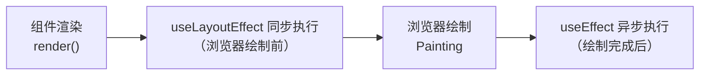

+++
title = "第14章 useLayoutEffect与Suspense基础"
weight = 140
date = "2026-03-25T12:56:00+08:00"
type = "docs"
description = ""
isCJKLanguage = true
draft = false
+++


# Chapter-14 - useLayoutEffect 与 Suspense 基础

## 14.1 useLayoutEffect

### 14.1.1 useLayoutEffect 与 useEffect 的时机差异

`useLayoutEffect` 和 `useEffect` 的签名完全一样，但**执行时机完全不同**：

```jsx
useEffect(() => {
  // 在渲染内容显示到屏幕之后异步执行
  console.log('useEffect: 渲染后异步执行')
}, [])

useLayoutEffect(() => {
  // 在渲染后但浏览器绘制之前同步执行
  console.log('useLayoutEffect: 渲染后同步执行')
}, [])
```

**执行顺序：**



### 14.1.2 useLayoutEffect 的阻塞性

`useLayoutEffect` 是**同步阻塞**的——它执行完之前，浏览器不会进行绘制。这既是它的优势（能读到准确的 DOM 尺寸），也是它的劣势（可能造成白屏/卡顿）。

### 14.1.3 适用场景：读取 DOM 布局并同步更新

**useLayoutEffect 的典型应用场景是：读取 DOM 元素的尺寸或位置，然后根据这些值立即更新另一个东西**。

先看一个更实际的例子——**弹窗（Modal）自动居中**：

```jsx
function Modal({ children }) {
  const modalRef = useRef(null)

  useLayoutEffect(() => {
    // 读取视口尺寸
    const viewportWidth = window.innerWidth
    const viewportHeight = window.innerHeight

    // 读取弹窗尺寸
    const modalWidth = modalRef.current.offsetWidth
    const modalHeight = modalRef.current.offsetHeight

    // 计算居中位置（同步执行，浏览器绘制前就完成了定位）
    const left = (viewportWidth - modalWidth) / 2
    const top = (viewportHeight - modalHeight) / 2

    modalRef.current.style.left = `${left}px`
    modalRef.current.style.top = `${top}px`
  }, [])

  return (
    <div ref={modalRef} className="modal" style={{ position: 'fixed' }}>
      {children}
    </div>
  )
}
```

如果用 `useEffect` 代替 `useLayoutEffect`，用户会先看到弹窗在左上角，然后突然跳到中间（闪烁）。用 `useLayoutEffect` 就能避免这个闪烁。

---

**Tooltip 定位**（稍微复杂一点的例子）：

```jsx
import { useLayoutEffect, useState, useRef } from 'react'

function Tooltip() {
  const [position, setPosition] = useState({ x: 0, y: 0 })
  const triggerRef = useRef(null)   // 引用触发按钮（hover/click 的元素）
  const tooltipRef = useRef(null)    // 引用 tooltip 本身（需要获取自身尺寸）

  useLayoutEffect(() => {
    // 读取 trigger 的位置（相对于视口）
    const triggerRect = triggerRef.current.getBoundingClientRect()
    // 读取 tooltip 的尺寸（自身宽高，用于精确定位）
    const tooltipRect = tooltipRef.current.getBoundingClientRect()

    // 计算 tooltip 位置：显示在 trigger 右侧，竖直居中对齐
    const x = triggerRect.right + 10  // trigger 右边缘右侧 10px
    const y = triggerRect.top + (triggerRect.height - tooltipRect.height) / 2

    // 立即更新位置（useLayoutEffect 同步执行，在浏览器绘制前就完成定位）
    setPosition({ x, y })
  }, [])  // 空依赖数组：只在组件挂载时执行一次（tooltip 位置固定）

  return (
    <div>
      {/* 触发 tooltip 的按钮 */}
      <button ref={triggerRef}>显示提示</button>
      {/* tooltip 自身（通过 ref 绑定，获取其尺寸） */}
      <div
        ref={tooltipRef}  // ← 关键：ref 要绑定到 tooltip 元素上！
        style={{
          position: 'fixed',
          left: position.x,
          top: position.y,
          backgroundColor: '#333',
          color: '#fff',
          padding: '6px 10px',
          borderRadius: '4px',
          fontSize: '13px'
        }}
      >
        提示内容
      </div>
    </div>
  )
}
```

### 14.1.4 优先使用 useEffect 的建议

**99% 的场景下，useEffect 都够用了。** 只有在以下情况才考虑 useLayoutEffect：

1. 需要读取 DOM 元素的**几何属性**（getBoundingClientRect、offsetWidth、offsetHeight 等）
2. 根据 DOM 尺寸**立即更新**另一个东西（避免闪烁）
3. 更新**会立即被用户看到**的视觉变化

```jsx
// ❌ 过度使用 useLayoutEffect：useEffect 就够了
useLayoutEffect(() => {
  document.title = title
}, [title])

// ✅ 需要读取 DOM 尺寸的场景：useLayoutEffect
useLayoutEffect(() => {
  const rect = element.getBoundingClientRect()
  setWidth(rect.width)
}, [element])
```

### 14.1.5 SSR 场景下的处理

SSR（服务端渲染）时，`useLayoutEffect` 在服务端会报错，因为服务端没有 DOM。React 17 之后，`useLayoutEffect` 在 SSR 场景下会给出警告但不报错，但更好的做法是用条件渲染或 `useEffect` 替代。

```jsx
// 方案一：只在客户端渲染时才执行
useEffect(() => {
  const rect = element.getBoundingClientRect()
  setWidth(rect.width)
}, [element])  // 用 useEffect 替代 useLayoutEffect

// 方案二：用占位值先渲染，客户端挂载后再调整
const [width, setWidth] = useState(100)  // 占位值

useLayoutEffect(() => {
  const rect = element.getBoundingClientRect()
  setWidth(rect.width)
}, [element])
```

---

## 14.2 Suspense 与 React.lazy 基础

### 14.2.1 React.lazy 的用法

`React.lazy` 允许你**动态导入**（代码分割）组件，只有当组件真正需要渲染时才会加载。

```jsx
import { lazy, Suspense } from 'react'

// ❌ 同步导入：所有代码一开始就加载
import Dashboard from './pages/Dashboard'
import Settings from './pages/Settings'

// ✅ 动态导入：代码分割，Dashboard 只在渲染时才加载
const Dashboard = lazy(() => import('./pages/Dashboard'))
const Settings = lazy(() => import('./pages/Settings'))
```

### 14.2.2 Suspense 的用法

`Suspense` 用来包裹使用了 `React.lazy` 的组件，它会在组件加载时显示一个**后备方案（fallback）**。

```jsx
import { lazy, Suspense } from 'react'

const Dashboard = lazy(() => import('./pages/Dashboard'))
const Settings = lazy(() => import('./pages/Settings'))

function App() {
  return (
    <div>
      <h1>我的应用</h1>
      {/* Dashboard 加载时，显示 Loading... */}
      <Suspense fallback={<div>Loading...</div>}>
        <Dashboard />
      </Suspense>

      {/* Settings 加载时，显示加载动画 */}
      <Suspense fallback={<LoadingSpinner />}>
        <Settings />
      </Suspense>
    </div>
  )
}
```

### 14.2.3 路由级代码分割

代码分割最常见的应用场景是**路由**——不同页面用不同的代码块，用户访问时才加载。

```jsx
import { lazy, Suspense } from 'react'
import { BrowserRouter, Routes, Route } from 'react-router-dom'

// 路由懒加载
const Home = lazy(() => import('./pages/Home'))
const About = lazy(() => import('./pages/About'))
const ProductList = lazy(() => import('./pages/ProductList'))
const ProductDetail = lazy(() => import('./pages/ProductDetail'))
const NotFound = lazy(() => import('./pages/NotFound'))

function App() {
  return (
    <BrowserRouter>
      <Suspense fallback={<PageLoader />}>
        <Routes>
          <Route path="/" element={<Home />} />
          <Route path="/about" element={<About />} />
          <Route path="/products" element={<ProductList />} />
          <Route path="/products/:id" element={<ProductDetail />} />
          <Route path="*" element={<NotFound />} />
        </Routes>
      </Suspense>
    </BrowserRouter>
  )
}
```

### 14.2.4 组件级代码分割

除了路由，还可以在组件级别进行代码分割：

```jsx
import { lazy, Suspense, useState } from 'react'

const RichTextEditor = lazy(() => import('./components/RichTextEditor'))
const Chart = lazy(() => import('./components/Chart'))

function ReportPage() {
  const [showEditor, setShowEditor] = useState(false)
  const [showChart, setShowChart] = useState(false)

  return (
    <div>
      <h1>报表页面</h1>

      <button onClick={() => setShowEditor(v => !v)}>
        {showEditor ? '隐藏' : '显示'}编辑器
      </button>
      <button onClick={() => setShowChart(v => !v)}>
        {showChart ? '隐藏' : '显示'}图表
      </button>

      <Suspense fallback={<Skeleton />}>
        {showEditor && <RichTextEditor />}
      </Suspense>

      <Suspense fallback={<Skeleton />}>
        {showChart && <Chart />}
      </Suspense>
    </div>
  )
}
```

---

## 本章小结

本章我们学习了两个重要的 React 概念：

- **useLayoutEffect**：与 useEffect 签名相同，但同步执行（在 DOM 更新后、浏览器绘制前）；适合读取 DOM 布局属性并立即同步更新的场景；99% 的场景用 useEffect 就够了
- **React.lazy**：动态导入组件，实现代码分割；组件代码在渲染时才加载，减少首屏加载时间
- **Suspense**：配合 React.lazy 使用，在组件加载时显示 fallback（后备方案）；可以包裹多个 lazy 组件

代码分割是现代前端性能优化的重要手段，能显著减少首屏加载时间。合理使用 `React.lazy` + `Suspense`，让你的应用"按需加载"，体验更流畅！下一章我们将学习 **组件设计模式**——高阶组件、Render Props、状态提升……等等！🎨