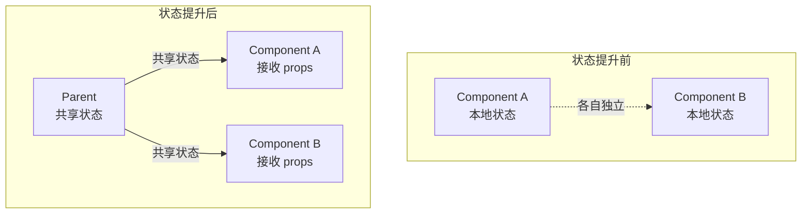

+++
title = "第15章 组件设计模式"
weight = 150
date = "2026-03-25T12:56:00+08:00"
type = "docs"
description = ""
isCJKLanguage = true
draft = false
+++


# Chapter-15 - 组件设计模式

## 15.1 高阶组件（HOC）

### 15.1.1 HOC 的概念：接收组件，返回新组件

**高阶组件（Higher-Order Component）** 是一个函数，接收一个组件作为参数，返回一个**增强后的新组件**。

```jsx
// HOC 的模式
function withExtraProp(WrappedComponent) {
  // 返回一个新组件
  return function EnhancedComponent(props) {
    // 在这里可以添加额外的 props 或逻辑
    return <WrappedComponent {...props} extraProp="额外的属性" />
  }
}

// 使用
const EnhancedButton = withExtraProp(Button)
<EnhancedButton label="点我" />  // 自动拥有 extraProp
```

### 15.1.2 HOC 的实现模式：代理 props、继承容器

**HOC 有两种实现方式：**

**方式一：props 代理（Props Proxy）**——HOC 控制传递给 WrappedComponent 的 props

```jsx
function withUserId(WrappedComponent) {
  return function EnhancedComponent(props) {
    // 可以添加、修改、删除 props
    return (
      <div className="with-user-id">
        <WrappedComponent {...props} userId="12345" />
      </div>
    )
  }
}
```

**方式二：继承反转（Inheritance Inversion）**——通过继承来扩展 WrappedComponent（较少用）

```jsx
function withLoading(WrappedComponent) {
  return class WithLoading extends WrappedComponent {
    render() {
      if (this.props.isLoading) {
        return <div>加载中...</div>
      }
      return super.render()
    }
  }
}
```

### 15.1.3 实战：withLoading HOC 实现加载状态包裹

```jsx
function withLoading(WrappedComponent) {
  return function WithLoadingComponent({ isLoading, error, ...props }) {
    if (isLoading) {
      return (
        <div className="loading-container">
          <div className="spinner" />
          <p>加载中...</p>
        </div>
      )
    }

    if (error) {
      return (
        <div className="error-container">
          <p>❌ 加载失败：{error}</p>
        </div>
      )
    }

    return <WrappedComponent {...props} />
  }
}

// 使用
const UserListWithLoading = withLoading(UserList)
const ProductDetailWithLoading = withLoading(ProductDetail)

function App() {
  const [isLoading, setIsLoading] = useState(true)
  const [error, setError] = useState(null)
  const [users, setUsers] = useState([])

  return (
    <div>
      <UserListWithLoading
        isLoading={isLoading}
        error={error}
        users={users}
      />
    </div>
  )
}
```

### 15.1.4 HOC 的命名规范

```jsx
// 命名规范：with + 特性名
withAuth          // 认证
withLoading       // 加载状态
withTheme         // 主题
withUser          // 用户信息
withLogger        // 日志记录
```

### 15.1.5 HOC 的缺点：嵌套地狱、prop 覆盖

HOC 的主要问题是**嵌套地狱**和**prop 命名冲突**：

```jsx
// 嵌套地狱：多层 HOC 嵌套，代码难以阅读
const EnhancedComponent = withAuth(withLogger(withTheme(Component)))

// prop 覆盖：多个 HOC 都传了相同的 prop，后面的会覆盖前面的
<EnhancedComponent
  style={{ color: 'red' }}        // withTheme 传
  user={{ name: '小明' }}         // withUser 传
  onClick={() => {}}              // withLogger 传
  className="enhanced"            // withAuth 传
/>
```

---

## 15.2 渲染属性（Render Props）

### 15.2.1 Render Props 的概念：组件接收一个渲染函数作为 props

**Render Props** 是一种让组件之间共享代码的技术——组件接收一个函数作为 props，这个函数返回 JSX，决定如何渲染内容。

```jsx
// 渲染属性组件：它决定"结构"，但把"渲染什么"交给外部
function MouseTracker({ render }) {
  const [position, setPosition] = useState({ x: 0, y: 0 })

  useEffect(() => {
    function handleMouseMove(e) {
      setPosition({ x: e.clientX, y: e.clientY })
    }
    window.addEventListener('mousemove', handleMouseMove)
    return () => window.removeEventListener('mousemove', handleMouseMove)
  }, [])

  // 调用 render 函数，把状态传出去
  return render(position)
}
```

### 15.2.2 children as a function 写法

Render Props 有一种常见写法：把 `children` 设计成一个函数。

```jsx
function MouseTracker({ children }) {
  const [position, setPosition] = useState({ x: 0, y: 0 })

  useEffect(() => {
    function handleMouseMove(e) {
      setPosition({ x: e.clientX, y: e.clientY })
    }
    window.addEventListener('mousemove', handleMouseMove)
    return () => window.removeEventListener('mousemove', handleMouseMove)
  }, [])

  // children 是一个函数，调用它并传入位置数据
  return children(position)
}

// 使用：children 是一个函数
<MouseTracker>
  {(position) => (
    <div>
      鼠标位置：{position.x}, {position.y}
    </div>
  )}
</MouseTracker>
```

### 15.2.3 实战：Mouse 组件追踪鼠标位置

```jsx
function MouseTracker({ children }) {
  const [position, setPosition] = useState({ x: 0, y: 0 })

  function handleMouseMove(e) {
    setPosition({ x: e.clientX, y: e.clientY })
  }

  useEffect(() => {
    window.addEventListener('mousemove', handleMouseMove)
    return () => window.removeEventListener('mousemove', handleMouseMove)
  }, [])

  // 把渲染逻辑完全交给调用者
  return children(position)
}

// 不同的渲染方式：同一个 MouseTracker，渲染不同的内容
function App() {
  return (
    <div>
      <h1>移动鼠标试试</h1>

      <MouseTracker>
        {(pos) => <p>坐标：{pos.x}, {pos.y}</p>}
      </MouseTracker>

      <MouseTracker>
        {({ x, y }) => (
          <div
            style={{
              position: 'fixed',
              left: x,
              top: y,
              width: 10,
              height: 10,
              backgroundColor: 'red',
              borderRadius: '50%'
            }}
          />
        )}
      </MouseTracker>
    </div>
  )
}
```

### 15.2.4 Render Props vs HOC 对比

| 对比项 | Render Props | HOC |
|-------|------------|-----|
| **灵活性** | 更高，完全控制渲染 | 一般，需要通过 props 传递 |
| **嵌套** | 扁平，不需要嵌套 | 多层嵌套可导致"嵌套地狱" |
| **prop 冲突** | 无 | 可能发生 |
| **学习成本** | 稍高 | 稍低 |
| **适用场景** | 逻辑共享 + UI 多变 | 纯逻辑增强 |

---

## 15.3 组合 vs 继承

### 15.3.1 组合的三大模式：props、children、Slot

我们在第六章和第七章已经详细讨论过组合的三大模式：
1. **Props 配置化**：通过不同的 props 呈现不同的 UI
2. **Children 插槽**：通过 props.children 传入 JSX
3. **Slot（具名插槽）**：通过具名 props 传入 JSX

### 15.3.2 继承的局限性：React 官方不推荐

React 官方文档明确说：**组合优于继承**。原因：

- **继承只能单向**：子类只能继承父类，不能同时继承多个父类
- **耦合度高**：子类和父类绑定过紧，修改父类会影响所有子类
- **灵活性差**：继承结构一旦建立，很难改变

```jsx
// ❌ 继承的问题：想复用多个能力怎么办？
class A { handleA() {} }
class B { handleB() {} }
// JavaScript 不支持多继承！
class C extends A, B {}  // 报错！

// ✅ 组合的优势：可以自由组合
function useA() { /* ... */ }
function useB() { /* ... */ }
function Component() {
  const a = useA()
  const b = useB()
  // 可以同时拥有 A 和 B 的能力！
}
```

### 15.3.3 组合实战：卡片组件的多种变体

```jsx
function Card({ header, children, footer }) {
  return (
    <div className="card">
      {header && <div className="card-header">{header}</div>}
      <div className="card-body">{children}</div>
      {footer && <div className="card-footer">{footer}</div>}
    </div>
  )
}

// 变体1：文章卡片
<Card
  header={<h3>文章标题</h3>}
  footer={<span>阅读量：1024</span>}
>
  <p>文章摘要...</p>
</Card>

// 变体2：用户卡片
<Card
  header={}
>
  <h4>{user.name}</h4>
  <p>{user.bio}</p>
</Card>

// 变体3：产品卡片
<Card
  header={<Badge text="热卖" />}
>
  
  <h4>{product.name}</h4>
  <p>¥{product.price}</p>
</Card>
```

---

## 15.4 状态提升

### 15.4.1 状态提升的概念：共享状态提升到最近的公共祖先

当两个兄弟组件需要共享同一个状态时，把这个状态**提升**到它们最近的公共父组件中。

```jsx
// 场景：温度转换器，华氏度和摄氏度同步更新
//  Celsius 和 Fahrenheit 是兄弟，需要共享温度数据

function TemperatureCalculator() {
  // 状态提升到父组件
  const [temperature, setTemperature] = useState(0)

  return (
    <div>
      {/* 通过 props 把状态和更新函数传给子组件 */}
      <Celsius
        temperature={temperature}
        onTemperatureChange={setTemperature}
      />
      <Fahrenheit
        temperature={temperature}
        onTemperatureChange={setTemperature}
      />
    </div>
  )
}

function Celsius({ temperature, onTemperatureChange }) {
  return (
    <div>
      <label>摄氏度：</label>
      <input
        value={temperature}
        onChange={e => onTemperatureChange(Number(e.target.value))}
      />
    </div>
  )
}

function Fahrenheit({ temperature, onTemperatureChange }) {
  // 华氏度 = 摄氏度 * 9/5 + 32
  const fahrenheit = temperature * 9 / 5 + 32

  return (
    <div>
      <label>华氏度：</label>
      <input
        value={fahrenheit}
        onChange={e => onTemperatureChange((Number(e.target.value) - 32) * 5 / 9)}
      />
    </div>
  )
}
```

### 15.4.2 何时需要提升：多个组件需要反映相同的变化数据



### 15.4.3 状态提升的缺点：数据流复杂时的替代方案

当组件嵌套很深，且多个组件都需要共享状态时，状态提升会变得繁琐——需要层层传递 props。这就是 Context、Zustand、Redux 等全局状态管理工具存在的意义。

---

## 15.5 列表与 Keys

### 15.5.1 Key 的作用：帮助 React 识别每个元素

Keys 帮助 React 识别哪些元素改变了、新增了或删除了。没有 key，React 会默认使用**索引**作为 key，但这在很多场景下会导致问题。

```jsx
// ❌ 没有 key
{items.map(item => <li>{item.name}</li>)}

// ✅ 有 key
{items.map(item => <li key={item.id}>{item.name}</li>)}
```

### 15.5.2 使用唯一 ID 而非 index 的场景

**不要用 index 作为 key 的场景：**

1. 列表会**增删**元素
2. 列表会**重排**（排序）
3. 列表项有**唯一标识**（如数据库 ID）

```jsx
// ❌ 用 index 作为 key，删除中间项时会出问题
const [items, setItems] = useState(['苹果', '香蕉', '橙子'])
// 渲染：[0:苹果, 1:香蕉, 2:橙子]

// 删除"香蕉"后
// 如果用 index 作为 key：React 以为 index 1 的元素（橙子）变了
// 正确做法是用 id
```

**可以用 index 作为 key 的场景：**

1. 列表是**完全静态**的（不会增删重排）
2. 列表非常简短且稳定
3. 列表不会作为列表项的稳定身份标识

### 15.5.3 key 相同时会发生的错误行为

```jsx
// ❌ 重复的 key 会导致 React 行为异常
{items.map(item => (
  <li key={item.name}>{item.name}</li>
  // 如果两个 item.name 相同，key 就重复了！
))}

// ✅ 确保 key 唯一
{items.map((item, index) => (
  <li key={`${item.id}-${index}`}>有时这样做可以兜底</li>
))}
```

---

## 15.6 错误边界

### 15.6.1 错误边界是什么：捕获子组件的 JS 错误

**错误边界（Error Boundary）** 是 React 16 引入的特性，用来**捕获子组件树中的 JavaScript 错误**，显示备用 UI，避免整个应用崩溃。

### 15.6.2 getDerivedStateFromError / componentDidCatch 的用法

错误边界只能用 **Class 组件**实现，需要定义以下两个方法之一（或两个都定义）：

```jsx
import React from 'react'

class ErrorBoundary extends React.Component {
  constructor(props) {
    super(props)
    this.state = { hasError: false, error: null }
  }

  // 静态方法：在子组件出错时调用，返回新的 state
  static getDerivedStateFromError(error) {
    return { hasError: true, error }
  }

  // 生命周期方法：在子组件出错后调用，用于记录错误日志
  componentDidCatch(error, errorInfo) {
    console.error('React 错误:', error, errorInfo)
    // 可以在这里发送错误报告到服务器
    logErrorToMyService(error, errorInfo)
  }

  render() {
    if (this.state.hasError) {
      // 出错时显示备用 UI
      return (
        <div>
          <h1>出错了！</h1>
          <p>{this.state.error?.message}</p>
          <button onClick={() => this.setState({ hasError: false })}>
            重试
          </button>
        </div>
      )
    }

    // 正常渲染子组件
    return this.props.children
  }
}

// 使用
function App() {
  return (
    <ErrorBoundary>
      <MyComponent />
    </ErrorBoundary>
  )
}
```

### 15.6.3 错误边界的局限性：只能捕获渲染阶段错误

错误边界**不能**捕获以下错误：
- 事件处理器中的错误（用 try-catch）
- 异步代码中的错误（如 setTimeout、Promise）
- 服务端渲染（SSR）中的错误
- 错误边界自身的错误

```jsx
// ❌ 错误边界捕获不了事件处理器的错误
function BadComponent() {
  function handleClick() {
    throw new Error('事件中的错误！')  // 错误边界捕获不到！
  }
  return <button onClick={handleClick}>点我</button>
}

// ✅ 需要用 try-catch 处理
function GoodComponent() {
  function handleClick() {
    try {
      throw new Error('事件中的错误！')
    } catch (err) {
      console.error(err)
    }
  }
  return <button onClick={handleClick}>点我</button>
}
```

### 15.6.4 未捕获错误的处理：error element（React 18+）

React 18 引入了 `errorElement`（用于路由）和全局未捕获错误处理：

```jsx
// React Router v6+ 的 errorElement
function App() {
  return (
    <Routes>
      <Route
        path="/"
        element={<HomePage />}
        errorElement={<ErrorPage />}
      />
    </Routes>
  )
}
```

---

## 本章小结

本章我们系统学习了 React 的各种组件设计模式：

- **HOC（高阶组件）**：接收组件返回增强组件，适合纯逻辑增强，但有嵌套地狱和 prop 覆盖问题
- **Render Props**：通过 props 传入渲染函数，灵活度高，但学习成本稍高
- **组合优于继承**：React 官方推荐的模式，props 配置化、children 插槽、具名 slot 是三大组合手段
- **状态提升**：共享状态提升到最近的公共祖先，适合简单场景；复杂场景用 Context 或状态管理库
- **列表 Keys**：用唯一 ID 作为 key，避免用 index（列表会增删重排时）
- **错误边界**：捕获子组件渲染阶段的 JavaScript 错误，用 Class 组件实现，是 React 的"保险丝"

这些设计模式是 React 开发者的"工具箱"，在不同场景下选择合适的工具，才能写出优雅、可维护的代码！下一章我们将学习 **React 样式全解**——从内联样式到 CSS Modules，从 styled-components 到 Tailwind CSS！🎨