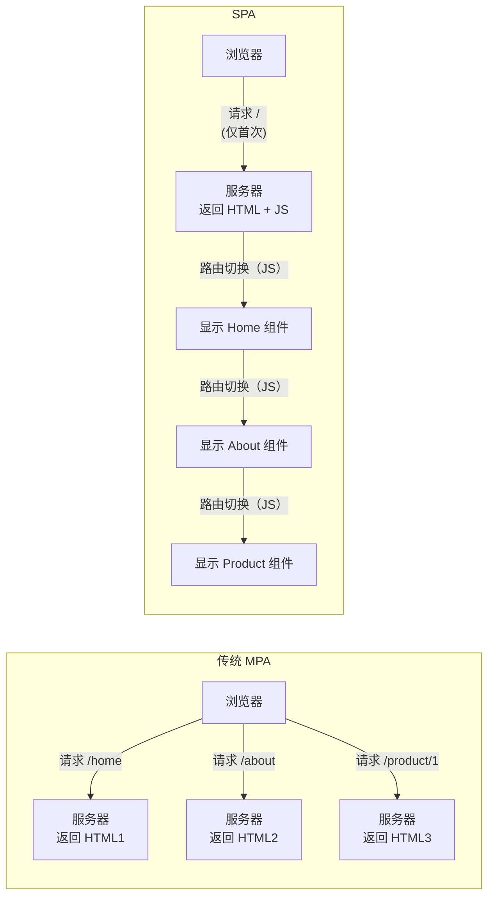

+++
title = "第17章 React Router v7路由管理"
weight = 170
date = "2026-03-25T12:56:00+08:00"
type = "docs"
description = ""
isCJKLanguage = true
draft = false
+++


# Chapter-17 - React Router v7——路由管理

## 17.1 SPA 与路由基础

### 17.1.1 传统多页应用 vs SPA

**传统多页应用（MPA）**：每次路由跳转，浏览器都会向服务器请求一个新的 HTML 页面。整个页面刷新，体验不流畅。

**单页应用（SPA）**：只有一个 HTML 页面，路由跳转只是切换"视图"（组件），不需要刷新页面。体验流畅，就像桌面应用一样。



### 17.1.2 前端路由的两种模式：hash 模式 vs history 模式

前端路由有两种实现方式：

**Hash 模式**：使用 URL 的 hash（#）部分来管理路由。`example.com/#/about`

| 对比项 | Hash 模式 | History 模式 |
|--------|----------|-------------|
| URL 外观 | `example.com/#/about` | `example.com/about` |
| 需要服务器配置 | 不需要（# 后面的内容不发送到服务器） | 需要（所有路径都指向 index.html） |
| 兼容性 | 更好 | 需要 IE10+ |
| 适用场景 | 静态网站、不想配置服务器 | 正常 Web 应用 |

### 17.1.3 history 模式的原理：pushState / replaceState

History API 是浏览器提供的原生 API，用来操作浏览器的会话历史：

```javascript
// pushState：向历史记录栈中添加一条记录（不刷新页面）
history.pushState({ page: 'home' }, '首页', '/home')

// replaceState：替换当前记录（不刷新页面）
history.replaceState({ page: 'about' }, '关于', '/about')

// 监听浏览器的前进/后退按钮（popstate 事件）
window.addEventListener('popstate', (event) => {
  console.log('当前路径:', event.state)
  // 根据 event.state 渲染对应组件
})
```

---

## 17.2 React Router v7 基础

### 17.2.1 安装与引入

```bash
npm install react-router-dom
```

```jsx
// App.jsx
import {
  BrowserRouter,    // History 模式路由
  HashRouter,       // Hash 模式路由
  Routes,
  Route,
  Link,
  NavLink
} from 'react-router-dom'
```

### 17.2.2 BrowserRouter 的使用

```jsx
// App.jsx - 用 BrowserRouter 包裹整个应用
import { BrowserRouter } from 'react-router-dom'

function App() {
  return (
    <BrowserRouter>
      {/* 路由配置 */}
    </BrowserRouter>
  )
}
```

### 17.2.3 Routes 与 Route 的基本写法

```jsx
import { BrowserRouter, Routes, Route } from 'react-router-dom'
import Home from './pages/Home'
import About from './pages/About'
import ProductList from './pages/ProductList'
import ProductDetail from './pages/ProductDetail'
import NotFound from './pages/NotFound'

function App() {
  return (
    <BrowserRouter>
      {/* Routes 是所有 Route 的容器 */}
      <Routes>
        {/* 每个 Route 定义一个路由规则 */}
        <Route path="/" element={<Home />} />
        <Route path="/about" element={<About />} />
        <Route path="/products" element={<ProductList />} />
        <Route path="/products/:id" element={<ProductDetail />} />
        {/* * 通配符，匹配所有未匹配的路径 */}
        <Route path="*" element={<NotFound />} />
      </Routes>
    </BrowserRouter>
  )
}
```

### 17.2.4 index route：默认路由

```jsx
// 当路径是 "/" 时，显示 Home
// 当路径是 "/" 时，且没有其他匹配，显示 MainLayout 里的默认内容
<Route path="/" element={<MainLayout />}>
  <Route index element={<Home />} />
  <Route path="about" element={<About />} />
</Route>
```

### 17.2.5 Link 与 NavLink：声明式导航

**Link**：用于导航，不会触发页面刷新

```jsx
import { Link } from 'react-router-dom'

function Navigation() {
  return (
    <nav>
      {/* Link 生成 <a> 标签，但不会刷新页面 */}
      <Link to="/">首页</Link>
      <Link to="/about">关于</Link>
      <Link to="/products">产品列表</Link>

      {/* 带查询参数 */}
      <Link to="/products?category=electronics&sort=price">电子产品</Link>

      {/* 带 state */}
      <Link to="/products/1" state={{ fromPage: 'list' }}>产品详情</Link>
    </nav>
  )
}
```

**NavLink**：会自动根据当前 URL 添加 `active` 类名

```jsx
import { NavLink } from 'react-router-dom'

function Navigation() {
  // NavLink 会自动给当前匹配的链接添加 active 类名
  return (
    <nav>
      <NavLink
        to="/"
        className={({ isActive }) => isActive ? 'nav-link active' : 'nav-link'}
      >
        首页
      </NavLink>

      <NavLink
        to="/about"
        className={({ isActive }) => isActive ? 'nav-link active' : 'nav-link'}
      >
        关于
      </NavLink>
    </nav>
  )
}
```

---

## 17.3 动态路由参数

### 17.3.1 路由参数的定义：`:id`

你有没有想过：淘宝有几亿种商品，但它的详情页只有一套代码 —— `/products/123`、`/products/456` 都用同一个组件。这就是**动态路由**的威力！

在 Route 的 path 中用冒号 `:` 定义路由参数：

```jsx
<Route path="/products/:id" element={<ProductDetail />} />
//                                ↑
//                                这里的 :id 是个"占位符"
//
// 当用户访问 /products/123 时，:id = "123"
// 当用户访问 /products/456 时，:id = "456"
//
// 一个组件，可以展示任意产品的详情！
```

### 17.3.2 useParams 获取参数

```jsx
import { useParams } from 'react-router-dom'

function ProductDetail() {
  // 获取 URL 中的 :id 参数
  const { id } = useParams()
  // 如果 URL 是 /products/123，则 id = "123"

  return (
    <div>
      <h1>产品详情</h1>
      <p>产品 ID：{id}</p>
    </div>
  )
}
```

### 17.3.3 多个参数的写法

```jsx
// 多个路由参数
<Route path="/users/:userId/posts/:postId" element={<Comment />} />

// useParams 会返回所有参数
function Comment() {
  const { userId, postId } = useParams()
  return <p>用户 {userId} 的帖子 {postId} 的评论</p>
}
```

### 17.3.4 search params 的获取：useSearchParams

```jsx
import { useSearchParams } from 'react-router-dom'

function SearchResults() {
  // useSearchParams 返回一个 URLSearchParams 对象
  const [searchParams, setSearchParams] = useSearchParams()

  // 获取查询参数
  const category = searchParams.get('category')  // "electronics"
  const sort = searchParams.get('sort')           // "price"
  const page = searchParams.get('page')          // "1"

  function handleCategoryChange(category) {
    setSearchParams({ category, sort, page: '1' })
  }

  return (
    <div>
      <p>分类：{category}</p>
      <p>排序：{sort}</p>
      <p>页码：{page}</p>

      <button onClick={() => handleCategoryChange('books')}>切换到图书</button>
    </div>
  )
}
```

### 17.3.5 useLocation：获取路由信息

```jsx
import { useLocation } from 'react-router-dom'

function DebugRoute() {
  const location = useLocation()

  console.log('当前路径:', location.pathname)    // "/products/123"
  console.log('查询参数:', location.search)      // "?color=blue"
  console.log('哈希值:', location.hash)          // "#section1"
  console.log('state:', location.state)          // { fromPage: 'list' }
  console.log('key:', location.key)             // "abc123"

  return <pre>{JSON.stringify(location, null, 2)}</pre>
}
```

---

## 17.4 嵌套路由

### 17.4.1 嵌套路由的配置方式

```jsx
function App() {
  return (
    <BrowserRouter>
      <Routes>
        <Route path="/" element={<MainLayout />}>
          {/* / 路径下默认显示的内容 */}
          <Route index element={<Home />} />

          {/* /about 渲染在 MainLayout 的 <Outlet /> 中 */}
          <Route path="about" element={<About />} />

          {/* /dashboard 渲染在 DashboardLayout 的 <Outlet /> 中 */}
          <Route path="dashboard" element={<DashboardLayout />}>
            <Route index element={<DashboardOverview />} />
            <Route path="settings" element={<DashboardSettings />} />
            <Route path="profile" element={<DashboardProfile />} />
          </Route>
        </Route>
      </Routes>
    </BrowserRouter>
  )
}
```

### 17.4.2 Outlet 组件的作用

Outlet 是 React Router v6 的核心组件——它表示"嵌套路由的内容应该渲染在哪里"。

```jsx
// MainLayout.jsx - 主布局组件
import { Outlet, Link } from 'react-router-dom'

function MainLayout() {
  return (
    <div className="app-layout">
      {/* 侧边栏 */}
      <nav className="sidebar">
        <Link to="/">首页</Link>
        <Link to="/about">关于</Link>
        <Link to="/dashboard">仪表盘</Link>
      </nav>

      {/* 主内容区域 - Outlet 是嵌套路由内容的"占位符" */}
      <main className="main-content">
        <Outlet />
        {/* 嵌套路由的组件会在这里渲染 */}
      </main>
    </div>
  )
}
```

### 17.4.3 layout route：共享布局的路由结构

**Layout Route** 是一种专门用来包裹公共布局的路由。它的子路由渲染在 `<Outlet />` 位置，而布局本身（头部、侧边栏、底部等）保持不变。适合"外层统一、内层切换"的场景，比如管理后台、博客布局等。

```jsx
// 使用 index route 实现"默认显示首页"
<Route path="/" element={<Layout />}>
  <Route index element={<Home />} />
  <Route path="about" element={<About />} />
</Route>

// Layout 组件
function Layout() {
  return (
    <div>
      <header>通用头部</header>
      <Outlet />  {/* 匹配时显示首页，不匹配时显示其他 */}
      <footer>通用底部</footer>
    </div>
  )
}
```

---

## 17.5 编程式导航

### 17.5.1 useNavigate 的基本用法

```jsx
import { useNavigate } from 'react-router-dom'

function LoginForm() {
  const navigate = useNavigate()

  async function handleLogin(e) {
    e.preventDefault()
    const success = await login()

    if (success) {
      // 登录成功后，跳转到首页
      navigate('/')
    }
  }

  return (
    <form onSubmit={handleLogin}>
      {/* 表单内容 */}
      <button type="submit">登录</button>
    </form>
  )
}
```

### 17.5.2 导航的两种方式：字符串路径 vs options 对象

```jsx
const navigate = useNavigate()

// 方式一：直接传字符串路径
navigate('/dashboard')
navigate('/products/123')
navigate('/search?category=electronics')

// 方式二：传 options 对象（React Router v6.1+）
navigate('/', { replace: true })              // replace: true 替换当前历史记录
navigate('/about', { state: { from: '/' } })  // 传递 state
navigate(-1)                                 // 返回上一页
```

### 17.5.3 go(-1) / go(1) 前进后退

```jsx
import { useNavigate } from 'react-router-dom'

function NavigationButtons() {
  const navigate = useNavigate()

  return (
    <div>
      <button onClick={() => navigate(-1)}>返回上一页</button>
      <button onClick={() => navigate(1)}>前进下一页</button>
      <button onClick={() => navigate(-2)}>后退两步</button>
    </div>
  )
}
```

### 17.5.4 路由跳转与状态传递

```jsx
// 跳转时传递 state
function ProductList() {
  const navigate = useNavigate()

  function handleProductClick(product) {
    navigate(`/products/${product.id}`, {
      state: { product }  // 传递产品数据
    })
  }

  return (
    <ul>
      {products.map(product => (
        <li key={product.id} onClick={() => handleProductClick(product)}>
          {product.name}
        </li>
      ))}
    </ul>
  )
}

// 接收 state
function ProductDetail() {
  const { state } = useLocation()

  // state 可以是 undefined（用户直接访问 URL 时）
  return (
    <div>
      <h1>{state?.product?.name || '产品详情'}</h1>
    </div>
  )
}
```

---

## 17.6 路由守卫与错误边界

### 17.6.1 路由守卫的概念：未登录用户禁止访问

路由守卫（Route Guard）是拦截未授权访问的机制——如果用户没登录，就重定向到登录页。

```jsx
import { Navigate } from 'react-router-dom'

// 受保护的路由组件
function ProtectedRoute({ children, isAuthenticated }) {
  if (!isAuthenticated) {
    // 重定向到登录页
    return <Navigate to="/login" replace />
  }

  return children
}

// 使用
<ProtectedRoute isAuthenticated={isLoggedIn}>
  <Dashboard />
</ProtectedRoute>
```

### 17.6.2 利用 Outlet 实现嵌套守卫

```jsx
function App() {
  return (
    <Routes>
      {/* 公开路由 */}
      <Route path="/login" element={<Login />} />
      <Route path="/" element={<PublicLayout />}>
        <Route index element={<Home />} />
        <Route path="about" element={<About />} />
      </Route>

      {/* 受保护的路由 */}
      <Route
        path="/dashboard"
        element={
          <ProtectedRoute isAuthenticated={user !== null}>
            <DashboardLayout />
          </ProtectedRoute>
        }
      >
        <Route index element={<DashboardHome />} />
        <Route path="settings" element={<Settings />} />
      </Route>
    </Routes>
  )
}
```

### 17.6.3 重定向：Navigate 组件与 useNavigate

```jsx
import { Navigate } from 'react-router-dom'

// 方式一：Navigate 组件
function RequireAuth({ children, isAuthenticated }) {
  if (!isAuthenticated) {
    return <Navigate to="/login" replace />
  }
  return children
}

// 方式二：useNavigate
function Logout() {
  const navigate = useNavigate()

  useEffect(() => {
    logout()
    navigate('/login', { replace: true })
  }, [navigate])

  return <p>正在退出...</p>
}
```

### 17.6.4 ErrorBoundary：路由级的错误处理

React Router v6 支持为每个路由定义错误处理元素：

```jsx
import { ErrorBoundary } from 'react' // ErrorBoundary 来自 React，不是 react-router-dom

function App() {
  return (
    <Routes>
      <Route path="/" element={<Home />} errorElement={<ErrorPage />} />
      <Route path="/about" element={<About />} />
    </Routes>
  )
}

function ErrorPage({ error }) {
  return (
    <div>
      <h1>出错了！</h1>
      <p>{error?.message}</p>
    </div>
  )
}
```

---

## 17.7 React Router v7 Data Router 与 Loader

### 17.7.1 createBrowserRouter：v7 新一代数据路由

在传统的组件式路由中（17.2节的写法），组件需要自己用 `useEffect` 去加载数据。这有什么问题呢？

想象一下这个场景：用户在"产品列表"页点击了一个产品，路由跳转到"产品详情"页。但如果网络慢，用户会看到白屏——因为组件虽然渲染了，但数据还在加载中。传统做法需要我们在组件里写 `useEffect` + `loading` 状态 + `error` 处理，代码又长又重复。

**Data Router 就是来解决这个问题的**——它让路由"知道"自己需要什么数据，在渲染组件之前就把数据准备好！

React Router v7 引入了"Data Router"概念——路由可以直接加载数据！

```jsx
import { createBrowserRouter, RouterProvider } from 'react-router-dom'

const router = createBrowserRouter([
  {
    path: '/',
    element: <Root />,
    errorElement: <ErrorPage />,
    children: [
      {
        index: true,
        element: <Home />,
      },
      {
        path: 'about',
        element: <About />,
      },
    ],
  },
])

function App() {
  return <RouterProvider router={router} />
}
```

### 17.7.2 组件式路由 vs 数据路由：何时用哪种

| 对比项 | 组件式路由（Routes/Route） | 数据路由（createBrowserRouter） |
|-------|--------------------------|------------------------------|
| **配置方式** | JSX 声明式 | 程序式 |
| **数据加载** | 需要自己在 useEffect 里加载 | 用 loader 自动加载 |
| **错误处理** | ErrorBoundary | errorElement |
| **适用场景** | 简单应用、快速原型 | 中大型应用、需要服务端数据 |

### 17.7.3 loader：服务端数据预加载

loader 是 React Router v7 的重磅特性——它让你在路由切换前预加载数据：

```jsx
import { createBrowserRouter, useLoaderData } from 'react-router-dom'

// 定义 loader 函数
async function productLoader({ params }) {
  const response = await fetch(`/api/products/${params.id}`)
  if (!response.ok) {
    throw new Error('产品不存在')
  }
  return response.json()
}

const router = createBrowserRouter([
  {
    path: '/products/:id',
    element: <ProductDetail />,
    loader: productLoader,
    errorElement: <ProductError />,
  },
])

function ProductDetail() {
  // 直接从 loader 获取数据，不需要 useEffect
  const product = useLoaderData()

  return (
    <div>
      <h1>{product.name}</h1>
      <p>价格：¥{product.price}</p>
    </div>
  )
}
```

### 17.7.4 useLoaderData：在组件中获取 loader 数据

```jsx
import { useLoaderData } from 'react-router-dom'

function UserProfile() {
  // 获取 loader 返回的数据
  const { user, posts } = useLoaderData()

  return (
    <div>
      <h1>{user.name}</h1>
      <p>{user.bio}</p>
      <ul>
        {posts.map(post => (
          <li key={post.id}>{post.title}</li>
        ))}
      </ul>
    </div>
  )
}
```

### 17.7.5 Action 与 Form：表单提交到服务端

Action 是处理表单提交的服务端逻辑：

```jsx
import { Form } from 'react-router-dom'

// 定义 action
async function createProductAction({ request }) {
  const formData = await request.formData()
  const name = formData.get('name')
  const price = formData.get('price')

  const response = await fetch('/api/products', {
    method: 'POST',
    body: JSON.stringify({ name, price })
  })

  if (response.ok) {
    return { success: true }
  }
  return { success: false }
}

const router = createBrowserRouter([
  {
    path: '/products/new',
    element: <ProductForm />,
    action: createProductAction,
  },
])

function ProductForm() {
  return (
    <Form method="post">
      <input name="name" placeholder="产品名称" />
      <input name="price" type="number" placeholder="价格" />
      <button type="submit">创建</button>
    </Form>
  )
}
```

### 17.7.6 useActionData：获取 action 返回值

```jsx
import { useActionData, Form } from 'react-router-dom'

function ProductForm() {
  const actionData = useActionData()

  return (
    <Form method="post">
      {actionData?.success === false && (
        <p className="error">创建失败，请重试</p>
      )}
      {actionData?.success === true && (
        <p className="success">创建成功！</p>
      )}
      <input name="name" placeholder="产品名称" />
      <button type="submit">创建</button>
    </Form>
  )
}
```

### 17.7.7 路由懒加载：lazy 函数

React Router v7 支持路由懒加载：

```jsx
import { lazy, Suspense } from 'react'

// lazy()：将组件声明为"懒加载"——只有当用户访问对应路由时才会加载
// 参数是一个返回 import() 的函数（动态导入）
// import() 是 ES2020 的动态导入语法，返回 Promise，模块会被单独打包成一个 JS 文件
const Home = lazy(() => import('./pages/Home'))
const About = lazy(() => import('./pages/About'))
const Dashboard = lazy(() => import('./pages/Dashboard'))

const router = createBrowserRouter([
  {
    path: '/',
    element: <Root />,
    children: [
      // 注意：懒加载路由用 Component（组件本身），而不是 element（JSX）
      { index: true, Component: Home },
      { path: 'about', Component: About },
      { path: 'dashboard', Component: Dashboard },
    ],
  },
])

// 注意：懒加载必须用 Suspense 包裹，否则路由切换时会因为组件还没加载完而报错
// fallback：组件加载完成之前显示的内容（通常是骨架屏或 loading 文字）
function Root() {
  return (
    <Suspense fallback={<div>加载中...</div>}>
      <Outlet />
    </Suspense>
  )
}
```

---

## 17.8 React Router v7 新增特性

### 17.8.1 View Transitions API 集成：页面过渡动效

React Router v7 支持 View Transitions API，实现丝滑的页面过渡动画。启用方式很简单——给 `<Link>`、`<NavLink>`、`<Form>` 加上 `viewTransition` prop，或者在 `useNavigate` 中传入 `{ viewTransition: true }`：

```jsx
import { Link, NavLink, useNavigate } from 'react-router-dom'

function Navigation() {
  const navigate = useNavigate()

  return (
    <nav>
      {/* 给 Link 加 viewTransition prop 即可启用过渡 */}
      <Link to="/about" viewTransition>关于我们</Link>
      <Link to="/products" viewTransition>产品列表</Link>

      {/* 编程式导航也一样 */}
      <button onClick={() => navigate('/dashboard', { viewTransition: true })}>
        进入仪表盘
      </button>
    </nav>
  )
}
```

需要配合 CSS 才能看到具体动效效果，只加 prop 不加 CSS 时默认是交叉淡入淡出（cross-fade）。

```css
/* CSS 过渡效果 */
::view-transition-old(root),
::view-transition-new(root) {
  animation-duration: 300ms;
}
```

### 17.8.2 路由级别的 pending 状态：useNavigation

`useNavigation` Hook 返回当前路由的导航状态（`idle` / `loading` / `submitting`），可以用来显示全局 loading 指示器：

```jsx
import { useNavigation } from 'react-router-dom'

function AppLayout() {
  const navigation = useNavigation()
  const isNavigating = navigation.state === 'loading'

  return (
    <div>
      {/* 路由切换时显示 loading 状态 */}
      {isNavigating && <TopProgressBar />}

      <Outlet />
    </div>
  )
}
```

### 17.8.3 改进的 relative 路由支持

React Router v7 改进了相对路由的支持，提供了两种解析模式：

- **`relative="path"`**：相对于当前 URL 路径进行解析。比如在 `/users/123` 下，`to="settings"` 会解析为 `/users/settings`
- **`relative="route"`**：相对于当前路由（而非 URL 路径）进行解析，更符合嵌套路由的场景语义

```jsx
// 使用 relative="path" 或 relative="route"
<Link to="settings" relative="path">     {/* 相对路径：基于 URL 路径解析 */}
<Link to=".." relative="route">         {/* 相对路由：基于路由层级向上一级 */}
// 其中 ".." 表示上级路由路径，配合 relative="route" 使用
```

### 17.8.4 路由拆分与 prefetch 优化

React Router v7 支持将路由按需加载（代码分割），结合 `React.lazy` 和 `Suspense` 实现路由级懒加载，避免首屏加载过多代码。同时可以通过 `shouldRevalidate` 控制数据的重新验证策略，在导航时决定是否重新请求 loader 数据。

`shouldRevalidate` 的可选值：
- **`true`**：每次导航到该路由时，强制重新调用 loader 获取最新数据
- **`false`**：永远不重新验证（数据只加载一次，之后用缓存）
- **函数** `(args) => boolean`：自定义逻辑，接收 `{ url, params, request, action }` 等参数，返回 `true` 表示重新验证

默认行为（不写 `shouldRevalidate`）：React Router v7 会智能判断——如果 loader 数据是通过前一个路由的导航加载的（同一批次的加载结果），会复用缓存；如果用户直接访问详情页 URL（新的页面加载），则重新请求。

```jsx
<Route
  path="/products/:id"
  Component={lazy(() => import('./pages/ProductDetail'))}
  loader={productLoader}
  shouldRevalidate={true}  // 强制重新验证
/>
```

---

## 本章小结

本章我们对 React Router v7 进行了全面的学习：

- **SPA vs 传统 MPA**：SPA 只有一张 HTML，路由切换是组件切换，体验流畅
- **Hash vs History 模式**：Hash 模式不需要服务器配置，History 模式 URL 更美观
- **基础用法**：BrowserRouter 包裹、Routes/Route 定义、Link/NavLink 导航
- **动态路由**：`:id` 参数定义、useParams 读取、useSearchParams 处理查询参数
- **嵌套路由**：Outlet 占位符、layout route 实现布局复用
- **编程式导航**：useNavigate 实现 JS 跳转、navigate(-1) 前进后退
- **路由守卫**：ProtectedRoute 组件实现登录拦截和重定向
- **Data Router**：createBrowserRouter + loader 实现服务端数据预加载，是 v7 的重磅特性

React Router 是 React 应用的"交通枢纽"，掌握好路由管理是构建复杂应用的基础！下一章我们将学习 **表单处理与数据验证**——表单是前端最复杂的交互之一！📝