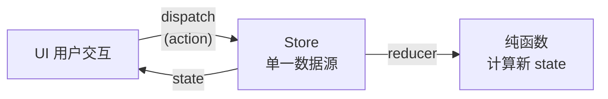

+++
title = "第20章 Redux Toolkit完整状态管理"
weight = 200
date = "2026-03-25T12:56:00+08:00"
type = "docs"
description = ""
isCJKLanguage = true
draft = false
+++


# Chapter-20 - Redux Toolkit——最完整的全局状态方案

## 20.1 Redux 核心概念

### 20.1.1 Redux 的三大原则：单一数据源、state 只读、纯函数

Redux 是 React 生态中最经典的状态管理库，基于三大原则：

1. **单一数据源（Single Source of Truth）**：整个应用的 state 存储在一个唯一的 store 中
2. **State 只读（State is Read-Only）**：不能直接修改 state，只能通过触发 action 来更新
3. **纯函数（Reducers are Pure Functions）**：reducer 是纯函数，相同的输入永远产生相同的输出



### 20.1.2 Store：存放所有状态的地方

**Store** 是 Redux 的核心，它存储整个应用的状态，并提供访问状态和更新状态的方法。

```javascript
import { createStore } from 'redux'

// reducer 函数
function counterReducer(state = { count: 0 }, action) {
  switch (action.type) {
    case 'INCREMENT':
      return { count: state.count + 1 }
    default:
      return state
  }
}

// 创建 store
const store = createStore(counterReducer)

// 获取状态
console.log(store.getState())  // { count: 0 }

// 订阅状态变化
store.subscribe(() => console.log('状态变化:', store.getState()))

// 派发 action
store.dispatch({ type: 'INCREMENT' })  // 打印：状态变化: { count: 1 }
store.dispatch({ type: 'INCREMENT' })  // 打印：状态变化: { count: 2 }
```

### 20.1.3 Action：描述"发生了什么"

**Action** 是一个普通的 JavaScript 对象，用来描述"发生了什么"。它必须有一个 `type` 字段。

```javascript
// action 对象
{ type: 'ADD_TODO', payload: { text: '学习 React' } }
{ type: 'TOGGLE_TODO', payload: { id: 1 } }
{ type: 'SET_LOADING', payload: true }
```

### 20.1.4 Reducer：根据 Action 计算新状态

**Reducer** 是一个函数，接收当前状态和 action，返回新状态。它是纯函数，不能有副作用。

```javascript
function todoReducer(state = [], action) {
  switch (action.type) {
    case 'ADD_TODO':
      return [
        ...state,
        {
          id: Date.now(),
          text: action.payload.text,
          completed: false
        }
      ]
    case 'TOGGLE_TODO':
      return state.map(todo =>
        todo.id === action.payload.id
          ? { ...todo, completed: !todo.completed }
          : todo
      )
    case 'DELETE_TODO':
      return state.filter(todo => todo.id !== action.payload.id)
    default:
      return state
  }
}
```

---

## 20.2 Redux Toolkit（RTK）

### 20.2.1 为什么需要 Redux Toolkit

传统 Redux 写起来非常繁琐：需要写很多 action type、action creator、switch 语句。**Redux Toolkit（RTK）** 就是来解决这个问题的——它简化了 Redux 的写法，同时保持了 Redux 的所有功能。

```bash
npm install @reduxjs/toolkit react-redux
```

### 20.2.2 configureStore：简化 store 创建

```javascript
import { configureStore } from '@reduxjs/toolkit'
import counterReducer from './counterSlice'
import userReducer from './userSlice'

const store = configureStore({
  reducer: {
    counter: counterReducer,
    user: userReducer
  }
})

export default store
```

### 20.2.3 createSlice：合并 reducer 和 action

`createSlice` 是 RTK 最核心的 API——它同时创建 reducer 和 action creator。

```javascript
import { createSlice } from '@reduxjs/toolkit'

const counterSlice = createSlice({
  name: 'counter',        // action type 的前缀
  initialState: { count: 0, step: 1 },
  reducers: {
    increment: (state) => {
      // RTK 允许直接修改 state（内部使用 Immer 实现）
      state.count += state.step
    },
    decrement: (state) => {
      state.count -= state.step
    },
    incrementByAmount: (state, action) => {
      state.count += action.payload
    },
    reset: (state) => {
      state.count = 0
    }
  }
})

// 自动生成 action creators
export const { increment, decrement, incrementByAmount, reset } = counterSlice.actions

// reducer
export default counterSlice.reducer
```

### 20.2.4 自动生成的 action creators

`createSlice` 会自动为每个 reducer 生成 action creator：

```javascript
const { increment, decrement, reset } = counterSlice.actions

// increment() 返回 { type: 'counter/increment' }
// decrement() 返回 { type: 'counter/decrement' }
// incrementByAmount(amount) 返回 { type: 'counter/incrementByAmount', payload: amount }
// reset() 返回 { type: 'counter/reset' }
```

### 20.2.5 多个 slice 的组合

实际应用中往往有多个 slice（counterSlice、userSlice、postsSlice），把它们全部放进 `configureStore` 的 `reducer` 对象中即可合并：

```javascript
// store/index.js
import { configureStore } from '@reduxjs/toolkit'
import counterReducer from './counterSlice'
import userReducer from './userReducer'
import postsReducer from './postsSlice'

const store = configureStore({
  reducer: {
    counter: counterReducer,
    user: userReducer,
    posts: postsReducer
  }
})

export default store
```

---

## 20.3 store 配置与 Provider

### 20.3.1 创建 store

完整地创建一个 Redux store，包括切片注册和中间件配置：

```javascript
// store/index.js
import { configureStore } from '@reduxjs/toolkit'
import counterReducer from './counterSlice'
import userReducer from './userSlice'

export const store = configureStore({
  reducer: {
    counter: counterReducer,
    user: userReducer
  },
  middleware: (getDefaultMiddleware) =>
    getDefaultMiddleware({
      serializableCheck: false  // 开发时关闭序列化检查
    })
})
```

### 20.3.2 Provider 包裹应用

```javascript
// main.jsx
import React from 'react'
import ReactDOM from 'react-dom/client'
import { Provider } from 'react-redux'
import { store } from './store'
import App from './App'
import { createRoot } from 'react-dom/client'

// React 18+ 的正确 API
const root = createRoot(document.getElementById('root'))
root.render(
  <React.StrictMode>
    <Provider store={store}>
      <App />
    </Provider>
  </React.StrictMode>
)
```

---

## 20.4 useSelector 与 useDispatch

### 20.4.1 useDispatch：分发 action

```javascript
import { useDispatch } from 'react-redux'
import { increment, decrement } from './counterSlice'

function Counter() {
  const dispatch = useDispatch()

  return (
    <div>
      <button onClick={() => dispatch(increment())}>+1</button>
      <button onClick={() => dispatch(decrement())}>-1</button>
    </div>
  )
}
```

### 20.4.2 useSelector：从 store 读取状态

```javascript
import { useSelector, shallowEqual } from 'react-redux'

function CounterDisplay() {
  // 方式一：直接选择
  const count = useSelector(state => state.counter.count)

  // 方式二：使用 shallowEqual 优化（防止不必要的重渲染）
  const { count, step } = useSelector(
    state => ({
      count: state.counter.count,
      step: state.counter.step
    }),
    shallowEqual
  )

  return <p>计数：{count}</p>
}
```

### 20.4.3 选择器性能优化：shallowEqual

```javascript
import { shallowEqual, useSelector } from 'react-redux'

// ❌ 问题：每次返回新对象，导致重渲染
const selector = state => ({
  count: state.counter.count,
  step: state.counter.step
})

// ✅ 优化：使用 shallowEqual
const { count, step } = useSelector(selector, shallowEqual)

// ✅ 更好的优化：分开选择
const count = useSelector(state => state.counter.count)
const step = useSelector(state => state.counter.step)
```

---

## 20.5 异步操作

### 20.5.1 createAsyncThunk 的用法

RTK 提供 `createAsyncThunk` 处理异步操作（网络请求）：

```javascript
import { createAsyncThunk } from '@reduxjs/toolkit'

// 创建异步 thunk
export const fetchUserById = createAsyncThunk(
  'users/fetchById',        // action type 前缀
  async (userId, { rejectWithValue }) => {
    try {
      const response = await fetch(`/api/users/${userId}`)
      if (!response.ok) {
        throw new Error('请求失败')
      }
      return await response.json()
    } catch (error) {
      return rejectWithValue(error.message)
    }
  }
)
```

### 20.5.2 extraReducers 处理异步结果

```javascript
const userSlice = createSlice({
  name: 'user',
  initialState: {
    data: null,
    loading: false,
    error: null
  },
  reducers: {},
  extraReducers: (builder) => {
    builder
      .addCase(fetchUserById.pending, (state) => {
        state.loading = true
        state.error = null
      })
      .addCase(fetchUserById.fulfilled, (state, action) => {
        state.loading = false
        state.data = action.payload
      })
      .addCase(fetchUserById.rejected, (state, action) => {
        state.loading = false
        state.error = action.payload || '未知错误'
      })
  }
})
```

### 20.5.3 异步状态的类型：pending/fulfilled/rejected

```javascript
import { useEffect } from 'react'
import { useDispatch, useSelector } from 'react-redux'
import { fetchUserById } from './userSlice'

function UserProfile({ userId }) {
  const dispatch = useDispatch()
  const { data: user, loading, error } = useSelector(state => state.user)

  useEffect(() => {
    dispatch(fetchUserById(userId))
  }, [dispatch, userId])

  if (loading) return <div>加载中...</div>
  if (error) return <div>错误：{error}</div>
  if (!user) return null

  return <div>{user.name}</div>
}
```

### 20.5.4 RTK Query：内置的数据获取 + 缓存方案

你可能会想：前面不是讲了 TanStack Query 吗？为什么 Redux 还要自己搞一个数据获取工具？

其实 RTK Query 和 TanStack Query 解决的问题是一样的——**服务器状态的缓存管理**。但 RTK Query 的优势是"亲儿子"：

1. **和 Redux DevTools 无缝集成**：缓存、请求状态、刷新历史都能在 DevTools 里看到
2. **数据流更统一**：你的全局状态（user、cart）和服务器状态（api slice）都在同一个 store 里
3. **自动生成 Hooks**：`useGetUsersQuery()` 直接给你用，不用自己封装

如果你已经用 Redux Toolkit 做状态管理，RTK Query 是顺理成章的选择。如果你不用 Redux，那 TanStack Query 更合适。

RTK 还提供了一个更强大的数据获取工具——**RTK Query**，它内置了缓存、预取、自动刷新功能：

```javascript
// features/api/apiSlice.js
import { createApi, fetchBaseQuery } from '@reduxjs/toolkit/query/react'

export const apiSlice = createApi({
  reducerPath: 'api',                              // 生成的 reducer 在 store 中的键名（必须唯一，不能和其他 slice 重名）
  baseQuery: fetchBaseQuery({ baseUrl: '/api' }),  // 基础查询函数，这里用的是 RTK 内置的 fetchBaseQuery（封装了 fetch）
                                                    // baseUrl：所有请求的基础路径，实际请求 = baseUrl + query 路径
  endpoints: (builder) => ({                      // endpoints：定义 API 端点
                                                    // builder.query()：生成 GET 请求（查询），自动生成 useGetXxxQuery hook
    getUsers: builder.query({                     // 端点名称：getUsers（会自动生成 useGetUsersQuery hook）
      query: () => '/users'                       // query：请求路径（拼接 baseUrl），可以是函数（接收参数）也可以是字符串
    }),
    getUserById: builder.query({
      query: (id) => `/users/${id}`               // 动态路径参数通过函数参数传入
    }),
    createUser: builder.mutation({                 // builder.mutation()：生成 POST/PUT/DELETE 等写操作，自动生成 useXxxMutation hook
      query: (newUser) => ({                      // mutation 的 query 返回一个请求配置对象
        url: '/users',                            // 请求路径（相对 baseUrl）
        method: 'POST',                           // HTTP 方法
        body: newUser                             // 请求体（会自动 JSON 序列化）
      })
    })
  })
})

export const { useGetUsersQuery, useGetUserByIdQuery, useCreateUserMutation } = apiSlice
```

```javascript
// store/index.js
import { apiSlice } from '../features/api/apiSlice'

export const store = configureStore({
  reducer: {
    [apiSlice.reducerPath]: apiSlice.reducer
  },
  middleware: (getDefaultMiddleware) =>
    getDefaultMiddleware().concat(apiSlice.middleware)
})
```

```javascript
// 使用
function UserList() {
  const { data: users, isLoading, isFetching, refetch } = useGetUsersQuery()

  if (isLoading) return <div>加载中...</div>

  return (
    <div>
      <button onClick={refetch}>刷新</button>
      {users?.map(user => (
        <div key={user.id}>{user.name}</div>
      ))}
    </div>
  )
}
```

---

## 20.6 Redux DevTools

### 20.6.1 浏览器插件安装

Redux DevTools 是一个浏览器扩展，能够可视化展示 Redux store 中每次状态变化的全过程。安装方式：在 Chrome 扩展商店（Web Store）搜索 "Redux DevTools" 并安装。Firefox 用户可在附加组件商店搜索同名扩展。安装完成后，打开浏览器的开发者工具（F12），切换到 "Redux" 标签页即可使用。

### 20.6.2 追踪状态变化历史

Redux DevTools 让你能看到每次 action 触发前后的 state 变化，像时间旅行一样：

```javascript
// 开发环境启用 Redux DevTools
// devTools：是否开启 Redux DevTools 扩展支持
//   - true：始终开启（不推荐，生产包会包含 DevTools 代码）
//   - false：始终关闭
//   - process.env.NODE_ENV !== 'production'：仅在开发环境开启（推荐写法）
// 注意：如果你用的是 @reduxjs/toolkit，devTools 默认就是 true（开发环境），无需手动配置
const store = configureStore({
  reducer: rootReducer,
  devTools: process.env.NODE_ENV !== 'production'  // 仅开发环境开启 DevTools
})
```

### 20.6.3 时间旅行调试

在 Redux DevTools 中：
1. 点击某个 action 查看该 action 触发前后的 state
2. 点击 "Jump" 可以跳转到任意 action 时刻的状态
3. 点击 "Skip" 可以跳过某个 action
4. 点击 "Replay" 可以重放操作序列

---

## 本章小结

本章我们学习了 Redux Toolkit（RTK）—— Redux 的现代化工具包：

- **Redux 三大原则**：单一数据源、State 只读、纯函数 reducer
- **RTK 核心 API**：`configureStore` 创建 store、`createSlice` 同时生成 reducer 和 action creators
- **useSelector / useDispatch**：React 组件中读取状态和分发 action 的 Hooks
- **createAsyncThunk**：处理异步操作的简写方式，自动生成 pending/fulfilled/rejected 三个 action
- **RTK Query**：内置的数据获取 + 缓存方案，比 TanStack Query 更"Redux 原生"

Redux Toolkit 让 Redux 的使用变得极其简洁，是中大型 React 应用全局状态管理的首选方案！下一章我们将学习 **Zustand**——轻量级状态管理的另一个选择！🏪