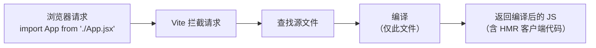
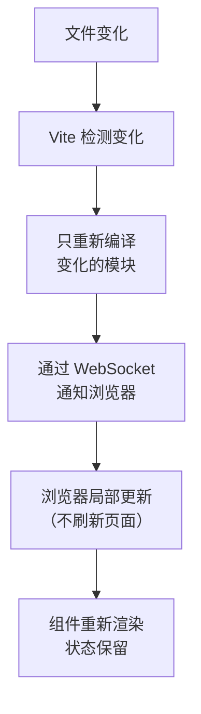
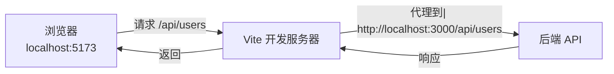

+++
title = "第23章 Vite深入配置"
weight = 230
date = "2026-03-25T12:56:00+08:00"
type = "docs"
description = ""
isCJKLanguage = true
draft = false
+++


# Chapter-23 - Vite 深入配置

## 23.1 Vite 原理

### 23.1.1 开发环境：基于 ESM 的按需编译

Vite 的开发环境利用浏览器的原生 ES Module 支持，**不需要打包**。源文件按需编译，服务启动速度极快。



### 23.1.2 生产环境：Rollup 打包

Vite 在生产环境使用 **Rollup** 进行打包，生成优化的静态资源。

### 23.1.3 HMR（热模块替换）的实现原理



---

## 23.2 环境变量

### 23.2.1 .env 文件体系：.env / .env.local / .env.development / .env.production

Vite 支持多种环境变量文件，按优先级从高到低：

| 文件名 | 说明 |
|-------|------|
| `.env.local` | 本地覆盖，**不会提交到 Git** |
| `.env.development` | 开发环境 |
| `.env.production` | 生产环境 |
| `.env` | 默认/共享 |

### 23.2.2 VITE_ 前缀的必要性

只有以 `VITE_` 开头的变量才会暴露给客户端代码：

```bash
# .env
VITE_API_BASE_URL=https://api.example.com
VITE_APP_TITLE=我的应用

# 不会暴露（以下划线开头）
SECRET_KEY=xxx  # 不会暴露
APP_VERSION=1.0  # 不会暴露
```

### 23.2.3 import.meta.env 读取环境变量

```javascript
console.log(import.meta.env.VITE_API_BASE_URL)
console.log(import.meta.env.VITE_APP_TITLE)

// 内置变量
console.log(import.meta.env.MODE)        // "development" / "production"
console.log(import.meta.env.BASE_URL)    // "/"
console.log(import.meta.env.PROD)        // true (生产)
console.log(import.meta.env.DEV)         // true (开发)
console.log(import.meta.env.SSR)         // true (服务端渲染)
```

### 23.2.4 环境变量的类型提示

```typescript
// src/vite-env.d.ts
/// <reference types="vite/client" />

interface ImportMetaEnv {
  readonly VITE_API_BASE_URL: string
  readonly VITE_APP_TITLE: string
}

interface ImportMeta {
  readonly env: ImportMetaEnv
}
```

---

## 23.3 路径别名

### 23.3.1 配置 `@/` 指向 src

```javascript
// vite.config.js
import path from 'path'

export default defineConfig({
  resolve: {
    alias: {
      '@': path.resolve(__dirname, './src')
    }
  }
})
```

### 23.3.2 TypeScript 中的 paths 映射

```json
// tsconfig.json
{
  "compilerOptions": {
    "baseUrl": ".",
    "paths": {
      "@/*": ["src/*"]
    }
  }
}
```

---

## 23.4 代理与跨域

### 23.4.1 开发环境代理配置

开发时前后端往往在不同端口，存在跨域限制。Vite 的 `server.proxy` 可以把前端请求代理到后端服务器，让浏览器看起来是同源请求：

```javascript
// vite.config.js
export default defineConfig({
  server: {
    proxy: {
      // HTTP 代理：以 /api 开头的请求都会被代理到目标服务器
      '/api': {
        // target: 目标服务器的地址（协议+域名+端口）
        target: 'http://localhost:3000',
        // changeOrigin: 是否修改请求头中的 Origin 字段
        // 为什么要改？因为有些后端服务器会根据 Origin 判断请求是否合法
        // 比如后端配置了 CORS 白名单（只允许特定域名访问），就必须开启这个
        changeOrigin: true,
        // rewrite: 路径重写函数（可选）
        // 把浏览器的 /api/users 转成 /users 发给后端
        // 如果你的后端 API 不需要 /api 前缀，就用这个去掉它
        // 如果不需要重写，直接删掉这行即可
        rewrite: (path) => path.replace(/^\/api/, '')
      },
      // WebSocket 代理：以 /ws 开头的 WebSocket 连接会被代理
      '/ws': {
        target: 'ws://localhost:3000',  // 注意是 ws://（非 http://）
        ws: true  // 开启 WebSocket 代理（Vite 3.0+ 会自动识别 ws:// 协议，可省略）
      }
    }
  }
})
```

### 23.4.2 代理的工作原理



---

## 23.5 插件系统

### 23.5.1 常用 Vite 插件一览

| 插件 | 用途 |
|------|------|
| `@vitejs/plugin-react` | React 支持（JSX、Babel/SWC） |
| `@vitejs/plugin-vue` | Vue 3 支持 |
| `vite-plugin-pages` | 基于文件系统的路由 |
| `vite-plugin-pwa` | PWA 支持 |
| `vite-plugin-svg-icons` | SVG 图标优化 |
| `vite-plugin-compression` | gzip/brotli 压缩 |

### 23.5.2 vite-plugin-react / vite-plugin-react-swc 的区别

| 对比项 | vite-plugin-react | vite-plugin-react-swc |
|-------|-----------------|---------------------|
| **底层** | Babel | SWC（Rust 编写） |
| **编译速度** | 较慢 | 极快（3-20倍） |
| **兼容性** | 更好 | 可能有些 Babel 插件不支持 |
| **推荐** | 需要 Babel 插件时用 | 追求速度时用 |

### 23.5.3 代码压缩与构建优化

通过配置 `build` 选项和压缩插件，可以显著减小生产包体积、提升加载速度：

```javascript
// vite.config.js
import viteCompression from 'vite-plugin-compression'

export default defineConfig({
  plugins: [
    react(),
    viteCompression({
      algorithm: 'gzip',   // 压缩算法：'gzip'（最常用，兼容性最好）或 'brotli'（压缩率更高，但部分旧浏览器不支持）
      ext: '.gz'          // 压缩文件后缀：生成的 .gz 文件在同名 .js/.css 旁，如 app.js → app.js.gz
                            // 服务器需要配置识别 .gz 文件（大多数 CDN/框架会自动处理）
    })
  ],
  build: {
    // target: 打包产物要兼容的目标 JavaScript 版本
    // 'es2015' = 兼容所有现代浏览器（推荐，移动端兼容性足够）
    // 其他可选值：'esnext'（最新特性，不兼容老浏览器）、'chrome100' 等
    target: 'es2015',
    
    // minify: 压缩算法
    // 'terser' = 使用 terser（压缩率高，支持更细粒度配置）
    // 'esbuild' = 使用 esbuild（速度快，压缩率略低，Vite 默认值）
    minify: 'terser',
    terserOptions: {
      compress: {
        drop_console: true,  // 生产环境移除 console.log（降低包体积）
        drop_debugger: true   // 移除 debugger 语句
      }
    },
    
    // rollupOptions.output.manualChunks: 代码分割配置
    // 把大文件拆成多个小 chunk，实现按需加载（不一股脑全加载）
    rollupOptions: {
      output: {
        manualChunks: {
          // vendor: 第三方库单独打包（React、ReactDOM 变化少，适合长期缓存）
          vendor: ['react', 'react-dom'],
          // utils: 工具库单独打包（lodash、axios 等）
          utils: ['lodash', 'axios']
        }
      }
    }
  }
})
```

---

## 23.6 构建与部署

### 23.6.1 npm run build：生产构建

开发完成后，运行生产构建命令，Vite 会使用 Rollup 对代码进行优化打包，生成体积更小、加载更快的静态资源文件。产物默认输出到项目根目录的 `dist/` 文件夹（可在上游配置中修改）。

```bash
npm run build
# 打包产物输出到 dist/ 目录
```

### 23.6.2 构建产物分析：vite-plugin-visualizer

打包完成后，你可能想知道各个模块的体积占比——尤其是第三方库是否打包得太大。`vite-plugin-visualizer` 能生成一个可视化的 HTML 报告，直观展示各包的体积。打包完成后浏览器会自动打开 `stats.html`。

```javascript
// vite.config.js
import { visualizer } from 'vite-plugin-visualizer'

export default defineConfig({
  plugins: [
    react(),
    visualizer({
      filename: 'stats.html',  // 报告文件名
      open: true,               // 打包完成后自动在浏览器打开报告
      gzipSize: true            // 同时显示 gzip 压缩后的体积（更接近真实网络加载大小）
    })
  ]
})
```

### 23.6.3 多环境构建配置

通过 `mode` 参数判断当前构建环境，动态调整输出目录、chunk 命名等配置：

```javascript
// vite.config.js
export default defineConfig(({ command, mode }) => {
  const env = loadEnv(mode, process.cwd(), '')

  return {
    plugins: [react()],
    define: {
      __APP_ENV__: JSON.stringify(env.APP_ENV)
    },
    build: {
      outDir: mode === 'production' ? 'dist' : 'dist-staging',
      rollupOptions: {
        output: {
          chunkFileNames: mode === 'production'
            ? 'assets/[name]-[hash].js'
            : 'assets/[name].js'
        }
      }
    }
  }
})
```

---

## 本章小结

本章我们对 Vite 进行了深入的学习：

- **Vite 原理**：开发环境基于原生 ESM 按需编译（极快），生产环境用 Rollup 打包
- **环境变量**：VITE_ 前缀变量暴露给客户端，多个 .env 文件优先级覆盖
- **路径别名**：`@/` 指向 src，配合 TypeScript paths 使用
- **代理配置**：解决开发环境跨域问题
- **插件系统**：React 支持、代码压缩、构建分析等

Vite 是目前最先进的 React 构建工具，掌握好它的配置能让开发体验提升一个档次！下一章我们将学习 **测试**——React 应用的质量保障！🧪