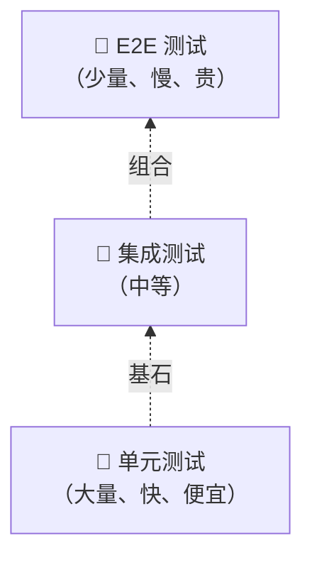

+++
title = "第24章 测试——React应用质量保障"
weight = 240
date = "2026-03-25T12:56:00+08:00"
type = "docs"
description = ""
isCJKLanguage = true
draft = false
+++


# Chapter-24 - 测试——React 应用的质量保障

## 24.1 测试概念

### 24.1.1 单元测试：最小可测试单元

**单元测试（Unit Test）** 针对代码的最小单元进行测试，通常是一个函数或一个组件。

```javascript
// 函数单元测试
function add(a, b) {
  return a + b
}

test('add(1, 2) should return 3', () => {
  expect(add(1, 2)).toBe(3)
})
```

### 24.1.2 集成测试：多个单元的协作

**集成测试（Integration Test）** 介于单元测试和 E2E 测试之间，验证多个单元（如组件 + Hook + Redux store）协同工作时是否正确。相比单元测试，它更接近真实场景；相比 E2E 测试，它运行更快、定位问题更容易。

比如，测试一个表单组件不仅验证 input 的受控绑定，还要验证提交后 Redux action 是否被正确 dispatch，以及错误提示是否正确显示——这些都是多个"单元"配合工作的结果。

### 24.1.3 E2E 测试：模拟真实用户操作

**端到端测试（E2E Test）** 从用户视角模拟完整的用户操作流程，使用真实浏览器。与单元测试不同，E2E 测试不关心内部实现，只关心用户能不能顺利完成操作——比如打开浏览器、点击登录按钮、输入用户名密码、提交表单、看到成功提示。

常用的 E2E 测试工具有 **Playwright** 和 **Cypress**：

```javascript
// Playwright 示例
import { test, expect } from '@playwright/test'

test('用户登录成功', async ({ page }) => {
  await page.goto('/login')
  await page.fill('[name="email"]', 'test@example.com')
  await page.fill('[name="password"]', 'password123')
  await page.click('[type="submit"]')
  await expect(page.locator('.success-message')).toBeVisible()
})
```

E2E 测试速度最慢（需要启动浏览器）、成本最高（环境配置复杂），通常只覆盖核心用户流程（如注册、登录、下单），而不必追求高覆盖率。

### 24.1.4 测试金字塔：底层测试多、高层测试少



---

## 24.2 Vitest 基础

### 24.2.1 Vitest 简介：Vite 原生的测试框架

Vitest 是 Vite 官方推荐的测试框架，配置极简，与 Vite 完美集成。

```bash
npm install -D vitest @testing-library/react jsdom
```

### 24.2.2 describe、it、test 的结构

```javascript
import { describe, it, test, expect } from 'vitest'

describe('计算器功能', () => {
  it('应该正确计算加法', () => {
    expect(1 + 1).toBe(2)
  })

  test('减法测试', () => {
    expect(5 - 3).toBe(2)
  })
})
```

### 24.2.3 expect 断言语法

```javascript
// 常用断言
expect(value).toBe(expected)      // 严格相等（===）
expect(value).toEqual(expected)    // 深度相等（用于对象）
expect(value).toBeNull()           // 是 null
expect(value).toBeTruthy()         // 是真值
expect(value).toBeFalsy()           // 是假值
expect(value).toBeGreaterThan(n)    // 大于
expect(value).toContain(item)      // 数组/字符串包含
expect(() => fn()).toThrow()       // 函数抛出错误
```

### 24.2.4 beforeEach / afterEach / beforeAll / afterAll

```javascript
describe('异步操作测试', () => {
  beforeEach(() => {
    // 每个测试前执行：重置状态
  })

  afterEach(() => {
    // 每个测试后执行：清理
  })

  beforeAll(() => {
    // 所有测试前执行一次
  })

  afterAll(() => {
    // 所有测试后执行一次
  })

  it('测试1', () => { /* ... */ })
  it('测试2', () => { /* ... */ })
})
```

---

## 24.3 React Testing Library

### 24.3.1 核心原则：测试行为而非实现

React Testing Library 的核心理念是：**测试组件做什么，而不是组件怎么做**。不测试组件内部状态、不测试实现细节，只测试最终的用户可见行为。

### 24.3.2 getBy / queryBy / findBy 查询方法

| 方法 | 行为 | 找不到时 |
|------|------|---------|
| `getBy*` | 同步获取 | 抛出错误 |
| `queryBy*` | 同步获取 | 返回 null |
| `findBy*` | 异步获取（返回 Promise） | 抛出错误 |

```javascript
import { render, screen } from '@testing-library/react'

render(<Button label="点击我" />)

// 按文本查找
screen.getByText('点击我')

// 按 role 查找
screen.getByRole('button', { name: '点击我' })

// 按 testid 查找
screen.getByTestId('my-button')
```

### 24.3.3 fireEvent vs userEvent

```javascript
import { render, screen, fireEvent } from '@testing-library/react'
import userEvent from '@testing-library/user-event'

test('点击按钮', async () => {
  const user = userEvent.setup()  // 需要 setup

  render(<input type="text" />)
  const input = screen.getByRole('textbox')

  await user.type(input, 'Hello')
  expect(input).toHaveValue('Hello')

  // fireEvent（已过时，不推荐）
  fireEvent.change(input, { target: { value: 'Hello' } })
})
```

### 24.3.4 模拟用户交互：点击、输入、提交

`userEvent` 是比 `fireEvent` 更接近真实用户行为的测试工具——它会触发完整的 DOM 事件链（如 `input` 事件 + `change` 事件），而 `fireEvent` 只触发单个事件：

```javascript
import { render, screen } from '@testing-library/react'
import userEvent from '@testing-library/user-event'

test('表单填写和提交', async () => {
  const user = userEvent.setup()
  const handleSubmit = vi.fn()

  render(<form onSubmit={handleSubmit}>
    <input name="email" type="email" />
    <button type="submit">提交</button>
  </form>)

  const emailInput = screen.getByRole('textbox', { name: /email/i })
  const submitButton = screen.getByRole('button', { name: '提交' })

  await user.type(emailInput, 'test@example.com')
  await user.click(submitButton)

  expect(handleSubmit).toHaveBeenCalled()
})
```

### 24.3.5 测试表单验证

```javascript
test('必填字段未填时显示错误', async () => {
  const user = userEvent.setup()

  render(<LoginForm />)

  const submitButton = screen.getByRole('button', { name: '登录' })
  await user.click(submitButton)

  const errorMessage = screen.getByText('邮箱是必填项')
  expect(errorMessage).toBeInTheDocument()
})
```

---

## 24.4 常用测试技巧

### 24.4.1 mock 函数：模拟函数行为

`vi.fn()` 是 Vitest 提供的 mock 函数创建工具，可以追踪调用记录、模拟返回值、模拟异步结果：

```javascript
const mockFn = vi.fn()

mockFn('hello')
expect(mockFn).toHaveBeenCalledWith('hello')
expect(mockFn).toHaveBeenCalledTimes(1)

// 模拟返回值
mockFn.mockReturnValue(42)
console.log(mockFn())  // 42

// 模拟异步函数
mockFn.mockResolvedValue({ success: true })
const result = await mockFn()
expect(result).toEqual({ success: true })
```

### 24.4.2 spy：监听函数调用

`vi.spyOn` 用于监听某个对象上现有方法的所有调用——不替换它，只"窥视"它。常用于验证内部方法是否被正确调用：

```javascript
test('监听函数调用', () => {
  const obj = {
    method: () => 'original'
  }

  const spy = vi.spyOn(obj, 'method')

  obj.method()
  expect(spy).toHaveBeenCalled()
  expect(spy).toHaveBeenCalledTimes(1)
})
```

### 24.4.3 异步测试：waitFor 与 findBy

异步数据加载的测试需要等待 DOM 更新完成。`findBy*` 是最简洁的方式（返回 Promise，自动等待）；`waitFor` 更灵活，适合需要轮询的场景：

```javascript
import { render, screen, waitFor } from '@testing-library/react'

test('异步加载数据显示', async () => {
  render(<UserProfile userId={1} />)

  // 等待元素出现
  await screen.findByText('用户名：小明')

  // 或者用 waitFor
  await waitFor(() => {
    expect(screen.getByText('小明')).toBeInTheDocument()
  })
})
```

### 24.4.4 Mock HTTP 请求：msw（Mock Service Worker）

MSW（Mock Service Worker）能在 Node.js 测试环境拦截所有 HTTP 请求，返回自定义的模拟数据，无需修改业务代码。配合 `setupServer` 使用：

```bash
npm install -D msw
```

```javascript
import { http, HttpResponse } from 'msw'
import { setupServer } from 'msw/node'
import { render, screen } from '@testing-library/react'

// --------------------------------------------------
// 1. 创建 Mock 服务器实例
// setupServer 会拦截 Node.js 级别的 HTTP 请求
// --------------------------------------------------
const server = setupServer(
  // 拦截 GET /api/users/:id 请求（:id 是 msw 的路径参数）
  http.get('/api/users/:id', ({ params }) => {
    // params.id 的值就是 URL 中的实际 id（如 1、2、3）
    return HttpResponse.json({ id: params.id, name: '小明' })
  })
)

// --------------------------------------------------
// 2. 测试前：启动服务器，拦截所有 HTTP 请求
// --------------------------------------------------
beforeAll(() => server.listen())

// --------------------------------------------------
// 3. 每个测试后：重置所有 mock 处理器
// 防止一个测试的 mock 数据泄露到下一个测试
// --------------------------------------------------
afterEach(() => server.resetHandlers())

// --------------------------------------------------
// 4. 所有测试结束后：关闭服务器，恢復真实网络请求
// --------------------------------------------------
afterAll(() => server.close())

test('显示用户信息', async () => {
  render(<UserProfile userId={1} />)

  // screen.findByText 是异步查询，会等待元素出现（最多 1 秒）
  // 这里 MSW 已经拦截了 /api/users/1 请求，直接返回模拟数据
  await screen.findByText('小明')
})
```

### 24.4.5 测试自定义 Hook：@testing-library/react

`renderHook` 是 Testing Library 专门为 React Hooks 提供的测试工具，类似于组件测试的 `render`，但针对 Hook 做适配。`act` 用于包裹会触发 state 更新的操作：

```javascript
import { renderHook, act } from '@testing-library/react'
import { useCounter } from './useCounter'

test('计数器递增', () => {
  const { result } = renderHook(() => useCounter())

  expect(result.current.count).toBe(0)

  act(() => {
    result.current.increment()
  })

  expect(result.current.count).toBe(1)
})
```

---

## 24.5 测试覆盖率

### 24.5.1 覆盖率报告的解读

运行带覆盖率参数的测试命令后，会生成详细的覆盖率报告，展示代码各维度的覆盖程度：

```bash
npm test -- --coverage
```

| 指标 | 含义 |
|------|------|
| **Statements** | 语句覆盖率 |
| **Branches** | 分支覆盖率（if/else 等） |
| **Functions** | 函数覆盖率 |
| **Lines** | 行覆盖率 |

### 24.5.2 覆盖率不是越高越好：focus on user behavior

测试的**质量**比**覆盖率**更重要。100% 覆盖率的测试，如果测试的是无关紧要的代码，也没有意义。

**应该优先测试的场景：**
- 核心业务逻辑
- 用户可见的行为
- 边界条件和错误处理
- 容易出错的代码

---

## 本章小结

本章我们对 React 测试进行了全面学习：

- **测试金字塔**：单元测试（大量、快速、便宜）→ 集成测试 → E2E 测试（少量、慢、贵）
- **Vitest**：Vite 原生测试框架，与 Vite 完美集成，配置极简
- **React Testing Library**：测试行为而非实现，按 role、text、testid 等方式查询元素
- **常用技巧**：mock 函数、spy 监听、异步测试、msw Mock 服务端点
- **测试覆盖率**：质量比覆盖率更重要，优先测试核心业务逻辑和用户可见行为

测试是 React 应用质量的保障，但测试也是一门艺术——写有用的测试，让它们保护你的代码！下一章我们将学习 **React 性能优化全解**！⚡