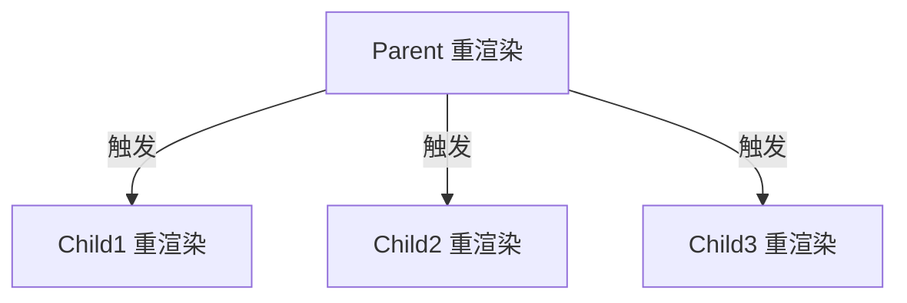
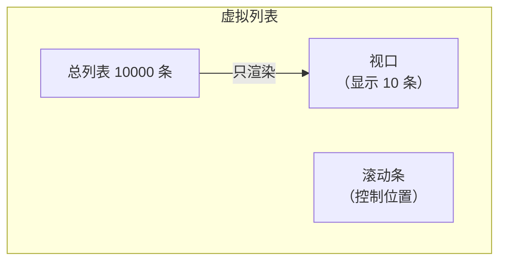

+++
title = "第25章 React性能优化全解"
weight = 250
date = "2026-03-25T12:56:00+08:00"
type = "docs"
description = ""
isCJKLanguage = true
draft = false
+++


# Chapter-25 - React 性能优化全解

## 25.1 React DevTools Profiler

### 25.1.1 安装 Profiler 插件

在 Chrome 扩展商店搜索"React Developer Tools"，安装后打开 DevTools（F12），切换到 "Profiler" 标签。

### 25.1.2 录制与读取性能报告

1. 点击"录制"按钮
2. 操作你的应用（点击、输入等）
3. 点击"停止"查看分析报告

### 25.1.3 识别过度渲染的组件

Profiler 的火焰图（Flame Chart）能直观展示组件渲染时间，**越高表示渲染越慢**，颜色越深表示渲染次数越多。

### 25.1.4 读懂火焰图（Flame Chart）与排序图（Ranked Chart）

- **Flame Chart**：展示渲染的调用栈，从上到下是嵌套关系
- **Ranked Chart**：按渲染时间从长到短排序，快速找到性能瓶颈

---

## 25.2 重渲染机制

### 25.2.1 状态变化导致的重渲染

当组件的 state 变化时，该组件及其所有子组件都会重新渲染。

```jsx
function Parent() {
  const [count, setCount] = useState(0)

  return (
    <div>
      {/* count 变化时，Parent 和所有子组件都会重新渲染 */}
      <button onClick={() => setCount(c => c + 1)}>+1</button>
      <ChildA />
      <ChildB />
      <ChildC />
    </div>
  )
}
```

### 25.2.2 父组件重渲染导致子组件重渲染

父组件重渲染时，默认所有子组件也会重渲染——即使子组件的 props 没有变化。



### 25.2.3 Props 引用变化导致的重渲染

```jsx
function Parent() {
  const [count, setCount] = useState(0)

  // ❌ 错误做法：每次渲染都创建新对象引用
  // 即使对象内容完全相同，引用变了也会导致 Child 重新渲染
  const options = { theme: 'dark', language: 'zh' }

  return (
    <div>
      <p>{count}</p>
      <button onClick={() => setCount(c => c + 1)}>+1</button>
      {/* 每次 Parent 渲染，options 都是新引用，Child 会被迫重渲染 */}
      <Child options={options} />
    </div>
  )
}
```

```jsx
function Parent() {
  const [count, setCount] = useState(0)

  // ✅ 正确做法：用 useMemo 缓存对象
  // 依赖数组为空 []，只在首次渲染时创建，之后返回同一个引用
  const optionsMemoized = useMemo(() => ({ theme: 'dark', language: 'zh' }), [])

  // ✅ 正确做法：用 useCallback 缓存函数引用
  // 依赖数组为空 []，函数引用始终稳定，不会导致子组件重渲染
  const handleClick = useCallback(() => {
    console.log('clicked')
  }, [])

  return (
    <div>
      <p>{count}</p>
      <button onClick={() => setCount(c => c + 1)}>+1</button>
      {/* optionsMemoized 引用始终稳定，Child 不会因此不必要地重渲染 */}
      <Child options={optionsMemoized} />
    </div>
  )
}
```

### 25.2.4 Context 变化导致的重渲染

```jsx
// 当 Context 的 value 变化时，所有消费这个 Context 的组件都会重新渲染
const ThemeContext = createContext()

function App() {
  const [theme, setTheme] = useState('light')

  return (
    <ThemeContext.Provider value={{ theme, setTheme }}>
      {/* 这里的所有组件都会在 theme 变化时重新渲染 */}
      <Header />
      <Sidebar />
      <Content />
    </ThemeContext.Provider>
  )
}
```

---

## 25.3 避免不必要重渲染

### 25.3.1 React.memo：避免 props 没变化的子组件重渲染

```jsx
const Child = memo(function Child({ title, count }) {
  console.log('Child 渲染了')
  return <div>{title}: {count}</div>
})
```

### 25.3.2 useCallback：稳定传递给子组件的函数引用

```jsx
function Parent() {
  const [count, setCount] = useState(0)

  // ✅ 用 useCallback 缓存函数引用
  const handleClick = useCallback(() => {
    console.log('clicked')
  }, [])

  return (
    <div>
      <p>{count}</p>
      <button onClick={() => setCount(c => c + 1)}>+1</button>
      <MemoizedChild onClick={handleClick} />
    </div>
  )
}
```

### 25.3.3 useMemo：稳定传递给子组件的对象引用

```jsx
function Parent() {
  const [count, setCount] = useState(0)
  const [theme, setTheme] = useState('light')

  // ✅ 用 useMemo 缓存对象
  const contextValue = useMemo(() => ({
    theme,
    setTheme
  }), [theme, setTheme])

  return (
    <ThemeContext.Provider value={contextValue}>
      <Child />
    </ThemeContext.Provider>
  )
}
```

### 25.3.4 拆分 Context：减少重渲染范围

```jsx
// ❌ 一个 Context 包含所有值，一个变化全都重渲染
const AppContext = createContext()

// ✅ 拆成多个 Context，变化时只影响需要的组件
const ThemeContext = createContext()
const AuthContext = createContext()
const CartContext = createContext()
```

### 25.3.5 状态位置优化：将状态放在子组件而非父组件

```jsx
// ❌ 状态放在父组件，导致不必要的子组件重渲染
function BadExample() {
  const [expanded, setExpanded] = useState(false)
  return (
    <div>
      <Sidebar />  {/* 不相关组件也被迫重渲染 */}
      <Main isExpanded={expanded} onToggle={() => setExpanded(!expanded)} />
    </div>
  )
}

// ✅ 状态放在真正需要的组件里
function GoodExample() {
  return (
    <div>
      <Sidebar />
      <Main />
    </div>
  )
}

function Main() {
  const [expanded, setExpanded] = useState(false)
  return (
    <div>
      <p>状态只在这里，不需要重渲染 Sidebar</p>
      <button onClick={() => setExpanded(!expanded)}>切换</button>
    </div>
  )
}
```

---

## 25.4 长列表优化

### 25.4.1 虚拟列表的原理：只渲染可见区域

虚拟列表（Virtual List）的核心原理是：**只渲染当前可见的列表项**，大量不在屏幕中的列表项用占位元素撑开高度，而不是真正渲染。



### 25.4.2 react-window 的基本用法

```bash
npm install react-window
```

```jsx
import { FixedSizeList } from 'react-window'

function VirtualList({ items }) {
  const Row = ({ index, style }) => (
    <div style={style}>
      第 {index} 项: {items[index].name}
    </div>
  )

  return (
    <FixedSizeList
      height={400}            // 列表高度
      width="100%"             // 列表宽度
      itemCount={items.length} // 总条目数
      itemSize={50}           // 每项高度
    >
      {Row}
    </FixedSizeList>
  )
}
```

### 25.4.3 固定高度 vs 可变高度列表

| 类型 | 库 | 特点 |
|------|------|------|
| 固定高度 | react-window | 性能更好 |
| 可变高度 | @tanstack/react-virtual | 支持不同高度的列表项（react-virtualized 已停止维护，推荐用此替代） |

---

## 25.5 渲染性能

### 25.5.1 虚拟 DOM vs 直接操作 DOM

直接操作 DOM 就像用手工方式装修房子——每次改动都要亲自上手，还容易搞砸整个布局。虚拟 DOM 则是先在图纸（JavaScript 对象）上画好所有修改方案，最后一次性交给工人执行，省时省力还不出错。

当 state 变化时，React 先生成新的虚拟 DOM 树，然后通过 **Diffing 算法** 将新树与旧树对比，找出最小的变更集，最后只把这些变更应用到真实 DOM 上。这种"先规划再执行"的策略，让 React 能够批量处理 DOM 更新，避免频繁触发浏览器的重排（Reflow）和重绘（Repaint）。

当然，虚拟 DOM 不是银弹——它本身有额外的内存开销和计算成本。但对于绝大多数应用来说，这个开销远小于直接操作 DOM 带来的性能损耗，而且开发体验也好太多了：不用手动指挥每个 DOM 节点的更新，只管描述"界面长什么样"，剩下的交给 React。

### 25.5.2 减少 DOM 层级深度

```jsx
// ❌ 过多嵌套层级
<div>
  <div>
    <div>
      <div>
        <p>内容</p>
      </div>
    </div>
  </div>
</div>

// ✅ 减少层级
<div>
  <p>内容</p>
</div>
```

### 25.5.3 CSS 动画 vs JS 动画：transform vs top/left

CSS 动画和 JS 动画的选择，本质上是"让谁控制动画"的问题。CSS 动画跑在 Compositor Thread（合成线程）上，JS 动画跑在 Main Thread（主线程）上——而主线程还同时负责渲染、事件处理、JavaScript 执行，一旦繁忙，动画就会卡顿。

**关键原则：用 `transform` 和 `opacity` 做动画。**这两个属性可以由 Compositor Thread 独立处理，不受主线程阻塞影响。而 `top`、`left`、`width`、`height` 的变化会触发 Layout（重排），代价昂贵。

```css
/* ❌ 使用 top/left 动画：会触发重排（Reflow），性能差 */
.animated {
  transition: top 0.3s ease;
}

/* ✅ 使用 transform：只触发重绘（Repaint），性能好 */
.animated {
  transition: transform 0.3s ease;
  transform: translateX(100px);
}
```

### 25.5.4 will-change 的正确使用

`will-change` 是给浏览器的"预告信"——告诉它"这个元素接下来要变化了，请提前做好准备"。浏览器收到后会做一些优化（比如提升到独立的图层），这样动画开始时就不会有一帧的延迟或抖动。

但别滥用：**提前声明太多 `will-change` 会适得其反**，因为每个图层都要占用 GPU 内存。最佳实践是只在**确定会动画的元素上**、**动画开始前**使用，动画结束后移除（或者用完就删）。

```css
/* 提前告诉浏览器即将变化，减少性能抖动 */
.animated-element {
  will-change: transform;  /* 提前声明 */
  transform: translateX(0);
  transition: transform 0.3s ease;
}

.animated-element:hover {
  transform: translateX(100px);
}
```

---

## 25.6 代码分割与预加载

### 25.6.1 React.lazy + Suspense 路由级分割

```jsx
import { lazy, Suspense } from 'react'
import { BrowserRouter, Routes, Route } from 'react-router-dom'

const Home = lazy(() => import('./pages/Home'))
const Dashboard = lazy(() => import('./pages/Dashboard'))
const Settings = lazy(() => import('./pages/Settings'))

function App() {
  return (
    <BrowserRouter>
      <Suspense fallback={<div>加载中...</div>}>
        <Routes>
          <Route path="/" element={<Home />} />
          <Route path="/dashboard" element={<Dashboard />} />
          <Route path="/settings" element={<Settings />} />
        </Routes>
      </Suspense>
    </BrowserRouter>
  )
}
```

### 25.6.2 组件级代码分割

```jsx
const HeavyChart = lazy(() => import('./components/HeavyChart'))
const RichTextEditor = lazy(() => import('./components/RichTextEditor'))

function ReportPage() {
  const [showChart, setShowChart] = useState(false)

  return (
    <div>
      <button onClick={() => setShowChart(true)}>显示图表</button>

      <Suspense fallback={<Skeleton />}>
        {showChart && <HeavyChart />}
      </Suspense>
    </div>
  )
}
```

### 25.6.3 预加载与预取策略

```jsx
// 预加载下一个路由的组件
function App() {
  const handleMouseEnter = () => {
    import('./pages/Dashboard')  // 鼠标悬停时预加载
  }

  return (
    <Link to="/dashboard" onMouseEnter={handleMouseEnter}>
      仪表盘
    </Link>
  )
}
```

### 25.6.4 dynamic import 的使用

```jsx
import('./utils/heavy.js')
  .then(module => {
    const heavyFunction = module.default
    heavyFunction()
  })
```

---

## 25.7 SSR 与 Next.js 入门

### 25.7.1 服务端渲染 vs 客户端渲染

| 对比项 | CSR（客户端渲染） | SSR（服务端渲染） |
|--------|----------------|----------------|
| **首屏速度** | 慢（需要下载 JS 再渲染） | 快（HTML 直接展示） |
| **SEO** | 差 | 好 |
| **服务器负载** | 低 | 高 |
| **交互性** | 完整（ hydration 后） | 需等 hydration |

### 25.7.2 Next.js 简介：React 全栈框架

Next.js 是 Vercel 团队打造的 React 全栈框架，堪称 React 生态里的"瑞士军刀"——既能做服务端渲染（SSR）、静态站点生成（SSG），还能实现增量式静态再生（ISR），路由、API 路由、图像优化、字体优化等更是不在话下。

如果你要做一个需要良好 SEO 和首屏性能的网站（比如博客、电商首页、新闻站点），Next.js 几乎是标配。它的 Page Router（App Router 之前的旧方式）和 App Router（13 版本引入）两套路由系统各有拥趸，但新项目建议直接用 App Router，因为那是 Next.js 的未来方向。

### 25.7.3 SSR 对首屏性能的意义

SSR 让用户首次访问页面时就能看到内容（而非空白页面），大幅提升首屏加载体验和 SEO 效果。

---

## 本章小结

本章我们对 React 性能优化进行了全面梳理：

- **Profiler**：用 React DevTools Profiler 找到真正的性能瓶颈，而不是凭感觉优化
- **重渲染机制**：state 变化、父组件重渲染、props 引用变化、Context 变化都会触发重渲染
- **避免不必要重渲染**：React.memo、useCallback、useMemo、拆分 Context、状态位置优化
- **长列表优化**：虚拟列表（react-window）只渲染可见区域
- **渲染性能**：减少 DOM 层级、使用 transform 替代 top/left、will-change
- **代码分割**：React.lazy + Suspense 实现路由级和组件级分割
- **SSR vs CSR**：服务端渲染提升首屏性能和 SEO

记住：**性能优化的正确姿势是先测量再优化**！下一章我们将开始 **实战项目**——Todo App 增强版！📝