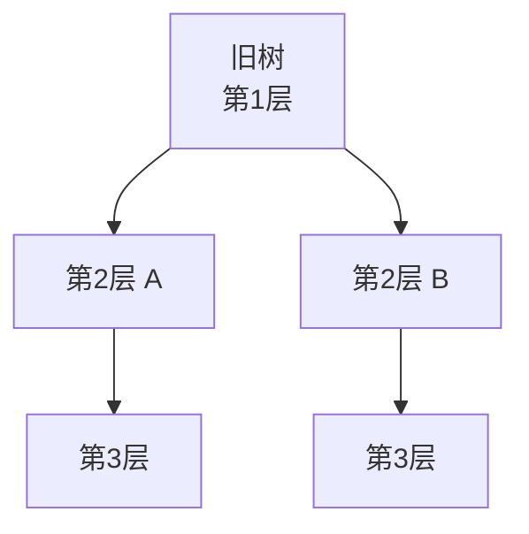

+++
title = "第29章 React运行机制"
weight = 290
date = "2026-03-25T12:56:00+08:00"
type = "docs"
description = ""
isCJKLanguage = true
draft = false
+++


# Chapter-29 - React 运行机制

## 29.1 Virtual DOM 原理

### 29.1.1 DOM 的性能问题

直接操作真实 DOM 是昂贵的——每次 DOM 修改都会触发浏览器的重排（Reflow）和重绘（Repaint）。

### 29.1.2 虚拟 DOM 的数据结构

虚拟 DOM 是一个 JavaScript 对象树，描述真实 DOM 的结构。

```javascript
const virtualDOM = {
  type: 'div',
  props: { className: 'container' },
  children: [
    {
      type: 'h1',
      props: {},
      children: 'Hello, World!'
    },
    {
      type: 'button',
      props: { onClick: () => {} },
      children: 'Click me'
    }
  ]
}
```

### 29.1.3 虚拟 DOM 的优势与局限

**优势：**
- 批量更新 DOM，减少重排重绘
- 跨平台能力（React Native 用的也是虚拟 DOM）
- 开发体验好（不用直接操作 DOM）

**局限：**
- 对于极简单的场景，直接操作 DOM 可能更快
- 虚拟 DOM 本身有内存开销

---

## 29.2 Diffing 算法

### 29.2.1 为什么要 diff：找出最小变更

当 state 变化时，React 需要找出"哪些 DOM 需要更新"。直接对比新旧虚拟 DOM 树太低效，React 用 **Diffing 算法** 高效比较。

### 29.2.2 tree diff：层级的比较（逐层对比）

React 采用**逐层对比**的策略，只比较同层级的节点，不跨层级比较。



### 29.2.3 component diff：类型比较

当组件类型变化时，React 会**完全卸载旧组件并挂载新组件**——旧组件的 state 全部丢失，新的从头开始。

```jsx
// 组件 A 变成组件 B，整个子树卸载重建
{condition ? <ComponentA /> : <ComponentB />}
```

这里的"类型变化"指的是外层组件的 `type` 不一样。比如原来渲染 `<div>` 变成渲染 `<span>`，或者 `<UserCard />` 变成 `<AdminCard />`。注意：**只是 props 变了而组件类型没变，不会触发卸载重建**——React 会对比 props 的变化，只更新必要的 DOM 属性。

所以如果你发现某个组件状态意外丢失（比如动画状态），先检查是不是组件类型被动态切换了。

### 29.2.4 element diff：同层级元素的比较（移动、删除、新增）

同层级的元素比较是 Diffing 算法最复杂的部分，因为涉及**移动、删除、新增**三种操作的判断。

假设原来的列表是 `[A, B, C]`，用户操作后变成了 `[C, A, B]`。没有 key 的情况下，React 会傻傻地认为：第一个位置从 A 变成 C（更新），第二个位置从 B 变成 A（更新），第三个位置多了一个 C（新增）——完全搞错了！有了稳定的 key，React 知道 C 是之前就存在的，只是移到了前面。

```jsx
// ✅ 稳定的 key 让 React 准确追踪每个元素
{todos.map(todo => (
  <li key={todo.id}>{todo.text}</li>
))}

// ❌ 用 index 作 key：删除中间项时，后续所有项的 index 都变了
// [A, B, C] 删除 B 后变成 [A, C]，React 以为 C 变了
{todos.map((todo, index) => (
  <li key={index}>{todo.text}</li>
))}

// ✅ 更好的写法：如果列表不会重新排序或删除，才可以用 index 作为 fallback
{todos.map((todo, index) => (
  <li key={todo.id ?? index}>{todo.text}</li>
))}
```

### 29.2.5 keys 的最佳实践

不是什么场景都必须用数据库 ID——如果你能保证列表**永远不会重新排序或删除中间项**（比如只往末尾追加的日志列表），用 index 作为 key 是可以的。但凡有删除、排序、拖拽操作，请一定用稳定唯一 ID。

React 官方建议 key 要在**兄弟节点间唯一**，不需要全局唯一——同一层级的 key 不重复就行。

```jsx
// ❌ 错误：两个列表用了相同的 key
<List items={posts} />
<Grid items={posts} />  // 两个组件里都用了 post.id，key 冲突

// ✅ 正确：确保 key 在当前列表范围内唯一
```

### 29.2.6 Diffing 算法的局限性

Diffing 算法虽然高效，但也有局限——它只能检测同层级的变化，跨层级的移动会被理解为"删除 + 新增"。比如把一个组件从 `div.a` 移到 `div.b`，React 会先卸载 `div.a` 里的组件，再挂载 `div.b` 里的组件，即使它们实际是同一个组件实例。保持稳定的 DOM 结构对性能有帮助。

---

## 29.3 Fiber 架构

### 29.3.1 同步渲染的问题：长时间阻塞主线程

传统 React 的渲染是**同步的**，一旦开始就不可中断。如果组件树很大，渲染会长时间阻塞主线程，导致页面卡顿。

### 29.3.2 Fiber 的核心思想：可中断、可恢复

Fiber 将渲染工作拆分成**小任务单元**，每个单元执行完后可以让出主线程，实现**可中断、可恢复**的渲染。

### 29.3.3 Fiber 的数据结构：链表

Fiber 用链表取代递归树，每个节点记录：
- `child`：第一个子节点
- `sibling`：下一个兄弟节点
- `return`：父节点

**为什么不用递归树？**

传统 React 15 用递归来渲染组件树——一旦开始，就必须一口气执行完，无法中断。想象你在餐厅点了一桌菜，厨师必须做完所有菜才能接待下一桌客人。如果有一道复杂的菜，整个餐厅都会卡住。

Fiber 的核心突破是把递归改成**链表 + 工作单元**：

```
FiberNode = {
  child: 第一个子节点,
  sibling: 下一个兄弟节点,
  return: 父节点
}
```

这就像把一桌菜拆成一道道菜，每做完一道就可以问："有没有更紧急的客人需要先服务？"如果有，就暂停当前任务，先去处理紧急的，处理完再回来继续。这就是**可中断**的关键——链表让 React 可以在任意节点暂停，而递归一旦开始就无法回头。

遍历时，React 按 **深度优先** 顺序处理子节点，同时维护链表指针可以轻松在兄弟节点间跳转。这种结构特别适合"干一半停下去做别的事，再回来接着干"的场景。

### 29.3.4 Fiber 的优先级与调度

React 为不同任务分配不同优先级（内部称 Priority 为 Lanes）：
- **同步优先级（SyncLane）**：用户点击、输入等紧急交互
- **连续优先级（InputContinuousLane）**：拖拽、滚动等需流畅跟手的操作
- **默认优先级（DefaultLane）**：数据获取等常规更新
- **过渡优先级（TransitionLane）**：startTransition 标记的更新
- **空闲优先级（IdleLane）**：预加载等不紧急的后台任务

**调度器是怎么工作的？**

可以把 React 的调度器想象成**急诊室的分诊护士**：

1. 所有待处理的任务（Fiber 节点）都放在一个**任务队列**里
2. 护士根据病情（优先级）决定先看谁
3. 紧急病人（如用户点击）来了可以**插队到最前面**
4. 正在看的病人如果遇到更紧急的，可以**先放下，回来继续**

具体来说，当 `setState` 触发时：
1. React 创建一个更新任务，带上对应的优先级
2. 调度器把任务加入队列
3. 如果有更高优先级的任务进来，**低优先级任务会被暂停**
4. 等高优先级任务完成后，低优先级再"捡起来"继续

这就是为什么你在搜索框输入时，即使页面正在渲染复杂列表，输入也能即时响应——因为用户输入是同步优先级，而列表渲染是过渡优先级。

---

## 29.4 协调（Reconciliation）

React 的渲染流程分为两个主要阶段：**render（可中断）** 和 **commit（不可中断）**。理解这个划分是理解 React 调度能力的关键。

### 29.4.1 render 阶段：收集变更（可中断）

**render 阶段**是 React 的"规划"阶段——遍历 Fiber 树，对比 current 和 workInProgress，确定哪些 DOM 需要更新。这个阶段的工作是**可中断的**：

- React 可以在任意 Fiber 节点处理完后停下来
- 检查是否有更高优先级的任务需要处理
- 处理完紧急任务后，再回来继续

为什么 render 可以中断？因为它只是"记账"——只是记录"哪里需要改"，并不真正动手改。这就像装修前设计师先画图纸，画到一半发现紧急修水管，可以先去修完再回来画图，不影响最终结果。

### 29.4.2 commit 阶段：应用变更（不可中断）

**commit 阶段**是真正动手的阶段——把 render 阶段规划的变更应用到真实 DOM 上（插入、更新、删除节点，触发副作用如 useEffect）。

为什么 commit 不能中断？因为一旦开始操作 DOM，**中断会导致页面处于半更新状态**——比如按钮已经移动但文字还没更新，用户就会看到"残缺"的界面。这种状态无法恢复，所以 commit 必须一口气完成。

用一个生活比喻：render 阶段是"想好要做什么菜、备好料"，commit 阶段是"开火炒菜"——炒菜显然不能炒一半跑去干别的，否则菜就糊了。

### 29.4.3 双缓存技术：current tree / workInProgress tree

React 维护两个虚拟 DOM 树：
- **current tree**：当前显示的
- **workInProgress tree**：正在构建的

构建完成后直接替换，不用比较。

---

## 29.5 批处理

### 29.5.1 批处理的概念：合并多次状态更新

**批处理（Batching）**：将多次 state 更新合并成一次渲染，减少不必要的重新渲染。

### 29.5.2 React 18 之前的批处理规则

React 18 之前，批处理是有条件的——**只有 React 事件处理函数（如 onClick、onChange）内的 setState 才会批处理**。如果在 setTimeout、Promise 回调、fetch 回调里调用 setState，每次调用都会单独触发一次渲染，即使它们紧挨着执行。

```jsx
// React 18 之前：4 次 setState = 4 次渲染（性能灾难）
setTimeout(() => {
  setCount(1)    // 渲染 1
  setName('A')   // 渲染 2
  setAge(20)     // 渲染 3
  setGender('M') // 渲染 4
}, 0)
```

这个问题以前靠手动包 `unstable_batchedUpdates` 来解决，但显然不够优雅——你不应该在业务代码里到处想着"这个 setState 要不要包一下"。这也是 React 18 推出 Automatic Batching 的主要原因之一。

### 29.5.3 React 18/19 Automatic Batching：所有场景自动批处理

React 18+ 自动批处理所有场景！

```jsx
// React 18+：即使在 setTimeout 中，所有更新也会批处理
setTimeout(() => {
  setCount(1)  // 不触发渲染
  setName('小明')  // 不触发渲染
  // 1 次渲染完成，而不是 2 次
}, 0)
```

### 29.5.4 flushSync 的使用场景

`flushSync` 强制同步刷新，用于需要**立即获取最新 DOM 状态**的罕见场景。

> ⚠️ `flushSync` 会**取消并发优化的效果**（强制变成同步渲染），使用它是一种"不得已"的权衡。只有在必须立刻读取 DOM 时才用它。

```jsx
import { flushSync } from 'react-dom'

flushSync(() => {
  setCount(1)  // 强制同步刷新，这行执行完后 DOM 已更新
})
// 紧接着读取 DOM，能拿到最新值
console.log(document.querySelector('.count').textContent)  // "1" 🎯

// 典型使用场景举例：
// 1. 需要将焦点（focus）移到新渲染的元素上
// 2. 某些第三方库需要在 DOM 更新后立即测量元素尺寸
// 3. 需要在下一个同步代码块之前确保 DOM 已更新
```

大多数 React 应用**不需要** `flushSync`——并发渲染的自动批处理已经覆盖了绝大多数场景。如果你在业务代码中频繁使用它，说明可能有设计问题需要重新考虑。

---

## 本章小结

本章我们深入探索了 React 的内部运行机制：

- **虚拟 DOM**：JavaScript 对象描述真实 DOM，批量更新减少重排重绘
- **Diffing 算法**：逐层对比，通过 key 优化 element diff
- **Fiber 架构**：可中断可恢复的渲染，通过链表实现任务拆分和优先级调度
- **协调（Reconciliation）**：render 阶段（可中断）vs commit 阶段（不可中断），双缓存技术
- **批处理**：React 18+ 所有场景自动批处理，flushSync 强制同步刷新

理解 React 的内部原理，是从"会用"到"精通"的关键一步！当你能够在脑海里画出 Fiber 链表、想到 Diffing 不再一脸懵逼时，你就升级了！🎉 下一章我们将学习 **React 19 新特性**——这个版本可不是挤牙膏，亮点相当多！🚀