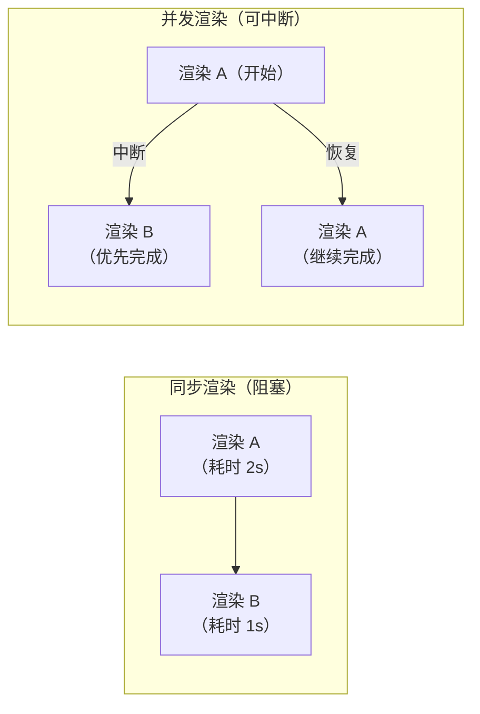

+++
title = "第31章 React并发模式"
weight = 310
date = "2026-03-25T12:56:00+08:00"
type = "docs"
description = ""
isCJKLanguage = true
draft = false
+++


# Chapter-31 - React 并发模式

## 31.1 并发渲染原理

### 31.1.1 并发渲染的内部机制

React 18 引入了**并发渲染（Concurrent Rendering）**，它让 React 能够同时准备多个版本的 UI，根据优先级选择先渲染哪个。

**并发不是"同时做两件事"——而是"智能地切换任务"**

很多人对"并发"有误解，以为是 CPU 同时处理多个任务。实际上，单核 CPU 同一时刻只能做一件事。并发的高明之处在于**任务切换的速度**——当一个任务等待（如网络请求）时，CPU 可以切换去处理其他任务，由于切换速度极快（毫秒级），用户感觉像是"同时在进行"。

在 React 的场景里，"等待"发生在渲染过程中。当 React 要渲染一个庞大的组件树时，它不需要一口气渲染完——每处理完一个 Fiber 节点，都可以问问调度器："现在有没有更紧急的事？"如果有，就先去做更紧急的，回来再继续。

React 18 之所以能做到这一点，是因为：
1. **Fiber 架构**（第 29 章）把递归渲染改成了链表 + 工作单元
2. **优先级机制**让 React 知道哪些任务更紧急
3. **调度器**根据优先级协调任务执行的顺序

三者配合，React 18+ 就实现了"可中断的并发渲染"——渲染过程不再是一条"不归路"，而是可以随时被打断、优先级可以动态调整的灵活流程。

### 31.1.2 并发 vs 同步渲染的区别



### 31.1.3 React 18 起的并发特性：Automatic Batching、startTransition

- **Automatic Batching**：所有场景自动批处理（setTimeout、Promise、fetch 回调里的 setState 也会合并）
- **startTransition**：标记非紧急更新，让紧急更新（如用户输入）优先渲染

这两个特性不需要你写任何特殊代码，只要把 React 升级到 18+，它们就自动生效了。`startTransition` 需要配合 `useTransition` 或 `useDeferredValue` 使用，具体见下面的章节。

---

## 31.2 useTransition

### 31.2.1 useTransition：标记非紧急更新

`startTransition` 标记非紧急更新，让紧急更新（如用户输入）优先渲染。

```jsx
import { useState, useTransition } from 'react'

function SearchResults({ query }) {
  const [results, setResults] = useState([])
  const [isPending, startTransition] = useTransition()

  function handleSearch(e) {
    const value = e.target.value

    // 紧急更新：立即更新输入框
    startTransition(async () => {
      // 非紧急更新：在后台搜索（整个 async 函数都在 transition 内）
      const results = await searchAPI(value)
      setResults(results)
    })
  }

  return (
    <div>
      <input onChange={handleSearch} />
      {isPending ? <div>搜索中...</div> : <ResultsList results={results} />}
    </div>
  )
}
```

### 31.2.2 isPending：过渡状态

`isPending` 指示 transition 是否在进行中，可用于显示 loading 状态。这是 `useTransition` 返回的第二个值，当标记的异步操作还在后台运行时为 `true`，完成后自动变 `false`。

```jsx
const [isPending, startTransition] = useTransition()

// isPending 为 true 时通常显示一个轻量的加载指示器
// 注意：这里的 loading 不是"页面转圈"那种重型加载
// 而是告诉用户"你的输入已收到，后台正在处理"
{isPending && <Spinner className="subtle" />}
```

一个常见的错误是：在 `isPending` 时显示全屏 loading——这违背了"紧急更新优先"的设计初衷。`isPending` 应该用来显示**非阻塞的、优雅的过渡状态**，而不是打断用户的操作。

### 31.2.3 适用场景：输入搜索、Tab 切换

典型场景：
- 搜索输入（用户输入立即响应，后台搜索延迟）
- Tab 切换（当前 Tab 立即切换，新内容后台加载）
- 大列表筛选

---

## 31.3 useDeferredValue

### 31.3.1 useDeferredValue：延迟更新部分 UI

`useDeferredValue` 让部分 UI 的更新延迟进行。它适合当你有一个**慢的子组件**，而不需要（或无法）修改这个组件内部逻辑时使用。

```jsx
import { useState, useDeferredValue } from 'react'

function Search() {
  const [query, setQuery] = useState('')
  const deferredQuery = useDeferredValue(query)  // 延迟版本

  return (
    <div>
      <input value={query} onChange={e => setQuery(e.target.value)} />
      {/* SlowList 用延迟版本——输入框反应飞快，列表慢慢渲染 */}
      <SlowList text={deferredQuery} />
    </div>
  )
}
```

**使用场景**：第三方组件或老组件，修改其内部源码不现实，但它渲染太慢。用 `useDeferredValue` 把它的数据输入"拖后"，让主线程先响应用户操作。

### 31.3.2 两者对比与选择

| 对比项 | useTransition | useDeferredValue |
|--------|--------------|-----------------|
| **入口** | 标记"发起更新"的代码 | 包装"被延迟"的值 |
| **修改范围** | 需要能修改状态更新逻辑 | 只需改子组件的 props |
| **适用场景** | 你写的异步数据获取 | 第三方/无法改动的慢组件 |
| **典型例子** | `startTransition(() => setData(result))` | `<SlowList text={deferredQuery} />` |

**选择建议**：
- 能改源码 → 用 `useTransition`（更直接）
- 不能改源码，只有值传来传去 → 用 `useDeferredValue`
- 两者并不互斥，复杂场景可以一起用

---

## 31.4 Suspense 深入

### 31.4.1 Suspense for Data Fetching

Suspense 最早是为了代码分割设计的（配合 `React.lazy`），但它的设计初衷其实远不止于此——它是一个**通用的异步状态占位符**。React 团队希望 Suspense 能成为数据获取的标准方案。

不过理想很丰满，现实很骨感。截至目前（React 18/19），Suspense 在数据获取领域的生态还不够成熟。主流的数据获取方案（如 SWR、React Query）虽然都支持 Suspense，但需要额外配置。相比之下，Suspense + `React.lazy` 的代码分割方案已经非常稳定，是目前最广泛的使用场景。

如果你想在数据获取中使用 Suspense，可以关注 React 官方推荐的框架方案（如 Next.js、Remix），它们对 Suspense 的集成更加完善。

```jsx
// 数据获取 + Suspense 的典型用法（需要框架支持，如 Next.js、Remix）
// 以下为 React Router v7 的用法示例（使用 Await 组件）：
// <Suspense fallback={<PostsSkeleton />}>
//   <Await resolve={postsData}>
//     <PostList posts={postsData} />
//   </Await>
// </Suspense>

// 核心思想是：Suspense 负责"加载中"的占位，Await（框架提供）负责等待数据 Promise resolve
```

### 31.4.2 Suspense 与 React.lazy 的区别

很多人容易把 `React.lazy` 和 `Suspense` 搞混——它们其实是**两个不同的东西**，经常一起用，但职责不同：

- **`React.lazy`**：负责**代码分割**——把组件的代码从主 bundle 里抽离出来，单独打包，按需加载。它返回一个动态 import 的 Promise。
- **`Suspense`**：负责**等待异步操作完成**——无论是代码加载（lazy 的结果）还是数据获取，它都能统一处理 loading 状态。

简单记法：`React.lazy` 解决"从哪里加载"的问题，`Suspense` 解决"加载中怎么办"的问题。

```jsx
// React.lazy + Suspense 是最常见的组合
const HeavyComponent = React.lazy(() => import('./HeavyComponent'))

<Suspense fallback={<div>加载中...</div>}>
  <HeavyComponent />  {/* Suspense 会等待 lazy 的 Promise resolve */}
</Suspense>

// Suspense 单独也可以用（用于数据获取等异步操作）
<Suspense fallback={<div>加载中...</div>}>
  <AsyncDataComponent />  {/* 只要组件内部有挂起的异步操作，Suspense 就会显示 fallback */}
</Suspense>
```

### 31.4.3 Suspense 边界与错误边界组合

Suspense 只能处理"加载中"状态，**无法处理错误**——这需要 Error Boundary 来完成。把两者组合起来，才能构建健壮的异步组件：

```jsx
<ErrorBoundary fallback={<ErrorPage />}>
  <Suspense fallback={<LoadingSkeleton />}>
    <AsyncComponent />
  </Suspense>
</ErrorBoundary>
```

加载中？显示骨架屏。加载失败？显示错误页。各司其职，完美配合。嵌套使用也没问题——每个 Suspense 边界管理自己的异步依赖。


## 本章小结

本章我们学习了 React 的**并发模式**：

- **并发渲染**：React 18+ 支持可中断的并发渲染
- **useTransition**：标记非紧急更新，让紧急更新优先
- **useDeferredValue**：延迟部分 UI 更新
- **Suspense**：等待异步操作，配合并发渲染

并发模式让 React 应用在复杂场景下依然保持流畅！下一章我们将学习 **Next.js 全栈开发**！🔮