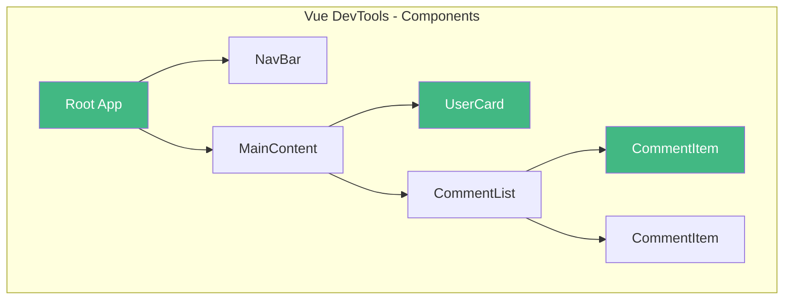

+++
title = "第1章 环境安装与项目创建"
weight = 10
date = "2026-03-25T12:54:00+08:00"
type = "docs"
description = ""
isCJKLanguage = true
draft = false
+++

# 第一章 环境安装与项目创建

> 别急着写代码，先把家伙事儿准备好！磨刀不误砍柴工，工欲善其事必先利其器，老祖宗的话不是白说的。

## 1.1 开发环境准备

### 1.1.1 Node.js 与 npm/yarn/pnpm 介绍

如果把前端开发比作厨房做菜，那 Node.js 就是那口灶，而包管理器就是你手边那个装满调料的架子——没有它，你连盐都找不着，更别提起锅烧油了。所以在这本书的第一节，我们不聊 Vue，先聊聊 Vue 赖以生存的土壤：Node.js。

**Node.js 是什么？** 简单说，Node.js 就是一台用 JavaScript 驱动的服务器（虽然它远不止于此）。它由 Google Chrome 的 V8 引擎驱动，让 JavaScript 这门"网页脚本语言"摇身一变，成了能操作文件、连接数据库、搭建服务器的全能选手。你可以理解为：Node.js 让 JavaScript 从"只会看网页"进化到了"能打工赚钱"。

在 Vue 的开发体系中，Node.js 扮演的是**底层运行环境**的角色。无论是用 Vite 创建项目、用 npm 安装依赖，还是用 vue-tsc 做类型检查，全都得靠 Node.js 在背后默默干活。没有 Node.js，Vue 就是一个无法启动的空壳——就像一台没有引擎的汽车，外表再漂亮也跑不起来。

**npm** 则是 Node.js 自带的**包管理器**，相当于 JavaScript 世界里的"应用商店"。当你执行 `npm install vue` 的时候，npm 就会去它的仓库里找到 Vue 的代码，下载到你的项目中。这个仓库里躺着全球开发者贡献的几百万个包，从 UI 组件到工具库，应有尽有。npm 是随 Node.js 一起安装的，所以装完 Node.js，你就已经有了 npm。

npm 的工作方式可以理解为一个**依赖树**。假设你的项目需要用到一个叫做 `lodash` 的工具库，而 `lodash` 本身又依赖其他库，npm 会自动帮你把整棵依赖树都装好，不用你一棵棵手动去找。配置文件叫做 `package.json`，记录了项目用了哪些依赖、什么版本、怎么运行脚本等信息。

**yarn** 是 Facebook 出品的另一个包管理器，它的核心理念是"更快、更安全"。yarn 最初是为了解决 npm 的速度问题而生的，它会先把所有包下载到本地缓存，下次再装同样的包时直接从缓存复制，速度飞快。yarn 还用了 `yarn.lock` 文件来锁定依赖版本，确保团队里每个人装出来的依赖完全一致——这解决了一个大麻烦：明明代码一样，但"在我电脑上能跑"。

不过 yarn 也有自己的小脾气，比如它的某些命令和 npm 不太一样，新手容易搞混。而且它装出来的依赖目录结构（`node_modules`）有时候会和 npm 不太一致，如果你同时用两个工具管理同一个项目，可能会遇到一些诡异的 bug——当然这是小概率事件。

**pnpm** 是近年来异军突起的包管理器，它的核心创新在于**硬链接和符号链接**的巧妙使用。传统的 npm 和 yarn 会把每个包的每个文件都复制一份到项目的 `node_modules` 里，如果项目多、依赖重复，你就得一遍遍下载同样的东西。pnpm 的做法是：所有包都存在一个全局的 `.pnpm` 目录里，项目中的 `node_modules` 只是指向这些包的**链接**。这样一来，10 个项目都用 Vue，你磁盘上 Vue 的代码只存了一份，而不是 10 份。

pnpm 还默认以**隔离方式**组织依赖，每个包只能"看到"自己的依赖，看不到其他包的依赖——这其实更符合真实环境，也更容易暴露那些隐藏的依赖问题。它的速度也比 npm 快不少，安装大型项目时体验明显。pnpm 的另一个好处是它的命令和 npm 几乎完全兼容，你不需要重新学习新语法。

下面用一个表格来直观对比三者的核心差异：

| 特性 | npm | yarn | pnpm |
|------|-----|------|------|
| 安装速度 | 较慢 | 较快 | 最快 |
| 磁盘占用 | 高（重复复制） | 高（重复复制） | 低（链接复用） |
| 依赖隔离 | 否（扁平化） | 否（扁平化） | 是（严格隔离） |
| lock 文件 | package-lock.json | yarn.lock | pnpm-lock.yaml |
| 命令兼容性 | — | 部分兼容 | 高度兼容 npm |

**写给新手的建议：** 如果你是完全的新手，直接用 npm 就行，它是默认的，没有学习成本。如果你的项目比较大、依赖很多，或者你发现安装速度实在太慢，试试 pnpm，它会让你惊喜。但无论你选哪个，**不要在同一个项目里混用多个包管理器**——这是给自己找麻烦。

### 1.1.2 Node.js 版本管理（nvm / fnm）

Node.js 的版本更新速度堪称"火箭级别"——每几个月就出一个新版本，每个新版本带来性能提升的同时，也可能顺手废弃一些旧语法。想象一下，你维护一个老项目用的是 Node.js 14，但新项目想用最新的 Node.js 22，每次要切换都得卸载重装，那简直是程序员的噩梦。

版本管理工具就是来解决这个问题的。它让你可以在同一台机器上安装多个 Node.js 版本，想用哪个用哪个，一键切换，如同换衣服般轻松惬意。

**nvm（Node Version Manager）** 是最经典的版本管理工具，顾名思义，专门为 Node.js 设计（还有 Windows 版本叫 nvm-windows，或者用 nvm for macOS/Linux）。它的原理其实不复杂：在你的用户目录下创建一个专门的文件夹，用来存放不同版本的 Node.js，然后通过修改环境变量里的路径，让 `node` 命令指向不同的版本。

安装 nvm 之后，基本操作如下：

```bash
# 安装指定版本的 Node.js
nvm install 20

# 安装最新 LTS（长期支持）版本
nvm install --lts

# 切换到某个版本（切换后 node -v 就会显示新的版本号）
nvm use 20

# 切换回系统默认版本
nvm use system

# 查看已安装的所有版本
nvm list
# 输出类似：
#       v18.17.0
#       v20.10.0
#   * v22.13.1 (currently active)
```

`nvm use` 命令的神奇之处在于，它只影响**当前终端窗口**。也就是说，如果你开了两个终端，一个用 Node.js 18，一个用 Node.js 22，完全没问题。各玩各的，互不干扰——但这也意味着每次新开窗口，都得记得先 `nvm use` 一下，否则可能用的是系统默认版本。

**fnm（Fast Node Manager）** 是 nvm 的"升级版"，主打一个"快"字。fnm 用 Rust 编写，号称比 nvm 快 40 倍（虽然实际使用中你可能感觉不出来，毕竟切换版本这种操作一辈子也点不了几次）。fnm 的优势是配置更简单，对 GitHub Actions 和 CI/CD 环境支持更好，`.nvmrc` 文件也能自动识别。

```bash
# 安装 fnm（需要先有 Node.js 或者通过其他方式装上 fnm）
# macOS/Linux 常用 curl 或 brew 安装
curl -fsSL https://fnm.vercel.app/install | bash

# 安装指定版本
fnm install 20

# 切换版本
fnm use 20

# 自动切换（项目根目录有 .nvmrc 文件时）
fnm use

# 查看已安装版本
fnm list
```

`.nvmrc` 文件是一个纯文本文件，里面只写了一行版本号，比如 `20`。把这个文件放在项目根目录，每次你 `cd` 进这个目录时，运行 `nvm use` 或 `fnm use`（如果配置了自动切换插件），就会自动切换到文件里写的版本。这对于团队协作来说特别有用——大家不用手动记要用哪个版本，拉下代码、切到目录，版本就自动对上了。

**Windows 用户**可能会遇到一些坑。nvm-windows 偶尔会有权限问题，或者安装后 `nvm list` 显示乱码。fnm 也有 Windows 版本，但配置稍复杂。对于 Windows 用户，更推荐使用 **nvs（Node Version Switcher）** 或者直接在 **WSL2（Windows Subsystem for Linux）** 里用 Linux 版本的 nvm/fnm，体验会好很多。当然，如果你用的是 [nvm for Windows by coreybutler](https://github.com/coreybutler/nvm-windows)，大部分场景下也够用。

版本号怎么看？Node.js 的版本号遵循语义化版本（SemVer）规则，格式是 `主版本号.次版本号.修订号`，比如 `20.10.0`。主版本号升级表示有**破坏性变更**（老代码可能不兼容），次版本号升级表示新增了功能（向后兼容），修订号升级表示修复了 bug。Vue 3 配合 Node.js，建议使用 **Node.js 18.x 以上**（支持 ES2022 新特性），**20.x LTS** 是目前最推荐的选择，稳定、兼容性好、支持周期长。

### 1.1.3 pnpm 的优势与安装

前面提到了 pnpm，这里展开讲讲它到底有多香，以及怎么把它请到你的电脑上。

先说优势，不然你可能会问："我已经有 npm/yarn 了，为啥还要学新的？"

**第一，节省磁盘空间。** 这是 pnpm 最核心的卖点。传统的包管理器（npm/yarn）会把每个包都复制一份到项目的 `node_modules` 里。如果你有 5 个项目，都用了 Vue，那 Vue 的代码就在你的磁盘上躺了 5 份。pnpm 的做法是，所有包都存在一个**全局 store**（类似仓库）中，项目里只是链接过去。这样，5 个项目共用一份 Vue 的代码，磁盘占用直接降为原来的五分之一。对于依赖多、项目多的团队，这个优势非常明显。

**第二，安装速度快。** pnpm 使用并行的下载方式，不像 npm 那样一个个下载，而且它会复用已经下载过的包，速度提升明显。一个 500MB 的项目，npm 可能要 2 分钟，pnpm 可能只要 30 秒——不是玄学，是硬核实力的差距。

**第三，更安全的依赖管理。** pnpm 默认会把每个包的依赖"隔离"起来。什么意思呢？假设你的项目里装了 A 包，A 包又依赖 B 包。在传统的 npm/yarn 里，A 包不仅能看到自己的依赖 B，还能"偷偷看到"项目里其他的包——哪怕那些包并没有声明要依赖 A。这会导致一个很隐蔽的问题：A 包可能"误以为"某个包已经安装了，就不去声明自己对它的依赖，结果换一个环境就挂了。pnpm 的隔离机制让每个包只能看到自己的直接依赖，不会产生这种"错觉"，从而更接近真实生产环境，也更容易提前发现问题。

**第四，命令和 npm 高度兼容。** 你不需要重新学习一套新的命令，常见的 `pnpm install`、`pnpm add`、`pnpm remove`，和 npm 的 `npm install`、`npm add`、`npm remove` 几乎一样，只是把 `npm` 换成 `pnpm`。这种低学习成本让它很容易上手。

说了这么多优势，来看看怎么安装：

```bash
# 方法一：通过 npm 安装（ irony！）
npm install -g pnpm

# 方法二：通过 curl 安装（Linux/macOS）
curl -fsSL https://get.pnpm.io/install.sh | sh -

# 方法三：通过 Corepack 启用（Node.js 16.10+ 推荐）
corepack enable
corepack prepare pnpm@latest --activate
```

安装完成后，验证一下：

```bash
pnpm --version
# 输出类似：8.15.0
```

如果输出的是版本号，说明装好了。如果报错，说找不到 `pnpm` 命令，可能需要重启终端，或者检查一下 PATH 环境变量有没有包含 npm 的全局 bin 目录。

安装好之后，你就可以在项目里用它了：

```bash
# 初始化一个新项目（相当于 npm init -y）
pnpm init

# 安装依赖（相当于 npm install）
pnpm install

# 添加一个依赖（相当于 npm install vue）
pnpm add vue

# 添加一个开发依赖（相当于 npm install -D typescript）
pnpm add -D typescript

# 删除一个依赖（相当于 npm uninstall vue）
pnpm remove vue
```

如果你之前用的是 npm，把 `npm` 替换成 `pnpm`，把 `npm install` 替换成 `pnpm install`，基本上 90% 的场景都能无缝切换。

**一个需要注意的点：** 少数老旧的构建工具或 CI 脚本可能不支持 pnpm，因为它们硬编码了 `npm install` 这样的命令。不过这类工具越来越少了，而且 pnpm 也提供了兼容模式，可以生成类似 npm 的行为。随着 Vue 官方和 Vite 官方都推荐使用 pnpm，这个生态正在变得越来越友好。

### 1.1.4 包管理器常用命令对比

理论和安装都搞定了，是时候看看实操了。你可能会想："我知道有三个包管理器，但它们命令那么多，我记不住啊！"别慌，这正是本节存在的意义——把三个工具的常用命令做成一张表，让你一目了然，用的时候查一下就行。

下面的表格把最常见的场景都覆盖了：安装依赖、添加依赖、删除依赖、运行脚本。你不需要死记硬背，只需要知道**在哪里能找到它**，用的时候过来瞄一眼，慢慢就记住了。

| 场景 | npm | yarn | pnpm |
|------|-----|------|------|
| 初始化项目 | `npm init -y` | `yarn init -y` | `pnpm init` |
| 安装项目依赖 | `npm install` | `yarn` | `pnpm install` |
| 添加生产依赖 | `npm install vue` | `yarn add vue` | `pnpm add vue` |
| 添加开发依赖 | `npm install -D typescript` | `yarn add -D typescript` | `pnpm add -D typescript` |
| 添加全局依赖 | `npm install -g @vue/cli` | `yarn global add @vue/cli` | `pnpm add -g @vue/cli` |
| 删除依赖 | `npm uninstall vue` | `yarn remove vue` | `pnpm remove vue` |
| 更新依赖 | `npm update vue` | `yarn up vue` | `pnpm update vue` |
| 运行 package.json 中的脚本 | `npm run dev` | `yarn dev` | `pnpm dev` |
| 清除缓存 | `npm cache clean --force` | `yarn cache clean` | `pnpm store prune` |
| 查看已安装依赖 | `npm list` | `yarn list` | `pnpm list` |
| 查看可用版本 | `npm view vue versions` | `yarn info vue versions` | `pnpm view vue versions` |
| 审计安全漏洞 | `npm audit` | `yarn audit` | `pnpm audit` |

从表格里可以看出一些规律：npm 的命令普遍更长（`install` 写全了），yarn 和 pnpm 都做了简化。而且 yarn 和 pnpm 省略了 `run` 这个词，比如 `yarn dev` 就是 `npm run dev` 的简写，用起来更省键盘。

有一点值得特别注意：**删除依赖的命令**。npm 用的是 `uninstall`（卸载），yarn 和 pnpm 用的是 `remove`（移除）。别小看这个细节，如果你记混了，在错误的工具里执行了错误的命令，虽然不会造成灾难性后果，但终端会报错，让你怀疑人生两秒钟。

另一个容易踩的坑是**全局依赖**。npm 和 pnpm 的全局安装命令和其他操作一致（`npm install -g` / `pnpm add -g`），但 yarn 的全局安装用的是 `yarn global add`，和其他操作（`yarn add`）的模式不一致，特别容易搞混。建议用 yarn 的时候，单独记一下这条。

如果你想深入了解某个命令的详细用法，可以加上 `--help` 查看帮助文档，比如：

```bash
npm install --help
# 输出一大堆选项说明，看不懂可以继续往下读这本书
```

最后送你一个**彩蛋命令**：

```bash
# 查看你的包管理器是"谁用的最多"（历史累计安装数）
npm rank
# 或者用 pnpm 的
pnpm list --depth=0
```

玩笑归玩笑，命令用多了自然就记住了。刚开始写代码的时候，面前放一张这样的对照表，完全正常。随着你每天敲几十遍 `pnpm install`，你会发现根本不需要记——肌肉记忆会自动接管。

## 1.2 浏览器与调试工具

### 1.2.1 Chrome / Edge 安装

终于，环境装好了，包管理器也配好了，现在轮到挑一把趁手的"兵器"了。写 Vue 代码，浏览器就是你的主战场——代码跑在浏览器里，bug 也暴露在浏览器里，一款好用的浏览器和调试工具，能让你的开发效率提升不止一个档次。

前端开发者最常用的浏览器是 **Google Chrome**（简称 Chrome）和 **Microsoft Edge**（简称 Edge）。你可能会问："这俩不是差不多吗？"确实，它俩的内核都是 **Chromium**——Edge 在 2020 年放弃了自己的内核，转而使用 Chromium（和 Chrome 同款），所以本质上就是同一个引擎换了层皮肤。

选择哪个呢？

**Chrome** 是前端开发的"事实标准"，生态最完善，各种教程、插件、文档默认都是以 Chrome 为基准的。Chrome 的 DevTools（开发者工具）是所有 Chromium 系浏览器的"老祖宗"，新特性总是先在 Chrome 上出现。

**Edge** 是 Windows 自带的浏览器，优势是**和 Windows 系统深度整合**，对某些 Windows 特有的 API 支持更好，而且它还有个黑科技：**集成了 Vue DevTools 插件**（在 Edge 的插件商店里可以直接装，不用科学上网）。如果你在国内开发，不需要额外配置就能用上 Vue 官方调试工具，这一点比 Chrome 方便很多。

不管选哪个，你基本上不会踩坑。下面给出下载地址：

- Chrome：https://www.google.com/chrome/ （需要科学上网）
- Edge：https://www.microsoft.com/edge （国内可直接访问）

安装过程不需要多讲——下载安装包，一路点"下一步"，和装微信一样简单。

**但是！这里有个大坑要注意！** 安装完浏览器之后，很多人会忘记一件事：**把浏览器更新到最新版本**。Vue 3 支持现代浏览器的最新特性，如果你用的是三五年前的旧版 Chrome，某些新 API 可能不工作，调试的时候会莫名其妙地报一些奇怪的错误。建议打开浏览器，检查一下更新：

- Chrome：右上角三个点 → 帮助 → 关于 Google Chrome
- Edge：右上角三个点 → 帮助和反馈 → 关于 Microsoft Edge

看到" Chrome 已更新到最新版本"或者" Edge 已更新到最新版本"，才算万事俱备。

### 1.2.2 Vue DevTools 插件安装与面板介绍

如果说浏览器是战场，那 Vue DevTools 就是你在战场上的**雷达和瞄准镜**——没有它，你就是在蒙着眼睛写 Vue，全靠猜。有了它，组件树、数据变化、路由状态、Pinia 存储，统统尽收眼底。

Vue DevTools 是 Vue 官方出品的浏览器插件，目前最新版本是 **Vue DevTools v6**，专门为 Vue 3 设计（v5 是给 Vue 2 用的，注意不要装错）。它以 **Chrome / Edge 插件**的形式存在，装上之后，在浏览器的开发者工具里会多出一个 Vue 面板。

**安装步骤（以 Edge 为例，Chrome 类似）：**

1. 打开 Edge，访问 `https://microsoftedge.microsoft.com/addons/detail/vuejs-devtools/`
2. 点击"获取"按钮
3. 浏览器会弹出确认框，点"添加扩展"
4. 等待几秒，插件就装好了

Chrome 用户访问 Chrome 应用商店（需要科学上网）：https://chrome.google.com/webstore

**安装完成后怎么验证？**

随便打开一个用 Vue 3 构建的网页（比如 Vue 官方文档页面），按 F12 打开开发者工具，你会看到顶部标签页多了几个：**Components**（组件）、**Timeline**（时间线，后被移除或整合）、**Pinia**（状态管理）、**Router**（路由）等。点击 **Components**，右侧会显示当前页面渲染的所有 Vue 组件。

如果插件装好了但面板是空的（显示"No Vue 3 app detected"），说明这个页面可能不是用 Vue 3 写的，或者页面用了生产环境构建（production build），Vue DevTools 默认不显示生产环境的应用——这也是合理的，生产环境不需要调试。

**Vue DevTools 的几个核心面板：**

**Components（组件）面板**是最常用的。在这个面板里，你可以看到整个应用的组件树——就像文件夹目录一样，一层套一层，根组件在最上面，子组件在下面缩进。点击任意一个组件，右侧会显示它的 **props**（父组件传过来的数据）、**data**（组件内部的状态）、**computed**（计算属性）等。这个面板最大的价值是：**你可以在运行时看到数据是什么**，而不是在代码里 console.log 半天。

举个例子，你写了一个组件 `<UserProfile :name="username" />`，但页面上显示的名字不对，这时候打开 Vue DevTools，点击这个组件，看一下 `props.name` 的值是什么——如果值是对的，说明问题在模板渲染里；如果值本身就不对，说明问题在上游的数据提供方。一目了然，省去大量排查时间。

**Pinia 面板**（Vue 3 + Pinia 用户专属）是状态管理的专属调试工具。如果你用了 Pinia 做全局状态管理，这个面板会显示所有 store，以及每个 store 里的 state（状态数据）。你可以手动修改 state 的值，查看变化如何传播到各个组件。这在调试"一个数据变了，但不知道是哪个组件改的"这种问题时特别有用。

**Router 面板**显示当前的路由信息，包括路由路径、匹配的路由规则、参数等。如果你用 Vue Router 做了复杂的路由嵌套，这个面板能帮你快速看清"我当前在哪个路由"、"有哪些路由规则匹配上了"。

下面用一个简单的示意图展示 Components 面板大概长什么样：



图中显示的是组件树的结构。点击 `UserCard`，右侧会显示它的 props（可能是 `username`、`avatar`、`bio` 等）、data（组件内部的状态）、以及它用了哪些子组件。

**一个实用小技巧：** 在 Components 面板里，最顶部有一个搜索框。你可以输入组件名或 prop 名，快速定位到你想要的那个组件。比如你的页面有 100 个组件，手动找要找到猴年马月，搜索框一输入 "UserCard"，瞬间定位。

Vue DevTools 是 Vue 开发者的"瑞士军刀"，功能远不止上面说的这些。书的后续章节会结合具体场景继续介绍它的用法。现在，你需要做的就是：把它装好，熟悉它在哪里，以后写 Vue 代码遇到问题，先打开它看看数据对不对——这应该成为你的第一反应。

## 1.3 VS Code 安装与插件配置

### 1.3.1 Volar（Vue 官方插件）

写 Vue 代码，用什么编辑器？市面上的选择有很多：WebStorm、Sublime Text、Vim、Neovim……但如果让我只推荐一个，那毫无疑问是 **VS Code**（Visual Studio Code）。

VS Code 是微软出品的免费代码编辑器，基于 Electron（就是用 Chromium 加 Node.js 做的），所以本质上也是个网页应用。但别被这个"网页应用"骗了——它的功能之强大、插件之丰富，足以应对从 JavaScript 到 Rust、从 Python 到 Go 的各种开发需求。前端开发更是它的主场，Vue 官方推荐的编辑器就是 VS Code。

下载地址：https://code.visualstudio.com/

安装过程同样简单，不赘述。装完之后，让我们直接进入最关键的环节：**插件安装**。

**Volar** 是 Vue 3 官方推荐的 VS Code 插件，前身叫 **Vetur**（给 Vue 2 用的）。从 Vue 3 开始，社区决定重新做一个更现代的插件，于是 Volar 诞生了。Volar 提供了 Vue 单文件组件（`.vue` 文件）的完整支持，包括：

- **语法高亮**：`.vue` 文件里有 `<template>`、`<script>`、`<style>` 三个部分，每部分用不同的语法高亮，Volar 都能正确识别。
- **智能提示（IntelliSense）**：输入代码时给出自动补全，比如你写了 `ref(`，Volar 会提示你 `ref` 的类型签名和用法。
- **类型检查**：结合 TypeScript，对代码进行静态检查，提前发现类型错误。
- **模板验证**：检查模板中的 HTML 语法错误、错误的指令用法等。

安装方法：打开 VS Code，左侧有个图标长得像俄罗斯方块的 **Extensions（扩展）** 按钮（快捷键 `Ctrl+Shift+X`），在搜索框里输入 **Volar**，找到 "Vue - Official" 或者 "Volar"，点击 Install 即可。

安装完成后，**一定要记得禁用 Vetur**。如果你之前用过 Vue 2，电脑里可能装着 Vetur，Volar 和 Vetur 同时启用会产生冲突。禁用方法：在扩展里找到 Vetur，点一下 "Disable"，或者在扩展设置里把 Vetur 的启用状态关掉。

验证是否装好：随便找一个 `.vue` 文件打开，如果右下角状态栏显示 Vue 的图标，并且语法高亮正常，说明就绪。

### 1.3.2 TypeScript Vue Plugin

如果说 Volar 是 Vue 的"总管家"，那 **TypeScript Vue Plugin** 就是一个"特邀顾问"。它的作用是让 TypeScript 语言服务能够正确识别 `.vue` 文件的模块引用。

在 Vue 3 + TypeScript 的项目里，你可能会写这样的 import 语句：

```typescript
import MyComponent from './MyComponent.vue'
// 或者
import type { Props } from './MyComponent.vue'
```

TypeScript 本身不认识 `.vue` 文件，不知道这个模块是什么类型。TypeScript Vue Plugin 的作用就是告诉 TypeScript："`.vue` 文件的默认导出是一个组件，具名导出是一个类型。"装上这个插件之后，IDE 的智能提示和类型检查就能正常工作了。

安装方法：在 VS Code 扩展里搜索 **TypeScript Vue Plugin**（作者是 Vue 官方团队），点击 Install。

注意：TypeScript Vue Plugin 需要配合 Volar 使用，它是 Volar 的补充，不是替代品。两者的关系可以理解为：Volar 是主插件，负责整体体验；TypeScript Vue Plugin 是辅助插件，负责补齐 TypeScript 这块的能力。

### 1.3.3 ESLint 与 Prettier 插件

代码写多了之后，你会发现一个扎心的事实：**代码风格不统一的项目，维护起来是噩梦**。张三喜欢句末加不加分号，李四讨厌分号；王五喜欢用单引号，赵六觉得双引号才专业。每个人的口味不一样，如果不做约束，整个项目的代码风格会像大杂烩一样乱七八糟。

**ESLint** 和 **Prettier** 就是来解决这个问题的两把利刃。

**Prettier** 是一个"代码格式化工具"，它的作用很简单：把你的代码按照一套预定义的规则重新排版。分号加还是不加？引号用单还是双？一行代码最长多少字符？Prettier 说了算。你不需要手动调整格式——保存文件的时候自动帮你弄好，格式问题从此消失。

**ESLint** 是一个"代码质量检查工具"，它的职责是发现代码中的潜在问题。比如你定义了一个变量但从来不用，ESLint 会报一个 warning；你在异步函数里用了 `await` 但没有包裹 `try-catch`，ESLint 可能会报一个 error。ESLint 不仅检查格式，更重要的是检查**代码逻辑层面的问题**——用词不当的变量名、可能导致 bug 的写法、过期 API 的使用等。

两者配合使用：Prettier 管"格式"（缩进、空格、换行），ESLint 管"质量"（语法错误、潜在 bug）。在 Vue 3 项目里，它们通常配合 **@vue/eslint-config-typescript** 或 **@vue/eslint-config-prettier** 一起使用，后者会把 ESLint 里和 Prettier 冲突的规则禁用掉，让两者各司其职。

在 VS Code 里，你需要装两个插件：

1. **ESLint**（作者：Microsoft）：让 VS Code 在编辑器里直接显示 ESLint 的报错和警告
2. **Prettier - Code formatter**（作者：Prettier 团队）：让 VS Code 使用 Prettier 来格式化代码

安装好插件之后，建议在 VS Code 的 `settings.json` 里做如下配置，让编辑器在**保存时自动格式化**：

```json
{
  // 保存文件时自动格式化
  "editor.formatOnSave": true,

  // 默认格式化器选择 Prettier
  "editor.defaultFormatter": "esbenp.prettier-vscode",

  // 针对 Vue 文件，也用 Prettier 格式化
  "[vue]": {
    "editor.defaultFormatter": "esbenp.prettier-vscode"
  },

  // 针对 TypeScript 文件，也用 Prettier 格式化
  "[typescript]": {
    "editor.defaultFormatter": "esbenp.prettier-vscode"
  },

  // 针对 JavaScript 文件，也用 Prettier 格式化
  "[javascript]": {
    "editor.defaultFormatter": "esbenp.prettier-vscode"
  },

  // Prettier 的个人偏好设置（可选，如果你有特殊口味的话）
  "prettier.singleQuote": true,    // 使用单引号而不是双引号
  "prettier.semi": false,          // 句末不加分号
  "prettier.tabWidth": 2           // 一个 Tab 等于两个空格
}
```

这段配置做了几件事：保存文件时自动格式化、用 Prettier 作为默认格式化器、Vue/TS/JS 文件都走 Prettier 的格式规则。`prettier.singleQuote: true` 表示"优先用单引号"，`prettier.semi: false` 表示"不强制句末分号"——这些都可以根据你的口味调整。

### 1.3.4 VS Code 常用快捷键

最后送给你一份"武功秘籍"，熟练掌握这些快捷键，可以让编码速度提升 30%。不是玄学，是真的——减少手离开键盘去摸鼠标的时间，专注力更不容易被打断，效率自然就上去了。

以下是 Windows / Linux 版本的快捷键（macOS 把 `Ctrl` 换成 `Cmd` 即可）：

| 快捷键 | 功能 |
|--------|------|
| `Ctrl + Shift + P` | 命令面板（输入命令名来执行操作，几乎可以做到所有事情） |
| `Ctrl + P` | 快速打开文件（输入文件名，立刻跳过去） |
| `Ctrl + Shift + N` | 新建窗口 |
| `Ctrl + N` | 新建文件 |
| `Ctrl + W` | 关闭当前文件 |
| `Ctrl + Tab` | 切换到上一个打开的文件 |
| `Ctrl + B` | 显示/隐藏左侧资源管理器面板 |
| `Ctrl + J` | 显示/隐藏底部终端面板 |
| `Ctrl + \` | 分屏（把当前文件复制到右侧新窗口） |
| `Ctrl + Shift + E` | 打开资源管理器 |
| `Ctrl + Shift + F` | 全局搜索（在整个项目里搜索某个字符串） |
| `Ctrl + H` | 替换（当前文件里批量替换字符串） |
| `Ctrl + D` | 选中当前单词，再次按 `Ctrl+D` 选中下一个相同的单词（多光标编辑神器） |
| `Alt + 单击` | 在任意位置新增一个光标 |
| `Ctrl + Shift + L` | 选中所有相同的单词（批量修改的神器） |
| `Ctrl + /` | 注释/取消注释当前行或选中的多行 |
| `Shift + Alt + F` | 格式化当前文件（需要装了 Prettier 或其他格式化工具） |
| `F2` | 重命名符号（修改变量名，自动更新所有引用） |
| `Ctrl + .` | 快速修复（修复 ESLint 报错或 TypeScript 类型错误） |
| `Ctrl + K Ctrl + S` | 查看/修改快捷键绑定 |

`Ctrl + P`（快速打开文件）是使用频率最高的快捷键之一。在一个 Vue 项目里，可能有几十上百个文件，传统的方式是在左侧资源管理器里一级级点进去。有了 `Ctrl + P`，输入文件名的一部分，立刻跳过去——比如你想打开 `UserProfile.vue`，输入 `up` 就能匹配到，快得飞起。

`Ctrl + D`（选择下一个相同的单词）是另一个"用了就回不去"的神器。比如你的代码里有 5 个地方写了 `console.log`，你想把它们都改成 `console.error`，只需要：把光标放在 `console.log` 上，按 `Ctrl + D` 第一次选中这个单词，再按第二次 `Ctrl + D`，第二个 `console.log` 也被选中了（同时有两个光标），以此类推选中所有 5 个，然后直接输入 `console.error`——所有位置同时改了。这种"多光标编辑"是 VS Code 最强大的功能之一，强烈建议花 10 分钟专门练习一下。

## 1.4 创建第一个 Vue 3 项目

### 1.4.1 Vite 方式创建（推荐）

好了，工具都准备好了，是时候真正开始 Vue 3 的旅程了。在这一节里，我们会用 Vite 创建一个真正的 Vue 3 项目。Vite 是 Vue 官方出品的**下一代前端构建工具**，也是目前创建 Vue 3 项目的**推荐方式**（没有之一）。

先说说 Vite 是什么。传统的前端构建工具（如 webpack）需要先把整个项目打包一遍，才能启动开发服务器。这意味着：项目越大，启动时间越长——一个大型项目可能需要等上一两分钟才能开始写代码。Vite 另辟蹊径，它利用了浏览器原生支持的 **ES Modules**（ESM）技术，只在浏览器请求某个模块的时候，才实时编译那个模块。想象一下：你要去超市买 100 样东西，传统方式是先把 100 样东西全部打包好放门口（等很久），然后再给你；Vite 的方式是，你点哪个给你哪个（秒响应）。这种"懒编译"的策略让 Vite 的启动时间几乎为**零秒**，不管项目有多大。

**创建项目的命令：**

```bash
# 使用 pnpm（推荐）
pnpm create vue@latest

# 或者使用 npm
npm create vue@latest

# 或者使用 yarn
yarn create vue

# 或者使用 bun（新兴的 JavaScript 运行时/包管理器）
bun create vue
```

执行这个命令之后，终端会问你几个问题：

```text
Vue.js - The Progressive JavaScript Framework

✔ Project name: ... <输入项目名称，比如 my-vue-app>
✔ Add TypeScript? ... <是否添加 TypeScript，建议 Yes>
✔ Add JSX support? ... <是否支持 JSX，一般 No>
✔ Add Vue Router? ... <是否添加路由，看需求>
✔ Add Pinia for state management? ... <是否添加 Pinia 状态管理，看需求>
✔ Add Vitest for Unit Testing? ... <是否添加单元测试，看需求>
✔ Add ESLint for linting? ... <是否添加 ESLint，建议 Yes>
✔ Add Prettier for code formatting? ... <是否添加 Prettier，建议 Yes>
```

问题回答完之后，Vite 会自动创建项目目录，下载依赖，然后告诉你"好了，可以开始了"。

不过，还有一个更简单的方式，不需要交互式问答，直接一行命令搞定所有选项：

```bash
# 创建一个最简单的 Vue 3 项目（全部用默认选项）
pnpm create vue@latest my-vue-app --default
```

如果你想要一个极简版本（不需要路由、不需要 Pinia、不需要 TypeScript），可以用 **Vite 官方提供的模板**（不是 Vue 官方提供的），不包含那些可选依赖：

```bash
# 这个方式创建的是"裸"的 Vue 3 项目，只有 Vue 核心
pnpm create vite@latest my-vue-app --template vue

# 如果你想要 TypeScript 版本
pnpm create vite@latest my-vue-app --template vue-ts
```

**项目创建好了，怎么运行？**

```bash
# 进入项目目录
cd my-vue-app

# 安装依赖（用你喜欢的包管理器）
pnpm install

# 启动开发服务器
pnpm dev
```

执行 `pnpm dev` 之后，你会看到类似这样的输出：

```text
  VITE v5.x.x  ready in 200 ms

  ➜  Local:   http://localhost:5173/
  ➜  Network: use --host to expose
  ➜  press h + m to show shortcuts
```

这就是你的开发服务器地址。打开浏览器访问 `http://localhost:5173/`，你应该能看到一个运行中的 Vue 3 应用——默认是 Vue 官方的欢迎页面，上面写着 "You have successfully created a Vue project" 之类的字样。

**`pnpm dev` 的原理是什么？** 简单说，它做了三件事：

1. 启动一个**本地 HTTP 服务器**（基于 Vite 自己写的服务器，不是 Express 或 Koa）
2. 注册一个**文件监听器**，监视你的代码文件变化
3. 当你修改了某个文件，Vite 立刻重新编译这个文件，并通过 **HMR（热模块替换）** 技术把这个变化"推"给浏览器——页面不用刷新，数据状态不会丢失，只是局部更新

这种开发体验是革命性的。传统 webpack 模式下，改一个 CSS 可能整个页面要刷新一下，表单里的输入内容全丢了；Vite 的 HMR 只更新变化的模块，其他一切保持原样——写代码的时候那种"丝滑感"，用过的都说好。

### 1.4.2 Vue CLI 方式创建（了解）

虽然 Vite 是现在的主流，但作为一个"有学问"的 Vue 开发者，你需要知道还有另一条路：**Vue CLI**。

Vue CLI 是 Vue 官方早期的**脚手架工具**，底层基于 webpack。它的优势是**配置灵活、功能全面**，适合超大型项目；但缺点是配置复杂、学习成本高，而且 webpack 的编译速度在大项目里实在不敢恭维。

Vue CLI 在 2023 年已经正式进入"维护模式"，不再推荐新项目使用它。所以这里只简单介绍一下命令格式，作为了解即可：

```bash
# 安装 Vue CLI（全局安装）
npm install -g @vue/cli

# 创建项目（会启动图形界面）
vue create my-vue-app

# 创建项目（命令行模式）
vue create my-vue-app --default

# 启动 Vue UI（图形化界面管理项目）
vue ui
```

`vue ui` 命令会启动一个浏览器里的图形界面，可以可视化管理依赖、安装插件、配置项目等。这个界面在 Vue CLI 时代很流行，但现在 Vite 生态里类似的功能大多由插件自己提供（比如 `pnpm create vue` 本身就是图形化的），所以 Vue CLI 的这个优势也不明显了。

**为什么不推荐用 Vue CLI 了？** 核心原因还是 webpack 的固有问题：慢。Vite 用 ESM 的方式绕过了 webpack 的打包瓶颈，而 Vue CLI 一直被困在 webpack 的框架里。Vue 官方已经在多个场合明确表示：新建项目**只推荐 Vite**。所以，我们这本书里也只讲 Vite，Vue CLI 作为历史知识了解即可。

### 1.4.3 在线 PlayGround（体验）

如果你只是**想体验一下 Vue 3**，不想在本地安装任何东西，Vue 官方给你准备了一个神器：**PlayGround**（在线编辑器的 Vue 版本）。

访问地址：https://play.vuejs.org/

这个在线编辑器打开后，左边是代码编辑器（基于 Monaco，就是 VS Code 同款编辑器内核），右边是实时预览。你可以直接在里面写 `.vue` 文件，修改后右边立刻显示渲染结果。

PlayGround 有几个实用的功能：

1. **即时预览**：写什么，马上看到结果，适合做小实验
2. **分享代码**：点击右上角的 "Share" 按钮，会生成一个唯一的链接，可以发给朋友或发到群里，让别人直接看到你的代码
3. **切换版本**：可以在不同的 Vue 版本之间切换，测试新版本的特性
4. **导入依赖**：通过 `import` 语句可以引入 CDN 上的库

```typescript
// 这是 PlayGround 里可以做的事情的一个小例子
import { ref, computed } from 'vue'

// 一个简单的计数器
const count = ref(0)
const doubled = computed(() => count.value * 2)

function increment() {
  count.value++
  console.log(count.value) // 打印：1, 2, 3, ...
}
```

PlayGround 特别适合这些场景：给同事演示某个 Vue 特性、写面试题的时候现场出示例、快速验证某个 bug 是否是 Vue 的已知问题。你甚至可以用它来写这本书的练习题——不用配置任何环境，打开网页就能开干。

### 1.4.4 项目目录结构解析

Vue 3 项目创建好了，现在让我们看看项目里都有什么文件。打开你创建的 Vue 项目（用 `pnpm create vue@latest` 创建的那个），你应该会看到以下目录结构：

```text
my-vue-app/
├── public/               # 公共静态资源目录
│   └── favicon.ico      # 网站图标
├── src/                  # 源代码目录（你的主要工作区）
│   ├── assets/          # 静态资源（会被 webpack 处理）
│   │   └── logo.svg     # Vue 的 Logo 图片
│   ├── components/      # 公共组件目录
│   │   └── TheWelcome.vue
│   │   └── WelcomeItem.vue
│   ├── router/          # 路由配置目录
│   │   └── index.ts     # 路由规则定义
│   ├── stores/          # Pinia 状态管理目录
│   │   └── counter.ts   # 示例 store
│   ├── views/           # 页面级组件目录
│   │   ├── HomeView.vue
│   │   └── AboutView.vue
│   ├── App.vue          # 根组件（整个应用的顶层组件）
│   └── main.ts          # 应用入口文件（相当于 main 函数）
├── index.html           # 入口 HTML 文件
├── package.json         # 项目依赖配置
├── tsconfig.json        # TypeScript 配置文件
├── vite.config.ts       # Vite 配置文件
└── README.md            # 项目说明文件
```

下面逐一解释这些关键文件和目录的作用：

**`index.html`** —— 这是整个 Vue 应用的"入口 HTML"。注意，它不在 `src` 里，因为它是直接放在服务器根目录的静态文件。打开这个文件，你会发现里面只有一个 `<div id="app"></div>`，以及一行 `<script type="module" src="/src/main.ts"></script>` —— 告诉浏览器从这里加载 JavaScript 模块，Vue 应用就启动在这个 `#app` 容器里。

**`src/main.ts`** —— 这是 Vue 应用的入口文件（相当于 Java 里的 `main` 方法，或者 C 里的 `main` 函数）。它的职责是：创建 Vue 应用实例、挂载到 HTML 容器上、注册全局插件（如 Pinia、Router）。标准的 `main.ts` 大概长这样：

```typescript
// 引入 createApp 函数 —— 这是创建 Vue 应用实例的工厂函数
import { createApp } from 'vue'

// 引入根组件 App.vue
import App from './App.vue'

// 引入路由配置
import router from './router'

// 引入 Pinia 状态管理
import { createPinia } from 'pinia'

// 创建应用实例
const app = createApp(App)

// 创建 Pinia 实例（状态管理容器）
const pinia = createPinia()

// 注册 Pinia
app.use(pinia)

// 注册路由
app.use(router)

// 挂载到 #app 这个 DOM 元素上
app.mount('#app')
```

这段代码的逻辑很清晰：创建实例 → 注册插件 → 挂载到页面。一开始你看可能觉得有点晕，但等学完组件和插件的知识，你会觉得这是世界上最自然不过的写法。

**`src/App.vue`** —— 根组件。这个文件是你整个应用的"最顶层组件"，所有其他组件都嵌套在它的里面。路由控制的页面组件会被渲染在 `<router-view />` 这个占位标签里。

**`src/router/index.ts`** —— 路由配置文件。Vue Router 是 Vue 官方提供的路由管理器，负责把 URL 的变化映射到不同的组件上。比如 `/` 对应 `HomeView.vue`，`/about` 对应 `AboutView.vue`。路由配置文件就是声明"什么 URL 显示什么组件"的地方。

**`src/stores/`** —— Pinia 状态管理目录。Pinia 是 Vue 3 官方推荐的状态管理库（取代了 Vue 2 时代的 Vuex）。简单说，状态管理就是"管理多个组件之间共享的数据"——比如用户的登录信息、全局的 Toast 通知、购物车里的商品列表，这些数据放在 store 里，所有组件都能访问。

**`vite.config.ts`** —— Vite 配置文件。这个文件定义了 Vite 的构建行为，比如路径别名配置、代理设置、构建输出目录等。你可以暂时不用管它，默认配置已经够用。

**`package.json`** —— 项目的元数据文件，记录了项目名称、版本、依赖列表、可运行脚本等。里面的 `scripts` 字段定义了常用命令：

```json
{
  "scripts": {
    "dev": "vite",                    // 启动开发服务器
    "build": "vue-tsc && vite build", // 生产构建（先做类型检查，再打包）
    "preview": "vite preview"         // 预览生产构建结果
  }
}
```

### 1.4.5 npm 镜像配置（国内淘宝源）

如果你在国内，网络访问国外服务器可能比较慢，npm 从官方源下载包的速度可能会让你崩溃——下载一个 Vue 加上一堆依赖，可能要等上十几分钟，挂代理都不一定好使。

解决方案是使用**国内镜像**。最常用的是 **淘宝 npm 镜像**（cnpm），它的同步频率很高，基本和官方源保持同步，但服务器在国内，速度快很多。

配置方法很简单，执行一行命令即可：

```bash
# 设置淘宝镜像
npm config set registry https://registry.npmmirror.com

# 验证设置是否成功
npm config get registry
# 输出：https://registry.npmmirror.com
```

如果你用的是 pnpm，也可以设置镜像：

```bash
# 设置 pnpm 的 registry
pnpm config set registry https://registry.npmmirror.com

# 设置 pnpm 的 scoped registry（部分包需要）
pnpm config set @scope:registry https://registry.npmmirror.com
```

设置好之后，`pnpm install` 的时候就会从淘宝镜像下载，速度会快很多。

不过要注意：少数包（特别是公司内部私有包）可能不在镜像上，这时候你需要单独配置。另外，如果哪天镜像挂了或者你想切回官方源，只需要把 registry 改回 `https://registry.npmjs.org` 即可：

```bash
# 切回官方源
npm config set registry https://registry.npmjs.org
```

## 1.5 Git 基础配置

### 1.5.1 Git 安装与 SSH 密钥

代码写完了，怎么保存？怎么协作？总不能把代码拷到 U 盘里传来传去吧？这时候 **Git** 就登场了。

**Git 是什么？** Git 是一个**分布式版本控制系统**。你可以把它理解为一个超级强大的"时光机"——它会记录你代码的每一次修改，你可以在任何时间点"穿越"回过去，看看当时的代码长什么样；也可以把代码"分支"出去，做各种实验性的修改，如果实验失败，直接丢弃这个分支就好了，不会影响主线。Git 让团队协作变得井井有条：每个人在各自的分支上干活，最后把分支合并（merge）到一起。

Git 的诞生故事也很有意思——它是 Linux 的创始人 **Linus Torvalds** 在 2005 年写出来的。当时 Linux 内核开发用的是 BitKeeper（一个商业版本控制系统），结果 BitKeeper 的公司收回了免费使用权，Linus 一怒之下，花了两周时间写出了 Git。十几年后，Git 成了全世界最流行的版本控制系统，没有之一。

**安装 Git：**

- Windows：https://git-scm.com/download/win，下载安装包一路下一步即可（推荐用这个）
- macOS：通常已经预装了 Git，如果没有，执行 `brew install git`
- Linux：用包管理器安装，比如 `apt install git`（Debian/Ubuntu）或 `yum install git`（CentOS/RHEL）

安装完成后，在终端里验证：

```bash
git --version
# 输出类似：git version 2.39.x (Apple Git-xxx)
```

**SSH 密钥是什么？为什么需要它？**

当你把代码上传到 GitHub（全球最大的代码托管平台，类似"程序员的微信朋友圈"）时，GitHub 需要确认"你到底是谁"。SSH 密钥就是一种**身份验证机制**——它让你和 GitHub 之间建立一条加密的"私密通道"，无需每次都输入用户名和密码。

SSH 密钥的工作原理是**非对称加密**：你有一对密钥，一把叫**私钥**（private key），留在你自己的电脑上，绝不告诉任何人；另一把叫**公钥**（public key），你可以放心地告诉 GitHub："这是我的公钥，请用这把锁来验证我。"每次你和 GitHub 通信时，GitHub 用你的公钥加密一段挑战信息发给你，你用私钥解密并证明"我确实有私钥"，验证就通过了。整个过程你的密码从来没有在网络上传输，安全性大大提高。

**生成 SSH 密钥：**

```bash
# 使用 Ed25519 算法（现代推荐方式，安全又快速）
ssh-keygen -t ed25519 -C "你的邮箱地址，比如 xiaoming@example.com"

# 如果你的系统不支持 Ed25519（较老的系统），用 RSA
ssh-keygen -t rsa -b 4096 -C "你的邮箱地址"
```

执行这个命令后，终端会问几个问题：

```text
Generating public/private ed25519 key pair.
Enter file in which to save the key (/c/Users/你的用户名/.ssh/id_ed25519): 
# （直接回车，用默认路径）

Enter passphrase (empty for no passphrase):
# （输入密码，比如 123456，输的时候屏幕不显示字符是正常的）

Enter same passphrase again:
# （再输一遍确认）
```

如果一切顺利，你会看到类似这样的输出：

```text
Your identification has been saved in /c/Users/你的用户名/.ssh/id_ed25519.
Your public key has been saved in /c/Users/你的用户名/.ssh/id_ed25519.pub.
The key fingerprint is:
SHA256:xxxxxxxxxxxxxxxxxxxxxxxxxxxxxxxxxxxxxxxxxxx
The key's randomart image is:
+---[ED25519 256]----+
|     . ..+=*#@      |
|    o . =@*&%^      |
|     ...+$$#@       |
+---[ED25519 256]-----+
```

恭喜你，密钥生成成功了！

现在，你需要把**公钥**告诉 GitHub：

```bash
# 复制公钥内容（Windows 下用 type，macOS/Linux 用 cat）
type C:\Users\你的用户名\.ssh\id_ed25519.pub
# 或者直接用 clip 命令复制到剪贴板
clip < C:\Users\你的用户名\.ssh\id_ed25519.pub
```

复制完公钥内容后：

1. 打开 GitHub 网站，登录账号
2. 点击右上角头像 → **Settings**（设置）
3. 左侧菜单找到 **SSH and GPG keys**
4. 点击 **New SSH key**
5. Title 随便起个名字（比如 "我的工作电脑"）
6. Key 类型保持默认，Key 文本框里粘贴刚才复制的公钥内容
7. 点击 **Add SSH key**

**验证 SSH 连接是否配置成功：**

```bash
ssh -T git@github.com

# 第一次连接可能会看到这些提示（输入 yes 继续）
# The authenticity of host 'github.com (140.82.x.x)' can't be established.
# ECDSA key fingerprint is SHA256:xxxxx.
# Are you sure you want to continue connecting (yes/no)?

# 输入 yes 后，如果看到下面的文字，说明成功了！
# Hi 你的用户名! You've successfully authenticated, but GitHub does not provide shell access.
```

看到 "You've successfully authenticated"，说明 SSH 密钥配置成功，你的电脑已经和 GitHub 建立起了信任关系，以后用 Git 推送代码就不用输入密码了。

### 1.5.2 .gitignore 配置

现在，你的电脑可以正常使用 Git 和 GitHub 了。但在把代码推送到 GitHub 之前，有一个重要的事情要做：**`.gitignore` 文件**。

**`.gitignore` 是什么？** 顾名思义，就是"让 Git 忽略"的文件。在这个文件里，你可以列出那些**不需要被 Git 跟踪的文件**——比如编译出来的 JavaScript 文件、依赖目录 `node_modules`、本地配置文件、敏感信息文件等。

为什么需要忽略 `node_modules`？因为 `node_modules` 里可能有几万甚至几十万个小文件，如果把它们也提交到 Git 仓库，仓库体积会急剧膨胀，而且每次拉取代码都要下载这些文件，体验极差。这些依赖完全可以通过 `package.json` 记录下来，任何人拿到代码后执行 `pnpm install` 就能自动安装，所以不需要提交到仓库里。

`.gitignore` 的写法很简单：每行写一个规则，支持通配符。

```gitignore
# 依赖目录
node_modules/

# 构建产物（Vite 打包输出的文件）
dist/

# 本地环境配置文件（可能包含敏感信息）
.env
.env.local
.env.*.local

# 日志文件
npm-debug.log*
yarn-debug.log*
yarn-error.log*
pnpm-debug.log*

# IDE 配置文件（不需要共享给别人的）
.vscode/
.idea/
*.suo
*.ntvs*
*.njsproj
*.sln
*.sw?

# 操作系统文件
.DS_Store
Thumbs.db

# 测试覆盖率报告
coverage/

# TypeScript 编译输出（如果你没用 Vite 的内置编译）
*.tsbuildinfo
```

**常见的忽略规则：**

- `node_modules/` —— 忽略这个目录（`/` 表示目录）
- `*.log` —— 忽略所有 `.log` 结尾的文件
- `.env` —— 忽略这个文件（不带 `/` 的是文件）
- `dist/` —— 忽略构建产物目录

**注意：`.gitignore` 要在 `git add` 之前才生效。** 如果你不小心把 `node_modules` 已经 add 了，再写 `.gitignore` 是没用的，需要先把它从 Git 的跟踪列表里移除：

```bash
# 从 Git 跟踪列表中移除（但保留本地文件）
git rm -r --cached node_modules

# 然后提交这个更改
git commit -m "从跟踪列表移除 node_modules"
```

Vite 创建的 Vue 项目已经自带了一个 `.gitignore` 文件，包含了常用的忽略规则，基本上不需要你自己写。如果你是手动创建的项目，记得加上这个文件——这是个好习惯，能让你的仓库保持干净。

---

## 本章小结

本章我们完成了 Vue 3 开发环境的全面搭建。这就像你要做一道菜，先把灶台、锅、铲子、调味料都备齐了，才能开始炒。

我们学习了：

- **Node.js** 和 **包管理器**（npm/yarn/pnpm）的关系，它们是 Vue 赖以生存的土壤。
- **pnpm** 以其速度快、占用空间小、依赖隔离安全的优势，成为 Vue 官方推荐的包管理器。
- **版本管理工具**（nvm/fnm）让你在同一台机器上管理多个 Node.js 版本，互不干扰。
- **Chrome / Edge** 浏览器和 **Vue DevTools** 插件是调试 Vue 应用的不二之选。
- **VS Code** + **Volar** + **ESLint** + **Prettier** 构成了一套完整的 Vue 3 开发环境，缺一不可。
- **Vite** 是创建 Vue 3 项目的推荐方式，它的 HMR（热模块替换）机制让开发体验丝滑无比。
- **Git** 和 **GitHub** 是代码版本管理和团队协作的基础，SSH 密钥让你安全又便捷地与远程仓库交互。
- **`.gitignore`** 让你精准控制哪些文件需要被 Git 跟踪，保持仓库干净。

现在，开发环境已经万事俱备。下一章，我们将正式进入 Vue 3 的世界——从认识 Vue 3 本身开始，看看这个框架到底解决了什么问题，它的独门绝技是什么，以及它和 Vue 2 相比有哪些脱胎换骨的变化。准备好你的键盘，我们出发！

