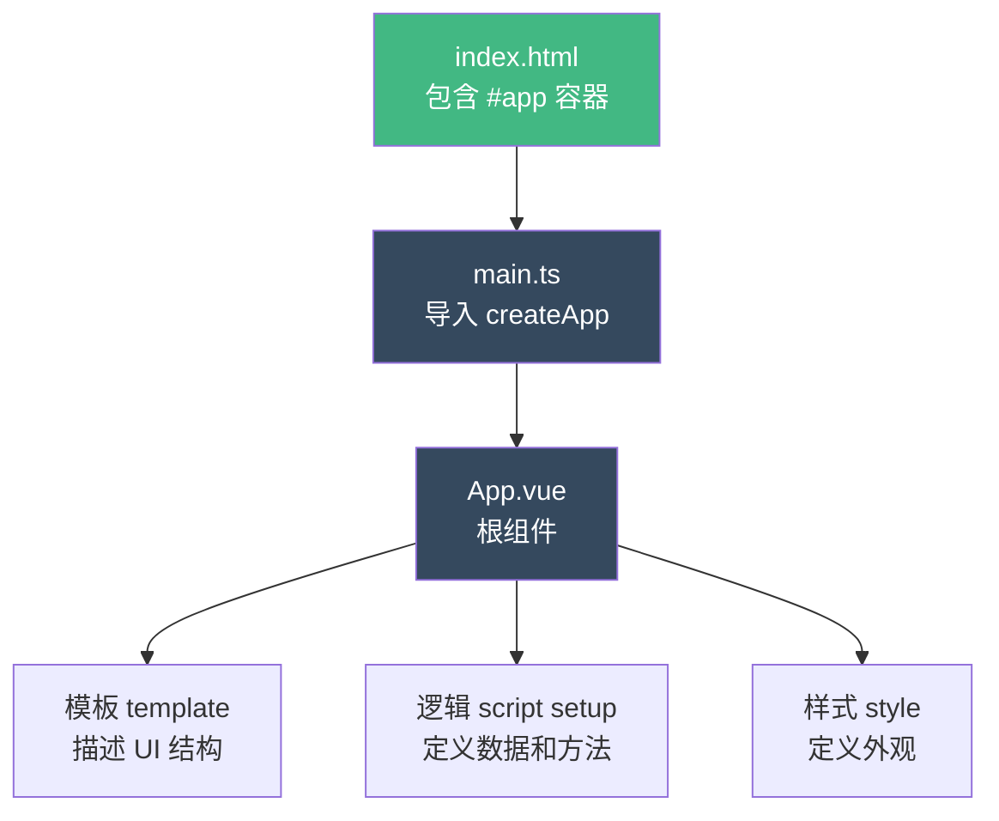

+++
title = "第2章 初识 Vue 3"
weight = 20
date = "2026-03-25T12:54:00+08:00"
type = "docs"
description = ""
isCJKLanguage = true
draft = false
+++

# 第二章 初识 Vue 3

> 学完环境配置，终于可以和 Vue 3 正式见面了！在开始写代码之前，我们先来认识一下 Vue 3 这个"新朋友"——它是谁？它从哪里来？它的独门绝技是什么？读完这一章，你会对 Vue 3 有一个整体的认知，不再是"只会跟着教程敲代码"的小白，而是真正理解 Vue 3 设计哲学的开发者。

## 2.1 什么是 Vue 3

### 2.1.1 Vue.js 发展历史

要理解 Vue 3，得先知道 Vue 的前世今生。Vue 的诞生说起来还有点"程序员浪漫"——它的创造者是**尤雨溪**（Evan You），一位曾经就读于上海复旦附中、后赴美深造并最终入职 Google 的前端工程师。2013 年，尤雨溪在 Google 工作期间，觉得市面上的前端框架（Angular、Backbone、Ember 等）要么太重（Angular）、要么太轻（Backbone），没有一个能让他完全满意，于是他决定自己动手写一个。Vue 就这样诞生了——最开始只是他个人的"周末项目"，没想到一发不可收拾，最终成为了全球最受欢迎的前端框架之一。

**Vue.js 发展时间线：**

- **2014 年 2 月**：Vue.js 正式对外发布，版本号 0.8，Evan You 在个人博客上写了一篇文章介绍它，最初的反响平平，毕竟当时 Angular 和 React 已经是主流。
- **2015 年 10 月**：Vue.js 1.0（代号："、初雪"）发布，标志着第一个正式稳定版本诞生，社区开始快速扩张。
- **2016 年 10 月**：Vue.js 2.0（代号："Ghost in the Shell"，攻壳机动队）发布，引入了虚拟 DOM、服务端渲染支持（SSR）等重磅特性，性能大幅提升，生态也日趋完善。
- **2018 年 9 月**：Vue.js 2.5（代号："Song of Ice and Fire"，冰与火之歌）发布，带来了更好的 TypeScript 支持、更好地与 Vue Router 3 和 Vuex 3 集成。
- **2020 年 9 月**：**Vue.js 3.0**（代号："One Piece"，海贼王）正式发布，这是 Vue 历史上最大的一次升级——全新的响应式系统、Composition API、Teleport、Fragments 等重磅特性悉数登场，彻底脱胎换骨。
- **2022 年 2 月**：Vue 3.2 发布，引入了 `<script setup>` 语法糖，让组合式 API 的写法更加简洁。
- **2023 年起**：Vue 3 进入稳定维护阶段，持续有小版本更新，生态全面向 Vue 3 迁移。
- **2024 年 9 月**：**Vue 3.5** 发布，这是 Vue 3 历史上最重要的 minor 版本之一，带来了大量期待已久的新特性：
  - **响应式 Props 解构**（Reactive Props Desturing）：可以直接解构 `defineProps` 的返回值，且保持响应式——这解决了长期以来的"props 断裂"痛点
  - **`useTemplateRef`**：简化模板 ref 的获取，不再需要手动声明 ref 变量
  - **`onWatcherCleanup`**：watch 回调中的清理函数注册机制，解决了清理逻辑散乱的问题
  - 更好的 TypeScript 类型推导、更轻量的内部实现（响应式系统完全重写，不再依赖依赖追踪）
- **2024 年末起**：Vue 3.6、3.7、3.8...持续迭代发布，继续在性能、包体积、开发体验上持续优化。
- **Vue Vapor 渲染模式**正在探索中：这是 Vue 团队在研究的新的编译时渲染策略，有望在未来版本中带来颠覆性的性能提升——类似于 SolidJS 的精细化编译思路，但保持 Vue 的开发体验。

Vue 的设计理念一直是"渐进式框架"——它不是那种一上来就要你接受一整套哲学的框架，而是可以**从小到大、从简到繁**地适应你的需求。你可以只用一个 Vue 的CDN 链接，写几行代码来增强一个静态页面；也可以用它构建一整个企业级应用。Vue 的核心库只关注视图层（View），路由、状态管理、构建工具等都是可选的插件，你需要什么就加什么，不需要的完全可以不用。这种"渐进式"的设计哲学，让 Vue 可以适应从"给 jQuery 项目加一点点交互"到"搭建大型单页应用"的任何场景。

### 2.1.2 Vue 3 设计理念

Vue 3 的设计哲学可以概括为四个关键词：**渐进增强**、**组合优于继承**、**类型安全**、**性能优先**。

**渐进增强（Progressive Enhancement）** 是 Vue 的核心理念。Vue 不要求你从第一天起就使用全部特性——你可以先写一个简单的页面，只用模板和数据绑定，然后逐步引入 Composition API、Pinia、Teleport 等高级特性。就像玩游戏一样，先在新手村打小怪升级，装备好了再去打大Boss。Vue 给你的不是一张必须走完的完整路线图，而是一张开放世界的地图，你想怎么探索就怎么探索。

**组合优于继承（Composition over Inheritance）** 是 Vue 3 的核心主张。在 Vue 2 时代，组件复用主要靠"继承"（extends）或"Mixins"（混入），这两种方式都有一个共同的问题：**来源不清晰**。当一个组件使用了多个 Mixins，Mixins 里的数据和方法来自哪里、会不会冲突，维护起来像在解一团乱麻。Vue 3 的 Composition API 让你可以把相关的逻辑抽取到**独立的函数**（Composables）里，用的时候直接 import 进来——来源清晰、逻辑内聚、易于测试。

**类型安全（Type Safety）** 是 Vue 3 对企业级开发的重要贡献。Vue 3 从设计之初就考虑了 TypeScript 的集成，核心库完全用 TypeScript 重写，类型定义更准确，IDE 提示更智能。配合 Volar 插件，你可以在 `.vue` 文件里获得完整的类型检查和自动补全，这在 Vue 2 时代是不可想象的。

**性能优先（Performance First）** 体现在 Vue 3 的方方面面。Vue 3 使用 **Proxy** 代替了 Vue 2 的 `defineProperty` 实现响应式，性能更好、能力更强；虚拟 DOM 的 diff 算法经过优化，patching（打补丁）的效率大幅提升；编译时还能进行静态分析，生成更高效的渲染代码。Vue 3 的性能在主流框架中是数一数二的，这也让它在移动端和低性能设备上表现出色。

### 2.1.3 适用场景

Vue 能做什么？实际上，只要涉及用户界面（UI）的地方，Vue 都能发挥作用。但 Vue 特别擅长的场景包括：

**单页应用（SPA）** 是 Vue 最典型的战场。Vue Router 处理路由，Pinia 或 Vuex 管理状态，Vite 负责构建——这套组合拳让构建复杂的单页应用变得有条不紊。Vue 的响应式系统让你只需要关注数据变化，UI 会自动跟着变，极大地减少了手动操作 DOM 的代码量。

**中后台管理系统**是 Vue 的"舒适区"。这类系统通常有大量的表格、表单、弹窗、导航菜单，Vue 的组件化思想天然适合这种场景——每个表格是一个组件、每个表单是一个组件、每个弹窗是一个组件，拼起来就是一个完整的系统。国内大量的后台管理系统（如 Ant Design Vue、Element Plus 这些 UI 库）都是基于 Vue 的。

**小型页面和交互增强**也是 Vue 的用武之地。你不需要把整个页面都写成 Vue 应用，只需要在某个局部区域引入 Vue（比如一个产品展示页面的规格选择器），就可以让这部分内容变得"响应式"——选了这个选项，那个区域自动更新。Vue 的 CDN 版本就是为了这个场景设计的。

**混合移动应用**（H5 + 原生容器）也很适合 Vue。很多 uni-app、Weex 或 Cordova 方案都采用 Vue 作为前端框架，一套代码可以跑在 iOS、Android、H5 多个平台上。

不过，Vue 也有不太擅长的场景：极度追求性能的实时游戏开发、纯 Canvas 动画、需要大量自定义渲染逻辑的可视化图表（这类场景更适合直接用 Canvas 或 WebGL）。但这些场景本来也不是 Vue 的设计目标——它本来就是一个专注 UI 开发的框架，把它用在它擅长的地方就好。

## 2.2 Vue 3 核心优势（新特性概览）

### 2.2.1 Composition API

Composition API 是 Vue 3 最重要的新特性，也是 Vue 2 时代"Options API"的进化版本。如果说 Options API 是按照"数据的种类"来组织代码（data、methods、computed、watch），那么 Composition API 就是按照"功能的相关性"来组织代码（把相关的逻辑放在一起）。

举一个例子：一个组件负责"用户列表"的展示和搜索功能。在 Options API 下，与用户列表相关的代码可能散落在 `data`（用户列表数据）、`computed`（搜索结果计算）、`methods`（搜索方法、删除用户方法）、`watch`（监听搜索关键词变化）中，逻辑被强行拆成了五六个"坑位"。而 Composition API 可以把这些逻辑全部放在一个 `setup` 函数里，或者更好的方式是——抽取到一个独立的 `useUserList.js` 文件里：

```typescript
// useUserList.js —— 一个 Composable（可复用的组合函数）
// 把和用户列表相关的所有逻辑打包在一起
import { ref, computed } from 'vue'

export function useUserList() {
  // 用户列表数据
  const users = ref([
    { id: 1, name: '张三', age: 25 },
    { id: 2, name: '李四', age: 30 },
    { id: 3, name: '王五', age: 28 }
  ])

  // 搜索关键词
  const searchKeyword = ref('')

  // 根据关键词过滤用户 —— computed 自动缓存，关键词变化时自动重新计算
  const filteredUsers = computed(() => {
    return users.value.filter(user =>
      user.name.toLowerCase().includes(searchKeyword.value.toLowerCase())
    ))
  })

  // 添加用户
  function addUser(name, age) {
    const newId = Math.max(...users.value.map(u => u.id)) + 1
    users.value.push({ id: newId, name, age })
  }

  // 删除用户
  function removeUser(id) {
    const index = users.value.findIndex(u => u.id === id)
    if (index > -1) {
      users.value.splice(index, 1)
    }
  }

  // 暴露出去，供组件使用
  return {
    users,
    searchKeyword,
    filteredUsers,
    addUser,
    removeUser
  }
}
```

然后在组件里使用它：

```vue
<script setup>
import { useUserList } from './useUserList.js'

// 一行代码引入所有相关逻辑，来源清晰
const { users, searchKeyword, filteredUsers, addUser, removeUser } = useUserList()
</script>

<template>
  <div>
    <!-- 搜索框 -->
    <input v-model="searchKeyword" placeholder="搜索用户..." />
    
    <!-- 用户列表 -->
    <ul>
      <li v-for="user in filteredUsers" :key="user.id">
        {{ user.name }} - {{ user.age }}岁
        <button @click="removeUser(user.id)">删除</button>
      </li>
    </ul>
  </div>
</template>
```

这就是 Composition API 的威力——相关逻辑放在一起，来源一目了然，组件本身变得非常简洁。更多的细节会在第四章里深入讲解。

### 2.2.2 Teleport（瞬移组件）

Teleport 是 Vue 3 引入的一个"空间穿越"组件。正常情况下，组件的 HTML 元素会渲染在它所在的位置——如果你在 `<div id="app">` 里写了一个弹窗组件，弹窗的 HTML 就在那个 div 里面。但有时候你需要一个弹窗从视觉上"跳"到页面的某个角落（比如 `<body>` 的最外层），同时又希望用组件的方式管理它的逻辑。Teleport 就是来解决这个问题的——它让你在写组件的时候不用care DOM 结构，渲染的时候 Vue 会帮你"瞬移"到指定位置。

一个最常见的场景是**模态框（Modal）**。模态框通常需要盖在页面的最上层，如果页面有 `z-index` 的嵌套关系（比如父组件的 `z-index` 很低），模态框可能被挡住，这时候最好的办法是把模态框的 HTML 直接放到 `<body>` 下，而不是嵌套在某个子组件里。

```vue
<script setup>
import { ref } from 'vue'

// 控制弹窗是否显示
const isVisible = ref(false)

function openModal() {
  isVisible.value = true
}

function closeModal() {
  isVisible.value = false
}
</script>

<template>
  <div>
    <button @click="openModal">打开弹窗</button>

    <!-- Teleport：把弹窗内容瞬移到 body 标签下 -->
    <!-- 这样弹窗就不会受到父组件 z-index 的影响了 -->
    <Teleport to="body">
      <div v-if="isVisible" class="modal-overlay" @click.self="closeModal">
        <div class="modal-content">
          <h2>我是弹窗</h2>
          <p>我的 HTML 现在在 body 下面，不在父组件里面！</p>
          <button @click="closeModal">关闭</button>
        </div>
      </div>
    </Teleport>
  </div>
</template>

<style scoped>
.modal-overlay {
  position: fixed;           /* 固定定位，始终在视口可见 */
  top: 0;
  left: 0;
  width: 100%;
  height: 100%;
  background: rgba(0, 0, 0, 0.5); /* 半透明黑色遮罩 */
  display: flex;
  justify-content: center;
  align-items: center;
}

.modal-content {
  background: white;
  padding: 20px;
  border-radius: 8px;
  min-width: 300px;
}
</style>
```

`<Teleport to="body">` 的意思是："把这个标签里的内容，渲染到 `body` 标签下面去。"`to` 后面可以跟任何有效的 CSS 选择器，比如 `"#modal-root"`、`.modal-container` 等。

Teleport 还支持**禁用状态**，通过 `disabled` 属性控制：

```vue
<Teleport to="body" :disabled="!isVisible">
  <!-- 当 isVisible 为 false 时，Teleport 不做任何渲染 -->
  <div v-if="isVisible">只会在 body 下出现</div>
</Teleport>
```

### 2.2.3 Fragments（多根节点）

在 Vue 2 里，每个组件的 `<template>` 只能有一个根节点——这意味着如果你想在一个组件里返回两个并列的元素，必须包一个 `<div>`。虽然这不是什么大问题，但日积月累，页面的 DOM 里会多出很多没有语义的"包裹 div"，导致浏览器的 DOM 节点数量膨胀。

Vue 3 的 Fragments（碎片）特性让你可以直接写多个根节点：

```vue
<!-- Vue 3: 不需要包裹 div，多个根节点完全 OK -->
<template>
  <header>这是页头</header>
  <main>这是主要内容</main>
  <footer>这是页脚</footer>
</template>
```

这在写布局组件时特别有用，比如一个典型的"三明治"布局（Header + Main + Footer），不用再包一个 `<div class="layout">` 了。

### 2.2.4 Suspense（异步加载占位）

Suspense 是一个"等待加载"的组件。假设你的页面需要从服务器获取数据才能渲染，但在数据回来之前，页面应该显示什么？Suspense 就是来处理这个"加载中"状态的。

Suspense 的工作方式是配合**异步组件**使用的。当被 Suspense 包裹的组件还在加载时，Suspense 会显示 `fallback` 插槽里的内容（通常是 Loading 动画或骨架屏）；当异步组件加载完成，fallback 消失，显示真正的组件内容。

```vue
<script setup>
import { defineAsyncComponent } from 'vue'

// 异步加载 HeavyChart 组件 —— 不会被立即加载，而是等数据准备好才加载
const HeavyChart = defineAsyncComponent(() => import('./HeavyChart.vue'))
</script>

<template>
  <Suspense>
    <!-- 主要内容：异步组件加载完成后显示这里 -->
    <template #default>
      <HeavyChart :data="chartData" />
    </template>

    <!-- 加载中显示这里的内容 -->
    <template #fallback>
      <div class="loading">
        <span>图表加载中，请稍候...</span>
      </div>
    </template>
  </Suspense>
</template>
```

这个场景在"懒加载路由"时特别有用：用户访问某个页面，页面的内容是异步加载的，在加载过程中显示一个 Loading 动画，加载完成后才显示真正的页面。

### 2.2.5 更强的 TypeScript 支持

Vue 3 的核心库完全使用 TypeScript 重写，这意味着它自带**完美的类型定义**。在 Vue 2 时代，给 Vue 写 TypeScript 支持是一个"打补丁"的工作——类型定义是后来加的，总有漏网之鱼；Vue 3 从第一天起就在 TypeScript 的环境中设计，所有的 API 都有类型支持。

这种改进带来的实际好处是：

1. **IDE 智能提示更准确**：在 VS Code 里写 Vue 代码，类型推断几乎不会出错。
2. **重构更安全**：改了某个接口的类型，所有用到的地方都会报类型错误，不怕漏改。
3. **文档即类型注释**：有时候看一个函数的类型定义，就能知道它怎么用，比读文档还快。

```typescript
// Vue 3 的 defineProps 可以直接用泛型声明类型
// 这样就能获得完整的类型检查和 IDE 提示
const props = defineProps<{
  title: string
  count?: number       // 可选属性
  items: string[]
}>()

// 还可以给默认值
withDefaults(defineProps<{
  title: string
  count?: number
}>(), {
  count: 0            // count 的默认值是 0
})
```

### 2.2.6 性能提升（Proxy、Block、PatchFlag）

Vue 3 在性能上做了大量底层优化，让我们来看看其中最重要的几个：

**Proxy 代替 defineProperty** 是响应式系统的核心升级。Vue 2 用的 `Object.defineProperty` 只能监听**已有属性**的变化，新增属性需要用 `Vue.set` 来手动处理；删除属性也需要用 `Vue.delete`。Vue 3 用的 `Proxy` 可以监听对象上**任何操作**（新增、删除、函数调用等），而且可以拦截数组下标访问（Vue 2 的一个历史遗留问题），代码更简洁，能力更强。

```javascript
// Vue 2 的做法 —— defineProperty 只能监听已有的属性
const vue2Data = { name: '张三' }
Object.defineProperty(vue2Data, 'age', {
  value: 25,
  writable: true
})
// 如果你用 vue2Data.age = 30，修改可以被监听
// 但如果你用 vue2Data.newProp = '新属性'，这个新属性不会被响应式追踪

// Vue 3 的做法 —— Proxy 可以监听所有操作
const vue3Data = new Proxy({ name: '张三' }, {
  get(target, key) {
    console.log(`有人读取了 ${key}`)
    return Reflect.get(target, key)
  },
  set(target, key, value) {
    console.log(`有人修改了 ${key} 为 ${value}`)
    return Reflect.set(target, key, value)
  }
})
vue3Data.age = 25          // 打印：有人修改了 age 为 25
vue3Data.newProp = '新属性' // 打印：有人修改了 newProp 为 新属性
```

**Block（块）和 PatchFlag（补丁标记）** 是编译时的优化。Vue 3 的编译器在编译模板时，会给每个**可能变化**的节点打上"补丁标记"——比如一个节点只有文本内容会变化，就标记为 `TEXT`；只有 class 会变化，就标记为 `CLASS`；有多个属性会变化，就标记为 `FULL_PROPS`。在运行时，Vue 3 的 diff 算法只检查有 PatchFlag 的节点，而不是整个虚拟 DOM 树，效率大幅提升。


## 2.3 Vue 3 与 Vue 2 核心区别

### 2.3.1 响应式系统（defineProperty → Proxy）

Vue 2 的响应式系统基于 `Object.defineProperty`，Vue 3 基于 `Proxy`。这个转变不仅仅是"换了实现方式"，而是能力边界的重新划定。

**Vue 2 响应式的局限：**

1. **无法监听新增属性**。你有一个对象 `user = { name: '张三' }`，Vue 2 会把 `name` 变成响应式的，但如果你 later 执行 `user.age = 25`，`age` 不是响应式的。解决方案是用 `Vue.set(user, 'age', 25)` 或 `this.$set(user, 'age', 25)`。
2. **无法监听删除属性**。用 `delete user.name` 删除一个属性，Vue 2 不会触发视图更新。解决方案是 `Vue.delete(user, 'name')`。
3. **数组的"坑"**。Vue 2 不能检测以下数组变动：用索引设置一个数组项（如 `arr[0] = 1`）或者修改数组的长度（如 `arr.length = 0`）。必须用 `splice` 来替代。

**Vue 3 响应式的进化：**

```typescript
import { reactive } from 'vue'

const state = reactive({
  name: '张三',
  age: 25,
  hobbies: ['编程', '音乐']
})

// 新增属性 —— 自动响应式，不需要任何额外操作
state.score = 99     // 响应式！

// 删除属性 —— 自动响应式
delete state.age     // 响应式！视图会自动更新

// 数组索引修改 —— Vue 3 可以响应
state.hobbies[0] = '游泳'  // 响应式！视图会自动更新

// 数组长度修改 —— Vue 3 可以响应
state.hobbies.length = 0   // 响应式！
```

Vue 3 的响应式是基于 `Proxy` 实现的，它拦截了对象上的所有操作——读取（get）、修改（set）、删除（delete）、函数调用等——任何操作都会触发 Vue 的响应式追踪。这也是为什么 Vue 3 的性能比 Vue 2 更好的原因之一：Vue 2 每次都要递归遍历整个对象的所有属性来"装上"响应式能力，Vue 3 用 Proxy 的惰性代理（lazy proxy）只在访问时才处理。

### 2.3.2 生命周期钩子变化

Vue 3 的生命周期钩子大部分保持不变，但有两个重大调整：

1. **`beforeCreate` / `created` 在 Composition API 中消失**：在 Options API 中，`beforeCreate` 在实例创建前调用，`created` 在实例创建后调用。在 Composition API 中，这两个钩子基本上没什么用了，因为 `setup` 函数就是在 `beforeCreate` 之前、组件实例被创建时就执行的——`setup` 几乎等价于"新的 beforeCreate + created"。
2. **`beforeDestroy` / `destroyed` 改名**：Vue 3 把 `beforeDestroy` 改名为 `beforeUnmount`，`destroyed` 改名为 `unmounted`。这个改名更符合语义——"卸载（unmount）"比"销毁（destroy）"更准确地描述了 DOM 元素从页面上去除的动作。

```typescript
import { onMounted, onUnmounted, onUpdated } from 'vue'

// Composition API 中的生命周期钩子
onMounted(() => {
  console.log('组件挂载完成，DOM 已渲染')
  // 相当于 Vue 2 的 mounted
})

onUpdated(() => {
  console.log('组件更新了')
  // 相当于 Vue 2 的 updated
})

onUnmounted(() => {
  console.log('组件卸载了')
  // 相当于 Vue 2 的 destroyed
})
```

### 2.3.3 Options API → Composition API

这是 Vue 3 最重要的变化。Options API（Vue 2 的写法）是按照数据的"角色"来组织代码：

```typescript
export default {
  data() { return { count: 0 } },
  computed: { doubled() { return this.count * 2 } },
  methods: { increment() { this.count++ } },
  watch: { count(newVal) { console.log('count变了', newVal) } }
}
```

Composition API 把这些按照"功能的相关性"重新组织：

```typescript
import { ref, computed, watch } from 'vue'

// 数据
const count = ref(0)

// 计算
const doubled = computed(() => count.value * 2)

// 方法
function increment() { count.value++ }

// 监听
watch(count, (newVal) => {
  console.log('count变了', newVal)
})
```

看起来好像代码更多了？没错，在简单组件里，Composition API 确实会多一些代码。但当组件变得复杂时，Composition API 的优势就显现了——相关的逻辑全部放在一起，不会出现"在 100 行的 `data` 里找一个变量，然后在 200 行外的 `methods` 里找它的用法"的痛苦。

### 2.3.4 全局 API 变更（createApp）

Vue 2 的全局 API 是挂在 `Vue` 对象上的：

```typescript
// Vue 2
Vue.use(Router)          // 注册插件
Vue.component('MyBtn', {}) // 注册全局组件
Vue.directive('focus', {}) // 注册全局指令
Vue.mixin({})             // 注册全局 mixin

new Vue({
  router,
  store,
  render: h => h(App)
}).$mount('#app')
```

Vue 3 的全局 API 全部迁移到了 `createApp` 创建的实例上：

```typescript
// Vue 3
import { createApp } from 'vue'
import App from './App.vue'

const app = createApp(App)

app.use(Router)            // 注册插件
app.component('MyBtn', {})  // 注册全局组件
app.directive('focus', {})  // 注册全局指令
app.mixin({})               // 注册全局 mixin（不推荐，Vue 3 尽量不用 mixin）

app.mount('#app')
```

这个变化带来的最大好处是：**不同实例之间完全隔离**。在 Vue 2 里，如果你用 `Vue.component` 注册了一个全局组件，所有 Vue 实例都共享它——这在微前端（multiple Vue apps on same page）场景下会导致冲突。Vue 3 的 `createApp` 让每个应用实例是独立的，一个页面上可以同时跑多个 Vue 3 应用，互不干扰。

### 2.3.5 v-model / 插槽 / filter 等变化

**v-model 的变化**是 Vue 3 中比较影响老项目的修改。在 Vue 2 中，`v-model` 在组件上默认使用 `value` prop 和 `input` 事件；Vue 3 改成了 `modelValue` prop 和 `update:modelValue` 事件：

```vue
<!-- Vue 2 写法 -->
<MyInput v-model="text" />

<!-- Vue 3 写法 -->
<MyInput v-model="text" />
<!-- 组件里需要接收 modelValue prop，并触发 update:modelValue 事件 -->
```

这个变化的原因是 Vue 2 的 `v-model` 依赖了 `value` prop，这在自定义 UI 组件里会造成命名冲突（你想给一个颜色选择器组件传一个 `value` prop 用来表示颜色值，但又想用 `v-model` 绑定），Vue 3 解决了这个问题。

**filter（过滤器）被移除**。Vue 2 有管道符 `{{ message | capitalize }}` 这样的过滤器语法，Vue 3 把这个功能移除了，因为它的使用场景完全可以用方法调用或计算属性替代。社区里有人对此不满，但官方认为这是一个"清理债务"的决定。

**.sync 修饰符被 `v-model:xxx` 语法取代**。Vue 2 的 `<Child :title.sync="pageTitle">` 在 Vue 3 里变成了 `<Child v-model:title="pageTitle">`。语义更清晰，一个组件上也可以有多个 `v-model:xxx`。

### 2.3.6 移除 $children、filter、inline-template 等

Vue 3 移除了很多 Vue 2 的"历史遗留物"：

- **`$children`**：访问子组件实例的方式被移除了，Vue 2 可以用 `this.$children` 获取子组件数组，但这个 API 在异步组件和 `v-for` 场景下表现不稳定。Vue 3 推荐用 `ref` + `defineExpose` 来暴露子组件实例。
- **`filter`**：如上所述，被完全移除。
- **`inline-template`**：允许在 HTML 标签上写 `inline-template` 属性来内联模板的写法被移除了，因为 Vue 3 推荐全部使用 `.vue` 单文件组件。
- **`keyCodes`**：`v-on.keyCodes` 用来自定义按键修饰符的写法被移除，改用更直观的 `e.key` 值。

这些移除虽然给迁移带来了一些工作量，但让 Vue 的 API 更加一致和可预测，长期来看是好事。

## 2.4 Vue 3.5 新特性（重点）

### 2.4.1 响应式 Props 解构（无需 toRefs）

在 Vue 3.5 之前，如果你想在 `<script setup>` 里直接使用 `props` 的属性（比如 `props.title`），它是响应式的，但如果你把 `props` 解构出来：

```typescript
// Vue 3.5 之前 —— 这样解构会丢失响应式！
const { title } = defineProps<{ title: string }>()
// 这里的 title 是一个普通的字符串，不再是响应式的
```

要保持解构后的响应式，需要用 `toRefs`：

```typescript
import { toRefs } from 'vue'
const { title } = toRefs(defineProps<{ title: string }>())
// title 是 ref，访问时需要 title.value，但它是响应式的
```

Vue 3.5 改变了这一点！从 Vue 3.5 开始，`defineProps` 返回的值可以被解构，**解构出来的值自动保持响应式**，不需要 `toRefs` 了：

```typescript
// Vue 3.5+ —— 解构自动保持响应式！
const { title, count } = defineProps<{
  title: string
  count?: number
}>()

// title 和 count 都是响应式的，可以直接在模板中使用
// 无需 title.value，模板会自动解包
```

这个改进让代码简洁了很多，也更符合开发者的直觉。

### 2.4.2 useTemplateRef（新 API）

在 Vue 3.5 之前，获取 DOM 元素需要用 `ref` 和 `onMounted`：

```typescript
// Vue 3.5 之前
const el = ref<HTMLElement | null>(null)

onMounted(() => {
  console.log(el.value) // DOM 元素
})

// 模板里
// <div ref="el">...</div>
```

Vue 3.5 引入了 `useTemplateRef`，简化了模板 ref 的获取：

```typescript
import { useTemplateRef } from 'vue'

// 更简洁 —— ref 名自动和模板里的 ref 对应
const el = useTemplateRef<HTMLElement>('my-div')

onMounted(() => {
  console.log(el.value) // DOM 元素
})

// 模板里
// <div ref="my-div">...</div>
```

### 2.4.3 onWatcherCleanup（Watcher 清理）

`watch` 监听器可能会产生副作用（side effect）——比如你在监听一个 URL 变化时去发起网络请求，但如果 URL 变化很快，前一个请求还没完成新的就来了，你可能需要**取消前一个请求**。Vue 3.5 的 `onWatcherCleanup` 让这件事变得简单：

```typescript
import { watch, onWatcherCleanup } from 'vue'

watch(searchKeyword, async (newKeyword) => {
  // 创建一个取消控制器
  const controller = new AbortController()

  // 注册清理函数 —— 监听器停止或重新运行时调用
  onWatcherCleanup(() => {
    controller.abort()  // 取消还在进行中的请求
  })

  // 发起网络请求
  const response = await fetch(`/api/search?q=${newKeyword}`, {
    signal: controller.signal
  })
  const results = await response.json()
  console.log(results)
})
```

### 2.4.4 更好的性能与内存优化

Vue 3.5 在内部做了大量重构，响应式系统的内存占用显著降低（官方说大约减少了 30%）。同时，SSR（服务端渲染）的性能也有明显提升，渲染时间更短，吞吐量更高。

### 2.4.5 defineModel / withDefaults 改进

`defineModel` 是 Vue 3.4 引入的一个语法糖，用来简化 `v-model` 在组件中的使用；`withDefaults` 用来给 props 设置默认值。Vue 3.5 对这两个 API 的 TypeScript 类型推断做了增强，使用时 IDE 提示更准确：

```typescript
// withDefaults —— Vue 3.5 的类型推断更准确
const props = withDefaults(defineProps<{
  title: string
  count?: number
  items?: string[]
}>(), {
  count: 0,
  items: () => []  // 如果是引用类型，用函数返回默认值（避免引用共享）
})

// defineModel —— v-model 的简化写法
const modelValue = defineModel<string>()
// 访问时直接用 modelValue.value，不需要 props.modelValue
```

### 2.4.6 Vapor Mode（实验性）

Vue 3.5 还引入了 **Vapor Mode**（实验性），这是一种全新的编译时策略。传统 Vue 编译出来的代码会使用**虚拟 DOM** 来描述 UI，而 Vapor Mode 编译出来的代码**不需要虚拟 DOM**——它生成的是类似 React Compiled Mode 或 Solid.js 的直接 DOM 操作代码。

没有虚拟 DOM 的开销，代码运行速度可以接近原生 JavaScript 的性能，非常接近手写优化后的 DOM 操作代码。目前 Vapor Mode 还是实验性阶段，API 可能会变化，但它的潜力值得期待。

## 2.5 第一个程序：Hello World

### 2.5.1 CDN 引入（纯 HTML 体验）

好了，聊了这么多历史和特性，是时候真正写一个 Vue 程序了！我们从最简单的"Hello World"开始。

你可以不需要安装任何东西，直接用一个 HTML 文件就能跑 Vue 3：

```html
<!DOCTYPE html>
<html lang="zh-CN">
<head>
  <meta charset="UTF-8" />
  <title>Vue 3 Hello World</title>
</head>
<body>
  <!-- 2. 这里是要被 Vue 控制的区域 -->
  <div id="app">
    <h1>{{ message }}</h1>
    <!-- 双大括号是 Vue 的插值语法，里面可以写 JavaScript 表达式 -->
    <p>计数：{{ count }}</p>
    <button v-on:click="increment">点我 +1</button>
    <!-- v-on:click 是事件绑定，"+1" 是内联处理器 -->
  </div>

  <!-- 1. 先引入 Vue 3 的 CDN -->
  <script src="https://unpkg.com/vue@3/dist/vue.global.js"></script>

  <script>
    // 3. 创建 Vue 应用
    const app = Vue.createApp({
      // data 函数返回应用的数据
      data() {
        return {
          message: 'Hello Vue 3!',
          count: 0
        }
      },
      // methods 里面放各种方法
      methods: {
        increment() {
          this.count++
        }
      }
    })

    // 4. 挂载到 #app 元素上
    app.mount('#app')
  </script>
</body>
</html>
```

把这段代码保存为 `hello.html`，用浏览器打开，你会看到一个写着 "Hello Vue 3!" 的页面，下面有一个计数器，点按钮数字会 +1。

这个例子里有几个 Vue 的核心概念：

- **`{{ message }}`** —— 双大括号插值，这是 Vue 模板最基本的语法，用来把 JavaScript 表达式的值渲染到页面上。
- **`data()` 函数** —— 组件内部的状态（数据），返回的是一个对象，Vue 会把这个对象里的所有属性变成响应式的。
- **`v-on:click`** —— Vue 的事件绑定指令，语法是 `v-on:事件名="方法名"`，简写是 `@click`。
- **`methods`** —— 组件的方法，放在这里的方法会绑定到组件实例上，模板里可以直接调用。
- **`createApp` 和 `mount`** —— 创建和挂载 Vue 应用的标准流程。

### 2.5.2 Vite 项目运行

CDN 方式适合快速实验，但要真正做项目，还是要用 Vite。上一章你已经知道怎么创建 Vite 项目了，这里我们具体看一下初始项目里的文件都是什么意思，以及怎么让"Hello World"跑起来。

```bash
# 创建项目
pnpm create vite@latest hello-world --template vue

# 进入目录
cd hello-world

# 安装依赖
pnpm install

# 启动开发服务器
pnpm dev
```

项目启动后，打开 `http://localhost:5173/`，你会看到默认的 Vue 欢迎页面。现在我们来修改代码，把欢迎页面换成我们自己的"Hello World"。

打开 `src/App.vue`，把里面的内容全部替换成：

```vue
<script setup>
// setup 是 Vue 3 Composition API 的入口函数
// 这里写的代码会在组件创建前自动执行
import { ref } from 'vue'

// ref 是 Vue 3 的响应式 API —— 包装一个值让它变成响应式的
const message = ref('Hello Vue 3!')
const count = ref(0)

// 方法不需要放在 methods 里，直接定义函数即可
function increment() {
  count.value++  // 注意：ref 的值要用 .value 来访问和修改
}
</script>

<template>
  <div>
    <!-- {{ }} 插值：显示 message 的值 -->
    <h1>{{ message }}</h1>
    
    <!-- 显示计数 -->
    <p>计数：{{ count }}</p>
    
    <!-- @click 是 v-on:click 的简写 -->
    <button @click="increment">点我 +1</button>
  </div>
</template>
```

保存文件后，浏览器会自动热更新——页面不用刷新，内容就变了，而且计数器还保持着之前的状态。这就是 Vite 的 HMR 带来的丝滑体验。

### 2.5.3 理解最小化 Vue 应用

让我们梳理一下，一个最小化的 Vue 3 应用是由哪些部分构成的：



1. **`index.html`** 里有一个 `<div id="app"></div>`，这是 Vue 应用的"入口 DOM 节点"——Vue 会把所有内容渲染在这个 div 里面。
2. **`main.ts`** 是应用的入口脚本，它用 `createApp` 创建了一个 Vue 应用实例，然后把根组件 `App.vue` 挂载到 `#app` 上。
3. **`App.vue`** 是根组件，它定义了 Vue 应用的"长什么样"——`<template>` 是 HTML 模板，`<script setup>` 是组件的逻辑，`<style>` 是组件的样式。

这就是 Vue 应用的最小结构。实际项目中，你会有几十上百个组件，通过嵌套和组合，构成完整的应用界面。

---

## 本章小结

这一章我们完成了对 Vue 3 的整体认知。让我帮你梳理一下重点：

- **Vue 的发展历史**：从 2014 年的个人项目，到 2020 年的 Vue 3，再到 2024 年 Vue 3.5 的重磅更新，Vue 走过了十年历程，至今仍在持续迭代进化。
- **Vue 3 的核心优势**：Composition API 带来更灵活的代码组织；Teleport 解决 DOM 嵌套问题；Fragments 支持多根节点；Suspense 优雅处理异步加载；Proxy 驱动的响应式系统更强大；编译时优化（PatchFlag）让性能大幅提升。
- **Vue 3 vs Vue 2**：响应式系统从 defineProperty 升级到 Proxy；全局 API 从 Vue.x 迁移到 createApp；Options API 变成可选的而非唯一的写法；v-model、生命周期钩子等都有调整。
- **Vue 3.5 新特性**：响应式 props 解构、`useTemplateRef`、`onWatcherCleanup`、Vapor Mode（实验性）等让开发体验进一步提升。
- **Hello World 实战**：Vue 3 应用的核心结构是 `createApp` + 根组件 `App.vue` + `mount`。

下一章我们将深入 Vue 3 的核心语法——模板语法、条件渲染、列表渲染、事件处理、双向绑定、class/style 绑定，这些是 Vue 开发中每天都会打交道的东西。准备好了吗？让我们继续！


