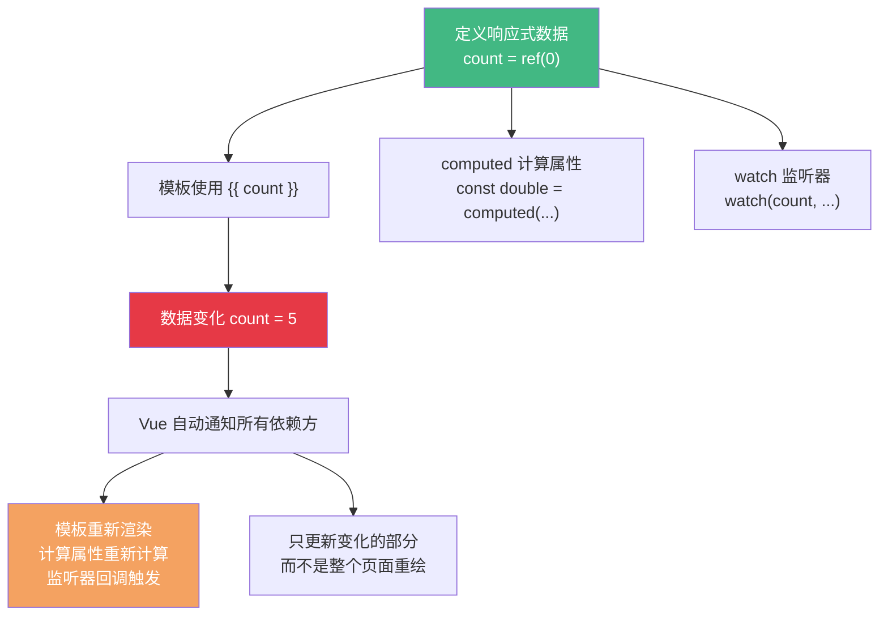

+++
title = "第4章 响应式基础"
weight = 40
date = "2026-03-25T12:54:00+08:00"
type = "docs"
description = ""
isCJKLanguage = true
draft = false
+++

# 第四章 响应式基础

> Vue 之所以能成为 Vue，最核心的秘密就是"响应式"。当数据变化时，视图自动更新——这看起来像魔法，但其实背后有一套精密的机制。理解响应式，是理解 Vue 本质的起点。本章我们会深入探讨 ref、reactive、computed、watch 这些核心 API，理解 Vue 3 响应式系统的工作原理。

## 4.1 什么是响应式

"响应式"这个词听起来很抽象，让我们用一个生活中的例子来解释。

想象你订了一份外卖，设置了"送到时手机响铃"的提醒。你不需要一直盯着窗外，也不需要每隔一分钟就下楼看一眼——外卖小哥到门口的时候，系统自动响铃通知你。这就是"响应"：你只做了"下单"这个动作，后续的事情（监控外卖位置、判断是否到达）由系统自动完成。

Vue 的响应式系统就是"外卖追踪系统"。你定义了 `count = 0`，然后在模板里写了 `{{ count }}`。在传统的"命令式编程"里，如果 `count` 变了，你需要手动写代码告诉页面："嘿，count 变了，你把显示的数字更新一下。"但在 Vue 的"响应式编程"里，你只需要做一件事：`count.value = 5`——Vue 会在背后自动找到所有依赖 `count` 的地方（模板、计算属性、watch 等），然后通知它们："数据变了，你们更新一下。"



**为什么响应式这么重要？** 因为它让开发者从"手动操作 DOM"的泥潭里解放出来。在 jQuery 时代，你要显示一个列表，得手动遍历数组、拼接 HTML 字符串、找到 DOM 元素、`$('#list').html(html)`。如果数据变了，你又要重复这一套流程。Vue 的响应式让你只需要关心"数据是什么"，而不需要关心"DOM 怎么更新"——Vue 会帮你搞定一切。

## 4.2 ref 与 reactive

### 4.2.1 ref 的使用（基本类型响应式）

`ref` 是 Vue 3 创建**基本类型**响应式数据的 API。Vue 2 里用 `data()` 函数返回的对象属性会自动变成响应式的，但在 Composition API（script setup）里，普通的 `const count = 0` 不会自动响应式——你需要用 `ref` 来包装它。

```typescript
import { ref } from 'vue'

// ref 包装基本类型
const count = ref(0)
const name = ref('小明')
const isActive = ref(false)

// 读取和修改 —— 用 .value
console.log(count.value)  // 0
count.value++            // count 变成了 1
console.log(count.value)  // 1

// 在模板里使用时，Vue 会自动解包 .value，不需要写 .value
// {{ count }} 等价于 {{ count.value }}
```

为什么基本类型需要 `ref` 来包装？因为 JavaScript 的基本类型（number、string、boolean）在传递时是**值传递**的——你把 `count = 0` 传给一个函数，在函数里改了这个参数，外面感知不到。但 `ref` 把基本类型包装成一个"容器对象"（ref 对象），传递的是这个容器的引用，改变 `.value` 时外部能感知到。

### 4.2.2 ref 的 .value 原理

`ref` 的 `.value` 看起来有点奇怪——为什么要写两遍 `count.value`？让我们来理解它背后的原理。

```typescript
import { ref } from 'vue'

// ref 返回的是一个 ref 对象，有以下结构：
// { value: 0, __v_isRef: true, __v_raw: 0 }

const count = ref(0)

// count 是一个 ref 对象，有 .value 属性
console.log(count.value)   // 0 —— 读取值
count.value = 10          // 写入值

// ref 对象有一个特殊能力：在模板里使用时，Vue 会自动"解包"
// <template>{{ count }}</template>  等价于  <template>{{ count.value }}</template>
// 但在 <script setup> 里，你必须手动写 .value
```

Vue 的模板会自动解包 ref，这是 Vue 设计上的一个"魔法"——模板里不需要写 `.value`，但 script 里需要。这种"双轨制"一开始会让新手困惑，但用多了就习惯了。

**一个重要的边界情况：对象里的 ref 不会被自动解包：**

```vue
<script setup>
import { ref } from 'vue'

const count = ref(0)

// 对象里包 ref —— 不要这样做
const obj = { count: ref(0) }

function showValues() {
  console.log(obj.count)       // Ref 对象本身（不是自动解开的）
  console.log(obj.count.value) // 0（需要手动 .value）
}
</script>

<template>
  <!-- {{ obj.count }} 会输出 Ref 对象的字符串表示，不是数字！ -->
  <!-- 不要在对象里嵌套 ref，要用 reactive（下一节讲） -->
</template>
```

### 4.2.3 reactive 的使用（对象类型响应式）

`reactive` 是 Vue 3 创建**对象类型**响应式数据的 API。它把一个普通对象变成响应式的，对象里的所有属性都会自动响应式，不需要像 `ref` 那样用 `.value` 访问。

```typescript
import { reactive } from 'vue'

// reactive 只能用于对象/数组，不能用于基本类型
const user = reactive({
  name: '小明',
  age: 25,
  isActive: true,
  hobbies: ['编程', '音乐']
})

// 不需要 .value，直接用属性名访问
console.log(user.name)   // 小明
user.age++               // age 变成了 26

// 数组也 OK
user.hobbies.push('读书')

// reactive 的对象，整体替换要小心
// user = reactive({ name: '小红' })  // ❌ 错误！这样会丢失响应式

// 正确做法：直接修改属性
user.name = '小红'       // ✅ 正确

// 如果真的需要整体替换（不推荐，通常直接修改属性更好）
Object.assign(user, { name: '小红', age: 26 })  // ✅ 正确：保留响应式
```

**`ref` vs `reactive` 怎么选？**

| | ref | reactive |
|---|---|---|
| 适用类型 | 基本类型 + 对象/数组 | 仅对象/数组 |
| 访问方式 | `.value`（script 里） | 直接属性名 |
| 重新赋值 | 支持 `count.value = 5` | 需要用 `Object.assign` 整体合并 |
| 解构 | 解构后丢失响应式（除非用 toRefs） | 解构后丢失响应式 |

```typescript
import { ref, reactive } from 'vue'

// 推荐用 ref 的场景：基本类型、可能被整体重新赋值的变量
const count = ref(0)
const message = ref('')

// 推荐用 reactive 的场景：相关属性聚在一起的对象
const formData = reactive({
  username: '',
  password: '',
  rememberMe: false
})
```

### 4.2.4 ref vs reactive 如何选择

这是很多新手会纠结的问题。实际上，两者的核心功能是一样的——创建响应式数据——只是 API 风格不同。以下是一些经验法则：

**用 `ref` 的场景：**
- 基本类型（number、string、boolean）
- 可能会被整体重新赋值的变量
- 模板中使用的响应式变量（ref 在模板里自动解包）
- 需要返回或传递的响应式值

```typescript
const count = ref(0)
const searchQuery = ref('')
const isLoading = ref(false)
const data = ref(null)  // 一开始没数据，后来可能是对象
```

**用 `reactive` 的场景：**
- 一组相关联的状态（表单数据、用户信息、配置对象）
- 状态之间的逻辑关联很强，放在一起更易读

```typescript
const userState = reactive({
  profile: null,
  isLoggedIn: false,
  permissions: []
})
```

**一个重要的原则：不要混用！** 不要在一个组件里既用 `ref` 又用 `reactive` 来做同一类事情，选一个风格保持一致。大部分团队会约定俗成地选择一种风格。

## 4.3 reactive 的限制

### 4.3.1 解构 reactive 会丢失响应式

这是 reactive 最大的"坑"。当你用 ES6 解构来"提取" reactive 对象的属性时，提取出来的变量会**失去响应式**。

```typescript
import { reactive } from 'vue'

const state = reactive({
  count: 0,
  name: '小明'
})

// 解构 —— 失去了响应式！
const { count, name } = state

// 之后的修改不会触发响应式更新
count++  // state.count 不会变！
name = '小红'  // state.name 不会变！
```

原因很简单：`state.count` 本身是一个响应式的 getter/setter，但解构出来的 `count` 是一个普通的变量，它和 `state` 之间的"响应式连接"在解构的瞬间就断了。解构出来的 `count` 只是 `state.count` 的值的一份**快照**，之后 `state.count` 再怎么变，解构出来的 `count` 都不会变。

### 4.3.2 toRef / toRefs 安全解构

如果真的需要从 reactive 对象里"提取"属性，但还想保持响应式，Vue 提供了两个工具函数：`toRef` 和 `toRefs`。

**`toRef`**：把 reactive 对象的某个属性变成一个 ref，这个 ref 和原始对象保持连接。

```typescript
import { reactive, toRef } from 'vue'

const state = reactive({
  count: 0,
  name: '小明'
})

// toRef：把单个属性变成 ref
const countRef = toRef(state, 'count')
const nameRef = toRef(state, 'name')

// 通过 ref 修改，原始对象也会变
countRef.value++  // state.count 变成了 1

// 通过原始对象修改，ref 也会更新
state.count = 100  // countRef.value 变成了 100

// 但这个 ref 不能单独存在，它必须依赖于 state
// 删除了 state.count，countRef.value 就变成 undefined 了
```

**`toRefs`**：一次性把 reactive 对象的所有属性都变成 ref，解构后不会丢失响应式。

```typescript
import { reactive, toRefs } from 'vue'

const state = reactive({
  count: 0,
  name: '小明',
  age: 25
})

// toRefs：把整个对象转成普通对象，但每个属性都是 ref
const { count, name, age } = toRefs(state)

// 解构出来的 ref 和原始对象保持响应式连接
count.value++  // state.count 变成了 1 —— 响应式更新！

// 在模板里不需要写 .value（Vue 自动解包）
// {{ count }} 显示的就是 1
```

**什么时候用 `toRefs`？** 最常见的场景是：`setup` 函数需要返回 reactive 对象里的多个属性，但想把它们解构后返回给模板用：

```typescript
import { reactive, toRefs } from 'vue'

export function useCounter() {
  const state = reactive({
    count: 0,
    doubled: 0
  })

  function increment() {
    state.count++
    state.doubled = state.count * 2
  }

  // 如果直接 return state，模板里要用 state.count
  // 用 toRefs 解构后，模板里可以直接用 count
  return toRefs(state)  // { count: Ref, doubled: Ref }
}
```

## 4.4 计算属性

### 4.4.1 computed 基本用法

计算属性是 Vue 响应式系统里最强大的特性之一。它让你可以用一个**函数**来描述一个"派生值"——这个值是由其他数据计算得来的，当依赖的数据变化时，计算属性会自动重新计算。

```typescript
import { ref, computed } from 'vue'

const firstName = ref('张')
const lastName = ref('三')

// 计算属性：fullName 是由 firstName 和 lastName 计算得出的
const fullName = computed(() => {
  // 箭头函数返回值，即为计算属性的值
  return firstName.value + lastName.value
})

console.log(fullName.value)  // 张三

// 修改依赖的数据
firstName.value = '李'
console.log(fullName.value)  // 李三 —— 自动更新！
```

计算属性的核心特性是**缓存**。只要 `firstName` 和 `lastName` 没有变化，无论你访问 `fullName` 多少次，Vue 不会重新计算——它会返回上次缓存的结果。只有当依赖变化时，才会重新计算。

### 4.4.2 getter 与 setter

`computed` 默认只有 getter（只读），但你也可以提供 setter，让计算属性**可写**：

```typescript
import { ref, computed } from 'vue'

const user = ref({
  firstName: '张',
  lastName: '三',
  age: 25
})

// 双向的计算属性
const displayName = computed({
  // getter：读取时调用
  get() {
    return user.value.firstName + user.value.lastName
  },
  // setter：写入时调用
  set(value: string) {
    const [first, ...rest] = value.split('')
    // 把 "王五" 拆成 "王" 和 "五"，写回 user
    user.value.firstName = first
    user.value.lastName = rest.join('')
  }
})

console.log(displayName.value)  // 张三

// 修改计算属性，会触发 setter
displayName.value = '王五'
console.log(user.value.firstName)  // 王
console.log(user.value.lastName)   // 五
```

### 4.4.3 计算属性 vs 方法（缓存机制）

你可能会想：计算属性看起来和普通函数没什么区别啊，我把 `fullName()` 写成一个普通函数不行吗？

**关键区别是缓存。**

```typescript
import { ref, computed } from 'vue'

const firstName = ref('张')
const lastName = ref('三')
let callCount = 0

// 计算属性
const fullName = computed(() => {
  callCount++
  return firstName.value + lastName.value
})

// 普通方法
function getFullName() {
  callCount++
  return firstName.value + lastName.value
}

// 模板里多次使用计算属性 —— callCount 只增加 1 次
console.log(fullName.value)  // callCount = 1
console.log(fullName.value)  // callCount = 1（用了缓存）
console.log(fullName.value)  // callCount = 1（继续用缓存）

// 模板里多次使用方法 —— callCount 每次都增加
console.log(getFullName())  // callCount = 1
console.log(getFullName())  // callCount = 2
console.log(getFullName())  // callCount = 3
```

在模板里使用计算属性和方法，效果看起来一样——都会显示正确的值。但背后的开销完全不同：

- **计算属性**：只在依赖变化时重新计算，之后的访问直接返回缓存值，**不重复执行函数**。
- **方法**：每次访问都会重新执行函数，**没有任何缓存**。

所以，如果一个值是由其他响应式数据计算得出的，**永远用 `computed`，不要用方法**。

## 4.5 侦听器

### 4.5.1 watch 基本用法

**计算属性**用于"根据现有数据算出另一个值"，**侦听器**用于"当某个数据变化时，执行一个副作用"——比如发网络请求、打印日志、操作 DOM 等。

```typescript
import { ref, watch } from 'vue'

const searchQuery = ref('')

// 监听 searchQuery 的变化
watch(searchQuery, (newValue, oldValue) => {
  console.log(`搜索词从 "${oldValue}" 变成了 "${newValue}"`)
  // 在这里发搜索 API 请求
})

// 修改被监听的值，watch 的回调会自动触发
searchQuery.value = 'Vue'
// 输出：搜索词从 "" 变成了 "Vue"
```

`watch` 的第一个参数可以是**一个 ref**、**一个 reactive 对象**、**一个 getter 函数**，甚至**多个数据**的数组。

### 4.5.2 watchEffect 立即执行

`watch` 是惰性的——它不会在监听器创建时立即执行，只有当被监听的数据第一次变化时才执行回调。

如果你想在监听器创建时**立即执行一次**（不管数据有没有变化），用 `watchEffect`：

```typescript
import { ref, watchEffect } from 'vue'

const count = ref(0)

// watchEffect 会立即执行一次
// 回调里用到的所有响应式数据都会被自动追踪为依赖
watchEffect(() => {
  console.log(`count 变了，现在是 ${count.value}`)
})

// 修改 count，watchEffect 会再次执行
count.value++  // count 变了，现在是 1

count.value++  // count 变了，现在是 2
```

`watchEffect` 的特点是**自动追踪依赖**——你不需要显式地指定要监听哪个数据，只要在回调里用到了某个响应式数据，Vue 就会自动把它加到依赖列表里。

### 4.5.3 watch vs watchEffect 选择

| | watch | watchEffect |
|---|---|---|
| **惰性** | 是（首次创建时不执行） | 否（创建时立即执行一次） |
| **依赖追踪** | 显式指定 | 自动追踪回调里用到的所有响应式数据 |
| **访问旧值** | 能（第二个参数） | 不能 |
| **适用场景** | 只需要关心某个特定数据的变化 | 想追踪所有相关数据的变化 |
| **性能** | 更精确（只监听指定的数据） | 可能追踪了不必要的依赖 |

**选择原则：**

- 需要知道**旧值是什么** → 用 `watch`
- 想在组件初始化时**立即执行一次** → 用 `watchEffect`
- 只关心**某个特定数据**的变化 → 用 `watch`
- 回调里涉及**多个响应式数据**，懒得一个个列 → 用 `watchEffect`（但要小心，不要在里面引用太多不相关的数据）

### 4.5.4 深度监听（deep）

默认情况下，`watch` 只监听被监听对象的**第一层属性变化**。如果监听的是一个对象，直接替换整个对象才会触发，但修改对象里的某个属性不会触发。

```typescript
import { ref, reactive, watch } from 'vue'

// 基本类型的 ref —— 没问题
const count = ref(0)
watch(count, () => console.log('count变了'))
count.value++  // ✅ 触发

// reactive 对象 —— 默认只监听整体替换
const user = reactive({ name: '小明', age: 25 })
watch(user, () => console.log('user变了'))
user.name = '小红'  // ❌ 不会触发！因为修改的是 user 的内部属性
user = reactive({ name: '小红', age: 26 })  // ✅ 整体替换会触发

// 如果想监听内部属性，加 deep: true
watch(user, () => console.log('user变了'), { deep: true })
user.name = '小红'  // ✅ 现在触发了！
```

**注意：深度监听有性能开销。** 因为 Vue 需要递归遍历整个对象树来检测变化。如果你的对象很大、很深，深度监听可能影响性能。如果只需要监听某个具体属性，用 getter 函数更高效：

```typescript
// 只监听 user.name 的变化 —— 精确监听，性能更好
watch(() => user.name, (newName) => {
  console.log(`名字从某人变成了 ${newName}`)
})

// 或者用 computed
const name = computed(() => user.name)
watch(name, (newName) => {
  console.log(`名字变成了 ${newName}`)
})
```

### 4.5.5 立即执行（immediate）

如果想让 `watch` 在创建时立即执行一次（不等待数据变化），加 `immediate: true`：

```typescript
import { ref, watch } from 'vue'

const query = ref('')

// 加了 immediate，第一次创建时就会执行
watch(query, (newVal, oldVal) => {
  console.log(`query 变了：${oldVal} → ${newVal}`)
}, { immediate: true })

// 输出：query 变了：undefined → （空字符串）
// —— 即使 query 还是初始值，回调也会执行一次
```

`immediate` 特别适合这样的场景：组件创建时就需要发一个请求来获取初始数据，同时还要监听用户操作来发后续请求。

```typescript
const productId = ref(1)

// 立即加载一次，用户翻页时也会触发
watch(productId, async (id) => {
  const data = await fetchProduct(id)
  product.value = data
}, { immediate: true })
```

### 4.5.6 停止监听（stop）

`watch` 和 `watchEffect` 会返回一个"停止函数"，调用它可以停止监听：

```typescript
import { ref, watch, watchEffect } from 'vue'

const count = ref(0)

// watch 返回一个 stop 函数
const stopWatch = watch(count, () => {
  console.log('count 变了')
})

// 手动停止监听
stopWatch()

count.value++  // 不再触发 —— watch 已停止

// watchEffect 也一样
const stopEffect = watchEffect(() => {
  console.log('count:', count.value)
})

stopEffect()  // 停止
```

**为什么要主动停止？** 在 `setup` 里创建的 watcher，组件销毁时 Vue 会自动停止。但如果在 `setup` 之外（比如在 `onMounted` 里）创建 watcher，或者在异步函数里创建 watcher，组件销毁时可能不会自动停止，造成**内存泄漏**。这时候需要手动调用 stop 函数。

```typescript
import { ref, watch, onMounted, onUnmounted } from 'vue'

let stopWatch = null

onMounted(() => {
  const count = ref(0)
  stopWatch = watch(count, () => {
    console.log('count 变了')
  })
})

onUnmounted(() => {
  // 组件销毁时停止监听
  if (stopWatch) {
    stopWatch()
  }
})
```

---

## 本章小结

本章我们深入探讨了 Vue 3 响应式系统的核心 API：

- **响应式的本质**：Vue 自动追踪数据变化并更新视图，开发者只需要关注数据本身，不需要手动操作 DOM。
- **`ref`**：用于基本类型响应式，用 `.value` 访问和修改，模板里自动解包。
- **`reactive`**：用于对象/数组响应式，直接访问属性不需要 `.value`，但解构会丢失响应式。
- **`toRef` / `toRefs`**：安全地从 reactive 对象提取属性，保持响应式连接。
- **`computed`**：派生值，自动缓存，只在依赖变化时重新计算，性能优于普通方法。
- **`watch`**：监听数据变化执行副作用，支持 deep、immediate，可以获取旧值。
- **`watchEffect`**：自动追踪回调里用到的所有响应式数据，立即执行一次。

下一章我们会学习 Vue 3 的**生命周期钩子**——组件从创建到销毁的每个阶段，Vue 都会提供对应的"钩子函数"，让你在合适的时机做合适的事情。这是组件化开发的必经之路！

