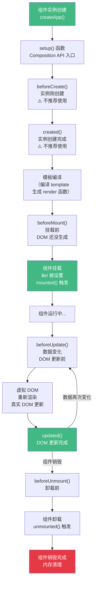

+++
title = "第5章 生命周期"
weight = 50
date = "2026-03-25T12:54:00+08:00"
type = "docs"
description = ""
isCJKLanguage = true
draft = false
+++

# 第五章 生命周期

> 组件从诞生到销毁，会经历一系列"生命周期"——创建、挂载、更新、销毁，每个阶段 Vue 都提供了对应的钩子函数，让你在合适的时机做合适的事情。理解生命周期，是掌握组件化开发的钥匙。本章会详细介绍每个阶段的钩子函数，以及 KeepAlive、错误捕获等进阶内容。

## 5.1 生命周期图谱概览

在深入每个阶段之前，先看一下 Vue 3 生命周期的全貌。下面这张图展示了组件从创建到销毁的完整流程，以及每个阶段可用的钩子函数：



**生命周期钩子一览表（按调用顺序）：**

| 阶段 | 钩子函数 | 说明 |
|------|----------|------|
| 创建 | `beforeCreate` | 实例刚创建，data、methods 不可用 |
| 创建 | `created` | 实例创建完成，data、methods 可用，DOM 不可用 |
| 挂载 | `beforeMount` | 模板编译完成，即将挂载，DOM 还不存在 |
| 挂载 | `mounted` | DOM 已生成，可以访问 `$el` 和 `$refs` |
| 更新 | `beforeUpdate` | 数据变化，DOM 更新前触发 |
| 更新 | `updated` | DOM 更新完成触发 |
| 卸载 | `beforeUnmount` | 组件卸载前触发，等价于 Vue 2 的 beforeDestroy |
| 卸载 | `unmounted` | 组件卸载完成触发，等价于 Vue 2 的 destroyed |

## 5.2 创建阶段

### 5.2.1 beforeCreate

`beforeCreate` 是 Vue 实例创建过程中**最早**被调用的钩子。此时，组件的 `data`、`methods`、`computed`、`watch` 等等都还没有初始化完成。

```typescript
import { ref } from 'vue'

export default {
  setup() {
    const count = ref(0)

    // Composition API 中没有 beforeCreate —— setup 几乎等价于 beforeCreate + created
    // beforeCreate 在 Options API 中使用
    beforeCreate(() => {
      console.log('beforeCreate: 实例刚创建')
      console.log('count:', count.value)  // undefined，因为 data 还没初始化
    })

    return {}
  }
}
```

**实际开发中，几乎不需要使用 `beforeCreate`**，因为 Vue 3 的 Composition API 把初始化逻辑放在了 `setup` 函数里，而 `setup` 在 `beforeCreate` 之前执行——`setup` 已经能覆盖 `beforeCreate` 的所有使用场景。

### 5.2.2 created

`created` 在组件实例创建完成后调用。此时，组件的响应式系统（data、props、computed、methods、watch）已经全部初始化完成，但 DOM 还没有生成，组件的 `$el` 还不存在。

```typescript
import { ref } from 'vue'

export default {
  setup() {
    const count = ref(0)
    const message = ref('Hello')

    created(() => {
      console.log('created: 实例创建完成')
      console.log('count:', count.value)  // 0 —— data 已初始化
      console.log('message:', message.value)  // Hello
      // 可以在这里发 API 请求 —— 这是很常见的用法
    })

    return {}
  }
}
```

**`created` 的常见使用场景：**

1. **发起初始数据的 API 请求**：组件需要的数据从服务器获取，在 `created` 里调用接口。
2. **初始化组件内部状态**：设置一些不依赖 DOM 的初始值。
3. **订阅事件**：在 `created` 里订阅全局事件，`beforeUnmount` 里取消订阅。

```typescript
// 典型场景：组件初始化时获取数据
import { ref, onMounted } from 'vue'

export default {
  setup() {
    const users = ref([])

    // 获取用户列表
    async function fetchUsers() {
      const res = await fetch('/api/users')
      users.value = await res.json()
    }

    // 在 created 时获取数据
    created(() => {
      fetchUsers()
    })

    // 也可以直接在 setup 里调用 —— 这和 created 几乎同时执行
    // fetchUsers()

    return { users }
  }
}
```

## 5.3 挂载阶段

### 5.3.1 beforeMount

`beforeMount` 在组件的模板编译完成后、挂载到 DOM 之前调用。此时，组件的 `$el` 还不存在，DOM 节点还没有被创建。

```typescript
import { ref } from 'vue'

export default {
  setup() {
    const title = ref('标题')

    beforeMount(() => {
      console.log('beforeMount: 即将挂载到 DOM')
      console.log('title:', title.value)  // 标题
      console.log('this.$el:', this?.$el)  // undefined，DOM 还不存在
    })

    return { title }
  }
}
```

**`beforeMount` 的使用场景不多**，因为在这个阶段能做的事情有限——DOM 还不存在，能做的事主要是一些最终的准备工作。但要注意：不要在这里操作 DOM，DOM 还不存在。

### 5.3.2 mounted（DOM 已渲染，可访问 $el）

`mounted` 是最常用的生命周期钩子之一。当 `mounted` 被调用时，组件的 DOM 已经渲染完成，`$el` 可以访问，`<refs>` 也可以使用了。

```typescript
import { ref, onMounted } from 'vue'

export default {
  setup() {
    const canvas = ref<HTMLCanvasElement | null>(null)

    onMounted(() => {
      console.log('mounted: DOM 已渲染完成')
      console.log('canvas:', canvas.value)  // <canvas> 元素，可以操作它了

      // 典型的使用场景：初始化第三方库、绑定事件、获取 DOM 尺寸
      if (canvas.value) {
        const ctx = canvas.value.getContext('2d')
        ctx?.fillRect(0, 0, 100, 100)
      }

      // 获取元素尺寸
      const rect = canvas.value?.getBoundingClientRect()
      console.log('canvas 尺寸:', rect)
    })

    return { canvas }
  }
}
```

**`mounted` 的典型使用场景：**

1. **初始化需要 DOM 的库**：比如 ECharts、Three.js、Swiper 等，需要 DOM 存在才能初始化。
2. **获取 DOM 尺寸和位置**：用 `getBoundingClientRect()` 等 API。
3. **绑定事件监听器**：比如给 window 绑定 resize 监听器。
4. **发送统计埋点**：页面 PV/UV 统计等。

**一个重要的点：`mounted` 不保证组件已经在视口中可见。** 如果你需要在元素真正渲染到视口后才执行某些操作（比如 IntersectionObserver 相关的），应该用 `nextTick` 配合，或者用 `onMounted` 但要意识到 DOM 存在不等于"可见"。

## 5.4 更新阶段

### 5.4.1 beforeUpdate

`beforeUpdate` 在组件的数据变化后、DOM 重新渲染前调用。此时，组件的数据已经是最新的，但 DOM 还是旧的状态（还没更新）。

```typescript
import { ref, beforeUpdate } from 'vue'

export default {
  setup() {
    const count = ref(0)

    function increment() {
      count.value++
    }

    beforeUpdate(() => {
      console.log('beforeUpdate: 数据已变，DOM 更新前')
      console.log('count:', count.value)  // 最新的值

      // 可以在这里读取 DOM 的当前状态（比如滚动位置）
      // 但不要在这里修改 DOM —— 这个时候 DOM 还是旧的
    })

    return { count, increment }
  }
}
```

**`beforeUpdate` 的使用场景非常有限，** 绝大多数情况下你不需要用它。如果需要在 DOM 更新后做一些事情，用 `updated`；如果需要在 DOM 更新后操作 DOM，用 `nextTick`。

### 5.4.2 updated

`updated` 在组件的 DOM 重新渲染完成后调用。此时，组件的数据和 DOM 都是最新的。

```typescript
import { ref, onUpdated } from 'vue'

export default {
  setup() {
    const list = ref([])

    function addItem() {
      list.value.push({ id: Date.now(), name: '新项目' })
    }

    onUpdated(() => {
      console.log('updated: DOM 已更新完成')

      // 典型场景：DOM 更新后操作 DOM（比如聚焦输入框）
      const lastItem = document.querySelector('.list-item:last-child')
      const input = lastItem?.querySelector('input')
      input?.focus()  // 聚焦到最后一个输入框
    })

    return { list, addItem }
  }
}
```

**`updated` 的常见使用场景：**

1. **DOM 更新后操作 DOM**：比如滚动到某个位置、聚焦输入框、获取元素尺寸等。
2. **重新初始化依赖 DOM 的第三方库**：但更推荐用 `$nextTick` 或 watch 来处理。

**⚠️ 注意：`updated` 可能被频繁触发**——如果数据变化很快（比如在一个循环里修改数据），`updated` 可能被触发很多次。在 `updated` 里做一些重操作（比如发 API 请求）时要小心，最好用 `watch` 来代替。

## 5.5 销毁阶段

### 5.5.1 beforeUnmount

`beforeUnmount` 在组件即将被卸载（从 DOM 中移除）前调用。在这个阶段，组件还是完全正常的，所有响应式数据和事件监听器都还活着。

```typescript
import { ref, onMounted, beforeUnmount } from 'vue'

export default {
  setup() {
    const timer = ref<number | null>(null)
    const count = ref(0)

    onMounted(() => {
      // 启动一个定时器
      timer.value = window.setInterval(() => {
        count.value++
      }, 1000)
    })

    beforeUnmount(() => {
      console.log('beforeUnmount: 组件即将卸载，清理定时器')
      // 清理定时器，防止内存泄漏
      if (timer.value !== null) {
        clearInterval(timer.value)
      }

      // 取消事件监听
      window.removeEventListener('resize', handleResize)
    })

    return { count }
  }
}
```

**`beforeUnmount` 是组件卸载前最后的清理机会。** 如果你在 `onMounted` 里做了任何需要清理的事情（定时器、事件监听、WebSocket 连接等），必须在 `beforeUnmount` 里做清理，否则会造成内存泄漏。

### 5.5.2 unmounted

`unmounted` 在组件卸载完成后调用。此时，组件的 DOM 已经从页面中移除，所有的事件监听器、定时器等都已清理完毕。

```typescript
import { ref, onUnmounted } from 'vue'

export default {
  setup() {
    const ws = ref<WebSocket | null>(null)

    onMounted(() => {
      // 建立 WebSocket 连接
      ws.value = new WebSocket('wss://example.com')
      ws.value.onmessage = (event) => {
        console.log('收到消息：', event.data)
      }
    })

    onUnmounted(() => {
      console.log('unmounted: 组件已卸载')
      // 关闭 WebSocket 连接
      if (ws.value) {
        ws.value.close()
        ws.value = null
      }
    })

    return {}
  }
}
```

**`onUnmounted` 和 `beforeUnmount` 有什么区别？**

- `beforeUnmount`：组件还在 DOM 上，所有东西都还正常，可以继续操作 DOM。
- `unmounted`：组件已经从 DOM 上移除了，但可能还有一些"收尾"工作要做（比如确保某些异步操作完成）。

大多数场景用 `onUnmounted` 就够了，两者基本上是等价的。

## 5.6 KeepAlive 独有阶段

### 5.6.1 activated（激活）

`<KeepAlive>` 是 Vue 3 提供的一个内置组件，用来**缓存**组件实例。当一个组件被 `<KeepAlive>` 包裹时，它不会被真正销毁——切换走时会被缓存，切换回来时会从缓存中恢复，而不是重新创建。

这对于**多 Tab 切换**、**列表到详情页**等场景特别有用——比如用户填写一个长表单，切换到其他 Tab 再回来，之前填写的内容还在，不需要重新加载。

```vue
<script setup>
import { ref, onMounted, onActivated, onDeactivated } from 'vue'

const message = ref('我是缓存组件')

onMounted(() => {
  console.log('组件首次挂载')
})

onActivated(() => {
  console.log('activated: 组件被激活了（从缓存中恢复）')
  // 场景：重新获取最新数据、恢复滚动位置、恢复播放状态
})

onDeactivated(() => {
  console.log('deactivated: 组件被缓存了（即将被卸载但不销毁）')
  // 场景：暂停播放、保存滚动位置、取消不需要的请求
})
</script>

<template>
  <div>
    <h2>{{ message }}</h2>
    <p>计数器：{{ Math.random() }}</p>
    <p>这个值在缓存恢复后会保留，因为组件没有被销毁</p>
  </div>
</template>
```

```vue
<!-- 父组件使用 KeepAlive -->
<script setup>
import { ref } from 'vue'
import CachedComponent from './CachedComponent.vue'

const showCache = ref(true)
</script>

<template>
  <div>
    <button @click="showCache = !showCache">
      {{ showCache ? '卸载缓存组件' : '恢复缓存组件' }}
    </button>

    <!-- keep-alive 包裹的组件不会真正销毁 -->
    <keep-alive>
      <CachedComponent v-if="showCache" />
    </keep-alive>
  </div>
</template>
```

### 5.6.2 deactivated（停用）

`onDeactivated` 在组件被 `<KeepAlive>` 缓存（而不是销毁）时调用。此时组件从 DOM 上移除了，但 Vue 保留了它的实例和状态，下次激活时可以完全恢复。

`activated` 和 `deactivated` 只有被 `<KeepAlive>` 包裹的组件才会触发。普通的组件没有这两个生命周期——它们的"挂载"只有 `onMounted`，"卸载"只有 `onUnmounted`。

## 5.7 错误捕获

### 5.7.1 errorCaptured

`errorCaptured` 是 Vue 3 新增的一个生命周期钩子，专门用来**捕获子组件的错误**。当子组件在渲染时、在触发 watcher 时、或者生命周期钩子里抛出错误时，父组件可以通过 `errorCaptured` 来捕获并处理。

```typescript
import { ref, errorCaptured } from 'vue'

export default {
  setup() {
    // 捕获子组件的错误
    errorCaptured((err, instance, info) => {
      console.error('捕获到子组件错误：', err)
      console.error('出错的组件实例：', instance)
      console.error('错误信息：', info)  // 错误来源，如 "onMounted hook"

      // 返回 false 可以阻止错误继续向上传播
      // 返回 true 或不返回则继续向上传播
      return false
    })

    return {}
  }
}
```

**`errorCaptured` 的返回值：**

- 返回 `false`：阻止错误传播，错误不会继续传递给父组件。
- 返回 `true` 或不返回：允许错误继续向上传播，父组件也能捕获到。

### 5.7.2 app.config.errorHandler

如果 `errorCaptured` 没有处理某个错误，或者错误发生在组件外部，可以通过 `app.config.errorHandler` 来设置**全局错误处理器**。

```typescript
import { createApp } from 'vue'
import App from './App.vue'

const app = createApp(App)

app.config.errorHandler = (err, instance, info) => {
  console.error('全局错误处理器捕获到错误：', err)
  console.error('错误信息：', info)

  // 可以在这里把错误上报给服务器（如 Sentry）
  // fetch('/api/error-report', {
  //   method: 'POST',
  //   body: JSON.stringify({ err, info, stack: err.stack })
  // })
}

app.mount('#app')
```

**错误处理的最佳实践：**

1. **优先用 `errorCaptured`**：在父组件里捕获子组件的错误，做局部的错误处理（比如显示一个错误提示而不是整个页面崩溃）。
2. **用 `app.config.errorHandler` 作为兜底**：处理那些没有被 `errorCaptured` 捕获的错误，上报到监控系统。
3. **不要在错误处理器里再次抛出错误**，否则可能导致无限循环。

## 5.8 调试钩子

### 5.8.1 onRenderTracked

`onRenderTracked` 是一个**调试钩子**，它会在 Vue 渲染过程中"追踪"到某个响应式依赖时触发。这对于理解 Vue 的响应式系统工作原理非常有用，但在实际开发中几乎用不到。

```typescript
import { ref, onRenderTracked } from 'vue'

export default {
  setup() {
    const count = ref(0)
    const name = ref('小明')

    onRenderTracked((event) => {
      console.log('追踪到一个依赖：', {
        type: event.type,           // "get" | "set" | "add" | "delete"
        key: event.key,             // 触发的属性名
        target: event.target,        // 触发所在的对象
        effect: event.effect        // 相关的 effect
      })
    })

    return { count, name }
  }
}
```

当 `count` 或 `name` 在模板中被访问时，`onRenderTracked` 会触发并打印出相关信息。这个钩子主要用于**调试 Vue 的响应式系统**，比如排查"为什么这个组件会重新渲染"这类问题。

### 5.8.2 onRenderTriggered

`onRenderTriggered` 在 Vue 因为某个响应式依赖变化而**触发重新渲染**时触发。它告诉你"是哪个数据变化导致了这轮重新渲染"。

```typescript
import { ref, onRenderTriggered } from 'vue'

export default {
  setup() {
    const count = ref(0)
    const other = ref('abc')

    onRenderTriggered((event) => {
      console.log('渲染被触发：', {
        type: event.type,           // "set" | "add" | "delete" | "clear"
        key: event.key,             // 触发变化的属性名
        newValue: event.newValue,    // 新的值
        oldValue: event.oldValue,    // 旧的值
        target: event.target         // 触发变化的对象
      })
    })

    return { count, other }
  }
}
```

当 `count.value++` 执行时，`onRenderTriggered` 会打印出"是因为 count 变了才重新渲染"的信息。这两个调试钩子组合起来，可以帮助你绘制出完整的"依赖追踪图谱"。

## 5.9 服务端渲染阶段（SSR 特有）

### 5.9.1 onServerPrefetch

`onServerPrefetch` 是**服务端渲染（SSR）**专用的生命周期钩子。当 Vue 在服务端渲染页面时，`onServerPrefetch` 里注册的异步函数会被等待执行完毕后才返回 HTML。这确保了用户拿到页面时，关键数据已经就绪，不需要再做客户端的水合（hydrate）来重新获取数据。

```typescript
import { ref, onServerPrefetch } from 'vue'

export default {
  setup() {
    const user = ref(null)
    const isLoading = ref(true)

    // 在服务端预获取数据，等数据就绪再渲染
    onServerPrefetch(async () => {
      console.log('（服务端）预获取用户数据...')
      const res = await fetch('https://api.example.com/user')
      user.value = await res.json()
      isLoading.value = false
      console.log('（服务端）数据获取完毕，渲染页面')
    })

    return { user, isLoading }
  }
}
```

**`onServerPrefetch` 的价值：** 在 SSR 场景下，如果组件需要数据才能渲染（比如一个用户信息卡片），不用这个钩子的话，数据可能在 HTML 发出时还没有准备好，客户端需要再发一次请求来获取数据，造成"两次请求"的问题（先空渲染，再数据渲染）。`onServerPrefetch` 让服务端在发出 HTML 之前就等待数据就绪，确保首屏内容完整。

---

## 本章小结

本章我们详细梳理了 Vue 3 组件的完整生命周期：

- **创建阶段**：`beforeCreate`（几乎不用）和 `created`（初始化数据、发起 API 请求）
- **挂载阶段**：`beforeMount`（准备挂载）和 `mounted`（DOM 已渲染，初始化第三方库、操作 DOM）
- **更新阶段**：`beforeUpdate`（DOM 更新前）和 `updated`（DOM 更新后操作 DOM）
- **销毁阶段**：`beforeUnmount`（清理定时器、事件监听器）和 `unmounted`（彻底清理）
- **KeepAlive 独有阶段**：`activated`（从缓存恢复）和 `deactivated`（被缓存）
- **错误捕获**：`errorCaptured`（捕获子组件错误）和 `app.config.errorHandler`（全局兜底）
- **调试钩子**：`onRenderTracked` 和 `onRenderTriggered`（调试响应式追踪）
- **SSR 特有**：`onServerPrefetch`（服务端预获取数据）

下一章我们将进入 Vue 3 最精彩的部分——**组件化开发**。你会学到如何把 UI 拆分成独立的、可复用的组件，以及组件之间的数据传递（Props 和 Emit）。这是 Vue 开发的核心技能！

