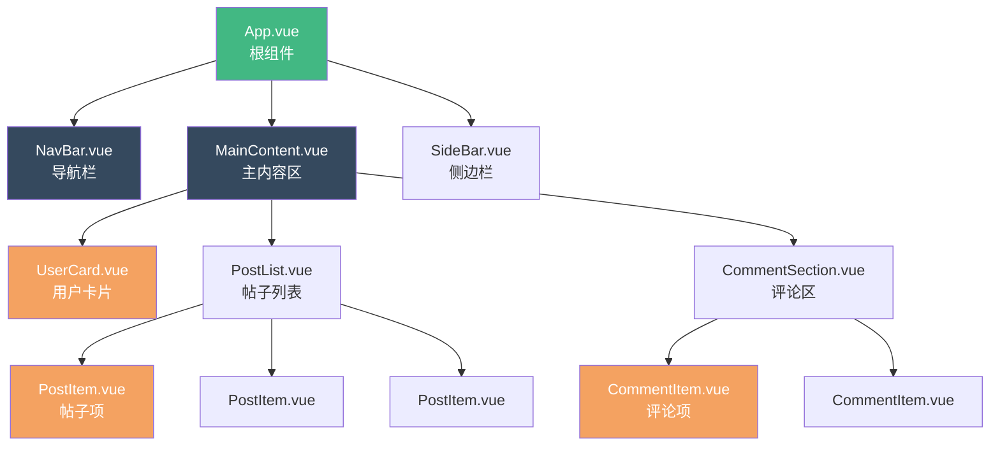
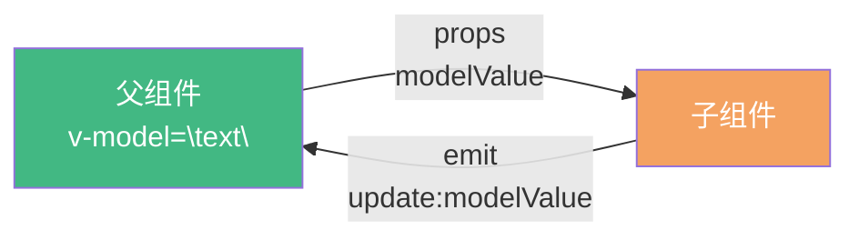

+++
title = "第6章 组件基础与 Props/Emit"
weight = 60
date = "2026-03-25T12:54:00+08:00"
type = "docs"
description = ""
isCJKLanguage = true
draft = false
+++

# 第六章 组件基础与 Props/Emit

> 组件是 Vue 的灵魂。没有组件化，Vue 就是一个会双向绑定的模板引擎；有了组件化，Vue 才能构建复杂的应用。本章我们会学习组件的概念、单文件组件的结构、父子组件之间的数据传递（Props 向下传递、Emit 向上通知），以及如何用 v-model 实现双向绑定。这些是 Vue 组件化开发的基础中的基础。

## 6.1 组件的概念与意义

### 6.1.1 为什么需要组件化

想象你要盖一栋房子，你会怎么做？不可能把所有东西都堆在一个大平层里——你会把房子分成客厅、卧室、厨房、卫生间，每个房间各司其职，通过门和走廊连接起来。组件化就是 Vue 世界的"房间划分"。

一个典型的 Vue 应用可能由几百个组件组成：导航栏是一个组件、侧边菜单是一个组件、用户卡片是一个组件、评论列表是一个组件、评论列表里的每一条评论又是一个组件……如果不用组件，这些东西全堆在一个巨大的 HTML 文件里，光是维护就足以让人崩溃。

**没有组件化的问题：**

- 代码重复：同样的用户卡片逻辑写了 10 遍，改一个需求要改 10 处。
- 难以维护：文件太大，根本不知道某段代码是干什么的。
- 难以测试：所有逻辑混在一起，无法单独测试某个功能。
- 难以协作：多个人同时改一个大文件，合并代码是噩梦。

**组件化带来的好处：**

- **复用**：一个组件写一次，在多个地方使用，维护成本大幅降低。
- **可维护**：每个组件的代码量有限，逻辑清晰，定位问题容易。
- **可测试**：每个组件可以单独测试，确保每个"零件"都是好的。
- **可组合**：通过嵌套和组合，小组件可以构建出复杂的应用。

### 6.1.2 组件化的优势

组件化的核心思想是**分而治之**——把一个复杂问题拆成多个简单问题，每个组件只关心自己的职责。



如图所示，根组件 `App.vue` 把整个页面分成导航、内容区、侧边栏三个子组件。内容区里又有用户卡片、帖子列表、评论区等组件。帖子列表里还有多个帖子项组件，评论区里还有评论项组件。这就是 Vue 组件树的典型结构——一层套一层，各司其职。

## 6.2 单文件组件（.vue）结构

### 6.2.1 template / script / style 三部分

Vue 的单文件组件（`.vue` 文件）是 Vue 最独特的创新之一。它把一个组件的模板（HTML）、逻辑（JavaScript）和样式（CSS）全部写在一个文件里，而不是分散在三个文件里。这让组件成为一个完全自包含的整体——你拿到一个 `.vue` 文件，就知道这个组件的所有信息。

```vue
<!-- UserCard.vue -->
<template>
  <!-- 模板部分：定义组件的 HTML 结构 -->
  <div class="user-card">
    
    <h3>{{ name }}</h3>
    <p>{{ bio }}</p>
  </div>
</template>

<script setup lang="ts">
// 逻辑部分：定义组件的行为
// lang="ts" 表示使用 TypeScript（可选，但强烈推荐）

import { defineProps } from 'vue'

// 使用 defineProps 定义这个组件接受哪些"参数"（Props）
const props = defineProps<{
  name: string
  avatar: string
  bio?: string
}>()

// Props 是只读的，不能修改父组件传过来的数据
// props.name = '新名字'  // ❌ 错误！
</script>

<style scoped>
/* 样式部分：定义组件的外观 */
/* scoped 表示这些样式只在这个组件内生效，不会影响其他组件 */
.user-card {
  border: 1px solid #ddd;
  border-radius: 8px;
  padding: 16px;
  max-width: 300px;
}

.user-card img {
  width: 80px;
  height: 80px;
  border-radius: 50%;
  object-fit: cover;
}
</style>
```

`<template>` 部分定义了组件的 HTML 结构，里面可以使用 Vue 的所有模板语法（插值、指令、条件渲染、列表渲染等）。

`<script setup>` 部分定义了组件的逻辑，这是 Composition API 的推荐写法（Vue 3.2+）。`setup` 函数的代码会在组件创建前执行，是组件逻辑的入口。

`<style>` 部分定义了组件的样式。`scoped` 属性表示这些样式是"组件私有"的，只会应用到当前组件的元素上，不会泄漏到其他组件。

### 6.2.2 组件的注册方式（全局 vs 局部）

组件需要"注册"才能使用。Vue 提供了两种注册方式：**全局注册**和**局部注册**。

**局部注册**是更推荐的方式，因为局部注册的组件只在当前组件内可见，不会污染全局命名空间，也方便 tree-shaking（构建时移除未使用的代码）。

```vue
<!-- 在父组件里引入并使用子组件 -->
<script setup>
import { ref } from 'vue'
import UserCard from './UserCard.vue'  // 局部注册
import ProductList from './ProductList.vue'

const currentTab = ref('user')
</script>

<template>
  <!-- 注册后就可以像使用普通 HTML 标签一样使用组件 -->
  <div>
    <UserCard
      name="小明"
      avatar="https://example.com/avatar.jpg"
      bio="热爱编程的前端工程师"
    />
    <ProductList />
  </div>
</template>
```

**全局注册**适合那些"在很多地方都会用到"的组件，比如 Button、Input、Modal 等 UI 组件。通常在一个独立的文件（如 `src/components/ui/index.ts`）里全局注册：

```typescript
// src/components/ui/index.ts
import { createApp } from 'vue'
import App from './App.vue'

// 导入所有需要全局注册的组件
import MyButton from './MyButton.vue'
import MyInput from './MyInput.vue'
import MyModal from './MyModal.vue'

const app = createApp(App)

// 全局注册（全局注册的组件在任何子组件里都可以直接使用，不需要 import）
app.component('MyButton', MyButton)
app.component('MyInput', MyInput)
app.component('MyModal', MyModal)

app.mount('#app')
```

```vue
<!-- 在任何组件里使用全局注册的组件，不需要 import -->
<template>
  <div>
    <MyButton>提交</MyButton>
    <MyInput v-model="username" />
  </div>
</template>
```

### 6.2.3 命名规范（PascalCase vs kebab-case）

Vue 组件的文件名和标签名有两种命名方式：

**PascalCase（帕斯卡命名法）**：首字母大写，每个单词首字母都大写。如 `UserCard.vue`、`ProductList.vue`。标签使用 `<UserCard />`。

**kebab-case（短横线命名法）**：所有字母小写，单词之间用短横线连接。如 `user-card.vue`、`product-list.vue`。标签使用 `<user-card />`。

Vue 模板里，**两种命名方式都可以使用**，因为 Vue 会自动转换：

```vue
<!-- 两种写法等价，Vue 会自动识别 -->
<UserCard />
<user-card />
<UserCard />   <!-- 推荐：IDE 提示更好 -->
```

**约定俗成的规范：**

- 文件名：**PascalCase**（`UserCard.vue`）—— 更清晰，IDE 自动补全更好
- 模板标签：**PascalCase**（`<UserCard />`）—— 更直观，一看就是组件而不是 HTML 原生标签

## 6.3 组件样式隔离

### 6.3.1 scoped 样式隔离

Vue 单文件组件的 `<style scoped>` 提供了一种"自动的样式隔离"——组件 A 的样式不会影响组件 B 的样式，即使它们有相同的 class 名字。

```vue
<template>
  <div class="container">
    <!-- 这个 div 会被加上 data-v-xxxxx 属性 -->
    <p class="title">这是组件 A 的标题</p>
  </div>
</template>

<script setup>
// 逻辑代码
</script>

<style scoped>
.container {
  padding: 16px;
}

/* 编译后实际生成的 CSS 会变成： */
/* .container[data-v-xxxxx] { padding: 16px; } */
/* Vue 通过给元素加 data-v-xxxxx 属性，让样式只匹配加了对应属性的元素 */
</style>
```

这个机制的工作原理是：Vue 在编译 `.vue` 文件时，会给模板里每个元素加上一个唯一的 `data-v-xxxxx` 属性，同时把 CSS 选择器都加上 `[data-v-xxxxx]` 的限制。这样，组件 A 的 `.title` 样式只会应用到组件 A 的 `.title` 元素上，不会影响其他组件的 `.title`。

### 6.3.2 深度选择器（:deep / ::v-deep）

有时候，父组件需要"穿透"子组件的样式隔离，给子组件内部的元素加样式。比如父组件用了某个第三方 UI 库的组件，但想让它的某个内部元素的字体大小变大一点。

```vue
<style scoped>
/* :deep() 穿透到子组件内部 */
/* 让子组件内部的 .inner-text 的字体变大 */
:deep(.inner-text) {
  font-size: 18px;
}

/* ::v-deep 是旧版语法，:deep() 是 Vue 3.2+ 的写法，功能一样 */
/* 建议用 :deep() */
</style>
```

**一个常见的场景：父组件给插槽内容加样式。** 假设子组件 `Card` 里有一个 `<slot>`，父组件在 `Card` 标签内放了内容，这些内容其实是在子组件的模板里被渲染的，父组件的 scoped 样式隔离会阻止父组件给这些内容加样式。用 `:deep()` 可以解决这个问题：

```vue
<!-- 父组件 -->
<style scoped>
/* :deep() 让样式穿透到插槽内容 */
:deep(.slot-content) {
  color: red;
}
</style>
```

### 6.3.3 CSS Modules

`scoped` 是 Vue 组件级别的样式隔离，还有一个更细粒度的隔离方式：**CSS Modules**。

```vue
<style module>
/* 使用 module 属性，Vue 会把类名编译成唯一的哈希值 */
.card {
  border: 1px solid #ddd;
}

.title {
  font-size: 18px;
}
</style>
```

CSS Modules 会把类名编译成类似 `_card_1x2y3_4` 这样的哈希字符串，完全避免了命名冲突。要在模板里使用，需要配合 `$style` 对象：

```vue
<template>
  <div :class="$style.card">
    <h1 :class="$style.title">标题</h1>
  </div>
</template>
```

实际开发中，`scoped` 已经能覆盖 95% 的场景，CSS Modules 适合需要更高强度样式隔离的情况（比如开发一个对外发布的 UI 组件库）。

### 6.3.4 全局样式

有时候你确实需要一些**全局生效的样式**——比如 CSS 重置（reset.css）、全局的字体设置、某个全局工具类。Vue 允许在一个 `.vue` 文件里同时有 `scoped` 样式和全局样式：

```vue
<style>
/* 没有 scoped，就是全局样式，会影响整个应用 */
* {
  margin: 0;
  padding: 0;
  box-sizing: border-box;
}

body {
  font-family: 'Helvetica Neue', Arial, sans-serif;
  font-size: 14px;
}

/* 全局工具类 */
.text-center { text-align: center; }
.text-red { color: red; }
</style>

<style scoped>
/* 有 scoped，只影响当前组件 */
.card {
  padding: 16px;
}
</style>
```

更常见的做法是把全局样式放在 `src/assets/styles/` 目录下的单独文件里，然后在 `main.ts` 里全局引入：

```typescript
// main.ts
import { createApp } from 'vue'
import App from './App.vue'
import './assets/styles/reset.css'     // CSS 重置
import './assets/styles/global.css'   // 全局样式

const app = createApp(App)
app.mount('#app')
```

## 6.4 Props：父传子

### 6.4.1 Props 的定义与传递

Props（属性）是 Vue 组件之间**数据向下流动**的主要方式。父组件通过属性把数据传给子组件，子组件通过 props 接收并使用这些数据。

**父组件：传值**

```vue
<script setup>
import UserCard from './UserCard.vue'

const userName = '小明'
const userAvatar = 'https://example.com/avatar.jpg'
</script>

<template>
  <!-- 通过属性传递数据给子组件 -->
  <UserCard
    :name="userName"
    :avatar="userAvatar"
    bio="热爱编程的前端工程师"
  />
</template>
```

**子组件：接收**

```vue
<!-- UserCard.vue -->
<script setup lang="ts">
// defineProps 是编译器宏，不需要 import，会自动可用
const props = defineProps<{
  name: string
  avatar: string
  bio?: string  // 可选属性，加 ? 表示不是必须的
}>()

// 在 script 里访问 props 用 props.xxx
// 在 template 里可以直接用 name、avatar（Vue 会自动从 props 上取）
console.log(props.name)
</script>

<template>
  <div class="user-card">
    
    <h3>{{ name }}</h3>
    <!-- bio 是可选的，不传就不显示 -->
    <p v-if="bio">{{ bio }}</p>
  </div>
</template>
```

### 6.4.2 Props 类型与默认值

使用 TypeScript 时，可以给 props 指定类型和默认值：

```typescript
// 方式一：使用泛型语法（Vue 3.3+ 推荐）
const props = defineProps<{
  title: string
  count?: number
  items: string[]
  config: { theme: string; size: string }
}>()

// 方式二：使用 withDefaults 设置默认值（Vue 3.4+ 推荐）
const props = withDefaults(defineProps<{
  title: string
  count?: number        // count 是可选的
  theme?: string
}>()), {
  count: 0,            // count 的默认值是 0
  theme: 'light'       // theme 的默认值是 'light'
})

// 如果有引用类型（数组、对象）的默认值，必须用函数返回
withDefaults(defineProps<{
  items?: string[]
  config?: { theme: string }
}>()), {
  items: () => [],                    // 用函数返回空数组
  config: () => ({ theme: 'light' })  // 用函数返回对象
})
```

### 6.4.3 Props 验证

可以在 defineProps 里给 props 加验证规则，不符合规则的 props 会在控制台报警告：

```typescript
const props = defineProps({
  // 基础类型检查
  title: {
    type: String,
    required: true,       // 必填
    default: '默认标题'    // 如果不是 required，可以用 default 设置默认值
  },

  // 数字类型，可以指定范围
  count: {
    type: Number,
    default: 0,
    validator: (value) => value >= 0  // 自定义验证器：必须是正数
  },

  // 多个可能的类型
  id: {
    type: [String, Number],
    required: true
  },

  // 自定义验证函数
  role: {
    type: String,
    validator: (value) => ['admin', 'editor', 'user'].includes(value),
    default: 'user'
  }
})
```

### 6.4.4 withDefaults（Vue 3.4+，默认值语法糖）

Vue 3.4 引入的 `withDefaults` 让给 props 设置默认值变得更优雅：

```typescript
import { withDefaults, defineProps } from 'vue'

// 不用 withDefaults
defineProps({
  title: { type: String, required: true },
  count: { type: Number, default: 0 }
})

// 用 withDefaults（更简洁）
const props = withDefaults(defineProps<{
  title: string
  count?: number
  theme?: 'light' | 'dark'
}>()), {
  count: 0,
  theme: 'light'
})
```

### 6.4.5 单向数据流原则

Vue 有一个核心原则：**Props 只能向下流动，不能向上修改。**

子组件**绝对不能**直接修改父组件传过来的 props。父组件拥有数据的"所有权"，子组件只有"使用权"。如果子组件需要修改数据，必须通过**事件**（Emit）通知父组件，由父组件来修改。

```vue
<!-- 子组件：通知父组件要修改数据，而不是直接改 -->
<script setup>
const props = defineProps<{
  count: number
}>()

const emit = defineEmits<{
  (e: 'update', value: number): void
}>()

function increment() {
  // 不能这样写：props.count++  —— ❌ 报错！
  // 正确做法：告诉父组件，触发一个 update 事件
  emit('update', props.count + 1)
}
</script>
```

这个"单向数据流"原则保证了数据流向清晰可控——如果子组件随便改父组件的数据，应用的复杂度增加时，数据变化的原因会变得无法追踪，bug 会像野草一样疯长。

## 6.5 Emit：子传父

### 6.5.1 $emit 的基本使用

Emit（事件） 是子组件向父组件"发消息"的方式。子组件触发一个事件，父组件监听这个事件，从而做出响应。

**子组件触发事件：**

```vue
<!-- LikeButton.vue -->
<script setup>
import { ref } from 'vue'

const isLiked = ref(false)
const likeCount = ref(0)

function toggleLike() {
  isLiked.value = !isLiked.value
  likeCount.value++

  // 触发一个 'like' 事件，携带当前点赞数量
  emit('like', likeCount.value)
}

// defineEmits 声明这个组件会触发哪些事件
const emit = defineEmits<{
  (e: 'like', count: number): void
}>()
</script>

<template>
  <button @click="toggleLike" :class="{ liked: isLiked }">
    {{ isLiked ? '❤️' : '🤍' }} {{ likeCount }}
  </button>
</template>
```

**父组件监听事件：**

```vue
<script setup>
import LikeButton from './LikeButton.vue'

function handleLike(count) {
  console.log('用户点赞了，当前点赞数：', count)
}
</script>

<template>
  <!-- @like 是监听子组件触发的 'like' 事件 -->
  <LikeButton @like="handleLike" />
</template>
```

### 6.5.2 defineEmits 宏（script setup）

在 `<script setup>` 里，使用 `defineEmits` 宏来声明组件会触发哪些事件。`defineEmits` 不需要 import，会自动在编译时可用：

```typescript
// defineEmits 返回一个 emit 函数，用来触发事件
const emit = defineEmits<{
  (e: 'update', value: string): void
  (e: 'delete', id: number): void
  (e: 'click'): void
}>()

// 触发事件
emit('update', 'new value')  // 触发 update 事件
emit('delete', 1)            // 触发 delete 事件
emit('click')                // 触发 click 事件
```

### 6.5.3 带参数的 emit

emit 可以携带任意数量的参数，父组件在监听时可以获取这些参数：

```vue
<!-- 子组件：触发带参数的事件 -->
<script setup>
const emit = defineEmits<{
  (e: 'submit', payload: { username: string; password: string }): void
}>()

function handleSubmit(formData) {
  emit('submit', formData)
}
</script>
```

```vue
<!-- 父组件：接收参数 -->
<script setup>
function onSubmit(payload) {
  console.log('用户名：', payload.username)
  console.log('密码：', payload.password)
}
</script>

<template>
  <MyForm @submit="onSubmit" />
</template>
```

### 6.5.4 emit 验证

Vue 3 支持对 emit 进行运行时验证——类似于 props 验证，但验证的是组件触发的事件：

```typescript
const emit = defineEmits<{
  (e: 'update', value: number): void
  (e: 'delete', id: number): void
}>({
  update(value) {
    // 返回 false 表示验证失败，控制台会报警告
    if (typeof value !== 'number') {
      console.warn('update 事件的 value 必须是 number')
      return false
    }
    return true
  },
  delete(id) {
    if (id < 0) {
      console.warn('delete 事件的 id 必须是非负数')
      return false
    }
    return true
  }
})
```

## 6.6 父子组件的双向绑定

### 6.6.1 v-model 的原理

`v-model` 本质上是两个操作的组合：

1. 父组件用 `:modelValue="xxx"` 把数据传给子组件（prop）
2. 子组件用 `emit('update:modelValue', newValue)` 通知父组件数据要更新（event）



### 6.6.2 defineModel（Vue 3.4+，双向绑定简化）

Vue 3.4 引入了 `defineModel` 宏，让双向绑定的实现变得极其简单：

```vue
<!-- 子组件：使用 defineModel -->
<script setup>
import { defineModel } from 'vue'

// defineModel 返回一个 ref，父组件用 v-model 绑定它
// 子组件直接修改这个 ref，父组件自动收到更新
const modelValue = defineModel()

// 如果需要 props 的默认值
const count = defineModel({ default: 0 })
</script>

<template>
  <input v-model="modelValue" />
  <button @click="count++">count++</button>
</template>
```

```vue
<!-- 父组件：直接用 v-model -->
<script setup>
import Counter from './Counter.vue'
import TextInput from './TextInput.vue'

import { ref } from 'vue'
const text = ref('')
const count = ref(0)
</script>

<template>
  <TextInput v-model="text" />
  <Counter v-model="count" />
</template>
```

`defineModel` 的神奇之处在于：它同时承担了"声明 prop"和"声明 emit"的责任，你不需要分别写 `defineProps` 和 `defineEmits`，一行 `defineModel()` 搞定双向绑定。

### 6.6.3 自定义组件上的 v-model

默认情况下，`v-model` 使用 `modelValue` 作为 prop 名、`update:modelValue` 作为事件名。但有时候你想在同一个组件上绑定多个数据，或者想给 prop 取个更语义化的名字——可以用 `v-model:xxx` 的语法：

```vue
<!-- 父组件：给 v-model 指定名字 -->
<script setup>
import SearchBar from './SearchBar.vue'

const searchText = ref('')
const searchFilter = ref('all')
</script>

<template>
  <!-- searchText 绑定到 modelValue，filter 绑定到 filter prop -->
  <SearchBar
    v-model="searchText"
    v-model:filter="searchFilter"
  />
</template>
```

```vue
<!-- 子组件 SearchBar.vue -->
<script setup>
const modelValue = defineModel('modelValue')
const filter = defineModel('filter')
</script>

<template>
  <input v-model="modelValue" />
  <select v-model="filter">
    <option value="all">全部</option>
    <option value="article">文章</option>
    <option value="video">视频</option>
  </select>
</template>
```

### 6.6.4 多个 v-model 绑定

如上所示，Vue 3 允许在同一个组件上使用多个 `v-model:xxx`，每个 `v-model` 绑定一个独立的数据。这在做复杂表单组件时特别有用。

### 6.6.5 .sync 修饰符（Vue 2 遗留兼容）

Vue 2 有一个 `.sync` 修饰符，用来做"双向绑定"的语法糖：

```vue
<!-- Vue 2 写法 -->
<ChildComponent :title.sync="pageTitle" />

<!-- Vue 3 等价写法 -->
<ChildComponent v-model:title="pageTitle" />
```

Vue 3 把 `.sync` 整合到了 `v-model` 的语法里，所以不需要单独的 `.sync` 修饰符了。如果你看到老项目里有 `.sync`，知道它是 Vue 2 的语法就行。

---

## 本章小结

本章我们学习了 Vue 组件化开发的核心知识：

- **组件化的意义**：分而治之、代码复用、可维护、可测试
- **单文件组件**：`<template>` + `<script setup>` + `<style scoped>` 三部分组成
- **组件注册**：局部注册（import 后直接用）和全局注册（app.component）
- **样式隔离**：`scoped` 是默认方式，`:deep()` 穿透子组件，CSS Modules 提供更细粒度的隔离
- **Props 父传子**：单向数据流，父传子用 props，子不能直接改 props
- **Emit 子传父**：子组件触发事件，父组件监听处理
- **v-model**：props + emit 的语法糖，`defineModel`（Vue 3.4+）让双向绑定更简单
- **多 v-model**：一个组件可以绑定多个 `v-model:xxx`

下一章我们会深入讲解 **插槽（Slots）**——这是 Vue 组件化中最灵活、最强大的特性之一。插槽让你不只是传递数据，还能传递"UI 结构"，让组件的复用能力再上一个台阶！

