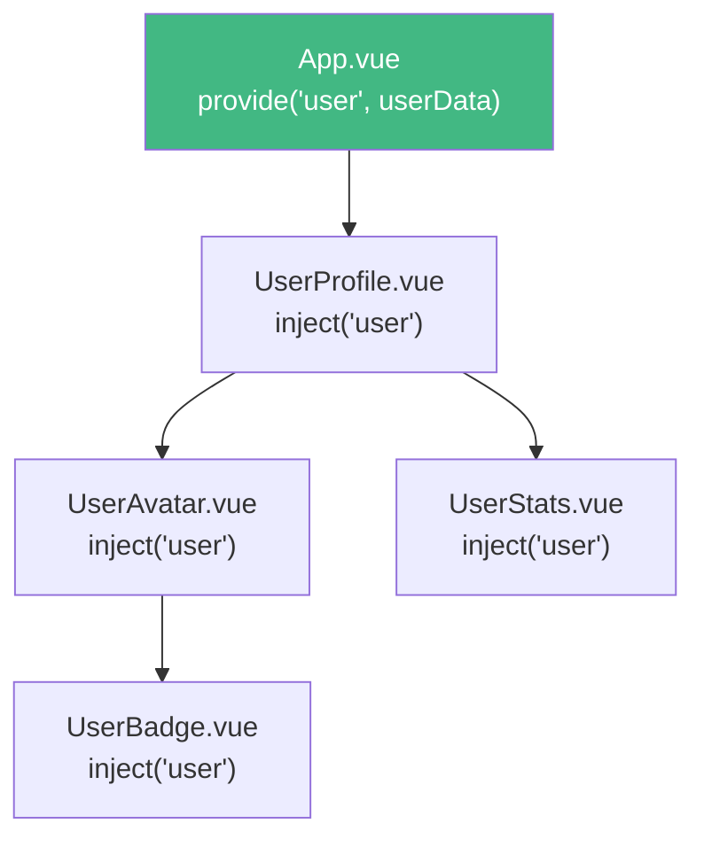

+++
title = "第8章 高级组件特性"
weight = 80
date = "2026-03-25T12:54:00+08:00"
type = "docs"
description = ""
isCJKLanguage = true
draft = false
+++

# 第八章 高级组件特性

> 学会基础组件只是入门，这一章我们来解决"进阶"的问题。动态组件、组件缓存、异步组件、DOM 瞬移、attribute 继承、递归组件、跨级通信……每一个都是 Vue 组件化开发中的"高级技能"。学完这一章，你对 Vue 组件的理解会上一个台阶。

## 8.1 动态组件

### 8.1.1 is 特性用法

有时候我们需要在多个组件之间**动态切换**——比如一个 Tab 页面，点击不同的 Tab 显示不同的内容。这在 Vue 里可以通过 `<component :is="...">` 来实现。

```vue
<script setup>
import { ref } from 'vue'
import HomePage from './pages/HomePage.vue'
import AboutPage from './pages/AboutPage.vue'
import ContactPage from './pages/ContactPage.vue'

// currentTab 控制显示哪个组件
const currentTab = ref('home')

// 定义所有可用的 Tab
const tabs = [
  { key: 'home', label: '首页', component: HomePage },
  { key: 'about', label: '关于', component: AboutPage },
  { key: 'contact', label: '联系', component: ContactPage }
]
</script>

<template>
  <div class="tab-container">
    <!-- Tab 导航 -->
    <div class="tab-nav">
      <button
        v-for="tab in tabs"
        :key="tab.key"
        :class="{ active: currentTab === tab.key }"
        @click="currentTab = tab.key"
      >
        {{ tab.label }}
      </button>
    </div>

    <!-- 动态组件：currentTab 变化时，自动切换渲染的组件 -->
    <component :is="tabs.find(t => t.key === currentTab)?.component" />
  </div>
</template>
```

### 8.1.2 component 标签配合 :is

`<component>` 是一个特殊的 Vue 内置组件，它本身不会渲染任何 HTML 元素——它只负责渲染"被 `is` 属性指定的那个组件"。

`:is` 可以是以下几种值：

1. **组件对象**：直接是组件本身（前面例子里的写法）
2. **组件名字符串**：已注册的组件名，比如 `'MyButton'`
3. **动态组件**：根据条件切换的组件

```vue
<script setup>
import { ref, markRaw } from 'vue'
import UserTable from './UserTable.vue'
import ProductTable from './ProductTable.vue'

const tableType = ref('user')

// markRaw 告诉 Vue"这个对象不需要是响应式的"
// 在切换很频繁的场景下，用 markRaw 可以避免不必要的响应式开销
const tables = {
  user: markRaw(UserTable),
  product: markRaw(ProductTable)
}
</script>

<template>
  <!-- :is 后面可以跟一个对象 -->
  <component :is="tables[tableType]" />

  <!-- 也可以传一个字符串（已注册的组件名） -->
  <!-- <component :is="'MyRegisteredComponent'" /> -->
</template>
```

### 8.1.3 组件切换动画

动态组件切换时，如果加上过渡动画，体验会好很多：

```vue
<script setup>
import { ref } from 'vue'
import HomePage from './HomePage.vue'
import AboutPage from './AboutPage.vue'
import ContactPage from './ContactPage.vue'
import FadeTransition from './FadeTransition.vue'

const tabs = [
  { key: 'home', component: HomePage },
  { key: 'about', component: AboutPage },
  { key: 'contact', component: ContactPage }
]

const currentTab = ref(tabs[0])
</script>

<template>
  <div>
    <button
      v-for="tab in tabs"
      :key="tab.key"
      @click="currentTab = tab"
    >
      {{ tab.key }}
    </button>

    <!-- transition 包裹动态组件，给组件切换加上动画 -->
    <Transition name="fade" mode="out-in">
      <component :is="currentTab.component" :key="currentTab.key" />
    </Transition>
  </div>
</template>

<style>
/* 淡入淡出动画 */
.fade-enter-active,
.fade-leave-active {
  transition: opacity 0.3s ease;
}

.fade-enter-from,
.fade-leave-to {
  opacity: 0;
}
</style>
```

`mode="out-in"` 的意思是：先让旧组件淡出，再让新组件淡入。这避免了两个组件同时出现在页面上的尴尬。

## 8.2 KeepAlive 缓存

### 8.2.1 include / exclude / max

`<KeepAlive>` 是 Vue 3 提供的一个内置组件，它的作用是**缓存组件实例**——被它包裹的组件在切换走时不会被销毁，而是被缓存起来，下次切换回来时直接从缓存恢复。

这对于**切换频繁**的场景（比如 Tab 切换、表单多步骤、列表到详情再返回）非常有用——用户之前填写的内容、滚动位置、播放状态等都可以保留，不需要重新加载。

```vue
<script setup>
import { ref } from 'vue'
import PageA from './PageA.vue'
import PageB from './PageB.vue'

const current = ref('a')
</script>

<template>
  <div>
    <button @click="current = 'a'">切换到 A</button>
    <button @click="current = 'b'">切换到 B</button>

    <!-- KeepAlive：包裹动态组件，切换时缓存而不是销毁 -->
    <KeepAlive>
      <component :is="current === 'a' ? PageA : PageB" />
    </KeepAlive>
  </div>
</template>
```

`KeepAlive` 有几个重要的 props：

**`include`**：只有匹配的组件名才会被缓存。可以是正则表达式或字符串数组。

```vue
<!-- 只有 name 为 Home 或 About 的组件才会被缓存 -->
<KeepAlive :include="['Home', 'About']">
  <component :is="currentComponent" />
</KeepAlive>

<!-- 也可以用正则 -->
<KeepAlive :include="/^(Home|About)$/">
  <component :is="currentComponent" />
</KeepAlive>
```

**`exclude`**：匹配的组件不会被缓存（优先级高于 include）。

```vue
<!-- 除了 UserProfile，其他组件都会被缓存 -->
<KeepAlive :exclude="['UserProfile']">
  <component :is="currentComponent" />
</KeepAlive>
```

**`max`**：最多缓存多少个组件实例。超过这个数量时，最久未使用的实例会被销毁。

```vue
<!-- 最多缓存 10 个组件实例 -->
<KeepAlive :max="10">
  <component :is="currentComponent" />
</KeepAlive>
```

### 8.2.2 onActivated / onDeactivated 生命周期

被 `<KeepAlive>` 包裹的组件会多出两个生命周期钩子：

- **`onActivated`**：组件被激活（从缓存中恢复）时调用
- **`onDeactivated`**：组件被停用（被缓存）时调用

```vue
<script setup>
import { ref, onMounted, onActivated, onDeactivated } from 'vue'

const scrollPosition = ref(0)
const videoRef = ref<HTMLVideoElement | null>(null)

onMounted(() => {
  console.log('组件首次挂载')
  videoRef.value?.play()
})

onActivated(() => {
  console.log('组件从缓存恢复了！')
  // 恢复播放位置
  if (videoRef.value) {
    videoRef.value.currentTime = scrollPosition.value
    videoRef.value.play()
  }
})

onDeactivated(() => {
  console.log('组件被缓存了！')
  // 保存播放位置
  if (videoRef.value) {
    scrollPosition.value = videoRef.value.currentTime
    videoRef.value.pause()
  }
})
</script>
```

### 8.2.3 缓存策略选择

选择正确的缓存策略对应用性能至关重要：

| 场景 | 策略 |
|------|------|
| Tab 切换（5 个以内） | `:include="['TabA', 'TabB', 'TabC', 'TabD', 'TabE']"` |
| 表单多步骤 | `:include="['Step1', 'Step2', 'Step3']"`，`max` 设置步骤数 |
| 列表到详情 | 列表不缓存，详情页用 `:include="['DetailPage']"` |
| 页面很多的大型应用 | `:max="10"`，让 Vue 自动管理 LRU 缓存 |
| 用户频繁切换的页面 | 不缓存，或设置较小的 `max` |

## 8.3 异步组件

### 8.3.1 defineAsyncComponent 用法

异步组件是**按需加载**的组件——它不会在页面加载时就下载，而是在第一次被使用时才加载。这可以大幅减少首屏加载时间。

```vue
<script setup>
import { defineAsyncComponent } from 'vue'

// 方式一：传入一个返回 Promise 的函数
// 当组件被渲染时，Vue 会自动调用这个函数，组件才开始加载
const HeavyChart = defineAsyncComponent(() =>
  import('./components/HeavyChart.vue')
)

// 方式二：传入一个配置对象，可以精细控制加载行为
const LazyModal = defineAsyncComponent({
  // 加载函数，必须返回 Promise
  loader: () => import('./components/Modal.vue'),
  // 加载中显示的组件（可以是内联组件）
  loadingComponent: LoadingSpinner,
  // 加载失败显示的组件
  errorComponent: ErrorFallback,
  // 延迟显示 loading 组件的时间（ms），避免闪烁
  delay: 200,
  // 超时时间（ms），超时显示 errorComponent
  timeout: 3000
})
</script>

<template>
  <!-- 只有当 showModal 为 true 时，Modal 才会被加载 -->
  <LazyModal v-if="showModal" @close="showModal = false" />
</template>
```

### 8.3.2 加载中 / 错误 / 超时状态

`defineAsyncComponent` 的配置对象完整版：

```vue
<script setup>
import { ref, defineAsyncComponent } from 'vue'
import LoadingSpinner from './LoadingSpinner.vue'
import ErrorRetry from './ErrorRetry.vue'

const DataTable = defineAsyncComponent({
  loader: async () => {
    // 模拟网络延迟
    await new Promise(resolve => setTimeout(resolve, 1000))
    // 模拟随机加载失败
    if (Math.random() > 0.7) {
      throw new Error('加载失败')
    }
    return await import('./components/DataTable.vue')
  },
  loadingComponent: {
    template: `<div class="loading"><LoadingSpinner />加载数据中...</div>`
  },
  errorComponent: {
    setup(props, { slots, emit }) {
      // error 是从父组件传入的错误对象
      return {
        template: `
          <div class="error">
            <p>加载失败：{{ error?.message }}</p>
            <button @click="$emit('retry')">重试</button>
          </div>
        `
      }
    }
  },
  delay: 300,        // 加载超过 300ms 才显示 loading
  timeout: 5000,     // 超过 5s 显示 error
  suspensible: false  // 是否受 Suspense 控制（默认 true）
})
</script>
```

### 8.3.3 Suspense 配合异步组件

Suspense 是 Vue 3 的另一个内置组件，它专门用来处理**异步依赖**——当异步组件还在加载时，显示 fallback 内容；加载完成后，替换成真正的组件。

```vue
<script setup>
import { defineAsyncComponent } from 'vue'

const AsyncUserList = defineAsyncComponent({
  loader: () => import('./UserList.vue'),
  loadingComponent: {
    template: `<div class="skeleton-list">
      <div class="skeleton-item" v-for="i in 5" :key="i"></div>
    </div>`
  }
})
</script>

<template>
  <div>
    <h1>用户列表</h1>

    <!-- Suspense 包裹异步组件 -->
    <Suspense>
      <!-- 主要内容：异步组件加载完成后显示这里 -->
      <template #default>
        <AsyncUserList />
      </template>

      <!-- 加载中显示这里 -->
      <template #fallback>
        <div class="loading-state">
          <p>正在加载用户数据...</p>
        </div>
      </template>
    </Suspense>
  </div>
</template>
```

Suspense + 异步组件的组合特别适合"需要同时加载多个异步组件"的场景，比如一个页面同时有侧边栏（异步）、主内容（异步）、推荐模块（异步），可以用一个 Suspense 把它们全部包裹，统一显示 loading 状态。

## 8.4 Teleport 瞬移组件

### 8.4.1 使用场景（模态框、Toast）

Teleport 的核心功能是：**把组件的 DOM 渲染到指定位置**，而不是它实际所在的位置。

最典型的应用场景是**模态框（Modal）**和 **Toast 通知**。

想象一个场景：你在 `<div class="modal-wrapper">` 里写了一个 Modal 组件，但这个 wrapper 的 `z-index` 很低，被页面上其他元素的 `z-index` 挡住了。解决方案是：把 Modal 的 HTML 直接瞬移到 `<body>` 下，这样它就不会受到父组件 `z-index` 的影响了。

```vue
<script setup>
import { ref } from 'vue'

const isModalOpen = ref(false)
</script>

<template>
  <div class="page">
    <button @click="isModalOpen = true">打开弹窗</button>

    <!-- 这个 div 是页面的某个子容器 -->
    <div class="content-area">
      <p>页面内容...</p>

      <!-- Teleport：把弹窗内容瞬移到 body 下 -->
      <Teleport to="body">
        <div v-if="isModalOpen" class="modal-overlay" @click.self="isModalOpen = false">
          <div class="modal">
            <h2>弹窗标题</h2>
            <p>我是弹窗内容，HTML 实际在 body 下，不受父容器 z-index 影响</p>
            <button @click="isModalOpen = false">关闭</button>
          </div>
        </div>
      </Teleport>
    </div>
  </div>
</template>

<style scoped>
.modal-overlay {
  position: fixed;
  top: 0;
  left: 0;
  width: 100%;
  height: 100%;
  background: rgba(0, 0, 0, 0.5);
  display: flex;
  justify-content: center;
  align-items: center;
}

.modal {
  background: white;
  padding: 24px;
  border-radius: 8px;
  max-width: 400px;
}
</style>
```

### 8.4.2 to 属性与目标容器

`Teleport` 的 `to` 属性指定了"目标容器"——可以是任何有效的 CSS 选择器字符串，也可以是 DOM 元素引用。

```vue
<!-- 瞬移到 body -->
<Teleport to="body">
  <Modal v-if="showModal" />
</Teleport>

<!-- 瞬移到指定 id 的元素 -->
<Teleport to="#modal-root">
  <Modal v-if="showModal" />
</Teleport>

<!-- 瞬移到 body 的某个结构下 -->
<Teleport to="body > div.toast-container">
  <Toast v-if="showToast" />
</Teleport>
```

### 8.4.3 禁用 Teleport

通过 `disabled` 属性可以禁用 Teleport——禁用时，内容会渲染在原地，不会被瞬移：

```vue
<!-- 当 isMobile 为 true 时，Teleport 不生效，弹窗渲染在当前位置 -->
<Teleport to="body" :disabled="isMobile">
  <Modal v-if="showModal" />
</Teleport>
```

这个特性在响应式开发中特别有用——桌面端可能需要把 Modal 瞬移到 body 以避免 z-index 问题，但移动端可能不需要这么做，通过 `disabled` 可以轻松控制。

## 8.5 $attrs 与多根节点

### 8.5.1 $attrs 包含的内容（class / style / 事件等）

Vue 组件有一种常见情况：父组件往子组件传了一些 props 或事件，但子组件没有用 `defineProps` 或 `defineEmits` 接收。这些没有被接收的 attributes 和事件，会被收集到 **`$attrs`** 对象里。

```vue
<!-- 父组件：往子组件传了一堆属性和事件 -->
<MyButton
  class="btn-primary"
  style="margin-top: 10px"
  type="submit"
  @click="handleClick"
  @focus="handleFocus"
  data-id="123"
/>
```

```vue
<!-- 子组件：只接收了 type，没接收 class/style/click/focus/data-id -->
<script setup>
defineProps<{ type?: string }>()
// $attrs 包含了：{ class: 'btn-primary', style: 'margin-top: 10px',
//                   'data-id': '123', onClick: handleClick, onFocus: handleFocus }
console.log(useAttrs()) // { class: ..., style: ..., 'data-id': ..., onClick: ..., onFocus: ... }
</script>
```

在 Vue 3 的 `<script setup>` 里，用 `useAttrs()` 获取 `$attrs` 对象（Vue 3.3+），或者直接用 `defineProps` 配合 `inheritAttrs: false` 来控制行为。

### 8.5.2 inheritAttrs 选项

默认情况下，Vue 会把 `$attrs` 里的 attributes 自动应用到子组件的**根元素**上。如果你不想让 attributes 应用到根元素，可以设置 `inheritAttrs: false`。

```vue
<!-- 子组件：MyButton.vue -->
<script setup lang="ts">
// 禁用 attribute 继承，$attrs 不会自动应用到根元素
defineProps<{ variant?: 'primary' | 'secondary' }>()
</script>

<template>
  <!-- 根元素是 button，但我们想让 class 应用在外层 div 上 -->
  <div class="button-wrapper">
    <button class="btn" :class="variant">
      <slot></slot>
    </button>
  </div>
</template>
```

```vue
<!-- 父组件 -->
<MyButton class="custom-class" data-id="123" />
<!-- 不设置 inheritAttrs: false 时，class 和 data-id 会应用到根元素 div 上 -->
<!-- 设置后，可以用 v-bind="$attrs" 手动控制应用位置 -->
```

```vue
<!-- 子组件：手动绑定 $attrs -->
<script setup>
defineProps<{ variant?: 'primary' | 'secondary' }>()
</script>

<template>
  <div class="button-wrapper" v-bind="$attrs">
    <!-- $attrs 里的 class/data-id 等会应用到这个 div 上 -->
    <button class="btn" :class="variant">
      <slot></slot>
    </button>
  </div>
</template>
```

### 8.5.3 多根节点组件的 attribute 继承

Vue 2 的组件**必须有且只有一个根节点**，多根节点不支持 attribute 继承。Vue 3 支持**多根节点组件**，但默认情况下，Vue 不知道把 attributes 应用到哪个根元素上，所以**不会自动继承**。

```vue
<!-- 多根节点组件：Vue 3 支持 -->
<template>
  <header>Header</header>
  <main>Main</main>
  <footer>Footer</footer>
</template>
```

```vue
<!-- 父组件往多根节点组件传 class -->
<MultiRootLayout class="layout-with-margin" />
<!-- 这种情况，class 不会自动应用到任何根元素上 -->
```

如果你想让某个根元素接收 attributes，需要用 `v-bind` 手动绑定：

```vue
<template>
  <header v-bind="$attrs">Header</header>
  <main>Main</main>
  <footer>Footer</footer>
</template>
```

## 8.6 递归组件

组件可以在自己的模板里**引用自己**——这就是递归组件。递归组件常用于**树形结构**（文件夹树、部门组织树、评论嵌套等）。

```vue
<!-- FolderTree.vue —— 文件夹树组件，可以递归显示嵌套结构 -->
<script setup lang="ts">
interface TreeNode {
  name: string
  type: 'folder' | 'file'
  children?: TreeNode[]
}

defineProps<{
  node: TreeNode
  depth?: number
}>()

const depth = defineProps<{ depth?: number }>().depth ?? 0
</script>

<template>
  <div class="tree-node" :style="{ paddingLeft: `${depth * 16}px` }">
    <div class="node-label">
      <span v-if="node.type === 'folder'">📁 </span>
      <span v-else>📄 </span>
      {{ node.name }}
    </div>

    <!-- 如果是文件夹且有子节点，递归渲染自己 -->
    <template v-if="node.type === 'folder' && node.children">
      <FolderTree
        v-for="child in node.children"
        :key="child.name"
        :node="child"
        :depth="depth + 1"
      />
    </template>
  </div>
</template>
```

```vue
<!-- 使用递归组件 -->
<script setup>
const folderData = {
  name: 'root',
  type: 'folder',
  children: [
    {
      name: 'src',
      type: 'folder',
      children: [
        { name: 'main.ts', type: 'file' },
        { name: 'App.vue', type: 'file' }
      ]
    },
    {
      name: 'package.json',
      type: 'file'
    }
  ]
}
</script>

<template>
  <FolderTree :node="folderData" />
</template>
```

递归组件在 Vue 内部会自动处理——组件在自己的模板里引用自己，Vue 会正确地递归渲染。**注意**：递归组件必须有明确的 `name`（在 `<script>` 里写 `name: 'FolderTree'`），否则 Vue 在运行时可能找不到自己。

## 8.7 依赖注入（Provide / Inject）

### 8.7.1 provide / inject 使用

在一个组件树里，如果有多层嵌套（比如 `App → UserProfile → UserAvatar → UserBadge`），要传递一个 prop 从 App 一路传到 UserBadge，需要每一层都声明 prop 一路往下传——这叫"prop drilling"（prop 逐级穿透），非常繁琐。

`provide` / `inject` 就是来解决这个问题的。它们允许**祖先组件向所有后代组件"广播"数据**，不需要逐层传递。



```vue
<!-- 祖先组件：App.vue -->
<script setup>
import { provide, ref } from 'vue'

const userData = ref({ name: '小明', role: 'admin' })

// provide 的第一个参数是"键名"，第二个是"值"
provide('user', userData)
provide('theme', 'dark')  // 可以 provide 多个
</script>

<template>
  <UserProfile />
</template>
```

```vue
<!-- 后代组件：UserBadge.vue -->
<script setup>
import { inject } from 'vue'

// inject 接收一个键名，返回 provide 的值
const user = inject('user')
const theme = inject('theme')

console.log(user.value.name)  // 小明
console.log(theme)           // dark
</script>

<template>
  <span class="badge">{{ user.name }}</span>
</template>
```

### 8.7.2 响应式 provide/inject

`provide` 的值如果本身是响应式的（比如 `ref` 或 `reactive`），那么 `inject` 拿到的值也是响应式的——当祖先组件修改数据时，后代组件会自动更新。

```vue
<!-- 祖先组件 -->
<script setup>
import { ref, provide } from 'vue'

const count = ref(0)

// provide 响应式数据
provide('count', count)

// 或者 provide 一个 reactive 对象
provide('userState', reactive({
  name: '小明',
  age: 25
}))
</script>
```

```vue
<!-- 后代组件 -->
<script setup>
import { inject } from 'vue'

const count = inject('count')
const userState = inject('userState')

// 都是响应式的！
// count.value++ → 后代组件会自动更新
// userState.age = 30 → 后代组件也会自动更新
</script>
```

### 8.7.3 使用场景与注意事项

**适合用 provide/inject 的场景：**

- 全局配置数据（主题、语言设置、用户信息）
- 全局状态（购物车数量、登录状态）
- 需要跨多层传递的上下文数据

**注意事项：**

1. **provide/inject 不是响应式的替代品**——它们只是避免了 prop drilling。如果后代组件需要修改数据，还是应该通过事件或其他方式让祖先组件来修改（provide/inject 传递的是引用，后代组件直接改也能改，但会违反单向数据流原则）。
2. **provide/inject 没有类型安全的保障**——inject 的键名是字符串，如果键名写错了，运行时才会发现。可以用 Symbol 作为键名来减少冲突。
3. **避免滥用**——如果只是父子通信，用 props + emit 就够了；provide/inject 主要用于"真正需要跨多层传递"的场景。

```typescript
// 用 Symbol 作为 provide/inject 的键，减少命名冲突
const USER_KEY = Symbol('user')
const THEME_KEY = Symbol('theme')

// 祖先组件
provide(USER_KEY, userData)

// 后代组件
const user = inject(USER_KEY)
```

---

## 本章小结

本章我们学习了 Vue 的高级组件特性：

- **动态组件**：`<component :is="...">` 实现组件动态切换，配合 `<Transition>` 加动画效果。
- **KeepAlive 缓存**：缓存组件实例避免重复创建，`include/exclude/max` 控制缓存策略，`onActivated/onDeactivated` 响应缓存生命周期。
- **异步组件**：`defineAsyncComponent` 实现按需加载，配合 loading/error/timeout 状态处理，`<Suspense>` 统一处理异步依赖的加载状态。
- **Teleport 瞬移**：把 DOM 渲染到任意位置，`to` 属性指定目标容器，常用于 Modal 和 Toast。
- **$attrs 与多根节点**：`$attrs` 收集未声明的 attributes，`inheritAttrs: false` 控制继承行为，多根节点组件需要手动 `v-bind="$attrs"`。
- **递归组件**：在模板里引用自己，适合树形结构展示，需要给组件命名。
- **依赖注入**：provide/inject 解决 prop drilling 问题，响应式数据自动同步到所有后代，Symbol 作为键名更安全。

下一章我们会深入 **Composition API 深入**——setup 函数、script setup 语法糖、编译器宏等，这是 Vue 3 最核心的编程模式！

