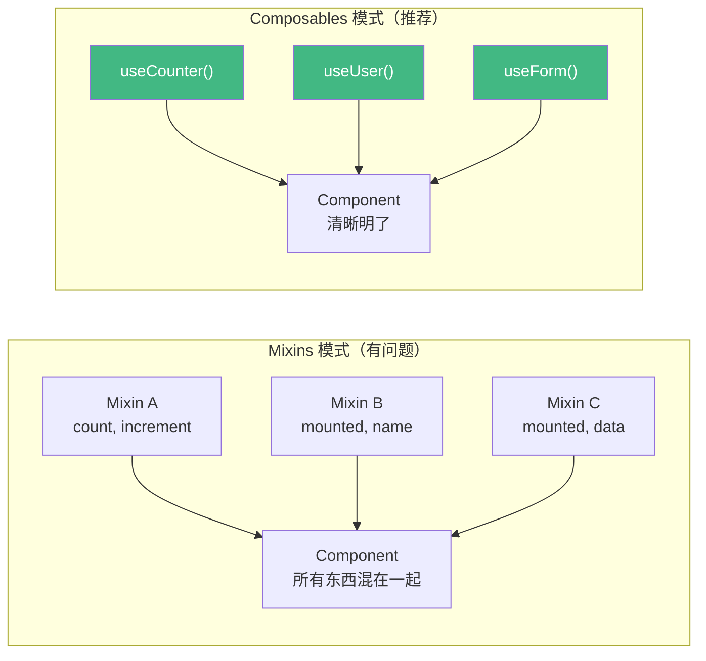

+++
title = "第11章 组合式函数（Composables）"
weight = 110
date = "2026-03-25T12:54:00+08:00"
type = "docs"
description = ""
isCJKLanguage = true
draft = false
+++

# 第十一章 组合式函数（Composables）

> Composables（组合式函数）是 Vue 3 最重要的代码复用模式。如果说 Props/Emit/Slots 是组件级别的复用，那 Composables 就是"逻辑级别的复用"——把相关的逻辑抽取到独立的函数里，让组件保持简洁和专注。这一章我们会深入学习如何编写 Composables，以及 VueUse 等常用组合式库。

## 11.1 什么是 Composables

Composables（组合式函数）是 Vue 3 从Hooks（React）和 Custom Hooks 汲取了灵感，结合 Vue 的响应式系统，创造出的一种代码复用模式。本质上，Composable 就是一个**返回响应式状态的函数**。

**为什么需要 Composables？**

在 Composition API 出现之前，Vue 用 Mixins 来复用逻辑。但 Mixins 有三个致命问题：

1. **来源不清晰**：一个组件用了多个 Mixins，某个方法是哪个 Mixin 里的，搞不清楚。
2. **命名冲突**：多个 Mixin 都定义了 `mounted` 钩子，两个钩子都会被调用，但顺序不透明。
3. **隐式耦合**：Mixins 之间可能相互依赖，但这种依赖是隐式的，不写在代码里。

Composables 解决了这些问题：



## 11.2 抽取逻辑的最佳实践

什么时候应该抽取一个 Composable？遵循一个原则：**当一段逻辑在多个组件里出现时，就应该抽取。**

常见的抽取场景：
- 数据获取（`useFetch`、`useAsyncData`）
- 状态管理（`useUser`、`useCart`）
- DOM 操作（`useElementSize`、`useScrollPosition`）
- 浏览器 API（`useLocalStorage`、`useMediaQuery`、`useNetwork`）
- 事件监听（`useEventListener`、`useWindowResize`）

## 11.3 编写 Composables

### 11.3.1 命名规范（useXxx）

Composables 的命名有一个约定俗成的规范：**`use` 前缀 + 功能名**。

```typescript
// ✅ 好的命名
useCounter()
useUser()
useLocalStorage()
useEventListener()
useFetch()

// ❌ 不好的命名
counter()
getUserData()
LocalStorageManager()
```

`use` 前缀让 IDE 和其他开发者一眼就能识别："这是一个 Composable，它会返回响应式状态。"

### 11.3.2 同步 Composables

同步 Composable 是最常见的类型——它返回响应式状态，不涉及异步操作。

```typescript
// useCounter.ts
import { ref, computed } from 'vue'

export function useCounter(initialValue = 0) {
  const count = ref(initialValue)

  function increment() {
    count.value++
  }

  function decrement() {
    count.value--
  }

  function reset() {
    count.value = initialValue
  }

  const doubled = computed(() => count.value * 2)

  return {
    count,
    increment,
    decrement,
    reset,
    doubled
  }
}
```

```vue
<!-- 组件里使用 -->
<script setup>
import { useCounter } from './composables/useCounter'

const { count, increment, decrement, reset, doubled } = useCounter(10)
</script>

<template>
  <div>
    <p>计数：{{ count }}</p>
    <p>双倍：{{ doubled }}</p>
    <button @click="increment">+1</button>
    <button @click="decrement">-1</button>
    <button @click="reset">重置</button>
  </div>
</template>
```

### 11.3.3 异步 Composables（async/await）

异步 Composable 用于数据获取等异步操作。

```typescript
// useUser.ts
import { ref } from 'vue'

export function useUser(userId: MaybeRef<string>) {
  const user = ref<User | null>(null)
  const isLoading = ref(false)
  const error = ref<Error | null>(null)

  async function fetchUser() {
    isLoading.value = true
    error.value = null

    try {
      const id = isRef(userId) ? userId.value : userId
      const response = await fetch(`/api/users/${id}`)
      if (!response.ok) throw new Error('获取用户失败')
      user.value = await response.json()
    } catch (err) {
      error.value = err as Error
    } finally {
      isLoading.value = false
    }
  }

  // 可选：初始加载一次
  // fetchUser()

  return {
    user,
    isLoading,
    error,
    fetchUser
  }
}
```

```vue
<script setup>
import { watch } from 'vue'
import { useUser } from './composables/useUser'

const props = defineProps<{ userId: string }>()

const { user, isLoading, error, fetchUser } = useUser(
  () => props.userId  // getter 函数，响应式追踪
)

watch(() => props.userId, () => fetchUser(), { immediate: true })
</script>
```

### 11.3.4 返回状态与方法的规范

Composable 返回的内容应该是"有意义的单元"——返回什么、不返回什么，需要有清晰的界限。

**规范一：返回状态和操作状态的方法，不要返回中间变量**

```typescript
// ✅ 好的：返回完整的状态操作集
function useCounter() {
  const count = ref(0)
  function increment() { count.value++ }
  function decrement() { count.value-- }
  function reset() { count.value = 0 }
  return { count, increment, decrement, reset }
}

// ❌ 不好的：把内部变量也暴露出来
function useCounter() {
  const count = ref(0)
  const _internalState = reactive({ temp: 0 })  // 不应该暴露
  return { count, _internalState }
}
```

**规范二：响应式状态要作为返回值返回**

```typescript
// ✅ 好的：ref/reactive 对象作为返回值
function useLocalStorage(key: string, defaultValue: any) {
  const data = ref(localStorage.getItem(key) ?? defaultValue)
  // ...
  return { data }
}

// ❌ 不好的：直接修改原始值，不返回状态
function useLocalStorage(key: string, defaultValue: any) {
  const data = ref(localStorage.getItem(key) ?? defaultValue)
  // 修改后直接写回 localStorage，但不返回 data
  // 组件无法依赖这个 ref 做响应式更新
}
```

### 11.3.5 接收参数（getter 函数）

Composable 的参数如果是响应式的，应该接受一个 **getter 函数**（返回值是响应式的函数），而不是直接接受一个响应式值。这样 Composable 内部可以更灵活地响应变化。

```typescript
// ✅ 好的：接收 getter 函数
function useUser(userId: () => string | MaybeRef<string>) {
  // ...
}

// ✅ 或者接收 MaybeRef
function useUser(userId: MaybeRef<string>) {
  // ...
}

// ❌ 不好的：直接接收响应式对象
function useUser(userId: Ref<string>) {
  // 如果用户传 computed，类型就不匹配了
}
```

## 11.4 常用 Composables

### 11.4.1 useThrottleFn / useDebounceFn

防抖和节流是前端最常用的性能优化技术。VueUse 提供了开箱即用的实现：

```typescript
import { ref } from 'vue'
import { useDebounceFn, useThrottleFn } from '@vueuse/core'

const searchQuery = ref('')

// 防抖：等用户停止输入 300ms 后才执行
const debouncedSearch = useDebounceFn((query: string) => {
  console.log('执行搜索：', query)
  fetchResults(query)
}, 300)

// 节流：每 200ms 最多执行一次
const throttledScroll = useThrottleFn(() => {
  console.log('滚动位置：', window.scrollY)
  saveScrollPosition()
}, 200)

// 在模板里使用
// @input="debouncedSearch($event.target.value)"
// @scroll="throttledScroll"
```

### 11.4.2 useLocalStorage / useSessionStorage

把数据持久化到浏览器 localStorage/sessionStorage，同时保持响应式：

```typescript
import { useLocalStorage, useSessionStorage } from '@vueuse/core'

// 自动同步到 localStorage，页面刷新后数据还在
const username = useLocalStorage('username', '小明')
const theme = useLocalStorage<'light' | 'dark'>('theme', 'light')

// sessionStorage 只在当前标签页有效
const currentDraft = useSessionStorage('draft', '')

// 都是响应式的，改了自动同步到存储
username.value = '小红'  // localStorage 里也更新了
```

### 11.4.3 useEventListener

自动管理事件监听器，避免手动 addEventListener/removeEventListener：

```typescript
import { ref, onMounted, onUnmounted } from 'vue'
import { useEventListener } from '@vueuse/core'

// 方式一：在 setup 里直接用，自动在 unmount 时移除监听
export default {
  setup() {
    const x = ref(0)
    const y = ref(0)

    useEventListener('mousemove', (e: MouseEvent) => {
      x.value = e.clientX
      y.value = e.clientY
    })

    // 监听键盘事件
    useEventListener('keydown', (e: KeyboardEvent) => {
      if (e.key === 'Escape') {
        console.log('按了 Esc')
      }
    })

    return { x, y }
  }
}

// 方式二：监听特定元素（需要在元素存在后才能调用）
const containerRef = ref<HTMLElement | null>(null)

useEventListener(containerRef, 'scroll', () => {
  console.log('容器滚动了')
}, { passive: true })
```

### 11.4.4 useFetch

VueUse 的 `useFetch` 是一个强大的数据获取 Composable，封装了 fetch 的所有常用场景：

```typescript
import { useFetch } from '@vueuse/core'

// 最简用法
const { data, isFinished, error } = useFetch('/api/users')

// 带参数：自动拼接 query、配置请求头、设置超时
const { data: user, isFetching, error: fetchError } = useFetch('/api/users/1', {
  headers: { Authorization: 'Bearer token' },
  timeout: 5000,
  immediate: false  // 不立即执行，需要手动 call()
})

// 带转换函数
const { data: posts } = useFetch('/api/posts', {
  transform: (data) => JSON.parse(data).posts,  // 自动转换响应数据
  refetch: true  // 依赖变化时重新获取
})

// reactive 依赖：自动重新获取
const userId = ref(1)
const { data: userProfile } = useFetch(`/api/users/${userId}`, {
  watch: [userId]  // userId 变化时自动重新获取
})
```

### 11.4.5 useResizeObserver

监听元素尺寸变化：

```typescript
import { ref } from 'vue'
import { useResizeObserver } from '@vueuse/core'

const containerRef = ref<HTMLElement | null>(null)
const size = ref({ width: 0, height: 0 })

useResizeObserver(containerRef, (entries) => {
  const entry = entries[0]
  size.value = {
    width: entry.contentRect.width,
    height: entry.contentRect.height
  }
})

// 响应式获取元素尺寸
const { width, height } = size.value
```

### 11.4.6 useIntersectionObserver

监听元素是否进入视口，常用于"懒加载"和"无限滚动"：

```typescript
import { ref } from 'vue'
import { useIntersectionObserver } from '@vueuse/core'

const loadMoreRef = ref<HTMLElement | null>(null)

useIntersectionObserver(
  loadMoreRef,
  ([{ isIntersecting }]) => {
    if (isIntersecting) {
      console.log('元素进入视口，加载更多')
      loadMore()
    }
  },
  { threshold: 0.1 }  // 10% 进入视口就触发
)
```

### 11.4.7 useNetwork

获取网络连接状态：

```typescript
import { useNetwork } from '@vueuse/core'

const { isOnline, isWifi, saveData, downlink, effectiveType } = useNetwork()

console.log(isOnline ? '在线' : '离线')
console.log('连接类型：', effectiveType.value)  // '4g' / '3g' / '2g' / 'slow-2g'
```

### 11.4.8 useMediaQuery

监听媒体查询：

```typescript
import { useMediaQuery } from '@vueuse/core'

const isLargeScreen = useMediaQuery('(min-width: 1024px)')
const isDarkMode = useMediaQuery('(prefers-color-scheme: dark)')

// 都是响应式的，窗口大小变化时自动更新
console.log(isLargeScreen.value ? '大屏幕' : '小屏幕')
```

## 11.5 Composables 目录结构规范

一个规范的 Composables 目录结构：

```
src/
├── composables/
│   ├── index.ts           # 统一导出，方便导入
│   ├── useCounter.ts
│   ├── useUser.ts
│   ├── useLocalStorage.ts
│   └── useWindowSize.ts
```

```typescript
// src/composables/index.ts
// 统一导出，方便其他组件一次性导入多个
export { useCounter } from './useCounter'
export { useUser } from './useUser'
export { useLocalStorage } from './useLocalStorage'
export { useWindowSize } from './useWindowSize'
```

```typescript
// 组件里导入
import { useCounter, useUser } from '@/composables'
```

## 11.6 Composables vs Mixin vs HOC vs Render Props

### 11.6.1 四种模式对比

| 模式 | Vue 支持 | 代码复用方式 | 来源清晰 | 性能 |
|------|----------|------------|---------|------|
| Mixins | Vue 2/3 | 混入对象 | ❌ | 一般 |
| HOC | React 风格 | 高阶组件包装 | ✅ | 较差 |
| Render Props | React 风格 | prop 传入渲染函数 | ✅ | 较好 |
| Composables | Vue 3 | 组合函数返回状态 | ✅ | 最好 |

### 11.6.2 何时选择哪种模式

- **Composables**：Vue 3 的首选，几乎所有场景都适合。
- **Mixin**：Vue 2 项目迁移，或者不想用 Composition API 的老项目。
- **HOC / Render Props**：从 React 迁移过来的项目，或者团队已经熟悉这些模式。

Composables 之所以是 Vue 3 的最佳选择，是因为：
1. 来源清晰（哪个 Composable，一目了然）
2. 无嵌套（不会像 Mixin 那样层层嵌套）
3. 灵活（可以组合多个 Composable）
4. TypeScript 支持好（类型推断准确）
5. 打包时更好的 tree-shaking

---

## 本章小结

本章我们深入学习了 Vue 3 的 Composables 模式：

- **什么是 Composables**：返回响应式状态的函数，本质是"带状态的纯函数"。
- **命名规范**：`useXxx` 前缀，IDE 友好，语义清晰。
- **编写规范**：返回有意义的状态和操作，不暴露中间变量，参数尽量用 getter 函数。
- **异步 Composables**：封装数据获取逻辑，返回 loading/error/data 状态。
- **VueUse**：Vue 官方维护的 Composables 工具库，提供了 200+ 开箱即用的 Composable。
- **Composables vs Mixin**：Composables 来源清晰、无隐式耦合，是更好的代码复用方案。

下一章我们会学习 **Vue Router 4**——Vue 官方路由管理器，它是构建单页应用（SPA）的核心基础设施。路由参数、嵌套路由、导航守卫、编程式导航……这些是 Vue 开发者必备的技能！

