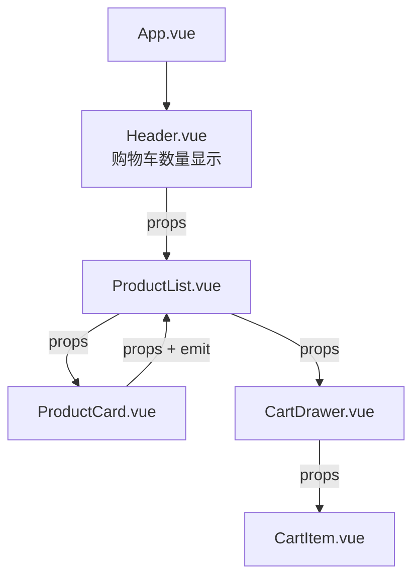

+++
title = "第13章 Pinia 状态管理"
weight = 130
date = "2026-03-25T12:54:00+08:00"
type = "docs"
description = ""
isCJKLanguage = true
draft = false
+++

# 第十三章 Pinia 状态管理

> 当应用规模变大，组件之间需要共享的数据会越来越多——用户登录信息、全局主题配置、购物车内容、通知列表……这些数据放在组件里会导致层层 props 穿透，放全局变量会失去响应式。Pinia 就是来解决这个问题的。Pinia 是 Vue 官方推荐的新一代状态管理库，它比 Vuex 更简洁、更 TypeScript 友好，是 Vue 3 项目的不二之选。

## 13.1 什么是状态管理

### 13.1.1 为什么需要 Pinia

想象一个场景：你的应用有一个**购物车**功能。购物车的商品列表在多个页面都需要展示——商品列表页、商品详情页、结算页、头部导航栏。不用状态管理的话，每个页面都要 props 层层传递，代码会变成这样噩梦般的结构：



这种层层传递叫 **prop drilling**，组件被 props 穿透得千疮百孔，而且 props 路径上经过的中间组件可能根本不需要这些数据。

**Pinia**（以及它的前身 Vuex）就是来解决这个问题的——把全局需要共享的数据放到一个"仓库"（store）里，所有组件想用就用，不需要层层传递。

### 13.1.2 Pinia vs Vuex vs 组件直接通信

| 方案 | 适用场景 | 复杂度 | 推荐度 |
|------|---------|--------|--------|
| 组件直接通信（props + emit） | 父子通信，数据不需要共享 | 低 | ✅ 父子通信首选 |
| Provide / Inject | 跨多层共享，不需要全局 | 低 | ✅ 局部的全局状态 |
| Pinia | 全局共享，复杂应用 | 中 | ✅ Vue 3 推荐 |
| Vuex | 全局共享（Vue 2 / 旧项目） | 高 | ⚠️ Vue 2 项目 |

Pinia 相比 Vuex 的核心优势：API 更简单（去掉了 mutation、module 的嵌套结构），支持 TypeScript 的完美类型推导，体积更小（< 1KB）。

## 13.2 快速上手

### 13.2.1 安装与配置

```bash
pnpm add pinia
```

```typescript
// src/main.ts
import { createPinia } from 'pinia'
import App from './App.vue'

const app = createApp(App)

app.use(createPinia())  // 注册 Pinia

app.mount('#app')
```

### 13.2.2 创建第一个 Store

Pinia 的 Store 用**选项式**和**setup 语法**两种写法都可以。

**选项式写法（类似 Vuex）：**

```typescript
// src/stores/counter.ts
import { defineStore } from 'pinia'

// defineStore() 第一个参数是 store 的唯一 ID（必须唯一！）
// 第二个参数是 store 的定义（可以是对象或函数）
export const useCounterStore = defineStore('counter', {
  // state：定义响应式状态数据（相当于 Vue 2 的 data）
  // 必须是一个返回函数的箭头函数 () => ({})，不能是普通对象
  // 这样 Pinia 能追踪其中的响应式数据
  state: () => ({
    count: 0,  // 计数器当前值
    step: 1     // 每次增加/减少的步长
  }),

  // getters：计算属性（相当于 Vue 2 的 computed）
  // Pinia 的 getter 会自动缓存（当依赖的 state 没变时，不会重新计算）
  getters: {
    // state 是 Pinia 自动注入的第一个参数，不用 import
    doubled: (state) => state.count * 2,  // count * 2，访问方式：store.doubled
    triple: (state) => state.count * 3   // count * 3，访问方式：store.triple
  },

  // actions：修改 state 的方法（相当于 Vue 2 的 methods）
  // actions 里可以写同步或异步逻辑
  // 注意：getters 可以通过 this.访问其他 getters，state 通过 this. 访问 state
  actions: {
    increment() {
      this.count += this.step  // this 指向整个 store 实例
    },
    decrement() {
      this.count -= this.step
    },
    reset() {
      this.count = 0
    }
  }
})
```

**setup 语法写法（更接近 Composition API）：**

```typescript
// src/stores/counter.ts
import { defineStore } from 'pinia'
import { ref, computed } from 'vue'

export const useCounterStore = defineStore('counter', () => {
  // state
  const count = ref(0)
  const step = ref(1)

  // getters
  const doubled = computed(() => count.value * 2)
  const triple = computed(() => count.value * 3)

  // actions
  function increment() {
    count.value += step.value
  }

  function decrement() {
    count.value -= step.value
  }

  function reset() {
    count.value = 0
  }

  return { count, step, doubled, triple, increment, decrement, reset }
})
```

### 13.2.3 在组件中使用 Store

```vue
<script setup>
import { useCounterStore } from '@/stores/counter'

// 一行代码获取 store
const counterStore = useCounterStore()

// 访问 state
console.log(counterStore.count)  // 0

// 访问 getter
console.log(counterStore.doubled)  // 0

// 调用 action
counterStore.increment()

// 直接修改 state（Pinia 支持直接修改，比 Vuex 的 mutation 灵活）
counterStore.count = 10
</script>

<template>
  <div>
    <p>计数：{{ counterStore.count }}</p>
    <p>双倍：{{ counterStore.doubled }}</p>
    <button @click="counterStore.increment">+1</button>
  </div>
</template>
```

### 13.2.4 Store 目录结构规范

```
src/
├── stores/
│   ├── index.ts          # 统一导出
│   ├── counter.ts        # counter store
│   ├── user.ts           # user store
│   ├── cart.ts           # cart store
│   └── settings.ts        # settings store
```

```typescript
// src/stores/index.ts
export { useCounterStore } from './counter'
export { useUserStore } from './user'
export { useCartStore } from './cart'
export { useSettingsStore } from './settings'
```

## 13.3 State

### 13.3.1 定义与读取（直接访问 / storeToRefs）

Pinia 的 state 是响应式的，组件里访问时直接用 `store.xxx` 即可。

```typescript
// 选项式 store
state: () => ({
  count: 0,
  name: '小明',
  items: [] as string[]
})

// setup 语法
const count = ref(0)
```

**storeToRefs**：当你需要解构 store 的属性时，用 `storeToRefs` 保持响应式：

```typescript
import { storeToRefs } from 'pinia'
import { useCounterStore } from '@/stores/counter'

const counterStore = useCounterStore()

// 直接解构会丢失响应式
// const { count } = counterStore  // ❌ count 不是响应式的

// 用 storeToRefs 解构，保持响应式
const { count, doubled } = storeToRefs(counterStore)

// actions 可以直接解构，不需要 storeToRefs
const { increment } = counterStore
```

### 13.3.2 重置 state

```typescript
// 选项式：调用 $reset() 方法（只有选项式写法有这个方法）
counterStore.$reset()

// setup 语法：自己实现 reset
function reset() {
  count.value = 0
}
```

### 13.3.3 修改 state（直接修改 vs $patch）

Pinia 支持两种修改 state 的方式：

```typescript
// 方式一：直接修改（最简单）
counterStore.count = 10

// 方式二：$patch（适合批量修改）
counterStore.$patch({
  count: 20,
  name: '小红'
})

// 方式三：$patch 接收函数（适合复杂逻辑）
cartStore.$patch((state) => {
  state.items.push({ id: Date.now(), name: '新商品', price: 99 })
  state.total = state.items.reduce((sum, item) => sum + item.price, 0)
})
```

### 13.3.4 $patch（对象 / 函数两种写法）

```typescript
// 对象写法：适合批量更新多个字段
store.$patch({ count: 0, name: '重置' })

// 函数写法：适合复杂的状态计算
store.$patch((state) => {
  // 可以做任何逻辑
  state.history.push(state.current)
})
```

## 13.4 Getters

### 13.4.1 基本用法

**选项式 getters：**

```typescript
getters: {
  doubled: (state) => state.count * 2,
  greeting: (state) => `你好，${state.name}！`
}
```

**setup 语法：**

```typescript
const doubled = computed(() => count.value * 2)
const greeting = computed(() => `你好，${name.value}！`)
```

### 13.4.2 访问其他 getter

**选项式：**

```typescript
getters: {
  doubled: (state) => state.count * 2,
  quadruple: (state) => state.doubled * 2  // 访问其他 getter
}
```

**setup 语法：**直接在 computed 里引用即可，因为 computed 是在同一个函数作用域里。

### 13.4.3 返回函数（参数化 getter）

```typescript
// 选项式：getter 可以返回一个函数
getters: {
  getItemById: (state) => {
    return (id: number) => state.items.find(item => item.id === id)
  }
}

// 使用
const item = userStore.getItemById(1)
```

### 13.4.4 缓存机制

Pinia 的 getter 和 Vue 的 computed 一样，**有缓存机制**——只有当依赖的 state 变化时才会重新计算，多次访问同一个 getter 不会重复计算。

## 13.5 Actions

### 13.5.1 同步 Actions

```typescript
// 选项式
actions: {
  increment() {
    this.count++
  },
  setName(name: string) {
    this.name = name
  }
}

// setup 语法
function setName(name: string) {
  name.value = name
}
```

### 13.5.2 异步 Actions

Pinia 的 actions 完美支持 async/await：

```typescript
// 选项式
actions: {
  async fetchUser(id: string) {
    this.isLoading = true
    try {
      const user = await api.getUser(id)
      this.currentUser = user
    } catch (err) {
      this.error = err as Error
    } finally {
      this.isLoading = false
    }
  }
}
```

### 13.5.3 async/await 使用

```typescript
// setup 语法
async function fetchUser(id: string) {
  isLoading.value = true
  try {
    const user = await api.getUser(id)
    currentUser.value = user
  } catch (err) {
    error.value = err as Error
  } finally {
    isLoading.value = false
  }
}

// 组件里调用
async function loadUser() {
  await userStore.fetchUser('123')
}
```

### 13.5.4 Actions 相互调用

同一个 store 里，action 可以直接调用其他 action：

```typescript
// 选项式
actions: {
  async fetchUserData(id: string) {
    this.isLoading = true
    await this.fetchUser(id)          // 调用其他 action
    await this.fetchUserPosts(id)     // 调用另一个 action
    this.isLoading = false
  }
}
```

### 13.5.5 $onAction 监听 Actions

Pinia 提供 `$onAction` 来监听 store 里 action 的执行：

```typescript
const store = useCounterStore()

store.$onAction(({ name, args, after, onError }) => {
  console.log(`Action "${name}" 即将执行，参数：`, args)

  after((returnValue) => {
    console.log(`Action "${name}" 执行完成，返回值：`, returnValue)
  })

  onError((error) => {
    console.error(`Action "${name}" 执行出错：`, error)
  })
})
```

## 13.6 Store 解构与响应式

### 13.6.1 storeToRefs 的使用

Pinia 的 store 是响应式的 Proxy，直接解构会丢失响应式。用 `storeToRefs` 可以保持解构后的值仍然是响应式的。

```typescript
import { storeToRefs } from 'pinia'
import { useUserStore } from '@/stores/user'

const userStore = useUserStore()

// 解构 state 和 getters 用 storeToRefs
const { name, age, isAdult } = storeToRefs(userStore)

// 解构 actions 不需要 storeToRefs
const { setName, fetchUser } = userStore
```

### 13.6.2 解构后响应式丢失问题

```typescript
// ❌ 错误：直接解构，响应式丢失
const { count } = useCounterStore()
count.value++  // 不生效！

// ✅ 正确：解构后仍然是 ref
const { count } = storeToRefs(useCounterStore())
count.value++  // 生效
```

### 13.6.3 setup 语法糖中使用 Store

```vue
<script setup>
import { useUserStore } from '@/stores/user'
import { storeToRefs } from 'pinia'

const userStore = useUserStore()

// state 和 getters 用 storeToRefs
const { name, isLoggedIn } = storeToRefs(userStore)

// actions 直接用
const login = userStore.login
const logout = userStore.logout
</script>
```

## 13.7 模块化

### 13.7.1 多模块划分

Pinia 不需要像 Vuex 那样嵌套 module，直接创建多个 store 文件即可：

```typescript
// stores/user.ts
export const useUserStore = defineStore('user', {
  state: () => ({ name: '', token: '' }),
  actions: { login() { ... } }
})

// stores/cart.ts
export const useCartStore = defineStore('cart', {
  state: () => ({ items: [], total: 0 }),
  actions: { addItem() { ... } }
})
```

### 13.7.2 setup Store 写法

setup 语法写法天然支持"模块化"——每个 store 就是一个独立函数，不需要额外配置。

### 13.7.3 模块间相互调用

```typescript
// stores/cart.ts
export const useCartStore = defineStore('cart', () => {
  const { isLoggedIn } = storeToRefs(useUserStore())

  function checkout() {
    if (!isLoggedIn.value) {
      // 调用其他 store
      useUserStore().showLoginModal()
      return false
    }
    // 正常结账
    return true
  }

  return { checkout }
})
```

## 13.8 插件机制

### 13.8.1 Pinia 插件介绍

Pinia 支持插件机制，可以用来扩展 store 的功能，比如持久化、本地存储同步等。

Pinia 插件的本质是一个函数，接收 `{ store }` 对象，可以给每个 store 动态添加属性或方法：

```typescript
import { createPinia } from 'pinia'

const pinia = createPinia()

// pinia.use()：注册插件，插件会在每个 store 创建时执行
// 回调参数 { store } 包含当前 store 实例
pinia.use(({ store }) => {
  // 给每个 store 动态添加一个 createdAt 属性
  // 注意：动态添加的属性不是响应式的（除非用 ref/reactive 包装）
  store.createdAt = Date.now()
})
```

**插件能做什么？**
- 给每个 store 动态添加属性（如 `createdAt`）
- 监听 store 的 `$subscribe` 事件（state 变化时做额外处理）
- 包装 `store.$actions` 里的方法（注入日志、错误处理等）
- 注入 `$http` 等全局服务

### 13.8.2 持久化插件（pinia-plugin-persistedstate）

页面刷新后，Pinia store 的数据会丢失——这是因为 store 数据存在内存里。`pinia-plugin-persistedstate` 插件把 store 数据自动保存到 `localStorage`，刷新后自动恢复。

```bash
pnpm add pinia-plugin-persistedstate
```

```typescript
// main.ts
import { createPinia } from 'pinia'
import piniaPluginPersistedstate from 'pinia-plugin-persistedstate'

const pinia = createPinia()
// 注册插件：这一步必须在 createPinia() 后立即执行
pinia.use(piniaPluginPersistedstate)
```

```typescript
// store 里开启持久化
export const useSettingsStore = defineStore('settings', {
  state: () => ({ theme: 'light', language: 'zh-CN' }),
  persist: true  // 开启持久化：刷新页面后 theme 和 language 会自动从 localStorage 恢复
  // persist: { key: 'my-settings' }  // 可选：指定 localStorage 的 key 名
  // persist: { storage: sessionStorage }  // 可选：用 sessionStorage 替代 localStorage
})
```

### 13.8.3 自定义插件实战

```typescript
// 插件：自动打印每个 action 的调用日志（方便调试）
pinia.use(({ store }) => {
  // store.$actions：包含 store 里所有 action 方法的对象
  const originalActions = { ...store.$actions }

  // 遍历每个 action，包装成带日志的版本
  Object.keys(originalActions).forEach((actionName) => {
    const originalAction = originalActions[actionName]

    // 覆盖原 action，注入日志逻辑
    ;(store as any)[actionName] = async (...args: any[]) => {
      // action 执行前打印日志
      console.log(`[${store.$id}] ${actionName} 开始了，参数：`, args)
      try {
        const result = await originalAction.apply(store, args)
        console.log(`[${store.$id}] ${actionName} 完成了`)
        return result
      } catch (error) {
        console.error(`[${store.$id}] ${actionName} 出错了`, error)
        throw error
      }
    }
  })
})
```

## 13.9 进阶用法

### 13.9.1 $subscribe 订阅 state 变化

```typescript
const store = useCounterStore()

// 监听 state 变化（类似 watch）
store.$subscribe((mutation, state) => {
  console.log('state 变化了：', mutation)
  console.log('当前 state：', state)
}, { detached: true })  // detached: true 表示组件卸载后仍然监听
```

### 13.9.2 热更新支持

Pinia 支持 HMR（热模块替换）：

```typescript
// stores/counter.ts
if (import.meta.hot) {
  import.meta.hot.accept(import.meta.url, () => {
    const newStore = require('./counter').useCounterStore
    // 替换 store
    pinia._s.get('counter') !== newStore(pinia)
  })
}
```

## 13.10 调试（Vue DevTools）

Pinia 完美集成 Vue DevTools，可以在 DevTools 的 Pinia 面板里：

- 查看所有 store 的 state
- 手动修改 state（实时预览效果）
- 查看 getters 的计算结果
- 查看 action 执行历史
- 时间旅行调试（回溯 state 历史）

---

## 本章小结

本章我们系统学习了 Pinia 状态管理：

- **为什么需要状态管理**：解决 prop drilling 问题，让全局数据集中管理。
- **Pinia vs Vuex**：Pinia API 更简洁、TypeScript 支持更好、体积更小。
- **快速上手**：createPinia、defineStore 的两种写法（选项式 vs setup 语法）。
- **State**：定义、读取、storeToRefs 解构、重置、$patch 批量修改。
- **Getters**：缓存机制、访问其他 getter、参数化 getter。
- **Actions**：同步/异步 action、actions 相互调用、$onAction 监听。
- **Store 解构**：storeToRefs 保持响应式，actions 不需要 storeToRefs。
- **模块化**：多个 store 文件直接使用，不需要 Vuex 那样的 module 嵌套。
- **插件机制**：pinia-plugin-persistedstate 持久化、自定义插件。
- **调试**：Vue DevTools 的 Pinia 面板。

下一章我们会学习 **性能优化**——这是区分"会用 Vue"和"用好 Vue"的关键章节。路由懒加载、组件缓存、虚拟滚动、Tree Shaking、Core Web Vitals 优化……让你成为真正的 Vue 性能高手！

