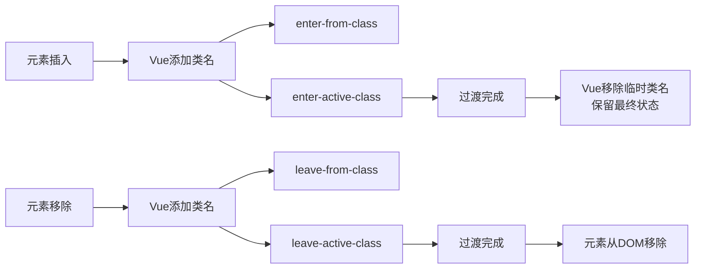

+++
title = "第16章 动画与过渡"
weight = 160
date = "2026-03-25T12:54:00+08:00"
type = "docs"
description = ""
isCJKLanguage = true
draft = false
+++

# 第十六章 动画与过渡

> 静态界面是上个世纪的遗产。在这个人人刷短视频的时代，你的Vue应用如果连个过渡动画都没有，用户点个按钮感觉像是在操控一台1985年的微波炉——没有反馈，不知道发生了什么。本章我们来聊聊Vue中的动画系统，让你的界面动起来、滑起来、弹起来！

## 16.1 Transition 组件基础

Vue提供了`<Transition>`和`<TransitionGroup>`两个内置组件，专门处理动画效果。

### 16.1.1 核心原理

Vue的过渡系统本质上是在元素进入/离开DOM时，自动添加/移除CSS类名。我们只需要定义这些类名的CSS样式即可。



### 16.1.2 简单文字淡入淡出

```vue
<template>
  <button @click="show = !show">Toggle</button>
  
  <Transition name="fade">
    <p v-if="show">Hello Vue animation!</p>
  </Transition>
</template>

<script setup>
import { ref } from 'vue'
const show = ref(false)
</script>

<style>
/* 淡入淡出动画 */
.fade-enter-active,
.fade-leave-active {
  transition: opacity 0.5s ease;
}

/* 开始状态（即将进入）/ 结束状态（即将离开）*/
.fade-enter-from,
.fade-leave-to {
  opacity: 0;
}
</style>
```

当`show`从`false`变为`true`时：
1. Vue插入`<p>`元素
2. 自动添加`fade-enter-from`和`fade-enter-active`
3. 过渡完成后移除这些类

### 16.1.3 过渡类名详解

| 类名 | 作用时机 | 典型用途 |
|------|----------|----------|
| `enter-from` | 元素刚进入前 | 设置起始透明度/位置 |
| `enter-active` | 元素整个进入过程 | 设置过渡时长和缓动函数 |
| `enter-to` | 元素进入完成后 | 设置最终状态 |
| `leave-from` | 元素即将离开前 | 设置起始状态 |
| `leave-active` | 元素整个离开过程 | 设置过渡时长和缓动函数 |
| `leave-to` | 元素离开过程中 | 设置结束状态（透明度/位置） |

```vue
<style>
.my-transition-enter-active {
  /* 整个进入过程持续300ms，使用ease-out缓动 */
  transition: all 0.3s ease-out;
}

.my-transition-leave-active {
  /* 整个离开过程持续200ms，使用ease-in缓动 */
  transition: all 0.2s ease-in;
}

/* 进入的起始位置：向左偏移100px，透明度为0 */
.my-transition-enter-from {
  transform: translateX(-100px);
  opacity: 0;
}

/* 离开的结束位置：向右偏移100px，透明度为0 */
.my-transition-leave-to {
  transform: translateX(100px);
  opacity: 0;
}
</style>
```

## 16.2 单元素过渡

### 16.2.1 滑入滑出（Slide）

常见的侧边栏滑入效果：

```vue
<template>
  <button @click="toggle">切换侧边栏</button>
  
  <Transition name="slide">
    <div v-if="isOpen" class="sidebar">
      <h3>侧边栏内容</h3>
      <p>这里是可以滑入滑出的内容区域...</p>
    </div>
  </Transition>
</template>

<script setup>
import { ref } from 'vue'
const isOpen = ref(false)

function toggle() {
  isOpen.value = !isOpen.value
}
</script>

<style scoped>
.sidebar {
  position: fixed;
  left: 0;
  top: 0;
  width: 300px;
  height: 100vh;
  background: #fff;
  box-shadow: 2px 0 10px rgba(0, 0, 0, 0.1);
  padding: 20px;
}

/* 滑入：从左侧滑入，opacity从0到1 */
.slide-enter-active {
  transition: all 0.3s ease-out;
}

.slide-enter-from {
  transform: translateX(-100%);
  opacity: 0;
}

/* 滑出：向左滑出，opacity从1到0 */
.slide-leave-active {
  transition: all 0.3s ease-in;
}

.slide-leave-to {
  transform: translateX(-100%);
  opacity: 0;
}
</style>
```

### 16.2.2 缩放效果（Scale）

模态框、弹出层的缩放动画：

```vue
<template>
  <button @click="showModal = true">打开弹窗</button>
  
  <Transition name="modal">
    <div v-if="showModal" class="modal-overlay" @click.self="showModal = false">
      <div class="modal-content">
        <h2>模态框标题</h2>
        <p>这是一个带缩放效果的弹窗，点击外部可以关闭。</p>
        <button @click="showModal = false">关闭</button>
      </div>
    </div>
  </Transition>
</template>

<script setup>
import { ref } from 'vue'
const showModal = ref(false)
</script>

<style scoped>
.modal-overlay {
  position: fixed;
  inset: 0;
  background: rgba(0, 0, 0, 0.5);
  display: flex;
  justify-content: center;
  align-items: center;
}

.modal-content {
  background: white;
  padding: 30px;
  border-radius: 12px;
  min-width: 400px;
}

/* 缩放动画：弹入效果 */
.modal-enter-active {
  transition: all 0.3s cubic-bezier(0.34, 1.56, 0.64, 1);
}

.modal-leave-active {
  transition: all 0.2s ease-in;
}

/* 从中心缩放：scale(0.8) -> scale(1) */
.modal-enter-from {
  opacity: 0;
  transform: scale(0.8);
}

.modal-leave-to {
  opacity: 0;
  transform: scale(0.8);
}
</style>
```

`cubic-bezier(0.34, 1.56, 0.64, 1)` 是一个弹簧效果参数，让动画更有弹性感。

### 16.2.3 组合动画（Fade + Slide）

很多场景需要多种效果叠加：

```vue
<template>
  <Transition name="fade-slide">
    <div v-if="isVisible" class="notification">
      <span class="icon">✓</span>
      <span class="message">操作成功！</span>
    </div>
  </Transition>
</template>

<style scoped>
.notification {
  position: fixed;
  top: 20px;
  right: 20px;
  background: #4CAF50;
  color: white;
  padding: 16px 24px;
  border-radius: 8px;
  display: flex;
  align-items: center;
  gap: 12px;
  box-shadow: 0 4px 12px rgba(0, 0, 0, 0.15);
}

.icon {
  font-size: 20px;
}

/* 组合动画：淡入 + 从右侧滑入 */
.fade-slide-enter-active {
  transition: all 0.4s ease-out;
}

.fade-slide-leave-active {
  transition: all 0.3s ease-in;
}

.fade-slide-enter-from {
  opacity: 0;
  transform: translateX(100px);
}

.fade-slide-leave-to {
  opacity: 0;
  transform: translateX(100px);
}
</style>
```

### 16.2.4 mode 属性（模式）

默认情况下，进入和离开同时发生。如果你想让它们依次发生，可以使用`mode`属性：

```vue
<!-- 默认：同时进行（可能显得拥挤） -->
<Transition name="fade">
  <div v-if="show" class="old-view">旧视图</div>
  <div v-else class="new-view">新视图</div>
</Transition>

<!-- 先进后出：先让旧的离开，新的再进来 -->
<Transition name="fade" mode="out-in">
  <div v-if="show" class="view">视图 A</div>
  <div v-else class="view">视图 B</div>
</Transition>

<!-- 先进后出：新的先进来，旧的再离开 -->
<Transition name="fade" mode="in-out">
  <div v-if="show" class="view">视图 A</div>
  <div v-else class="view">视图 B</div>
</Transition>
```

```css
/* out-in 模式的样式 */
.fade-enter-active {
  transition: opacity 0.3s ease;
}
.fade-leave-active {
  transition: opacity 0.3s ease;
  position: absolute; /* 防止布局跳动 */
}
.fade-enter-from,
.fade-leave-to {
  opacity: 0;
}
```

## 16.3 列表过渡（TransitionGroup）

### 16.3.1 基础用法

`<TransitionGroup>`用于列表的添加/删除动画，与`<Transition>`的区别是它会渲染一个真实的DOM元素（默认是`<span>`，可通过`tag`属性修改）。

```vue
<template>
  <div class="list-demo">
    <button @click="addItem">添加项目</button>
    <button @click="removeItem">删除最后一项</button>
    
    <TransitionGroup name="list" tag="ul">
      <li v-for="item in items" :key="item.id">
        {{ item.text }}
      </li>
    </TransitionGroup>
  </div>
</template>

<script setup>
import { ref } from 'vue'

const items = ref([
  { id: 1, text: 'Vue 3 真棒' },
  { id: 2, text: 'Composition API 很强' },
  { id: 3, text: '动画让界面更生动' }
])

let nextId = 4

function addItem() {
  items.value.push({ id: nextId++, text: `新项目 ${nextId}` })
}

function removeItem() {
  items.value.pop()
}
</script>

<style scoped>
ul {
  list-style: none;
  padding: 0;
}

li {
  padding: 12px;
  margin: 8px 0;
  background: #e3f2fd;
  border-radius: 4px;
  /* 过渡效果 */
  transition: all 0.3s ease;
}

/* 列表过渡动画 */
.list-enter-active {
  transition: all 0.4s ease-out;
}

.list-leave-active {
  transition: all 0.3s ease-in;
  /* 关键：离开时需要绝对定位才能让其他元素平滑移动 */
  position: absolute;
}

.list-enter-from {
  opacity: 0;
  transform: translateX(-30px);
}

.list-leave-to {
  opacity: 0;
  transform: translateX(30px);
}

/* 列表项之间的间距需要通过gsap或其他方式调整 */
</style>
```

### 16.3.2 FLIP 动画详解

FLIP = First, Last, Invert, Play

这是一种高性能的列表动画技术，Vue的`<TransitionGroup>`内置支持。原理：

1. **First**：记录元素初始位置
2. **Last**：记录元素最终位置  
3. **Invert**：计算位置差，应用反向transform
4. **Play**：播放动画到最终位置

```vue
<template>
  <button @click="shuffle">打乱顺序</button>
  
  <TransitionGroup name="flip" tag="div" class="grid">
    <div v-for="item in items" :key="item.id" class="card">
      {{ item.value }}
    </div>
  </TransitionGroup>
</template>

<script setup>
import { ref } from 'vue'

// 初始数据
const items = ref([
  { id: 1, value: 'A' },
  { id: 2, value: 'B' },
  { id: 3, value: 'C' },
  { id: 4, value: 'D' },
  { id: 5, value: 'E' },
  { id: 6, value: 'F' }
])

// Fisher-Yates 洗牌算法
function shuffle() {
  const arr = [...items.value]
  for (let i = arr.length - 1; i > 0; i--) {
    const j = Math.floor(Math.random() * (i + 1))
    ;[arr[i], arr[j]] = [arr[j], arr[i]]
  }
  items.value = arr
}
</script>

<style scoped>
.grid {
  display: grid;
  grid-template-columns: repeat(3, 100px);
  gap: 10px;
}

.card {
  width: 100px;
  height: 100px;
  background: linear-gradient(135deg, #667eea 0%, #764ba2 100%);
  color: white;
  display: flex;
  justify-content: center;
  align-items: center;
  font-size: 24px;
  font-weight: bold;
  border-radius: 8px;
}

/* FLIP 过渡动画 */
.flip-move {
  /* 移动过渡的关键！ */
  transition: transform 0.5s ease;
}

.flip-enter-active {
  transition: all 0.5s ease;
}

.flip-leave-active {
  transition: all 0.3s ease;
  position: absolute;
}

.flip-enter-from {
  opacity: 0;
  transform: scale(0.5);
}

.flip-leave-to {
  opacity: 0;
  transform: scale(0.5);
}
```

### 16.3.3 列表过渡注意事项

```css
/* 1. 列表项需要相对定位（为FLIP计算提供基准） */
.grid {
  position: relative;
}

/* 2. 离开的元素需要脱离文档流（避免留下空白） */
.flip-leave-active {
  position: absolute;
}

/* 3. 移动过渡（FLIP的核心） */
.flip-move {
  transition: transform 0.5s ease;
}
```

## 16.4 状态过渡

### 16.4.1 数字动画

数字的递增/递减动画——比如统计大屏、数字仪表盘，从 0 滚动到 10000 的效果，比直接跳变更有视觉冲击力：

```vue
<template>
  <div class="stats">
    <div class="stat-item">
      <span class="label">用户总数</span>
      <!-- animatedUsers 是不断变化的小数，toFixed(0) 取整数显示 -->
      <span class="value">{{ animatedUsers.toFixed(0) }}</span>
    </div>
    <button @click="updateUsers">更新数据</button>
  </div>
</template>

<script setup>
import { ref, watch } from 'vue'

// 数字动画 composable：把普通数值 ref 包装成带滚动动画的版本
function useAnimatedNumber(source) {
  const output = ref(source.value)  // 输出值（不断变化）
  let animationFrame = null  // 动画帧 ID（用于取消动画）

  function animate(targetValue, duration = 800) {
    if (animationFrame) cancelAnimationFrame(animationFrame)
    const startValue = output.value
    const startTime = performance.now()  // 记录开始时间

    function step(currentTime) {
      const elapsed = currentTime - startTime  // 已经过了多久
      const progress = Math.min(elapsed / duration, 1)  // 0~1 的进度
      // easeOutExpo 缓动函数：数字"前快后慢"，更符合人眼习惯
      const ease = 1 - Math.pow(1 - progress, 3)
      output.value = startValue + (targetValue - startValue) * ease
      if (progress < 1) {
        animationFrame = requestAnimationFrame(step)  // 继续下一帧
      }
    }

    animationFrame = requestAnimationFrame(step)  // 启动动画
  }

  // 监听源数据变化，自动触发动画
  watch(source, (newVal) => animate(newVal))
  return output
}

const users = ref(0)
const animatedUsers = useAnimatedNumber(users)  // 传入原始 ref，得到带动画的输出

function updateUsers() {
  users.value = Math.floor(Math.random() * 10000)
}
</script>

<style scoped>
.stats {
  text-align: center;
  padding: 40px;
}

.stat-item {
  margin-bottom: 20px;
}

.label {
  display: block;
  color: #666;
  margin-bottom: 8px;
}

.value {
  font-size: 48px;
  font-weight: bold;
  color: #42b883;
}
</style>
```

### 16.4.2 颜色过渡

颜色渐变动画——让背景色从红色平滑过渡到蓝色，比直接跳变更流畅。颜色过渡比数字过渡更复杂，因为颜色不是简单的数字，而是 RGB 三个分量。以下是一个简化的纯 CSS 过渡方案：

```vue
<template>
  <div class="color-demo">
    <!-- :style 绑定背景色，Vue 会自动更新 -->
    <div
      class="color-box"
      :style="{ backgroundColor: currentColor }"
    ></div>
    <button @click="changeColor">换一组颜色</button>
  </div>
</template>

<script setup>
import { ref } from 'vue'

// 预设的颜色组合（每次点击切换到下一组）
const colorPairs = [
  { from: '#FF6B6B', to: '#4ECDC4' },  // 红 → 青
  { from: '#4ECDC4', to: '#45B7D1' },  // 青 → 蓝
  { from: '#45B7D1', to: '#96CEB4' },  // 蓝 → 绿
  { from: '#96CEB4', to: '#F7DC6F' },  // 绿 → 黄
]

const currentIndex = ref(0)
const currentColor = ref(colorPairs[0].from)

function changeColor() {
  currentIndex.value = (currentIndex.value + 1) % colorPairs.length
  // CSS transition 会自动处理颜色渐变，JavaScript 只需要更新目标颜色
  currentColor.value = colorPairs[currentIndex.value].from
}
</script>

<style scoped>
.color-box {
  width: 200px;
  height: 200px;
  border-radius: 12px;
  margin: 20px auto;
  /* CSS transition：Vue 更新 backgroundColor 时，自动平滑过渡 */
  transition: background-color 0.8s ease;
}

button {
  display: block;
  margin: 0 auto;
  padding: 10px 20px;
  background: #42b883;
  color: white;
  border: none;
  border-radius: 4px;
  cursor: pointer;
}
</style>
```

**原理**：颜色过渡不需要 JavaScript 动画！Vue 的响应式更新是同步的——当 `currentColor.value` 变化时，Vue 会立即更新 DOM 的 `background-color`。真正实现平滑过渡的是 CSS 的 `transition: background-color 0.8s ease`——CSS 会在 0.8 秒内从旧颜色"插值"到新颜色，而不需要 JavaScript 参与计算每一帧。

## 16.5 路由过渡

### 16.5.1 基础路由动画

使用Vue Router时，给路由切换添加动画：

```vue
<!-- App.vue -->
<template>
  <div id="app">
    <nav>
      <router-link to="/">首页</router-link>
      <router-link to="/about">关于</router-link>
      <router-link to="/user/123">用户</router-link>
    </nav>
    
    <!-- 路由过渡 -->
    <router-view v-slot="{ Component }">
      <Transition name="page" mode="out-in">
        <component :is="Component" />
      </Transition>
    </router-view>
  </div>
</template>

<style>
.page-enter-active {
  transition: opacity 0.3s ease, transform 0.3s ease;
}

.page-leave-active {
  transition: opacity 0.2s ease, transform 0.2s ease;
}

.page-enter-from {
  opacity: 0;
  transform: translateY(20px);
}

.page-leave-to {
  opacity: 0;
  transform: translateY(-20px);
}
</style>
```

### 16.5.2 动态过渡效果

根据路由元信息动态设置过渡效果：

```vue
<!-- App.vue -->
<template>
  <router-view v-slot="{ Component, route }">
    <Transition :name="route.meta.transition || 'fade'" mode="out-in">
      <component :is="Component" />
    </Transition>
  </router-view>
</template>

<script setup>
// 路由配置中设置 meta.transition
// { path: '/', component: Home, meta: { transition: 'slide' } }
// { path: '/about', component: About, meta: { transition: 'fade' } }
</script>

<style>
/* 淡入淡出（默认） */
.fade-enter-active,
.fade-leave-active {
  transition: opacity 0.3s ease;
}
.fade-enter-from,
.fade-leave-to {
  opacity: 0;
}

/* 滑动效果 */
.slide-enter-active {
  transition: all 0.3s ease-out;
}
.slide-leave-active {
  transition: all 0.2s ease-in;
}
.slide-enter-from {
  transform: translateX(-30px);
  opacity: 0;
}
.slide-leave-to {
  transform: translateX(30px);
  opacity: 0;
}

/* 缩放效果 */
.scale-enter-active {
  transition: all 0.3s cubic-bezier(0.34, 1.56, 0.64, 1);
}
.scale-leave-active {
  transition: all 0.2s ease-in;
}
.scale-enter-from {
  transform: scale(0.9);
  opacity: 0;
}
.scale-leave-to {
  transform: scale(1.1);
  opacity: 0;
}
</style>
```

## 16.6 第三方动画库

### 16.6.1 GSAP

GSAP（GreenSock Animation Platform）是最强大的JavaScript动画库。

```bash
pnpm add gsap
```

```vue
<template>
  <div ref="boxRef" class="gsap-box">GSAP 动画</div>
  <button @click="animateBox">播放动画</button>
</template>

<script setup>
import { ref, onMounted } from 'vue'
import { gsap } from 'gsap'

const boxRef = ref(null)

function animateBox() {
  const box = boxRef.value
  
  // 创建一个时间线动画序列
  const tl = gsap.timeline()
  
  // 第1步：从下方滑入
  tl.fromTo(box, 
    { y: 100, opacity: 0 },
    { y: 0, opacity: 1, duration: 0.5, ease: 'power2.out' }
  )
  
  // 第2步：轻微弹跳
  .to(box, 
    { scale: 1.1, duration: 0.15, ease: 'power1.inOut' }
  )
  .to(box, 
    { scale: 1, duration: 0.15, ease: 'elastic.out(1, 0.5)' }
  )
  
  // 第3步：摇晃
  .to(box, 
    { rotation: 10, duration: 0.1, ease: 'power1.inOut' }
  )
  .to(box, 
    { rotation: -10, duration: 0.1, ease: 'power1.inOut' }
  )
  .to(box, 
    { rotation: 0, duration: 0.1, ease: 'power1.inOut' }
  )
  
  // 第4步：向上消失
  .to(box, 
    { y: -100, opacity: 0, duration: 0.4, ease: 'power2.in' }
  )
}

// 入场动画
onMounted(() => {
  gsap.fromTo(box, 
    { scale: 0, rotation: 180 },
    { 
      scale: 1, 
      rotation: 0, 
      duration: 0.8, 
      ease: 'back.out(1.7)',
      delay: 0.2
    }
  )
})
</script>

<style scoped>
.gsap-box {
  width: 150px;
  height: 150px;
  background: linear-gradient(135deg, #667eea 0%, #764ba2 100%);
  color: white;
  display: flex;
  justify-content: center;
  align-items: center;
  border-radius: 12px;
  margin: 50px auto;
  cursor: pointer;
}
</style>
```

### 16.6.2 GSAP + Vue Transition

将GSAP与Vue的Transition组件结合：

```vue
<template>
  <button @click="show = !show">切换</button>
  
  <TransitionGroup name="list" tag="div" class="items">
    <div v-for="item in items" :key="item.id" class="item">
      {{ item.text }}
    </div>
  </TransitionGroup>
</template>

<script setup>
import { ref } from 'vue'
import { gsap } from 'gsap'

const items = ref([
  { id: 1, text: '项目 1' },
  { id: 2, text: '项目 2' },
  { id: 3, text: '项目 3' }
])

function addItem() {
  const newId = items.value.length + 1
  items.value.push({ id: newId, text: `项目 ${newId}` })
}

function removeItem(index) {
  items.value.splice(index, 1)
}
</script>

<style scoped>
.items {
  display: flex;
  flex-direction: column;
  gap: 10px;
  position: relative;
}

.item {
  padding: 15px;
  background: #e3f2fd;
  border-radius: 8px;
  cursor: pointer;
  transition: background 0.2s;
}

.item:hover {
  background: #bbdefb;
}
</style>
```

### 16.6.3 Anime.js

Anime.js是另一个轻量级的动画库：

```bash
pnpm add animejs
```

```vue
<template>
  <div class="anime-demo">
    <div ref="targetsRef" class="target">
      <div class="dot" data-index="0"></div>
      <div class="dot" data-index="1"></div>
      <div class="dot" data-index="2"></div>
      <div class="dot" data-index="3"></div>
      <div class="dot" data-index="4"></div>
    </div>
    
    <div class="controls">
      <button @click="animateStagger">错位动画</button>
      <button @click="animateMorph">变形动画</button>
      <button @click="animateTimeline">时间线</button>
    </div>
  </div>
</template>

<script setup>
import { ref } from 'vue'
import anime from 'animejs'

const targetsRef = ref(null)

function animateStagger() {
  anime({
    targets: '.dot',
    translateX: 270,
    borderRadius: ['0%', '50%'],
    backgroundColor: ['#FF6B6B', '#4ECDC4', '#45B7D1', '#96CEB4', '#FFEAA7'],
    // 错位延迟，每个元素延迟50ms
    delay: anime.stagger(50, { from: 'center' }),
    easing: 'easeInOutQuad',
    duration: 800
  })
}

function animateMorph() {
  anime({
    targets: '.target',
    scale: [1, 1.5, 1],
    rotate: [0, 180, 360],
    duration: 1000,
    easing: 'easeInOutSine'
  })
}

function animateTimeline() {
  const timeline = anime.timeline({
    easing: 'easeOutExpo'
  })

  timeline
    .add({
      targets: '.target',
      scale: [0, 1],
      duration: 500
    })
    .add({
      targets: '.dot',
      translateY: [-50, 0],
      opacity: [0, 1],
      delay: anime.stagger(100)
    }, '-=200')
    .add({
      targets: '.target',
      rotate: 360,
      duration: 800
    })
}
</script>

<style scoped>
.anime-demo {
  text-align: center;
  padding: 40px;
}

.target {
  width: 300px;
  height: 100px;
  margin: 0 auto 30px;
  display: flex;
  justify-content: center;
  align-items: center;
  gap: 20px;
}

.dot {
  width: 40px;
  height: 40px;
  background: #42b883;
  border-radius: 50%;
}

.controls {
  display: flex;
  justify-content: center;
  gap: 10px;
}

button {
  padding: 10px 20px;
  background: #42b883;
  color: white;
  border: none;
  border-radius: 4px;
  cursor: pointer;
  transition: background 0.2s;
}

button:hover {
  background: #3aa876;
}
</style>
```

## 16.7 本章小结

本章我们学习了Vue的动画系统：

| 组件 | 用途 | 关键点 |
|------|------|--------|
| `<Transition>` | 单元素过渡 | 6个类名控制动画状态 |
| `<TransitionGroup>` | 列表过渡 | FLIP动画，position: absolute |
| `<KeepAlive>` + Transition | 组件缓存过渡 | 缓存 + 动画结合 |
| mode属性 | 过渡模式 | out-in / in-out 控制先后顺序 |

### 动画选择建议

- **简单状态切换**：使用Vue内置的`<Transition>` + CSS
- **列表增删**：使用`<TransitionGroup>` + FLIP
- **复杂交互动画**：使用GSAP或Anime.js
- **路由切换**：结合Vue Router的`<Transition>`

记住：动画是为了提升用户体验，不是炫技。适度的动画让界面更流畅，过度的动画只会让用户感到烦躁。

> 好的动画就像好的魔术——观众只会觉得"哇，好神奇"，而不是"他是怎么做到的"。如果你需要盯着屏幕想"这动画怎么实现的"，那说明动画已经喧宾夺主了。
