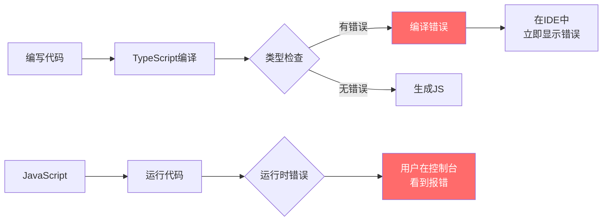

+++
title = "第17章 TypeScript 与 Vue 3"
weight = 170
date = "2026-03-25T12:54:00+08:00"
type = "docs"
description = ""
isCJKLanguage = true
draft = false
+++

# 第十七章 TypeScript 与 Vue 3

> JavaScript是动态类型语言，这意味着你可以把字符串赋值给一个数字变量，然后运行到一半才发现问题——然后花三天debug，最后发现是因为少打了个字。TypeScript就是来解决这个"自由"带来的一系列问题。本章我们来看如何在Vue 3项目中优雅地使用TypeScript，让类型错误在编码阶段就被发现，而不是在生产环境中给你"惊喜"。

## 17.1 TypeScript 基础回顾

### 17.1.1 为什么需要 TypeScript



TypeScript的优势：
- **静态类型检查**：编译阶段就能发现类型错误
- **IDE支持**：更好的代码补全、跳转、重构
- **文档化**：`function add(a: number, b: number)` 比 `function add(a, b)` 更清晰
- **代码重构**：修改类型时，编译器会告诉你哪里需要更新

### 17.1.2 基础类型

```typescript
// 基础类型
let name: string = 'Vue 3'
let age: number = 3
let isActive: boolean = true

// 数组
let numbers: number[] = [1, 2, 3]
let names: Array<string> = ['Alice', 'Bob']

// 对象
interface User {
  id: number
  name: string
  email?: string  // 可选属性
  readonly createdAt: Date  // 只读属性
}

const user: User = {
  id: 1,
  name: '张三',
  email: 'zhangsan@example.com',
  createdAt: new Date()
}

// 联合类型
type Status = 'pending' | 'success' | 'error'
let status: Status = 'success'

// 函数
function greet(name: string): string {
  return `Hello, ${name}!`
}

// 箭头函数类型
const add = (a: number, b: number): number => a + b

// void（无返回值）
function logMessage(message: string): void {
  console.log(message)
}

// never（永不返回）
function throwError(message: string): never {
  throw new Error(message)
}

// 元组（固定长度和类型的数组）
let tuple: [string, number] = ['hello', 42]

// any（尽量避免使用）
let anything: any = 4
anything = 'string'  // OK
anything = true  // OK
```

### 17.1.3 泛型

泛型让我们编写可复用的、类型安全的代码：

```typescript
// 泛型函数
function identity<T>(arg: T): T {
  return arg
}

const num = identity<number>(42)  // 类型明确指定
const str = identity('hello')    // 类型自动推断

// 泛型接口
interface ApiResponse<T> {
  code: number
  data: T
  message: string
}

interface User {
  id: number
  name: string
}

const response: ApiResponse<User> = {
  code: 200,
  data: { id: 1, name: '张三' },
  message: 'success'
}

// 泛型约束
interface HasLength {
  length: number
}

function logLength<T extends HasLength>(arg: T): number {
  return arg.length
}

logLength('hello')      // OK，string有length
logLength([1, 2, 3])    // OK，array有length
logLength({ length: 10 }) // OK，对象有length属性
// logLength(123)        // Error，数字没有length

// keyof 约束
function getProperty<T, K extends keyof T>(obj: T, key: K): T[K] {
  return obj[key]
}

const user = { id: 1, name: '张三', age: 25 }
const name = getProperty(user, 'name')  // type: string
// const invalid = getProperty(user, 'email')  // Error，email不在user中
```

## 17.2 Vue 3 + TypeScript 项目初始化

### 17.2.1 使用 Vite 创建项目

```bash
# 创建包含TypeScript的项目
npm create vite@latest my-vue-app -- --template vue-ts

# 或者在现有项目中添加TypeScript
npm install -D typescript vue-tsc
npx tsc --init
```

### 17.2.2 配置文件

`tsconfig.json` 是 TypeScript 项目的"总纲"——它告诉 TypeScript 编译器：目标版本是什么、严格模式开不开、路径别名怎么解析、哪些文件要检查……几乎所有 TypeScript 相关的配置都在这里。

**几个最关键的配置项说明：**

```json
// tsconfig.json
{
  "compilerOptions": {
    "target": "ES2020",
    "useDefineForClassFields": true,
    "module": "ESNext",
    "lib": ["ES2020", "DOM", "DOM.Iterable"],
    
    // 路径别名（需要配合vite.config.ts）
    "baseUrl": ".",
    "paths": {
      "@/*": ["src/*"]
    },
    
    // 严格模式（强烈建议开启！）
    "strict": true,
    "noImplicitAny": true,
    "strictNullChecks": true,
    "strictFunctionTypes": true,
    
    // 其他有用的选项
    "noUnusedLocals": true,      // 检测未使用的变量
    "noUnusedParameters": true,  // 检测未使用的参数
    "noImplicitReturns": true,   // 检查所有代码路径是否返回值
    "noFallthroughCasesInSwitch": true,
    
    // 模块解析
    "moduleResolution": "bundler",
    "allowImportingTsExtensions": true,
    "resolveJsonModule": true,
    "isolatedModules": true,
    "esModuleInterop": true,
    
    // 跳过库检查（加速编译）
    "skipLibCheck": true,
    
    // 输出
    "declaration": true,
    "declarationMap": true,
    "sourceMap": true
  },
  "include": ["src/**/*.ts", "src/**/*.tsx", "src/**/*.vue"],
  "references": [{ "path": "./tsconfig.node.json" }]
}
```

```json
// tsconfig.node.json（用于Vite配置文件）
{
  "compilerOptions": {
    "composite": true,
    "skipLibCheck": true,
    "module": "ESNext",
    "moduleResolution": "bundler",
    "allowSyntheticDefaultImports": true,
    "strict": true
  },
  "include": ["vite.config.ts"]
}
```

### 17.2.3 Vite 配置

```typescript
// vite.config.ts
import { defineConfig } from 'vite'
import vue from '@vitejs/plugin-vue'
import { resolve } from 'path'

export default defineConfig({
  plugins: [vue()],
  
  resolve: {
    alias: {
      '@': resolve(__dirname, 'src')
    }
  },
  
  // TypeScript相关配置
  vueJsx: {
    // JSX配置
  }
})
```

## 17.3 组件类型定义

### 17.3.1 defineComponent 语法

Vue 3的`defineComponent`支持泛型，可以精确定义props和emit：

```typescript
import { defineComponent, PropType } from 'vue'

// 定义props类型
interface User {
  id: number
  name: string
  email?: string
}

const MyComponent = defineComponent({
  props: {
    // 基础类型
    title: String,
    count: {
      type: Number,
      required: true,
      default: 0
    },
    
    // 数组类型
    items: {
      type: Array as PropType<string[]>,
      default: () => []
    },
    
    // 对象类型
    user: {
      type: Object as PropType<User>,
      required: true
    },
    
    // 联合类型
    status: {
      type: String as PropType<'pending' | 'success' | 'error'>,
      default: 'pending'
    },
    
    // 回调函数
    onClick: {
      type: Function as PropType<(id: number) => void>
    }
  },
  
  emits: {
    // 带验证的emit
    update: (value: string) => typeof value === 'string',
    'update:modelValue': (value: ModelValue) => value !== undefined,
    click: null  // 无参数的emit
  },
  
  setup(props, { emit }) {
    // props有完整的类型提示
    console.log(props.title)  // type: string | undefined
    console.log(props.count)  // type: number
    console.log(props.user)   // type: User
    
    function handleClick() {
      emit('update', 'new value')
      emit('click')
    }
    
    return { handleClick }
  }
})

export default MyComponent
```

### 17.3.2 `<script setup>` 语法糖

`<script setup>` 是Vue 3.2+引入的语法糖，TypeScript支持非常好：

```vue
<!-- UserCard.vue -->
<script setup lang="ts">
// 导入类型
import type { User, Address } from '@/types'

// 定义Props
interface Props {
  user: User
  showEmail?: boolean
  compact?: boolean
}

// withDefaults 设置默认值
const props = withDefaults(defineProps<Props>(), {
  showEmail: false,
  compact: false
})

// 定义Emits
const emit = defineEmits<{
  (e: 'click', user: User): void
  (e: 'update:user', user: User): void
}>()

// 定义普通方法
function handleClick() {
  emit('click', props.user)
}

// 定义异步方法
async function fetchUserDetails(): Promise<Address> {
  const response = await fetch(`/api/users/${props.user.id}`)
  return response.json()
}

// 暴露给模板
defineExpose({
  fetchUserDetails
})
</script>

<template>
  <div :class="['user-card', { compact }]">
    <h3>{{ user.name }}</h3>
    <p v-if="showEmail">{{ user.email }}</p>
    <button @click="handleClick">点击</button>
  </div>
</template>
```

### 17.3.3 ref 和 reactive 类型

```typescript
import { ref, reactive, computed, watch } from 'vue'

// ref - 基础类型
const count = ref<number>(0)
const name = ref<string>('Vue')
const isActive = ref<boolean>(false)

// ref - 对象类型（自动解包）
const user = ref<{ id: number; name: string }>({
  id: 1,
  name: '张三'
})

// 访问时需要 .value
console.log(count.value)  // type: number

// reactive - 只能用于对象
const state = reactive<{
  count: number
  user: User | null
  items: string[]
}>({
  count: 0,
  user: null,
  items: []
})

// reactive 访问不需要 .value
state.count++

// computed - 推断返回类型
const doubleCount = computed<number>(() => count.value * 2)

// 带类型的computed
const userName = computed<string>(() => {
  if (state.user) {
    return state.user.name
  }
  return '未登录'
})

// watch - 类型安全的watch
watch<User | null, [User | null, User | null]>(
  () => state.user,
  (newUser, oldUser) => {
    console.log('用户变化:', newUser, oldUser)
  },
  { deep: true }
)

// watchEffect - 自动追踪依赖
watchEffect(() => {
  if (state.user) {
    console.log('用户ID:', state.user.id)
  }
})
```

### 17.3.4 组件实例类型

获取组件实例的类型：

```typescript
import { ref } from 'vue'
import type { ComponentInstance } from 'vue'

// 获取子组件实例
const childRef = ref<InstanceType<typeof ChildComponent> | null>(null)

// 调用子组件的方法
function handleParentClick() {
  if (childRef.value) {
    // 有类型提示
    childRef.value.childMethod()
  }
}

// 在 defineExpose 时定义的方法
// 子组件:
// const childMethod = () => { ... }
// defineExpose({ childMethod })
```

## 17.4 TypeScript 工具类型

### 17.4.1 Vue 内置工具类型

```typescript
import type {
  PropType,        // 用于定义props类型
  Component,       // 组件类型
  VNode,           // 虚拟节点
  CSSProperties    // CSS样式类型
} from 'vue'

// PropType 使用示例
interface Props {
  items: string[]
  onChange: (value: string) => void
}

const props = defineProps<Props>()

// CSSProperties 使用示例
const style = computed<CSSProperties>(() => ({
  color: 'red',
  fontSize: '14px',
  '--custom-var': 'value'
}))
```

### 17.4.2 TypeScript 内置工具类型

```typescript
// Partial<T> - 所有属性变为可选
interface User {
  id: number
  name: string
  email: string
}

type PartialUser = Partial<User>
// {
//   id?: number
//   name?: string
//   email?: string
// }

// Required<T> - 所有属性变为必需
type RequiredUser = Required<User>

// Readonly<T> - 所有属性变为只读
type ReadonlyUser = Readonly<User>

// Pick<T, K> - 从T中选取部分属性
type UserPreview = Pick<User, 'id' | 'name'>
// {
//   id: number
//   name: string
// }

// Omit<T, K> - 从T中排除部分属性
type UserWithoutEmail = Omit<User, 'email'>
// {
//   id: number
//   name: string
// }

// Record<K, T> - 创建键值对类型
type UserMap = Record<string, User>

// Exclude<T, U> - 从T中排除可分配给U的类型
type Status = 'pending' | 'success' | 'error' | 'loading'
type NonErrorStatus = Exclude<Status, 'error'>
// 'pending' | 'success' | 'loading'

// Extract<T, U> - 从T中提取可分配给U的类型
type ActiveStatus = Extract<Status, 'pending' | 'success'>
// 'pending' | 'success'

// NonNullable<T> - 排除null和undefined
type NonNullUser = NonNullable<User | null | undefined>

// ReturnType<F> - 获取函数返回类型
function createUser(name: string) {
  return { id: Date.now(), name }
}
type UserType = ReturnType<typeof createUser>

// Parameters<F> - 获取函数参数类型
type CreateUserParams = Parameters<typeof createUser>[0]

// InstanceType<C> - 获取类构造函数实例类型
class UserClass {
  constructor(public name: string) {}
}
type UserInstance = InstanceType<typeof UserClass>
```

### 17.4.3 实战：自定义工具类型

```typescript
// 将API响应转换为正确的类型
interface ApiResponse<T> {
  code: number
  data: T
  message: string
}

// 提取API响应中的data类型
type ApiData<T> = T extends ApiResponse<infer U> ? U : never

type UserResponse = ApiResponse<{ id: number; name: string }>
type ExtractedUser = ApiData<UserResponse>  // { id: number; name: string }

// 将Promise类型展开
type Awaited<T> = T extends Promise<infer U> ? U : T

async function fetchUser(): Promise<{ id: number }> {
  return { id: 1 }
}

type UserResult = Awaited<ReturnType<typeof fetchUser>>  // { id: number }

// 深度只读
type DeepReadonly<T> = {
  readonly [P in keyof T]: T[P] extends object ? DeepReadonly<T[P]> : T[P]
}

interface Config {
  user: {
    name: string
    address: {
      city: string
    }
  }
}

type ReadonlyConfig = DeepReadonly<Config>
// {
//   readonly user: {
//     readonly name: string
//     readonly address: {
//       readonly city: string
//     }
//   }
// }
```

## 17.5 路由与 Pinia 类型

### 17.5.1 路由类型

```typescript
// router/index.ts
import { createRouter, createWebHistory } from 'vue-router'
import type { RouteRecordRaw } from 'vue-router'

// 路由配置也需要类型
const routes: RouteRecordRaw[] = [
  {
    path: '/',
    name: 'Home',
    component: () => import('@/views/Home.vue'),
    meta: { title: '首页' }
  },
  {
    path: '/user/:id',
    name: 'User',
    component: () => import('@/views/User.vue'),
    props: true,  // id会作为props传递
    meta: { 
      title: '用户详情',
      requiresAuth: true 
    }
  }
]

const router = createRouter({
  history: createWebHistory(),
  routes
})

export default router
```

```typescript
// 在组件中使用路由类型
import { useRouter, useRoute } from 'vue-router'
import type { Router, RouteLocationNormalized } from 'vue-router'

const router = useRouter<Router>()
const route = useRoute<RouteLocationNormalized>()

// route.params 有类型提示
const userId = route.params.id  // type: string | string[]

// router.push 有类型提示
router.push({ name: 'User', params: { id: '123' } })
```

### 17.5.2 Pinia Store 类型

```typescript
// stores/user.ts
import { defineStore } from 'pinia'
import { ref, computed } from 'vue'
import type { User, UserCreateInput } from '@/types'

export const useUserStore = defineStore('user', () => {
  // State
  const users = ref<User[]>([])
  const currentUser = ref<User | null>(null)
  const isLoading = ref(false)

  // Getters
  const activeUsers = computed<User[]>(() => 
    users.value.filter(u => u.isActive)
  )

  const userCount = computed<number>(() => users.value.length)

  const userById = computed(() => {
    return (id: number): User | undefined => 
      users.value.find(u => u.id === id)
  })

  // Actions
  async function fetchUsers(): Promise<void> {
    isLoading.value = true
    try {
      const response = await fetch('/api/users')
      users.value = await response.json()
    } finally {
      isLoading.value = false
    }
  }

  async function createUser(input: UserCreateInput): Promise<User> {
    const response = await fetch('/api/users', {
      method: 'POST',
      headers: { 'Content-Type': 'application/json' },
      body: JSON.stringify(input)
    })
    const newUser = await response.json()
    users.value.push(newUser)
    return newUser
  }

  function setCurrentUser(user: User | null): void {
    currentUser.value = user
  }

  return {
    // State
    users,
    currentUser,
    isLoading,
    // Getters
    activeUsers,
    userCount,
    userById,
    // Actions
    fetchUsers,
    createUser,
    setCurrentUser
  }
})
```

```typescript
// 在组件中使用
import { storeToRefs } from 'pinia'
import { useUserStore } from '@/stores/user'

const userStore = useUserStore()

// 使用 storeToRefs 保持响应性
const { currentUser, isLoading } = storeToRefs(userStore)

// Actions 直接解构（保持响应性）
const { fetchUsers } = userStore

// 调用action
await fetchUsers()
console.log(currentUser.value)
```

## 17.6 高级类型技巧

### 17.6.1 模板字面量类型

```typescript
// 模板字面量类型
type Direction = 'top' | 'right' | 'bottom' | 'left'
type EventName = `on${Capitalize<Direction>}`
// 'onTop' | 'onRight' | 'onBottom' | 'onLeft'

// 复杂的模板字面量
type CSSUnit = 'px' | 'em' | 'rem' | 'vw' | 'vh'
type CSSValue = `${number}${CSSUnit}`

function setWidth(width: CSSValue): void {
  // ...
}

setWidth('100px')   // OK
setWidth('2rem')     // OK
setWidth('100')      // Error
setWidth('100xyz')   // Error

// 提取字符串中的部分
type ExtractRoute<T extends string> = 
  T extends `${infer Method} /${infer Path}` 
    ? { method: Method; path: Path }
    : never

type Route = ExtractRoute<'GET /users'>
// { method: 'GET'; path: 'users' }
```

### 17.6.2 条件类型与 infer

```typescript
// 条件类型
type IsArray<T> = T extends any[] ? true : false

type A = IsArray<string[]>  // true
type B = IsArray<string>     // false

// infer - 推断类型
type ReturnType<T> = T extends (...args: any[]) => infer R ? R : never

type B = ReturnType<() => string>      // string
type C = ReturnType<() => Promise<number>>  // Promise<number>

// 推断函数参数
type Parameters<T> = T extends (...args: infer P) => any ? P : never

type D = Parameters<(name: string, age: number) => void>
// [name: string, age: number]

// 递归类型（提取Promise的深层类型）
type DeepAwaited<T> = T extends Promise<infer U> 
  ? DeepAwaited<U> 
  : T

type A = DeepAwaited<Promise<Promise<string>>>  // string
```

### 17.6.3 装饰器类型（Vue 3.3+）

```typescript
// 装饰器（Vue 3.3+ 实验性功能）
// 需要在 tsconfig.json 中开启 "experimentalDecorators": true

// 实例属性的类型推断
class Counter {
  // 这样count会自动推断为number
  count = $ref(0)
  
  // computed也会被正确推断
  double = $computed(() => this.count * 2)
}

// $ref 和 $computed 是 Vue Macros
```

### 17.6.4 类型守卫与类型断言

```typescript
// 类型守卫函数
function isUser(obj: unknown): obj is User {
  return (
    typeof obj === 'object' &&
    obj !== null &&
    'id' in obj &&
    'name' in obj
  )
}

// 使用类型守卫
function processData(data: unknown) {
  if (isUser(data)) {
    // 这里data被推断为User类型
    console.log(data.name)
  }
}

// 非空断言（谨慎使用）
function processName(name?: string) {
  // 使用可选链或默认值更安全
  console.log(name?.toUpperCase() ?? 'Unknown')
  // 而不是 console.log(name!.toUpperCase())
}

// 类型断言
// 1. as 断言（双向断言）
const value = someUnknown as string

// 2. 类型声明（更安全）
function assertIsString(val: unknown): asserts val is string {
  if (typeof val !== 'string') {
    throw new Error('Not a string!')
  }
}
```

## 17.7 常见问题与解决方案

### 17.7.1 第三方库类型支持

```bash
# 安装类型定义包
npm install -D @types/lodash
npm install -D @types/node
npm install -D @types/react  # 如果用到React（仅类型，无运行时）
```

如果库没有类型定义，可以自己声明：

```typescript
// src/types/my-lib.d.ts
declare module 'my-lib' {
  export function doSomething(input: string): void
  export const VERSION: string
}
```

### 17.7.2 defineProps 多种写法对比

```vue
<script setup lang="ts">
// 方式1：运行时声明（简单场景）
defineProps({
  title: String,
  count: Number
})

// 方式2：TypeScript泛型（推荐，类型更精确）
defineProps<{
  title: string
  count: number
  items?: string[]
}>()

// 方式3：带默认值
interface Props {
  title?: string
  count?: number
  items?: string[]
}

withDefaults(defineProps<Props>(), {
  title: 'Default Title',
  count: 0,
  items: () => []
})

// 方式4：同时使用类型和验证
defineProps({
  title: {
    type: String,
    required: true
  },
  count: {
    type: Number,
    default: 0
  }
})
</script>
```

### 17.7.3 最佳实践建议

```typescript
// 1. 优先使用 interface 定义对象类型
interface User {
  id: number
  name: string
}

// 2. 使用 type 定义联合类型、工具类型
type Status = 'pending' | 'success' | 'error'
type UserOrNull = User | null

// 3. 避免使用 any，使用 unknown 替代
function processValue(value: unknown) {
  // unknown 比 any 更安全，需要先检查类型
  if (typeof value === 'string') {
    console.log(value.toUpperCase())
  }
}

// 4. 使用 satisfies（TypeScript 4.9+）
const config = {
  endpoint: 'https://api.example.com',
  timeout: 5000
} satisfies Config

// 5. 善用 const 断言
const ROUTES = ['/', '/about', '/contact'] as const
type Route = typeof ROUTES[number]

// 6. 使用 void 代替 undefined（函数返回值）
function callback(): void {
  // 表示这个函数被调用时不需要关注返回值
}
```

## 17.8 本章小结

本章我们学习了Vue 3与TypeScript的结合使用：

| 主题 | 关键点 |
|------|--------|
| 项目初始化 | Vite + vue-ts 模板 |
| 组件类型 | defineComponent vs script setup |
| Props定义 | 泛型PropType + withDefaults |
| Ref/Reactive | 类型参数化 |
| Store类型 | Pinia + storeToRefs |
| 工具类型 | Partial/Pick/Omit/Record |
| 高级类型 | 条件类型 + infer + 模板字面量 |

TypeScript不是银弹，它不能保证你的业务逻辑正确，但它能保证你的数据类型正确。这是一个巨大的进步——至少当你拼错变量名时，计算机会立即告诉你，而不是让你在调试模式下花三天时间才发现。

> 说到底，TypeScript就像一位严格的老师——他会不断指出你的错误，让你很不舒服。但正因为如此，你才能写出更健壮的代码。习惯就好。
