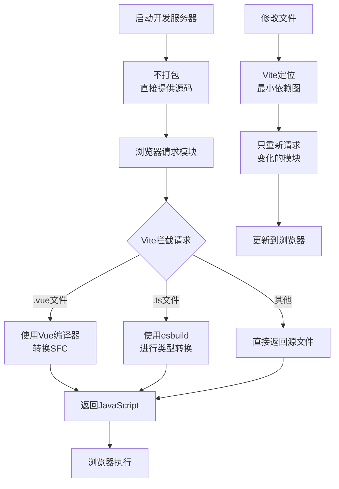
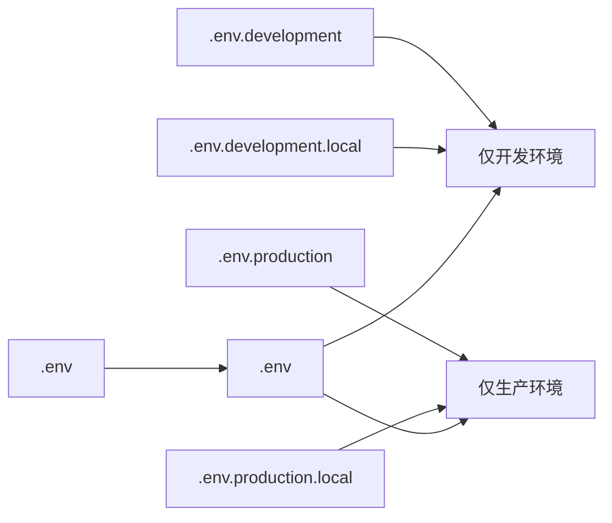
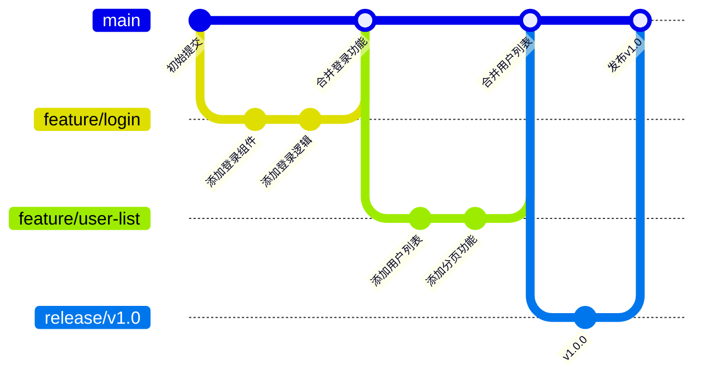

+++
title = "第18章 工程化实践"
weight = 180
date = "2026-03-25T12:54:00+08:00"
type = "docs"
description = ""
isCJKLanguage = true
draft = false
+++

# 第十八章 工程化实践

> 你写的代码能跑是一回事，你的项目能被别人维护是另一回事。本章我们来聊聊Vue项目的工程化——从项目配置、代码规范、Git工作流到构建优化。这些东西不会让你的功能更好，但会让你的项目更健康，让你的队友不会在你离职后诅咒你的名字。

## 18.1 Vite 核心原理

### 18.1.1 为什么选择 Vite

```mermaid
graph LR
    subgraph["传统构建工具 (Webpack)"]
        A1[修改代码] --> A2[重新打包<br/>整个项目]
        A2 --> A3[等待30秒...]
        A3 --> A4[刷新浏览器]
    end
    
    subgraph["Vite"]
        B1[修改代码] --> B2[仅更新<br/>改变的模块]
        B2 --> B3[浏览器立即<br/>收到更新]
        B3 --> B4[极速HMR]
    end
    
    style A3 fill:#ff6b6b,color:#fff
    style B3 fill:#90EE90
```

**Vite 的核心优势：**
- **开发时极速启动**：使用原生ES模块，不需要打包
- **热模块替换（HMR）**：只更新变化的模块，毫秒级响应
- **生产时优化**：使用Rollup进行tree-shaking和代码分割
- **配置简单**：比Webpack少80%的配置代码

### 18.1.2 Vite 工作原理



### 18.1.3 Vite 配置文件详解

```typescript
// vite.config.ts
import { defineConfig } from 'vite'
import vue from '@vitejs/plugin-vue'
import { resolve } from 'path'

export default defineConfig({
  // plugins：插件数组，按顺序执行
  // vue() 是处理 .vue 文件的核心插件，没有它 Vite 不认识 .vue 文件
  plugins: [
    vue({
      // template 下的 compilerOptions 用来配置 Vue 模板编译器的行为
      template: {
        compilerOptions: {
          // isCustomElement：告诉 Vue 编译器，哪些 HTML 标签是"自定义元素"（Web Components）
          // 填在这里的标签名不会被当作 Vue 组件，编译时会原样输出
          // isCustomElement: (tag) => tag.startsWith('ion-') // 示例：Ionic 框架的自定义标签
        }
      }
    })
  ],

  // base：部署时的基础路径
  // '/' 表示从域名的根目录部署（最常见）
  // 如果要部署到 example.com/vue-app/，这里要写成 '/vue-app/'
  base: '/',

  // resolve.alias：路径别名，让 import 语句更简洁
  // 有了这个配置，import '@/components/Button' 就等于 import '../src/components/Button'
  resolve: {
    alias: {
      '@': resolve(__dirname, 'src'),               // 项目源码根目录（最常用）
      '@components': resolve(__dirname, 'src/components'), // 组件目录的别名
      '@utils': resolve(__dirname, 'src/utils')         // 工具函数目录的别名
    }
  },

  // server：开发服务器配置（仅在 pnpm dev 时生效，构建时不起作用）
  server: {
    port: 3000,           // 开发服务器端口，默认 5173，改成 3000 更符合直觉
    host: true,           // 允许局域网其他设备访问（手机调试时需要），默认 false 只能本机访问
    open: true,          // 启动后自动打开浏览器，不需要的话改成 false

    // proxy：代理配置，把开发环境的请求转发到真正的后端服务器
    // 解决了前后端分离开发时的跨域（CORS）问题
    // 因为浏览器有同源策略，localhost:3000 发请求到 localhost:8080 会跨域
    // 有了代理，前端代码发 /api/xxx，实际请求被转发到 http://localhost:8080/api/xxx
    proxy: {
      '/api': {
        target: 'http://localhost:8080',  // 后端服务器地址（开发时）
        changeOrigin: true,                  // 改变请求头里的 origin，避免后端拒绝（必须写！）
        // rewrite：路径重写，把 /api 前缀去掉再发给后端
        // 如果后端 API 不是以 /api 开头，可以注释掉这行
        rewrite: (path) => path.replace(/^\/api/, '')
      }
    }
  },

  // build：生产构建配置
  build: {
    // target：构建目标 ECMAScript 版本
    // 'es2015' = 支持所有现代浏览器
    // 'es2020' = 额外支持 BigInt、可选链等更新的语法
    // 'modules' = 针对支持 ES Modules 的浏览器（最激进，打包体积最小）
    target: 'es2020',
    outDir: 'dist',       // 构建产物输出目录（默认就是 dist，通常不需要改）
    assetsDir: 'assets',  // 静态资源（图片、字体等）放在 dist/assets/ 下

    // sourcemap：是否生成 .map 文件（用于调试）
    // true = 生成 .map，生产构建建议 false，可以减少产物大小和暴露源码
    sourcemap: false,

    // minify：压缩方式
    // 'terser' = 使用 terser 压缩（慢，但压缩率高）
    // 'esbuild' = 使用 esbuild 压缩（快，Vue 官方默认值，推荐）
    // false = 不压缩（仅用于调试）
    minify: 'terser',

    // chunkSizeWarningLimit：超过这个大小的 chunk 会触发警告（单位 KB）
    // 默认 500KB，如果单个 JS 文件超过这个值就会警告
    // 可以适当调大，或者通过 manualChunks 拆分来解决问题
    chunkSizeWarningLimit: 1500,

    rollupOptions: {
      output: {
        // manualChunks：手动分包策略，把大文件拆成多个小文件
        // 好处：浏览器可以并行下载、利用缓存（只变动的部分重新下载）
        // 注意：分包会影响 HTTP/1.1 的并发请求数（每个文件一次请求），分太多也不好
        manualChunks: {
          // vue-vendor：把所有 Vue 相关的库打成一个文件（变化少，可以长期缓存）
          'vue-vendor': ['vue', 'vue-router', 'pinia'],
          // element-plus：UI 库通常很大，单独打包有利于更新时不影响其他部分
          'element-plus': ['element-plus']
        },

        // 文件名模板（方括号里的内容会被替换）
        // [name] = 文件原来的名字，[hash] = 根据内容生成的内容指纹
        // hash 的作用：内容变了 hash 就变，浏览器就会请求新文件；内容没变就用缓存
        entryFileNames: 'js/[name]-[hash].js',    // 入口文件的输出格式
        chunkFileNames: 'js/[name]-[hash].js',    // 非入口的 JS 文件格式
        assetFileNames: '[ext]/[name]-[hash].[ext]' // 静态资源格式（css/fonts/imgs 等）
      }
    }
  },

  // optimizeDeps：预优化配置
  // include 里的包会在项目启动时就被 Vite 预构建（转成 ESM）
  // 放进这里的一般是"不参与动态 import 的第三方库"
  // 如果某个第三方库在运行时才 import 导致报错，可以加到这里强制预构建
  optimizeDeps: {
    include: ['vue', 'vue-router', 'pinia']
  },

  // css：CSS 相关配置
  css: {
    preprocessorOptions: {
      scss: {
        // additionalData：每个 SCSS 文件开头都会自动插入这段内容
        // 相当于"全局引入"变量文件，这样每个 .vue 文件里不用手动 @import
        // 常用于放全局 SCSS 变量和混入（Mixin）
        additionalData: `@import "@/styles/variables.scss";`
      }
    }
  }
})
```

## 18.2 项目配置详解

### 18.2.1 环境变量



Vite使用`.env`文件管理环境变量：

```bash
# .env - 所有环境共享
VITE_APP_TITLE=我的Vue应用
VITE_API_BASE_URL=https://api.example.com

# .env.development - 仅开发环境
VITE_API_BASE_URL=http://localhost:8080
VITE_DEBUG=true

# .env.production - 仅生产环境
VITE_API_BASE_URL=https://api.production.com
VITE_DEBUG=false
```

```typescript
// 使用环境变量
// 必须以 VITE_ 开头才能暴露给客户端
console.log(import.meta.env.VITE_APP_TITLE)
console.log(import.meta.env.VITE_API_BASE_URL)

// 类型定义
// src/env.d.ts
/// <reference types="vite/client" />

interface ImportMetaEnv {
  readonly VITE_APP_TITLE: string
  readonly VITE_API_BASE_URL: string
  readonly VITE_DEBUG: string
}

interface ImportMeta {
  readonly env: ImportMetaEnv
}
```

### 18.2.2 package.json 脚本配置

```json
{
  "name": "my-vue-app",
  "version": "1.0.0",
  "type": "module",
  "scripts": {
    "dev": "vite",
    "build": "vue-tsc && vite build",
    "preview": "vite preview",
    "lint": "eslint . --ext .vue,.js,.jsx,.cjs,.mjs,.ts,.tsx --fix",
    "lint:style": "stylelint src/**/*.{css,scss,vue} --fix",
    "type-check": "vue-tsc --noEmit",
    "test": "vitest",
    "test:e2e": "playwright test"
  },
  "dependencies": {
    "vue": "^3.4.0",
    "vue-router": "^4.2.0",
    "pinia": "^2.1.0"
  },
  "devDependencies": {
    "@vitejs/plugin-vue": "^5.0.0",
    "vite": "^5.0.0",
    "typescript": "^5.3.0",
    "vue-tsc": "^1.8.0"
  }
}
```

### 18.2.3 tsconfig 配置

```json
{
  "compilerOptions": {
    "target": "ES2020",
    "useDefineForClassFields": true,
    "module": "ESNext",
    "lib": ["ES2020", "DOM", "DOM.Iterable"],
    "skipLibCheck": true,
    
    "moduleResolution": "bundler",
    "allowImportingTsExtensions": true,
    "resolveJsonModule": true,
    "isolatedModules": true,
    "noEmit": true,
    "jsx": "preserve",
    
    "strict": true,
    "noUnusedLocals": true,
    "noUnusedParameters": true,
    "noFallthroughCasesInSwitch": true,
    
    "baseUrl": ".",
    "paths": {
      "@/*": ["src/*"]
    }
  },
  "include": ["src/**/*.ts", "src/**/*.tsx", "src/**/*.vue"],
  "references": [{ "path": "./tsconfig.node.json" }]
}
```

## 18.3 代码规范（ESLint + Prettier）

### 18.3.1 ESLint 配置

```bash
# 安装依赖
pnpm add -D eslint @typescript-eslint/parser @typescript-eslint/eslint-plugin
pnpm add -D eslint-plugin-vue
```

```javascript
// .eslintrc.cjs（.cjs 后缀表示 CommonJS 模块格式，Node.js 兼容性好）
module.exports = {
  // root: true 表示这是项目根目录的 ESLint 配置
  // 找到这个文件后，ESLint 不会再向上查找父目录的配置文件
  root: true,

  // env：声明代码运行的环境，ESLint 会根据环境开启对应的全局变量检查
  // browser: true → 允许使用 window、document 等浏览器全局变量（不报 undefined 错误）
  // es2021: true → 允许使用 ES2021 的新语法（Promise.allSettled、String.prototype.replaceAll 等）
  // node: true → 允许使用 process、__dirname 等 Node.js 全局变量
  env: {
    browser: true,
    es2021: true,
    node: true
  },

  // extends：继承现成的规则集（"预设配置"），省去从零配置的麻烦
  // 这里继承了两套规则：
  // 'plugin:vue/vue3-essential' → Vue 官方推荐的最低限度规则
  // 'plugin:vue/vue3-recommended' → Vue 官方推荐的更严格规则
  // 'plugin:@typescript-eslint/recommended' → TypeScript 官方的推荐规则
  extends: [
    'plugin:vue/vue3-essential',
    'plugin:vue/vue3-recommended',
    'plugin:@typescript-eslint/recommended'
  ],

  // parser：指定 ESLint 使用的代码解析器
  // 'vue-eslint-parser' 能解析 .vue 文件的 <template> 部分（普通解析器不认识这个语法）
  // 同时还需要在 parserOptions.parser 里指定 JS/TS 解析器
  parser: 'vue-eslint-parser',

  parserOptions: {
    // ecmaVersion: 'latest' → 允许使用最新版本的 ECMAScript 语法
    ecmaVersion: 'latest',
    // @typescript-eslint/parser：解析 TypeScript 代码（解析 .ts 文件里 {{ }} 以外的部分）
    parser: '@typescript-eslint/parser',
    // sourceType: 'module' → 允许使用 ES Module（import/export）
    // 另一种选择是 'script'（CommonJS 格式），但现代项目几乎都用 ES Module
    sourceType: 'module'
  },

  // plugins：引入额外的规则集（extends 是"继承"，plugins 是"引入"）
  // 'vue' 插件：提供 Vue 3 专属的代码检查规则
  // '@typescript-eslint' 插件：提供 TypeScript 专属的代码检查规则
  plugins: ['vue', '@typescript-eslint'],

  rules: {
    // ===== Vue 相关规则 =====

    // 'vue/multi-word-component-names'：组件名必须是多个单词（防止和 HTML 原生标签冲突）
    // 'off' = 关闭此规则（允许单词组件名如 Button.vue）
    // 推荐值：'error' = 强制多单词，'off' = 关闭
    'vue/multi-word-component-names': 'off',

    // 'vue/no-v-html'：v-html 有 XSS 安全风险，建议只在完全信任内容时使用
    // 'warn' = 警告（不阻止构建），'error' = 阻止构建，'off' = 关闭
    'vue/no-v-html': 'warn',

    // 'vue/require-default-prop'：props 必须有默认值或说明 optional
    // 'off' = 关闭（TypeScript 里可选的 props 已经通过 ? 标记了）
    'vue/require-default-prop': 'off',

    // ===== TypeScript 相关规则 =====

    // '@typescript-eslint/no-unused-vars'：禁止有声明但从未使用的变量
    // 'error' = 违反时报错，[...] 里是额外配置
    '@typescript-eslint/no-unused-vars': ['error', {
      // argsIgnorePattern: '^_' → 以 _ 开头的函数参数不检查（常用作"占位参数"）
      argsIgnorePattern: '^_',
      // varsIgnorePattern: '^_' → 以 _ 开头的变量不检查
      varsIgnorePattern: '^_'
    }],

    // '@typescript-eslint/explicit-function-return-type'：要求显式声明函数返回值类型
    // 'off' = 关闭（TypeScript 能自动推断返回值类型，这个规则太严格）
    '@typescript-eslint/explicit-function-return-type': 'off',

    // '@typescript-eslint/no-explicit-any'：禁止使用 any 类型
    // 'warn' = 警告但不阻止编译（any 的存在本身就是风险，降级到警告比较实用）
    '@typescript-eslint/no-explicit-any': 'warn',

    // '@typescript-eslint/no-non-null-assertion'：禁止使用非空断言（obj!.xxx）
    // 'error' = 非空断言会中断编译（因为它强行跳过类型检查，有隐患）
    '@typescript-eslint/no-non-null-assertion': 'error',

    // ===== 通用规则 =====

    // 'no-console'：禁止使用 console
    // 生产环境 error = 阻止构建，开发环境 warn = 只提示
    // 注意：这个判断依赖 NODE_ENV 环境变量，需要配合 webpack/vite 的 DefinePlugin 使用
    'no-console': process.env.NODE_ENV === 'production' ? 'error' : 'warn',
    'no-debugger': process.env.NODE_ENV === 'production' ? 'error' : 'warn',

    // 'prefer-const'：必须用 const 声明不再修改的变量（防止误用 let）
    'prefer-const': 'error',
    // 'no-var'：禁止使用 var（let/const 是更好的选择）
    'no-var': 'error'
  },

  // globals：声明额外的全局变量，告诉 ESLint 这些变量是合法的，不是 undefined
  // 'readonly' = 全局变量只读（不能重新赋值）
  // Vue 3.3+ 的编译器宏不需要 import，直接用即可，声明为 readonly 防止误修改
  globals: {
    defineProps: 'readonly',
    defineEmits: 'readonly',
    defineExpose: 'readonly',
    withDefaults: 'readonly'
  }
}
```

### 18.3.2 Prettier 配置

```bash
pnpm add -D prettier eslint-config-prettier eslint-plugin-prettier
```

```json
// .prettierrc.json
// Prettier 的配置文件，每个选项的作用和可选值如下：
{
  // semi：是否在语句末尾加分号
  // false = 不加分号（推荐，现代项目主流）
  // true = 加分号
  "semi": false,

  // singleQuote：是否使用单引号
  // true = 使用单引号替代双引号（JS 字符串中通常用单引号）
  // false = 使用双引号
  "singleQuote": true,

  // tabWidth：一个 Tab 等于几个空格
  // 2 = 两个空格（Vue 官方推荐）
  // 4 = 四个空格（有些团队偏好）
  "tabWidth": 2,

  // trailingComma：在最后一个元素/属性后加逗号
  // 'es5' = ES5 及之前版本允许的位置加逗号（对象、数组等）
  // 'none' = 不加尾随逗号
  // 'all' = 在所有可能的位置加逗号（包括函数参数，ES2017+）
  "trailingComma": "es5",

  // printWidth：一行代码最多多少字符，超过则换行
  // 80 = 传统值（终端显示友好）
  // 100 = 现代值（屏幕更宽，更适合 1080p+ 显示器）
  "printWidth": 100,

  // bracketSpacing：对象字面量的大括号内是否有空格
  // true = { foo: bar }（有空格，更宽松）
  // false = {foo: bar}（无空格，更紧凑）
  "bracketSpacing": true,

  // arrowParens：箭头函数的参数是否必须用括号包裹
  // 'avoid' = 能省略就省略，如 x => x + 1（更简洁）
  // 'always' = 始终加括号，如 (x) => x + 1
  "arrowParens": "avoid",

  // endOfLine：行尾换行符格式
  // 'lf' = Unix 风格（\n），macOS/Linux 默认，Git 推荐
  // 'crlf' = Windows 风格（\r\n），Windows 默认
  // 'auto' = 保持原有格式（跨平台协作时用这个）
  "endOfLine": "lf",

  // vueIndentScriptAndStyle：是否缩进 Vue 文件中 <script> 和 <style> 的内容
  // false = 不缩进（因为 <template> 不缩进，保持一致）
  // true = 缩进（有些人喜欢缩进，但会导致 diff 难看）
  "vueIndentScriptAndStyle": false,

  // htmlWhitespaceSensitivity：HTML 文件中空白字符的敏感度
  // 'css' = 按 CSS 的规则处理（空白可能影响布局时敏感）
  // 'strict' = 所有空白都敏感
  // 'ignore' = 忽略空白差异
  "htmlWhitespaceSensitivity": "css"
}
```

```javascript
// .eslintrc.cjs 中添加 Prettier 插件
module.exports = {
  // ...
  extends: [
    // ... 其他配置
    'plugin:prettier/recommended'  // 必须放在最后
  ],
  rules: {
    'prettier/prettier': 'error'  // 让Prettier规则触发ESLint错误
  }
}
```

```json
// .vscode/settings.json - VSCode设置
{
  "editor.formatOnSave": true,
  "editor.defaultFormatter": "esbenp.prettier-vscode",
  "editor.codeActionsOnSave": {
    "source.fixAll.eslint": "explicit"
  },
  "[vue]": {
    "editor.defaultFormatter": "esbenp.prettier-vscode"
  },
  "[typescript]": {
    "editor.defaultFormatter": "esbenp.prettier-vscode"
  }
}
```

### 18.3.3 Git Hooks——给 Git 命令装上"自动质检员"

Git Hook 是 Git 的钩子机制——在某个 Git 操作（commit、push 等）执行之前或之后，自动运行你指定的脚本。我们可以利用这个机制，在每次 `git commit` 之前自动运行 ESLint 和 Prettier 检查代码质量。

**核心工具**：
- **Husky**：让 Git Hook 的配置可以通过 `.husky/` 目录管理（而不是藏在 `.git/hooks/` 里难以维护）
- **lint-staged**：只检查**暂存区（staged）里的文件**，不检查整个项目，速度快

**工作流程**：`git add .` → `git commit` → Husky 自动运行 lint-staged → lint-staged 只检查暂存文件 → ESLint/Prettier 检查并修复 → 通过后才真正 commit

**为什么不用 Husky 检查所有文件？** 因为检查所有文件太慢——项目有 1000 个文件，改了 3 个，却要检查全部 1000 个？lint-staged 只检查暂存的那 3 个文件，效率高得多。

```bash

```bash
pnpm add -D husky lint-staged
npx husky install
```

```json
// package.json
{
  "lint-staged": {
    "*.{vue,js,ts,jsx,tsx}": [
      "eslint --fix",
      "prettier --write"
    ],
    "*.{css,scss,less}": [
      "stylelint --fix",
      "prettier --write"
    ]
  }
}
```

```bash
# 添加 husky hook
npx husky add .husky/pre-commit "npx lint-staged"
```

```bash
# .husky/pre-commit
#!/usr/bin/env sh
. "$(dirname -- "$0")/_/husky.sh"

npx lint-staged
```

## 18.4 Git 工作流

### 18.4.1 分支管理策略



**推荐分支策略：**
- `main`：稳定代码，始终可以发布
- `develop`：开发主分支，汇总功能
- `feature/*`：功能分支
- `fix/*`：修复分支
- `release/*`：发布分支

### 18.4.2 Git Commit 规范

```bash
# 安装 commitlint
pnpm add -D @commitlint/config-conventional @commitlint/cli
```

```javascript
// commitlint.config.js
module.exports = {
  extends: ['@commitlint/config-conventional'],
  rules: {
    'type-enum': [
      2,
      'always',
      [
        'feat',     // 新功能
        'fix',      // 修复bug
        'docs',     // 文档变更
        'style',    // 代码格式（不影响功能）
        'refactor', // 重构（不是修复也不是新功能）
        'perf',     // 性能优化
        'test',     // 测试
        'chore',    // 构建或辅助工具
        'revert',   // 撤销提交
        'ci'        // CI配置
      ]
    ],
    'type-case': [2, 'always', 'lower-case'],
    'subject-full-stop': [2, 'never', '.'],
    'subject-case': [2, 'never', ['sentence-case', 'start-case', 'pascal-case', 'upper-case']]
  }
}
```

```bash
# 提交示例
git commit -m "feat: 添加用户登录功能"
git commit -m "fix: 修复用户列表分页问题"
git commit -m "docs: 更新README文档"
```

### 18.4.3 .gitignore 最佳实践

```bash
# .gitignore for Vue/Vite项目

# 依赖
node_modules/
.pnpm-store/

# 构建输出
dist/
dist-ssr/
*.local

# 环境变量
.env
.env.local
.env.*.local

# 日志
npm-debug.log*
yarn-debug.log*
yarn-error.log*
pnpm-debug.log*

# 编辑器
.vscode/*
!.vscode/extensions.json
.idea/
*.suo
*.ntvs*
*.njsproj
*.sln
*.sw?

# 测试覆盖率
coverage/
*.lcov

# 操作系统
.DS_Store
Thumbs.db

# 缓存
.cache/
.parcel-cache/
```

## 18.5 构建优化

### 18.5.1 路由懒加载

```typescript
// router/index.ts
import { createRouter, createWebHistory } from 'vue-router'

// 路由懒加载 - 按需加载组件
const routes = [
  {
    path: '/',
    name: 'Home',
    // 方式1：动态导入（推荐）
    component: () => import('@/views/Home.vue')
  },
  {
    path: '/about',
    name: 'About',
    // 方式2：webpack magic comment（用于预加载提示）
    component: () => import(/* webpackChunkName: "about" */ '@/views/About.vue')
  },
  {
    path: '/user/:id',
    name: 'User',
    // 方式3：工厂函数（用于条件加载）
    component: () => import('@/views/User.vue'),
    props: route => ({
      id: route.params.id
    })
  },
  {
    path: '/dashboard',
    name: 'Dashboard',
    // 预加载策略：相近路由预加载
    component: () => import(/* webpackPrefetch: true */ '@/views/Dashboard.vue')
  }
]

// 命名chunk（会在构建时生成 vendor-home.js 等文件）
```

### 18.5.2 图片与资源优化

```typescript
// vite.config.ts
import { defineConfig } from 'vite'
import viteCompression from 'vite-plugin-compression'

export default defineConfig({
  build: {
    assetsInlineLimit: 4096,  // 小于4KB的图片转为base64
    assetsDir: 'assets',
    
    // Rollup选项
    rollupOptions: {
      output: {
        // 资源文件命名
        assetFileNames: (assetInfo) => {
          const info = assetInfo.name.split('.')
          const ext = info[info.length - 1]

          if (/\.(png|jpe?g|gif|svg|webp|ico)$/.test(assetInfo.name)) {
            return `images/[name]-[hash][extname]`
          }
          if (/\.(woff2?|eot|ttf|otf)$/.test(assetInfo.name)) {
            return `fonts/[name]-[hash][extname]`
          }
          return `assets/[name]-[hash][extname]`
        }
      }
    }
  },
  
  plugins: [
    // gzip压缩
    viteCompression({
      algorithm: 'gzip',
      ext: '.gz',
      threshold: 10240  // >10KB的文件才压缩
    })
  ]
})
```

### 18.5.3 Tree Shaking 优化

```typescript
// 确保模块是纯ES Module（没有副作用）
// 这样构建工具才能安全地移除未使用的代码

// utils/format.ts
// 方式1：使用具名导出
export function formatDate(date: Date): string {
  return date.toISOString().split('T')[0]
}

export function formatCurrency(amount: number): string {
  return `¥${amount.toFixed(2)}`
}

// 方式2：使用 @rollup/plugin-treeshaking 注释
export function heavyOperation() {
  // 告诉构建工具这个函数可能有副作用
  // 但实际上我们可以优化掉它如果没有被使用
  'rollup-plugin-treeshaking';
  return 'heavy';
}

// 组件中使用
import { formatDate } from '@/utils/format'
// 如果只导入了 formatDate，formatCurrency会被tree-shaking掉
```

### 18.5.4 预渲染与SSR

```typescript
// vite.config.ts
import { defineConfig } from 'vite'
import prerender from 'vite-plugin-prerender'

export default defineConfig({
  plugins: [
    vue(),
    prerender({
      // 需要预渲染的路由
      routes: ['/', '/about', '/products'],
      // 抓取选项
      crawlLinks: true,
      // 渲染函数（用于SPA）
      render: (url) => {
        // 返回HTML字符串
      }
    })
  ]
})
```

## 18.6 Monorepo 实践

### 18.6.1 Monorepo 概述

Monorepo是一种项目管理方式，将多个包放在同一个代码仓库中：

```mermaid
graph TD
    subgraph["monorepo-root"]
        A[package.json<br/>workspace配置]
        B[packages/
        shared/]
        C[packages/
        web/]
        D[packages/
        mobile/]
    end
    
    E[packages/shared] -->|被依赖| C
    E -->|被依赖| D
    C -->|开发依赖| D
    D -->|开发依赖| C
```

**优势：**
- 代码共享更容易
- 统一版本管理
- 一次性构建/测试所有项目
- 跨项目重构更简单

### 18.6.2 pnpm Workspace 配置

```bash
# 项目结构
my-monorepo/
├── package.json
├── pnpm-workspace.yaml
├── packages/
│   ├── shared/         # 共享工具库
│   │   ├── package.json
│   │   └── src/
│   ├── web/           # Web应用
│   │   ├── package.json
│   │   └── src/
│   └── mobile/        # 移动端
│       ├── package.json
│       └── src/
└── pnpm-lock.yaml
```

```yaml
# pnpm-workspace.yaml
packages:
  - 'packages/*'
```

```json
// 根目录 package.json
{
  "name": "my-monorepo",
  "version": "1.0.0",
  "private": true,
  "scripts": {
    "dev:web": "pnpm --filter web dev",
    "dev:mobile": "pnpm --filter mobile dev",
    "build:shared": "pnpm --filter shared build",
    "build:all": "pnpm -r build",
    "lint:all": "pnpm -r lint",
    "test:all": "pnpm -r test"
  },
  "devDependencies": {
    "typescript": "^5.3.0"
  }
}
```

```json
// packages/shared/package.json
{
  "name": "@my/shared",
  "version": "1.0.0",
  "main": "./dist/index.js",
  "types": "./dist/index.d.ts",
  "scripts": {
    "build": "tsc && vue-tsc",
    "watch": "tsc -w"
  }
}
```

```json
// packages/web/package.json
{
  "name": "@my/web",
  "dependencies": {
    "@my/shared": "workspace:*"
  }
}
```

### 18.6.3 Turborepo 入门

Turborepo是Vercel出品的Monorepo构建工具：

```bash
pnpm add -D turbo
```

```json
// turbo.json
{
  "$schema": "https://turbo.build/schema.json",
  "pipeline": {
    "build": {
      "dependsOn": ["^build"],  // ^ 表示依赖的包的build先完成
      "outputs": ["dist/**", ".next/**"]
    },
    "dev": {
      "cache": false,
      "persistent": true
    },
    "lint": {
      "outputs": []
    },
    "test": {
      "outputs": ["coverage/**"],
      "dependsOn": ["build"]
    }
  }
}
```

```json
// packages/web/package.json
{
  "scripts": {
    "dev": "turbo run dev",
    "build": "turbo run build",
    "lint": "turbo run lint",
    "test": "turbo run test"
  }
}
```

## 18.7 本章小结

本章我们介绍了Vue项目的工程化实践：

| 主题 | 关键工具 | 核心概念 |
|------|----------|----------|
| 构建工具 | Vite | 极速HMR + Rollup打包 |
| 环境变量 | .env文件 | VITE_前缀暴露客户端 |
| 代码规范 | ESLint + Prettier | Husky + lint-staged |
| Git工作流 | commitlint | feat/fix/docs前缀 |
| 构建优化 | 路由懒加载 | Tree shaking + 压缩 |
| Monorepo | pnpm workspace | workspace:*依赖 |

工程化不是为了让代码更"高级"，而是为了让团队协作更顺畅。一个好的工程化配置应该像空气一样——你感觉不到它的存在，但它在默默保护着你。

> 记住：代码是写给人看的，顺带能在机器上运行。不要为了炫技而过度工程化，也不要为了省事而完全不管。找到适合项目规模的平衡点，才是真正的智慧。
