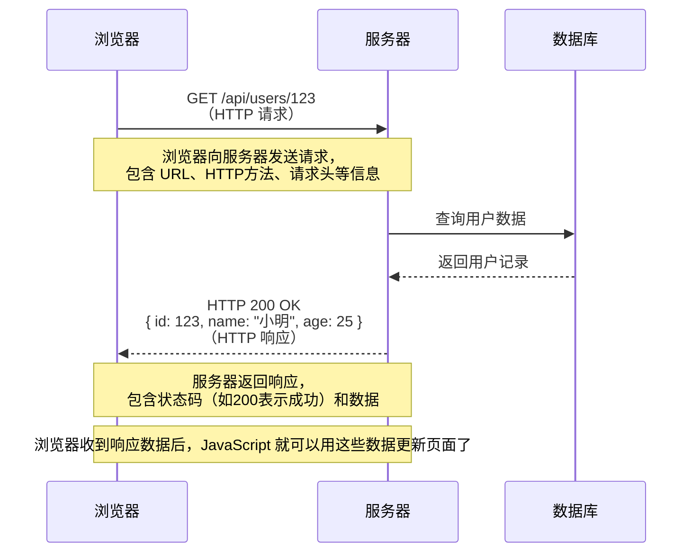
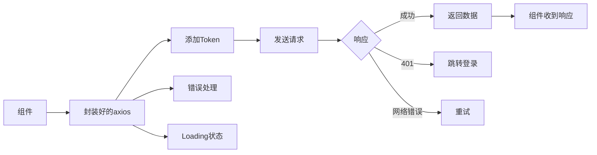

+++
title = "第19章 网络请求与工具库"
weight = 190
date = "2026-03-25T12:54:00+08:00"
type = "docs"
description = ""
isCJKLanguage = true
draft = false
+++

# 第十九章 网络请求与工具库

> 任何一个不算玩具的Vue应用都需要和网络打交道——获取数据、提交表单、上传文件...没有网络请求的应用就像一家没有外卖的餐厅，功能再强也让人觉得少了点什么。本章我们聊聊Vue生态中的网络请求方案和一些实用工具库。

## 19.0 网络请求入门（小白必看）

在写第一个网络请求代码之前，我们先搞清楚几个最基本的问题：**什么是 HTTP？什么是 API？为什么前端要"发请求"？**

### 19.0.1 什么是 HTTP？

**HTTP（HyperText Transfer Protocol，超文本传输协议）**是浏览器和服务器之间通信的"语言"。当你访问一个网页时，浏览器（客户端）用 HTTP 向服务器说"我要看这个页面"，服务器用 HTTP 回答"这是页面内容"。整个互联网的网页传输都靠 HTTP。

类比理解：**HTTP 就像餐厅里的服务员**。你（浏览器）对服务员（HTTP）说"我要一份宫保鸡丁"，服务员把请求传到厨房（服务器），厨房做好后服务员再把菜端回来（响应）。服务员就是浏览器和服务器之间的中间人。

HTTP 请求有几个关键组成部分：
- **URL（网址）**：告诉服务器"我要什么"，比如 `https://api.example.com/users`
- **HTTP 方法**：告诉服务器你想干什么，最常见的有：
  - `GET`：获取数据（像点菜，只看不改）
  - `POST`：提交数据（像下单，创建新东西）
  - `PUT`：更新数据（像修改订单）
  - `DELETE`：删除数据（像退菜）

### 19.0.2 什么是 REST API？

**REST（Representational State Transfer）**是一种设计 API 的规范。按 REST 规范设计的 API，通常是这样的格式：

| HTTP 方法 | URL 格式 | 含义 |
|-----------|---------|------|
| `GET` | `/users` | 获取用户列表 |
| `GET` | `/users/123` | 获取 ID 为 123 的用户 |
| `POST` | `/users` | 创建一个新用户 |
| `PUT` | `/users/123` | 更新 ID 为 123 的用户 |
| `DELETE` | `/users/123` | 删除 ID 为 123 的用户 |

**REST 的核心思想**：URL 表示"资源"（名词，如 users），HTTP 方法表示"操作"（动词，如 GET/POST）。这就是为什么 REST API 叫"表现层状态转移"——通过 HTTP 方法来转移资源的状态。

### 19.0.3 什么是请求和响应？

一个完整的 HTTP 交互是这样的：



### 19.0.4 状态码是什么？

服务器返回响应时，会带一个**状态码**，表示"请求结果如何"：

| 状态码 | 含义 | 举个例子 |
|--------|------|---------|
| **200** | 成功 | GET 用户信息成功 |
| **201** | 创建成功 | POST 新建用户成功 |
| **400** | 请求参数错误 | 提交的数据格式不对 |
| **401** | 未登录 / Token 过期 | 没带 Token 或 Token 无效 |
| **403** | 没有权限 | 登录了但没有权限访问 |
| **404** | 资源不存在 | 用户 ID 123 根本不存在 |
| **500** | 服务器内部错误 | 后端代码出 bug 了 |

记住几个关键的状态码：**200 是成功**，**400 系列是客户端的问题（你发的东西有问题）**，**500 系列是服务端的问题（服务器出错了）**。

### 19.0.5 前端为什么需要发请求？

浏览器的 JavaScript 本身只能操作页面上的东西，不能直接访问数据库。**网络请求就是 JavaScript 和服务器之间的桥梁**——JavaScript 发一个请求给服务器，服务器查数据库，返回数据给 JavaScript，JavaScript 再用这些数据更新页面。

举一个实际场景：
1. 用户在搜索框输入"Vue"
2. JavaScript 发起 `GET /api/search?q=Vue`
3. 服务器在数据库里搜索"Vue"相关文章
4. 服务器返回 `{ results: [...] }`
5. JavaScript 把这些结果渲染成 HTML 展示给用户

这就是一个完整的"前后端分离"的交互流程。

## 19.1 Axios 封装

### 19.1.1 为什么需要封装

直接用axios裸写当然可以，但当你需要：
- 统一添加token
- 处理401自动跳转登录
- 统一错误提示
- 请求重试
- 取消重复请求

的时候，你就会需要一个封装好的axios实例。



### 19.1.2 基础封装

```typescript
// utils/http.ts
import axios, { 
  AxiosInstance, 
  AxiosRequestConfig, 
  AxiosResponse,
  AxiosError 
} from 'axios'
import { ElMessage } from 'element-plus'
import { useUserStore } from '@/stores/user'
import router from '@/router'

// 创建axios实例
const http: AxiosInstance = axios.create({
  baseURL: import.meta.env.VITE_API_BASE_URL,
  timeout: 15000,
  headers: {
    'Content-Type': 'application/json'
  }
})

// 请求拦截器
http.interceptors.request.use(
  (config) => {
    // 添加Token
    const userStore = useUserStore()
    if (userStore.token) {
      config.headers.Authorization = `Bearer ${userStore.token}`
    }
    
    // 添加时间戳防止缓存（GET请求）
    if (config.method === 'get' && !config.params._t) {
      config.params = { 
        ...config.params, 
        _t: Date.now() 
      }
    }
    
    return config
  },
  (error) => {
    // 请求错误
    return Promise.reject(error)
  }
)

// 响应拦截器
http.interceptors.response.use(
  (response: AxiosResponse) => {
    const { code, data, message } = response.data
    
    // 根据业务状态码处理
    if (code === 200 || code === 0) {
      return data
    }
    
    // 其他业务错误
    ElMessage.error(message || '请求失败')
    return Promise.reject(new Error(message))
  },
  async (error: AxiosError) => {
    const { response } = error
    
    if (response) {
      switch (response.status) {
        case 400:
          ElMessage.error('请求参数错误')
          break
        case 401:
          // Token过期，跳转登录
          ElMessage.error('登录已过期，请重新登录')
          const userStore = useUserStore()
          userStore.logout()
          router.push('/login')
          break
        case 403:
          ElMessage.error('没有权限访问')
          break
        case 404:
          ElMessage.error('请求资源不存在')
          break
        case 500:
          ElMessage.error('服务器错误')
          break
        default:
          ElMessage.error('网络错误，请稍后重试')
      }
    } else if (error.request) {
      // 请求已发出但没有收到响应
      ElMessage.error('网络连接失败，请检查网络')
    } else {
      // 请求配置出错
      ElMessage.error('请求配置错误')
    }
    
    return Promise.reject(error)
  }
)

export default http
```

### 19.1.3 请求重试机制

```typescript
// utils/http.ts
import axios, { AxiosInstance, AxiosRequestConfig } from 'axios'

// 重试拦截器
const retryInterceptor = (http: AxiosInstance) => {
  http.interceptors.response.use(
    undefined,
    async (error) => {
      const config = error.config as AxiosRequestConfig & { _retryCount?: number }
      
      // 判断是否需要重试
      if (!config || error.code !== 'ECONNABORTED') {
        return Promise.reject(error)
      }
      
      // 重试次数
      config._retryCount = config._retryCount || 0
      
      // 最多重试3次
      if (config._retryCount >= 3) {
        return Promise.reject(error)
      }
      
      config._retryCount++
      
      // 延迟重试（指数退避）
      const delay = Math.pow(2, config._retryCount) * 1000
      await new Promise(resolve => setTimeout(resolve, delay))
      
      console.log(`重试第${config._retryCount}次...`)
      return http(config)
    }
  )
}

// 使用
retryInterceptor(http)
```

### 19.1.4 取消请求

```typescript
// utils/cancelToken.ts
import axios from 'axios'

// 管理所有的取消函数
const pendingMap = new Map<string, AbortController>()

/**
 * 生成请求的唯一标识
 */
function generateRequestKey(config: any): string {
  const { method, url, params, data } = config
  return [method, url, JSON.stringify(params), JSON.stringify(data)].join('&')
}

/**
 * 添加到待处理队列
 */
export function addPending(config: any) {
  const requestKey = generateRequestKey(config)
  
  // 如果已存在，取消之前的请求
  if (pendingMap.has(requestKey)) {
    const controller = pendingMap.get(requestKey)
    controller?.abort()
    pendingMap.delete(requestKey)
  }
  
  // 添加新的
  const controller = new AbortController()
  config.signal = controller.signal
  pendingMap.set(requestKey, controller)
}

/**
 * 从队列中移除
 */
export function removePending(config: any) {
  const requestKey = generateRequestKey(config)
  
  if (pendingMap.has(requestKey)) {
    const controller = pendingMap.get(requestKey)
    controller?.abort()
    pendingMap.delete(requestKey)
  }
}

/**
 * 清除所有待处理的请求
 */
export function clearAllPending() {
  for (const controller of pendingMap.values()) {
    controller.abort()
  }
  pendingMap.clear()
}

// 挂载到axios实例
const http = axios.create()

http.interceptors.request.use((config) => {
  addPending(config)
  return config
})

http.interceptors.response.use(
  (response) => {
    removePending(response.config)
    return response
  },
  (error) => {
    removePending(error.config)
    return Promise.reject(error)
  }
)
```

### 19.1.5 API 模块化

```typescript
// api/user.ts
import http from '@/utils/http'
import type { User, UserCreateInput } from '@/types'

/**
 * 获取用户列表
 */
export function getUserList(params: {
  page: number
  pageSize: number
}): Promise<{ list: User[]; total: number }> {
  return http.get('/users', { params })
}

/**
 * 获取用户详情
 */
export function getUserById(id: number): Promise<User> {
  return http.get(`/users/${id}`)
}

/**
 * 创建用户
 */
export function createUser(data: UserCreateInput): Promise<User> {
  return http.post('/users', data)
}

/**
 * 更新用户
 */
export function updateUser(id: number, data: Partial<User>): Promise<User> {
  return http.put(`/users/${id}`, data)
}

/**
 * 删除用户
 */
export function deleteUser(id: number): Promise<void> {
  return http.delete(`/users/${id}`)
}
```

```typescript
// api/index.ts - 统一导出
export * from './user'
export * from './article'
export * from './upload'
```

### 19.1.6 在组件中使用

```vue
<template>
  <div class="user-list">
    <div v-if="loading" class="loading">加载中...</div>
    <div v-else-if="error" class="error">{{ error }}</div>
    <template v-else>
      <div v-for="user in userList" :key="user.id" class="user-item">
        {{ user.name }}
      </div>
      <el-pagination
        v-model:current-page="page"
        :page-size="pageSize"
        :total="total"
        @current-change="fetchUsers"
      />
    </template>
  </div>
</template>

<script setup lang="ts">
import { ref, onMounted, onUnmounted } from 'vue'
import { getUserList } from '@/api/user'
import { clearAllPending } from '@/utils/cancelToken'
import type { User } from '@/types'

const loading = ref(false)
const error = ref<string | null>(null)
const userList = ref<User[]>([])
const page = ref(1)
const pageSize = ref(10)
const total = ref(0)

async function fetchUsers() {
  loading.value = true
  error.value = null
  
  try {
    const result = await getUserList({
      page: page.value,
      pageSize: pageSize.value
    })
    userList.value = result.list
    total.value = result.total
  } catch (e) {
    error.value = '获取用户列表失败'
  } finally {
    loading.value = false
  }
}

onMounted(() => {
  fetchUsers()
})

// 组件卸载时取消所有请求
onUnmounted(() => {
  clearAllPending()
})
</script>
```

## 19.2 Dayjs 时间处理

### 19.2.1 为什么选择 Dayjs

- **轻量**：只有2KB，moment.js的替代品
- **不可变**：所有操作返回新实例
- **API兼容**：和moment.js很相似，学习成本低
- **TypeScript支持**：类型定义完整

```bash
pnpm add dayjs
```

### 19.2.2 基础用法

```typescript
import dayjs from 'dayjs'

// 当前时间
const now = dayjs()

// 格式化
console.log(now.format('YYYY-MM-DD'))           // 2024-01-15
console.log(now.format('YYYY-MM-DD HH:mm:ss'))  // 2024-01-15 14:30:45
console.log(now.format('MMMM Do, YYYY'))        // January 15th, 2024
console.log(now.format('[Today is] dddd'))      // Today is Monday

// 解析
const date1 = dayjs('2024-01-15')
const date2 = dayjs('2024/01/15', 'YYYY/MM/DD')
const date3 = dayjs(new Date())
const date4 = dayjs.unix(1705315845)  // 时间戳

// 获取/设置
dayjs().year()           // 获取年份
dayjs().month()          // 获取月份（0-11）
dayjs().date()           // 获取日期（1-31）
dayjs().day()            // 获取星期（0-6）
dayjs().hour()           // 获取小时
dayjs().minute()         // 获取分钟

dayjs().year(2025)       // 设置年份
dayjs().startOf('month') // 月初
dayjs().endOf('week')    // 周末

// 操作
dayjs().add(1, 'day')     // 加1天
dayjs().subtract(1, 'year')  // 减1年
dayjs().startOf('day').add(1, 'hour')  // 链式调用

// 计算差值
const start = dayjs('2024-01-01')
const end = dayjs('2024-12-31')

end.diff(start, 'day')       // 365天
end.diff(start, 'month')      // 11个月
end.diff(start, 'day', true)  // 365.0（精确值）
```

### 19.2.3 相对时间

```typescript
import relativeTime from 'dayjs/plugin/relativeTime'
import calendar from 'dayjs/plugin/calendar'
import 'dayjs/locale/zh-cn'

dayjs.extend(relativeTime)
dayjs.extend(calendar)
dayjs.locale('zh-cn')

// 相对时间
dayjs().to(dayjs('2024-01-01'))     // "15天后" / "15 days later"
dayjs().from(dayjs('2024-01-01'))    // "15天前" / "15 days ago"
dayjs().toNow()                      // "几秒内" / "a few seconds ago"
dayjs().fromNow()                    // "几秒前" / "a few seconds ago"

// 日历时间（相对于今天的显示）
dayjs().calendar(dayjs('2024-01-01'))
// 输出类似: "2024年1月1日 下午12:00"

dayjs().calendar(null, {
  sameDay: '[今天] HH:mm',
  nextDay: '[明天] HH:mm',
  nextWeek: '[下周一] HH:mm',
  lastWeek: '[上周] dddd HH:mm',
  sameElse: 'YYYY-MM-DD HH:mm'
})
```

### 19.2.4 常用工具函数

```typescript
import dayjs from 'dayjs'
import isBetween from 'dayjs/plugin/isBetween'
import isLeapYear from 'dayjs/plugin/isLeapYear'
import weekOfYear from 'dayjs/plugin/weekOfYear'
import quarterOfYear from 'dayjs/plugin/quarterOfYear'

dayjs.extend(isBetween)
dayjs.extend(isLeapYear)
dayjs.extend(weekOfYear)
dayjs.extend(quarterOfYear)

// 判断是否在范围内
dayjs('2024-06-15').isBetween('2024-01-01', '2024-12-31')  // true
dayjs('2024-06-15').isBetween('2024-06-15', '2024-06-15', 'day')  // inclusive

// 是否闰年
dayjs('2024-01-01').isLeapYear()  // true
dayjs('2023-01-01').isLeapYear()  // false

// 一年中的第几周
dayjs('2024-01-15').week()  // 3

// 一年中的第几季度
dayjs('2024-06-15').quarter()  // 2

// 在Vue组件中使用
const formatTime = (time: string | Date) => {
  const date = dayjs(time)
  const now = dayjs()
  
  const diffMinutes = now.diff(date, 'minute')
  
  if (diffMinutes < 1) return '刚刚'
  if (diffMinutes < 60) return `${diffMinutes}分钟前`
  if (diffMinutes < 1440) return `${Math.floor(diffMinutes / 60)}小时前`
  if (diffMinutes < 10080) return `${Math.floor(diffMinutes / 1440)}天前`
  
  return date.format('YYYY-MM-DD')
}
```

## 19.3 Lodash-es 工具库

### 19.3.1 为什么用 lodash-es

- **按需引入**：lodash-es支持tree-shaking
- **TypeScript支持**：类型定义完整
- **统一抽象**：避免自己写边界case

```bash
pnpm add lodash-es
```

### 19.3.2 常用函数

```typescript
import { 
  // 数组
  chunk,           // 分组
  compact,        // 去除假值
  difference,     // 差集
  groupBy,        // 分组
  orderBy,        // 排序
  uniqBy,         // 去重
  
  // 对象
  cloneDeep,      // 深拷贝
  merge,          // 合并对象
  pick,           // 选取属性
  omit,           // 排除属性
  
  // 函数
  debounce,       // 防抖
  throttle,       // 节流
  memoize,        // 记忆化
  
  // 字符串
  camelCase,      // 驼峰命名
  kebabCase,      // 短横线命名
  template        // 模板字符串
} from 'lodash-es'

// 数组操作
const arr = [1, 2, 3, 4, 5, 6]

// 分块
chunk(arr, 2)  // [[1,2], [3,4], [5,6]]
chunk(arr, 4)  // [[1,2,3,4], [5,6]]

// 去假值
compact([0, 1, false, 2, '', 3])  // [1, 2, 3]

// 差集
difference([1, 2, 3], [2, 4])  // [1, 3]

// 分组
groupBy(['one', 'two', 'three'], 'length')  // {3: ['one', 'two'], 5: ['three']}

// 对象操作
const obj = { a: 1, b: { c: 2 }, d: [1, 2, 3] }

// 深拷贝（重要！）
const clone = cloneDeep(obj)

// 选取属性
pick({ a: 1, b: 2, c: 3 }, ['a', 'c'])  // { a: 1, c: 3 }

// 排除属性
omit({ a: 1, b: 2, c: 3 }, ['b'])  // { a: 1, c: 3 }

// 合并对象
merge({ a: 1 }, { b: 2 })  // { a: 1, b: 2 }
merge({ a: { b: 1 } }, { a: { c: 2 } })  // { a: { b: 1, c: 2 } }

// 字符串转换
camelCase('foo-bar')      // 'fooBar'
kebabCase('fooBar')      // 'foo-bar'
snakeCase('fooBar')      // 'foo_bar'

// 防抖（常用于搜索输入）
import { debounce } from 'lodash-es'

const debouncedSearch = debounce((keyword: string) => {
  console.log('搜索:', keyword)
}, 300)

// 节流（常用于滚动事件）
import { throttle } from 'lodash-es'

const throttledScroll = throttle(() => {
  console.log('滚动位置:', window.scrollY)
}, 200)

window.addEventListener('scroll', throttledScroll)
```

### 19.3.3 实际应用示例

```typescript
// utils/formatters.ts
import { cloneDeep, pick, omit, merge } from 'lodash-es'

// 深拷贝表单数据（避免污染原数据）
function cloneFormData<T extends object>(data: T): T {
  return cloneDeep(data)
}

// 提交时只发送修改过的字段
function getChangedFields<T extends object>(
  original: T, 
  current: T, 
  fields: (keyof T)[]
): Partial<T> {
  const changed: Partial<T> = {}
  
  for (const field of fields) {
    if (original[field] !== current[field]) {
      changed[field] = current[field]
    }
  }
  
  return changed
}

// 安全的对象合并
function safeMerge<T extends object>(target: T, source: Partial<T>): T {
  return merge(cloneDeep(target), source)
}

// 数据预处理
function processTableData<T extends { id: string | number }>(
  data: T[],
  options: {
    sortBy?: keyof T
    sortOrder?: 'asc' | 'desc'
    filter?: Partial<T>
  }
): T[] {
  let result = cloneDeep(data)
  
  // 过滤
  if (options.filter) {
    const filterKeys = Object.keys(options.filter) as (keyof T)[]
    result = result.filter(item => 
      filterKeys.every(key => item[key] === options.filter![key])
    )
  }
  
  // 排序
  if (options.sortBy) {
    const order = options.sortOrder === 'desc' ? -1 : 1
    result.sort((a, b) => {
      const aVal = a[options.sortBy!]
      const bVal = b[options.sortBy!]
      return aVal < bVal ? -order : order
    })
  }
  
  return result
}
```

## 19.4 VueUse 核心API

### 19.4.1 VueUse 简介

VueUse是Vue Composition API的工具集，提供了大量实用的响应式函数：

```bash
pnpm add @vueuse/core
```

### 19.4.2 核心API

```typescript
import { 
  // 响应式
  ref, reactive, computed, watch,
  
  // DOM
  useElementBounding,
  useEventListener,
  useResizeObserver,
  useIntersectionObserver,
  
  // 网络
  useFetch,
  useWebSocket,
  
  // 传感器
  useGeolocation,
  useMediaQuery,
  
  // 工具
  useDebounceFn,
  useThrottleFn,
  onClickOutside,
  
  // 生命周期
  useLocalStorage,
  useSessionStorage,
  useCookie
} from '@vueuse/core'
```

### 19.4.3 useFetch - 响应式请求

```typescript
import { useFetch } from '@vueuse/core'

// 基础用法
const { data, isFetching, error, execute } = useFetch('/api/users')

// 带参数
const { data: user, isFinished } = useFetch('/api/users/1', {
  immediate: false  // 不立即执行
})

// 手动触发
const loadUser = async () => {
  await execute()
  if (user.value) {
    console.log(user.value.name)
  }
}

// 响应式URL
const userId = ref(1)
const { data: userData } = useFetch(computed(() => `/api/users/${userId.value}`))

// 变更userId会自动重新请求
userId.value = 2
```

### 19.4.4 useLocalStorage 与 useSessionStorage

```typescript
import { useLocalStorage, useSessionStorage } from '@vueuse/core'

// useLocalStorage - 持久化存储
const userName = useLocalStorage('userName', '张三')
const userPrefs = useLocalStorage('userPrefs', {
  theme: 'dark',
  language: 'zh-CN'
}, {
  serializer: {  // 自定义序列化
    read: (v: any) => v ? JSON.parse(v) : null,
    write: (v: any) => JSON.stringify(v)
  }
})

// 修改会自动同步到localStorage
userName.value = '李四'

// useSessionStorage - 会话存储（关闭浏览器后清除）
const searchHistory = useSessionStorage('searchHistory', [] as string[])

// 添加搜索历史
function addSearchHistory(keyword: string) {
  const history = searchHistory.value
  if (!history.includes(keyword)) {
    searchHistory.value = [keyword, ...history].slice(0, 10)
  }
}
```

### 19.4.5 useEventListener - 事件监听

```typescript
import { useEventListener } from '@vueuse/core'
import { ref, onMounted, onUnmounted } from 'vue'

// 方式1：在setup中直接使用
setup() {
  const boxRef = ref<HTMLElement>()
  
  useEventListener('resize', () => {
    console.log('窗口大小变化')
  })
  
  useEventListener('scroll', () => {
    console.log('页面滚动')
  }, { passive: true })
  
  // 监听元素事件
  if (boxRef.value) {
    useEventListener(boxRef.value, 'click', () => {
      console.log('点击了box')
    })
  }
  
  // 自动清理（组件卸载时自动移除监听）
}

// 方式2：使用目标元素ref
const buttonRef = ref<HTMLElement>()

useEventListener(buttonRef, 'mouseenter', () => {
  console.log('鼠标进入')
})
```

### 19.4.6 onClickOutside - 点击外部

```typescript
import { ref } from 'vue'
import { onClickOutside } from '@vueuse/core'

const isOpen = ref(false)
const dropdownRef = ref<HTMLElement>()

// 点击dropdown外部时关闭
onClickOutside(dropdownRef, () => {
  isOpen.value = false
})
```

```vue
<template>
  <div class="dropdown-container">
    <button @click="isOpen = !isOpen">打开下拉菜单</button>
    
    <div v-if="isOpen" ref="dropdownRef" class="dropdown-menu">
      <div class="menu-item">选项1</div>
      <div class="menu-item">选项2</div>
      <div class="menu-item">选项3</div>
    </div>
  </div>
</template>
```

### 19.4.7 useDebounceFn 与 useThrottleFn

```typescript
import { useDebounceFn, useThrottleFn } from '@vueuse/core'

// 防抖函数
const debouncedSearch = useDebounceFn((keyword: string) => {
  console.log('实际搜索:', keyword)
}, 500)

// 节流函数
const throttledScroll = useThrottleFn(() => {
  console.log('滚动位置:', window.scrollY)
}, 200)

// 在模板中使用
const handleInput = (e: Event) => {
  const value = (e.target as HTMLInputElement).value
  debouncedSearch(value)
}

const handleScroll = () => {
  throttledScroll()
}
```

### 19.4.8 useIntersectionObserver - 懒加载

```typescript
import { ref, onMounted } from 'vue'
import { useIntersectionObserver } from '@vueuse/core'

const imageRef = ref<HTMLImageElement>()
const isVisible = ref(false)

// 懒加载图片
onMounted(() => {
  const { stop } = useIntersectionObserver(
    imageRef,
    ([{ isIntersecting }]) => {
      if (isIntersecting) {
        // 进入视口，加载图片
        isVisible.value = true
        stop()  // 停止观察
      }
    },
    { threshold: 0.1 }
  )
})
```

```vue
<template>
  
</template>
```

## 19.5 图标解决方案

### 19.5.1 方案对比

| 方案 | 优点 | 缺点 | 适用场景 |
|------|------|------|----------|
| SVG 内联 | 无依赖，可定制 | 繁琐，代码多 | 少量图标 |
| Iconify | 丰富，一套多用 | 需要网络加载 | 快速开发 |
| UnoCSS图标 | 原子化，按需 | 配置复杂 | Tailwind项目 |
| Element Plus Icons | 配套完整 | 只能配合Elment | 使用Element的项目 |

### 19.5.2 Iconify 使用

```bash
pnpm add @iconify/vue
```

```vue
<template>
  <!-- 使用Iconify图标 -->
  <Icon icon="mdi:account" />
  <Icon icon="mdi:heart" color="red" />
  <Icon icon="mdi:github" width="24" height="24" />
  
  <!-- 常用图标集 -->
  <!-- mdi: Material Design Icons -->
  <!-- ph: Phosphor Icons -->
  <!-- bi: Bootstrap Icons -->
  <!-- tabler: Tabler Icons -->
</template>

<script setup>
import { Icon } from '@iconify/vue'
import mdiAccount from '@iconify-icons/mdi/account'
</script>
```

### 19.5.3 SVG 组件封装

```typescript
// components/icons/index.ts
// 导入所有SVG图标
import AccountIcon from './svg/account.svg?raw'
import HeartIcon from './svg/heart.svg?raw'
import SettingsIcon from './svg/settings.svg?raw'

export const Icons = {
  account: AccountIcon,
  heart: HeartIcon,
  settings: SettingsIcon
}
```

```vue
<!-- components/Icon.vue -->
<script setup lang="ts">
import { computed } from 'vue'
import { Icons } from './icons'

const props = defineProps<{
  name: string
  size?: number | string
  color?: string
}>()

const iconSvg = computed(() => Icons[props.name as keyof typeof Icons] || '')
</script>

<template>
  <svg
    :width="size || 24"
    :height="size || 24"
    :style="{ color }"
    v-html="iconSvg"
    class="icon"
  />
</template>

<style scoped>
.icon {
  display: inline-block;
  vertical-align: middle;
}
</style>
```

### 19.5.4 使用示例

```vue
<template>
  <div class="toolbar">
    <Icon name="account" :size="20" />
    <Icon name="heart" color="#ff6b6b" />
    <Icon name="settings" :size="28" />
  </div>
</template>

<script setup>
import Icon from '@/components/Icon.vue'
</script>
```

## 19.6 本章小结

本章我们介绍了Vue项目中的网络请求和工具库：

| 类别 | 工具 | 核心功能 |
|------|------|----------|
| HTTP客户端 | Axios | 封装请求拦截、响应拦截、重试、取消 |
| 时间处理 | Dayjs | 格式化、相对时间、计算 |
| 工具库 | Lodash-es | 数组/对象/函数工具 |
| 响应式工具 | VueUse | 大量Vue Composition API工具函数 |
| 图标 | Iconify | 丰富的图标库支持 |

合理的工具选型能大大提升开发效率。但记住：工具是为人服务的，不要为了用某个"高级"工具而用它。选择熟悉且能满足需求的就好。

> 用Axios封装网络请求不是为了装高级，而是为了让错误处理和token管理在一处；用VueUse不是为了少写代码，而是为了让逻辑更容易复用。选择工具的标准永远是：它能不能解决我的问题。
