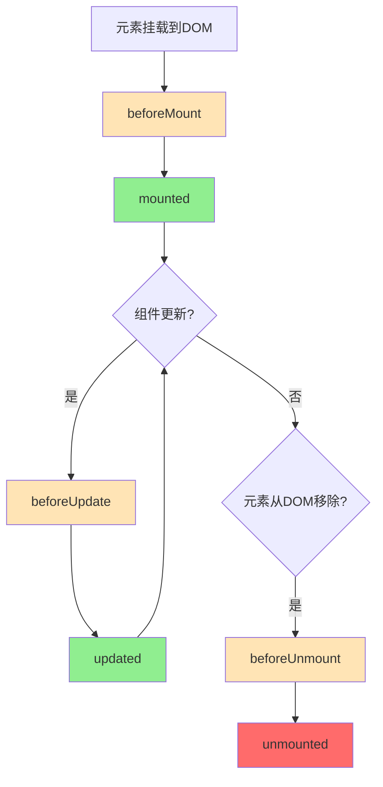

+++
title = "第20章 自定义指令"
weight = 200
date = "2026-03-25T12:54:00+08:00"
type = "docs"
description = ""
isCJKLanguage = true
draft = false
+++

# 第二十章 自定义指令

> Vue内置了很多有用的指令（v-if、v-for、v-model...），但总有一些场景需要更直接地操作DOM。自定义指令就是Vue给你的"特权"——让你能够直接操控DOM元素，实现那些内置指令做不到的事情。本章我们来学习如何编写自定义指令，让你的Vue应用拥有"超能力"。

## 20.1 内置指令回顾

在深入自定义指令之前，先回顾一下Vue的内置指令：

```mermaid
graph LR
    A[内置指令] --> B[v-bind] 
    A --> C[v-model]
    A --> D[v-if/v-show]
    A --> D2[v-for]
    A --> E[v-on]
    A --> F[v-slot]
    A --> G[v-ref]
    A --> H[v-cloak]
    
    I[自定义需求] --> J{是否涉及DOM操作?}
    J -->|是| K[自定义指令 ✓]
    J -->|否| L[Composable (逻辑复用)]
```

**什么时候用自定义指令：**
- 直接操作DOM元素
- 需要在元素挂载/更新/卸载时执行逻辑
- 需要添加自定义事件监听
- 需要集成第三方DOM库

## 20.2 自定义指令基础

### 20.2.1 指令生命周期钩子



**钩子参数：**
- `el`：指令绑定的DOM元素
- `binding`：包含指令所有信息的对象
- `vnode`：虚拟节点
- `prevVnode`：上一个虚拟节点（仅在`updated`钩子中可用）

```typescript
// binding 对象包含:
interface DirectiveBinding {
  instance: any          // 组件实例
  value: any            // 指令绑定的值
  oldValue: any         // 上一个值（updated和componentUpdated可用）
  arg: string           // 指令参数（v-xxx:arg 中的 arg）
  modifiers: object     // 修饰符对象
  dir: Directive<any>   // 指令定义对象
}
```

### 20.2.2 全局注册指令

```typescript
// main.ts
import { createApp } from 'vue'

// 方式1：直接注册
const app = createApp(App)

// 注册一个全局指令
app.directive('focus', {
  mounted(el, binding, vnode) {
    el.focus()
  }
})

// 方式2：创建后统一注册
const myDirectives = {
  // 指令名称
  focus: {
    mounted(el, binding, vnode) {
      el.focus()
    }
  },
  'permission': {
    mounted(el, binding) {
      // binding.value 是权限标识
      const hasPermission = checkPermission(binding.value)
      if (!hasPermission) {
        el.remove()  // 或者 el.style.display = 'none'
      }
    }
  }
}

// 批量注册
for (const [name, directive] of Object.entries(myDirectives)) {
  app.directive(name, directive)
}

app.mount('#app')
```

### 20.2.3 局部注册指令

```vue
<script setup lang="ts">
// 只有当前组件能使用的指令
const vFocus = {
  mounted(el: HTMLElement) {
    el.focus()
  }
}

const vColor = {
  mounted(el: HTMLElement, binding: any) {
    el.style.color = binding.value
  }
}

// 带参数的指令
const vBgColor = {
  mounted(el: HTMLElement, binding: any) {
    el.style.backgroundColor = binding.value
  }
}

// 带修饰符的指令
const vHighlight = {
  mounted(el: HTMLElement, binding: any) {
    if (binding.modifiers.bold) {
      el.style.fontWeight = 'bold'
    }
    if (binding.modifiers.italic) {
      el.style.fontStyle = 'italic'
    }
    el.style.color = binding.value || 'yellow'
  }
}
</script>

<template>
  <!-- 无参数 -->
  <input v-focus placeholder="自动聚焦" />
  
  <!-- 带值 -->
  <p v-color="'red'">红色文字</p>
  
  <!-- 带参数 -->
  <div v-bg-color:lightblue>浅蓝色背景</div>
  
  <!-- 带修饰符 -->
  <p v-highlight.bold.italic="'orange'">粗体斜体橙色高亮</p>
</template>
```

## 20.3 实战自定义指令

### 20.3.1 v-focus - 自动聚焦

最常用的指令：输入框自动聚焦

```typescript
// directives/v-focus.ts
import type { Directive, DirectiveBinding } from 'vue'

/**
 * 自动聚焦指令
 * 用法：v-focus
 *        v-focus.lazy（延迟聚焦）
 */
export const vFocus: Directive = {
  mounted(el: HTMLElement, binding: DirectiveBinding) {
    // 支持 v-focus.lazy 延迟聚焦
    const delay = binding.modifiers.lazy ? 100 : 0
    
    const focus = () => {
      // 聚焦到第一个可输入元素
      const input = el.querySelector<HTMLInputElement>(
        'input:not([disabled]), textarea:not([disabled])'
      )
      
      if (input) {
        input.focus()
      } else {
        el.focus()
      }
    }
    
    setTimeout(focus, delay)
  }
}
```

```vue
<!-- 使用示例 -->
<template>
  <div>
    <input v-focus placeholder="页面加载后自动聚焦" />
    <button @click="showInput = true">显示输入框</button>
    
    <!-- 动态出现时自动聚焦 -->
    <input v-if="showInput" v-focus.lazy placeholder="出现后自动聚焦" />
  </div>
</template>

<script setup lang="ts">
import { vFocus } from '@/directives/v-focus'

const showInput = ref(false)
</script>
```

### 20.3.2 v-debounce - 防抖指令

输入框防抖的便捷封装：

```typescript
// directives/v-debounce.ts
import type { Directive, DirectiveBinding } from 'vue'

/**
 * 防抖指令
 * 用法：v-debounce:click="handler" 1000
 *       v-debounce:input="onInput" 300
 */
interface DebounceBinding extends DirectiveBinding {
  value: Function
  arg?: string
  modifiers?: { immediate?: boolean }
}

export const vDebounce: Directive = {
  mounted(el: HTMLElement, binding: DebounceBinding) {
    const eventName = binding.arg || 'click'
    const delay = (binding.arg && !isNaN(Number(binding.arg))) 
      ? Number(binding.arg) 
      : 500
    const isImmediate = binding.modifiers?.immediate || false
    
    let timer: ReturnType<typeof setTimeout> | null = null
    
    const handler = (e: Event) => {
      if (timer) {
        clearTimeout(timer)
      }
      
      if (isImmediate) {
        // 立即执行，之后防抖
        if (!timer) {
          binding.value(e)
        }
        timer = setTimeout(() => {
          timer = null
        }, delay)
      } else {
        // 延迟执行
        timer = setTimeout(() => {
          binding.value(e)
          timer = null
        }, delay)
      }
    }
    
    // 存储handler以便卸载时移除
    ;(el as any)._debounceHandler = handler
    el.addEventListener(eventName, handler)
  },
  
  unmounted(el: HTMLElement, binding: DebounceBinding) {
    const eventName = binding.arg || 'click'
    const handler = (el as any)._debounceHandler
    
    if (handler) {
      el.removeEventListener(eventName, handler)
      delete (el as any)._debounceHandler
    }
  }
}
```

```vue
<!-- 使用示例 -->
<template>
  <div>
    <!-- 点击防抖，延迟500ms -->
    <button v-debounce:click="handleSave">保存（防抖）</button>
    
    <!-- 输入防抖，延迟300ms -->
    <input 
      v-debounce:input="handleSearch" 
      placeholder="搜索（防抖300ms）"
    />
    
    <!-- 立即执行，之后防抖500ms -->
    <button v-debounce:click.immediate="handleSubmit">立即提交</button>
  </div>
</template>

<script setup lang="ts">
import { vDebounce } from '@/directives/v-debounce'

function handleSave() {
  console.log('保存')
}

function handleSearch(e: Event) {
  const value = (e.target as HTMLInputElement).value
  console.log('搜索:', value)
}

function handleSubmit() {
  console.log('提交')
}
</script>
```

### 20.3.3 v-permission - 权限指令

基于用户权限控制元素显示：

```typescript
// directives/v-permission.ts
import type { Directive, DirectiveBinding } from 'vue'
import { useUserStore } from '@/stores/user'

/**
 * 权限指令
 * 用法：v-permission="'user:create'"
 *       v-permission="['user:create', 'user:update']"
 *       v-permission:or="['user:create', 'user:update']"
 */
export const vPermission: Directive = {
  mounted(el: HTMLElement, binding: DirectiveBinding) {
    const userStore = useUserStore()
    const value = binding.value
    
    if (!value) {
      // 没有传值，不做限制
      return
    }
    
    // 权限列表
    const permissions = Array.isArray(value) ? value : [value]
    
    // 是否是OR模式（满足任一权限即可）
    const isOrMode = binding.modifiers?.or
    
    // 检查权限
    const hasPermission = isOrMode
      ? permissions.some(p => userStore.hasPermission(p))
      : permissions.every(p => userStore.hasPermission(p))
    
    if (!hasPermission) {
      // 移除元素或隐藏
      if (binding.modifiers?.remove) {
        el.parentNode?.removeChild(el)
      } else {
        el.style.display = 'none'
      }
    }
  },
  
  updated(el: HTMLElement, binding: DirectiveBinding) {
    // 权限可能动态变化，需要重新检查
    if (binding.oldValue !== binding.value) {
      // 重新触发mounted逻辑
      const userStore = useUserStore()
      const value = binding.value
      
      if (!value) return
      
      const permissions = Array.isArray(value) ? value : [value]
      const isOrMode = binding.modifiers?.or
      
      const hasPermission = isOrMode
        ? permissions.some(p => userStore.hasPermission(p))
        : permissions.every(p => userStore.hasPermission(p))
      
      if (hasPermission) {
        el.style.display = ''
      } else {
        el.style.display = 'none'
      }
    }
  }
}
```

```vue
<!-- 使用示例 -->
<template>
  <div class="toolbar">
    <!-- 单个权限 -->
    <button v-permission="'user:create'">创建用户</button>
    <button v-permission="'user:update'">编辑用户</button>
    <button v-permission="'user:delete'">删除用户</button>
    
    <!-- 多个权限（AND模式：需要同时满足） -->
    <button v-permission="['system:config:read', 'system:config:write']">
      系统配置
    </button>
    
    <!-- 多个权限（OR模式：满足任一即可） -->
    <button v-permission:or="['admin', 'super-admin']">
      管理员按钮
    </button>
    
    <!-- 直接移除DOM（而非隐藏） -->
    <div v-permission.remove="'guest'">
      仅管理员可见
    </div>
  </div>
</template>
```

### 20.3.4 v-draggable - 拖拽指令

实现元素的拖拽功能：

```typescript
// directives/v-draggable.ts
import type { Directive, DirectiveBinding } from 'vue'

interface DraggableBinding extends DirectiveBinding {
  value?: {
    handle?: string        // 拖拽手柄选择器
    bounding?: HTMLElement // 限制在哪个元素内
    onStart?: (pos: { x: number; y: number }) => void
    onMove?: (pos: { x: number; y: number }) => void
    onEnd?: (pos: { x: number; y: number }) => void
  }
}

interface Position {
  x: number
  y: number
}

export const vDraggable: Directive = {
  mounted(el: HTMLElement, binding: DraggableBinding) {
    const options = binding.value || {}
    
    // 获取拖拽手柄
    const handle = options.handle 
      ? el.querySelector<HTMLElement>(options.handle)
      : el
    
    if (!handle) {
      console.warn('v-draggable: 未找到拖拽手柄')
      return
    }
    
    let startPos: Position = { x: 0, y: 0 }
    let isDragging = false
    
    const onMouseDown = (e: MouseEvent) => {
      // 只响应左键
      if (e.button !== 0) return
      
      // 如果有手柄，只在手柄上响应
      if (options.handle && !(e.target as HTMLElement).matches(options.handle)) {
        return
      }
      
      isDragging = true
      startPos = { x: e.clientX, y: e.clientY }
      
      // 触发开始回调
      options.onStart?.({ x: e.clientX, y: e.clientY })
      
      document.addEventListener('mousemove', onMouseMove)
      document.addEventListener('mouseup', onMouseUp)
      
      // 阻止默认行为和文本选择
      e.preventDefault()
      el.style.cursor = 'grabbing'
    }
    
    const onMouseMove = (e: MouseEvent) => {
      if (!isDragging) return
      
      const deltaX = e.clientX - startPos.x
      const deltaY = e.clientY - startPos.y
      
      // 获取当前transform
      const transform = getComputedStyle(el).transform
      let currentX = 0
      let currentY = 0
      
      if (transform && transform !== 'none') {
        const matrix = new DOMMatrixReadOnly(transform)
        currentX = matrix.m41
        currentY = matrix.m42
      }
      
      // 计算新位置
      let newX = currentX + deltaX
      let newY = currentY + deltaY
      
      // 边界限制
      if (options.bounding) {
        const rect = el.getBoundingClientRect()
        const boundRect = options.bounding.getBoundingClientRect()
        
        newX = Math.max(boundRect.left, Math.min(newX, boundRect.right - rect.width))
        newY = Math.max(boundRect.top, Math.min(newY, boundRect.bottom - rect.height))
      }
      
      el.style.transform = `translate(${newX}px, ${newY}px)`
      startPos = { x: e.clientX, y: e.clientY }
      
      // 触发移动回调
      options.onMove?.({ x: newX, y: newY })
    }
    
    const onMouseUp = (e: MouseEvent) => {
      isDragging = false
      el.style.cursor = ''
      
      document.removeEventListener('mousemove', onMouseMove)
      document.removeEventListener('mouseup', onMouseUp)
      
      // 触发结束回调
      options.onEnd?.({ x: e.clientX, y: e.clientY })
    }
    
    handle.addEventListener('mousedown', onMouseDown)
    
    // 清理
    ;(el as any)._draggableCleanup = () => {
      handle.removeEventListener('mousedown', onMouseDown)
      document.removeEventListener('mousemove', onMouseMove)
      document.removeEventListener('mouseup', onMouseUp)
    }
  },
  
  unmounted(el: HTMLElement) {
    const cleanup = (el as any)._draggableCleanup
    if (cleanup) {
      cleanup()
      delete (el as any)._draggableCleanup
    }
  }
}
```

```vue
<!-- 使用示例 -->
<template>
  <div class="container">
    <!-- 基础拖拽 -->
    <div v-draggable class="draggable-box">
      拖拽我！
    </div>
    
    <!-- 带手柄的拖拽 -->
    <div v-draggable="{ handle: '.drag-header' }" class="modal">
      <div class="drag-header">拖拽头部移动</div>
      <div class="modal-body">模态框内容</div>
    </div>
    
    <!-- 限制在容器内 -->
    <div ref="containerRef" class="bounding-container">
      <div v-draggable="{ bounding: containerRef }" class="draggable-item">
        只能在容器内移动
      </div>
    </div>
    
    <!-- 带回调 -->
    <div 
      v-draggable="{
        onStart: handleStart,
        onMove: handleMove,
        onEnd: handleEnd
      }" 
      class="draggable-box"
    >
      带回调的拖拽
    </div>
  </div>
</template>

<script setup lang="ts">
import { vDraggable } from '@/directives/v-draggable'
import { ref } from 'vue'

const containerRef = ref<HTMLElement>()

function handleStart(pos: { x: number; y: number }) {
  console.log('开始拖拽:', pos)
}

function handleMove(pos: { x: number; y: number }) {
  console.log('移动中:', pos)
}

function handleEnd(pos: { x: number; y: number }) {
  console.log('拖拽结束:', pos)
}
</script>
```

### 20.3.5 v-copy - 复制指令

一键复制文本到剪贴板：

```typescript
// directives/v-copy.ts
import type { Directive, DirectiveBinding } from 'vue'
import { ElMessage } from 'element-plus'

/**
 * 复制指令
 * 用法：v-copy="text"
 *       v-copy="'Hello World'"
 */
export const vCopy: Directive = {
  mounted(el: HTMLElement, binding: DirectiveBinding) {
    const text = typeof binding.value === 'function' 
      ? binding.value() 
      : binding.value
    
    if (!text) {
      console.warn('v-copy: 未提供要复制的文本')
      return
    }
    
    const copy = async () => {
      try {
        // 现代浏览器API
        await navigator.clipboard.writeText(text)
        ElMessage.success('复制成功！')
      } catch (err) {
        // 降级方案
        try {
          const textarea = document.createElement('textarea')
          textarea.value = text
          textarea.style.position = 'fixed'
          textarea.style.opacity = '0'
          document.body.appendChild(textarea)
          textarea.select()
          document.execCommand('copy')
          document.body.removeChild(textarea)
          ElMessage.success('复制成功！')
        } catch (e) {
          ElMessage.error('复制失败，请手动复制')
        }
      }
    }
    
    // 点击即复制
    el.addEventListener('click', copy)
    
    // 存储清理函数
    ;(el as any)._copyCleanup = () => {
      el.removeEventListener('click', copy)
    }
    
    // 添加复制提示样式
    el.style.cursor = 'pointer'
  },
  
  updated(el: HTMLElement, binding: DirectiveBinding) {
    // 如果值变了，更新清理函数
    if (binding.oldValue !== binding.value) {
      ;(el as any)._copyCleanup?.()
      
      const text = typeof binding.value === 'function'
        ? binding.value()
        : binding.value
      
      if (text) {
        const copy = async () => {
          try {
            await navigator.clipboard.writeText(text)
            ElMessage.success('复制成功！')
          } catch (err) {
            ElMessage.error('复制失败')
          }
        }
        el.addEventListener('click', copy)
        ;(el as any)._copyCleanup = () => {
          el.removeEventListener('click', copy)
        }
      }
    }
  },
  
  unmounted(el: HTMLElement) {
    ;(el as any)._copyCleanup?.()
  }
}
```

```vue
<!-- 使用示例 -->
<template>
  <div>
    <!-- 复制静态字符串 -->
    <p v-copy="'Hello Vue 3!'">点击复制: Hello Vue 3!</p>
    
    <!-- 复制变量 -->
    <p v-copy="inviteCode">邀请码: {{ inviteCode }}</p>
    
    <!-- 复制函数返回值 -->
    <p v-copy="getShareText">点击复制分享文案</p>
    
    <!-- 按钮样式 -->
    <button v-copy="inviteCode" class="copy-btn">
      复制邀请链接
    </button>
  </div>
</template>

<script setup lang="ts">
import { vCopy } from '@/directives/v-copy'

const inviteCode = ref('ABC123456')

function getShareText() {
  return `邀请码：${inviteCode.value}，快来加入我们！`
}
</script>
```

## 20.4 高级用法

### 20.4.1 带配置项的指令

通过修饰符传递配置：

```typescript
// directives/v-loading.ts
import type { Directive, DirectiveBinding } from 'vue'

interface LoadingBinding extends DirectiveBinding {
  modifiers: {
    absolute?: boolean  // 绝对定位
    overlay?: boolean   // 覆盖层模式
  }
  value: boolean
}

export const vLoading: Directive = {
  mounted(el: HTMLElement, binding: LoadingBinding) {
    if (!binding.value) return
    
    // 创建loading容器
    const spinner = document.createElement('div')
    spinner.className = 'loading-spinner'
    spinner.innerHTML = `
      <div class="spinner">
        <div class="circle"></div>
      </div>
    `
    
    // 添加样式
    const style = document.createElement('style')
    style.textContent = `
      .loading-spinner {
        position: ${binding.modifiers.absolute ? 'absolute' : 'absolute'};
        top: 0;
        left: 0;
        right: 0;
        bottom: 0;
        display: flex;
        justify-content: center;
        align-items: center;
        background: rgba(255, 255, 255, 0.8);
        z-index: 9999;
      }
      .loading-spinner.overlay {
        background: rgba(0, 0, 0, 0.5);
      }
      .spinner {
        width: 40px;
        height: 40px;
        border: 3px solid #f3f3f3;
        border-top: 3px solid #42b883;
        border-radius: 50%;
        animation: spin 1s linear infinite;
      }
      @keyframes spin {
        0% { transform: rotate(0deg); }
        100% { transform: rotate(360deg); }
      }
    `
    
    if (binding.modifiers.overlay) {
      spinner.classList.add('overlay')
    }
    
    spinner.appendChild(style)
    el.style.position = 'relative'
    el.appendChild(spinner)
    
    // 存储引用
    ;(el as any)._loadingElement = spinner
  },
  
  updated(el: HTMLElement, binding: LoadingBinding) {
    const spinner = (el as any)._loadingElement
    
    if (binding.value && !spinner) {
      // 重新mounted
      const newBinding = { ...binding } as LoadingBinding
      this.mounted?.(el, newBinding)
    } else if (!binding.value && spinner) {
      // 移除loading
      spinner.remove()
      ;(el as any)._loadingElement = null
    }
  },
  
  unmounted(el: HTMLElement) {
    const spinner = (el as any)._loadingElement
    if (spinner) {
      spinner.remove()
    }
  }
}
```

```vue
<template>
  <button :disabled="loading" v-copy="text">
    {{ loading ? '加载中...' : '复制' }}
  </button>
  
  <div v-loading="isLoading" class="content">
    大量内容...
  </div>
  
  <div v-loading.overlay="isLoading" class="modal">
    模态框内容
  </div>
</template>
```

### 20.4.2 指令与 Composables 结合

自定义指令擅长"直接操作 DOM"，Composable 擅长"逻辑复用"。把两者结合，就能让指令拥有 Composable 的所有逻辑能力，同时保持 DOM 操作的便捷性。

**使用场景**：比如懒加载指令（图片进入视口才加载），这个功能既需要 `IntersectionObserver` 的 DOM 检测逻辑（适合抽成 Composable），又需要操作 DOM（适合用指令）。把 `useIntersectionObserver` 逻辑注入指令，就能写出既简洁又功能强大的懒加载指令：

```typescript

```typescript
// composables/useIntersectionObserver.ts
import { ref, onMounted, onUnmounted, Ref } from 'vue'

export function useLazyLoad(
  elementRef: Ref<HTMLElement | undefined>,
  callback: (isVisible: boolean) => void,
  options?: IntersectionObserverInit
) {
  let observer: IntersectionObserver | null = null
  
  onMounted(() => {
    if (!elementRef.value) return
    
    observer = new IntersectionObserver((entries) => {
      entries.forEach(entry => {
        callback(entry.isIntersecting)
      })
    }, options)
    
    observer.observe(elementRef.value)
  })
  
  onUnmounted(() => {
    observer?.disconnect()
  })
}
```

```typescript
// directives/v-lazy.ts
import type { Directive } from 'vue'
import { useLazyLoad } from '@/composables/useLazyLoad'

export const vLazy: Directive = {
  mounted(el: HTMLElement, binding) {
    const src = binding.value
    
    if (!src) return
    
    // 先用一个占位图
    el.src = '/placeholder.png'
    
    // 使用composable
    useLazyLoad(
      { value: el } as any,
      (isVisible) => {
        if (isVisible) {
          el.src = src
        }
      },
      { threshold: 0.1 }
    )
  }
}
```

### 20.4.3 第三方DOM库集成

以整合Sortable.js为例：

```typescript
// directives/v-sortable.ts
import type { Directive, DirectiveBinding } from 'vue'
import Sortable from 'sortablejs'

interface SortableBinding extends DirectiveBinding {
  value?: {
    group?: string | { name: string; pull?: boolean; put?: boolean }
    animation?: number
    onEnd?: (evt: any) => void
    onAdd?: (evt: any) => void
    onUpdate?: (evt: any) => void
    onRemove?: (evt: any) => void
  }
}

export const vSortable: Directive = {
  mounted(el: HTMLElement, binding: SortableBinding) {
    const options = binding.value || {}
    
    const sortable = Sortable.create(el, {
      group: options.group,
      animation: options.animation || 150,
      ghostClass: 'sortable-ghost',
      chosenClass: 'sortable-chosen',
      dragClass: 'sortable-drag',
      
      onEnd: (evt) => {
        options.onEnd?.(evt)
      },
      
      onAdd: (evt) => {
        options.onAdd?.(evt)
      },
      
      onUpdate: (evt) => {
        options.onUpdate?.(evt)
      },
      
      onRemove: (evt) => {
        options.onRemove?.(evt)
      }
    })
    
    // 存储实例
    ;(el as any)._sortableInstance = sortable
  },
  
  unmounted(el: HTMLElement) {
    const instance = (el as any)._sortableInstance
    if (instance) {
      instance.destroy()
      delete (el as any)._sortableInstance
    }
  }
}
```

```vue
<!-- 使用示例 -->
<template>
  <div class="kanban-board">
    <div 
      v-sortable="{ 
        group: 'kanban', 
        animation: 200,
        onEnd: handleDragEnd 
      }"
      class="column"
    >
      <div class="card" v-for="task in todoTasks" :key="task.id">
        {{ task.title }}
      </div>
    </div>
    
    <div 
      v-sortable="{ 
        group: 'kanban',
        onAdd: handleTaskMoved 
      }"
      class="column"
    >
      <div class="card" v-for="task in doneTasks" :key="task.id">
        {{ task.title }}
      </div>
    </div>
  </div>
</template>

<script setup lang="ts">
import { vSortable } from '@/directives/v-sortable'

const todoTasks = ref([{ id: 1, title: '任务1' }])
const doneTasks = ref([{ id: 2, title: '任务2' }])

function handleDragEnd(evt: any) {
  console.log('拖拽结束:', evt)
  // 更新数据
}

function handleTaskMoved(evt: any) {
  console.log('任务移动:', evt)
}
</script>

<style scoped>
.kanban-board {
  display: flex;
  gap: 20px;
}

.column {
  flex: 1;
  min-height: 200px;
  background: #f5f5f5;
  border-radius: 8px;
  padding: 12px;
}

.card {
  background: white;
  padding: 12px;
  margin-bottom: 8px;
  border-radius: 4px;
  cursor: move;
}

.sortable-ghost {
  opacity: 0.4;
}

.sortable-chosen {
  box-shadow: 0 4px 12px rgba(0, 0, 0, 0.15);
}
</style>
```

## 20.5 指令注册管理

### 20.5.1 集中管理指令

```typescript
// directives/index.ts
import type { App } from 'vue'

// 导入所有指令
import { vFocus } from './v-focus'
import { vDebounce } from './v-debounce'
import { vPermission } from './v-permission'
import { vDraggable } from './v-draggable'
import { vCopy } from './v-copy'
import { vLoading } from './v-loading'
import { vSortable } from './v-sortable'

export const directives = {
  vFocus,
  vDebounce,
  vPermission,
  vDraggable,
  vCopy,
  vLoading,
  vSortable
}

// 批量注册
export function registerDirectives(app: App) {
  for (const [name, directive] of Object.entries(directives)) {
    app.directive(name, directive)
  }
}
```

```typescript
// main.ts
import { createApp } from 'vue'
import App from './App.vue'
import { registerDirectives } from './directives'

const app = createApp(App)

// 一行代码注册所有指令
registerDirectives(app)

app.mount('#app')
```

### 20.5.2 条件注册指令

```typescript
// 仅为特定环境注册某些指令
export function registerDirectives(app: App) {
  // 开发环境注册调试指令
  if (import.meta.env.DEV) {
    app.directive('debug', vDebug)
  }
  
  // 生产环境注册性能监控指令
  if (import.meta.env.PROD) {
    app.directive('performance', vPerformance)
  }
  
  // 注册所有通用指令
  app.directive('focus', vFocus)
  app.directive('copy', vCopy)
  app.directive('loading', vLoading)
}
```

## 20.6 本章小结

本章我们学习了Vue自定义指令：

| 指令 | 用途 | 关键点 |
|------|------|--------|
| v-focus | 自动聚焦 | 支持lazy修饰符 |
| v-debounce | 防抖 | 支持事件名、延迟、immediate |
| v-permission | 权限控制 | 支持单个/多个、AND/OR模式 |
| v-draggable | 拖拽 | 支持手柄、边界限制、回调 |
| v-copy | 复制 | 自动降级处理 |
| v-loading | 加载状态 | 支持overlay模式 |
| v-sortable | 列表排序 | 集成Sortable.js |

**指令vsComposable的选择：**
- 需要操作DOM → 指令
- 只是逻辑复用 → Composables
- 需要在生命周期钩子中操作DOM → 指令

> 自定义指令是Vue给开发者的"瑞士军刀"——你可以用它来实现任何DOM操作。但正如瑞士军刀不是每个场景的最佳工具一样，自定义指令也不是万能的。想清楚了再用，别把指令当成万能解决方案。
