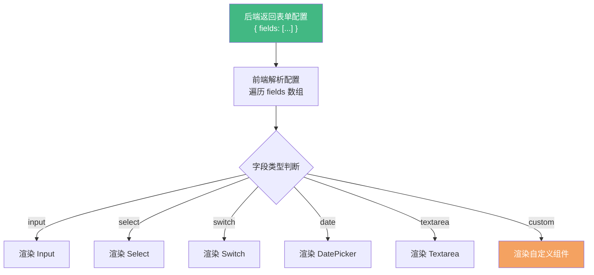
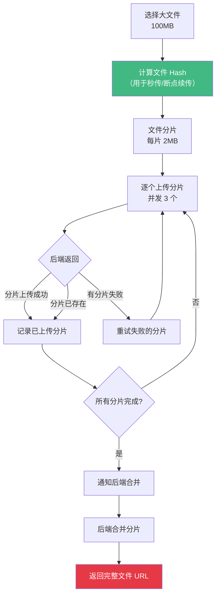

+++
title = "第22章 表单处理与验证"
weight = 220
date = "2026-03-25T12:54:00+08:00"
type = "docs"
description = ""
isCJKLanguage = true
draft = false
+++

# 第二十二章 表单处理与验证

> 表单，是前端开发中最"脏活累活"集中的地方。输入框、下拉框、开关、上传文件……一个个看着简单，真要处理好每个状态、每种验证、每个边界情况，能把人写到头秃。本章把表单相关的"十八般武艺"全部传授给你，从基础控件到高级封装，从手动校验到 VeeValidate 大法，保管你以后面对任何表单都能从容应对。

## 22.1 表单基础控件

### 22.1.1 文本输入框（Input / Textarea）

文本输入框是最常见的表单控件，Vue 3 配合 Element Plus 或其他 UI 框架使用非常方便：

```vue
<template>
  <el-form :model="form" label-width="120px">
    <!-- 单行文本输入 -->
    <el-form-item label="用户名" required>
      <el-input
        v-model="form.username"
        placeholder="请输入用户名"
        clearable
        maxlength="20"
        show-word-limit
        @blur="validateField('username')"
      />
    </el-form-item>

    <!-- 多行文本输入 -->
    <el-form-item label="简介">
      <el-input
        v-model="form.bio"
        type="textarea"
        :rows="4"
        placeholder="请介绍一下自己"
        :maxlength="200"
        show-word-limit
      />
    </el-form-item>

    <!-- 带前缀图标 -->
    <el-form-item label="邮箱">
      <el-input
        v-model="form.email"
        placeholder="请输入邮箱"
      >
        <template #prefix>
          <el-icon><Message /></el-icon>
        </template>
      </el-input>
    </el-form-item>

    <!-- 带后缀（如下拉选择） -->
    <el-form-item label="域名">
      <el-input
        v-model="form.domain"
        placeholder="请输入域名"
      >
        <template #append>
          <el-select v-model="form.domainSuffix" style="width: 100px">
            <el-option label=".com" value=".com" />
            <el-option label=".cn" value=".cn" />
            <el-option label=".org" value=".org" />
          </el-select>
        </template>
      </el-input>
    </el-form-item>
  </el-form>
</template>

<script setup lang="ts">
import { reactive } from 'vue'
import { Message } from '@element-plus/icons-vue'

const form = reactive({
  username: '',
  bio: '',
  email: '',
  domain: '',
  domainSuffix: '.com'
})

// 单个字段校验
const validateField = (field: string) => {
  if (field === 'username' && !form.username) {
    console.warn('用户名为空')
  }
}
</script>
```

**`v-model` 的原理**：Vue 3 中，`v-model` 本质上是两个操作的语法糖：
- `:model-value="form.username"` （单向数据绑定）
- `@update:model-value="val => form.username = val"` （监听输入事件更新数据）

如果需要同时绑定多个值（比如复选框），可以用 `v-model` 的修饰符：
- `.trim`：自动去除首尾空格
- `.number`：自动转成数字（如果可以的话）
- `.lazy`：在 `change` 事件而不是 `input` 事件时同步

```vue
<!-- 默认是 input 事件实时同步 -->
<el-input v-model="form.username" />

<!-- .lazy - 失焦或回车时才同步 -->
<el-input v-model.lazy="form.username" />

<!-- .trim - 自动去除首尾空格 -->
<el-input v-model.trim="form.username" />
```

### 22.1.2 下拉选择框（Select）

下拉选择框在处理选项较多或者需要从列表选择数据的场景非常有用：

```vue
<template>
  <el-form-item label="所属部门">
    <el-select
      v-model="form.departmentId"
      placeholder="请选择部门"
      filterable  <!-- 支持搜索过滤 -->
      clearable   <!-- 支持清除选择 -->
      style="width: 100%"
    >
      <!-- 静态选项 -->
      <el-option label="技术部" value="tech" />
      <el-option label="产品部" value="product" />
      <el-option label="运营部" value="ops" />

      <!-- 动态选项（从接口加载） -->
      <el-option
        v-for="dept in departmentList"
        :key="dept.id"
        :label="dept.name"
        :value="dept.id"
        :disabled="dept.disabled"
      />
    </el-select>
  </el-form-item>

  <!-- 多选下拉 -->
  <el-form-item label="擅长技能">
    <el-select
      v-model="form.skills"
      multiple
      placeholder="请选择技能"
      style="width: 100%"
    >
      <el-option
        v-for="skill in skillOptions"
        :key="skill.value"
        :label="skill.label"
        :value="skill.value"
      />
    </el-select>
  </el-form-item>

  <!-- 分组选择 -->
  <el-form-item label="所在城市">
    <el-select v-model="form.city" placeholder="请选择">
      <el-option-group label="一线城市">
        <el-option label="北京" value="beijing" />
        <el-option label="上海" value="shanghai" />
        <el-option label="广州" value="guangzhou" />
        <el-option label="深圳" value="shenzhen" />
      </el-option-group>
      <el-option-group label="新一线城市">
        <el-option label="杭州" value="hangzhou" />
        <el-option label="成都" value="chengdu" />
        <el-option label="武汉" value="wuhan" />
      </el-option-group>
    </el-select>
  </el-form-item>
</template>

<script setup lang="ts">
import { ref, onMounted } from 'vue'
import axios from 'axios'

const form = reactive({
  departmentId: '',
  skills: [],
  city: ''
})

// 部门列表（从接口加载）
const departmentList = ref([])
const skillOptions = [
  { label: 'Vue', value: 'vue' },
  { label: 'React', value: 'react' },
  { label: 'TypeScript', value: 'ts' },
  { label: 'Node.js', value: 'node' },
  { label: 'Python', value: 'python' }
]

onMounted(async () => {
  const response = await axios.get('/api/departments')
  departmentList.value = response.data
})
</script>
```

### 22.1.3 开关（Switch）与复选框（Checkbox）

开关适合二元状态（开/关、是/否），复选框适合多选或全选场景：

```vue
<template>
  <!-- 开关 -->
  <el-form-item label="接收通知">
    <el-switch
      v-model="form.notifyEnabled"
      active-text="开启"
      inactive-text="关闭"
      active-value={true}
      inactive-value={false}
    />
  </el-form-item>

  <!-- 单个复选框（布尔值） -->
  <el-form-item>
    <el-checkbox v-model="form.agreeTerms">
      我已阅读并同意<a href="/terms">《服务条款》</a>
    </el-checkbox>
  </el-form-item>

  <!-- 多个复选框（数组） -->
  <el-form-item label="兴趣爱好">
    <el-checkbox-group v-model="form.hobbies">
      <el-checkbox label="阅读" value="reading" />
      <el-checkbox label="旅行" value="travel" />
      <el-checkbox label="运动" value="sports" />
      <el-checkbox label="音乐" value="music" />
      <el-checkbox
        label="游戏"
        value="gaming"
        :disabled="form.age < 18"  <!-- 未成年禁止选择游戏 -->
      />
    </el-checkbox-group>
  </el-form-item>

  <!-- 全选功能 -->
  <el-form-item label="权限设置">
    <el-checkbox
      v-model="checkAll"
      :indeterminate="isIndeterminate"
      @change="handleCheckAllChange"
    >
      全选
    </el-checkbox>
    <el-checkbox-group v-model="form.selectedPermissions" @change="handleCheckedChange">
      <el-checkbox
        v-for="perm in allPermissions"
        :key="perm.value"
        :label="perm.value"
      >
        {{ perm.label }}
      </el-checkbox>
    </el-checkbox-group>
  </el-form-item>
</template>

<script setup lang="ts">
import { reactive, computed } from 'vue'

const form = reactive({
  notifyEnabled: true,
  agreeTerms: false,
  hobbies: [],
  selectedPermissions: []
})

// 全选相关
const allPermissions = [
  { label: '创建', value: 'create' },
  { label: '编辑', value: 'edit' },
  { label: '删除', value: 'delete' },
  { label: '导出', value: 'export' },
  { label: '导入', value: 'import' }
]

const checkAll = ref(false)
const isIndeterminate = computed(() => {
  const checked = form.selectedPermissions.length
  return checked > 0 && checked < allPermissions.length
})

const handleCheckAllChange = (val: boolean) => {
  form.selectedPermissions = val ? allPermissions.map(p => p.value) : []
}

const handleCheckedChange = (value: string[]) => {
  checkAll.value = value.length === allPermissions.length
  isIndeterminate.value = value.length > 0 && value.length < allPermissions.length
}
</script>
```

## 22.2 表单验证（VeeValidate + Yup）

### 22.2.1 VeeValidate 4 入门

VeeValidate 是 Vue 生态里最流行的表单验证库，最新版 VeeValidate 4 完全重构，拥抱了 Composition API。Yup 则是配合 VeeValidate 使用的校验 schema 定义库，用声明式的方式定义校验规则。

先安装依赖：

```bash
npm install vee-validate yup @vee-validate/yup
```

VeeValidate 的核心概念是：**用 Field 组件替代普通的表单控件**，用 `useForm` 管理整个表单的状态和校验：

```vue
<template>
  <!-- 用 Form 组件包裹，:validation-schema 传入 Yup schema -->
  <vee-form
    :validation-schema="schema"
    @submit="handleSubmit"
  >
    <!-- Field 组件会自动处理 v-model 和校验 -->
    <div class="form-group">
      <label>邮箱</label>
      <vee-field
        name="email"
        v-model="form.email"
        type="email"
        placeholder="请输入邮箱"
      />
      <!-- 错误提示，ErrorMessage 组件自动显示对应字段的错误 -->
      <error-message name="email" class="error-msg" />
    </div>

    <div class="form-group">
      <label>密码</label>
      <vee-field
        name="password"
        v-model="form.password"
        type="password"
        placeholder="请输入密码"
      />
      <error-message name="password" class="error-msg" />
    </div>

    <div class="form-group">
      <label>确认密码</label>
      <vee-field
        name="confirmPassword"
        v-model="form.confirmPassword"
        type="password"
        placeholder="请再次输入密码"
      />
      <error-message name="confirmPassword" class="error-msg" />
    </div>

    <div class="form-group">
      <label>年龄</label>
      <vee-field
        name="age"
        v-model="form.age"
        type="number"
        placeholder="请输入年龄"
      />
      <error-message name="age" class="error-msg" />
    </div>

    <div class="form-group">
      <label>个人网站</label>
      <vee-field
        name="website"
        v-model="form.website"
        placeholder="请输入网址"
      />
      <error-message name="website" class="error-msg" />
    </div>

    <button type="submit">提交</button>
  </vee-form>
</template>

<script setup lang="ts">
import { reactive } from 'vue'
import { configure } from 'vee-validate'
import * as yup from 'yup'
import { useForm, useField, Form as VeeForm, Field as VeeField, ErrorMessage } from 'vee-validate'

// 直接用 useForm，不用 Form 组件也行
const { handleSubmit, errors } = useForm({
  validationSchema: yup.object({
    email: yup
      .string()
      .required('邮箱不能为空')
      .email('请输入有效的邮箱格式'),
    password: yup
      .string()
      .required('密码不能为空')
      .min(8, '密码至少8个字符')
      .matches(
        /^(?=.*[a-z])(?=.*[A-Z])(?=.*\d)/,
        '密码必须包含大小写字母和数字'
      ),
    confirmPassword: yup
      .string()
      .required('请确认密码')
      .oneOf([yup.ref('password')], '两次密码输入不一致'),
    age: yup
      .number()
      .required('年龄不能为空')
      .min(18, '年龄必须大于等于18岁')
      .max(120, '年龄不能超过120岁')
      .typeError('年龄必须是数字'),
    website: yup
      .string()
      .url('请输入有效的网址')
  })
})

// 定义 Yup schema（也可以直接在 useForm 里传）
const schema = {
  email: yup.string().required('邮箱不能为空').email('邮箱格式不正确'),
  password: yup.string().required('密码不能为空').min(8, '密码至少8位'),
  confirmPassword: yup
    .string()
    .required('请确认密码')
    .oneOf([yup.ref('password')], '两次密码不一致'),
  age: yup.number().required('年龄不能为空').min(18, '年龄至少18岁'),
  website: yup.string().url('请输入有效网址')
}

const form = reactive({
  email: '',
  password: '',
  confirmPassword: '',
  age: '',
  website: ''
})

// 提交处理
const handleSubmit = handleSubmit((values) => {
  console.log('表单提交成功:', values)
  // 发送到后端
})
</script>

<style scoped>
.form-group {
  margin-bottom: 16px;
}
.error-msg {
  color: #e63946;
  font-size: 12px;
  margin-top: 4px;
}
</style>
```

### 22.2.2 Yup 校验规则详解

Yup 的强大之处在于它的链式 API，可以用非常直观的方式定义复杂校验规则：

```typescript
import * as yup from 'yup'

// 基础类型
const stringSchema = yup.string()
const numberSchema = yup.number()
const dateSchema = yup.date()
const booleanSchema = yup.boolean()
const arraySchema = yup.array()
const objectSchema = yup.object()

// 常用校验方法
const userSchema = yup.object({
  // 字符串校验
  username: yup
    .string()
    .required('用户名不能为空')
    .min(3, '用户名至少3个字符')
    .max(20, '用户名最多20个字符')
    .matches(/^[a-zA-Z0-9_]+$/, '用户名只能包含字母、数字和下划线'),

  // 邮箱
  email: yup
    .string()
    .required('邮箱不能为空')
    .email('邮箱格式不正确'),

  // 密码（复杂规则）
  password: yup
    .string()
    .required('密码不能为空')
    .min(8, '密码至少8个字符')
    .max(50, '密码最多50个字符')
    .matches(/[a-z]/, '密码必须包含小写字母')
    .matches(/[A-Z]/, '密码必须包含大写字母')
    .matches(/[0-9]/, '密码必须包含数字')
    .matches(/[!@#$%^&*(),.?":{}|<>]/, '密码必须包含特殊字符'),

  // 手机号（中国大陆）
  phone: yup
    .string()
    .required('手机号不能为空')
    .matches(/^1[3-9]\d{9}$/, '手机号格式不正确'),

  // 身份证号
  idCard: yup
    .string()
    .matches(
      /^[1-9]\d{5}(18|19|20)\d{2}((0[1-9])|(1[0-2]))(([0-2][1-9])|10|20|30|31)\d{3}[0-9Xx]$/,
      '身份证号格式不正确'
    ),

  // 数字
  age: yup
    .number()
    .required('年龄不能为空')
    .min(0, '年龄不能为负数')
    .max(150, '年龄不合理')
    .integer('年龄必须为整数'),

  // 日期
  birthday: yup
    .date()
    .required('生日不能为空')
    .max(new Date(), '生日不能是未来时间'),

  // 数组
  tags: yup
    .array()
    .of(yup.string())
    .min(1, '至少选择一个标签')
    .max(5, '最多选择5个标签'),

  // URL
  website: yup
    .string()
    .url('请输入有效的网址'),

  // 正则表达式
  ip: yup
    .string()
    .matches(
      /^((25[0-5]|2[0-4]\d|[01]?\d\d?)\.){3}(25[0-5]|2[0-4]\d|[01]?\d\d?)$/,
      'IP 地址格式不正确'
    ),

  // 条件校验 - 根据其他字段决定校验规则
  shippingMethod: yup.string(),
  expressCode: yup.string().when('shippingMethod', {
    is: 'express',  // 当 shippingMethod 是 'express' 时
    then: (schema) => schema.required('快递方式需要填写运单号'),
    otherwise: (schema) => schema  // 否则不校验
  }),

  // 依赖校验 - 再次输入的密码
  confirmPassword: yup
    .string()
    .required('请确认密码')
    .oneOf([yup.ref('password')], '两次密码输入不一致'),

  // 自定义校验函数
  customField: yup
    .string()
    .test(
      'no-bad-word',
      '内容包含敏感词',
      (value) => !value || !badWords.some(word => value.includes(word))
    )
    .test(
      'unique-username',
      '用户名已被占用',
      async (value) => {
        if (!value) return true
        // 调用后端 API 检查用户名是否唯一
        const response = await checkUsername(value)
        return !response.data.exists
      }
    )
})

// 异步校验示例（用户名唯一性检查）
const uniqueUsernameSchema = yup.object({
  username: yup
    .string()
    .required('用户名不能为空')
    .test(
      'async-validation',
      '用户名已被注册',
      async (value) => {
        // 模拟 API 调用
        const exists = await api.checkUsername(value)
        return !exists  // 返回 true 表示校验通过（不存在重复）
      }
    )
})
```

### 22.2.3 自定义错误提示与多语言

VeeValidate 支持自定义错误消息，让提示更友好：

```typescript
import { createI18n } from 'vue-i18n'
import zhCN from 'vee-validate/dist/locale/zh_CN.json'

// 配置 VeeValidate 使用中文
configure({
  // 统一设置 validateOnInput: true 表示输入时就校验
  validateOnInput: true,
})

// 或者在 schema 中自定义消息
const schema = {
  email: yup
    .string()
    .required('老铁，邮箱还没填呢！')
    .email('这邮箱格式不太对啊，兄dei'),
  password: yup
    .string()
    .required('密码是必填项哦')
    .min(8, ({ min }) => `密码至少${min}个字符，不然太简单了！`),
}
```

## 22.3 动态表单（字段动态渲染）

### 22.3.1 根据配置动态生成表单项

有时候表单的字段是"动态"的——不同场景下字段不一样，或者字段由后端配置返回。这时候需要根据一个配置对象，动态渲染表单项：



```typescript
// types/form.ts - 表单字段配置类型
export interface FormField {
  key: string           // 字段名（对应 v-model 的 key）
  label: string         // 标签文本
  type: 'input' | 'textarea' | 'select' | 'switch' | 'date' | 'daterange' | 'radio' | 'checkbox' | 'number' | 'custom'
  placeholder?: string  // 占位文本
  required?: boolean    // 是否必填
  disabled?: boolean    // 是否禁用
  options?: Array<{ label: string; value: any }>  // 下拉/单选/复选选项
  rules?: any           // vee-validate 规则
  props?: Record<string, any>  // 传递给 UI 组件的其他 props
  show?: boolean | ((values: any) => boolean)  // 是否显示（支持条件表达式）
  defaultValue?: any    // 默认值
}

// 模拟后端返回的表单配置
const formConfig: FormField[] = [
  {
    key: 'username',
    label: '用户名',
    type: 'input',
    placeholder: '请输入用户名',
    required: true,
    rules: 'required|min:3|max:20'
  },
  {
    key: 'email',
    label: '邮箱',
    type: 'input',
    placeholder: '请输入邮箱',
    required: true,
    rules: 'required|email'
  },
  {
    key: 'gender',
    label: '性别',
    type: 'select',
    required: true,
    options: [
      { label: '男', value: 'male' },
      { label: '女', value: 'female' },
      { label: '保密', value: 'secret' }
    ]
  },
  {
    key: 'birthday',
    label: '生日',
    type: 'date',
    placeholder: '请选择生日'
  },
  {
    key: 'subscribe',
    label: '订阅 newsletter',
    type: 'switch',
    defaultValue: true
  },
  {
    key: 'bio',
    label: '个人简介',
    type: 'textarea',
    placeholder: '介绍一下自己吧'
  },
  {
    key: 'interests',
    label: '兴趣爱好',
    type: 'checkbox',
    options: [
      { label: '阅读', value: 'reading' },
      { label: '运动', value: 'sports' },
      { label: '旅行', value: 'travel' },
      { label: '音乐', value: 'music' }
    ]
  }
]
```

### 22.3.2 动态表单组件实现

**动态表单**指的是表单的字段不是写死的，而是由数据驱动——比如一个表单配置文件定义了有哪些字段，前端根据这份配置动态渲染表单。这种模式特别适合后台管理系统中的"灵活配置"场景，比如让管理员自己决定表单里要填哪些信息，而不需要改代码。

实现思路：用 `v-for` 遍历字段配置数组，根据每个字段的 `type` 动态选择渲染的组件类型：

```vue

```vue
<!-- DynamicForm.vue -->
<template>
  <el-form
    ref="formRef"
    :model="formData"
    :rules="formRules"
    label-width="120px"
  >
    <el-form-item
      v-for="field in visibleFields"
      :key="field.key"
      :label="field.label"
      :prop="field.key"
      :required="field.required"
    >
      <!-- 输入框 -->
      <el-input
        v-if="field.type === 'input'"
        v-model="formData[field.key]"
        v-bind="field.props"
        :placeholder="field.placeholder"
      />

      <!-- 文本域 -->
      <el-input
        v-else-if="field.type === 'textarea'"
        v-model="formData[field.key]"
        type="textarea"
        v-bind="field.props"
        :placeholder="field.placeholder"
      />

      <!-- 数字输入 -->
      <el-input
        v-else-if="field.type === 'number'"
        v-model.number="formData[field.key]"
        type="number"
        v-bind="field.props"
        :placeholder="field.placeholder"
      />

      <!-- 下拉选择 -->
      <el-select
        v-else-if="field.type === 'select'"
        v-model="formData[field.key]"
        v-bind="field.props"
        :placeholder="field.placeholder"
        style="width: 100%"
      >
        <el-option
          v-for="opt in field.options"
          :key="opt.value"
          :label="opt.label"
          :value="opt.value"
        />
      </el-select>

      <!-- 日期选择 -->
      <el-date-picker
        v-else-if="field.type === 'date'"
        v-model="formData[field.key]"
        type="date"
        v-bind="field.props"
        :placeholder="field.placeholder"
        style="width: 100%"
      />

      <!-- 日期范围 -->
      <el-date-picker
        v-else-if="field.type === 'daterange'"
        v-model="formData[field.key]"
        type="daterange"
        v-bind="field.props"
        range-separator="至"
        start-placeholder="开始日期"
        end-placeholder="结束日期"
        style="width: 100%"
      />

      <!-- 开关 -->
      <el-switch
        v-else-if="field.type === 'switch'"
        v-model="formData[field.key]"
        v-bind="field.props"
      />

      <!-- 单选 -->
      <el-radio-group
        v-else-if="field.type === 'radio'"
        v-model="formData[field.key]"
        v-bind="field.props"
      >
        <el-radio
          v-for="opt in field.options"
          :key="opt.value"
          :label="opt.value"
        >
          {{ opt.label }}
        </el-radio>
      </el-radio-group>

      <!-- 多选 -->
      <el-checkbox-group
        v-else-if="field.type === 'checkbox'"
        v-model="formData[field.key]"
        v-bind="field.props"
      >
        <el-checkbox
          v-for="opt in field.options"
          :key="opt.value"
          :label="opt.value"
        >
          {{ opt.label }}
        </el-checkbox>
      </el-checkbox-group>

      <!-- 自定义组件 -->
      <component
        v-else-if="field.type === 'custom' && field.props?.component"
        :is="field.props.component"
        v-model="formData[field.key]"
        v-bind="field.props"
      />

      <!-- 默认 input（兜底） -->
      <el-input
        v-else
        v-model="formData[field.key]"
        v-bind="field.props"
        :placeholder="field.placeholder"
      />
    </el-form-item>

    <!-- 提交按钮 -->
    <el-form-item>
      <el-button type="primary" @click="handleSubmit">提交</el-button>
      <el-button @click="handleReset">重置</el-button>
    </el-form-item>
  </el-form>
</template>

<script setup lang="ts">
import { computed, reactive, ref, watch } from 'vue'
import type { FormInstance } from 'element-plus'
import type { FormField } from './types/form'

interface Props {
  fields: FormField[]        // 表单字段配置
  modelValue?: Record<string, any>  // 外部传入的表单数据（v-model）
}

const props = withDefaults(defineProps<Props>(), {
  fields: () => [],
  modelValue: () => ({})
})

const emit = defineEmits<{
  (e: 'update:modelValue', value: Record<string, any>): void
  (e: 'submit', value: Record<string, any>): void
}>()

const formRef = ref<FormInstance>()

// 表单数据
const formData = reactive<Record<string, any>>({})

// 初始化表单数据
const initFormData = () => {
  props.fields.forEach(field => {
    // 如果外部传了初始值，用外部的；否则用字段的 defaultValue
    if (props.modelValue[field.key] !== undefined) {
      formData[field.key] = props.modelValue[field.key]
    } else if (field.defaultValue !== undefined) {
      formData[field.key] = field.defaultValue
    } else {
      // 根据类型设置合理的空值
      if (field.type === 'checkbox' || field.type === 'select') {
        formData[field.key] = []
      } else if (field.type === 'switch') {
        formData[field.key] = false
      } else {
        formData[field.key] = ''
      }
    }
  })
}

initFormData()

// 监听外部 modelValue 变化（外部修改后同步到内部）
watch(
  () => props.modelValue,
  (newVal) => {
    Object.keys(newVal).forEach(key => {
      formData[key] = newVal[key]
    })
  },
  { deep: true }
)

// 同步表单数据到外部
watch(
  formData,
  (newVal) => {
    emit('update:modelValue', { ...newVal })
  },
  { deep: true }
)

// 计算可见字段（根据 show 条件过滤）
const visibleFields = computed(() => {
  return props.fields.filter(field => {
    if (typeof field.show === 'boolean') {
      return field.show
    }
    if (typeof field.show === 'function') {
      return field.show(formData)
    }
    return true
  })
})

// 生成 Element Plus 表单校验规则
const formRules = computed(() => {
  const rules: Record<string, any> = {}
  props.fields.forEach(field => {
    if (field.required) {
      rules[field.key] = [{ required: true, message: `${field.label}不能为空`, trigger: 'blur' }]
    }
    // 可以在这里把 field.rules 转成 vee-validate 或 element-plus 规则
  })
  return rules
})

// 提交
const handleSubmit = async () => {
  if (!formRef.value) return

  await formRef.value.validate((valid) => {
    if (valid) {
      emit('submit', { ...formData })
    }
  })
}

// 重置
const handleReset = () => {
  formRef.value?.resetFields()
  initFormData()
}

// 对外暴露方法
defineExpose({
  validate: () => formRef.value?.validate(),
  resetFields: () => formRef.value?.resetFields(),
  clearValidate: () => formRef.value?.clearValidate()
})
</script>
```

## 22.4 文件上传（预览 / 切片 / 拖拽）

### 22.4.1 基础文件上传

文件上传看似简单，实际上有很多细节需要处理：文件类型校验、大小限制、预览、进度显示、上传失败重试等。

```vue
<template>
  <div class="upload-demo">
    <!-- 单文件上传 -->
    <el-upload
      ref="uploadRef"
      action="/api/upload"
      :headers="{ Authorization: `Bearer ${token}` }"
      :before-upload="handleBeforeUpload"
      :on-success="handleSuccess"
      :on-error="handleError"
      :on-progress="handleProgress"
      :on-change="handleChange"
      :file-list="fileList"
      :limit="1"
      accept=".jpg,.jpeg,.png,.pdf"
      list-type="picture"
      :auto-upload="false"
    >
      <el-button type="primary">选择文件</el-button>
      <template #tip>
        <div class="el-upload__tip">
          支持 jpg/png/pdf 格式，单个文件不超过 5MB
        </div>
      </template>
    </el-upload>

    <!-- 手动上传触发 -->
    <div class="actions">
      <el-button @click="uploadRef?.submit()">上传</el-button>
      <el-button @click="uploadRef?.clearFiles()">清空</el-button>
    </div>

    <!-- 上传进度 -->
    <el-progress
      v-if="uploadProgress > 0"
      :percentage="uploadProgress"
      :status="uploadProgress === 100 ? 'success' : undefined"
    />
  </div>
</template>

<script setup lang="ts">
import { ref } from 'vue'
import { ElMessage } from 'element-plus'
import type { UploadInstance, UploadRawFile, UploadFile } from 'element-plus'
import { getAccessToken } from '@/utils/token'

const uploadRef = ref<UploadInstance>()
const fileList = ref<UploadFile[]>([])
const uploadProgress = ref(0)
const token = getAccessToken()

// 上传前校验
const handleBeforeUpload = (file: UploadRawFile) => {
  // 文件类型校验
  const allowedTypes = ['image/jpeg', 'image/png', 'application/pdf']
  if (!allowedTypes.includes(file.type)) {
    ElMessage.error('只支持 JPG、PNG、PDF 格式！')
    return false
  }

  // 文件大小校验（5MB）
  const maxSize = 5 * 1024 * 1024
  if (file.size > maxSize) {
    ElMessage.error('文件大小不能超过 5MB！')
    return false
  }

  // 如果需要，可以在这里返回 false 阻止自动上传，手动调用 uploadRef.value.submit()
  // 这里设置了 :auto-upload="false"，所以返回什么都行
  return true
}

// 文件状态变化（选择、移除等）
const handleChange = (uploadFile: UploadFile, uploadFiles: UploadFile[]) => {
  fileList.value = uploadFiles
  console.log('当前文件列表:', uploadFiles)
}

// 上传成功
const handleSuccess = (response: any, file: UploadFile) => {
  console.log('上传成功:', response)
  ElMessage.success('文件上传成功！')
  uploadProgress.value = 0

  // 通常后端会返回文件的 URL 或 ID
  console.log('文件信息:', file)
}

// 上传失败
const handleError = (error: any, file: UploadFile) => {
  console.error('上传失败:', error)
  ElMessage.error('文件上传失败，请重试！')
  uploadProgress.value = 0
}

// 上传进度
const handleProgress = (event: any, file: UploadFile) => {
  uploadProgress.value = Math.round(event.percent || 0)
}
</script>
```

### 22.4.2 大文件分片上传

当文件比较大（比如超过 10MB），或者网络不稳定时，普通上传容易失败。这时候需要**分片上传**——把文件切成小块，一块一块上传，最后在后端合并。



```typescript
// utils/upload.ts - 分片上传工具

// 计算文件的 MD5 Hash（用于秒传和断点续传）
const calculateFileHash = (file: File): Promise<string> => {
  return new Promise((resolve) => {
    const spark = new (window as any).MD5Spark()
    const reader = new FileReader()

    reader.onload = (e) => {
      spark.append(e.target?.result as ArrayBuffer)
    }

    reader.onloadend = () => {
      resolve(spark.end())
    }

    // 分块读取文件，避免大文件阻塞
    const chunkSize = 2 * 1024 * 1024  // 2MB per chunk
    let offset = 0

    const readNextChunk = () => {
      const slice = file.slice(offset, offset + chunkSize)
      reader.readAsArrayBuffer(slice)
      offset += chunkSize
    }

    reader.onresult = () => {
      if (offset < file.size) {
        readNextChunk()
      }
    }

    readNextChunk()
  })
}

// 分片上传主函数
interface UploadOptions {
  file: File
  chunkSize?: number        // 分片大小，默认 2MB
  concurrent?: number       // 并发数，默认 3
  onProgress?: (percent: number) => void
  onHashProgress?: (percent: number) => void
}

export const chunkedUpload = async (options: UploadOptions) => {
  const { file, chunkSize = 2 * 1024 * 1024, concurrent = 3, onProgress, onHashProgress } = options

  // 1. 计算文件 hash
  const fileHash = await calculateFileHash(file)

  // 2. 计算分片数量
  const totalChunks = Math.ceil(file.size / chunkSize)

  // 3. 向后端查询已上传的分片（断点续传）
  const { uploadedChunks } = await axios.get('/api/upload/chunks', {
    params: { fileHash, fileName: file.name, fileSize: file.size }
  })

  // 4. 找出需要上传的分片
  const chunksToUpload: number[] = []
  for (let i = 0; i < totalChunks; i++) {
    if (!uploadedChunks.includes(i)) {
      chunksToUpload.push(i)
    }
  }

  // 如果所有分片都已上传，说明之前上传过（秒传）
  if (chunksToUpload.length === 0) {
    onProgress?.(100)
    const response = await axios.get('/api/upload/merge', {
      params: { fileHash, fileName: file.name }
    })
    return response.data
  }

  // 5. 上传分片（并发控制）
  let completedChunks = uploadedChunks.length
  const totalToUpload = chunksToUpload.length

  const uploadChunk = async (chunkIndex: number) => {
    const start = chunkIndex * chunkSize
    const end = Math.min(start + chunkSize, file.size)
    const chunk = file.slice(start, end)

    const formData = new FormData()
    formData.append('chunk', chunk)
    formData.append('chunkIndex', String(chunkIndex))
    formData.append('totalChunks', String(totalChunks))
    formData.append('fileHash', fileHash)
    formData.append('fileName', file.name)

    await axios.post('/api/upload/chunk', formData, {
      headers: { 'Content-Type': 'multipart/form-data' }
    })

    completedChunks++
    const percent = Math.round((completedChunks / totalToUpload) * 100)
    onProgress?.(percent)
  }

  // 使用 Promise 并发控制
  const batchUpload = async (chunkIndices: number[]) => {
    const promises = chunkIndices.map(index => uploadChunk(index))
    await Promise.all(promises)
  }

  // 分批并发上传
  for (let i = 0; i < chunksToUpload.length; i += concurrent) {
    const batch = chunksToUpload.slice(i, i + concurrent)
    await batchUpload(batch)
  }

  // 6. 通知后端合并分片
  const mergeResponse = await axios.post('/api/upload/merge', {
    fileHash,
    fileName: file.name,
    totalChunks
  })

  return mergeResponse.data
}
```

### 22.4.3 拖拽上传与图片预览

拖拽上传的用户体验比点击按钮上传要好很多，尤其是对于图片类文件：

```vue
<template>
  <div class="upload-area">
    <!-- 拖拽上传区域 -->
    <el-upload
      ref="uploadRef"
      action="/api/upload"
      :drag="true"
      :multiple="true"
      :limit="9"
      accept="image/*"
      :auto-upload="false"
      list-type="picture-card"
      :on-preview="handlePictureCardPreview"
      :on-remove="handleRemove"
    >
      <el-icon class="el-icon--upload"><UploadFilled /></el-icon>
      <div class="el-upload__text">
        将图片拖到此处，或<em>点击上传</em>
      </div>
      <template #tip>
        <div class="el-upload__tip">
          最多上传 9 张图片，支持 jpg、png 格式，每张不超过 2MB
        </div>
      </template>
    </el-upload>

    <!-- 图片预览对话框 -->
    <el-dialog v-model="previewVisible" title="图片预览" width="60%">
      
    </el-dialog>
  </div>
</template>

<script setup lang="ts">
import { ref } from 'vue'
import { UploadFilled } from '@element-plus/icons-vue'
import { ElMessage } from 'element-plus'
import type { UploadInstance, UploadFile } from 'element-plus'

const uploadRef = ref<UploadInstance>()
const previewVisible = ref(false)
const previewUrl = ref('')

// 点击预览（el-upload 内置的 preview 机制）
const handlePictureCardPreview = (file: UploadFile) => {
  previewUrl.value = file.url || ''
  previewVisible.value = true
}

// 删除文件
const handleRemove = (file: UploadFile, fileList: UploadFile[]) => {
  console.log('删除文件:', file.name, '剩余:', fileList.length)
}
</script>
```

## 22.5 业务组件封装（Table / Modal / Search）

### 22.5.1 通用表格组件（ProTable）

管理后台最核心的组件之一就是表格——几乎每个页面都有。封装一个通用的 ProTable，可以大大减少重复代码：

```vue
<!-- components/ProTable/index.vue -->
<template>
  <div class="pro-table">
    <!-- 搜索区域 -->
    <div v-if="$slots.search" class="search-area">
      <slot name="search" />
    </div>

    <!-- 工具栏区域 -->
    <div v-if="$slots.toolbar" class="toolbar-area">
      <slot name="toolbar" />
    </div>

    <!-- 表格 -->
    <el-table
      ref="tableRef"
      v-bind="$attrs"
      :data="tableData"
      :loading="loading"
      :total="total"
      :current-page="currentPage"
      :page-size="pageSize"
      @selection-change="handleSelectionChange"
      @sort-change="handleSortChange"
    >
      <!-- 多选列 -->
      <el-table-column
        v-if="showSelection"
        type="selection"
        width="55"
        align="center"
      />

      <!-- 序号列 -->
      <el-table-column
        v-if="showIndex"
        type="index"
        label="序号"
        width="60"
        align="center"
      />

      <!-- 业务列（通过默认插槽传入） -->
      <slot />

      <!-- 操作列 -->
      <el-table-column
        v-if="$slots.action"
        label="操作"
        :width="actionWidth"
        align="center"
        fixed="right"
      >
        <template #default="{ row }">
          <slot name="action" :row="row" />
        </template>
      </el-table-column>
    </el-table>

    <!-- 分页 -->
    <div v-if="showPagination" class="pagination-area">
      <el-pagination
        v-model:current-page="currentPage"
        v-model:page-size="pageSize"
        :total="total"
        :page-sizes="[10, 20, 50, 100]"
        :background="true"
        layout="total, sizes, prev, pager, next, jumper"
        @size-change="handleSizeChange"
        @current-change="handleCurrentChange"
      />
    </div>
  </div>
</template>

<script setup lang="ts">
import { ref, computed, watch } from 'vue'
import type { TableInstance } from 'element-plus'

interface Props {
  // 表格数据
  tableData: any[]
  // 加载状态
  loading?: boolean
  // 是否显示多选
  showSelection?: boolean
  // 是否显示序号
  showIndex?: boolean
  // 是否显示分页
  showPagination?: boolean
  // 总数据量
  total?: number
  // 当前页码
  currentPage?: number
  // 每页条数
  pageSize?: number
  // 操作列宽度
  actionWidth?: string | number
}

const props = withDefaults(defineProps<Props>(), {
  tableData: () => [],
  loading: false,
  showSelection: false,
  showIndex: true,
  showPagination: true,
  total: 0,
  currentPage: 1,
  pageSize: 10,
  actionWidth: 200
})

const emit = defineEmits<{
  (e: 'update:currentPage', page: number): void
  (e: 'update:pageSize', size: number): void
  (e: 'selection-change', rows: any[]): void
  (e: 'sort-change', payload: any): void
  (e: 'query', params: { page: number; pageSize: number }): void
}>()

const tableRef = ref<TableInstance>()

// 分页变化
const handleSizeChange = (size: number) => {
  emit('update:pageSize', size)
  emit('query', { page: props.currentPage, pageSize: size })
}

const handleCurrentChange = (page: number) => {
  emit('update:currentPage', page)
  emit('query', { page, pageSize: props.pageSize })
}

// 多选变化
const handleSelectionChange = (rows: any[]) => {
  emit('selection-change', rows)
}

// 排序变化
const handleSortChange = ({ prop, order }: any) => {
  emit('sort-change', { prop, order })
}

// 对外暴露方法
defineExpose({
  // 选中所有
  toggleAllSelection: () => tableRef.value?.toggleAllSelection(),
  // 清空选择
  clearSelection: () => tableRef.value?.clearSelection(),
  // 设置某行选中
  toggleRowSelection: (row: any, selected?: boolean) =>
    tableRef.value?.toggleRowSelection(row, selected),
  // 获取选中的行
  getSelectionRows: () => (tableRef.value as any)?.store?.states?.selection?.rows || [],
  // 刷新表格（保留当前页和数据）
  refresh: () => emit('query', { page: props.currentPage, pageSize: props.pageSize })
})
</script>
```

### 22.5.2 通用弹窗组件（ProModal）

弹窗是另一个高频组件——新建、编辑、详情都会用到：

```vue
<!-- components/ProModal/index.vue -->
<template>
  <el-dialog
    v-model="visible"
    :title="title"
    :width="width"
    :fullscreen="fullscreen"
    :append-to-body="true"
    :destroy-on-close="true"
    @close="handleClose"
  >
    <!-- 弹窗内容插槽 -->
    <slot />

    <!-- 底部按钮区域 -->
    <template #footer>
      <slot name="footer">
        <el-button @click="handleClose">取消</el-button>
        <el-button type="primary" :loading="confirmLoading" @click="handleConfirm">
          {{ confirmText }}
        </el-button>
      </slot>
    </template>
  </el-dialog>
</template>

<script setup lang="ts">
import { ref, watch } from 'vue'

interface Props {
  modelValue: boolean       // v-model
  title: string             // 标题
  width?: string | number   // 宽度
  confirmText?: string      // 确认按钮文字
  fullscreen?: boolean      // 是否全屏
}

const props = withDefaults(defineProps<Props>(), {
  width: '600px',
  confirmText: '确定',
  fullscreen: false
})

const emit = defineEmits<{
  (e: 'update:modelValue', val: boolean): void
  (e: 'confirm'): void
  (e: 'close'): void
}>()

const visible = ref(props.modelValue)
const confirmLoading = ref(false)

watch(() => props.modelValue, (val) => {
  visible.value = val
})

watch(visible, (val) => {
  emit('update:modelValue', val)
})

const handleClose = () => {
  visible.value = false
  emit('close')
}

const handleConfirm = async () => {
  confirmLoading.value = true
  emit('confirm')

  // 如果调用方没有处理，可以在这里重置 loading
  // 如果调用方自己处理了异步逻辑，需要调用方手动关闭 loading
  setTimeout(() => {
    confirmLoading.value = false
  }, 300)
}

// 对外暴露：关闭弹窗
const close = () => {
  visible.value = false
}

// 对外暴露：开启 loading
const startLoading = () => {
  confirmLoading.value = true
}

// 对外暴露：停止 loading
const stopLoading = () => {
  confirmLoading.value = false
}

defineExpose({ close, startLoading, stopLoading })
</script>
```

### 22.5.3 通用搜索组件（ProSearch）

搜索组件通常包含输入框、筛选条件和搜索/重置按钮：

```vue
<!-- components/ProSearch/index.vue -->
<template>
  <div class="pro-search" :class="{ 'is-collapse': isCollapse }">
    <div class="search-fields">
      <slot />
    </div>

    <div class="search-actions">
      <el-button type="primary" @click="handleSearch">
        <el-icon><Search /></el-icon>
        搜索
      </el-button>
      <el-button @click="handleReset">
        <el-icon><Refresh /></el-icon>
        重置
      </el-button>

      <!-- 折叠/展开按钮（如果有超过一行的搜索条件） -->
      <el-button
        v-if="collapsible"
        type="default"
        link
        @click="isCollapse = !isCollapse"
      >
        {{ isCollapse ? '展开' : '收起' }}
        <el-icon>
          <ArrowDown v-if="isCollapse" />
          <ArrowUp v-else />
        </el-icon>
      </el-button>
    </div>
  </div>
</template>

<script setup lang="ts">
import { ref } from 'vue'
import { Search, Refresh, ArrowDown, ArrowUp } from '@element-plus/icons-vue'

interface Props {
  // 是否支持折叠（搜索条件较多时使用）
  collapsible?: boolean
  // 默认是否折叠
  defaultCollapsed?: boolean
}

const props = withDefaults(defineProps<Props>(), {
  collapsible: false,
  defaultCollapsed: false
})

const emit = defineEmits<{
  (e: 'search', values: Record<string, any>): void
  (e: 'reset'): void
}>()

const isCollapse = ref(props.defaultCollapsed)

const handleSearch = () => {
  // 收集所有表单数据（通过 provide/inject 或事件冒泡）
  emit('search', {})
}

const handleReset = () => {
  emit('reset')
}
</script>

<style scoped>
.pro-search {
  display: flex;
  align-items: flex-start;
  gap: 16px;
  margin-bottom: 16px;
}

.search-fields {
  flex: 1;
  display: flex;
  flex-wrap: wrap;
  gap: 12px;
}

.search-actions {
  display: flex;
  gap: 8px;
  flex-shrink: 0;
}

/* 折叠状态 - 隐藏超出部分 */
.is-collapse .search-fields {
  max-height: 40px;
  overflow: hidden;
}
</style>
```

## 22.6 本章小结

本章从最基础的表单控件讲起，逐一介绍了文本输入、下拉选择、开关、复选框等常用组件的 Vue 3 + Element Plus 用法。表单验证部分重点介绍了 VeeValidate 4 配合 Yup 的使用方式，这是目前 Vue 生态中最主流的表单验证解决方案。

动态表单是本章的难点之一——通过配置驱动的方式，可以让后端控制前端的表单结构，实现"配置化表单"。大文件分片上传则是一个工程化的话题，涉及到文件 Hash 计算、分片并发控制、断点续传等高级话题，是面试中常见的高频考点。

最后介绍了三个最常见业务组件的封装思路：ProTable（通用表格）、ProModal（通用弹窗）和 ProSearch（通用搜索）。好的组件封装能显著提升开发效率，建议在实际项目中根据业务需求进一步扩展这些组件的功能。

**核心要点回顾**：
- `v-model` 是表单控件的核心，同步数据的必杀技
- VeeValidate + Yup 是 Vue 3 表单验证的最佳拍档
- 大文件上传用分片 + 并发控制 + 断点续传
- 业务组件封装要兼顾**复用性**和**扩展性**
- 动态表单通过配置驱动，实现前后端解耦
