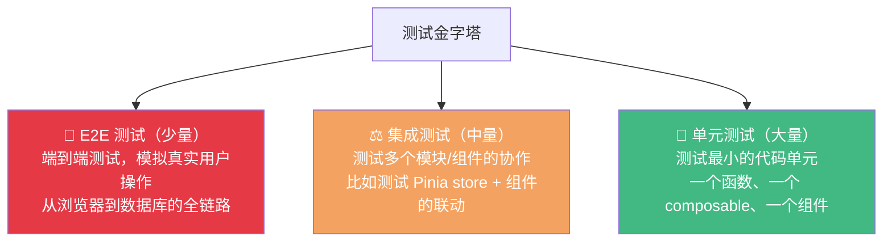

+++
title = "第23章 测试：让代码自己证明自己"
weight = 230
date = "2026-03-25T12:54:00+08:00"
type = "docs"
description = ""
isCJKLanguage = true
draft = false
+++

# 第二十三章 测试：让代码自己证明自己

> 写代码不写测试，就像开车不系安全带——大多数时候没事，但一出事就是大事。测试是前端工程化中绕不开的话题。单元测试、集成测试、E2E 测试……这些词你可能听过无数次，但每次想动手写的时候，又不知道从哪儿开始。本章用 Vue 3 + Vitest + Vue Test Utils + Playwright 给你搭建一套完整的测试体系，保证你看完之后能从"完全不会写测试"直接进化到"测试写到手软"。

## 23.1 测试的基本概念

### 23.1.1 测试金字塔：单元 / 集成 / E2E

业界最著名的测试模型是**测试金字塔**：



**单元测试**（Unit Test）是最底层，测试对象是最小的代码单元，比如一个工具函数、一个 composable、一个组件的某个方法。单元测试应该是**快速、隔离、独立**的——不依赖外部系统（网络、数据库），测试结果稳定。

**集成测试**（Integration Test）测试多个组件或模块协作的正确性。比如测试用户点击登录按钮 -> Pinia store 调用登录 API -> 保存 token -> 跳转到首页这个完整流程。集成测试通常需要 mock 掉真正的网络请求。

**E2E 测试**（End-to-End Test）模拟真实用户在浏览器中的操作，从打开浏览器、输入账号密码、点击登录，到看到登录后的页面，整个链路走一遍。E2E 测试最接近真实用户体验，但运行最慢、最不稳定，通常只覆盖核心用户路径。

**三种测试的特点对比**：

| 特性 | 单元测试 | 集成测试 | E2E 测试 |
|------|----------|----------|----------|
| 运行速度 | 极快（毫秒级） |较快（秒级）| 慢（分钟级）|
| 覆盖范围 | 单个函数/模块 | 多个模块协作 | 整个应用 |
| 稳定性 | 高（无外部依赖）| 中 | 低（依赖多，容易flaky）|
| 编写成本 | 低 | 中 | 高 |
| 调试难度 | 低 | 中 | 高 |
| 数量占比 | 最多（60-70%）| 中等（20-30%）| 最少（10-20%）|

### 23.1.2 TDD 与 BDD

**TDD（Test-Driven Development，测试驱动开发）**：先写测试，再写实现。流程是：Red（写一个失败的测试）-> Green（写最少的代码让测试通过）-> Refactor（重构代码，保持测试通过）。

**BDD（Behavior-Driven Development，行为驱动开发）**：用自然语言描述期望行为，测试代码是这些描述的具体实现。BDD 的测试更像文档，能让非技术人员（产品经理、业务方）也能看懂测试在测什么。

Vue 生态里常用的测试库语法风格：
- `describe` / `it` / `expect` —— Jest/Vitest 风格（BDD-like）
- `test` / `expect` —— Jest 风格
- `context` / `should` —— Mocha/Chai 风格

Vitest 兼容 Jest 的 API，所以用 `describe` / `it` / `expect` 就行。

## 23.2 Vitest 环境配置

### 23.2.1 安装与配置

Vitest 是 Vite 原生的测试框架，配置简单，速度飞快，是 Vue 3 项目测试的首选。

```bash
# 安装 Vitest 和相关依赖
npm install -D vitest @vue/test-utils happy-dom @vitest/ui jsdom

# Vue 3 + TypeScript 项目还需要
npm install -D @vitest/coverage-v8
```

在 `vite.config.ts` 中配置 Vitest：

```typescript
// vite.config.ts
import { defineConfig } from 'vite'
import vue from '@vitejs/plugin-vue'
import { fileURLToPath, URL } from 'node:url'

export default defineConfig({
  plugins: [vue()],  // Vue 插件必须开启，Vitest 才能识别 .vue 文件
  resolve: {
    alias: {
      // 让测试代码也能用 @/ 路径别名
      '@': fileURLToPath(new URL('./src', import.meta.url))
    }
  },
  test: {
    // environment：测试环境的 DOM 模拟库
    // 'jsdom' → 用 jsdom 模拟浏览器 DOM（最常用，模拟 window/document 等）
    // 'happy-dom' → 比 jsdom 更轻量的 DOM 模拟（性能更好，但某些 API 不支持）
    // 'node' → Node.js 环境（测试纯 JS 逻辑时用）
    environment: 'jsdom',

    // globals：全局注入测试 API（不需要每次 import）
    // 开启后，describe、it、expect、vi 等函数可以直接用，不用 import
    // 不开启则需要手动 import { describe, it, expect } from 'vitest'
    globals: true,

    // watch：开启后，测试会持续监控文件变化，修改后自动重新运行
    // pnpm vitest → 开启 watch 模式（默认）
    // pnpm vitest run → 单次运行（CI/CD 构建时用这个）
    watch: true,

    // coverage：代码覆盖率配置
    coverage: {
      // provider：使用哪个覆盖率工具
      // 'v8' → 使用 V8 引擎内置的覆盖率（更快，推荐）
      // 'istanbul' → 使用 istanbul/nyc（更老，但生态更丰富）
      provider: 'v8',

      // reporter：覆盖率报告的输出格式
      // 'text' → 终端里直接显示（最常用）
      // 'json' → 输出到 coverage/coverage-final.json（供其他工具读取）
      // 'html' → 生成 HTML 报告到 coverage/ 目录（最直观，双击打开）
      reporter: ['text', 'json', 'html'],

      // exclude：排除哪些文件不计入覆盖率
      exclude: [
        'node_modules/**',     // 第三方库不计入覆盖率
        '*.config.*',          // 配置文件
        '**/*.d.ts',          // 类型声明文件
        '**/*.spec.ts',       // 测试文件本身不计入
        '**/*.test.ts'        // 测试文件本身不计入
      ]
    }
  }
})
```

在 `package.json` 中添加测试脚本：

```json
{
  "scripts": {
    "test": "vitest",
    "test:run": "vitest run",        // 单次运行（CI/CD 用）
    "test:coverage": "vitest run --coverage",  // 带覆盖率报告
    "test:ui": "vitest --ui"         // 打开 Vitest 的图形界面
  }
}
```

### 23.2.2 第一个测试文件

创建测试文件的命名规范：`.spec.ts` 或 `.test.ts` 都可以，Vitest 都能识别。通常把测试文件和源文件放在同一目录下：

```
src/
├── utils/
│   ├── formatDate.ts
│   └── formatDate.spec.ts     // 测试文件
├── composables/
│   ├── useCounter.ts
│   └── useCounter.spec.ts     // 测试文件
└── components/
    ├── Counter.vue
    └── Counter.spec.ts        // 测试文件
```

```typescript
// src/utils/formatDate.spec.ts
import { describe, it, expect } from 'vitest'
import { formatDate, formatDateRelative } from './formatDate'

describe('formatDate 工具函数', () => {
  // 基础功能测试
  it('应该正确格式化日期', () => {
    const date = new Date('2024-01-15T10:30:00')
    const result = formatDate(date, 'YYYY-MM-DD')
    expect(result).toBe('2024-01-15')
  })

  it('应该支持自定义格式', () => {
    const date = new Date('2024-03-20T08:00:00')
    const result = formatDate(date, 'YYYY年MM月DD日 HH:mm')
    expect(result).toBe('2024年03月20日 08:00')
  })

  // 边界情况测试
  it('应该处理空值', () => {
    const result = formatDate(null as any, 'YYYY-MM-DD')
    expect(result).toBe('')
  })

  it('应该处理时间戳', () => {
    const timestamp = 1705315800000  // 2024-01-15 10:30:00
    const result = formatDate(timestamp, 'YYYY-MM-DD')
    expect(result).toBe('2024-01-15')
  })
})

describe('formatDateRelative 相对时间', () => {
  it('应该显示"刚刚"对于刚刚发生的事件', () => {
    const now = new Date()
    const result = formatDateRelative(now)
    expect(result).toBe('刚刚')
  })

  it('应该显示"X分钟前"对于几分钟前的事件', () => {
    const fiveMinutesAgo = new Date(Date.now() - 5 * 60 * 1000)
    const result = formatDateRelative(fiveMinutesAgo)
    expect(result).toBe('5分钟前')
  })

  it('应该显示"X小时前"对于几小时前的事件', () => {
    const threeHoursAgo = new Date(Date.now() - 3 * 60 * 60 * 1000)
    const result = formatDateRelative(threeHoursAgo)
    expect(result).toBe('3小时前')
  })

  it('应该显示具体日期对于更早的事件', () => {
    const oneWeekAgo = new Date(Date.now() - 7 * 24 * 60 * 60 * 1000)
    const result = formatDateRelative(oneWeekAgo)
    // 应该返回具体日期格式
    expect(result).toMatch(/\d{4}-\d{2}-\d{2}/)
  })
})
```

## 23.3 组件测试（Vue Test Utils）

### 23.3.1 基本 mount 与浅渲染

`@vue/test-utils` 是 Vue 官方出品的组件测试库，提供了 `mount` 和 `shallowMount` 两个核心函数。

```vue
<!-- src/components/Counter.vue -->
<template>
  <div class="counter">
    <h2>计数器</h2>
    <div class="count">{{ count }}</div>
    <button @click="increment">+1</button>
    <button @click="decrement">-1</button>
    <button @click="reset">重置</button>
  </div>
</template>

<script setup lang="ts">
import { ref } from 'vue'

const props = defineProps<{
  initialCount?: number
}>()

const count = ref(props.initialCount ?? 0)

const increment = () => count.value++
const decrement = () => count.value--
const reset = () => { count.value = 0 }

defineExpose({ count })
</script>
```

```typescript
// src/components/Counter.spec.ts
import { describe, it, expect } from 'vitest'
import { mount } from '@vue/test-utils'
import Counter from './Counter.vue'

describe('Counter 组件测试', () => {
  it('应该正确渲染初始值', () => {
    const wrapper = mount(Counter, {
      props: { initialCount: 10 }
    })

    // 查找 .count 元素
    const countEl = wrapper.find('.count')
    expect(countEl.text()).toBe('10')
  })

  it('应该使用默认初始值 0', () => {
    const wrapper = mount(Counter)
    expect(wrapper.find('.count').text()).toBe('0')
  })

  it('点击 +1 按钮应该增加计数', async () => {
    const wrapper = mount(Counter, { props: { initialCount: 0 } })

    // 找到 +1 按钮并点击
    await wrapper.find('button:nth-child(2)').trigger('click')

    expect(wrapper.find('.count').text()).toBe('1')
  })

  it('点击 -1 按钮应该减少计数', async () => {
    const wrapper = mount(Counter, { props: { initialCount: 5 } })

    await wrapper.find('button:nth-child(3)').trigger('click')

    expect(wrapper.find('.count').text()).toBe('4')
  })

  it('点击重置按钮应该归零', async () => {
    const wrapper = mount(Counter, { props: { initialCount: 100 } })

    await wrapper.find('button:nth-child(4)').trigger('click')

    expect(wrapper.find('.count').text()).toBe('0')
  })

  it('连续点击应该累加', async () => {
    const wrapper = mount(Counter)

    // 连续点击 3 次 +1
    const incrementBtn = wrapper.findAll('button')[0]
    await incrementBtn.trigger('click')
    await incrementBtn.trigger('click')
    await incrementBtn.trigger('click')

    expect(wrapper.find('.count').text()).toBe('3')
  })
})
```

### 23.3.2 测试 props、emit 和插槽

```vue
<!-- src/components/UserCard.vue -->
<template>
  <div class="user-card">
    
    <div v-else class="avatar-placeholder">{{ name.charAt(0) }}</div>
    <div class="info">
      <h3>{{ name }}</h3>
      <p v-if="email" class="email">{{ email }}</p>
      <p v-if="bio" class="bio">{{ bio }}</p>
    </div>
    <div class="actions">
      <slot name="actions" :user="{ name, email }" />
    </div>
  </div>
</template>

<script setup lang="ts">
import { defineProps } from 'vue'

defineProps<{
  name: string
  email?: string
  avatar?: string
  bio?: string
}>()

const emit = defineEmits<{
  (e: 'click', user: { name: string; email?: string }): void
}>()
</script>
```

```typescript
// src/components/UserCard.spec.ts
import { describe, it, expect, vi } from 'vitest'
import { mount } from '@vue/test-utils'
import UserCard from './UserCard.vue'

describe('UserCard 组件测试', () => {
  // Props 测试
  describe('Props', () => {
    it('应该正确显示用户名', () => {
      const wrapper = mount(UserCard, {
        props: { name: '张三' }
      })
      expect(wrapper.find('h3').text()).toBe('张三')
    })

    it('当有邮箱时应该显示邮箱', () => {
      const wrapper = mount(UserCard, {
        props: { name: '张三', email: 'zhangsan@example.com' }
      })
      expect(wrapper.find('.email').exists()).toBe(true)
      expect(wrapper.find('.email').text()).toBe('zhangsan@example.com')
    })

    it('当没有邮箱时不应该显示邮箱区域', () => {
      const wrapper = mount(UserCard, {
        props: { name: '张三' }
      })
      expect(wrapper.find('.email').exists()).toBe(false)
    })

    it('当没有头像时应该显示名字首字母', () => {
      const wrapper = mount(UserCard, {
        props: { name: '李四' }
      })
      expect(wrapper.find('.avatar-placeholder').exists()).toBe(true)
      expect(wrapper.find('.avatar-placeholder').text()).toBe('李')
    })

    it('当有头像时应该显示头像图片', () => {
      const wrapper = mount(UserCard, {
        props: {
          name: '王五',
          avatar: 'https://example.com/avatar.jpg'
        }
      })
      const imgEl = wrapper.find('.avatar')
      expect(imgEl.exists()).toBe(true)
      expect(imgEl.attributes('src')).toBe('https://example.com/avatar.jpg')
    })
  })

  // Emit 测试
  describe('emit', () => {
    it('点击卡片应该触发 click 事件', async () => {
      const wrapper = mount(UserCard, {
        props: { name: '张三', email: 'zhangsan@example.com' }
      })

      // 监听 click 事件
      const emitted = vi.fn()
      wrapper.vm.$on('click' as any, emitted)

      await wrapper.find('.user-card').trigger('click')

      // 或者用 wrapper.emitted()
      const clickEvents = wrapper.emitted('click')
      expect(clickEvents).toBeTruthy()
      expect(clickEvents![0][0]).toEqual({
        name: '张三',
        email: 'zhangsan@example.com'
      })
    })
  })

  // 插槽测试
  describe('插槽', () => {
    it('应该正确渲染 actions 插槽', () => {
      const wrapper = mount(UserCard, {
        props: { name: '张三' },
        slots: {
          actions: '<button>编辑</button>'
        }
      })

      expect(wrapper.find('.actions button').exists()).toBe(true)
      expect(wrapper.find('.actions button').text()).toBe('编辑')
    })

    it('插槽应该能访问到 user 数据', () => {
      const wrapper = mount(UserCard, {
        props: { name: '张三', email: 'zhangsan@example.com' },
        slots: {
          actions: (props: any) => {
            // 在 Vue Test Utils 中，函数插槽接收 props
            return `<span>${props.user.name} - ${props.user.email}</span>`
          }
        }
      })

      expect(wrapper.find('.actions span').text()).toBe('张三 - zhangsan@example.com')
    })
  })
})
```

### 23.3.3 异步组件测试与 nextTick

Vue 的响应式更新是异步的，当修改了响应式数据后，DOM 不会立即更新。测试时需要用 `nextTick` 或 `flushPromises` 来等待 DOM 更新。

```vue
<!-- src/components/AsyncUser.vue -->
<template>
  <div class="async-user">
    <div v-if="loading" class="loading">加载中...</div>
    <div v-else-if="error" class="error">{{ error }}</div>
    <div v-else class="user-info">
      <p>用户名：{{ user?.name }}</p>
      <p>邮箱：{{ user?.email }}</p>
    </div>
    <button @click="loadUser">加载用户</button>
  </div>
</template>

<script setup lang="ts">
import { ref } from 'vue'

interface User {
  name: string
  email: string
}

const loading = ref(false)
const error = ref('')
const user = ref<User | null>(null)

const loadUser = async () => {
  loading.value = true
  error.value = ''

  try {
    // 模拟 API 调用
    await new Promise(resolve => setTimeout(resolve, 100))
    user.value = { name: '测试用户', email: 'test@example.com' }
  } catch (e) {
    error.value = '加载失败'
  } finally {
    loading.value = false
  }
}
</script>
```

```typescript
// src/components/AsyncUser.spec.ts
import { describe, it, expect, vi } from 'vitest'
import { mount, flushPromises } from '@vue/test-utils'
import AsyncUser from './AsyncUser.vue'

describe('AsyncUser 异步组件测试', () => {
  it('初始状态应该显示加载按钮', () => {
    const wrapper = mount(AsyncUser)
    expect(wrapper.find('.loading').exists()).toBe(false)
    expect(wrapper.find('.error').exists()).toBe(false)
    expect(wrapper.find('.user-info').exists()).toBe(false)
    expect(wrapper.find('button').exists()).toBe(true)
  })

  it('点击按钮后应该显示加载状态', async () => {
    vi.useFakeTimers()  // 使用假计时器，更可控

    const wrapper = mount(AsyncUser, {
      global: {
        mocks: {
          // mock setTimeout
        }
      }
    })

    // 开始计时器控制
    vi.useRealTimers()  // 先用真实的
    await wrapper.find('button').trigger('click')

    // 此时 loading 应该为 true
    // 注意：由于我们用的是真实的 setTimeout，需要用 flushPromises 等待
    // 或者用 nextTick

    vi.useFakeTimers()
    const promise = wrapper.find('button').trigger('click')

    // 快进 100ms
    vi.advanceTimersByTime(100)
    await flushPromises()

    expect(wrapper.find('.loading').exists()).toBe(true)

    vi.useRealTimers()
  })

  it('加载成功后应该显示用户信息', async () => {
    const wrapper = mount(AsyncUser)

    await wrapper.find('button').trigger('click')

    // 等待异步操作完成
    await flushPromises()

    expect(wrapper.find('.user-info').exists()).toBe(true)
    expect(wrapper.find('.user-info p:first-child').text()).toContain('测试用户')
  })
})
```

## 23.4 Composables 测试

Composables 是 Vue 3 的核心概念，它的测试其实比组件测试更简单——因为 composables 只是函数，直接调用函数、断言返回值即可。

```typescript
// src/composables/useCounter.ts
import { ref, computed, readonly } from 'vue'

export interface UseCounterOptions {
  min?: number
  max?: number
}

export interface UseCounterReturn {
  count: Readonly<typeof count>
  increment: () => void
  decrement: () => void
  reset: () => void
  countPlusOne: () => number
}

export function useCounter(initialValue = 0, options: UseCounterOptions = {}) {
  const { min = -Infinity, max = Infinity } = options

  const count = ref(initialValue)

  const increment = () => {
    if (count.value < max) {
      count.value++
    }
  }

  const decrement = () => {
    if (count.value > min) {
      count.value--
    }
  }

  const reset = () => {
    count.value = initialValue
  }

  const countPlusOne = computed(() => count.value + 1)

  return {
    count: readonly(count),
    increment,
    decrement,
    reset,
    countPlusOne
  } as UseCounterReturn
}
```

```typescript
// src/composables/useCounter.spec.ts
import { describe, it, expect } from 'vitest'
import { useCounter } from './useCounter'

describe('useCounter composable', () => {
  it('应该返回初始值', () => {
    const { count } = useCounter(10)
    expect(count.value).toBe(10)
  })

  it('默认值应该是 0', () => {
    const { count } = useCounter()
    expect(count.value).toBe(0)
  })

  it('increment 应该让计数 +1', () => {
    const { count, increment } = useCounter(0)
    increment()
    expect(count.value).toBe(1)
    increment()
    expect(count.value).toBe(2)
  })

  it('decrement 应该让计数 -1', () => {
    const { count, decrement } = useCounter(5)
    decrement()
    expect(count.value).toBe(4)
  })

  it('reset 应该恢复到初始值', () => {
    const { count, increment, reset } = useCounter(10)
    increment()
    increment()
    increment()
    expect(count.value).toBe(13)
    reset()
    expect(count.value).toBe(10)
  })

  it('不应该超过最大值', () => {
    const { count, increment } = useCounter(5, { max: 10 })
    for (let i = 0; i < 10; i++) {
      increment()
    }
    // 达到最大值后不应该继续增加
    expect(count.value).toBe(10)
    increment()  // 再点一次
    expect(count.value).toBe(10)  // 应该还是 10
  })

  it('不应该小于最小值', () => {
    const { count, decrement } = useCounter(5, { min: 0 })
    for (let i = 0; i < 10; i++) {
      decrement()
    }
    expect(count.value).toBe(0)
    decrement()
    expect(count.value).toBe(0)
  })

  it('countPlusOne 应该返回 count + 1', () => {
    const { count, countPlusOne } = useCounter(5)
    expect(countPlusOne.value).toBe(6)
    count.value = 100
    expect(countPlusOne.value).toBe(101)
  })

  it('count 应该是只读的，不能直接修改', () => {
    const { count } = useCounter(0)
    // 这里应该编译失败或运行时报错
    // count.value = 999  // 不应该能这样做
    expect(count.value).toBe(0)
  })
})
```

## 23.5 Router 与 Store 测试

### 23.5.1 Vue Router 测试

Vue Router 测试主要关注：路由跳转是否正确、query 参数是否正确传递、路由守卫是否按预期执行。

```typescript
// src/router/index.ts
import { createRouter, createWebHistory } from 'vue-router'

const router = createRouter({
  history: createWebHistory(),
  routes: [
    {
      path: '/',
      name: 'Home',
      component: { template: '<div>首页</div>' }
    },
    {
      path: '/user/:id',
      name: 'UserProfile',
      component: { template: '<div>用户页</div>' }
    },
    {
      path: '/login',
      name: 'Login',
      component: { template: '<div>登录页</div>' }
    },
    {
      path: '/:pathMatch(.*)*',
      name: 'NotFound',
      component: { template: '<div>404</div>' }
    }
  ]
})

export default router
```

```typescript
// src/router/index.spec.ts
import { describe, it, expect } from 'vitest'
import { createRouter, createMemoryHistory } from 'vue-router'
import { mount } from '@vue/test-utils'

describe('Vue Router 测试', () => {
  // 创建测试用 router（使用 memory history 避免依赖浏览器环境）
  const createTestRouter = () => {
    return createRouter({
      history: createMemoryHistory(),
      routes: [
        { path: '/', name: 'Home', component: { template: '<div>首页</div>' } },
        { path: '/user/:id', name: 'UserProfile', component: { template: '<div>用户页</div>' } },
        { path: '/login', name: 'Login', component: { template: '<div>登录页</div>' } },
        { path: '/:pathMatch(.*)*', name: 'NotFound', component: { template: '<div>404</div>' } }
      ]
    })
  }

  it('应该正确跳转到首页', async () => {
    const router = createTestRouter()
    const wrapper = mount({ template: '<router-view />' }, {
      global: {
        plugins: [router]
      }
    })

    await router.push('/')
    await router.isReady()

    expect(wrapper.text()).toContain('首页')
  })

  it('应该正确传递路由参数', async () => {
    const router = createTestRouter()
    const wrapper = mount({ template: '<router-view />' }, {
      global: {
        plugins: [router]
      }
    })

    await router.push({ name: 'UserProfile', params: { id: '123' } })
    await router.isReady()

    expect(router.currentRoute.value.params.id).toBe('123')
  })

  it('访问不存在的路由应该跳转到 404', async () => {
    const router = createTestRouter()
    const wrapper = mount({ template: '<router-view />' }, {
      global: {
        plugins: [router]
      }
    })

    await router.push('/some/nonexistent/path')
    await router.isReady()

    expect(wrapper.text()).toContain('404')
  })

  it('router-link 应该正确渲染', async () => {
    const router = createTestRouter()
    const wrapper = mount({
      template: `
        <nav>
          <router-link to="/">首页</router-link>
          <router-link to="/login">登录</router-link>
        </nav>
        <router-view />
      `
    }, {
      global: {
        plugins: [router]
      }
    })

    await router.isReady()

    const links = wrapper.findAllComponents({ name: 'RouterLink' })
    expect(links.length).toBe(2)
  })
})
```

### 23.5.2 Pinia Store 测试

Pinia store 的测试重点在于：state 是否正确初始化、actions 是否按预期执行、getters 是否正确计算。

```typescript
// src/stores/user.ts
import { defineStore } from 'pinia'
import { ref, computed } from 'vue'
import axios from 'axios'

export const useUserStore = defineStore('user', () => {
  // State
  const userInfo = ref<{ id: number; name: string; email: string } | null>(null)
  const isLoggedIn = ref(false)
  const loading = ref(false)

  // Getters
  const userName = computed(() => userInfo.value?.name ?? '游客')
  const userId = computed(() => userInfo.value?.id ?? null)

  // Actions
  const setUserInfo = (info: typeof userInfo.value) => {
    userInfo.value = info
    isLoggedIn.value = !!info
  }

  const login = async (username: string, password: string) => {
    loading.value = true
    try {
      const response = await axios.post('/api/login', { username, password })
      setUserInfo(response.data.userInfo)
      return { success: true }
    } catch (error) {
      return { success: false, error: '登录失败' }
    } finally {
      loading.value = false
    }
  }

  const logout = () => {
    setUserInfo(null)
    localStorage.removeItem('token')
  }

  return {
    userInfo,
    isLoggedIn,
    loading,
    userName,
    userId,
    setUserInfo,
    login,
    logout
  }
})
```

```typescript
// src/stores/user.spec.ts
import { describe, it, expect, vi, beforeEach } from 'vitest'
import { setActivePinia, createPinia } from 'pinia'
import { useUserStore } from './user'

// Mock axios
vi.mock('axios', () => ({
  default: {
    post: vi.fn()
  }
}))

describe('User Store 测试', () => {
  beforeEach(() => {
    // 每个测试前创建新的 Pinia 实例
    setActivePinia(createPinia())
    vi.clearAllMocks()
  })

  describe('State 初始化', () => {
    it('初始状态应该是未登录', () => {
      const store = useUserStore()
      expect(store.isLoggedIn).toBe(false)
      expect(store.userInfo).toBe(null)
      expect(store.loading).toBe(false)
    })

    it('初始用户名应该是"游客"', () => {
      const store = useUserStore()
      expect(store.userName).toBe('游客')
    })

    it('初始 userId 应该是 null', () => {
      const store = useUserStore()
      expect(store.userId).toBe(null)
    })
  })

  describe('setUserInfo action', () => {
    it('设置用户信息后应该自动登录', () => {
      const store = useUserStore()
      const userInfo = { id: 1, name: '张三', email: 'zhangsan@example.com' }

      store.setUserInfo(userInfo)

      expect(store.userInfo).toEqual(userInfo)
      expect(store.isLoggedIn).toBe(true)
      expect(store.userName).toBe('张三')
      expect(store.userId).toBe(1)
    })

    it('传入 null 应该登出', () => {
      const store = useUserStore()
      store.setUserInfo({ id: 1, name: '张三', email: 'zhangsan@example.com' })
      expect(store.isLoggedIn).toBe(true)

      store.setUserInfo(null)
      expect(store.isLoggedIn).toBe(false)
      expect(store.userName).toBe('游客')
    })
  })

  describe('login action', () => {
    it('登录成功应该设置用户信息并返回 success', async () => {
      const store = useUserStore()
      const axios = vi.mocked(await import('axios')).default

      axios.post.mockResolvedValue({
        data: {
          userInfo: { id: 1, name: '张三', email: 'zhangsan@example.com' }
        }
      })

      const result = await store.login('zhangsan', 'password123')

      expect(result.success).toBe(true)
      expect(store.isLoggedIn).toBe(true)
      expect(store.userName).toBe('张三')
    })

    it('登录失败应该返回错误', async () => {
      const store = useUserStore()
      const axios = vi.mocked(await import('axios')).default

      axios.post.mockRejectedValue(new Error('网络错误'))

      const result = await store.login('wrong', 'wrong')

      expect(result.success).toBe(false)
      expect(result.error).toBe('登录失败')
      expect(store.isLoggedIn).toBe(false)
    })

    it('登录时 loading 应该变为 true', async () => {
      const store = useUserStore()
      const axios = vi.mocked(await import('axios')).default

      let loadingDuringRequest = false
      axios.post.mockImplementation(() => {
        loadingDuringRequest = store.loading
        return Promise.resolve({ data: { userInfo: { id: 1, name: 'Test', email: 'test@example.com' } } })
      })

      const promise = store.login('test', 'test')
      expect(store.loading).toBe(true)
      await promise
      expect(store.loading).toBe(false)
    })
  })

  describe('logout action', () => {
    it('登出后应该清除用户信息并设置为未登录', () => {
      const store = useUserStore()
      store.setUserInfo({ id: 1, name: '张三', email: 'zhangsan@example.com' })
      expect(store.isLoggedIn).toBe(true)

      store.logout()
      expect(store.isLoggedIn).toBe(false)
      expect(store.userInfo).toBe(null)
      expect(store.userName).toBe('游客')
    })
  })
})
```

## 23.6 E2E 测试（Playwright）

### 23.6.1 Playwright 安装与配置

E2E 测试用 Playwright，它是目前最流行的浏览器自动化测试框架，支持 Chromium、Firefox、WebKit 三大浏览器引擎。

```bash
# 安装 Playwright
npm install -D @playwright/test

# 安装浏览器（Chromium、Firefox、WebKit）
npx playwright install --with-deps
```

在项目根目录创建 `playwright.config.ts`：

```typescript
// playwright.config.ts
import { defineConfig, devices } from '@playwright/test'

export default defineConfig({
  testDir: './tests/e2e',  // E2E 测试文件目录
  fullyParallel: true,     // 并行执行测试
  forbidOnly: !!process.env.CI,  // CI 环境下禁止只运行.skip 的测试
  retries: process.env.CI ? 2 : 0,  // 失败重试次数
  workers: process.env.CI ? 1 : undefined,  // 并行 worker 数量
  reporter: 'html',         // HTML 报告

  use: {
    baseURL: 'http://localhost:5173',  // 基础 URL
    trace: 'on-first-retry',  // 第一次失败时保存 trace
    screenshot: 'only-on-failure'  // 失败时截图
  },

  projects: [
    {
      name: 'chromium',
      use: { ...devices['Desktop Chrome'] }
    },
    {
      name: 'firefox',
      use: { ...devices['Desktop Firefox'] }
    },
    {
      name: 'webkit',
      use: { ...devices['Desktop Safari'] }
    }
  ],

  webServer: {
    command: 'npm run dev',
    port: 5173,
    reuseExistingServer: !process.env.CI
  }
})
```

### 23.6.2 第一个 E2E 测试

```typescript
// tests/e2e/login.spec.ts
import { test, expect } from '@playwright/test'

test.describe('登录页面', () => {
  test.beforeEach(async ({ page }) => {
    // 每个测试前访问登录页
    await page.goto('/login')
  })

  test('应该正确渲染登录页面元素', async ({ page }) => {
    // 检查标题
    await expect(page.locator('h1, h2, .title')).toContainText(['登录', 'Login', 'Sign in'])

    // 检查用户名输入框
    const usernameInput = page.getByPlaceholder(/用户名|账号|username|email/i)
    await expect(usernameInput).toBeVisible()

    // 检查密码输入框
    const passwordInput = page.getByPlaceholder(/密码|password/i)
    await expect(passwordInput).toBeVisible()

    // 检查登录按钮
    const loginButton = page.getByRole('button', { name: /登录|Login|Sign in/i })
    await expect(loginButton).toBeVisible()
  })

  test('空表单提交应该显示错误提示', async ({ page }) => {
    const loginButton = page.getByRole('button', { name: /登录|Login/i })
    await loginButton.click()

    // 检查是否有错误提示
    const errorMessages = page.locator('.error, .error-message, [role="alert"]')
    await expect(errorMessages.first()).toBeVisible()
  })

  test('输入错误密码应该显示错误提示', async ({ page }) => {
    await page.getByPlaceholder(/用户名|账号|username|email/i).fill('test@example.com')
    await page.getByPlaceholder(/密码|password/i).fill('wrongpassword')

    const loginButton = page.getByRole('button', { name: /登录|Login/i })
    await loginButton.click()

    // 等待响应（可能有 loading 状态）
    // 断言错误提示出现
    await expect(page.getByText(/密码错误|账号不存在|登录失败/i)).toBeVisible({ timeout: 5000 })
  })

  test('正确的凭据应该登录成功并跳转到首页', async ({ page }) => {
    // 使用测试账号
    await page.getByPlaceholder(/用户名|账号|username|email/i).fill('admin@example.com')
    await page.getByPlaceholder(/密码|password/i).fill('admin123')

    const loginButton = page.getByRole('button', { name: /登录|Login/i })
    await loginButton.click()

    // 等待跳转（通常登录成功后会自动跳转）
    await page.waitForURL('**/', { timeout: 5000 })

    // 检查是否跳转到了首页或仪表盘
    await expect(page).toHaveURL(/\/|home|dashboard/i)
  })
})
```

### 23.6.3 常用 Playwright API

```typescript
import { test, expect, Page, Locator } from '@playwright/test'

test.describe('Playwright 常用 API 示例', () => {
  test('选择器使用', async ({ page }) => {
    // 按文本查找
    await page.getByText('提交').click()

    // 按占位符查找
    await page.getByPlaceholder('请输入用户名').fill('test')

    // 按标签和属性查找
    await page.locator('button[type="submit"]').click()

    // 按测试 ID 查找（推荐，数据属性稳定）
    await page.getByTestId('submit-button').click()

    // CSS 选择器
    await page.locator('.form-group input').first().fill('value')

    // XPath（不推荐，不稳定）
    await page.locator('//input[@name="email"]').fill('test@example.com')
  })

  test('交互操作', async ({ page }) => {
    // 点击
    await page.click('#button')

    // 填写输入框（清空后填写）
    await page.fill('#input', 'hello')

    // 追加输入（不清空，直接追加）
    await page.type('#input', ' world')

    // 清空输入框
    await page.locator('#input').clear()

    // 下拉框选择
    await page.selectOption('#select', 'option-value')
    // 或者按文本选择
    await page.selectOption('#select', { label: 'Option Label' })

    // 勾选/取消勾选复选框
    await page.check('#checkbox')
    await page.uncheck('#checkbox')

    // 开关切换
    await page.locator('.el-switch').click()

    // 文件上传
    await page.setInputFiles('#file-input', './fixtures/test-image.png')

    // 悬停
    await page.hover('#dropdown-trigger')
    // 显示下拉菜单后点击
    await page.getByText('下拉选项').click()

    // 拖拽
    await page.dragAndDrop('#source', '#target')
  })

  test('断言', async ({ page }) => {
    // 文本断言
    await expect(page.locator('#title')).toHaveText('标题')
    await expect(page.locator('#title')).toContainText('标')

    // 可见性断言
    await expect(page.locator('#loading')).not.toBeVisible()
    await expect(page.locator('#modal')).toBeVisible()

    // URL 断言
    await expect(page).toHaveURL('**/home')
    await expect(page).toHaveURL(/\/user\/\d+/)

    // 标题断言
    await expect(page).toHaveTitle('页面标题')

    // 计数断言
    await expect(page.locator('.list-item')).toHaveCount(5)

    // 状态断言
    await expect(page.locator('#submit')).toBeEnabled()
    await expect(page.locator('#disabled')).toBeDisabled()
    await expect(page.locator('#checkbox')).toBeChecked()

    // CSS 属性断言
    await expect(page.locator('#box')).toHaveCSS('background-color', 'rgb(255, 0, 0)')
  })

  test('等待与超时', async ({ page }) => {
    // 等待元素可见
    await page.waitForSelector('#element', { state: 'visible', timeout: 5000 })

    // 等待 URL 变化
    await page.waitForURL('**/success', { timeout: 10000 })

    // 等待网络请求完成
    await page.waitForResponse(response => response.url().includes('/api/data'))

    // 等待函数返回 true
    await page.waitForFunction(() => document.querySelector('.loaded') !== null)
  })

  test('API 请求拦截', async ({ page }) => {
    // 拦截 API 请求并返回 mock 数据
    await page.route('/api/user/info', route => {
      route.fulfill({
        status: 200,
        contentType: 'application/json',
        body: JSON.stringify({
          id: 1,
          name: 'Mock User',
          email: 'mock@example.com'
        })
      })
    })

    // 访问页面
    await page.goto('/profile')

    // 页面会显示 mock 的用户信息
    await expect(page.getByText('Mock User')).toBeVisible()
  })
})
```

## 23.7 CI 集成

### 23.7.1 GitHub Actions 配置

把测试集成到 CI/CD 流程中，每次 push 和 PR 都能自动运行测试：

```yaml
# .github/workflows/test.yml
name: Test

on:
  push:
    branches: [main, develop]
  pull_request:
    branches: [main]

jobs:
  # 单元测试和集成测试
  unit-test:
    name: Unit & Integration Tests
    runs-on: ubuntu-latest

    steps:
      - uses: actions/checkout@v4

      - name: Setup Node.js
        uses: actions/setup-node@v4
        with:
          node-version: '20'
          cache: 'npm'

      - name: Install dependencies
        run: npm ci

      - name: Type check
        run: npm run type-check

      - name: Run unit tests
        run: npm run test:run -- --coverage

      - name: Upload coverage to Codecov
        uses: codecov/codecov-action@v3
        with:
          files: ./coverage/coverage-final.json
          fail_ci_if_error: false

  # E2E 测试
  e2e-test:
    name: E2E Tests
    runs-on: ubuntu-latest

    steps:
      - uses: actions/checkout@v4

      - name: Setup Node.js
        uses: actions/setup-node@v4
        with:
          node-version: '20'
          cache: 'npm'

      - name: Install dependencies
        run: npm ci

      - name: Install Playwright browsers
        run: npx playwright install --with-deps chromium

      - name: Run E2E tests
        run: npm run test:e2e

      - name: Upload test results
        if: always()
        uses: actions/upload-artifact@v3
        with:
          name: playwright-report
          path: playwright-report/
          retention-days: 7

      - name: Upload screenshots on failure
        if: failure()
        uses: actions/upload-artifact@v3
        with:
          name: playwright-screenshots
          path: test-results/
          retention-days: 7
```

### 23.7.2 测试覆盖率

测试覆盖率衡量的是测试对代码的覆盖程度。Vitest 配合 `@vitest/coverage-v8` 可以生成漂亮的覆盖率报告：

```bash
# 运行带覆盖率的测试
npm run test:coverage

# 打开 HTML 报告（在 coverage/index.html）
```

覆盖率报告通常包括：
- **Line Coverage（行覆盖率）**：有多少行代码被执行了
- **Branch Coverage（分支覆盖率）**：条件分支（if/else）的各个分支是否都被覆盖
- **Function Coverage（函数覆盖率）**：有多少函数被调用了

**好的覆盖率不等于高质量的测试**。测试的目的是验证代码行为是否符合预期，而不是凑覆盖率数字。一个 100% 覆盖但全是无效断言的测试，不如一个 60% 覆盖但每个断言都有意义的测试。

## 23.8 本章小结

本章从测试金字塔讲起，依次介绍了单元测试、集成测试和 E2E 测试的区别和各自的价值。重点讲解了 Vitest 的配置和使用、Vue Test Utils 组件测试、Composables 测试、Router/Store 测试，以及 Playwright E2E 测试的写法。

**核心要点回顾**：
- 测试金字塔：单元测试最多最快，E2E 测试最少最慢但最接近真实用户体验
- Vitest 是 Vue 3 项目首选的测试框架，配置简单，速度极快
- 组件测试用 `mount`/`shallowMount`，异步操作用 `flushPromises` 等待
- Composables 测试就是测试函数，直接调用函数断言返回值即可
- Pinia store 测试用 `createPinia()` 和 `setActivePinia()` 隔离测试环境
- E2E 测试用 Playwright，关注核心用户路径，不要试图覆盖所有场景
- CI 集成是保证代码质量的重要手段，每次 PR 都应该自动运行测试
