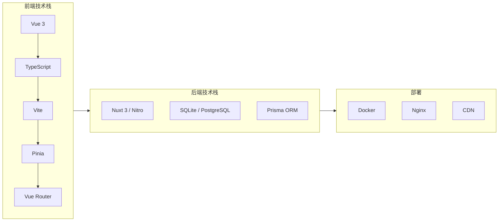
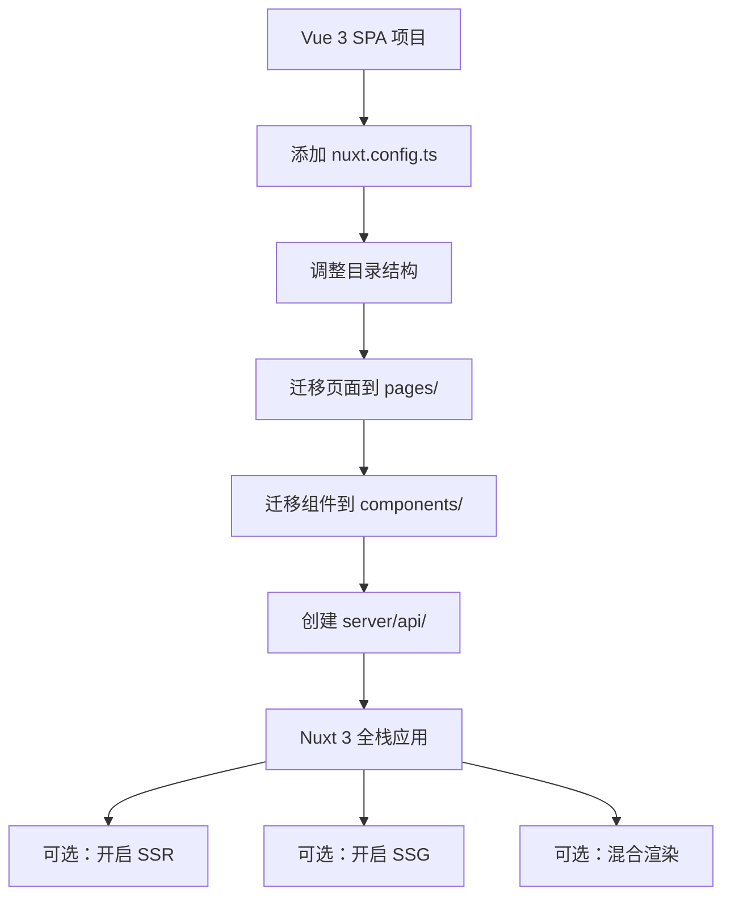

+++
title = "第26章 内容平台实战"
weight = 260
date = "2026-03-25T12:54:00+08:00"
type = "docs"
description = ""
isCJKLanguage = true
draft = false
+++

# 第二十六章 内容平台实战

> 你已经学会了 Vue 3 的各种招式，但"学"和"用"之间还隔着一道坎——真实项目的复杂度。本章我们从零开始，手把手带你构建一个完整的内容发布平台。从需求分析、架构设计，到文章管理、评论点赞，再到 SSR 改造，全部安排。读完本章，你将拥有一个可以真正拿出手的作品。

## 26.1 需求分析与架构设计

### 26.1.1 项目定位

我们要构建的是一个类似博客园、CSDN 的技术内容平台。核心功能包括：

- 📝 文章发布与编辑（Markdown 支持）
- 🏷️ 分类与标签管理
- 🔍 全文搜索
- 💬 评论与回复
- ❤️ 点赞与收藏
- 👤 用户与权限系统

### 26.1.2 技术栈选型



| 层级 | 技术选型 | 说明 |
|------|----------|------|
| 框架 | Vue 3 + Nuxt 3 | 既有 Vue 的开发体验，又有 SSR 能力 |
| 语言 | TypeScript | 类型安全是大型项目的必备 |
| 状态管理 | Pinia | 官方推荐，比 Vuex 更现代 |
| 路由 | Vue Router 4 | 页面路由，配合 Nuxt 的文件路由 |
| 数据库 | SQLite（开发）/ PostgreSQL（生产） | Prisma ORM 统一操作 |
| 样式 | UnoCSS + Tailwind CSS | 原子化 CSS，开发效率高 |
| Markdown | markdown-it + highlight.js | 文章渲染与代码高亮 |
| 搜索 | Fuse.js（前端）/ Algolia（可选） | 轻量搜索或专业搜索服务 |

### 26.1.3 项目结构

```
vue3-content-platform/
├── nuxt.config.ts          # Nuxt 配置
├── prisma/
│   └── schema.prisma       # 数据库 schema
├── server/
│   ├── api/                # API 路由
│   ├── middleware/         # 服务端中间件
│   └── utils/              # 服务端工具函数
├── pages/                  # 页面（文件路由）
│   ├── index.vue           # 首页
│   ├── articles/           # 文章相关页面
│   │   ├── index.vue       # 文章列表
│   │   ├── [id].vue        # 文章详情
│   │   └── edit/[id].vue   # 文章编辑
│   ├── categories/         # 分类页面
│   └── search.vue          # 搜索页面
├── components/             # 组件
│   ├── article/            # 文章相关组件
│   ├── comment/            # 评论相关组件
│   └── common/             # 通用组件
├── composables/            # 组合式函数
├── stores/                 # Pinia stores
├── types/                  # TypeScript 类型定义
└── public/                 # 静态资源
```

## 26.2 前端架构设计

### 26.2.1 路由设计

```typescript
// Nuxt 3 使用文件路由，约定大于配置
// pages/
// ├── index.vue                    → /
// ├── articles/
// │   ├── index.vue                 → /articles
// │   ├── [id].vue                  → /articles/:id
// │   └── edit/
// │       ├── [id].vue              → /articles/edit/:id
// │       └── new.vue               → /articles/edit/new
// ├── categories/
// │   ├── index.vue                 → /categories
// │   └── [slug].vue                → /categories/:slug
// ├── tags/
// │   ├── index.vue                 → /tags
// │   └── [slug].vue                → /tags/:slug
// ├── search.vue                    → /search
// ├── user/
// │   ├── login.vue                 → /user/login
// │   ├── register.vue              → /user/register
// │   └── profile.vue               → /user/profile
// └── admin/
//     ├── index.vue                  → /admin (需权限)
//     └── articles/
//         └── manage.vue             → /admin/articles (需权限)

// 如果需要更细粒度的路由控制，可以在 nuxt.config.ts 中扩展
export default defineNuxtRouteMiddleware((to) => {
  // 全局路由守卫
  const userStore = useUserStore()
  
  // 需要登录的页面
  const authRoutes = ['/user/profile', '/articles/edit/new']
  if (authRoutes.includes(to.path) && !userStore.isLoggedIn) {
    return navigateTo('/user/login')
  }
  
  // 需要管理员权限的页面
  const adminRoutes = ['/admin']
  if (adminRoutes.some(r => to.path.startsWith(r)) && !userStore.isAdmin) {
    return navigateTo('/')
  }
})
```

### 26.2.2 权限控制系统

```typescript
// types/permission.ts
export type Role = 'guest' | 'user' | 'author' | 'admin'

export interface Permission {
  action: 'read' | 'create' | 'update' | 'delete' | 'publish'
  resource: 'article' | 'comment' | 'category' | 'tag' | 'user'
}

// 权限矩阵
export const permissionMatrix: Record<Role, Permission[]> = {
  guest: [
    { action: 'read', resource: 'article' },
    { action: 'read', resource: 'comment' },
  ],
  user: [
    { action: 'read', resource: 'article' },
    { action: 'read', resource: 'comment' },
    { action: 'create', resource: 'comment' },
    { action: 'update', resource: 'comment' }, // 仅自己的
  ],
  author: [
    { action: 'read', resource: 'article' },
    { action: 'read', resource: 'comment' },
    { action: 'create', resource: 'article' },
    { action: 'update', resource: 'article' }, // 仅自己的
    { action: 'create', resource: 'comment' },
  ],
  admin: [
    { action: 'read', resource: 'article' },
    { action: 'create', resource: 'article' },
    { action: 'update', resource: 'article' },
    { action: 'delete', resource: 'article' },
    { action: 'publish', resource: 'article' },
    { action: 'read', resource: 'comment' },
    { action: 'delete', resource: 'comment' },
    { action: 'read', resource: 'user' },
    { action: 'update', resource: 'user' },
  ],
}

// 权限检查函数
export function hasPermission(
  role: Role,
  action: Permission['action'],
  resource: Permission['resource'],
  ownerId?: string
): boolean {
  const permissions = permissionMatrix[role] || []
  const hasBasePermission = permissions.some(
    p => p.action === action && p.resource === resource
  )
  
  // 如果是 update/delete 操作，需要检查是否是所有者
  if (hasBasePermission && ownerId) {
    const userStore = useUserStore()
    return userStore.currentUser?.id === ownerId || role === 'admin'
  }
  
  return hasBasePermission
}
```

### 26.2.3 Pinia 状态管理

```typescript
// stores/user.ts
import { defineStore } from 'pinia'
import type { User, Role } from '~/types'

interface UserState {
  currentUser: User | null
  token: string | null
  isLoggedIn: boolean
}

export const useUserStore = defineStore('user', {
  state: (): UserState => ({
    currentUser: null,
    token: null,
    isLoggedIn: false,
  }),
  
  getters: {
    role: (state): Role => state.currentUser?.role || 'guest',
    isAdmin: (state): boolean => state.currentUser?.role === 'admin',
    isAuthor: (state): boolean => 
      state.currentUser?.role === 'author' || state.currentUser?.role === 'admin',
  },
  
  actions: {
    async login(username: string, password: string) {
      const { data } = await useFetch('/api/auth/login', {
        method: 'POST',
        body: { username, password },
      })
      
      if (data.value) {
        this.currentUser = data.value.user
        this.token = data.value.token
        this.isLoggedIn = true
        
        // 持久化 token
        if (import.meta.client) {
          localStorage.setItem('token', this.token!)
        }
      }
    },
    
    async fetchCurrentUser() {
      const token = import.meta.client 
        ? localStorage.getItem('token') 
        : null
      
      if (!token) return
      
      try {
        const { data } = await useFetch('/api/auth/me', {
          headers: { Authorization: `Bearer ${token}` },
        })
        
        if (data.value) {
          this.currentUser = data.value
          this.token = token
          this.isLoggedIn = true
        }
      } catch {
        this.logout()
      }
    },
    
    logout() {
      this.currentUser = null
      this.token = null
      this.isLoggedIn = false
      
      if (import.meta.client) {
        localStorage.removeItem('token')
      }
      
      navigateTo('/user/login')
    },
  },
})
```

## 26.3 核心功能实现

### 26.3.1 文章列表页

```vue
<!-- pages/articles/index.vue -->
<template>
  <div class="articles-page">
    <!-- 筛选器 -->
    <div class="filters">
      <select v-model="selectedCategory" class="filter-select">
        <option value="">全部分类</option>
        <option v-for="cat in categories" :key="cat.id" :value="cat.slug">
          {{ cat.name }}
        </option>
      </select>
      
      <input 
        v-model="searchQuery" 
        type="search" 
        placeholder="搜索文章..."
        class="search-input"
        @input="debouncedSearch"
      />
      
      <div class="sort-options">
        <button 
          :class="{ active: sortBy === 'latest' }"
          @click="sortBy = 'latest'"
        >
          最新
        </button>
        <button 
          :class="{ active: sortBy === 'popular' }"
          @click="sortBy = 'popular'"
        >
          热门
        </button>
      </div>
    </div>
    
    <!-- 文章列表 -->
    <div v-if="pending" class="loading">
      加载中...
    </div>
    
    <div v-else-if="articles?.length" class="article-list">
      <ArticleCard 
        v-for="article in articles" 
        :key="article.id"
        :article="article"
      />
    </div>
    
    <div v-else class="empty-state">
      <p>暂无文章，{{ isLoggedIn ? '成为第一位作者吧！' : '登录后发布文章' }}</p>
    </div>
    
    <!-- 分页 -->
    <Pagination 
      v-if="totalPages > 1"
      :current="page"
      :total="totalPages"
      @change="handlePageChange"
    />
  </div>
</template>

<script setup lang="ts">
import { useUserStore } from '~/stores/user'

// 状态
const userStore = useUserStore()
const isLoggedIn = computed(() => userStore.isLoggedIn)

const page = ref(1)
const pageSize = ref(10)
const selectedCategory = ref('')
const searchQuery = ref('')
const sortBy = ref<'latest' | 'popular'>('latest')

// 获取分类
const { data: categories } = await useFetch('/api/categories', {
  default: () => [],
})

// 防抖搜索
const debouncedSearch = useDebounceFn(() => {
  page.value = 1
  fetchArticles()
}, 300)

// 获取文章列表
const { data: articlesData, pending, refresh } = await useFetch('/api/articles', {
  query: computed(() => ({
    page: page.value,
    pageSize: pageSize.value,
    category: selectedCategory.value,
    search: searchQuery.value,
    sort: sortBy.value,
  })),
})

const articles = computed(() => articlesData.value?.articles || [])
const totalPages = computed(() => Math.ceil((articlesData.value?.total || 0) / pageSize.value))

// 监听筛选器变化
watch([selectedCategory, sortBy], () => {
  page.value = 1
  refresh()
})

// 分页处理
function handlePageChange(newPage: number) {
  page.value = newPage
  window.scrollTo({ top: 0, behavior: 'smooth' })
}

// SEO
useHead({
  title: '文章列表 - Vue3 内容平台',
  meta: [
    { name: 'description', content: '浏览最新技术文章，学习 Vue3 开发' },
  ],
})
</script>

<style scoped>
.articles-page {
  max-width: 1200px;
  margin: 0 auto;
  padding: 2rem;
}

.filters {
  display: flex;
  gap: 1rem;
  margin-bottom: 2rem;
  flex-wrap: wrap;
}

.filter-select,
.search-input {
  padding: 0.5rem 1rem;
  border: 1px solid #ddd;
  border-radius: 8px;
  font-size: 1rem;
}

.sort-options {
  display: flex;
  gap: 0.5rem;
}

.sort-options button {
  padding: 0.5rem 1rem;
  border: 1px solid #ddd;
  border-radius: 8px;
  background: white;
  cursor: pointer;
  transition: all 0.2s;
}

.sort-options button.active {
  background: var(--primary-color);
  color: white;
  border-color: var(--primary-color);
}

.article-list {
  display: grid;
  gap: 1.5rem;
}

.empty-state {
  text-align: center;
  padding: 4rem;
  color: #666;
}
</style>
```

### 26.3.2 文章详情页

```vue
<!-- pages/articles/[id].vue -->
<template>
  <article v-if="article" class="article-detail">
    <!-- 文章头部 -->
    <header class="article-header">
      <div class="article-meta">
        <span class="category-tag">{{ article.category.name }}</span>
        <span class="publish-date">{{ formatDate(article.publishedAt) }}</span>
        <span class="author">by {{ article.author.name }}</span>
      </div>
      
      <h1 class="article-title">{{ article.title }}</h1>
      
      <div class="article-tags">
        <span 
          v-for="tag in article.tags" 
          :key="tag.id"
          class="tag"
        >
          {{ tag.name }}
        </span>
      </div>
    </header>
    
    <!-- 文章内容 -->
    <div class="article-content" v-html="renderedContent"></div>
    
    <!-- 点赞与收藏 -->
    <div class="article-actions">
      <button 
        :class="['like-btn', { liked: hasLiked }]"
        @click="toggleLike"
      >
        ❤️ {{ article.likes }}
      </button>
      
      <button 
        :class="['bookmark-btn', { bookmarked: hasBookmarked }]"
        @click="toggleBookmark"
      >
        🔖 {{ hasBookmarked ? '已收藏' : '收藏' }}
      </button>
      
      <button class="share-btn" @click="shareArticle">
        分享
      </button>
    </div>
    
    <!-- 评论区 -->
    <section class="comments-section">
      <h2>评论 ({{ article.comments.length }})</h2>
      
      <!-- 发表评论 -->
      <div v-if="isLoggedIn" class="comment-form">
        <textarea 
          v-model="newComment"
          placeholder="写下你的评论..."
          rows="3"
        />
        <button @click="submitComment">发表评论</button>
      </div>
      <p v-else class="login-hint">
        <NuxtLink to="/user/login">登录</NuxtLink>后发表评论
      </p>
      
      <!-- 评论列表 -->
      <div class="comments-list">
        <CommentItem 
          v-for="comment in article.comments" 
          :key="comment.id"
          :comment="comment"
          @reply="handleReply"
        />
      </div>
    </section>
  </article>
  
  <div v-else class="not-found">
    <h1>文章不存在</h1>
    <NuxtLink to="/articles">返回列表</NuxtLink>
  </div>
</template>

<script setup lang="ts">
import { useUserStore } from '~/stores/user'
import { useArticleStore } from '~/stores/article'
import { marked } from 'marked'
import hljs from 'highlight.js'

// 配置 marked
marked.setOptions({
  highlight: (code: string, lang: string) => {
    if (lang && hljs.getLanguage(lang)) {
      return hljs.highlight(code, { language: lang }).value
    }
    return hljs.highlightAuto(code).value
  },
})

const route = useRoute()
const userStore = useUserStore()
const articleStore = useArticleStore()

const articleId = route.params.id as string

// 获取文章
const { data: article, error } = await useFetch(`/api/articles/${articleId}`)

// 404 处理
if (!article.value) {
  throw createError({
    statusCode: 404,
    message: '文章不存在',
  })
}

// 渲染 Markdown 内容
const renderedContent = computed(() => {
  if (!article.value?.content) return ''
  return marked(article.value.content)
})

// 点赞状态
const hasLiked = ref(false)
const hasBookmarked = ref(false)

// 点赞
async function toggleLike() {
  if (!userStore.isLoggedIn) {
    navigateTo('/user/login')
    return
  }
  
  await articleStore.toggleLike(articleId)
  hasLiked.value = !hasLiked.value
}

// 收藏
async function toggleBookmark() {
  if (!userStore.isLoggedIn) {
    navigateTo('/user/login')
    return
  }
  
  await articleStore.toggleBookmark(articleId)
  hasBookmarked.value = !hasBookmarked.value
}

// 分享
function shareArticle() {
  if (navigator.share) {
    navigator.share({
      title: article.value?.title,
      text: article.value?.excerpt,
      url: window.location.href,
    })
  } else {
    navigator.clipboard.writeText(window.location.href)
    alert('链接已复制到剪贴板')
  }
}

// 评论
const newComment = ref('')

async function submitComment() {
  if (!newComment.value.trim()) return
  
  await $fetch('/api/comments', {
    method: 'POST',
    body: {
      articleId,
      content: newComment.value,
    },
  })
  
  newComment.value = ''
  // 刷新评论列表
  refresh()
}

function handleReply(commentId: string, content: string) {
  // 处理回复...
}

// SEO
useHead({
  title: article.value ? `${article.value.title} - Vue3 内容平台` : '文章',
  meta: [
    { name: 'description', content: article.value?.excerpt },
    { property: 'og:title', content: article.value?.title },
    { property: 'og:description', content: article.value?.excerpt },
  ],
})
</script>

<style scoped>
.article-detail {
  max-width: 800px;
  margin: 0 auto;
  padding: 2rem;
}

.article-header {
  margin-bottom: 2rem;
  padding-bottom: 1.5rem;
  border-bottom: 1px solid #eee;
}

.article-meta {
  display: flex;
  gap: 1rem;
  font-size: 0.9rem;
  color: #666;
  margin-bottom: 1rem;
}

.category-tag {
  background: var(--primary-color);
  color: white;
  padding: 0.2rem 0.6rem;
  border-radius: 4px;
}

.article-title {
  font-size: 2.5rem;
  margin-bottom: 1rem;
  line-height: 1.3;
}

.article-tags {
  display: flex;
  gap: 0.5rem;
  flex-wrap: wrap;
}

.tag {
  background: #f0f0f0;
  padding: 0.2rem 0.6rem;
  border-radius: 4px;
  font-size: 0.85rem;
}

.article-content {
  line-height: 1.8;
  font-size: 1.1rem;
}

.article-content :deep(h2) {
  margin-top: 2rem;
  margin-bottom: 1rem;
}

.article-content :deep(pre) {
  background: #f5f5f5;
  padding: 1rem;
  border-radius: 8px;
  overflow-x: auto;
}

.article-actions {
  display: flex;
  gap: 1rem;
  margin: 2rem 0;
  padding: 1.5rem 0;
  border-top: 1px solid #eee;
  border-bottom: 1px solid #eee;
}

.article-actions button {
  padding: 0.5rem 1.5rem;
  border: 1px solid #ddd;
  border-radius: 20px;
  background: white;
  cursor: pointer;
  transition: all 0.2s;
}

.article-actions button:hover {
  transform: scale(1.05);
}

.article-actions button.liked {
  color: #e74c3c;
}

.article-actions button.bookmarked {
  color: #f39c12;
}

.comments-section {
  margin-top: 3rem;
}

.comment-form {
  margin: 1.5rem 0;
}

.comment-form textarea {
  width: 100%;
  padding: 1rem;
  border: 1px solid #ddd;
  border-radius: 8px;
  resize: vertical;
}

.comment-form button {
  margin-top: 0.5rem;
  padding: 0.5rem 1.5rem;
  background: var(--primary-color);
  color: white;
  border: none;
  border-radius: 8px;
  cursor: pointer;
}
</style>
```

### 26.3.3 Markdown 编辑器

```vue
<!-- components/editor/MarkdownEditor.vue -->
<template>
  <div class="markdown-editor">
    <!-- 工具栏 -->
    <div class="editor-toolbar">
      <button @click="insertFormat('**', '**')" title="加粗">B</button>
      <button @click="insertFormat('*', '*')" title="斜体">I</button>
      <button @click="insertFormat('`', '`')" title="行内代码">code</button>
      <button @click="insertLink" title="插入链接">🔗</button>
      <button @click="insertImage" title="插入图片">🖼️</button>
      <span class="divider"></span>
      <button @click="insertFormat('## ', '')" title="二级标题">H2</button>
      <button @click="insertFormat('### ', '')" title="三级标题">H3</button>
      <span class="divider"></span>
      <button @click="insertFormat('- ', '')" title="无序列表">•</button>
      <button @click="insertFormat('1. ', '')" title="有序列表">1.</button>
      <button @click="insertFormat('> ', '')" title="引用">"</button>
      <button @click="insertFormat('```\n', '\n```')" title="代码块">```</button>
      <span class="divider"></span>
      <button @click="togglePreview" :class="{ active: showPreview }">
        {{ showPreview ? '编辑' : '预览' }}
      </button>
    </div>
    
    <!-- 编辑区域 -->
    <div class="editor-body" :class="{ 'with-preview': showPreview }">
      <textarea
        v-if="!showPreview"
        ref="textareaRef"
        v-model="content"
        :placeholder="placeholder"
        @input="handleInput"
        @keydown="handleKeydown"
      ></textarea>
      
      <div v-if="showPreview" class="preview" v-html="renderedContent"></div>
    </div>
    
    <!-- 拖拽上传图片 -->
    <div 
      v-if="!showPreview"
      class="drop-zone"
      :class="{ 'drag-over': isDragging }"
      @dragover.prevent="isDragging = true"
      @dragleave="isDragging = false"
      @drop.prevent="handleDrop"
    >
      <span>拖拽图片到此处上传</span>
    </div>
  </div>
</template>

<script setup lang="ts">
import { marked } from 'marked'
import hljs from 'highlight.js'

const props = defineProps<{
  modelValue: string
  placeholder?: string
}>()

const emit = defineEmits<{
  'update:modelValue': [value: string]
}>()

const textareaRef = ref<HTMLTextAreaElement>()
const showPreview = ref(false)
const isDragging = ref(false)

// 配置 marked
marked.setOptions({
  highlight: (code: string, lang: string) => {
    if (lang && hljs.getLanguage(lang)) {
      return hljs.highlight(code, { language: lang }).value
    }
    return hljs.highlightAuto(code).value
  },
})

const content = computed({
  get: () => props.modelValue,
  set: (value) => emit('update:modelValue', value),
})

const renderedContent = computed(() => marked(content.value))

// 插入格式化内容
function insertFormat(prefix: string, suffix: string) {
  const textarea = textareaRef.value
  if (!textarea) return
  
  const start = textarea.selectionStart
  const end = textarea.selectionEnd
  const selectedText = content.value.substring(start, end)
  
  const newText = 
    content.value.substring(0, start) +
    prefix + selectedText + suffix +
    content.value.substring(end)
  
  content.value = newText
  
  // 设置光标位置
  nextTick(() => {
    textarea.focus()
    if (selectedText) {
      textarea.setSelectionRange(start + prefix.length, end + prefix.length)
    } else {
      textarea.setSelectionRange(start + prefix.length, start + prefix.length)
    }
  })
}

// 插入链接
function insertLink() {
  const url = prompt('请输入链接地址:')
  if (url) {
    insertFormat('[', `](${url})`)
  }
}

// 插入图片
async function insertImage() {
  const input = document.createElement('input')
  input.type = 'file'
  input.accept = 'image/*'
  
  input.onchange = async (e) => {
    const file = (e.target as HTMLInputElement).files?.[0]
    if (file) {
      const url = await uploadImage(file)
      insertFormat('`)
    }
  }
  
  input.click()
}

// 上传图片
async function uploadImage(file: File): Promise<string> {
  const formData = new FormData()
  formData.append('image', file)
  
  const { data } = await $fetch('/api/upload', {
    method: 'POST',
    body: formData,
  })
  
  return (data as { url: string }).url
}

// 拖拽上传
async function handleDrop(e: DragEvent) {
  isDragging.value = false
  const files = e.dataTransfer?.files
  if (!files?.length) return
  
  for (const file of Array.from(files)) {
    if (file.type.startsWith('image/')) {
      const url = await uploadImage(file)
      insertFormat('`)
    }
  }
}

// 键盘快捷键
function handleKeydown(e: KeyboardEvent) {
  if (e.ctrlKey || e.metaKey) {
    switch (e.key) {
      case 'b':
        e.preventDefault()
        insertFormat('**', '**')
        break
      case 'i':
        e.preventDefault()
        insertFormat('*', '*')
        break
      case 'k':
        e.preventDefault()
        insertLink()
        break
    }
  }
  
  // Tab 插入空格
  if (e.key === 'Tab') {
    e.preventDefault()
    insertFormat('  ', '')
  }
}

function handleInput() {
  emit('update:modelValue', content.value)
}

function togglePreview() {
  showPreview.value = !showPreview.value
}

// 暴露方法给父组件
defineExpose({
  focus: () => textareaRef.value?.focus(),
  insertText: insertFormat,
})
</script>

<style scoped>
.markdown-editor {
  border: 1px solid #ddd;
  border-radius: 8px;
  overflow: hidden;
}

.editor-toolbar {
  display: flex;
  gap: 0.25rem;
  padding: 0.5rem;
  background: #f5f5f5;
  border-bottom: 1px solid #ddd;
  flex-wrap: wrap;
}

.editor-toolbar button {
  padding: 0.3rem 0.6rem;
  border: none;
  background: transparent;
  cursor: pointer;
  border-radius: 4px;
  font-weight: bold;
}

.editor-toolbar button:hover {
  background: #e0e0e0;
}

.editor-toolbar button.active {
  background: var(--primary-color);
  color: white;
}

.divider {
  width: 1px;
  background: #ccc;
  margin: 0 0.25rem;
}

.editor-body {
  min-height: 400px;
}

.editor-body.with-preview {
  display: flex;
}

.editor-body textarea {
  width: 100%;
  min-height: 400px;
  padding: 1rem;
  border: none;
  resize: vertical;
  font-family: 'Fira Code', monospace;
  font-size: 0.95rem;
  line-height: 1.6;
}

.editor-body textarea:focus {
  outline: none;
}

.preview {
  flex: 1;
  padding: 1rem;
  overflow-y: auto;
  line-height: 1.8;
}

.drop-zone {
  padding: 2rem;
  text-align: center;
  color: #999;
  border-top: 1px dashed #ddd;
  background: #fafafa;
}

.drop-zone.drag-over {
  background: #e3f2fd;
  border-color: var(--primary-color);
}
</style>
```

### 26.3.4 分类与标签系统

```typescript
// composables/useCategories.ts
export function useCategories() {
  const { data: categories, pending, error } = useFetch('/api/categories')
  
  function getCategoryBySlug(slug: string) {
    return categories.value?.find(c => c.slug === slug)
  }
  
  function getArticlesByCategory(categoryId: string) {
    return useFetch('/api/articles', {
      query: { category: categoryId },
    })
  }
  
  return {
    categories,
    pending,
    error,
    getCategoryBySlug,
    getArticlesByCategory,
  }
}

// composables/useTags.ts
export function useTags() {
  const { data: tags, pending, error } = useFetch('/api/tags')
  
  // 获取标签云（带权重）
  const tagCloud = computed(() => {
    if (!tags.value) return []
    const maxCount = Math.max(...tags.value.map(t => t.articleCount))
    return tags.value.map(tag => ({
      ...tag,
      weight: tag.articleCount / maxCount, // 0-1 的权重
    }))
  })
  
  function getPopularTags(limit = 10) {
    return tags.value
      ?.sort((a, b) => b.articleCount - a.articleCount)
      .slice(0, limit) || []
  }
  
  return {
    tags,
    pending,
    error,
    tagCloud,
    getPopularTags,
  }
}
```

### 26.3.5 搜索功能

```vue
<!-- pages/search.vue -->
<template>
  <div class="search-page">
    <div class="search-header">
      <input
        v-model="searchQuery"
        type="search"
        placeholder="搜索文章、作者、标签..."
        class="search-input"
        autofocus
        @input="handleSearch"
      />
      
      <div class="search-filters">
        <label>
          <input v-model="filters.type" type="radio" value="all" />
          全部
        </label>
        <label>
          <input v-model="filters.type" type="radio" value="title" />
          标题
        </label>
        <label>
          <input v-model="filters.type" type="radio" value="content" />
          内容
        </label>
        <label>
          <input v-model="filters.type" type="radio" value="author" />
          作者
        </label>
      </div>
    </div>
    
    <!-- 搜索结果 -->
    <div v-if="searchQuery" class="search-results">
      <p class="results-count">
        找到 {{ results.length }} 个结果
      </p>
      
      <div v-if="results.length" class="results-list">
        <SearchResultItem 
          v-for="result in results" 
          :key="result.id"
          :result="result"
        />
      </div>
      
      <div v-else class="no-results">
        <p>没有找到匹配的内容</p>
        <p class="suggestion">试试不同的关键词？</p>
      </div>
    </div>
    
    <!-- 热门搜索 -->
    <div v-else class="popular-searches">
      <h3>热门搜索</h3>
      <div class="tag-cloud">
        <span 
          v-for="tag in popularTags" 
          :key="tag.name"
          class="popular-tag"
          @click="searchQuery = tag.name"
        >
          {{ tag.name }} ({{ tag.count }})
        </span>
      </div>
    </div>
  </div>
</template>

<script setup lang="ts">
import Fuse from 'fuse.js'

const searchQuery = ref('')
const filters = reactive({
  type: 'all' as 'all' | 'title' | 'content' | 'author',
})

// 获取所有文章用于前端搜索
const { data: allArticles } = await useFetch('/api/articles/all')

// 初始化 Fuse.js 搜索
const fuse = computed(() => {
  if (!allArticles.value) return null
  
  return new Fuse(allArticles.value, {
    keys: [
      { name: 'title', weight: 2 },
      { name: 'content', weight: 1 },
      { name: 'author.name', weight: 1.5 },
      { name: 'tags.name', weight: 1.5 },
    ],
    threshold: 0.3,
    includeScore: true,
    minMatchCharLength: 2,
  })
})

// 搜索结果
const results = computed(() => {
  if (!fuse.value || !searchQuery.value) return []
  
  const searchResults = fuse.value.search(searchQuery.value)
  
  // 根据过滤器进一步筛选
  let filtered = searchResults
  
  if (filters.type !== 'all') {
    // Fuse.js 不支持按字段搜索，这里做简单的客户端过滤
    // 生产环境建议用后端搜索
    filtered = searchResults.filter(r => {
      switch (filters.type) {
        case 'title':
          return r.item.title.toLowerCase().includes(searchQuery.value.toLowerCase())
        case 'content':
          return r.item.content.toLowerCase().includes(searchQuery.value.toLowerCase())
        case 'author':
          return r.item.author.name.toLowerCase().includes(searchQuery.value.toLowerCase())
        default:
          return true
      }
    })
  }
  
  return filtered.map(r => r.item)
})

// 防抖搜索
const handleSearch = useDebounceFn(() => {
  // 搜索是响应式的，这里可以做额外处理
}, 200)

// 热门标签
const popularTags = ref([
  { name: 'Vue 3', count: 42 },
  { name: 'TypeScript', count: 38 },
  { name: 'Vite', count: 25 },
  { name: 'Pinia', count: 20 },
  { name: 'Composition API', count: 18 },
])

useHead({
  title: '搜索 - Vue3 内容平台',
})
</script>

<style scoped>
.search-page {
  max-width: 800px;
  margin: 0 auto;
  padding: 2rem;
}

.search-header {
  margin-bottom: 2rem;
}

.search-input {
  width: 100%;
  padding: 1rem;
  font-size: 1.2rem;
  border: 2px solid #ddd;
  border-radius: 12px;
  margin-bottom: 1rem;
}

.search-input:focus {
  border-color: var(--primary-color);
  outline: none;
}

.search-filters {
  display: flex;
  gap: 1rem;
}

.search-filters label {
  display: flex;
  align-items: center;
  gap: 0.25rem;
  cursor: pointer;
}

.results-count {
  color: #666;
  margin-bottom: 1rem;
}

.no-results {
  text-align: center;
  padding: 3rem;
  color: #666;
}

.suggestion {
  margin-top: 0.5rem;
  color: #999;
}

.popular-searches h3 {
  margin-bottom: 1rem;
}

.tag-cloud {
  display: flex;
  flex-wrap: wrap;
  gap: 0.5rem;
}

.popular-tag {
  padding: 0.5rem 1rem;
  background: #f0f0f0;
  border-radius: 20px;
  cursor: pointer;
  transition: all 0.2s;
}

.popular-tag:hover {
  background: var(--primary-color);
  color: white;
}
</style>
```

### 26.3.6 评论与点赞

```typescript
// stores/article.ts
import { defineStore } from 'pinia'

export const useArticleStore = defineStore('article', {
  state: () => ({
    // 点赞的文章 ID 集合
    likedArticles: new Set<string>(),
    // 收藏的文章 ID 集合
    bookmarkedArticles: new Set<string>(),
  }),
  
  actions: {
    async toggleLike(articleId: string) {
      const isLiked = this.likedArticles.has(articleId)
      
      // 乐观更新
      if (isLiked) {
        this.likedArticles.delete(articleId)
      } else {
        this.likedArticles.add(articleId)
      }
      
      try {
        await $fetch(`/api/articles/${articleId}/like`, {
          method: 'POST',
        })
      } catch {
        // 失败则回滚
        if (isLiked) {
          this.likedArticles.add(articleId)
        } else {
          this.likedArticles.delete(articleId)
        }
      }
    },
    
    async toggleBookmark(articleId: string) {
      const isBookmarked = this.bookmarkedArticles.has(articleId)
      
      // 乐观更新
      if (isBookmarked) {
        this.bookmarkedArticles.delete(articleId)
      } else {
        this.bookmarkedArticles.add(articleId)
      }
      
      try {
        await $fetch(`/api/articles/${articleId}/bookmark`, {
          method: 'POST',
        })
      } catch {
        // 失败则回滚
        if (isBookmarked) {
          this.bookmarkedArticles.add(articleId)
        } else {
          this.bookmarkedArticles.delete(articleId)
        }
      }
    },
    
    hasLiked(articleId: string) {
      return this.likedArticles.has(articleId)
    },
    
    hasBookmarked(articleId: string) {
      return this.bookmarkedArticles.has(articleId)
    },
  },
  
  // Pinia 不支持直接持久化，需要插件
  persist: {
    key: 'article-store',
    storage: persistedState.localStorage,
  },
})
```

```vue
<!-- components/comment/CommentItem.vue -->
<template>
  <div class="comment-item" :class="{ nested: depth > 0 }">
    <div class="comment-avatar">
      
    </div>
    
    <div class="comment-body">
      <div class="comment-header">
        <span class="author-name">{{ comment.author.name }}</span>
        <span class="comment-date">{{ formatDate(comment.createdAt) }}</span>
      </div>
      
      <div class="comment-content">{{ comment.content }}</div>
      
      <div class="comment-actions">
        <button @click="handleLike" :class="{ liked: isLiked }">
          👍 {{ comment.likes }}
        </button>
        <button v-if="depth < maxDepth" @click="showReplyForm = true">
          回复
        </button>
        <button 
          v-if="canDelete"
          class="delete-btn"
          @click="handleDelete"
        >
          删除
        </button>
      </div>
      
      <!-- 回复表单 -->
      <div v-if="showReplyForm" class="reply-form">
        <textarea 
          v-model="replyContent"
          placeholder="写下你的回复..."
          rows="2"
        />
        <div class="reply-actions">
          <button @click="showReplyForm = false">取消</button>
          <button @click="submitReply" class="submit-btn">发表</button>
        </div>
      </div>
      
      <!-- 子评论 -->
      <div v-if="comment.replies?.length" class="comment-replies">
        <CommentItem 
          v-for="reply in comment.replies"
          :key="reply.id"
          :comment="reply"
          :depth="depth + 1"
          @reply="$emit('reply', $event)"
        />
      </div>
    </div>
  </div>
</template>

<script setup lang="ts">
import { useUserStore } from '~/stores/user'

interface Comment {
  id: string
  content: string
  author: {
    id: string
    name: string
    avatar: string
  }
  likes: number
  createdAt: string
  replies?: Comment[]
}

const props = defineProps<{
  comment: Comment
  depth?: number
}>()

const emit = defineEmits<{
  reply: [commentId: string, content: string]
}>()

const userStore = useUserStore()
const depth = computed(() => props.depth || 0)
const maxDepth = 3
const showReplyForm = ref(false)
const replyContent = ref('')
const isLiked = ref(false)

const canDelete = computed(() => 
  userStore.isAdmin || userStore.currentUser?.id === props.comment.author.id
)

function handleLike() {
  isLiked.value = !isLiked.value
  // 调用 API
}

function submitReply() {
  if (!replyContent.value.trim()) return
  
  emit('reply', props.comment.id, replyContent.value)
  replyContent.value = ''
  showReplyForm.value = false
}

function handleDelete() {
  if (confirm('确定删除这条评论吗？')) {
    $fetch(`/api/comments/${props.comment.id}`, {
      method: 'DELETE',
    })
  }
}

function formatDate(date: string) {
  return new Date(date).toLocaleDateString('zh-CN', {
    year: 'numeric',
    month: 'short',
    day: 'numeric',
  })
}
</script>

<style scoped>
.comment-item {
  display: flex;
  gap: 1rem;
  padding: 1rem 0;
  border-bottom: 1px solid #f0f0f0;
}

.comment-item.nested {
  margin-left: 2rem;
  border-left: 2px solid #eee;
  padding-left: 1rem;
}

.comment-avatar img {
  width: 40px;
  height: 40px;
  border-radius: 50%;
  object-fit: cover;
}

.comment-body {
  flex: 1;
}

.comment-header {
  display: flex;
  gap: 0.5rem;
  align-items: center;
  margin-bottom: 0.5rem;
}

.author-name {
  font-weight: bold;
}

.comment-date {
  font-size: 0.85rem;
  color: #999;
}

.comment-content {
  line-height: 1.6;
  margin-bottom: 0.5rem;
}

.comment-actions {
  display: flex;
  gap: 0.5rem;
}

.comment-actions button {
  padding: 0.25rem 0.5rem;
  border: none;
  background: transparent;
  cursor: pointer;
  color: #666;
}

.comment-actions button.liked {
  color: var(--primary-color);
}

.comment-actions .delete-btn {
  color: #e74c3c;
}

.reply-form {
  margin-top: 1rem;
}

.reply-form textarea {
  width: 100%;
  padding: 0.5rem;
  border: 1px solid #ddd;
  border-radius: 8px;
  resize: vertical;
}

.reply-actions {
  display: flex;
  gap: 0.5rem;
  margin-top: 0.5rem;
  justify-content: flex-end;
}

.reply-actions button {
  padding: 0.3rem 0.8rem;
  border-radius: 4px;
  cursor: pointer;
}

.submit-btn {
  background: var(--primary-color);
  color: white;
  border: none;
}

.comment-replies {
  margin-top: 1rem;
}
</style>
```

## 26.4 SSR 改造：拥抱 Nuxt 3

### 26.4.1 为什么选择 Nuxt 3

Nuxt 3 是 Vue 3 的全栈框架，它带来了：

- **服务端渲染 (SSR)**：首屏加载更快，SEO 友好
- **静态站点生成 (SSG)**：纯静态站点，部署简单
- **混合渲染模式**：部分页面 SSR，部分页面 SSG
- **文件路由**：约定大于配置，开发效率高
- **服务端 API**：前后端同构，减少沟通成本

### 26.4.2 从 Vue 3 迁移到 Nuxt 3



### 26.4.3 Nuxt 3 配置

```typescript
// nuxt.config.ts
export default defineNuxtConfig({
  // 开发环境
  devtools: { enabled: true },
  
  // 模块
  modules: [
    '@pinia/nuxt',
    '@nuxtjs/color-mode',
    '@vueuse/nuxt',
    'nuxt-icon',
  ],
  
  // CSS
  css: ['~/assets/css/main.css'],
  
  // PostCSS
  postcss: {
    plugins: {
      tailwindcss: {},
      autoprefixer: {},
    },
  },
  
  // 应用配置
  app: {
    head: {
      title: 'Vue3 内容平台',
      meta: [
        { charset: 'utf-8' },
        { name: 'viewport', content: 'width=device-width, initial-scale=1' },
        { name: 'description', content: '分享技术与生活' },
      ],
      link: [
        { rel: 'icon', type: 'image/svg+xml', href: '/favicon.svg' },
      ],
    },
    pageTransition: { name: 'page', mode: 'out-in' },
  },
  
  // 运行时配置
  runtimeConfig: {
    // 服务端私密配置
    databaseUrl: process.env.DATABASE_URL,
    jwtSecret: process.env.JWT_SECRET,
    // 客户端公开配置
    public: {
      apiBase: '/api',
      siteName: 'Vue3 内容平台',
    },
  },
  
  // 路由规则（混合渲染）
  routeRules: {
    // 首页 SSR
    '/': { ssr: true },
    // 文章列表 SSR
    '/articles': { ssr: true },
    // 文章详情页 SSR
    '/articles/**': { ssr: true },
    // 用户页面 SSR
    '/user/**': { ssr: true },
    // 管理后台 CSR（客户端渲染）
    '/admin/**': { ssr: false },
    // 搜索页 SSR
    '/search': { ssr: true },
    // API 路由
    '/api/**': { cors: true },
  },
  
  // Nitro 配置
  nitro: {
    prerender: {
      // 预渲染静态页面
      routes: ['/', '/articles', '/categories'],
    },
    compressPublicAssets: true,
  },
  
  // Vite 配置
  vite: {
    css: {
      preprocessorOptions: {
        scss: {
          additionalData: '@use "~/assets/scss/variables.scss" as *;',
        },
      },
    },
  },
  
  // TypeScript
  typescript: {
    strict: true,
    typeCheck: true,
  },
  
  // 实验性功能
  experimental: {
    payloadExtraction: true, // 优化客户端水合
    renderJsonPayloads: true,
  },
})
```

### 26.4.4 服务端 API

```typescript
// server/api/articles/index.get.ts
import { prisma } from '~/server/utils/prisma'

export default defineEventHandler(async (event) => {
  const query = getQuery(event)
  
  const page = Number(query.page) || 1
  const pageSize = Number(query.pageSize) || 10
  const category = query.category as string
  const search = query.search as string
  const sort = (query.sort as string) || 'latest'
  
  const where: any = {
    published: true,
  }
  
  if (category) {
    where.category = { slug: category }
  }
  
  if (search) {
    where.OR = [
      { title: { contains: search, mode: 'insensitive' } },
      { content: { contains: search, mode: 'insensitive' } },
    ]
  }
  
  const orderBy: any = {}
  switch (sort) {
    case 'popular':
      orderBy.views = 'desc'
      break
    case 'latest':
    default:
      orderBy.publishedAt = 'desc'
  }
  
  const [articles, total] = await Promise.all([
    prisma.article.findMany({
      where,
      orderBy,
      skip: (page - 1) * pageSize,
      take: pageSize,
      include: {
        author: {
          select: { id: true, name: true, avatar: true },
        },
        category: true,
        tags: true,
        _count: { select: { comments: true, likes: true } },
      },
    }),
    prisma.article.count({ where }),
  ])
  
  return {
    articles,
    total,
    page,
    pageSize,
    totalPages: Math.ceil(total / pageSize),
  }
})

// server/api/articles/index.post.ts
import { prisma } from '~/server/utils/prisma'
import { z } from 'zod'

const createArticleSchema = z.object({
  title: z.string().min(1).max(200),
  content: z.string().min(1),
  excerpt: z.string().max(300).optional(),
  categoryId: z.string(),
  tagIds: z.array(z.string()).optional(),
})

export default defineEventHandler(async (event) => {
  const body = await readBody(event)
  const data = createArticleSchema.parse(body)
  
  const user = event.context.user // 从 auth middleware 获取
  
  const article = await prisma.article.create({
    data: {
      ...data,
      authorId: user.id,
      slug: generateSlug(data.title), // 生成 URL 友好的 slug
    },
    include: {
      author: true,
      category: true,
      tags: true,
    },
  })
  
  return article
})
```

### 26.4.5 认证中间件

```typescript
// server/middleware/auth.ts
import { H3Event } from 'h3'
import { prisma } from '~/server/utils/prisma'

export async function requireAuth(event: H3Event) {
  const authHeader = getHeader(event, 'authorization')
  
  if (!authHeader || !authHeader.startsWith('Bearer ')) {
    throw createError({
      statusCode: 401,
      message: '需要登录',
    })
  }
  
  const token = authHeader.substring(7)
  
  try {
    const decoded = verifyToken(token) // JWT 验证
    const user = await prisma.user.findUnique({
      where: { id: decoded.userId },
    })
    
    if (!user) {
      throw createError({
        statusCode: 401,
        message: '用户不存在',
      })
    }
    
    event.context.user = user
  } catch {
    throw createError({
      statusCode: 401,
      message: 'Token 无效或已过期',
    })
  }
}

export async function requireAdmin(event: H3Event) {
  await requireAuth(event)
  
  if (event.context.user.role !== 'admin') {
    throw createError({
      statusCode: 403,
      message: '需要管理员权限',
    })
  }
}

// 使用示例
// server/api/admin/users.get.ts
export default defineEventHandler(async (event) => {
  await requireAdmin(event)
  
  const users = await prisma.user.findMany({
    select: {
      id: true,
      name: true,
      email: true,
      role: true,
      createdAt: true,
    },
  })
  
  return users
})
```

### 26.4.6 SEO 优化

```typescript
// composables/useSeo.ts
export function useSeo(
  title: string,
  description?: string,
  options?: {
    ogImage?: string
    article?: {
      author: string
      publishedTime: string
      modifiedTime?: string
      tags: string[]
    }
  }
) {
  const config = useRuntimeConfig()
  const route = useRoute()
  
  const fullTitle = `${title} | ${config.public.siteName}`
  
  useHead({
    title: fullTitle,
    meta: [
      { name: 'description', content: description },
      // Open Graph
      { property: 'og:title', content: fullTitle },
      { property: 'og:description', content: description },
      { property: 'og:type', content: options?.article ? 'article' : 'website' },
      { property: 'og:url', content: `${config.public.siteUrl}${route.path}` },
      { property: 'og:image', content: options?.ogImage },
      // Twitter Card
      { name: 'twitter:card', content: 'summary_large_image' },
      { name: 'twitter:title', content: fullTitle },
      { name: 'twitter:description', content: description },
      { name: 'twitter:image', content: options?.ogImage },
    ],
    link: [
      { rel: 'canonical', href: `${config.public.siteUrl}${route.path}` },
    ],
  })
  
  // Article specific
  if (options?.article) {
    useHead({
      meta: [
        { property: 'article:author', content: options.article.author },
        { property: 'article:published_time', content: options.article.publishedTime },
        { property: 'article:modified_time', content: options.article.modifiedTime },
        { property: 'article:tag', content: options.article.tags.join(', ') },
      ],
    })
  }
}
```

```vue
<!-- 在页面中使用 -->
<script setup lang="ts">
useSeo('深入理解 Vue 3 响应式原理', '本文详细介绍了 Vue 3 的响应式系统实现原理...', {
  ogImage: 'https://example.com/og-image.png',
  article: {
    author: '张三',
    publishedTime: '2024-01-15T10:00:00Z',
    tags: ['Vue 3', '响应式', 'JavaScript'],
  },
})
</script>
```

## 26.5 本章小结

本章我们从零开始构建了一个完整的内容发布平台，涵盖了：

1. **需求分析与架构设计**：明确了技术栈选型和项目结构
2. **前端架构**：设计了路由系统和权限控制
3. **核心功能**：实现了文章列表、详情、编辑器、搜索、评论点赞等功能
4. **SSR 改造**：使用 Nuxt 3 实现服务端渲染，提升首屏加载速度和 SEO 效果

这个平台虽然是一个教学项目，但已经具备了生产环境的基本雏形。你可以基于此继续扩展，比如：

- 添加深度的用户权限系统
- 实现更复杂的评论嵌套
- 接入真实的数据存储
- 添加深度的 SEO 优化
- 实现深度的性能监控

记住，最好的学习方式就是动手实践。这个项目只是起点，真正的成长来自于你根据自己的需求不断迭代和优化。

下一章，我们将深入 Vue 3 的核心——响应式系统，了解它是如何工作的。🎯
