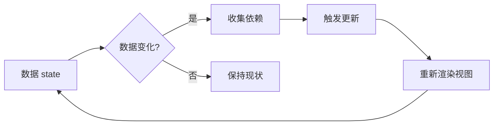
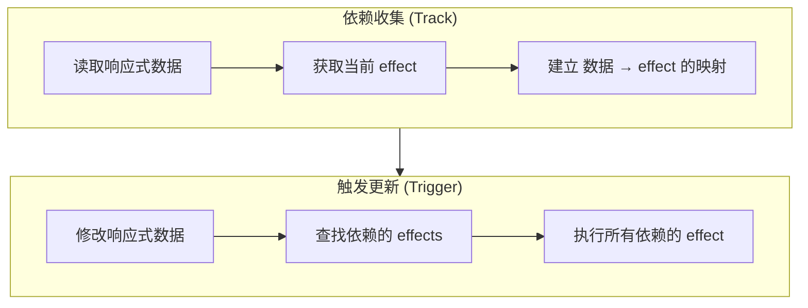

+++
title = "第27章 深入响应式原理"
weight = 270
date = "2026-03-25T12:54:00+08:00"
type = "docs"
description = ""
isCJKLanguage = true
draft = false
+++

# 第二十七章 深入响应式原理

> 面试官："能聊聊 Vue 3 的响应式原理吗？"
> 
> 你："当然是用 Proxy 实现的！"
> 
> 面试官："那具体是怎么实现的？"
> 
> 你："......"
> 
> 如果你也有这种"知道但不理解"的尴尬，那本章就是为你准备的。我们将从 Proxy 出发，深入源码，逐行解析 Vue 3 响应式系统的实现原理。学完本章，你不仅能应对面试官，还能自己手写一个响应式系统。

## 27.1 响应式系统概述

### 27.1.1 什么是响应式

响应式的核心思想是：**数据变化自动触发更新**。



在 Vue 2 中，响应式是通过 `Object.defineProperty` 实现的。而在 Vue 3 中，换成了更强大的 `Proxy`。

### 27.1.2 Vue 3 响应式全家桶

Vue 3 的响应式系统包含多个 API：

| API | 作用 | 使用场景 |
|-----|------|----------|
| `reactive()` | 创建深层响应式对象 | 管理复杂状态 |
| `ref()` | 创建响应式引用 | 处理基本类型 |
| `computed()` | 创建计算属性 | 派生状态 |
| `watch()` | 监听数据变化 | 执行副作用 |
| `watchEffect()` | 立即执行的监听 | 自动追踪依赖 |
| `readonly()` | 创建只读代理 | 防止意外修改 |
| `shallowRef()` | 浅层响应式 | 性能优化 |
| `toRef()` | 转换响应式 | 保持引用 |

## 27.2 Proxy 核心机制

### 27.2.1 Proxy 基础回顾

`Proxy` 是 ES6 引入的元编程特性，它可以拦截并自定义对象的各种操作：

```javascript
// 创建一个 Proxy
const target = { name: '张三', age: 25 }

const proxy = new Proxy(target, {
  // 拦截 get 操作
  get(target, key, receiver) {
    console.log(`读取 ${key}`)
    return Reflect.get(target, key, receiver)
  },
  
  // 拦截 set 操作
  set(target, key, value, receiver) {
    console.log(`设置 ${key} = ${value}`)
    return Reflect.set(target, key, value, receiver)
  },
  
  // 拦截 delete 操作
  deleteProperty(target, key) {
    console.log(`删除 ${key}`)
    return Reflect.deleteProperty(target, key)
  },
  
  // 拦截 has 操作（in 运算符）
  has(target, key) {
    console.log(`检查 ${key} 是否存在`)
    return Reflect.has(target, key)
  },
  
  // 拦截函数调用
  apply(target, thisArg, args) {
    console.log(`调用函数，参数: ${args}`)
    return Reflect.apply(target, thisArg, args)
  },
  
  // 拦截 new 操作符
  construct(target, args, newTarget) {
    console.log(`使用 new 创建实例`)
    return Reflect.construct(target, args, newTarget)
  },
})

// 测试
console.log(proxy.name)        // 触发 get，输出 "读取 name"
proxy.age = 30                 // 触发 set，输出 "设置 age = 30"
delete proxy.name              // 触发 deleteProperty，输出 "删除 name"
console.log('name' in proxy)   // 触发 has，输出 "检查 name 是否存在"
```

### 27.2.2 Vue 3 中的 Proxy 实现

```javascript
// 简化版的 Vue 3 响应式系统
function reactive(obj) {
  return new Proxy(obj, {
    get(target, key, receiver) {
      // 收集依赖
      track(target, key)
      return Reflect.get(target, key, receiver)
    },
    
    set(target, key, value, receiver) {
      const oldValue = target[key]
      const result = Reflect.set(target, key, value, receiver)
      
      // 只有值真的变了才触发更新
      if (oldValue !== value) {
        // 触发更新
        trigger(target, key, value, oldValue)
      }
      
      return result
    },
    
    deleteProperty(target, key) {
      const oldValue = target[key]
      const result = Reflect.deleteProperty(target, key)
      
      if (result) {
        // 触发更新
        trigger(target, key, undefined, oldValue)
      }
      
      return result
    },
  })
}

// 依赖收集（理解原理的关键！）
// 当 Vue 的模板渲染时，会执行类似这样的代码：
// const name = user.name  // 读取 user.name
// 这行代码触发了 reactive proxy 的 get 操作，track 函数就会在此时被调用
// 它把"当前正在执行的渲染函数"记录下来——"嘿，模板依赖了 user.name"
// 这个"记录"存在一个全局的 WeakMap 里：targetMap = { user => { name => [effect1, effect2] } }
function track(target, key) {
  // activeEffect 是 Vue 设置的一个全局变量，表示"当前正在执行的副作用"
  // 在模板渲染时，Vue 会先把 activeEffect 设置为渲染函数，然后执行模板
  // 所以当 get 被触发时，track 就能知道"哪个 effect 依赖了这个属性"
  if (activeEffect) {
    // 在 targetMap 里建立映射：target -> key -> [effects]
    // 这样，当 user.name 变化时，Vue 就知道该通知哪些 effect
    const depsMap = targetMap.get(target)
    if (!depsMap) {
      targetMap.set(target, (depsMap = new Map()))
    }
    let deps = depsMap.get(key)
    if (!deps) {
      depsMap.set(key, (deps = new Set()))
    }
    deps.add(activeEffect)
  }
}

// 触发更新（当响应式数据变化时调用）
// 比如：user.name = '小红' 这行代码触发了 proxy 的 set 操作
// set 操作里调用 trigger(user, 'name', '小红', '小明')
// trigger 会去 targetMap 里找"有哪些 effect 依赖了 user.name"
// 然后依次执行这些 effect（重新渲染组件/重新计算 computed）
function trigger(target, key, value, oldValue) {
  const depsMap = targetMap.get(target)
  if (!depsMap) return

  const effects = depsMap.get(key)
  if (effects) {
    // 依次执行所有依赖这个属性的 effect
    effects.forEach(effect => effect())
  }
}
```

### 27.2.3 Reflect 的作用

为什么要用 `Reflect` 而不是直接操作 target？

```javascript
// 原因一：保持 this 指向正确
const parent = {
  name: 'parent',
  getGreeting() {
    return `Hello, I'm ${this.name}`
  }
}

const child = {
  name: 'child'
}

// 直接调用，this 指向 parent
console.log(parent.getGreeting()) // "Hello, I'm parent"

// 使用 Reflect，this 指向 child
const boundMethod = Reflect.get(parent, 'getGreeting', child)
console.log(boundMethod()) // "Hello, I'm child"

// 原因二：操作结果更明确
// Object.defineProperty 在严格模式下设置失败会抛异常
// Reflect.set 返回布尔值表示是否成功，更安全

// 原因三：函数式 API 更统一
// Reflect 提供了统一的操作对象的方法
// - Reflect.get(target, key, receiver)
// - Reflect.set(target, key, value, receiver)
// - Reflect.has(target, key)
// - Reflect.deleteProperty(target, key)
// 等等，API 更一致
```

## 27.3 依赖收集与触发

### 27.3.1 概念解析

依赖收集（Track）和触发更新（Trigger）是响应式系统的两大核心：



### 27.3.2 依赖收集详解

```javascript
// 依赖收集的核心数据结构
// targetMap: WeakMap<target, Map<key, Set<effect>>>
// - target 是原始对象
// - key 是对象的属性名
// - effect 是依赖于这个属性的副作用函数

let targetMap = new WeakMap()

// effect 栈，用来实现嵌套 effect
let effectStack = []

// 当前正在执行的 effect
function getActiveEffect() {
  return effectStack[effectStack.length - 1]
}

// track 函数 - 收集依赖
function track(target, key) {
  const effect = getActiveEffect()
  if (!effect) return // 没有正在执行的 effect，不收集
  
  let depsMap = targetMap.get(target)
  if (!depsMap) {
    depsMap = new Map()
    targetMap.set(target, depsMap)
  }
  
  let dep = depsMap.get(key)
  if (!dep) {
    dep = new Set()
    depsMap.set(key, dep)
  }
  
  // 将当前 effect 添加到 dep 中
  // 这样当 target[key] 变化时，就知道要触发哪些 effect
  dep.add(effect)
  
  // 同时维护 effect.deps 数组，用于清理
  effect.deps.push(dep)
}

// trigger 函数 - 触发更新
function trigger(target, key, newValue, oldValue) {
  const depsMap = targetMap.get(target)
  if (!depsMap) return
  
  const dep = depsMap.get(key)
  if (!dep) return
  
  // 执行所有依赖这个属性的 effect
  dep.forEach(effect => {
    // 如果 effect 还在栈中（正在执行），不重复执行
    if (!effectStack.includes(effect)) {
      effect.run()
    }
  })
}
```

### 27.3.3 effect 的实现

```javascript
// 简单的 effect 实现
class ReactiveEffect {
  constructor(fn) {
    this.fn = fn
    this.deps = [] // 存储这个 effect 依赖的所有 dep
  }
  
  run() {
    // 每次执行 fn 之前，将自己设为 activeEffect
    // 这样在 fn 中读取响应式数据时，就会调用 track
    try {
      activeEffect = this
      effectStack.push(this)
      return this.fn()
    } finally {
      effectStack.pop()
      activeEffect = getActiveEffect()
    }
  }
}

// watchEffect 的简化实现
function watchEffect(effect) {
  const reactiveEffect = new ReactiveEffect(effect)
  reactiveEffect.run() // 立即执行一次
}

// 使用示例
const state = reactive({ count: 0 })

watchEffect(() => {
  console.log('count changed:', state.count)
  // 这里读取了 state.count
  // 所以这个 effect 依赖于 state.count
})

state.count++ // 触发更新，effect 重新执行
```

## 27.4 响应式源码解析

### 27.4.1 reactive 的实现

```typescript
// packages/reactivity/src/reactive.ts

// 可被代理的对象类型标记
const enum TargetType {
  INVALID = 0,      // 无效对象
  COMMON = 1,       // 普通对象
  COLLECTION = 2,   // 集合对象（Map, Set, WeakMap, WeakSet）
}

function getTargetType(value: unknown): TargetType {
  // 如果对象被标记为原始值（不可代理），返回 INVALID
  if (!isReadonly(value)) {
    if (isPlainObject(value) || isArray(value)) {
      return TargetType.COMMON
    }
    // 集合类型使用不同的代理策略
    if (isCollectionType(value)) {
      return TargetType.COLLECTION
    }
  }
  return TargetType.INVALID
}

// isPlainObject: 判断是否是普通对象（{} 或 new Object()）
function isPlainObject(value: unknown): value is object {
  if (isArray(value) || isCollectionType(value)) {
    return false
  }
  return Object.prototype.toString.call(value) === '[object Object]'
}

// isCollectionType: 判断是否是集合类型
function isCollectionType(value: unknown): boolean {
  const type = Object.prototype.toString.call(value)
  return type === '[object Map]' ||
         type === '[object Set]' ||
         type === '[object WeakMap]' ||
         type === '[object WeakSet]'
}

// reactive 函数
export function reactive<T extends object>(target: T): T {
  // 如果目标已经是 readonly 的 reactive，直接返回
  if (isReadonly(target)) {
    return target as T
  }
  
  // 调用 createReactiveObject 创建代理
  return createReactiveObject(
    target,
    false, // isReadonly
    false, // isShallow
    baseHandlers, // 普通对象的代理处理器
    collectionHandlers // 集合对象的代理处理器
  )
}

// 创建响应式代理的核心函数
function createReactiveObject(
  target: object,
  isReadonly: boolean,
  isShallow: boolean,
  baseHandlers: ProxyHandler<object>,
  collectionHandlers: ProxyHandler<object>
) {
  // 如果目标对象已经是响应式的，直接返回（避免重复代理）
  if (isReactive(target)) {
    return target as any
  }
  
  // 检查目标对象是否可以被代理
  // 一些特殊对象如 Date、RegExp 不能被正确代理
  if (!isValidProxyTarget(target)) {
    console.warn(`value cannot be made reactive: ${target}`)
    return target as any
  }
  
  // 根据目标类型选择处理器
  // 集合类型（Map, Set）使用特殊的处理器
  const proxyTargets = 
    Object.prototype.toString.call(target) === '[object Object]'
      ? baseHandlers
      : collectionHandlers
  
  // 创建并返回 Proxy
  return new Proxy(target, proxyTargets)
}

// baseHandlers - 普通对象的代理处理器
export const baseHandlers: ProxyHandler<object> = {
  get(target, key, receiver) {
    // 如果读取的是 __v_isRef （在 reactive 中访问 ref 的值）
    // 不建立依赖收集
    const res = Reflect.get(target, key, receiver)
    
    // 收集依赖
    track(target, key)
    
    // 如果是浅层响应式，直接返回结果
    if (isShallow(key)) {
      return res
    }
    
    // 如果是对象，递归包装为响应式
    if (isObject(res)) {
      return isReadonly
        ? // 深只读
          readonly(res)
        : // 深层响应式
          reactive(res)
    }
    
    return res
  },
  
  set(target, key, value, receiver) {
    const oldValue = target[key]
    
    // 判断是新增还是修改
    const hadKey = isArray(target)
      ? Number(key) < target.length
      : hasOwn(target, key)
    
    const result = Reflect.set(target, key, value, receiver)
    
    // 触发更新
    if (!hadKey) {
      trigger(target, 'add', value)
    } else if (hasChanged(value, oldValue)) {
      trigger(target, 'set', value, oldValue)
    }
    
    return result
  },
  
  deleteProperty(target, key) {
    const hadKey = hasOwn(target, key)
    const oldValue = target[key]
    const result = Reflect.deleteProperty(target, key)
    
    if (hadKey) {
      trigger(target, 'delete', undefined, oldValue)
    }
    
    return result
  },
  
  has(target, key) {
    const result = Reflect.has(target, key)
    track(target, key)
    return result
  },
  
  ownKeys(target) {
    // 遍历数组或对象的 key 时调用
    // 需要处理数组的 length 依赖
    track(target, isArray(target) ? 'length' : ITERATE_KEY)
    return Reflect.ownKeys(target)
  },
}
```

### 27.4.2 ref 的实现

```typescript
// packages/reactivity/src/ref.ts

// ref 的数据结构
class RefImpl<T> {
  private _value: T
  private _rawValue: T // 原始值，用于比较是否真的变了
  
  public dep?: Set<ReactiveEffect>
  public readonly __v_isRef = true
  
  constructor(value: T, public readonly _shallow = false) {
    // 保存原始值
    this._rawValue = value
    // 如果是对象，递归转为响应式
    this._value = _shallow ? value : toReactive(value)
  }
  
  get value() {
    // 收集依赖
    trackRefValue(this)
    return this._value
  }
  
  set value(newValue) {
    // 如果值真的变了才触发更新
    if (hasChanged(newValue, this._rawValue)) {
      this._rawValue = newValue
      this._value = this._shallow ? newValue : toReactive(newValue)
      // 触发更新
      triggerRefValue(this, newValue)
    }
  }
}

// 创建 ref
export function ref<T>(value: T): Ref<T> {
  return new RefImpl(value)
}

// ref 的依赖收集
function trackRefValue(ref: RefImpl<any>) {
  if (canTrack()) {
    // ref 依赖的是 dep，而不是 targetMap
    // 这和 reactive 不同
    track(ref, 'value' as any)
  }
}

// ref 的触发更新
function triggerRefValue(ref: RefImpl<any>, newValue?: any) {
  const dep = ref.dep
  if (dep) {
    dep.forEach(effect => {
      effect.run()
    })
  }
}

// reactive 对象中的 ref 自动解包
// 发生在 baseHandlers 的 get 中
// 当访问 reactive 对象的某个属性返回的是 ref 时
// 会自动调用 ref.value
```

### 27.4.3 computed 的实现

```typescript
// packages/reactivity/src/computed.ts

class ComputedRefImpl<T> {
  private _value!: T
  private _dirty = true // 脏标记，表示需要重新计算
  private effect: ReactiveEffect<T>
  
  public dep?: Set<ReactiveEffect>
  public readonly __v_isRef = true
  public readonly __v_isReadonly: boolean
  
  constructor(
    getter: ComputedGetter<T>,
    private _setter: ComputedSetter<T>,
    isReadonly: boolean
  ) {
    this._dirty = true
    this.effect = new ReactiveEffect(getter, () => {
      // scheduler：当依赖变化时，只标记为脏，不立即重新计算
      if (!this._dirty) {
        this._dirty = true
        triggerRefValue(this)
      }
    })
    this.__v_isReadonly = isReadonly
  }
  
  get value() {
    // 收集依赖
    trackRefValue(this)
    
    // 如果是脏的（依赖变化了），重新计算
    if (this._dirty) {
      this._dirty = false
      this._value = this.effect.run()!
    }
    
    return this._value
  }
  
  set value(newValue: T) {
    this._setter(newValue)
  }
}

// 创建 computed
export function computed<T>(
  getter: ComputedGetter<T>,
  options?: { 
    get?: ComputedGetter<T>
    set?: ComputedSetter<T>
  }
): ComputedRef<T> {
  let getter: ComputedGetter<T>
  let setter: ComputedSetter<T>
  
  // 处理不同的参数形式
  if (isFunction(getter)) {
    // 只有 getter 的只读 computed
    getter = options.get!
    setter = NOOP
  } else {
    // 有 getter 和 setter 的可写 computed
    getter = options.get
    setter = options.set
  }
  
  return new ComputedRefImpl(getter, setter, !!options?.only)
}

// computed 的关键优化点
// 1. 惰性求值：只在访问 value 时才计算
// 2. 缓存：依赖不变时，直接返回缓存的结果
// 3. 懒更新：依赖变化时只标记脏，不立即重新计算
```

### 27.4.4 watch 的实现

```typescript
// packages reactivity/src/apiWatch.ts

// watch 的实现
export function watch<T>(
  source: any,
  cb: WatchCallback<T>,
  options?: WatchOptions
): WatchStopHandle {
  return doWatch(source, cb, options)
}

function doWatch(
  source: any,
  cb: WatchCallback | undefined,
  { immediate, deep, flush, onTrack, onTrigger }: WatchOptions = {}
): WatchStopHandle {
  // 获取响应式的 getter
  let getter: () => any
  
  if (isFunction(source)) {
    // watch(() => state.count, ...)
    getter = source
  } else if (isRef(source)) {
    // watch(ref, ...)
    getter = () => source.value
  } else if (isReactive(source)) {
    // watch(reactiveObj, ...)
    getter = () => source
    deep = true // 深度监听
  } else {
    // 可能是多个源
    getter = () => source.map(s => {
      if (isRef(s)) return s.value
      if (isReactive(s)) return source
      if (isFunction(s)) return s()
    })
  }
  
  // 旧值（第一次是 undefined）
  let oldValue = {}
  
  // 清理函数
  let cleanup: () => void
  
  // 回调函数
  const job = () => {
    // 如果清理函数被调用（比如组件卸载），不执行回调
    if (cleanup) {
      cleanup()
    }
    
    // 获取新值
    const newValue = effect.run()
    
    // 调用回调
    if (cb) {
      cleanup = cb(newValue, oldValue, onCleanup => {
        // 用户可以通过 onCleanup 注册清理函数
        cleanup = onCleanup
      })
    }
    
    // 更新旧值
    oldValue = newValue
  }
  
  // 创建 effect
  const effect = new ReactiveEffect(getter, job)
  
  // 立即执行一次（如果设置了 immediate）
  if (immediate) {
    job()
  } else {
    oldValue = effect.run()
  }
  
  // 返回停止函数
  return () => {
    effect.stop()
  }
}

// watch 和 watchEffect 的区别
// watch:
//   - 懒执行：默认不立即执行
//   - 明确指定要监听的数据源
//   - 可以访问新旧值
//   - 可以暂停监听
// 
// watchEffect:
//   - 立即执行：setup 时立即执行一次
//   - 自动收集依赖：不需要指定数据源
//   - 不能访问旧值
//   - 适合简单的副作用
```

## 27.5 高级特性

### 27.5.1 readonly - 只读响应式

```typescript
// 创建只读代理
const state = reactive({ count: 0 })
const readonlyState = readonly(state)

// 读取正常
console.log(readonlyState.count) // 0

// 修改会报警告
readonlyState.count = 1 // Vue 3 会发出警告："Set operation on key 'count' failed: target is readonly"

// 实现原理
export const readonlyHandlers: ProxyHandler<object> = {
  get(target, key, receiver) {
    const res = Reflect.get(target, key, receiver)
    track(target, key)
    return isObject(res) ? readonly(res) : res
  },
  
  set(target, key, value, receiver) {
    // 发出警告
    console.warn(`Set operation on key '${String(key)}' failed: target is readonly.`)
    return true // 返回 true 表示设置成功（但实际上没设置）
  },
  
  deleteProperty(target, key) {
    console.warn(`Delete operation on key '${String(key)}' failed: target is readonly.`)
    return true
  },
}

// 使用场景
// 1. 传递给子组件的 props
// 2. 暴露给外部的状态
// 3. 配置对象
```

### 27.5.2 shallowReactive - 浅层响应式

```typescript
// shallowReactive: 只有第一层是响应式的
const state = shallowReactive({
  count: 0,
  deep: {
    nested: {
      value: 1
    }
  }
})

state.count = 1        // 响应式更新
state.deep.nested.value = 2  // ❌ 不是响应式的（不会触发更新）

// 实现：get 时不递归转换
export const shallowReactiveHandlers = {
  get(target, key, receiver) {
    const res = Reflect.get(target, key, receiver)
    track(target, key)
    // 不递归包装
    return res
  },
  // ... 其他和 baseHandlers 一样
}

// 使用场景
// 1. 大数据对象的优化（不需要深层响应式）
// 2. 外部库集成（外部对象不需要 Vue 管理）
// 3. 只想让某些顶层属性响应式
```

### 27.5.3 markRaw - 跳过响应式

```typescript
// markRaw: 标记一个对象，使其永远不会被转为响应式
const plainObject = { count: 0 }
const markedRaw = markRaw(plainObject)

const state = reactive({
  list: [markedRaw] // 嵌套在 reactive 中
})

state.list[0].count = 1
// 修改不会触发更新，因为 plainObject 没有被代理

// 实现：使用 Symbol 标记
const isRaw = Symbol('isRaw')
const rawMap = new WeakMap<object, boolean>()

export function markRaw<T extends object>(value: T): T {
  if (Object.isExtensible(value)) {
    rawMap.set(value, true)
  }
  return value
}

// 在 reactive 中检查
function isRaw(object: unknown): boolean {
  return !!(object && (object as any)[isRaw] === true)
}

export function isReactive(value: unknown): boolean {
  if (isReadonly(value)) {
    return isReactive(value as any)
  }
  return !!(value && (value as Target)[ReactiveFlags.IS_REACTIVE])
}
```

### 27.5.4 toRef 和 toRefs - 保持响应式引用

```typescript
// toRef: 将响应式对象的某个属性转为 ref
const state = reactive({ count: 0, name: '张三' })

// 普通的解构会丢失响应式
// const { count } = state // count 不是响应式的！

// 使用 toRef 保持响应式
const countRef = toRef(state, 'count')
console.log(countRef.value) // 0

state.count = 1
console.log(countRef.value) // 1，响应式更新

// 修改 ref 也会影响原始对象
countRef.value = 2
console.log(state.count) // 2

// 实现
export function toRef<T extends object, K extends keyof T>(
  object: T,
  key: K
): Ref<T[K]> {
  return new ObjectRefImpl(object, key) as any
}

class ObjectRefImpl<T extends object, K extends keyof T> {
  public readonly __v_isRef = true
  
  constructor(private object: T, private key: K) {}
  
  get value() {
    return this.object[this.key]
  }
  
  set value(val) {
    this.object[this.key] = val
  }
}

// toRefs: 将整个响应式对象转为普通对象（每个属性都是 ref）
const state = reactive({ count: 0, name: '张三' })
const refs = toRefs(state)
// refs: { count: Ref<number>, name: Ref<string> }

const { count, name } = toRefs(state)
// count 和 name 都是响应式的 ref

// 实现
export function toRefs<T extends object>(object: T): { [K in keyof T]: Ref<T[K]> } {
  const ret: any = isArray(object) ? new Array(object.length) : {}
  
  for (const key in object) {
    ret[key] = toRef(object, key as any)
  }
  
  return ret
}

// 使用场景
// 1. 从组合式函数返回响应式对象时
// 2. 解构 reactive 对象时保持响应式
// 3. 传递给普通函数时保持响应式
```

## 27.6 常见问题与解决方案

### 27.6.1 数组的响应式问题

```typescript
// 问题一：直接通过索引设置数组项
const arr = reactive([1, 2, 3])

// ❌ 不会触发更新（Vue 2 遗留问题在 Vue 3 中已修复）
arr[0] = 10

// ✅ Vue 3 中直接通过索引设置是响应式的
arr[0] = 10 // 触发更新 ✓

// ✅ 但 splice 等方法更可靠
arr.splice(0, 1, 10)

// 问题二：数组长度变化
const arr = reactive([1, 2, 3])

arr.length = 1 // 截断数组，会触发更新 ✓

arr[5] = 6 // 扩展数组，会触发更新 ✓

// 问题三：数组方法与响应式
const arr = reactive([1, 2, 3])

// 以下方法会自动触发更新
arr.push(4)      // ✓
arr.pop()         // ✓
arr.shift()       // ✓
arr.unshift(0)    // ✓
arr.splice(1, 1)  // ✓
arr.sort()        // ✓
arr.reverse()     // ✓

// 问题四：替换数组
// 替换整个数组会创建新引用
const arr = reactive([1, 2, 3])

// ❌ 这样不会触发更新
arr = reactive([4, 5, 6])

// ✅ 应该使用数组方法返回新数组
arr.splice(0, arr.length, 4, 5, 6)
// 或
Object.assign(arr, [4, 5, 6])
```

### 27.6.2 Map 和 Set 的响应式

```typescript
// Vue 3 中 Map 和 Set 的响应式实现比较特殊

const map = reactive(new Map([['a', 1], ['b', 2]]))

// 读取
map.get('a') // 自动 track

// 设置
map.set('c', 3) // 触发更新 ✓

// 删除
map.delete('a') // 触发更新 ✓

// 检查
map.has('a') // 自动 track

// 遍历
map.forEach((value, key) => {
  // 访问 value 和 key 都会 track
})

// for...of
for (const [key, value] of map) {
  // 同样会被 track
}

// 注意：通过 for...in 遍历 Map.entries() 不会建立依赖
// 因为 Map 不是普通对象

// Set 类似
const set = reactive(new Set([1, 2, 3]))

set.add(4) // 触发更新
set.delete(1) // 触发更新
set.has(2) // 自动 track

// 注意：Set.add 返回的是 Set 本身
// Vue 3 的响应式 Set 会拦截这个返回值
```

### 27.6.3 循环引用的处理

```typescript
// 循环引用可能导致无限递归

const obj = reactive({ name: 'test' })
obj.self = obj // obj.self 指向自己

// 访问 obj.self.name 会怎样？
// Vue 3 通过以下方式处理：

// 1. 维护一个 "正在追踪" 的 Set
let currentlyTracking = new Set()

// 2. 访问时检查
function get(target, key, receiver) {
  // 如果已经在追踪中，返回原值
  if (currentlyTracking.has(target)) {
    return Reflect.get(target, key, receiver)
  }
  
  // 开始追踪
  currentlyTracking.add(target)
  track(target, key)
  currentlyTracking.delete(target)
  
  // ...
}

// 3. 设置时也检查
function set(target, key, value, receiver) {
  // 防止循环赋值导致的无限触发
  
  // 实际源码中通过其他方式处理
}

// 或者使用 isDeep 标记
// 在 reactive 源码中，对象类型会特殊处理
```

### 27.6.4 响应式丢失的场景

```typescript
// 场景一：解构 reactive 对象
const state = reactive({ count: 0, name: '张三' })

// ❌ 丢失响应式
const { count, name } = state
console.log(count) // 0，但不是响应式的

// ✅ 使用 toRefs
const { count, name } = toRefs(state)

// ✅ 或使用 computed
const count = computed(() => state.count)

// 场景二：从函数返回响应式对象
function useState() {
  const state = reactive({ count: 0 })
  return state // 返回的是原始响应式对象
}

// 如果用户解构这个返回值，会丢失响应式
const { count } = useState() // count 不是响应式的

// ✅ 返回 toRefs
function useState() {
  const state = reactive({ count: 0 })
  return toRefs(state)
}

// 场景三：响应式对象传递给普通函数
const state = reactive({ count: 0 })

function increment(obj) {
  obj.count++ // 这里能正常工作
}

// 但如果函数内部创建了新引用
function assign(obj) {
  obj = { count: 100 } // 这不会影响原始的 state
}

// ✅ 使用 ref 可以更安全
const count = ref(0)
function increment(val) {
  val.value++ // 明确是引用
}
```

### 27.6.5 性能优化技巧

```typescript
// 技巧一：使用 shallowRef 减少深层响应式的开销
const largeData = shallowRef({
  // 一个很大的对象，但我们只需要替换整个对象时触发更新
  deep: {
    nested: {
      data: { /* ... */ }
    }
  }
})

// 更新整个深层对象
largeData.value = { deep: { nested: { data: { /* new data */ } } } }
// 这样只触发一次更新，而不是遍历所有深层属性

// 技巧二：使用 markRaw 跳过不需要响应式的部分
const state = reactive({
  items: markRaw(externalLibraryData) // 外部数据不需要响应式
})

// 技巧三：使用 readonly 保护不应被修改的状态
function useConfig() {
  const config = reactive({
    apiUrl: 'https://api.example.com',
    timeout: 5000,
  })
  
  return readonly(config) // 暴露给外部，但不允许修改
}

// 技巧四：合理使用 watch vs watchEffect
// watchEffect 自动追踪依赖，适合简单的副作用
// watch 明确指定依赖，适合有条件地监听或访问旧值
watch(
  () => state.count,
  (newVal, oldVal) => {
    // 只在 count 变化时执行
    console.log(`count 从 ${oldVal} 变为 ${newVal}`)
  }
)

// 技巧五：避免在 computed 中修改响应式状态
const doubled = computed(() => {
  // ❌ 不要这样做！
  // state.count++ // 会导致无限循环
  return state.count * 2
})
```

## 27.7 手写一个响应式系统

作为本章的实战环节，让我们从头手写一个简单的响应式系统：

```typescript
// reactive-system.ts

// ==================== 核心类型 ====================

type Effect = () => void
type WeakMapTarget = WeakMap<object, Map<string | symbol, Set<Effect>>>
type Trackable = object | any[]

// ==================== 全局变量 ====================

// 全局存储：target -> key -> effects
const targetMap: WeakMapTarget = new WeakMap()

// 当前正在执行的 effect
let activeEffect: Effect | null = null

// ==================== 依赖收集 ====================

function track(target: Trackable, key: string | symbol): void {
  if (!activeEffect) return
  
  let depsMap = targetMap.get(target)
  if (!depsMap) {
    depsMap = new Map()
    targetMap.set(target, depsMap)
  }
  
  let dep = depsMap.get(key)
  if (!dep) {
    dep = new Set()
    depsMap.set(key, dep)
  }
  
  dep.add(activeEffect)
}

function trigger(
  target: Trackable, 
  key: string | symbol, 
  newValue?: any, 
  oldValue?: any
): void {
  const depsMap = targetMap.get(target)
  if (!depsMap) return
  
  const dep = depsMap.get(key)
  if (!dep) return
  
  dep.forEach(effect => {
    effect()
  })
}

// ==================== 创建响应式对象 ====================

function reactive<T extends object>(target: T): T {
  return new Proxy(target, {
    get(target, key, receiver) {
      const result = Reflect.get(target, key, receiver)
      track(target, key)
      
      // 如果是对象，递归包装
      if (typeof result === 'object' && result !== null) {
        return reactive(result)
      }
      
      return result
    },
    
    set(target, key, value, receiver) {
      const oldValue = Reflect.get(target, key, receiver)
      const result = Reflect.set(target, key, value, receiver)
      
      // 只有真的变了才触发
      if (oldValue !== value) {
        trigger(target, key, value, oldValue)
      }
      
      return result
    },
    
    deleteProperty(target, key) {
      const oldValue = Reflect.get(target, key)
      const result = Reflect.deleteProperty(target, key)
      
      if (result) {
        trigger(target, key, undefined, oldValue)
      }
      
      return result
    },
  })
}

// ==================== 创建 ref ====================

class RefImpl<T> {
  private _value: T
  deps: Set<Effect> = new Set()
  __v_isRef = true
  
  constructor(value: T) {
    this._value = value
  }
  
  get value() {
    trackRef(this)
    return this._value
  }
  
  set value(newValue: T) {
    if (this._value !== newValue) {
      this._value = newValue
      triggerRef(this)
    }
  }
}

function ref<T>(value: T): RefImpl<T> {
  return new RefImpl(value)
}

function trackRef(ref: RefImpl<any>): void {
  if (activeEffect) {
    ref.deps.add(activeEffect)
  }
}

function triggerRef(ref: RefImpl<any>): void {
  ref.deps.forEach(effect => effect())
}

// ==================== 创建 computed ====================

class ComputedRefImpl<T> {
  private _value!: T
  private _dirty = true
  private _effect: Effect
  
  deps: Set<Effect> = new Set()
  __v_isRef = true
  
  constructor(getter: () => T) {
    this._effect = () => {
      this._dirty = true
      triggerRef(this)
    }
  }
  
  get value(): T {
    trackRef(this)
    
    if (this._dirty) {
      this._dirty = false
      this._value = (activeEffect as any)()
    }
    
    return this._value
  }
}

function computed<T>(getter: () => T): ComputedRefImpl<T> {
  return new ComputedRefImpl(getter)
}

// ==================== 创建 watchEffect ====================

function watchEffect(effect: Effect): void {
  activeEffect = effect
  effect()
  activeEffect = null
}

// ==================== 使用示例 ====================

// 测试
const state = reactive({
  count: 0,
  name: '张三',
})

watchEffect(() => {
  console.log(`状态变化: count = ${state.count}, name = ${state.name}`)
})

state.count++ // 打印: "状态变化: count = 1, name = 张三"
state.name = '李四' // 打印: "状态变化: count = 1, name = 李四"
state.count++ // 打印: "状态变化: count = 2, name = 李四"

// ref 测试
const countRef = ref(0)
watchEffect(() => {
  console.log(`ref 变化: ${countRef.value}`)
})
countRef.value++ // 打印: "ref 变化: 1"

// computed 测试
const doubleCount = computed(() => state.count * 2)
watchEffect(() => {
  console.log(`doubleCount: ${doubleCount.value}`)
})
state.count++ // 打印: "doubleCount: 4" (因为 count 变成 2，double 是 4)
```

## 27.8 本章小结

本章我们深入探索了 Vue 3 的响应式系统：

1. **Proxy 核心机制**：了解了 Proxy 的各种拦截器，以及 Vue 3 如何利用它们实现响应式
2. **依赖收集与触发**：明白了 track 和 trigger 的工作原理
3. **源码解析**：阅读了 reactive、ref、computed、watch 的核心实现
4. **高级特性**：掌握了 readonly、shallowReactive、markRaw、toRef 等工具
5. **常见问题**：解决了数组、Map/Set、循环引用等边界情况
6. **手写响应式**：从零实现了一个简单的响应式系统

响应式是 Vue 3 最核心的特性，理解它的工作原理不仅能帮助我们更好地使用 Vue，还能提升我们对 JavaScript 语言本身的理解。

下一章，我们将继续深入，探讨虚拟 DOM 的实现原理。🚀
