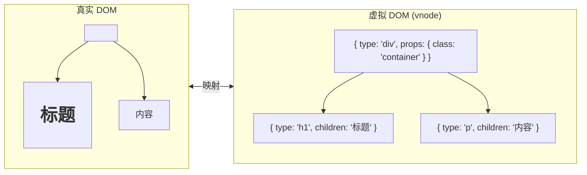
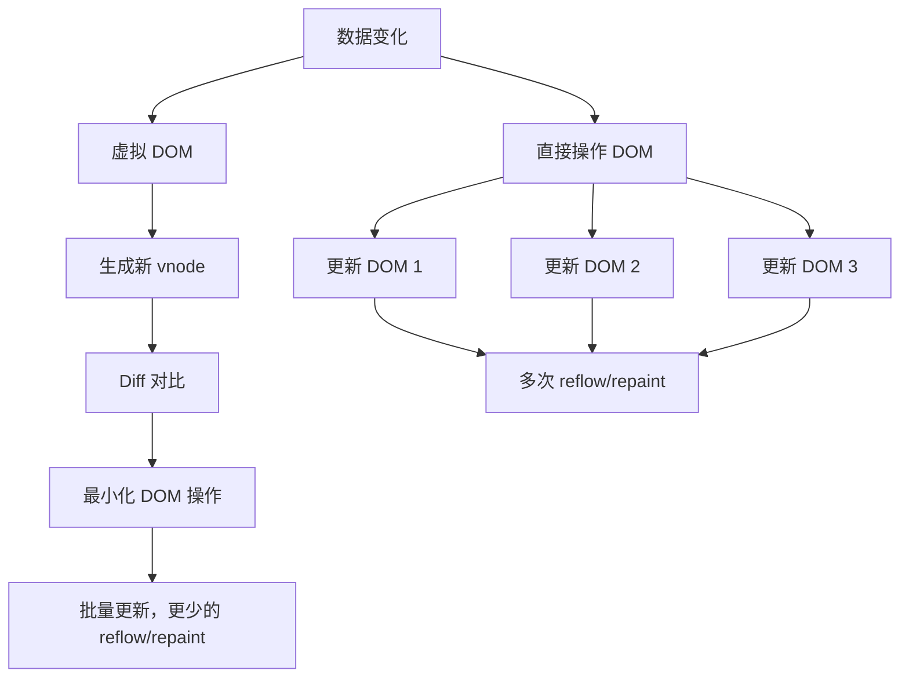
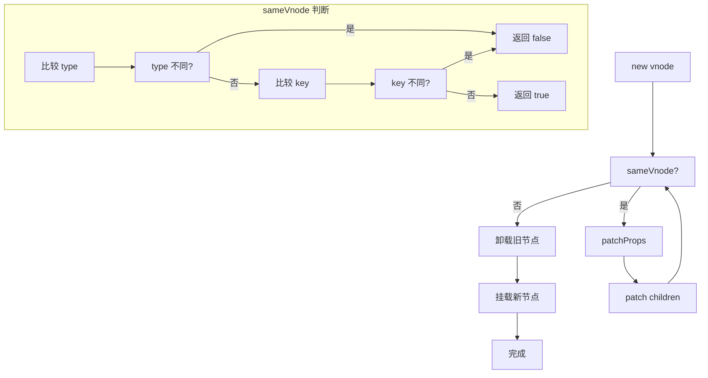
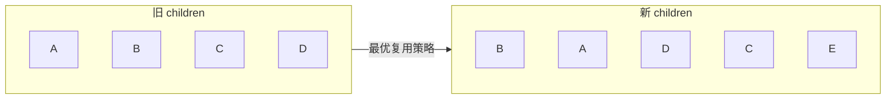
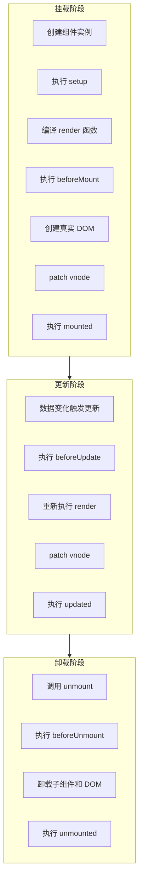

+++
title = "第28章 虚拟 DOM 原理"
weight = 280
date = "2026-03-25T12:54:00+08:00"
type = "docs"
description = ""
isCJKLanguage = true
draft = false
+++

# 第二十八章 虚拟 DOM 原理

> 虚拟 DOM（vDOM）是 Vue 和 React 等现代前端框架的核心概念之一。它是一种用 JavaScript 对象描述真实 DOM 的技术，可以让框架在内存中高效地计算和更新 DOM。有人说虚拟 DOM 慢，真的是这样吗？本章我们就来揭开它的神秘面纱。

## 28.1 虚拟 DOM 概述

### 28.1.1 什么是虚拟 DOM

虚拟 DOM（Virtual Document Object Model）是用普通的 JavaScript 对象来表示 DOM 结构的一种技术：



```javascript
// 虚拟 DOM 节点（vnode）示例
const vnode = {
  type: 'div',
  props: {
    class: 'container',
    id: 'app',
    onClick: () => console.log('clicked'),
  },
  children: [
    {
      type: 'h1',
      props: {},
      children: 'Hello Virtual DOM',
    },
    {
      type: 'button',
      props: { class: 'btn' },
      children: 'Click me',
    },
  ],
}
```

### 28.1.2 为什么需要虚拟 DOM

直接操作真实 DOM 不是更快吗？让我们分析一下：



| 操作方式 | 优点 | 缺点 |
|----------|------|------|
| 直接操作 DOM | 简单直接 | 容易触发多次 reflow/repaint |
| 虚拟 DOM | 批量更新，最小化操作 | 有额外的 JavaScript 计算开销 |

**什么是 reflow 和 repaint？** 这是浏览器渲染引擎的两次重要计算：
- **reflow（回流）**：当元素的**位置或尺寸**发生变化时，浏览器需要重新计算整个页面布局。比如把一个 div 的宽度从 100px 改成 200px，浏览器要重新算所有元素的位置——这是一个非常"贵"的操作。
- **repaint（重绘）**：当元素的**外观**变化但不影响布局时（比如改了颜色、背景图），浏览器只需要重新绘制这些像素，比较便宜。

为什么直接操作 DOM 容易触发多次 reflow？因为你可能连续改了 3 次元素的样式，每次改都会触发一次 reflow。如果用虚拟 DOM，Vue 会把这 3 次改动"攒起来"，算出最小的变更方案，只触发一次 reflow。

### 28.1.3 Vue 3 虚拟 DOM 的优势

Vue 3 对虚拟 DOM 做了大量优化：

- **编译时优化**：静态节点提升，减少比对
- **PatchFlag**：标记动态内容，快速定位
- **缓存事件处理器**：避免不必要的更新
- **Block**：更智能的收集动态节点

## 28.2 vnode 结构解析

### 28.2.1 vnode 的类型

```typescript
// packages/runtime-core/src/vnode.ts

// vnode 类型
export const enum VNodeTypes {
  ELEMENT,     // 普通 HTML 元素
  TEXT,        // 文本节点
  COMMENT,     // 注释节点
  FRAGMENT,    // 片段（多个根节点）
  COMPONENT,   // 组件
  TELEPORT,   // Teleport 组件
  SUSPENSE,   // Suspense 组件
}

// 插槽类型
export const enum SlotsTypes {
  DEFAULT,    // 默认插槽
  NAMED,       // 具名插槽
  CONDITIONAL, // 条件插槽
}

// vnode 的完整结构
interface VNode<
  HostNode = any,
  HostElement = any,
  ExtraProps = any
> {
  // 节点类型
  type: VNodeTypes | string | Component
  
  // DOM 相关
  el: HostNode | null          // 指向真实 DOM 节点
  anchor: HostNode | null      // 用于 Fragment 的定位
  
  // key，用于 diff 算法
  key: string | number | symbol | null
  
  // 节点名称（用于调试）
  name?: string
  
  // 属性
  props: VNodeProps & ExtraProps
  
  // 子节点
  children: VNodeNormalizedChildren
  
  // 组件实例
  component: ComponentInternalInstance | null
  
  // DOM 元素
  target: HostElement | null
  
  // 特效类型
  teleport: TeleportVNode | null
  
  // suspense
  suspense: SuspenseBoundary | null
  
  // 其他
  shapeFlag: number             // 形状标记
  patchFlag: number             // patch 标记
  dirs: VNodeDirs | null        // 指令
  scopeId: string | null
}
```

### 28.2.2 shapeFlag 详解

shapeFlag 是 vnode 的形状标记，用于快速判断 vnode 的特征：

```typescript
// packages/shared/src/shapeFlags.ts

export const enum ShapeFlags {
  // 元素类型
  ELEMENT = 1,                  // 1 << 0 = 1
  TEXT = 1 << 1,               // 2
  COMMENT = 1 << 2,            // 4
  FRAGMENT = 1 << 3,           // 8
  
  // 组件类型
  COMPONENT = 1 << 4,          // 16
  COMPONENT_KEPT_ALIVE = 1 << 5, // 32
  COMPONENT_ON_VISIBLE = 1 << 6, // 64
  
  // 状态
  TELEPORT = 1 << 7,           // 128
  SUSPENSE = 1 << 8,           // 256
  KEEP_ALIVE = 1 << 9,         // 512
  
  // children 类型
  ARRAY_CHILDREN = 1 << 10,    // 1024
  TEXT_CHILDREN = 1 << 11,      // 2048
  SLOTS_CHILDREN = 1 << 12,     // 4096
  TELEPORT_CHILDREN = 1 << 13,  // 8192
  SUSPENSE_CHILDREN = 1 << 14,  // 16384
}

// 使用位运算快速判断
function render(vnode: VNode) {
  // 判断是否是组件
  if (vnode.shapeFlag & ShapeFlags.COMPONENT) {
    // 处理组件
  }
  
  // 判断是否有数组类型的 children
  if (vnode.shapeFlag & ShapeFlags.ARRAY_CHILDREN) {
    // 处理数组 children
  }
  
  // 判断是否是元素且有文本 children
  if (
    (vnode.shapeFlag & ShapeFlags.ELEMENT) &&
    (vnode.shapeFlag & ShapeFlags.TEXT_CHILDREN)
  ) {
    // 处理文本 children
  }
}
```

### 28.2.3 创建一个 vnode

```typescript
// 创建一个 div 元素的 vnode
const vnode = h('div', {
  class: 'container',
  id: 'app',
  onClick: handleClick,
}, [
  h('h1', { class: 'title' }, 'Hello Vue'),
  h('p', 'This is a paragraph'),
])

// h 函数的类型签名
// h 函数是 Vue 中创建 vnode 的核心函数
function h(
  type: string | Component,      // 元素类型或组件
  props?: VNodeProps | null,      // 属性
  children?: VNodeNormalizedChildren // 子节点
): VNode

// 特殊用法
h('div', {
  class: 'wrapper',
  style: { color: 'red' },
  'data-id': '1',                // HTML 属性
  attrs: { title: 'tooltip' },  // attributes
  on: { click: handler },       // 事件
  props: { value: 'test' },     // DOM properties
  // ...
})

// children 的多种写法
h('ul', [
  h('li', 'item 1'),
  h('li', 'item 2'),
  h('li', 'item 3'),
])

// 或者字符串（自动包装为文本节点）
h('p', '这是一段文本')

// 或者数字
h('span', 42)

// 或者混合
h('div', [
  '文字',
  h('strong', '加粗'),
  null, // null 不渲染
  undefined, // undefined 也不渲染
])
```

## 28.3 h 函数详解

### 28.3.1 h 函数的实现

```typescript
// packages/runtime-core/src/h.ts

// 简化版的 h 函数实现
function h(type: any, propsAndChildren: any): VNode {
  // 从参数中分离 props 和 children
  const l = arguments.length
  
  if (l === 2) {
    // h('div', { class: 'container' })
    // h('div', children)
    // h('div', null)
    if (propsAndChildren != null && !isArray(propsAndChildren)) {
      // 如果第二个参数不是数组，它是 props 或 children
      if (isObject(propsAndChildren)) {
        // props
        return createVNode(type, propsAndChildren)
      } else {
        // children（文本或其他原始值）
        return createVNode(type, null, propsAndChildren)
      }
    } else {
      // children 是数组
      return createVNode(type, null, propsAndChildren)
    }
  } else if (l > 2) {
    // h('div', props, child1, child2, ...)
    const props = arguments[1]
    const children = Array.prototype.slice.call(arguments, 2)
    return createVNode(type, props, children)
  }
}

// createVNode 的简化实现
function createVNode(
  type: string | Component,
  props: any,
  children: any
): VNode {
  // 处理 class 和 style（可能传入字符串或数组）
  if (props) {
    // normalizeClass: 统一 class 格式
    // normalizeStyle: 统一 style 格式
  }
  
  // 创建 vnode 对象
  const vnode: VNode = {
    type,
    props,
    children,
    key: props?.key || null,
    // ... 其他属性
  }
  
  // 根据 children 类型设置 shapeFlag
  if (isArray(children)) {
    vnode.shapeFlag |= ShapeFlags.ARRAY_CHILDREN
  } else if (isString(children) || isNumber(children)) {
    vnode.shapeFlag |= ShapeFlags.TEXT_CHILDREN
    children = String(children)
  }
  
  return vnode
}
```

### 28.3.2 动态子节点的处理

```vue
<!-- Vue 3 模板中动态子节点的处理 -->
<template>
  <!-- 静态子节点，提升到渲染函数外部 -->
  <div class="static">
    <h1>静态标题</h1>
    <p>静态内容</p>
  </div>
  
  <!-- 动态子节点 -->
  <div class="dynamic">
    <h1>{{ title }}</h1>
    <p>{{ content }}</p>
  </div>
  
  <!-- 条件渲染 -->
  <div v-if="show">
    <p>条件内容</p>
  </div>
  
  <!-- 列表渲染 -->
  <ul>
    <li v-for="item in items" :key="item.id">
      {{ item.name }}
    </li>
  </ul>
</template>

<!-- 编译后的渲染函数 -->
function render(ctx) {
  // 静态部分在每次渲染时复用
  const _hoisted_1 = h('h1', { class: 'static' }, '静态标题')
  const _hoisted_2 = h('p', '静态内容')
  
  return h('div', [
    // 静态提升
    h('div', { class: 'static' }, [_hoisted_1, _hoisted_2]),
    
    // 动态部分
    h('div', { class: 'dynamic' }, [
      ctx.title,  // 动态插值
      ctx.content,
    ]),
    
    // 条件
    ctx.show
      ? h('div', [h('p', '条件内容')])
      : createCommentVNode('v-if', true),
    
    // 列表
    ctx.items.map(item => 
      h('li', { key: item.id }, item.name)
    ),
  ])
}
```

## 28.4 patch 算法详解

### 28.4.1 patch 的基本流程



### 28.4.2 sameVnode 的判断

```typescript
// packages/runtime-core/src/vnode.ts

function sameVnode(a: VNode, b: VNode): boolean {
  return (
    a.key === b.key &&            // key 必须相同
    a.type === b.type &&          // type 必须相同
    a.shapeFlag === b.shapeFlag   // shapeFlag 应该相同
  )
}

// 简化版
function sameVnode(oldNode, newNode) {
  return oldNode.key === newNode.key &&
         oldNode.type === newNode.type
}

// 对于元素节点，key 和 type 相同就认为是同一节点
// 对于组件节点，还需要比较组件实例
```

### 28.4.3 children diff 算法

Vue 3 采用了更高效的 diff 算法，主要优化点：



```typescript
// packages/runtime-core/src/renderer.ts

// patch children 的核心逻辑
function patchChildren(
  oldNode: VNode,
  newNode: VNode,
  container: HostElement
) {
  const { children: oldChildren } = oldNode
  const { children: newChildren } = newNode
  
  // 几种情况
  // 1. 新 children 是文本
  if (isText(newChildren)) {
    if (!isText(oldChildren)) {
      // 旧 children 不是文本，直接替换
      hostSetElementText(container, newChildren)
    } else {
      // 都是文本，只更新文本
      if (oldChildren !== newChildren) {
        hostSetElementText(container, newChildren)
      }
    }
  } else {
    // 2. 新 children 是数组
    if (isArray(oldChildren)) {
      // 都是数组，使用双端 diff
      patchKeyedChildren(oldChildren, newChildren, container)
    } else {
      // 3. 旧 children 是文本，新 children 是数组
      // 先清空文本，再挂载新 children
      hostSetElementText(container, '')
      mountChildren(newChildren, container)
    }
  }
}

// 双端 diff 算法
function patchKeyedChildren(
  oldChildren: VNode[],
  newChildren: VNode[],
  container: HostElement
) {
  let oldStartIdx = 0
  let oldEndIdx = oldChildren.length - 1
  let newStartIdx = 0
  let newEndIdx = newChildren.length - 1
  
  let oldStartVNode = oldChildren[oldStartIdx]
  let oldEndVNode = oldChildren[oldEndIdx]
  let newStartVNode = newChildren[newStartIdx]
  let newEndVNode = newChildren[newEndIdx]
  
  while (oldStartIdx <= oldEndIdx && newStartIdx <= newEndIdx) {
    if (!oldStartVNode) {
      // 被移动的元素（key 为 undefined 时可能发生）
      oldStartVNode = oldChildren[++oldStartIdx]
    } else if (!oldEndVNode) {
      oldEndVNode = oldChildren[--oldEndIdx]
    } else if (sameVnode(oldStartVNode, newStartVNode)) {
      // 头头相同，patch
      patch(oldStartVNode, newStartVNode)
      oldStartVNode = oldChildren[++oldStartIdx]
      newStartVNode = newChildren[++newStartIdx]
    } else if (sameVnode(oldEndVNode, newEndVNode)) {
      // 尾尾相同，patch
      patch(oldEndVNode, newEndVNode)
      oldEndVNode = oldChildren[--oldEndIdx]
      newEndVNode = newChildren[--newEndIdx]
    } else if (sameVnode(oldStartVNode, newEndVNode)) {
      // 头尾相同，说明 oldStart 移动到了 newEnd 位置
      // 需要移动 DOM 节点
      patch(oldStartVNode, newEndVNode)
      hostInsert(
        oldStartVNode.el!,
        container,
        hostNextSibling(oldEndVNode.el!)!
      )
      oldStartVNode = oldChildren[++oldStartIdx]
      newEndVNode = newChildren[--newEndIdx]
    } else if (sameVnode(oldEndVNode, newStartVNode)) {
      // 尾头相同，说明 oldEnd 移动到了 newStart 位置
      patch(oldEndVNode, newStartVNode)
      hostInsert(
        oldEndVNode.el!,
        container,
        oldStartVNode.el!
      )
      oldEndVNode = oldChildren[--oldEndIdx]
      newStartVNode = newChildren[++newStartIdx]
    } else {
      // 没有匹配，使用 Map 查找
      const keyToOldIndex = new Map()
      for (let i = oldStartIdx; i <= oldEndIdx; i++) {
        const key = oldChildren[i].key
        if (key != null) {
          keyToOldIndex.set(key, i)
        }
      }
      
      // 在旧 children 中找新 children[0]
      const index = keyToOldIndex.get(newStartVNode.key)
      if (index != null) {
        // 找到了，移动到正确位置
        const toMoveNode = oldChildren[index]
        patch(toMoveNode, newStartVNode)
        hostInsert(toMoveNode.el!, container, oldStartVNode.el!)
        oldChildren[index] = undefined as any
      } else {
        // 没找到，是新增节点
        mount(newStartVNode, container, oldStartVNode.el!)
      }
      
      newStartVNode = newChildren[++newStartIdx]
    }
  }
  
  // 处理剩余情况
  if (oldStartIdx > oldEndIdx) {
    // 旧 children 已遍历完，新 children 还有剩余
    // -> 新增
    for (let i = newStartIdx; i <= newEndIdx; i++) {
      mount(newChildren[i], container, oldStartVNode.el)
    }
  } else if (newStartIdx > newEndIdx) {
    // 新 children 已遍历完，旧 children 还有剩余
    // -> 删除
    for (let i = oldStartIdx; i <= oldEndIdx; i++) {
      unmount(oldChildren[i])
    }
  }
}
```

## 28.5 编译优化详解

### 28.5.1 静态节点提升

```vue
<!-- 模板 -->
<template>
  <div>
    <!-- 这个 div 及其子节点是静态的，只创建一次 -->
    <div class="static-content">
      <h1>静态标题</h1>
      <p>静态内容 {{ count }} 次</p>
    </div>
    
    <!-- 动态部分 -->
    <div>{{ dynamicContent }}</div>
  </div>
</template>

<!-- 编译后的 render 函数 -->
function render(ctx) {
  // 静态内容提升到函数外部
  const _hoisted_1 = h('div', { class: 'static-content' }, [
    h('h1', '静态标题'),
    h('p', ['静态内容 ', ctx.count, ' 次']),
  ])
  
  return h('div', [_hoisted_1, ctx.dynamicContent])
}

// _hoisted_1 在组件实例创建时生成一次
// 之后每次渲染都复用这个 vnode
// 只需要 patch 内部可能变化的部分
```

### 28.5.2 PatchFlag（虚拟 DOM 标记）

```vue
<!-- 模板 -->
<div class="container" id="app">
  <span>{{ name }}</span>
  <p>{{ age }}</p>
  <div>{{ address }}</div>
  <span>{{ nickname }}</span>
</div>

<!-- 编译后 -->
const vnode = h('div', {
  class: 'container',
  id: 'app',
}, [
  // PatchFlag 1 = TEXT，表示只有文本内容是动态的
  h('span', { patchFlag: 1 /* TEXT */ }, name),
  h('p', { patchFlag: 1 /* TEXT */ }, age),
  h('div', { patchFlag: 1 /* TEXT */ }, address),
  h('span', { patchFlag: 1 /* TEXT */ }, nickname),
])
```

```typescript
// packages/shared/src/patchFlags.ts

export const enum PatchFlags {
  // 文本内容变化
  TEXT = 1,              // 1 << 0
  
  // class 变化
  CLASS = 1 << 1,        // 2
  
  // style 变化
  STYLE = 1 << 2,       // 4
  
  // props 变化（不包括 class、style、事件）
  PROPS = 1 << 3,        // 8
  
  // 完整 props（包括 class、style）
  FULL_PROPS = 1 << 4,  // 16
  
  // 事件变化
  EVENT = 1 << 5,       // 32
  
  // 需要止血（止血是什么？后面解释）
  NEED_HYDRATION = 1 << 6, // 64
  
  // 顺序变化（stable sequence 或 key）
  KEYED = 1 << 7,        // 128
  
  // 无 key 的顺序变化
  UNKEYED = 1 << 8,      // 256
  
  // 需要创建新的 vnode
  CREATE = 1 << 9,       // 512
  
  // 动态节点（标记为一个 block 的所有动态节点）
  DYNAMIC = 1 << 10,     // 1024
}

// patch 时的优化
function patchElement(oldNode, newNode) {
  const el = oldNode.el
  
  // 只更新动态属性
  if (newNode.patchFlag > 0) {
    if (newNode.patchFlag & PatchFlags.TEXT) {
      // 只更新文本
      el.textContent = newNode.children
    }
    if (newNode.patchFlag & PatchFlags.CLASS) {
      // 只更新 class
      el.className = newNode.props.class
    }
    // ... 其他
  } else {
    // 没有 patchFlag，更新所有属性
    patchProps(oldNode.props, newNode.props, el)
  }
}
```

### 28.5.3 hoistStatic（静态提升）

```vue
<!-- 多个相邻的静态元素 -->
<div>
  <span>静态1</span>
  <span>静态2</span>
  <span>静态3</span>
</div>

<!-- 编译后会合并提升 -->
const _hoisted = [
  h('span', '静态1'),
  h('span', '静态2'),
  h('span', '静态3'),
]

return h('div', _hoisted)
```

### 28.5.4 cacheEventHandler（事件缓存）

```vue
<!-- 多次使用同一个事件处理函数 -->
<template>
  <button @click="handler">按钮1</button>
  <button @click="handler">按钮2</button>
  <button @click="handler">按钮3</button>
</template>

<!-- 编译后 -->
function render(ctx) {
  // 事件处理函数被缓存，不会每次渲染都创建新函数
  const _cache = ctx._cache || (ctx._cache = {})
  
  return h('div', [
    h('button', {
      onClick: _cache[0] || (ctx.handler)
    }, '按钮1'),
    // ...
  ])
}
```

## 28.6 nextTick 原理

### 28.6.1 为什么需要 nextTick

JavaScript 是单线程执行的，DOM 更新是同步的。但是 Vue 为了提高性能，会将多个状态变更合并为一次更新：

```javascript
// 连续的多次修改，只触发一次更新
state.count = 1   // 不立即更新
state.count = 2   // 不立即更新
state.count = 3   // 不立即更新
// DOM 更新的时机？

// 实际执行顺序
state.count = 1
state.count = 2
state.count = 3
// 这里 DOM 才真正更新
```

### 28.6.2 nextTick 的实现

```typescript
// packages/runtime-core/src/scheduler.ts

// 任务队列
const queue: Function[] = []
// 用于去重
const seen = new Set()

// 调度器核心
let isFlushing = false
const p = Promise.resolve()

function nextTick<T>(this: any, fn?: () => T): Promise<T> {
  return fn ? p.then(fn) : p
}

function queueJob(job: () => void) {
  // 去重
  if (!seen.has(job)) {
    seen.add(job)
    queue.push(job)
  }
  
  // 如果当前没有在执行队列，开始执行
  if (!isFlushing) {
    isFlushing = true
    nextTick(flushJobs)
  }
}

function flushJobs() {
  // 清空队列前先排序（保证父组件先于子组件更新）
  queue.sort((a, b) => getId(a) - getId(b))
  
  for (const job of queue) {
    job()
    seen.delete(job)
  }
  
  queue.length = 0
  isFlushing = false
}

// 使用微任务
// Promise.resolve() 创建一个微任务
// 微任务在当前宏任务执行完毕后，下一个宏任务开始前执行
// 这保证了 DOM 在同一批次内所有同步代码执行完后才更新
```

### 28.6.3 nextTick 的使用

```vue
<script setup>
import { ref, nextTick } from 'vue'

const count = ref(0)
const listRef = ref(null)

async function updateList() {
  // 连续修改
  for (let i = 0; i < 100; i++) {
    items.value.push({ id: i, text: `item ${i}` })
  }
  
  // 此时 DOM 还没有更新
  // 如果直接访问 DOM 尺寸，会得到旧值
  
  // 等待 DOM 更新
  await nextTick()
  
  // 现在可以访问更新后的 DOM
  const height = listRef.value.$el.offsetHeight
  console.log(`列表高度: ${height}`)
}
</script>
```

## 28.7 组件实例与生命周期

### 28.7.1 组件实例结构

```typescript
// packages/runtime-core/src/component.ts

interface ComponentInternalInstance {
  // 唯一 ID
  uid: number
  
  // 组件类型
  type: Component
  
  // 父组件
  parent: ComponentInternalInstance | null
  
  // 根组件
  root: ComponentInternalInstance
  
  // props
  props: Record<string, any>
  
  // slots
  slots: Record<string, Function>
  
  // 上下文
  ctx: ComponentRenderProxy
  
  // data
  data: ReactiveScope
  
  // setup 返回值
  setupState: any
  
  // 渲染函数
  render: Function | null
  
  // vnode
  vnode: VNode
  
  // 更新函数
  update: SchedulerJob
  
  // 是否正在卸载
  isUnmounted: boolean
  
  // 是否已卸载
  isMounted: boolean
  
  // 副作用
  effects: ReactiveEffect[]
  
  // provide / inject
  provides: Record<string, any>
  parentProvides: Record<string, any>
  
  // 访问器
  accessCache: Record<string, any>
  renderCache: VNode[]
}
```

### 28.7.2 组件生命周期



```typescript
// 生命周期钩子的执行顺序
// beforeCreate -> setup -> created -> beforeMount -> mounted
// 数据变化: beforeUpdate -> updated
// unmount: beforeUnmount -> unmounted -> unmount

// Vue 3 组合式 API 中的生命周期
import { 
  onMounted, 
  onUpdated, 
  onUnmounted,
  onBeforeMount,
  onBeforeUpdate,
  onBeforeUnmount,
} from 'vue'

export default {
  setup() {
    // 相当于 beforeCreate 和 created
    console.log('setup 执行，此时组件实例已创建')
    
    onBeforeMount(() => {
      console.log('即将挂载，DOM 还未创建')
    })
    
    onMounted(() => {
      console.log('挂载完成，DOM 已创建')
    })
    
    onBeforeUpdate(() => {
      console.log('即将更新，DOM 还未 patch')
    })
    
    onUpdated(() => {
      console.log('更新完成，DOM 已 patch')
    })
    
    onBeforeUnmount(() => {
      console.log('即将卸载')
    })
    
    onUnmounted(() => {
      console.log('卸载完成')
    })
  }
}
```

### 28.7.3 setup 执行流程

```typescript
// packages runtime-core/src/component.ts

function setupComponent(instance: ComponentInternalInstance) {
  // 1. 创建实例
  const instance: ComponentInternalInstance = {
    uid: uid++,
    type,
    props: {},
    slots: {},
    // ...
  }
  
  // 2. 处理 props（如果组件有 props 选项）
  if (type.props) {
    instance.props = type.props
  }
  
  // 3. 处理 slots
  if (type.slots) {
    instance.slots = type.slots
  }
  
  // 4. 调用 setup
  const setupResult = callWithErrorHandling(
    type.setup,
    instance,
    ErrorCodes.SETUP_FUNCTION,
    [createPropsProxy(instance.props), instance.slots]
  )
  
  // 5. 处理 setup 返回值
  handleSetupResult(instance, setupResult)
}

function handleSetupResult(instance, setupResult) {
  if (isFunction(setupResult)) {
    // setup 返回渲染函数
    instance.render = setupResult
  } else if (isObject(setupResult)) {
    // setup 返回响应式状态
    instance.setupState = proxyRefs(setupResult)
  }
  
  // 6. 编译模板或使用 render 函数
  if (!instance.render) {
    instance.render = compile(template, instance)
  }
}
```

## 28.8 本章小结

本章我们深入探讨了 Vue 3 虚拟 DOM 的实现原理：

1. **虚拟 DOM 概述**：了解了什么是虚拟 DOM，以及为什么需要它
2. **vnode 结构**：学习了 vnode 的类型、shapeFlag 和创建方式
3. **h 函数**：掌握了如何创建虚拟节点
4. **patch 算法**：深入理解了 Vue 3 的 diff 算法优化
5. **编译优化**：学习了静态提升、PatchFlag、事件缓存等优化手段
6. **nextTick 原理**：理解了异步更新和微任务队列
7. **组件系统**：了解了组件实例结构和生命周期

虚拟 DOM 是 Vue 性能优秀的关键之一。通过理解它的工作原理，我们可以更好地编写高效的 Vue 应用，也能理解为什么某些写法会触发不必要的更新。

下一章，我们将介绍 Vue 3 的生态系统，包括 Nuxt 3、Electron+Vue、跨平台方案等。🌟
