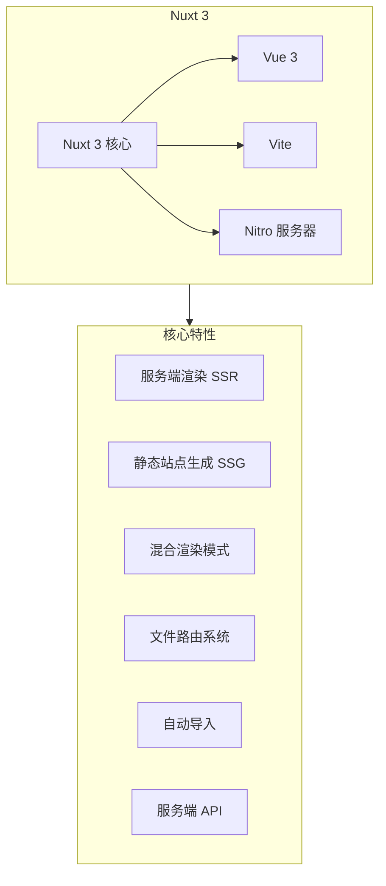
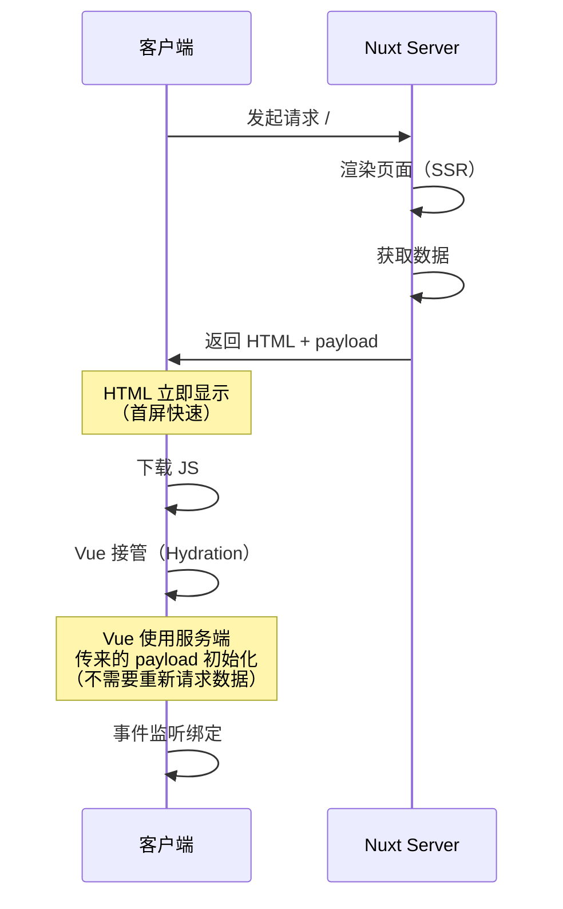
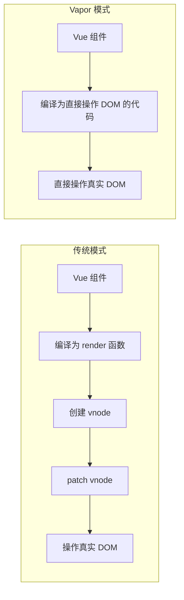
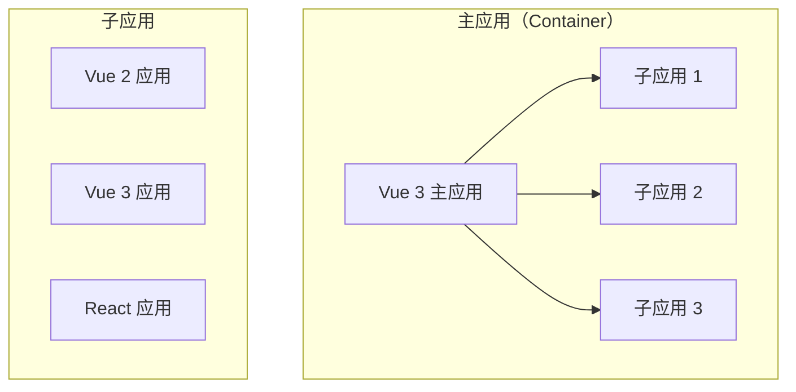

+++
title = "第29章 Vue 3 生态系统"
weight = 290
date = "2026-03-25T12:54:00+08:00"
type = "docs"
description = ""
isCJKLanguage = true
draft = false
+++

# 第二十九章 Vue 3 生态系统

> Vue 3 不仅仅是一个前端框架，它背后还有一个庞大的生态系统。从全栈框架 Nuxt 3 到桌面应用 Electron+Vue，从跨平台开发 uni-app/Taro 到前沿的 Vapor Mode，Vue 的生态越来越丰富。本章我们就来全面了解这些工具，让你在实际项目中选择合适的技术栈。

## 29.1 Nuxt 3 - Vue 的全栈框架

### 29.1.1 Nuxt 3 简介

Nuxt 3 是 Vue 3 的全栈框架，它带来了：



### 29.1.2 SSR 与 SSG

```typescript
// nuxt.config.ts
export default defineNuxtConfig({
  // 混合渲染模式
  routeRules: {
    // 首页：SSR（每次请求实时生成）
    '/': { ssr: true },
    
    // 文档页面：SSG（构建时生成，之后静态）
    '/docs/**': { ssr: true, prerender: true },
    
    // 用户页面：CSR（客户端渲染）
    '/user/**': { ssr: false },
    
    // 博客文章：ISR（增量静态再生）
    '/blog/**': { 
      ssr: true,
      // 1 小时后重新生成
      cache: { maxAge: 3600, staleMaxAge: 86400 } 
    },
    
    // API 路由
    '/api/**': { cors: true },
  },
})
```

### 29.1.3 Nitro 服务器引擎

Nuxt 3 使用 Nitro 作为服务器引擎，它是一个轻量且高性能的服务器：

```typescript
// server/api/hello.ts
export default defineEventHandler((event) => {
  return {
    message: 'Hello Nuxt 3!',
    time: new Date().toISOString(),
  }
})

// server/api/posts/[id].ts
export default defineEventHandler(async (event) => {
  const id = getRouterParam(event, 'id')
  
  const post = await db.posts.findUnique({
    where: { id },
    include: { author: true, tags: true },
  })
  
  if (!post) {
    throw createError({
      statusCode: 404,
      message: '文章不存在',
    })
  }
  
  return post
})

// server/middleware/auth.ts
export default defineEventHandler(async (event) => {
  const url = getRequestURL(event)
  
  // 公开路径不需要认证
  const publicPaths = ['/api/auth/login', '/api/posts']
  if (publicPaths.some(p => url.pathname.startsWith(p))) {
    return
  }
  
  // 其他 API 需要认证
  const token = getHeader(event, 'authorization')
  if (!token) {
    throw createError({
      statusCode: 401,
      message: '需要登录',
    })
  }
  
  // 验证 token...
  event.context.user = { id: 1, name: 'Admin' }
})
```

### 29.1.4 服务端水合（Hydration）

```vue
<!-- pages/index.vue -->
<script setup lang="ts">
// 数据在服务端获取
const { data: posts } = await useFetch('/api/posts')

// 这个组件在服务端和客户端都会执行
// 服务端获取数据 -> 客户端复用数据（不需要重新请求）
// 这就是水合的过程
</script>

<template>
  <div>
    <h1>文章列表</h1>
    <div v-for="post in posts" :key="post.id">
      {{ post.title }}
    </div>
  </div>
</template>
```



## 29.2 Electron + Vue 桌面应用

### 29.2.1 创建 Electron + Vue 项目

```bash
# 使用 electron-vite（推荐）
npm create @quick-start/electron@latest my-electron-app

# 选择：
# - Vue + TypeScript
# - 使用 Vite
# - 启用 ESLint / Prettier

cd my-electron-app
npm install
npm run dev  # 开发模式
npm run build  # 构建生产版本
```

### 29.2.2 项目结构

```
my-electron-app/
├── electron/
│   ├── main/           # 主进程
│   │   ├── index.ts
│   │   └── preload.ts  # 预加载脚本
│   └── renderer/       # 渲染进程（Vue 应用）
│       ├── src/
│       └── index.html
├── src/                # Vue 应用源码
├── electron.vite.config.ts
└── package.json
```

### 29.2.3 主进程与渲染进程通信

```typescript
// electron/main/index.ts
import { app, BrowserWindow, ipcMain } from 'electron'
import { join } from 'path'

let mainWindow: BrowserWindow | null = null

function createWindow() {
  mainWindow = new BrowserWindow({
    width: 1200,
    height: 800,
    webPreferences: {
      preload: join(__dirname, '../preload/index.js'),
      nodeIntegration: false,
      contextIsolation: true,
    },
  })
  
  // 开发模式下加载 Vite 开发服务器
  if (process.env.NODE_ENV === 'development') {
    mainWindow.loadURL('http://localhost:5173')
    mainWindow.webContents.openDevTools()
  } else {
    // 生产模式下加载构建后的文件
    mainWindow.loadFile(join(__dirname, '../renderer/index.html'))
  }
}

// IPC 处理程序
ipcMain.handle('read-file', async (_, filePath: string) => {
  const fs = await import('fs/promises')
  return await fs.readFile(filePath, 'utf-8')
})

ipcMain.handle('write-file', async (_, filePath: string, content: string) => {
  const fs = await import('fs/promises')
  await fs.writeFile(filePath, content, 'utf-8')
  return true
})

app.whenReady().then(createWindow)
```

```typescript
// electron/preload/index.ts
import { contextBridge, ipcRenderer } from 'electron'

// 暴露安全的 API 给渲染进程
contextBridge.exposeInMainWorld('electronAPI', {
  // 文件操作
  readFile: (filePath: string) => ipcRenderer.invoke('read-file', filePath),
  writeFile: (filePath: string, content: string) => 
    ipcRenderer.invoke('write-file', filePath, content),
  
  // 系统信息
  getAppVersion: () => ipcRenderer.invoke('get-app-version'),
  
  // 对话框
  showOpenDialog: (options: any) => ipcRenderer.invoke('show-open-dialog', options),
  showSaveDialog: (options: any) => ipcRenderer.invoke('show-save-dialog', options),
  
  // 事件监听
  onMenuAction: (callback: (action: string) => void) => {
    ipcRenderer.on('menu-action', (_, action) => callback(action))
  },
})
```

```typescript
// src/types/electron.d.ts
declare global {
  interface Window {
    electronAPI: {
      readFile: (filePath: string) => Promise<string>
      writeFile: (filePath: string, content: string) => Promise<boolean>
      getAppVersion: () => Promise<string>
      showOpenDialog: (options: any) => Promise<string[] | undefined>
      showSaveDialog: (options: any) => Promise<string | undefined>
      onMenuAction: (callback: (action: string) => void) => void
    }
  }
}
```

```vue
<!-- src/views/Home.vue -->
<template>
  <div class="home">
    <h1>Electron + Vue 3 应用</h1>
    
    <button @click="openFile">打开文件</button>
    <button @click="saveFile">保存文件</button>
    
    <textarea v-model="content" rows="10"></textarea>
  </div>
</template>

<script setup lang="ts">
const content = ref('')

async function openFile() {
  const paths = await window.electronAPI.showOpenDialog({
    filters: [
      { name: '文本文件', extensions: ['txt', 'md'] },
      { name: '所有文件', extensions: ['*'] },
    ],
  })
  
  if (paths?.length) {
    content.value = await window.electronAPI.readFile(paths[0])
  }
}

async function saveFile() {
  const path = await window.electronAPI.showSaveDialog({
    defaultPath: 'untitled.txt',
  })
  
  if (path) {
    await window.electronAPI.writeFile(path, content.value)
  }
}
</script>
```

## 29.3 跨平台开发

### 29.3.1 uni-app 介绍

uni-app 是一个基于 Vue 的跨平台开发框架，可以编译到：

- iOS App
- Android App
- Web（各种浏览器）
- 微信小程序
- 支付宝小程序
- 抖音小程序
- QQ 小程序
- 等等...

```bash
# 创建项目
npx degit dcloudio/uni-preset-vue#vite-ts my-uni-app
cd my-uni-app
npm install
npm run dev:h5      # 开发 H5
npm run dev:mp-weixin  # 开发微信小程序
npm run build:app   # 构建 App
```

```vue
<!-- pages/index/index.vue -->
<template>
  <view class="container">
    <text class="title">Hello uni-app</text>
    
    <!-- 条件编译：不同平台显示不同内容 -->
    <!-- #ifdef H5 -->
    <view class="h5-only">仅在 H5 平台显示</view>
    <!-- #endif -->
    
    <!-- #ifdef MP-WEIXIN -->
    <button open-type="share">分享</button>
    <!-- #endif -->
    
    <!-- API 调用：跨平台兼容 -->
    <button @click="chooseImage">选择图片</button>
  </view>
</template>

<script setup lang="ts">
import { onShow, onLoad } from '@dcloudio/uni-app'

// uni-app 的生命周期
onShow(() => {
  console.log('页面显示')
})

onLoad((options) => {
  console.log('页面加载', options)
})

// 跨平台 API
function chooseImage() {
  uni.chooseImage({
    count: 9,
    success: (res) => {
      console.log(res.tempFilePaths)
    },
  })
}

// 条件编译示例
// #ifdef H5
console.log('仅在 H5 环境执行')
// #endif

// #ifdef APP-PLUS
plus.device.getDpi()
// #endif
</script>

<style scoped>
.container {
  padding: 20px;
}

.title {
  font-size: 20px;
  color: #333;
}
</style>
```

### 29.3.2 Taro 介绍

Taro 是另一个跨平台框架，与 uni-app 不同，Taro 更偏向于 React 风格，但也有 Vue 版本：

```bash
# 使用 Vue 版本的 Taro
npm install -g @tarojs/cli
taro create my-taro-app --template vue3
cd my-taro-app
npm install
npm run dev:h5
npm run dev:weapp  # 微信小程序
```

```vue
<!-- src/pages/index/index.vue -->
<template>
  <view class="index">
    <text class="title">{{ title }}</text>
    
    <!-- Taro 的语法和 Vue 类似 -->
    <view class="list">
      <view 
        v-for="item in list" 
        :key="item.id"
        @click="handleClick(item)"
      >
        {{ item.name }}
      </view>
    </view>
    
    <!-- 微信小程序的 button -->
    <button open-type="contact">联系客服</button>
  </view>
</template>

<script setup lang="ts">
import { ref } from 'vue'
import { useRouter, useDidShow } from '@tarojs/taro'

const title = ref('Hello Taro')
const list = ref([
  { id: 1, name: '项目一' },
  { id: 2, name: '项目二' },
])

const router = useRouter()

useDidShow(() => {
  // Taro 的生命周期
  console.log('页面显示')
})

function handleClick(item: { id: number; name: string }) {
  router.navigateTo({
    url: `/pages/detail/index?id=${item.id}`,
  })
}
</script>
```

### 29.3.3 uni-app vs Taro 对比

| 特性 | uni-app | Taro |
|------|---------|------|
| 框架风格 | Vue | React（也有 Vue 版本） |
| 生态 | DCloud 生态 | 京东团队维护 |
| 小程序支持 | 非常全面 | 较全面 |
| App 支持 | 较好 | 一般 |
| 性能 | 较好 | 较好 |
| 插件市场 | 丰富 | 一般 |
| 学习曲线 | 较低（Vue 开发者） | 中等 |

## 29.4 Vue Macros（Vue 宏）

### 29.4.1 vite-plugin-vue-macros 介绍

Vue Macros 是一个 Vite 插件，扩展了 Vue 的语法，让你可以使用更多高级特性：

```bash
npm install -D vite-plugin-vue-macros
```

```typescript
// vite.config.ts
import { defineConfig } from 'vite'
import vue from '@vitejs/plugin-vue'
import VueMacros from 'vite-plugin-vue-macros'

export default defineConfig({
  plugins: [
    VueMacros({
      // 启用所有功能
      plugins: {
        vue: VueMacros.vue(),
        jsx: VueMacros.jsx(),
      },
    }),
  ],
})
```

### 29.4.2 defineModels

```vue
<!-- 传统的 v-model 需要手动处理 -->
<script setup lang="ts">
const props = defineProps<{
  modelValue: string
}>()
const emit = defineEmits<{
  'update:modelValue': [value: string]
}>()

function update(value: string) {
  emit('update:modelValue', value)
}
</script>

<!-- 使用 defineModels（Vue Macros） -->
<script setup lang="ts">
// 自动生成 modelValue prop 和 update:modelValue emit
const modelValue = defineModel<string>()
// modelValue 是一个 ref，可以直接使用
modelValue.value = 'hello'
</script>

<!-- 多个 v-model -->
<script setup lang="ts">
const firstName = defineModel('firstName')
const lastName = defineModel('lastName')
</script>

<template>
  <input v-model="firstName" />
  <input v-model="lastName" />
</template>
```

### 29.4.3 defineSlots

```vue
<script setup lang="ts">
// 定义插槽的类型
const slots = defineSlots<{
  default: (props: { msg: string }) => any
  header: () => any
  footer: (props: { year: number }) => any
}>()

// 使用插槽
slots.default({ msg: 'hello' })
</script>
```

### 29.4.4 more transitions

```vue
<!-- 支持更多的 transition -->
<script setup lang="ts">
import { Transition } from 'vue'
import { FadeTransition, SlideTransition } from 'vue3-transitions'
</script>

<template>
  <!-- 淡入淡出 -->
  <FadeTransition>
    <div v-if="show">Content</div>
  </FadeTransition>
  
  <!-- 滑入 -->
  <SlideTransition direction="left">
    <div v-if="show">Content</div>
  </SlideTransition>
</template>
```

## 29.5 Vapor Mode（实验性）

### 29.5.1 什么是 Vapor Mode

Vapor Mode 是 Vue 团队正在探索的一种新的编译模式，它编译出的代码不再需要虚拟 DOM，直接操作真实 DOM：



### 29.5.2 为什么需要 Vapor Mode

传统 Vue 的虚拟 DOM 虽然做了很多优化，但仍然有额外的开销：

- 创建 vnode 对象需要内存分配
- diff 算法需要遍历和比较
- patch 操作虽然优化了，但仍然有成本

Vapor Mode 尝试消除这些开销，让 Vue 组件直接编译成高效的 DOM 操作代码。

### 29.5.3 Vapor Mode 的状态

⚠️ **注意**：Vapor Mode 目前还是实验性项目，以下信息可能已经过时。

```vue
<!-- 假设的 Vapor Mode 语法 -->
<script setup lang="ts">
import { ref, computed } from 'vue'

const count = ref(0)
const doubled = computed(() => count.value * 2)

function increment() {
  count.value++
}
</script>

<template vapor>
  <!-- Vapor 模式下，模板直接编译成 DOM 操作 -->
  <button @click="increment">
    Count: {{ count }}
    Doubled: {{ doubled }}
  </button>
</template>

<!-- 编译后的伪代码（简化版） -->
function render(instance) {
  const button = document.createElement('button')
  const text = document.createTextNode('')
  
  // 直接更新文本节点
  function update() {
    text.data = `Count: ${instance.count.value} Doubled: ${instance.doubled.value}`
  }
  
  button.addEventListener('click', () => {
    instance.increment()
    update()
  })
  
  button.appendChild(text)
  return button
}
```

### 29.5.4 Vapor vs 传统模式对比

| 方面 | 传统模式 | Vapor 模式 |
|------|---------|-----------|
| 包体积 | 较大（包含 vDOM runtime） | 较小（无 vDOM runtime） |
| 运行时开销 | 有（vnode 创建、diff） | 几乎没有 |
| 开发体验 | 完整 Vue 体验 | 可能有语法限制 |
| 性能 | 良好 | 更好 |
| 兼容性 | 所有浏览器 | 可能需要现代浏览器 |
| 生态兼容 | 完整 | 部分不兼容 |

## 29.6 微前端架构

### 29.6.1 什么是微前端

微前端是将微服务的思想应用到前端，把一个大型前端应用拆分为多个独立的小应用：



### 29.6.2 qiankun（乾坤）

qiankun 是阿里开源的微前端框架，支持 Vue、React 等：

```bash
npm install qiankun
```

```typescript
// 主应用 - main.ts
import { start, registerMicroApps, setDefaultMountApp } from 'qiankun'

const apps = [
  {
    name: 'vue-sub-app',           // 子应用名称
    entry: '//localhost:8081',     // 子应用入口
    container: '#sub-app',         // 子应用挂载点
    activeRule: '/vue-app',        // 激活路由
    props: {
      // 传递给子应用的数据
      mainRouter: router,
    }
  },
  {
    name: 'react-sub-app',
    entry: '//localhost:3000',
    container: '#sub-app',
    activeRule: '/react-app',
  },
]

// 注册子应用
registerMicroApps(apps)

// 设置默认加载的子应用
setDefaultMountApp('/vue-app')

// 启动 qiankun
start({
  // 预加载未激活的子应用
  prefetch: 'all',
  // 是否开启沙箱隔离
  sandbox: true,
})
```

```typescript
// 主应用 - App.vue
<template>
  <div id="app">
    <!-- 导航 -->
    <nav>
      <router-link to="/vue-app">Vue 子应用</router-link>
      <router-link to="/react-app">React 子应用</router-link>
    </nav>
    
    <!-- 子应用容器 -->
    <div id="sub-app"></div>
  </div>
</template>
```

```typescript
// 子应用 - main.ts（Vue 3）
import { createApp } from 'vue'
import { mount } from 'qiankun'
import App from './App.vue'

let app: any = null

// 导出 qiankun 需要的生命周期函数
export function bootstrap() {
  console.log('子应用初始化')
}

export async function mount(props: any) {
  console.log('子应用挂载', props)
  
  app = createApp(App)
  app.mount('#app')
}

export function unmount() {
  console.log('子应用卸载')
  app?.unmount()
  app = null
}

// 开发模式下独立运行
if (!window.__POWERED_BY_QIANKUN__) {
  createApp(App).mount('#app')
}
```

### 29.6.3 single-spa

single-spa 是另一个流行的微前端框架，更轻量：

```bash
npm install single-spa
```

```typescript
// main.ts
import { registerApplication, start } from 'single-spa'

// 注册 Vue 3 子应用
registerApplication({
  name: '@vue3/app',
  app: () => System.import('@vue3/app'),
  activeWhen: '/vue3',
  customProps: {
    // 传递给子应用的数据
  },
})

// 注册 React 子应用
registerApplication({
  name: '@react/app',
  app: () => System.import('@react/app'),
  activeWhen: '/react',
})

start()
```

```typescript
// Vue 3 子应用 - main.ts
import type { LifeCycles } from 'single-spa'

export const bootstrap: LifeCycles = () => Promise.resolve()
export const mount: LifeCycles = (props) => {
  createApp(App).mount(props.domElement)
  return Promise.resolve()
}
export const unmount: LifeCycles = (props) => {
  app.unmount()
  return Promise.resolve()
}
```

### 29.6.4 qiankun vs single-spa 对比

| 特性 | qiankun | single-spa |
|------|---------|------------|
| 沙箱隔离 | 内置 JS 沙箱 | 需要额外配置 |
| CSS 隔离 | 支持 | 不支持（需手动处理） |
| 预加载 | 支持 | 支持 |
| 生态系统 | 较完善 | 更灵活 |
| 学习曲线 | 较低 | 较高 |
| 体积 | 较大（功能更全） | 较小（更轻量） |

## 29.7 本章小结

本章我们全面介绍了 Vue 3 的生态系统：

1. **Nuxt 3**：Vue 的全栈框架，支持 SSR、SSG、混合渲染
2. **Electron + Vue**：使用 Vue 构建跨平台桌面应用
3. **uni-app / Taro**：跨平台开发，一次编写多端运行
4. **Vue Macros**：通过 vite-plugin-vue-macros 扩展 Vue 语法
5. **Vapor Mode**：探索中的无虚拟 DOM 编译模式
6. **微前端**：qiankun 和 single-spa 实现微前端架构

Vue 的生态非常丰富，你可以根据项目需求选择合适的工具组合：

- **Web 应用**：直接使用 Vue 3 + Vite
- **全栈应用**：使用 Nuxt 3
- **桌面应用**：Electron + Vue
- **移动端应用**：uni-app 或 Taro
- **微前端**：qiankun

下一章，我们将学习 Vue 3 应用的部署，包括构建优化、Docker 部署、CI/CD 等内容。🚀
