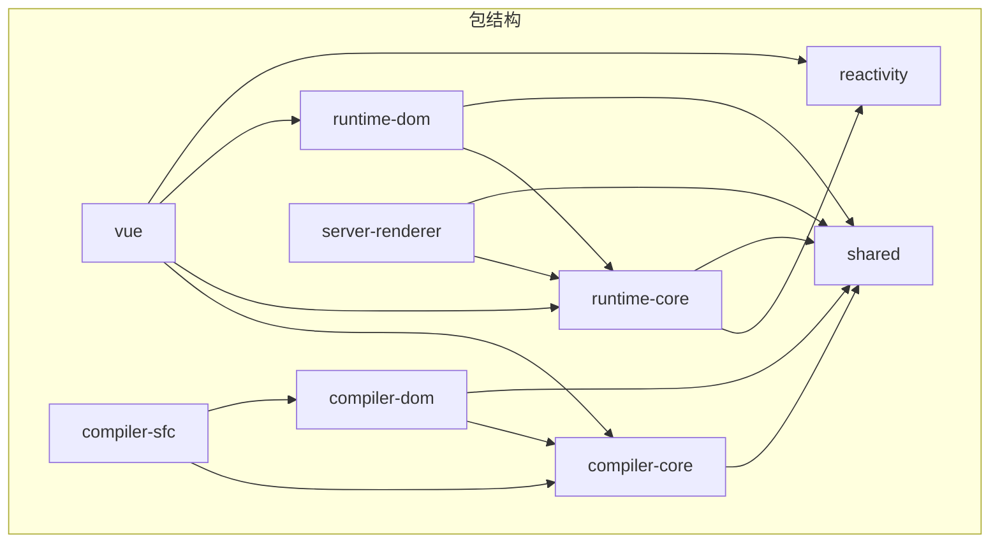
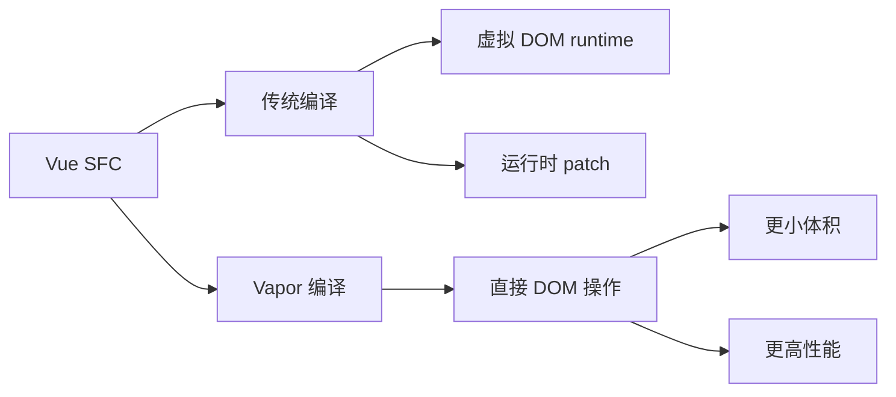
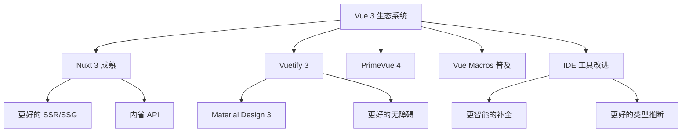

+++
title = "第31章 Vue 3 源码解读"
weight = 310
date = "2026-03-25T12:54:00+08:00"
type = "docs"
description = ""
isCJKLanguage = true
draft = false
+++

# 第三十一章 Vue 3 源码解读

> 恭喜你走到这里！本章是本教程的最后一章，我们将深入 Vue 3 的源码，从整体架构到核心实现，全面理解 Vue 3 的设计哲学。学习源码不是为了重复造轮子，而是为了更好地理解框架的工作原理，在遇到问题时能够快速定位原因。

## 31.1 Vue 3 源码结构

### 31.1.1 Monorepo 架构

Vue 3 采用 Monorepo 架构，所有包都在一个仓库中管理：

```
vue3-next/
├── packages/
│   ├── reactivity/           # 响应式系统
│   │   ├── src/
│   │   │   ├── reactive.ts
│   │   │   ├── ref.ts
│   │   │   ├── computed.ts
│   │   │   ├── watch.ts
│   │   │   ├── dep.ts
│   │   │   └── effect.ts
│   │   └── index.ts
│   │
│   ├── runtime-core/         # 运行时核心
│   │   ├── src/
│   │   │   ├── component.ts
│   │   │   ├── componentRenderUtils.ts
│   │   │   ├── componentUpdateUtils.ts
│   │   │   ├── renderer.ts          # patch 和 diff 算法
│   │   │   ├── vnode.ts             # 虚拟节点
│   │   │   ├── h.ts                 # h 函数
│   │   │   ├── apiWatch.ts
│   │   │   ├── apiLifecycle.ts
│   │   │   ├── helpers/
│   │   │   └── ...
│   │   └── index.ts
│   │
│   ├── runtime-dom/         # 浏览器运行时
│   │   ├── src/
│   │   │   ├── nodeOps.ts        # DOM 操作
│   │   │   ├── patchAttr.ts
│   │   │   ├── patchClass.ts
│   │   │   ├── patchStyle.ts
│   │   │   └── index.ts
│   │   └── index.ts
│   │
│   ├── compiler-core/       # 编译器核心（平台无关）
│   │   ├── src/
│   │   │   ├── parse.ts          # 模板解析
│   │   │   ├── transform.ts      # AST 转换
│   │   │   ├── codegen.ts        # 代码生成
│   │   │   └── ast.ts            # AST 定义
│   │   └── index.ts
│   │
│   ├── compiler-dom/        # 浏览器编译器
│   │   └── index.ts
│   │
│   ├── compiler-sfc/        # 单文件组件编译器
│   │   ├── src/
│   │   │   ├── parse.ts          # SFC 解析
│   │   │   ├── script/           # script 块处理
│   │   │   ├── template/        # template 块处理
│   │   │   └── style/            # style 块处理
│   │   └── index.ts
│   │
│   ├── shared/              # 共享工具
│   │   ├── src/
│   │   │   ├── shapeFlags.ts
│   │   │   ├── patchFlags.ts
│   │   │   └── ...
│   │   └── index.ts
│   │
│   ├── vue/                # 完整版本（运行时+编译器）
│   │   ├── package.json
│   │   └── index.ts
│   │
│   └── server-renderer/     # 服务端渲染
│       └── src/
│           └── render.ts
│
├── scripts/                 # 构建脚本
├── package.json
└── README.md
```

### 31.1.2 包的依赖关系



### 31.1.3 入口文件

```typescript
// packages/vue/src/index.ts
// 完整版 Vue（同时包含运行时和编译器）

import { createApp } from './runtime'
import { compile } from './compiler-dom'

// createApp 的运行时版本
const runtimeCompile = (container: Element, template: string) => {
  // 如果传入模板字符串，先编译
  const { render } = compile(template)
  return createApp(container, { render })
}

export { createApp, createApp as createApp }
export { compile }

export * from '@vue/runtime-core'
export * from '@vue/runtime-dom'
```

## 31.2 响应式系统源码

### 31.2.1 reactive 的完整实现

```typescript
// packages/reactivity/src/reactive.ts

import { isObject } from '@vue/shared'
import { isCollectionType } from './collectionHandlers'
import { ReactiveFlags, Target } from './constants'
import { baseHandlers, collectionHandlers } from './handlers'

// 用于存储已代理的对象
// WeakMap 的 key 是原始对象，value 是代理对象
export const reactiveMap = new WeakMap<Target, any>()
export const shallowReactiveMap = new WeakMap<Target, any>()
export const readonlyMap = new WeakMap<Target, any>()
export const shallowReadonlyMap = WeakMap<Target, any>()

// 创建响应式对象
export function reactive<T extends object>(target: T): T {
  // 如果目标已经是只读的，返回只读版本
  if (target && (target as Target)[ReactiveFlags.IS_READONLY]) {
    return target
  }
  
  // 调用内部创建函数
  return createReactiveObject(
    target,
    false,  // isReadonly
    false,  // isShallow
    baseHandlers,  // 普通对象处理器
    collectionHandlers  // 集合对象处理器
  )
}

// 创建只读响应式对象
export function readonly<T extends object>(target: T): Readonly<T> {
  return createReactiveObject(
    target,
    true,  // isReadonly
    false, // isShallow
    readonlyHandlers,  // 只读处理器
    readonlyCollectionHandlers
  )
}

// 浅层响应式
export function shallowReactive<T extends object>(target: T): T {
  return createReactiveObject(
    target,
    false,
    true,  // isShallow
    shallowReactiveHandlers,
    shallowReactiveCollectionHandlers
  )
}

// 创建代理对象的核心函数
function createReactiveObject(
  target: Target,
  isReadonly: boolean,
  isShallow: boolean,
  baseHandlers: ProxyHandler<any>,
  collectionHandlers: ProxyHandler<any>
) {
  // 如果目标已经是响应式对象，直接返回
  // 同一个对象多次调用 reactive() 应该返回同一个代理
  if (target[ReactiveFlags.IS_REACTIVE]) {
    return target as any
  }
  
  // 目标对象必须是有效的
  // 例如，Object.freeze() 的对象不可代理
  if (!isValidProxyTarget(target)) {
    console.warn(`value cannot be made reactive: ${target}`)
    return target
  }
  
  // 根据类型选择处理器
  const proxyTargets = isCollectionType(target)
    ? collectionHandlers
    : baseHandlers
  
  // 使用 Proxy 创建代理
  return new Proxy(target, proxyTargets)
}

// 验证目标对象是否可以被代理
function isValidProxyTarget(target: any): boolean {
  // 一些特殊对象不能被代理
  return !(
    isCollectionType(target) ||
    isPlainObject(target) === false
  )
}
```

### 31.2.2 依赖追踪（Track）

```typescript
// packages/reactivity/src/effect.ts

import { isArray } from '@vue/shared'
import { ReactiveEffect } from './effect'

// 全局变量
let activeEffect: ReactiveEffect | undefined
let shouldTrack = false
const trackStack: boolean[] = []

// 依赖收集函数
export function track(target: object, key: unknown, type: TrackOpTypes) {
  if (shouldTrack && activeEffect) {
    // 建立 target.key -> effect 的映射
    // 这个映射关系存储在全局的 targetMap 中
    let depsMap = targetMap.get(target)
    if (!depsMap) {
      targetMap.set(target, (depsMap = new Map()))
    }
    
    let dep = depsMap.get(key)
    if (!dep) {
      depsMap.set(key, (dep = new Set()))
    }
    
    // 将当前 effect 添加到 dep 中
    if (!dep.has(activeEffect)) {
      dep.add(activeEffect)
      // 同时在 effect 中记录它依赖了哪些 dep
      // 用于清理
      activeEffect.deps.push(dep)
      
      // 开发环境下的优化提示
      if (__DEV__ && activeEffect.onTrack) {
        activeEffect.onTrack({
          effect: activeEffect,
          target,
          type,
          key,
        })
      }
    }
  }
}

// 触发更新函数
export function trigger(
  target: object,
  key: unknown,
  type: TriggerOpTypes,
  newValue?: unknown
) {
  // 获取所有依赖这个对象的 effect
  const depsMap = targetMap.get(target)
  if (!depsMap) return
  
  const effects: ReactiveEffect[] = []
  
  // 根据操作类型收集需要执行的 effect
  if (type === TriggerOpTypes.CLEAR) {
    // 清除操作（如清空数组），触发所有 effect
    depsMap.forEach(dep => {
      addEffects(dep, effects)
    })
  } else {
    // 获取特定 key 的依赖
    const keyIsSymbol = typeof key === 'symbol'
    const keys = keyIsSymbol ? [] : [key]
    
    if (keyIsSymbol) {
      const symbolKeys = Array.from((target as any)[Symbol.iterator] || [])
      keys.push(...symbolKeys)
    }
    
    for (const key of keys) {
      const dep = depsMap.get(key)
      if (dep) {
        addEffects(dep, effects)
      }
    }
  }
  
  // 按顺序执行 effects
  runEffects(effects)
}

// 添加 effect 到队列（去重）
function addEffects(dep: Set<ReactiveEffect>, effects: ReactiveEffect[]) {
  const scheduleEffects = new Set<ReactiveEffect>()
  
  for (const effect of dep) {
    if (effect !== activeEffect) {
      scheduleEffects.add(effect)
    }
  }
  
  effects.push(...scheduleEffects)
}

// 执行所有 effect
function runEffects(effects: ReactiveEffect[]) {
  for (const effect of effects) {
    // 如果 effect 有 scheduler，优先使用 scheduler
    if (effect.scheduler) {
      effect.scheduler()
    } else {
      effect.run()
    }
  }
}
```

### 31.2.3 computed 的实现

```typescript
// packages/reactivity/src/computed.ts

import { isFunction } from '@vue/shared'
import { ReactiveEffect, track, trigger, TriggerOpTypes } from './effect'

export class ComputedRefImpl<T> {
  // 缓存的值
  private _value!: T
  
  // 脏标记，表示需要重新计算
  private _dirty = true
  
  // 依赖的 effect
  private effect: ReactiveEffect<T>
  
  // 依赖这个 computed 的 effect
  public dep: Set<ReactiveEffect> = new Set()
  
  // __v_isRef 标记，用于自动解包
  public readonly __v_isRef = true
  
  constructor(
    private readonly _getter: () => T,
    private readonly _setter?: (v: T) => void,
    public readonly _isReadonly = false
  ) {
    // 创建响应式 effect
    // 依赖变化时不会立即执行，而是标记 dirty
    this.effect = new ReactiveEffect(_getter, () => {
      // scheduler：当依赖变化时，只标记为脏
      if (!this._dirty) {
        this._dirty = true
        // 触发依赖这个 computed 的 effect
        trigger(this, 'value' as any, TriggerOpTypes.SET)
      }
    })
  }
  
  // getter
  get value() {
    // 收集对这个 computed 的依赖
    // 这个 computed 本身作为响应式数据被其他 effect 依赖
    trackRefValue(this)
    
    // 如果是脏的（依赖变化了），重新计算
    if (this._dirty) {
      this._dirty = false
      this._value = this.effect.run()!
    }
    
    return this._value
  }
  
  // setter
  set value(newValue: T) {
    if (this._setter) {
      this._setter(newValue)
    } else {
      console.warn('Write operation failed: computed value is readonly')
    }
  }
}

function trackRefValue(ref: any) {
  if (activeEffect) {
    ref.dep.add(activeEffect)
    activeEffect.deps.push(ref.dep)
  }
}
```

### 31.2.4 watch 的实现

```typescript
// packages/reactivity/src/apiWatch.ts

import { isFunction, isObject } from '@vue/shared'
import { ReactiveEffect, trigger, triggerBatch } from './effect'
import { ComputedRefImpl } from './computed'

type WatchSource<T = any> = 
  | Ref<T>
  | ComputedRefImpl<T>
  | ((oldValue?: T) => T)
  | object

type WatchCallback<V = any, OV = any> = (
  value: V,
  oldValue: OV,
  onCleanup: (fn: () => void) => void
) => void

export function watch<T>(
  source: WatchSource<T>,
  cb: WatchCallback<T>,
  options?: WatchOptions
): WatchStopHandle {
  return doWatch(source, cb, options)
}

function doWatch(
  source: WatchSource<T>,
  cb: WatchCallback | undefined,
  {
    immediate = false,
    deep = false,
    flush = 'pre',  // 'pre' | 'post' | 'sync'
    onTrack,
    onTrigger,
  }: WatchOptions = {}
): WatchStopHandle {
  // 获取 source 的 getter 函数
  let getter: () => any
  
  if (isFunction(source)) {
    getter = source
  } else if (isRef(source)) {
    getter = () => source.value
  } else if (isReactive(source)) {
    getter = () => source
    deep = true  // 深度监听
  } else {
    // 多个 source
    getter = () => source.map(s => {
      if (isRef(s)) return s.value
      if (isReactive(s)) return s
      if (isFunction(s)) return s()
      return s
    })
  }
  
  // 旧值
  let oldValue: any
  
  // 清理函数
  let cleanup: () => void
  
  // 任务函数
  const job = () => {
    if (!activeEffect || !cb) return
    
    // 获取新值
    const newValue = effect.run()
    
    // 调用回调
    cleanup = cb(
      newValue,
      oldValue,
      onCleanup => {
        cleanup = onCleanup
      }
    )
    
    // 更新旧值
    oldValue = newValue
  }
  
  // 创建 effect
  const effect = new ReactiveEffect(getter, job)
  
  // 立即执行（如果设置了 immediate）
  if (immediate) {
    job()
  } else {
    // 否则记录旧值
    oldValue = effect.run()
  }
  
  // 返回停止函数
  return () => {
    effect.stop()
  }
}
```

## 31.3 虚拟 DOM 源码

### 31.3.1 vnode 的创建

```typescript
// packages/runtime-core/src/vnode.ts

export const Fragment = Symbol('Fragment')
export const Text = Symbol('Text')
export const Comment = Symbol('Comment')
export const Static = Symbol('Static')

export const enum VNodeTypes {
  ELEMENT = 'div',
  TEXT = Text,
  COMMENT = Comment,
  FRAGMENT = Fragment,
  COMPONENT = Symbol('Component'),
  TELEPORT = Symbol('Teleport'),
  SUSPENSE = Symbol('Suspense'),
}

// vnode 工厂函数
export function createVNode(
  type: VNodeTypes | string | Component,
  props: any = null,
  children: any = null,
): VNode {
  // 处理 props
  if (props) {
    // ... class、style 规范化
  }
  
  // vnode 类型标记
  let shapeFlag: number
  
  if (isString(type)) {
    shapeFlag = ShapeFlags.ELEMENT
  } else if (isObject(type)) {
    shapeFlag = ShapeFlags.COMPONENT
  } else if (isFunction(type)) {
    shapeFlag = ShapeFlags.COMPONENT | ShapeFlags.FUNCTIONAL_COMPONENT
  } else {
    // Fragment、Comment 等
    shapeFlag = 0
  }
  
  // 创建 vnode
  const vnode: VNode = {
    type,
    props,
    key: props?.key ?? null,
    ref: props?.ref ?? null,
    children,
    shapeFlag,
    // ...
  }
  
  // 处理 children
  if (children) {
    if (isArray(children)) {
      vnode.shapeFlag |= ShapeFlags.ARRAY_CHILDREN
    } else if (isString(children) || isNumber(children)) {
      vnode.shapeFlag |= ShapeFlags.TEXT_CHILDREN
    }
  }
  
  return vnode
}
```

### 31.3.2 patch 算法的核心

```typescript
// packages/runtime-core/src/renderer.ts

function patch(n1: VNode | null, n2: VNode, container: RendererElement) {
  // 如果新旧 vnode 类型不同，直接卸载旧的、挂载新的
  if (n1 && !sameVnode(n1, n2)) {
    unmount(n1)
    n1 = null
  }
  
  const { type } = n2
  
  if (isString(type)) {
    // HTML 元素
    if (!n1) {
      mountElement(n2, container)
    } else {
      patchElement(n1, n2)
    }
  } else if (isObject(type)) {
    // 组件
    processComponent(n1, n2, container)
  } else if (type === Text) {
    // 文本节点
    processText(n1, n2, container)
  } else if (type === Comment) {
    // 注释节点
    processComment(n1, n2, container)
  } else if (type === Fragment) {
    // Fragment
    processFragment(n1, n2, container)
  }
}

// 元素节点的 patch
function patchElement(n1: VNode, n2: VNode) {
  const el = (n2.el = n1.el!)
  
  // 1. 更新 props
  patchProps(n1.props || {}, n2.props || {}, el)
  
  // 2. 更新 children
  const { children: oldChildren } = n1
  const { children: newChildren } = n2
  
  if (isArray(newChildren)) {
    if (isArray(oldChildren)) {
      // 双端 diff
      patchKeyedChildren(oldChildren, newChildren, el)
    } else {
      // 旧的要么是文本要么是空的
      if (isString(oldChildren)) {
        hostSetElementText(el, '')
      }
      mountChildren(newChildren, el)
    }
  } else {
    // 新的不是数组（可能是文本或空）
    if (isString(oldChildren)) {
      hostSetElementText(el, '')
    } else if (isArray(oldChildren)) {
      unmountChildren(oldChildren)
    }
  }
}

// keyChildren diff 算法
function patchKeyedChildren(
  oldChildren: VNode[],
  newChildren: VNode[],
  container: RendererElement
) {
  // 双端指针
  let oldStartIdx = 0
  let oldEndIdx = oldChildren.length - 1
  let newStartIdx = 0
  let newEndIdx = newChildren.length - 1
  
  while (oldStartIdx <= oldEndIdx && newStartIdx <= newEndIdx) {
    const oldStartVNode = oldChildren[oldStartIdx]
    const newStartVNode = newChildren[newStartIdx]
    
    if (sameVnode(oldStartVNode, newStartVNode)) {
      // 头头相同，递归 patch
      patch(oldStartVNode, newStartVNode)
      oldStartIdx++
      newStartIdx++
    } else if (sameVnode(oldEndVNode, newEndVNode)) {
      // 尾尾相同
      patch(oldEndVNode, newEndVNode)
      oldEndIdx--
      newEndIdx--
    } else if (sameVnode(oldStartVNode, newEndVNode)) {
      // 头尾相同（需要移动）
      patch(oldStartVNode, newEndVNode)
      hostInsert(oldStartVNode.el!, container, hostNextSibling(oldEndVNode.el!))
      oldStartIdx++
      newEndIdx--
    } else if (sameVnode(oldEndVNode, newStartVNode)) {
      // 尾头相同
      patch(oldEndVNode, newStartVNode)
      hostInsert(oldEndVNode.el!, container, oldStartVNode.el!)
      oldEndIdx--
      newStartIdx++
    } else {
      // 没有匹配，使用 Map 查找
      const keyToOldIndexMap = new Map()
      for (let i = oldStartIdx; i <= oldEndIdx; i++) {
        const key = oldChildren[i].key
        if (key != null) {
          keyToOldIndexMap.set(key, i)
        }
      }
      
      const index = keyToOldIndexMap.get(newStartVNode.key)
      if (index != null) {
        const toMoveNode = oldChildren[index]
        patch(toMoveNode, newStartVNode)
        hostInsert(toMoveNode.el!, container, oldStartVNode.el!)
        oldChildren[index] = null as any
      } else {
        // 新增节点
        mount(newStartVNode, container, oldStartVNode.el!)
      }
      
      newStartIdx++
    }
  }
  
  // 处理剩余情况...
}
```

## 31.4 编译器优化源码

### 31.4.1 Block 与 PatchFlag

```typescript
// packages/compiler-core/src/compile.ts

// 编译时优化：识别静态节点
function generateBlock(vnode: VNode): {
  // 动态节点数组
  dynamicChildren: VNode[]
  // ...
} {
  // 收集所有动态节点
  const dynamicChildren: VNode[] = []
  
  walk(vnode, dynamicChildren)
  
  // 标记 vnode 为 block
  return {
    type: Block,
    dynamicChildren,
  }
}

// 遍历 vnode，收集动态节点
function walk(vnode: VNode, dynamicChildren: VNode[]) {
  const { patchFlag, children, type } = vnode
  
  // 如果有 patchFlag，说明有动态内容
  if (patchFlag > 0) {
    dynamicChildren.push(vnode)
    return
  }
  
  // 递归处理子节点
  if (isArray(children)) {
    for (const child of children) {
      walk(child, dynamicChildren)
    }
  } else if (isObject(children)) {
    walk(children, dynamicChildren)
  }
}

// 运行时 patch 优化
// 只遍历动态节点，不需要遍历整棵树
function patchBlock(n1: VNode, n2: VNode) {
  // 只 patch 动态节点
  const { dynamicChildren } = n2
  
  for (let i = 0; i < dynamicChildren.length; i++) {
    patch(dynamicChildren[i], dynamicChildren[i])
  }
}
```

### 31.4.2 静态提升

```typescript
// packages/compiler-core/src/transforms/hoistStatic.ts

// 静态提升：将静态节点提取到渲染函数外部
function hoistStatic(root: RootNode) {
  walk(root, new Set())
}

function walk(node: Node, staticNodes: Set<Node>) {
  if (isElement(node)) {
    // 检查元素是否完全静态
    if (isStatic(node)) {
      // 提取到外部
      hoist(node)
      return
    }
    
    // 处理子节点
    for (const child of node.children) {
      walk(child, staticNodes)
    }
  }
}

// 判断节点是否完全静态
function isStatic(node: Node): boolean {
  if (node.type === NodeTypes.ELEMENT) {
    // 检查 tag
    if (!isStaticTag(node.tag)) return false
    
    // 检查 props
    for (const prop of node.props) {
      if (!isStaticProp(prop)) return false
    }
    
    // 检查 children
    for (const child of node.children) {
      if (!isStatic(child)) return false
    }
    
    return true
  }
  
  return false
}
```

## 31.5 Vue 3.5+ 新特性与未来趋势

### 31.5.1 Vue 3.5 主要变化

Vue 3.5 是 Vue 3 的一个重要版本，带来了一些重大改进：

```typescript
// Vue 3.5 的响应式系统优化
// 1. 更高效的依赖追踪
// 2. 更好的 TypeScript 支持
// 3. 改进的 computed 性能

// reactive 解构改进
const props = defineProps<{
  count: number
}>()

// 现在可以这样写（自动保持响应式）
let { count } = defineProps<{ count: number }>()

// 但仍推荐直接使用 props.count
// 因为解构会丢失响应式追踪
```

### 31.5.2 Vapor Mode 进展

Vapor Mode 仍在实验阶段，它的目标是：



### 31.5.3 生态系统趋势



### 31.5.4 推荐的源码阅读顺序

如果你想深入学习 Vue 3 源码，建议按以下顺序阅读：

1. **响应式系统**（最独立、最核心）
   - `packages/reactivity/src/reactive.ts`
   - `packages/reactivity/src/ref.ts`
   - `packages/reactivity/src/computed.ts`
   - `packages/reactivity/src/effect.ts`

2. **虚拟 DOM**
   - `packages/runtime-core/src/vnode.ts`
   - `packages/runtime-core/src/renderer.ts`

3. **组件系统**
   - `packages/runtime-core/src/component.ts`
   - `packages/runtime-core/src/componentRenderUtils.ts`

4. **编译器**
   - `packages/compiler-core/src/parse.ts`
   - `packages/compiler-core/src/transform.ts`
   - `packages/compiler-core/src/codegen.ts`

5. **运行时入口**
   - `packages/runtime-core/src/apiCreateApp.ts`
   - `packages/vue/src/index.ts`

## 31.6 参与 Vue 贡献

### 31.6.1 提 PR 的流程

```bash
# 1. Fork 仓库
git clone https://github.com/YOUR_USERNAME/vue-next.git

# 2. 创建分支
git checkout -b fix/my-bug

# 3. 安装依赖
npm install

# 4. 开发
# 修改代码
npm run build  # 构建

# 5. 测试
npm run test
npm run test:unit

# 6. 提交
git add .
git commit -m 'fix: xxx'

# 7. Push 并创建 PR
git push origin fix/my-bug
```

### 31.6.2 寻找适合贡献的问题

- `good first issue` 标签：适合新手
- `bug` 标签：报告的 bug
- `feature` 标签：新功能建议
- `help wanted` 标签：需要帮助

### 31.6.3 源码调试技巧

```typescript
// 1. 在 reactive 源码中添加 console.log
export function reactive(target: object) {
  console.log('Creating reactive:', target)
  // ...
}

// 2. 使用 source map
// 在浏览器中可以直接断点调试源码

// 3. 单元测试
// packages/reactivity/__tests__/reactive.spec.ts

// 4. API 测试 playground
// packages/playground/
```

## 31.7 本章小结

恭喜你完成了 Vue 3 教程的全部 31 章！

本章我们从宏观到微观，全面了解了 Vue 3 的源码：

1. **Monorepo 架构**：Vue 3 将响应式、运行时、编译器等拆分为独立包
2. **响应式系统**：reactive、ref、computed、watch 的实现原理
3. **虚拟 DOM**：vnode 结构、patch 算法、children diff
4. **编译器优化**：Block、PatchFlag、静态提升等优化手段
5. **Vue 3.5+**：最新特性和未来趋势
6. **参与贡献**：如何为 Vue 生态做贡献

学习源码的目的不是重复造轮子，而是：

- **理解原理**：遇到问题时能快速定位原因
- **借鉴设计**：将优秀的设计思路应用到自己的代码中
- **参与贡献**：为开源社区做出贡献

Vue 3 是一个不断进化的框架，它的生态越来越丰富，性能越来越强大。作为一名 Vue 开发者，你应该：

1. **熟练使用 Vue 3**：日常开发中得心应手
2. **理解核心原理**：响应式、虚拟 DOM、组件系统
3. **关注生态发展**：Nuxt 3、Vapor Mode 等新工具
4. **持续学习**：前端技术日新月异，保持好奇心

---

**教程总结**

本教程从 Vue 3 环境搭建开始，逐步深入：

- **基础篇**（1-10章）：环境、语法、响应式、生命周期、组件、插槽、Composables、路由、状态管理、性能优化
- **进阶篇**（11-15章）：深入响应式、组合式函数、路由进阶、Pinia 进阶、样式方案
- **实战篇**（16-25章）：TypeScript、项目工程化、测试、安全、国际化和可访问性、SSR、动画、企业级实战
- **高级篇**（26-31章）：内容平台实战、响应式原理、虚拟 DOM、生态系统、部署、源码解读

希望这本教程能帮助你从 Vue 3 新手成长为 Vue 3 高手！

最后，送你一句话：

> "Talk is cheap, show me the code." — Linus Torvalds

**去写代码吧！** 🚀
