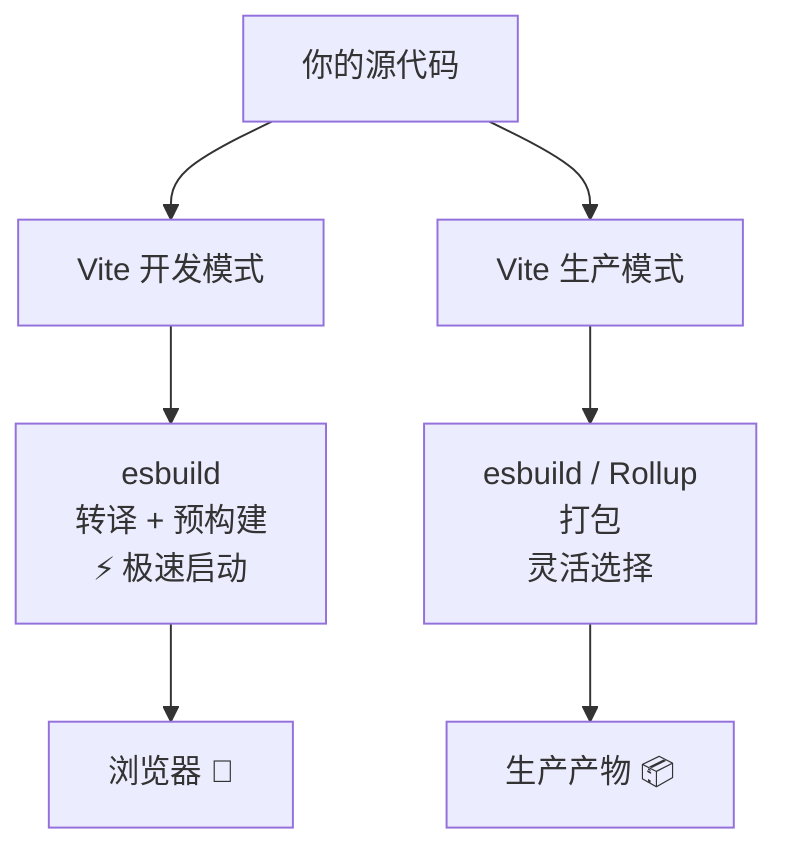

+++
title = "第1章 esbuild是什么"
weight = 10
date = "2026-03-28T11:54:00+08:00"
type = "docs"
description = ""
isCJKLanguage = true
draft = false
+++

# Chapter 01 - esbuild 是什么

## 1.1 定义：一句话认识 esbuild

想象一下这个场景：你手搓了一个炫酷的网页，代码模块写得优雅又整洁，结果浏览器打开一看——满屏报错，理由是它"不认识"你的 `import` 和 `export`。

没错，浏览器就像一个只认现金的老大爷，你给他一张信用卡（ES Modules），他眨巴着眼睛说"这啥玩意儿"。

这时候，你需要一个人——一个能把你的优雅代码"翻译"成浏览器能看懂的东西的工具。这个工具，就是 **esbuild**。

> esbuild 是一个由 Go 语言编写的高速 JavaScript 打包/构建工具。它干的事情很简单：把你的前端代码打包、压缩、转译，然后吐出一个浏览器能欢快跑起来的产物。

它的速度快到离谱——快到如果打包工具们组队跑马拉松，esbuild 已经喝完咖啡、刷完微博、顺便还睡了个午觉，而其他选手还在起跑线上磨蹭。

---

## 1.2 核心定位：打包器 / 构建工具

esbuild 的定位，说白了就三件事：

**打包器（Bundler）**：把你的 N 个 `.js` 文件、N 个 `.css` 文件、还有那些你 `import` 进来的字体、JSON，合并成一个（或几个）文件。浏览器只需要请求这几个文件，而不是几十上百个——这叫"减少网络请求"，是前端性能优化的基本功。

**构建工具（Build Tool）**：除了打包，它还负责转译（把 TypeScript 转成 JavaScript、把 JSX 转成普通函数调用）、压缩（把代码丑化、缩短变量名、删掉空格换行）、生成源码映射（方便你在浏览器里打断点而不是对着一堆压缩后的乱码发呆）。

**转译器（Transpiler）**：esbuild 不是传统意义上的编译器（Compiler，把语言 A 完全变成语言 B，比如 C 编译成机器码），它更准确地说是一个转译器——把新版 JavaScript 语法降级成旧版，把 TypeScript 转成 JavaScript，把 JSX 转成纯 JavaScript。它是一个语言翻译官，而且是那种翻译速度堪比闪电的翻译官。

```
┌─────────────────────────────────────────────────────────┐
│                    你的源代码                               │
│   app.tsx  ×  100 个模块  ×  TypeScript  ×  JSX         │
└──────────────────┬──────────────────────────────────────┘
                   │
              ┌────▼────┐
              │ esbuild │   ← 打包 + 转译 + 压缩 + Tree Shaking
              └────┬────┘
                   │
         ┌─────────┼──────────┐
         ▼         ▼          ▼
    bundle.js  bundle.css  index.html   ← 浏览器爱吃的"套餐"
```

所以下次有人问你 esbuild 是干啥的，你可以淡定地说：*"它就是一个能把你的代码从'你写的版本'变成'浏览器能跑的版本'的工具，顺便快得离谱。"*

---

## 1.3 核心能力概览（打包 / 转译 / 压缩 / Tree Shaking / 本地服务器）

esbuild 的能力，可以用五把刷子来形容：

### 第一把刷子：打包（Bundling）

把散落一地的模块文件，收拾得整整齐齐打包成一个（或几个）文件。想象一下快递员把一堆散件打包成一个包裹，而不是让你签收一百个快递——打包就是这种"合并同类项"的能力。

### 第二把刷子：转译（Transpiling）

esbuild 不是编译器（Compiler），它是转译器（Transpiler）。两者的区别很微妙：

- **编译器**：把语言 A 翻译成完全不同的语言 B（比如 C 编译成机器码）
- **转译器**：把语言 A 翻译成语言 A 的另一个版本（比如 TypeScript 转成 JavaScript，ES2022 转成 ES2015）

esbuild 就是那个能把新版 JS 语法"降级"成旧版语法的工具，让你的代码在老浏览器里也能跑。

### 第三把刷子：压缩（Minifying）

写代码要优雅，打包要丑陋。

这里的"丑陋"是褒义——压缩会把你的代码变成一团没有任何空格的乱码，变量名从 `userName` 变成 `a`，函数名从 `calculateTotalPrice` 变成 `b`。目的只有一个：文件体积更小，加载更快。

> 一行经典的话：开发时你优雅，生产时 esbuild 替你"丑化"世界。

### 第四把刷子：Tree Shaking（摇树优化）

这个名字非常形象——想象一棵树，树上有些枝叶是枯死的（没有被用到的代码），Tree Shaking 就是把那枯枝烂叶摇下来扔掉，只留下活的、能结果的枝条。

专业地说：Tree Shaking 会分析你的代码依赖图（Dependency Graph），把那些被 import 了但实际没用的代码删掉。这玩意儿在 esbuild 里是自动开启的，你什么都不用做。

### 第五把刷子：本地服务器（serve）

esbuild 还自带一个本地开发服务器。你改代码，它自动重新构建，浏览器自动刷新看到最新效果——虽然它没有内置 HMR（热模块替换），但用来做基础开发已经绰绰有余了。

---

## 1.4 esbuild 与 Webpack / Rollup / Vite 的本质区别

把 esbuild 和其他几个打包工具放在一起比较，就像比较不同类型的厨师：

| 工具 | 比喻 |
|------|------|
| **Webpack** | 一个啥都会的全能大厨，能做满汉全席，但厨房（配置）巨大，光预热就要半天 |
| **Rollup** | 一个专注于做精致小菜的私房菜厨师，输出干净简洁，特别适合打包类库（Lib） |
| **Vite** | 一个用现代理念经营的快餐店老板，店内引入了 esbuild 当首席加速厨师 |
| **esbuild** | 一个用 Go 语言修炼了十年内功的闪电侠，别的厨师做菜要 10 分钟，它 10 毫秒搞定 |

### esbuild vs Webpack

Webpack 是前端构建领域的老大哥，生态极其丰富，插件多如牛毛。但它慢，而且慢得让人怀疑人生——一个中大型项目，热更新（Hot Module Replacement）等个十几秒是常事。

esbuild 最大的特点就是**快**。不是"快一点"，是"快几十倍"那种快。在 esbuild 里，打包一个项目可能只需要几百毫秒，而 Webpack 可能需要几十秒。

但 esbuild 不是 Webpack 的替代品——它更像是一个"提速工具"。很多现代工具（如 Vite）实际上把 esbuild 当作自己的一部分，用它来处理转译和压缩这些需要快速度的环节。

### esbuild vs Rollup

Rollup 专注于打包，它的输出干净、简洁，特别适合那种"只打包我需要的、不多加任何私货"的场景——这也是为什么很多知名类库（如 React、Vue）都用 Rollup 来打包发布版本。

esbuild 在类库打包上也能做得很好，而且速度更快。但 Rollup 的插件生态更成熟，如果你需要做一些高级的打包操作，Rollup 可能是更好的选择。

简单来说：如果你在打造一个面向生产环境的类库，Rollup 成熟可靠；如果你想要更快的打包体验，esbuild 是更好的选择。

### esbuild vs Vite

Vite 的核心理念是"快"。

Vite 在开发阶段使用 esbuild 来做转译和预构建（因为快），而在生产环境则根据场景灵活选择——可以用 esbuild 做打包，也可以用 Rollup。

所以它们不是竞争关系——**Vite 把 esbuild 当作自己速度的秘密武器之一**。

简单来说：如果你需要一个全家桶，Vite；如果你追求极限速度，esbuild；如果两者都要——那就把 esbuild 装进 Vite 里。



---

## 1.5 esbuild 为什么这么快（Go 语言 + 并行架构 + 从零构建）

这是 esbuild 最让人"哇塞"的地方。

### Go 语言：天生内功深厚

esbuild 是用 **Go 语言**写的，而不是前端圈常见的 JavaScript / TypeScript。

JavaScript 代码需要 JavaScript 引擎（比如 Chrome 的 V8）来解释执行，而 Go 语言是一种编译型语言，代码在运行前就已经被编译成了高效的机器码，执行效率远高于解释型语言。就像你买外卖 vs 自己做饭——Go 是那个已经做好、装好盒、送到你手上的外卖，而 JavaScript 是那个还需要你回家开火再炒一遍的半成品食材。

### 并行架构：众人拾柴火焰高

现代电脑都是多核处理器——你有 4 核、8 核，甚至 16 核。但大多数 JavaScript 构建工具只用一个核，原因是 Node.js 的单线程模型。

esbuild 生来就是用 Go 语言写的（不是用 JS 写完后"重写"成 Go），可以直接编译成高效的机器码，充分利用多核 CPU，把任务拆分成多个小任务，同时在多个 CPU 核心上并行执行。这就像你有一支装修队，而不是一个装修工人。

### 从零构建：不背历史包袱

Webpack 诞生于 2012 年，那时候的"模块化"还很原始。Webpack 为了兼容各种千奇百怪的模块化方案（CommonJS、AMD、ES Modules、甚至 CMD、UMD），内部逻辑复杂得像一团意大利面条。

esbuild 从零开始，只支持最新的模块化标准，不需要兼容那些"上个世纪"的写法。轻装上阵，自然跑得快。

更重要的是，"从零构建"意味着 esbuild 的**所有核心功能——解析器、绑定器、压缩器、转译器——都是自己从底层实现的，而不是拼凑现有 npm 包**。不依赖层层封装的老旧轮子，不被别人的历史包袱拖累，自然轻快。

> esbuild 官方以及其他社区做过不少对比测试：同样一个中等规模的项目，esbuild 打包耗时通常在几十毫秒级别，而传统 JavaScript 构建工具往往需要几十秒。快几十倍到上百倍，是大家公认的结论，而不是夸张。

---

## 1.6 esbuild 名字的由来与项目背景

"esbuild"这个名字，其实藏着点小秘密。

**es** = **E**cma**S**cript，也就是 JavaScript 的正式名称。

**build** = 构建。

合起来就是 "JavaScript 构建工具"——名字直白到不能再直白，没有任何花里胡哨的隐喻，就是这么朴实无华。

项目背景也很有意思：esbuild 的作者是 **Evan Wallace**，一位来自美国的独立开发者。2020 年，他在 GitHub 上开源了 esbuild（仓库地址：github.com/evanw/esbuild），瞬间引爆前端圈——大家从来没见过这么快的打包工具，纷纷发出灵魂拷问："这玩意儿真的是用 Go 写的吗？"

事实证明，是的，而且代码质量相当高。

> 一个小八卦：Evan Wallace 最初并不是想做一个"取代 Webpack"的工具，他只是受不了自己项目里 Webpack 慢得像蜗牛的速度，于是自己写了一个快的。后来他把这个工具开源，大家才发现：哦，原来一个人写一个打包工具可以这么快、这么好。

如今 esbuild 已经成为前端工具链中不可或缺的一环，从 Vite 到 Remix，从 SvelteKit 到 Astro，到处都有它的身影。

---

## 1.7 本章小结

本章我们认识了一位前端构建界的新星——esbuild。

我们知道了它是一个用 Go 语言编写的高速打包工具，它的核心能力包括：打包（Bundling）把你的代码合并成一个文件、转译（Transpiling）把 TypeScript 和 JSX 变成 JavaScript、压缩（Minifying）让文件体积变小、Tree Shaking 自动删除无用代码、还自带本地开发服务器。

它的速度快得离谱，原因是 Go 语言 + 多核并行 + 从零构建没有历史包袱。

它不是 Webpack 的直接替代品，而是很多现代工具的秘密武器，Vite、Rollup 都可能内置 esbuild 来提速。

第一章就这么愉快地结束了！下一章我们来聊聊 esbuild 的安装与入门，手把手带你写出第一个 esbuild 脚本。
