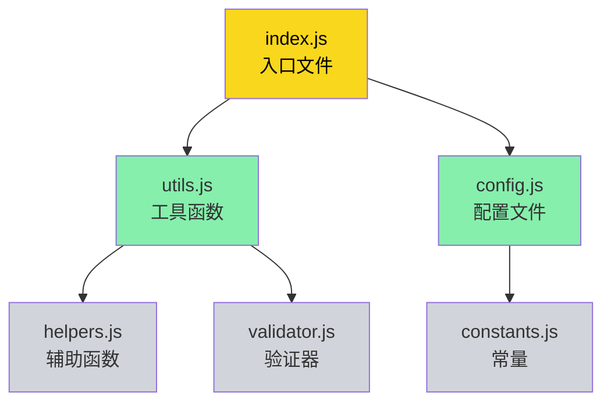

+++
title = "第3章 esbuild能做什么"
weight = 30
date = "2026-03-28T11:54:00+08:00"
type = "docs"
description = ""
isCJKLanguage = true
draft = false
+++

## 3.1 打包（Bundling）

### 3.1.1 多模块合并为单文件

想象一下你写了一个网页，有 50 个 `.js` 文件，每个文件负责不同的功能——有的是处理表单验证的，有的是负责动画效果的，有的是处理网络请求的。

浏览器打开这个网页，看到 50 个文件需要加载，发了 50 个 HTTP 请求，网站加载了 5 秒钟还没出来。用户已经开始骂娘了——（也许骂的是你）。

**打包（Bundling）** 就是来解决这个问题的。

esbuild 会分析你的代码，找到所有 `import` 和 `export` 的依赖关系，然后把这些散落的模块"打包"成一到几个文件。浏览器只需要请求这几个文件，加载速度瞬间起飞。

```javascript
// a.js
export const name = '小明';

// b.js
import { name } from './a.js';
console.log(name + '是个大帅哥');

// c.js —— 如果没有被任何地方引用，打包时会自动被丢弃
export const unused = '我没人要';
```

运行 esbuild 打包之后：

```javascript
// 打包结果：所有模块被合并到一个 bundle.js 里
const name = '小明';
console.log(name + '是个大帅哥');
// c.js 的内容完全消失了，因为它没被引用
```

### 3.1.2 依赖解析与合并

你可能会问：esbuild 是怎么知道哪些文件需要打包进来的？

答案就是**依赖解析**（Dependency Resolution）。

当你写 `import { something } from './utils'` 的时候，esbuild 会顺着这个路径找到 `./utils.js`（或者 `./utils/index.js`），然后继续分析这个文件里有没有 `import` 其他文件，就这样递归地一直找下去，直到把所有相关的模块都找出来。

这个过程就像一张蜘蛛网，每个 `import` 就是一根丝，esbuild 从入口文件出发，顺着丝爬，把整张网都画出来。



灰色的文件虽然也被解析了，但如果没有被任何地方引用，打包时会被丢弃——这就是 Tree Shaking 的功劳（后面会详细讲）。

### 3.1.3 循环依赖处理

有些代码里会有"循环引用"的情况，比如：

```javascript
// a.js
import { bName } from './b.js';
export const aName = '我是A';
export function getB() {
  return bName; // 这里用到了 b.js 导出的东西
}

// b.js
import { aName } from './a.js';
export const bName = '我是B';
export function getA() {
  return aName; // 这里又用到了 a.js 导出的东西
}
```

a 引用 b，b 又引用 a，这就是**循环依赖**（Circular Dependency）。

esbuild 巧妙地处理了这种情况：它会给循环中的模块返回一个"部分初始化的副本"——也就是说，当你 import 另一个模块时，那个模块可能还没完全初始化完，但至少已经有了当前的导出值。这不是 bug，是 JavaScript 语言层面的特性，esbuild 只是忠实地实现了它。

不过，循环依赖虽然能跑，但写代码时还是尽量避免——因为你永远不知道哪个先初始化，哪个后初始化，这种薛定谔的代码状态会让debug变成一场噩梦。

---

## 3.2 代码转译（Transpiling）

> 💡 读到这里，你是不是在想："TypeScript？听起来很高级，但我真的需要吗？"——先别急着划走，听我解释完再说。

### 3.2.1 TypeScript 转译为 JavaScript

TypeScript 是 JavaScript 的超集——它给 JS 加了类型系统，让代码更可靠，写错类型时会给你一个红红的报错，而不是让你在生产环境中抓瞎。

但问题是：浏览器不认识 TypeScript。浏览器只认 JavaScript。

所以 TypeScript 代码需要被"翻译"成 JavaScript，这个过程就叫做**转译**（Transpiling）——就像把外语翻译成普通话，让浏览器能听懂。

esbuild 内置了对 TypeScript 的支持，不需要你额外安装什么 Babel、tsc、或者别的什么奇奇怪怪的编译器。装一个 esbuild，全都搞定。

```typescript
// app.ts —— TypeScript 文件，带类型注解
interface User {
  name: string;
  age: number;
}

function greet(user: User): string {
  return `你好，${user.name}！你 ${user.age} 岁了。`;
}

const user: User = { name: '张三', age: 25 };
console.log(greet(user));
```

esbuild 打包后，会输出纯 JavaScript 代码，类型注解全部消失：

```javascript
// 输出结果：纯 JavaScript，类型信息被丢弃了
function greet(user) {
  return `你好，${user.name}！你 ${user.age} 岁了。`;
}

const user = { name: '张三', age: 25 };
console.log(greet(user));
```

注意这里有一个非常重要的点：**esbuild 只做转译，不做类型检查**。如果你的 TypeScript 代码里有类型错误，esbuild 会直接忽略它、照样打包，而不会像 `tsc` 那样报一堆错误。这是一个有意的设计决定——esbuild 的目标是快，而不是严格检查。你想严格检查？去找 `tsc` 吧，它很乐意帮你把错误数到一百个。

> 简单理解：TypeScript 让你写代码时更安全（类型检查），esbuild 让你构建时更快（只转译不检查）。

### 3.2.2 JSX / TSX 转译

JSX 是一种看起来像 HTML 的 JavaScript 语法，主要用在 React 里：

```javascript
// app.jsx
import React from 'react';

function App() {
  return (
    <div className="container">
      <h1>Hello, World!</h1>
      <p>欢迎使用 esbuild</p>
    </div>
  );
}

export default App;
```

浏览器不认识 JSX，它只认识 `React.createElement(...)` 这种 JavaScript 函数调用。

esbuild 会自动把 JSX 转译成 `React.createElement` 调用：

```javascript
// 转译后（传统模式）：JSX 变成了 React.createElement 调用
"use strict";
var React = require("react");
function App() {
  return React.createElement("div", { className: "container" },
    React.createElement("h1", null, "Hello, World!"),
    React.createElement("p", null, "欢迎使用 esbuild")
  );
}
exports.App = App;
```

如果你用 React 17+ 的新 JSX 转换（不需要手动 import React），只需要配置 `jsx: "automatic"` 即可，esbuild 会自动使用 `react/jsx-runtime` 中的 `jsx` / `jsxs` 函数：

```javascript
// 转译后（React 17+ 自动模式）：使用 jsx-runtime，无需 import React
"use strict";
var _jsx = require("react/jsx-runtime").jsx;
var _react = require("react");
function App() {
  return _jsx("div", { className: "container", children: [
    _jsx("h1", { children: "Hello, World!" }),
    _jsx("p", { children: "欢迎使用 esbuild" })
  ] });
}
exports.App = App;
```

### 3.2.3 ES 新语法降级（ES2020 → ES5 等）

JavaScript 这门语言每年都在更新——ES2015、ES2016、ES2017……一直到现在的 ES2024。新语法用起来很爽，写起来很潮，但老浏览器（比如 IE）不认识——它还在固执地停留在上个世纪。

**语法降级**（Downleveling / Transpiling）就是要把你的新语法转换成旧语法。

比如，你用了 ES2020 的可选链操作符 `?.`：

```javascript
const name = user?.profile?.name ?? '匿名用户';
```

在老版本浏览器里，`?.` 和 `??` 可能不认识。esbuild 会自动把它们降级成等价的老语法：

```javascript
// 降级后
const name = (user && user.profile && user.profile.name) || '匿名用户';
```

再比如，你用了 ES6 的箭头函数和模板字符串：

```javascript
const greeting = (name) => `Hello, ${name}!`;
```

降级后变成：

```javascript
var greeting = function(name) { return "Hello, " + name + "!"; };
```

esbuild 默认会根据你设置的 `target` 来决定需要降级到什么程度。比如 `target: "es2015"` 意味着生成代码需要支持 ES2015 以上的浏览器，那更老的语法就会被降级。

---

## 3.3 代码压缩与混淆（Minifying）

### 3.3.1 变量名混淆缩短

写代码的时候，我们喜欢用有意义的名字：`const userName = '小明'`，`function calculateTotalPrice()`。

但在生产环境，这些长长的名字会增加文件体积——每一个字符都是要传输的数据。

**压缩（Minifying）** 就是把名字缩短：

```javascript
// 压缩前
const userName = '小明';
function calculateTotalPrice(items, tax) {
  const subtotal = items.reduce((sum, item) => sum + item.price, 0);
  return subtotal * (1 + tax);
}
```

```javascript
// 压缩后 —— 变量名被换成了单个字母
const a='小明';function b(c,d){return c.reduce((e,f)=>e+f.price,0)*(1+d)}
```

这就是为什么压缩后的代码看起来像一团乱码——不是因为坏了，而是故意的。体积小了，加载快了，用户打开网页就快了。

### 3.3.2 移除空格、换行、注释

除了变量名缩短之外，压缩还会把所有"对人类友好但对机器无用"的东西全部删掉：

```javascript
// 压缩前
function sayHello(name) {
  // 这是一个打招呼的函数
  console.log("你好呀，" + name + "！");
}

// 压缩后
function sayHello(n){console.log("你好呀，"+n+"！")}
```

注释没了，空格没了，换行没了。所有代码变成一行——这就是"压缩"。

### 3.3.3 属性名缩短（谨慎使用）

esbuild 在压缩时默认会缩短变量名，但**对象属性名默认不会被缩短**，因为属性名可能被外部代码引用（比如 `element.className`），贸然改掉会导致运行时 bug。

如果你的代码是纯内部模块，确认没有任何外部引用，可以通过插件来实现属性名缩短（esbuild 官方不直接支持此功能，需借助社区插件）：

```javascript
// 示例：使用插件缩短特定属性名
const esbuild = require('esbuild');
const fs = require('fs');

esbuild.build({
  entryPoints: ['src/app.js'],
  minify: true,
  plugins: [
    // 自定义插件：正则匹配要缩短的属性名
    {
      name: 'mangle-props',
      setup(build) {
        build.onLoad({ filter: /\.js$/ }, async (args) => {
          let contents = await fs.promises.readFile(args.path, 'utf8');
          // 将所有 className 替换成 c
          contents = contents.replace(/className/g, 'c');
          return { contents, loader: 'js' };
        });
      },
    },
  ],
});
```

```javascript
// 压缩前
element.className = 'active';
element.idName = 'main';

// 压缩后（className 被插件替换成 c，但 esbuild 本身不会缩短属性名）
element.c = 'active';
element.idName = 'main';
```

> ⚠️ 属性名缩短后，任何外部引用（如第三方库、DOM API 的 `className`）都必须同步更新，否则会闹出大 bug。这种优化方式主要用在极度追求体积的纯内部类库——日常项目开默认压缩就够了，没事儿别折腾这个，小心把自己绕进去。

---

## 3.4 Tree Shaking（摇树优化）

> 🌳 这个名字很有画面感对吧？想象一下你摇一棵树，没用的枝叶哗哗往下掉，剩下的都是精华。

### 3.4.1 Tree Shaking 的原理（ESM 静态结构）

Tree Shaking 这个名字来自一个比喻：想象一棵树，树上有些枝叶是枯死的（没有被用到的代码），Tree Shaking 就是把那枯枝烂叶摇下来扔掉，只留下活的、能结果的枝条。

它的原理和 ES Modules（ESM）的**静态结构**分不开。

ESM 的 `import` 和 `export` 是在代码解析阶段就能确定的，不需要运行代码就能知道模块之间的依赖关系。这叫"静态分析"——在代码跑起来之前，我们就已经知道依赖图长什么样了，相当于提前拿到了剧本。

而 CommonJS（`require()`）是动态的，`require` 可以写在 `if` 语句里，可以根据条件动态加载——这种情况就没法做静态分析了，因为你不知道这棵树到底会往哪个方向长。

所以 **Tree Shaking 只在 ESM 下才完全生效**，这也是为什么大家推荐在开发类库时使用 ESM 格式的原因之一。

### 3.4.2 未使用导出的标记与移除

esbuild 在打包时，会分析每个模块的导出（export），看看哪些导出被其他模块引用了（import）。那些没人引用的导出，就会被标记为"死代码"并删除。

```javascript
// math.js
export function add(a, b) { return a + b; }
export function multiply(a, b) { return a * b; }
export function subtract(a, b) { return a - b; }

// main.js —— 只用到了 add
import { add } from './math.js';
console.log(add(1, 2));
```

Tree Shaking 之后，打包结果只会包含 `add` 函数，`multiply` 和 `subtract` 都会被删掉——即使它们在 `math.js` 里被导出了。

```javascript
// 打包结果 —— 只打包了用到的
function add(a, b) { return a + b; }
console.log(add(1, 2));
```

### 3.4.3 Tree Shaking 生效的前提条件

Tree Shaking 不是万能的，有些情况下它会失效——就像你明明没用到某个功能，但它就是死赖在包里不肯走：

1. **使用 CommonJS 格式**：`module.exports` 和 `require()` 是动态的，esbuild 很难判断哪些代码是死代码——它不敢乱删，怕删错了
2. **函数有副作用**（Side Effects）：如果一个函数执行了某些操作（比如修改全局变量、发送网络请求、往你硬盘里偷偷写点小秘密），即使它没被调用，Tree Shaking 也不敢删它——万一人家偷偷在后台搞事呢？
3. **动态 import**：`import()` 是运行时才加载的，静态分析无法预知——这是骰子，摇之前不知道会出几点

为了帮助 esbuild 更好地判断，可以利用 `package.json` 里的 `sideEffects` 字段来声明哪些文件没有副作用：

```json
{
  "sideEffects": [
    "./src/styles.css",
    "./src/polyfills.js"
  ]
}
```

这样 esbuild 就会知道，除了这两个文件（CSS 和 polyfills，通常都有副作用）之外，其他文件都可以安全地做 Tree Shaking——大胆地摇，把没用的都摇掉。

---

## 3.5 源码映射（Source Map）生成

### 3.5.1 Source Map 的作用与原理

压缩后的代码对机器友好，但对人类极不友好——你没法在压缩后的代码里打断点，因为变量名都变成 `a`、`b`、`c` 了，代码全挤在一行里，根本没法定位问题。

**Source Map** 就是来解决这个问题的。

Source Map 是一个额外的 `.map` 文件，它记录了"压缩后的代码的每一行，对应原始代码的哪个文件、哪一行、哪一列"。有了这个映射关系，浏览器的开发者工具就能在调试时，自动把断点定位到原始代码的位置上。

```javascript
// 压缩后的代码（bundle.min.js）
function n(a){console.log("Hello, "+a+"!")}n("World");

// 对应的 Source Map（bundle.min.js.map）
{
  "version": 3,
  "file": "bundle.min.js",
  "sources": ["index.js"],
  "names": ["n"],
  "mappings": "AAAA,OAAO,MAAM,GAAG,CAAC,MAAM"
}
```

`mappings` 字段是一串 Base64 VLQ 编码的字符串，里面藏着"压缩后第几列 → 源码第几行第几列"的对应关系。这玩意儿人眼根本看不懂，你只需要知道：它很厉害，浏览器开发者工具能解码它，把压缩后的乱码还原成你熟悉的原始代码——就像施了魔法一样。

### 3.5.2 调试与生产环境中的使用

在**开发环境**中，开启 Source Map 是标准做法——方便你打断点、调试问题，不然你只能对着一堆 `a b c` 发呆。

在**生产环境**中，要不要开启 Source Map 是一个权衡：

- **开启 Source Map**：用户可以调试生产环境问题，但 `.map` 文件会暴露你的源代码结构——相当于把答案抄给你看（潜在的安全风险）
- **关闭 Source Map**：代码更安全，但用户遇到问题时只能看到压缩后的乱码，你也只能对着截图干瞪眼

很多公司会把 Source Map 上传到内部错误追踪系统（如 Sentry），但不开放给普通用户。这样既能在出问题时定位问题，又不会把源码暴露给所有人——不然你的代码就像裸奔一样，谁都能看了。

---

## 3.6 JSX / TSX 配置支持

> 🔮 还在用 React？或者已经叛逃到 Preact、Solid 了？没关系，esbuild 都罩得住。

### 3.6.1 JSX 语法解析

JSX 的全称是 JavaScript XML，它是一种看起来像 HTML 的 JavaScript 语法扩展。用 React 的同学对它一定不陌生——又爱又恨的那种。

```javascript
function Button() {
  return <button className="btn">点我</button>;
}
```

esbuild 内置支持 JSX 解析，不需要额外的 loader 或插件。它会自动把 JSX 转译成 JavaScript 函数调用。

### 3.6.2 jsxFactory / jsxFragment 配置

默认情况下，esbuild 会把 JSX 转译成 `React.createElement` 调用。但有时候你不想用 React——你想用 Preact，或者自定义的 JSX 运行时。

这时就可以用 `jsxFactory` 来指定自定义的创建函数：

```javascript
// 配置示例：把 JSX 转译成 h() 函数调用（Preact 用法）
// esbuild.config.js
const esbuild = require('esbuild');

esbuild.build({
  entryPoints: ['src/app.jsx'],
  bundle: true,
  outfile: 'dist/app.js',
  jsxFactory: 'h',          // JSX 元素使用 h() 创建
  jsxFragment: 'Fragment',  // JSX 片段使用 Fragment 创建
});
```

```javascript
// 如果你在代码里写：
// <><span>A</span><span>B</span></>
// esbuild 会把它转译成：
h(Fragment, null, h('span', null, 'A'), h('span', null, 'B'));
//     ^^^^^^^^  ^  ^^^^ 传入 Fragment 作为片段构造器
```

`jsxFragment` 用于配置片段（Fragment）的创建函数——当你写 `<>...</>` 这种语法时（React 里叫 Fragment，一个不需要真实 DOM 容器的空壳），esbuild 就会用你配置的 Fragment 函数来创建。

### 3.6.3 React / Preact / Solid 等框架适配

不同的 JSX 框架，底层创建元素的函数不一样：

| 框架 | JSX 创建函数 | JSX 片段函数 |
|------|-------------|-------------|
| React | `React.createElement` | `React.Fragment` |
| Preact | `h` | `Fragment` |
| Solid.js | `createElement`（`solid-js/web`） | `Fragment`（`solid-js/jsx-runtime`） |

esbuild 的 `jsxFactory` 和 `jsxFragment` 配置可以适配上述所有框架。

还有一种更简洁的方式——使用 `jsxImportSource`：

```javascript
// 配置示例：指定 JSX 运行时来源
esbuild.build({
  entryPoints: ['src/app.jsx'],
  bundle: true,
  outfile: 'dist/app.js',
  jsxImportSource: 'preact',  // 自动导入 preact/jsx-runtime
});
```

这样 esbuild 会自动在文件顶部加上 `import { jsx as _jsx, jsxs as _jsxs } from 'preact/jsx-runtime'`，你就不用手写 `import React from 'react'` 了。

---

## 3.7 本地开发服务器

### 3.7.1 serve() 方法的使用

esbuild 提供了一个内置的本地开发服务器，只需要一行代码就能启动：

```javascript
// 启动一个本地服务器，端口 3000， servedir 为 dist 目录
const ctx = await esbuild.context({
  entryPoints: ['src/index.js'],
  bundle: true,
  outdir: 'dist',  // 使用 outdir，输出文件会在 dist/index.js
});

const result = await esbuild.serve({
  port: 3000,
  servedir: 'dist',
});
console.log(`Serving 'dist' on http://${result.host}:${result.port}`);
```

当你访问 `http://localhost:3000/index.js` 时，esbuild 会自动返回 `dist/index.js` 文件。

更棒的是，配合 `watch` 模式，每次你修改代码，esbuild 都会自动重新构建，刷新浏览器就能看到最新效果。

### 3.7.2 watch 模式与自动重构建

watch 模式就是"监听文件变化，自动重新构建"——程序员的偷懒神器，解放双手的那种。

```javascript
// 启动 watch 模式
await ctx.watch();

// 每次 src/index.js 变化，都会自动重新打包
// 不会阻塞主线程，可以在 watch 的同时做其他事情
console.log('watching for changes...');
```

配合 `serve()` 使用，就是一个完整的本地开发服务器：

```javascript
// 完整的开发服务器示例
const ctx = await esbuild.context({
  entryPoints: ['src/index.js'],
  bundle: true,
  outdir: 'dist',
  minify: false,          // 开发环境不压缩，加快速度
  sourcemap: true,        // 开启 source map 方便调试
});

await ctx.watch();
await esbuild.serve({
  port: 3000,
  servedir: 'dist',
});

console.log('本地开发服务器已启动: http://localhost:3000');
```

### 3.7.3 无内置 HMR（现状与替代方案）

**HMR**（Hot Module Replacement，热模块替换）是指在页面不刷新的情况下，替换掉修改的模块，保留页面的状态。比如你修改了一个按钮的样式，页面不用刷新，按钮直接变了，但页面上其他内容的状态保持不变。

esbuild **没有内置 HMR**——这可能是它最大的遗憾之一。

不过这也很容易理解：HMR 需要和开发框架深度配合（React、Vue、Svelte 都有各自的 HMR API），这不是一个打包工具该做的事情。

**替代方案**：

- **Vite**：Vite 内置了 HMR，它在 esbuild 的基础上实现了完整的 HMR 支持。如果你想用 HMR，直接用 Vite 就好。
- **自己实现**：通过 `ctx.watch()` 监听文件变化，然后写一些代码来通知浏览器重新加载模块。但这个实现起来比较复杂，不推荐自己造轮子。
- **刷新页面**：最简单粗暴的方式——文件变了，自动刷新整个页面。虽然不如 HMR 优雅，但胜在稳定可靠。

对于大多数项目来说，esbuild 的 watch + 自动刷新已经足够用了。HMR 虽好，但也不是必须的——毕竟不是每个人都需要在不改页面状态的情况下换皮肤，对吧？

---

## 本章小结

本章我们深入了解了 esbuild 的六大核心能力。

**打包（Bundling）**：把散落的模块文件合并成几个文件，减少网络请求，提升加载速度。esbuild 通过静态分析依赖图来决定哪些文件需要打包，循环依赖也能处理。

**转译（Transpiling）**：把 TypeScript 转成 JavaScript、把 JSX 转成函数调用、把新版 JS 语法降级成旧版语法。esbuild 内置这些功能，不需要额外配置。

**压缩（Minifying）**：把代码丑化——缩短变量名、删除空格和注释，让文件体积变小，加载更快。

**Tree Shaking**：自动删除没有被用到的代码（死代码），前提是你的代码使用 ESM 格式。

**Source Map**：生成打包前后的位置映射，方便在压缩后的代码里调试原始代码。

**本地服务器**：esbuild 自带 serve 和 watch 功能，可以快速搭建本地开发服务器，支持文件变化自动重构建。

下一章我们来看看 esbuild 都能用在哪里——前端项目、类库、Node.js 项目、以及各种工具链集成。
