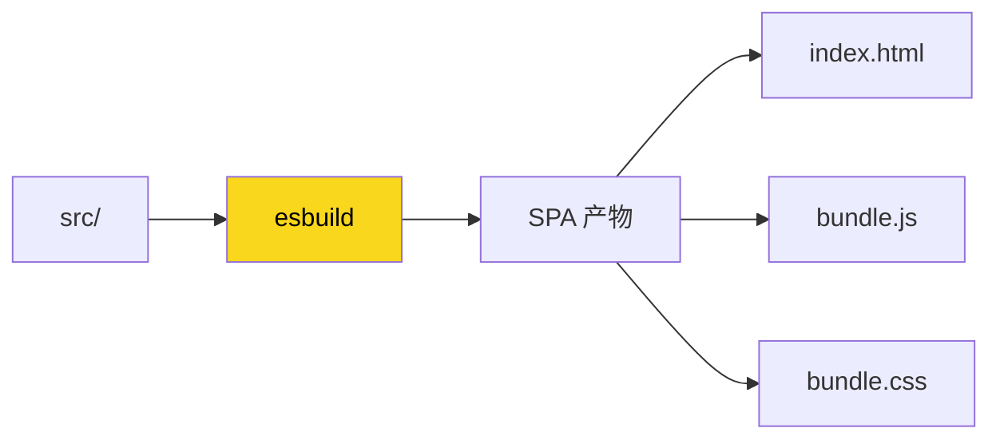
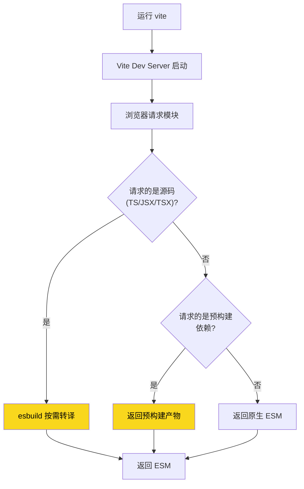



+++
title = "第4章 esbuild用在哪里"
weight = 40
date = "2026-03-28T11:54:00+08:00"
type = "docs"
description = ""
isCJKLanguage = true
draft = false
+++

## 4.1 前端项目构建

### 4.1.1 单页面应用（SPA）

**单页面应用**（Single Page Application，简称 SPA）是这些年最流行的前端架构之一。

它的特点是：整个应用只有一个 HTML 页面，后续的页面切换不需要从服务器加载新页面，而是通过 JavaScript 动态渲染不同的"视图"（View）。用户感觉页面在切换，实际上整个页面从来没刷新过——这就像看电视剧不换台，而是让演员在同一个舞台上换布景。

常见的 SPA 框架有：React、Vue、Angular、Svelte。

这些框架的开发，都离不开构建工具。esbuild 在 SPA 项目里的主要作用是：

- **开发阶段**：快速转译 TypeScript / JSX / TSX，让开发服务器几乎瞬间启动
- **生产阶段**：打包所有模块、压缩代码、生成产物



### 4.1.2 多页面应用（MPA）

**多页面应用**（Multi-Page Application，简称 MPA）是传统的网页架构——每个"页面"都是服务器返回的一个完整的 HTML 文件。

MPA 和 SPA 不是非此即彼的关系。很多大型应用其实是两者的结合：整体是 SPA 结构，但某些特定页面（比如后台管理、统计报表）可能走传统的多页面模式。

esbuild 处理 MPA 也很简单——你只需要指定多个入口文件，它会为每个入口生成一个独立的打包产物：

```javascript
// esbuild 配置多页面应用
esbuild.build({
  entryPoints: ['src/home.js', 'src/about.js', 'src/contact.js'],
  bundle: true,
  outdir: 'dist',
  // 每个入口会生成对应的 bundle：home.js, about.js, contact.js
});
```

### 4.1.3 静态站点生成（SSG）

**静态站点生成**（Static Site Generation，简称 SSG）是一种"提前渲染"的技术——在构建阶段就把页面渲染成 HTML 文件，用户访问时直接返回这些静态文件，不需要服务器实时渲染。

常见的 SSG 框架有：Astro、Next.js（静态导出模式）、Hugo（Go 写的，比 esbuild 还快 😄）。

esbuild 在 SSG 里的角色是：**负责把所有 JavaScript 代码打包、压缩、处理好**，让 SSG 框架可以把精力放在生成 HTML 上。

---

## 4.2 类库与 npm 包开发

### 4.2.1 多格式输出（ESM / CJS / IIFE）

类库（Library）和普通应用不一样。普通应用只需要打包成一个或几个 bundle 给浏览器用，而类库需要**同时输出多种格式**，因为使用这个类库的开发者环境各不相同：

- **ESM**（ES Modules）：现代浏览器和打包工具使用，`import` 语法
- **CJS**（CommonJS）：Node.js 环境使用，`require()` 语法
- **IIFE**：直接插入 `<script>` 标签使用，全局变量模式

esbuild 可以一次性输出多种格式，只需要给 `build()` 调用加个循环：

```javascript
const formats = ['esm', 'cjs', 'iife'];

for (const format of formats) {
  await esbuild.build({
    entryPoints: ['src/index.ts'],
    outfile: `dist/index.${format === 'esm' ? 'mjs' : format === 'cjs' ? 'js' : 'global.js'}`,
    bundle: true,
    format: format,              // 输出格式：esm | cjs | iife
    platform: format === 'iife' ? 'browser' : 'node', // 平台不同，配置也不同
    minify: true,                // 类库生产构建必须压缩
  });
  console.log(`✅ 已生成 ${format} 格式`);
}
```

输出结果：

```text
✅ 已生成 esm 格式
✅ 已生成 cjs 格式
✅ 已生成 iife 格式
```

```text
dist/
├── index.mjs      // ESM 格式，给现代打包工具用
├── index.js       // CJS 格式，给 Node.js 用
└── index.global.js // IIFE 格式，直接 <script> 引用
```

### 4.2.2 TypeScript 类型声明文件（.d.ts）生成（需借助 dts 插件或 tsc）

JavaScript 代码能跑，但如果你想让使用你的类库的开发者获得"智能提示"（IDE 的自动补全功能），就需要提供 **TypeScript 类型声明文件**（`.d.ts` 文件）。

问题来了：esbuild **不支持直接生成 `.d.ts` 文件**。

这不是 esbuild 的 bug，而是它的设计选择——类型声明生成是一个非常复杂的功能，涉及大量的类型推断逻辑。esbuild 的定位是"极速打包"，如果它还要花大量时间来生成类型声明，速度优势就没了。

目前主流的解决方案有两个：

**方案一：dts-cli（独立 CLI 工具）**

`dts-cli` 本质上是一个独立运行的 CLI 工具（而非 esbuild 插件），它底层调用 TypeScript 编译器（tsc）的 API 来生成 `.d.ts` 类型声明文件，与 esbuild 的打包过程互不干扰——换句话说，它是 esbuild 的"外挂博士"，专门负责收拾类型声明这个烂摊子。

```bash
npm install --save-dev dts-cli
```

安装后，在 package.json 的 scripts 中把 `dts-cli` 作为构建前的钩子调用（先生成类型声明，再打包）：

```json
{
  "scripts": {
    "build": "dts-cli --project . && esbuild src/index.ts --bundle --outdir=dist --format=esm"
  }
}
```

`dts-cli` 读取 tsconfig.json 和源码后，会为所有导出的类型生成对应的 `.d.ts` 文件。

**方案二：单独运行 tsc**

如果你本来就用 TypeScript 写类库，最简单的方式是打包完成后，再单独跑一次 `tsc --declaration` 来生成类型文件：

```bash
# package.json scripts
{
  "scripts": {
    "build": "tsc --declaration && esbuild src/index.ts --bundle --outdir=dist --format=esm"
  }
}
```

### 4.2.3 npm 包发布流程

把类库发布到 npm 的流程，大致分这么几步：

**第一步：编写代码**

用 TypeScript 写好你的类库逻辑，导出要公开的 API。

**第二步：构建**

用 esbuild 打包，输出多种格式（ESM、CJS、IIFE）。

**第三步：配置 package.json**

```json
{
  "name": "my-awesome-lib",
  "version": "1.0.0",
  "main": "dist/index.js",         // CJS 入口
  "module": "dist/index.mjs",      // ESM 入口
  "unpkg": "dist/index.global.js", // CDN 入口
  "files": ["dist"],                // 只上传 dist 目录
  "scripts": {
    "build": "node scripts/build.js"
  }
}
```

**第四步：发布**

```bash
npm login        // 登录 npm 账号
npm publish      // 发布包
```

**第五步：用户使用**

```javascript
// ESM 用户
import { myFunc } from 'my-awesome-lib';

// CJS 用户
const { myFunc } = require('my-awesome-lib');

// CDN 用户
<script src="https://unpkg.com/my-awesome-lib/dist/index.global.js"></script>
```

---

## 4.3 Node.js 项目构建

### 4.3.1 后端代码打包

esbuild 不仅能打包前端代码，也能打包 Node.js 代码。

有时候你想把后端代码打包成一个文件，方便部署——不需要在服务器上安装一堆 npm 依赖，打包后的文件自带所有依赖，走到哪都能跑。

```javascript
esbuild.build({
  entryPoints: ['src/server.js'],
  bundle: true,
  platform: 'node',      // 目标平台：Node.js
  format: 'cjs',          // 输出 CommonJS 格式
  outfile: 'dist/server.js',
  // external 里的模块不会被打包，保持 require() 调用
  external: ['fs', 'path', 'http'],
});
```

注意 `external` 参数——Node.js 内置模块（`fs`、`path`、`http` 等）不需要打包，应该保持 `require()` 调用，让 Node.js 运行时去加载。

### 4.3.2 命令行工具（CLI）构建

如果你用 Node.js 写了一个命令行工具，想打包成一个可以直接执行的二进制文件（不需要用户安装 Node.js），esbuild 也能帮你做到。

```javascript
esbuild.build({
  entryPoints: ['src/cli.js'],
  bundle: true,
  platform: 'node',
  format: 'cjs',
  outfile: 'dist/cli',
  banner: {
    // 给输出文件加一个 shebang，让它可以直接执行
    js: '#!/usr/bin/env node',
  },
});
```

```bash
chmod +x dist/cli   # 添加执行权限
./dist/cli           # 直接运行，不用 node cli.js 了
```

---

## 4.4 集成于其他工具链

### 4.4.1 Vite（开发时 esbuild 负责转译，生产时 Rollup 打包 + esbuild 转译/压缩）

Vite 可以说是 esbuild 最重量级的"用户"了——没有之一。

Vite 的开发服务器之所以能"秒开"，全靠 esbuild 在背后做转译。当你运行 `vite` 的时候，esbuild 会立即把你的 TypeScript、JSX、TSX 代码转成 JavaScript，整个过程只需要几百毫秒——比 Webpack 的"热身"快了几十倍。

Vite 还会对第三方的大依赖包（比如 `lodash`、`date-fns`）进行**依赖预构建**（pre-bundling），将大量内部模块打包成一个文件，减少浏览器的请求次数。这解决了 ESM 下 600+ 个请求的问题。这一预构建过程始终由 esbuild 完成，速度非常快（Vite 不同版本实现可能略有差异，但核心始终是 esbuild）。预构建主要在开发模式下进行（SSR 等特殊场景也会触发）。



在生产模式下，Vite 使用 Rollup 作为打包器，而 **Rollup 内部通过 `@rollup/plugin-esbuild` 插件调用 esbuild** 来完成代码转译（TypeScript / JSX → JavaScript）和代码压缩——这两者都是 esbuild 最擅长的场景。

### 4.4.2 Rollup（通过 @rollup/plugin-esbuild 使用 esbuild 作为转译器和压缩器）

Rollup 是一个专注于"打包类库"的工具，它输出的代码非常干净，特别适合做 npm 包——简直是为类库而生的"处女座"打包工具。

但 Rollup 本身不支持 TypeScript 和 JSX，需要借助插件。传统方案是 `@rollup/plugin-typescript`（用 tsc 转译）或 `@rollup/plugin-babel`（用 Babel 转译）。

而 `@rollup/plugin-esbuild` 就是用 esbuild 来替代这两者——转译速度比 tsc 和 Babel 快很多：

```bash
npm install --save-dev @rollup/plugin-esbuild esbuild
```

```javascript
// rollup.config.js
import esbuild from '@rollup/plugin-esbuild';

export default {
  input: 'src/index.ts',
  output: {
    file: 'dist/index.js',
    format: 'esm',
  },
  plugins: [
    esbuild({
      // esbuild 的配置项都可以在这里传
      target: 'es2015',
      minify: true,
    }),
  ],
};
```

### 4.4.3 webpack（通过 esbuild-loader 使用 esbuild 作为代码转换 loader）

webpack 是最流行的打包工具，生态极其丰富（光插件就有上万个 😱），但速度一直是痛点——特别是当你改了一行代码，等 Webpack 重新打包要 30 秒的时候，那种绝望感，懂的人都懂。

`esbuild-loader` 让你在 webpack 里用 esbuild 来做代码转换（TypeScript、JSX），替换掉原本的 `ts-loader`、`babel-loader` 等，速度可以提升好几倍：

```bash
npm install --save-dev esbuild-loader
```

```javascript
// webpack.config.js
module.exports = {
  module: {
    rules: [
      {
        test: /\.tsx?$/,
        use: [
          {
            loader: 'esbuild-loader',
            options: {
              loader: 'tsx',
              target: 'es2015',
            },
          },
        ],
      },
    ],
  },
};
```

### 4.4.4 Gulp / Grunt 任务流集成

Gulp 和 Grunt 是老一代的任务运行器（Task Runner），它们本身不负责打包，而是负责把各种工具串联起来，组成一个自动化流水线——有点像是装修队的包工头，只管协调工人干什么活，活儿本身还是得工人来做。

esbuild 可以无缝集成到 Gulp 的任务流里——说白了，Gulp 负责编排流程，esbuild 负责拼命干活，各司其职，合作愉快：

```javascript
// gulpfile.js
const gulp = require('gulp');
const esbuild = require('esbuild');

gulp.task('build:js', async () => {
  const fs = require('fs');
  const path = require('path');
  // esbuild 的 entryPoints 原生支持 glob 模式（如 src/**/*.js），
  // 但如果需要更精细地控制文件收集逻辑，也可以自行处理
  const srcFiles = fs.readdirSync('src')
    .filter(f => f.endsWith('.js'))
    .map(f => path.join('src', f));

  await esbuild.build({
    entryPoints: srcFiles,
    bundle: true,
    outdir: 'dist',
    minify: true,
  });
});

gulp.task('default', gulp.series('build:js'));
```

### 4.4.5 各类脚手架工具内部集成

除了上面提到的主流工具，还有很多脚手架工具在内部使用了 esbuild：

- **Remix**：React Router 团队打造的元框架，默认用 esbuild 做构建
- **SvelteKit**：Svelte 的官方应用框架
- **Astro**：专注于内容网站的静态站点生成器
- **Solid Start**：Solid.js 的元框架

这些工具的选择说明了一个事实：esbuild 已经成为了前端基础设施的一部分，它的"极速"特性让它成为了很多现代工具的默认选择。

---

## 4.5 适用场景与不适用场景

### 4.5.1 ✅ 适合：中小型项目、极速构建、类库开发、需要编译 TypeScript/JSX 的场景

esbuild 在以下场景下是绝佳选择：

**中小型项目**：项目模块数量不太多（几百个文件以内），不需要复杂的打包策略，esbuild 的速度优势能发挥到极致。

**需要极速构建的 CI/CD 流水线**：在自动化部署流程里，构建速度直接影响部署效率。用 esbuild 可以把构建时间从几十秒压缩到几秒。

**类库开发**：类库需要同时输出多种格式（ESM、CJS、IIFE），esbuild 对格式支持很好，而且打包出来的代码干净简洁。

**TypeScript/JSX 项目**：esbuild 内置 TypeScript 和 JSX 转译，不需要额外安装 Babel 或 tsc，配置简单到"写完就跑"的程度（当然，生成 `.d.ts` 类型声明文件还是得靠 `dts-cli` 或 `tsc` 来完成，这是唯一需要"外援"的地方）。

### 4.5.2 ❌ 不适合：超大型复杂项目、深度自定义打包策略、需要丰富插件生态的场景

但 esbuild 不是银弹，以下场景它可能不是最佳选择：

**超大型项目（ thousands of modules）**：虽然 esbuild 单次构建快，但缺乏原生的持久化缓存机制（`--incremental` 仅支持同进程内的增量构建，重启后失效）。对于超大型项目，Rollup + 持久缓存可能更适合。

**深度自定义打包策略**：如果你需要做一些很复杂的打包逻辑，比如把某个特定的模块拆到一个单独的文件里、根据条件动态决定打包策略——这些场景 esbuild 可能满足不了你。

**丰富的插件生态需求**：Webpack 有上万个插件，Rollup 的插件生态也很成熟。而 esbuild 的插件生态虽然增长很快，但相比之下还是少了很多。

---

## 本章小结

本章我们探讨了 esbuild 的典型应用场景。

**前端项目构建**：无论是 SPA、MPA 还是 SSG，esbuild 都能胜任，特别是在开发服务器场景下用它做极速转译，能带来飞一般的开发体验。

**类库与 npm 包开发**：esbuild 能一次性输出多种格式（ESM、CJS、IIFE），是类库开发的好帮手。虽然不直接支持生成 `.d.ts`，但可以用 dts-cli 或 tsc 来补充。

**Node.js 项目构建**：打包后端代码、打包命令行工具，esbuild 都能搞定，而且输出干净。

**集成到其他工具链**：Vite、Rollup、webpack、Gulp 等主流工具都可以和 esbuild 配合。Vite 把 esbuild 当作开发服务器的引擎，Rollup 用 esbuild 做转译，webpack 用 esbuild-loader 提速。

**适用场景总结**：中小型项目、极速构建、类库开发这些场景是 esbuild 的主场；超大型复杂项目、深度自定义打包策略可能需要 Rollup 或 Webpack。

下一章我们将进入实战环节：怎么安装 esbuild、怎么用命令行、怎么写配置文件——一步一步教你把 esbuild 用起来。
