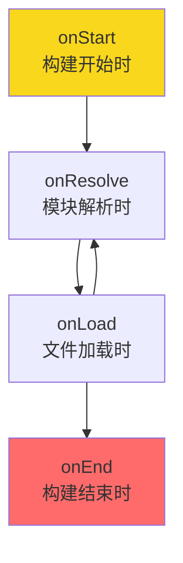



+++
title = "第7章 配置参考"
weight = 70
date = "2026-03-28T11:54:00+08:00"
type = "docs"
description = ""
isCJKLanguage = true
draft = false
+++

## 7.1 入口与出口配置

### 7.1.1 entryPoints（入口文件 / 多个入口）

`entryPoints` 是 esbuild 构建的起点，可以是单个文件，也可以是多个文件：

```javascript
// 单个入口
await esbuild.build({
  entryPoints: ['src/index.js'],
  outfile: 'dist/index.js',
});

// 多个入口 —— 每个入口会生成对应的输出文件
await esbuild.build({
  entryPoints: ['src/home.js', 'src/about.js', 'src/contact.js'],
  outdir: 'dist',
});
// 生成：dist/home.js、dist/about.js、dist/contact.js
```

### 7.1.2 stdin（从标准输入读取代码，适用于特殊构建场景）

`stdin` 配置让你不需要文件，直接从命令行或管道输入代码：

```javascript
await esbuild.build({
  stdin: {
    contents: `import { greeting } from './utils.js'; console.log(greeting);`,
    resolveDir: './src',  // 指定解析模块时的基准目录
  },
  outfile: 'dist/bundle.js',
});
```

这个配置很少用，但在某些特殊场景下很有用，比如用其他工具生成代码后传给 esbuild 打包。

### 7.1.3 outdir / outfile（输出目录 / 文件）

```javascript
// outfile：指定输出文件路径（单入口时使用）
await esbuild.build({
  entryPoints: ['src/index.js'],
  outfile: 'dist/bundle.js',
});

// outdir：指定输出目录（多入口时使用）
await esbuild.build({
  entryPoints: ['src/home.js', 'src/about.js'],
  outdir: 'dist',
});
// 生成：dist/home.js、dist/about.js
```

注意：`outfile` 和 `outdir` 只能选一个，不能同时用——esbuild 在这里的态度是："鱼和熊掌，不可兼得，想好了再选。"

### 7.1.4 outbase（输出基础路径，影响目录结构）

```javascript
// 不指定 outbase —— 输出文件结构与源文件目录一致
await esbuild.build({
  entryPoints: ['src/pages/home.js'],
  outdir: 'dist',
});
// 输出：dist/pages/home.js

// 指定 outbase —— 去掉 src 部分
await esbuild.build({
  entryPoints: ['src/pages/home.js'],
  outbase: 'src',  // 关键：告诉 esbuild 基准目录是 src
  outdir: 'dist',
});
// 输出：dist/pages/home.js （而不是 dist/src/pages/home.js）
```

### 7.1.5 outExtension（自定义输出文件的扩展名映射，如 `{ '.js': '.mjs' }`）

有时候你想让输出的文件扩展名和输入不一样，比如把 `.js` 输出成 `.mjs`：

```javascript
await esbuild.build({
  entryPoints: ['src/index.js'],
  outdir: 'dist',
  outExtension: {
    '.js': '.mjs',  // 输出的 .js 变成 .mjs
  },
});
// 输出：dist/index.mjs
```

### 7.1.6 splitting（代码分割，仅 esm + browser + 动态 import 场景）

代码分割能让打包产物分成多个文件，浏览器按需加载——代价是你得同时满足三个条件（esm + browser + 动态 import），缺一不可。esbuild 在这里很有原则：不给足条件就罢工，不给你"我以为你能用"的幻想。

> **补充**：`chunkNames` 用于自定义 chunk 文件的命名模板（如 `chunkNames: 'chunks/[name]-[hash]'`），属于进阶用法，本节不展开。

```javascript
await esbuild.build({
  entryPoints: ['src/index.js'],
  outdir: 'dist',
  bundle: true,
  format: 'esm',     // 必须用 ESM 格式
  splitting: true,   // 开启代码分割
  platform: 'browser', // 只能在浏览器环境使用
});
```

```javascript
// src/index.js
import('./moduleA.js'); // 这行会触发代码分割
```

代码分割后，会生成多个 chunk 文件，浏览器加载 `index.js` 时，会在需要时再去加载 chunk 文件。

### 7.1.7 absWorkingDir（绝对工作目录）

`absWorkingDir` 指定构建时的工作目录，所有相对路径都会基于这个目录来解析：

```javascript
await esbuild.build({
  absWorkingDir: '/home/user/project',  // 绝对路径
  entryPoints: ['src/index.js'],
  outdir: 'dist',
});
```

### 7.1.8 allowOverwrite（允许覆盖已存在的输出文件）

默认情况下，esbuild 不允许覆盖已经存在的文件——这是 esbuild 的"安全模式"，防止你一不小心把重要的输出文件覆盖掉，痛哭流涕。

```javascript
await esbuild.build({
  entryPoints: ['src/index.js'],
  outdir: 'dist',
  // allowOverwrite: false  // 默认值，不允许覆盖
});
// 如果 dist/index.js 已存在，会报错
```

如果要覆盖已存在的文件，设置为 `true`：

```javascript
await esbuild.build({
  entryPoints: ['src/index.js'],
  outdir: 'dist',
  allowOverwrite: true,  // 允许覆盖已存在的文件
});
```

### 7.1.9 write（控制是否将产物写入文件系统，false 可用于内存操作）

```javascript
// 默认 true —— 写入文件系统
await esbuild.build({
  entryPoints: ['src/index.js'],
  outdir: 'dist',
  write: true,
});

// write: false —— 不写入文件系统，返回结果对象
const result = await esbuild.build({
  entryPoints: ['src/index.js'],
  outdir: 'dist',
  write: false,
  metafile: true,  // 需要开启 metafile 才能获取详细信息
});

console.log(result.outputFiles); // 产物文件的 Buffer 数组
// 可以自己决定如何处理这些文件，比如上传到 CDN
```

---

## 7.2 格式与平台配置（format / platform）

### 7.2.1 format：esm / cjs / iife 的适用场景

| 格式 | 适用场景 | 特点 |
|------|---------|------|
| `esm` | 现代浏览器、打包工具 | `import`/`export`，支持 Tree Shaking |
| `cjs` | Node.js 环境 | `require()`/`module.exports`，Node.js 原生支持 |
| `iife` | 直接 `<script>` 引用 | 立即执行函数，全局变量模式 |

```javascript
// ESM 格式
await esbuild.build({
  entryPoints: ['src/index.js'],
  outfile: 'dist/index.mjs',
  format: 'esm',
});

// CJS 格式
await esbuild.build({
  entryPoints: ['src/index.js'],
  outfile: 'dist/index.js',
  format: 'cjs',
});

// IIFE 格式
await esbuild.build({
  entryPoints: ['src/index.js'],
  outfile: 'dist/index.global.js',
  format: 'iife',
});
```

### 7.2.2 platform：browser / node / neutral 的差异

| 平台 | 特点 |
|------|------|
| `browser` | 把 Node.js 内置模块标记为外部依赖；**bundled 时默认 format 为 esm**，非 bundled 时默认 iife |
| `node` | 把 Node.js 内置模块标记为外部依赖；**bundled 时默认 format 为 esm**，非 bundled 时默认 cjs |
| `neutral` | 不做平台特定处理，保持 require() 调用 |

> **注意**：`platform` 的默认 format 与是否 `bundle` 有关。bundled 模式下默认 esm，非 bundled 模式下 browser 默认 iife、node 默认 cjs。

### 7.2.3 format 与 platform 组合的最佳实践

```javascript
// 浏览器应用：ESM + browser
await esbuild.build({
  entryPoints: ['src/app.js'],
  outdir: 'dist',
  platform: 'browser',
  format: 'esm',
});

// Node.js 类库：CJS + node
await esbuild.build({
  entryPoints: ['src/index.ts'],
  outdir: 'dist',
  platform: 'node',
  format: 'cjs',
});

// 通用场景：neutral + esm
await esbuild.build({
  entryPoints: ['src/lib.js'],
  outdir: 'dist',
  platform: 'neutral',
  format: 'esm',
});
```

### 7.2.4 mainFields（模块解析优先字段，如 main / module / exports）

当一个 npm 包在 `package.json` 里同时提供了多个入口文件时，`mainFields` 决定 esbuild 优先使用哪个：

```javascript
// 比如 lodash 的 package.json 可能是这样的：
// {
//   "main": "lodash.js",
//   "module": "lodash.esm.js",
//   "exports": { ".": { "import": "lodash.esm.js", "require": "lodash.js" } }
// }

await esbuild.build({
  entryPoints: ['src/index.js'],
  outfile: 'dist/bundle.js',
  mainFields: ['module', 'main'],  // 优先用 module 字段，没有再用 main
});
```

### 7.2.5 conditions（exports field 条件导出）

`exports` 是 `package.json` 的一个字段，用于精细控制包的导出。使用 `conditions` 可以指定解析时的条件：

```javascript
await esbuild.build({
  entryPoints: ['src/index.js'],
  outfile: 'dist/bundle.js',
  conditions: ['import', 'module', 'node'],  // 解析时的条件列表
});
```

---

## 7.3 JSX 配置

### 7.3.1 jsx（JSX 处理模式：automatic / transform / preserve）

`jsx` 配置决定 JSX 如何被转译：

| 模式 | 说明 |
|------|------|
| `automatic` | React 17+ 的新 JSX 转换，自动导入 JSX 运行时（推荐） |
| `transform` | React 17 之前的转换，需要手动 import React（esbuild 的内部名称是 transform） |
| `preserve` | 保留原始 JSX，不做任何转换，适合集成到其他工具链 |

```javascript
// 自动模式（React 17+ 推荐）
await esbuild.build({
  entryPoints: ['src/app.jsx'],
  jsx: 'automatic',  // 自动导入 jsx-runtime，不需要手动 import React
});

// transform 模式（需要手动 import React）
await esbuild.build({
  entryPoints: ['src/app.jsx'],
  jsx: 'transform',
});
```

### 7.3.2 jsxFactory / jsxFragment（自定义 JSX 元素 / 片段创建函数）

```javascript
// 使用 Preact 的 h 和 Fragment
await esbuild.build({
  entryPoints: ['src/app.jsx'],
  jsxFactory: 'h',           // JSX 元素用 h() 创建
  jsxFragment: 'Fragment',    // JSX 片段用 Fragment 创建
});
```

### 7.3.3 jsxImportSource（自动导入 JSX 运行时来源，如 react / preact）

```javascript
// 自动从 preact 导入 jsx-runtime
await esbuild.build({
  entryPoints: ['src/app.jsx'],
  jsxImportSource: 'preact',
});
// esbuild 会自动加上：import { jsx as _jsx, jsxs as _jsxs } from 'preact/jsx-runtime'
```

### 7.3.4 jsxDev（开发模式下保留 JSX 结构便于调试）

```javascript
// 开发模式：保留可读的 JSX 结构
await esbuild.build({
  entryPoints: ['src/app.jsx'],
  jsx: 'automatic',
  jsxDev: true,  // 生成的代码里保留 _jsx/_jsxs 调用，利于调试
});
```

---

## 7.4 加载器配置（loaders）

### 7.4.1 内置加载器（.js / .ts / .jsx / .tsx / .css / .json / .txt）

esbuild 内置支持以下文件类型，**无需显式配置 loader 字段**——esbuild 会根据扩展名自动选择对应的加载器：

```javascript
await esbuild.build({
  entryPoints: ['src/app.tsx'],
  bundle: true,
  outfile: 'dist/bundle.js',
  // loader 字段可以省略，esbuild 会自动识别以下内置类型：
  // loader: {
  //   '.js': 'js',      // ESM JavaScript
  //   '.ts': 'ts',      // TypeScript
  //   '.jsx': 'jsx',    // JSX
  //   '.tsx': 'tsx',    // TSX（TypeScript + JSX）
  //   '.css': 'css',    // CSS
  //   '.json': 'json',  // JSON
  //   '.txt': 'text',   // 文本文件
  // },
});
```

### 7.4.2 自定义文件类型映射（loader 字段指定扩展名对应加载器）

如果你的项目里有自定义扩展名的文件，可以配置对应的 loader：

```javascript
await esbuild.build({
  entryPoints: ['src/app.vue'],
  bundle: true,
  loader: {
    '.vue': 'js',  // 把 .vue 当作 JS 文件处理（实际需要 vue 插件）
  },
  // 但这只是个例子，实际处理 .vue 需要专门的插件
});
```

### 7.4.3 图片 / 字体 / SVG / WASM 等资源加载器

```javascript
await esbuild.build({
  entryPoints: ['src/index.js'],
  bundle: true,
  outdir: 'dist',
  loader: {
    '.png': 'file',    // 输出为独立文件，引用路径保持正确
    '.jpg': 'file',
    '.svg': 'text',    // SVG 可以当作文本内联
    '.woff': 'file',   // 字体文件输出为独立文件
    '.woff2': 'file',
    '.wasm': 'binary', // WebAssembly 二进制文件
  },
});
```

`file` loader 会把资源输出为单独的文件，并在 bundle 里生成对应的引用路径。

### 7.4.4 其他内置 loader 类型

esbuild 还支持以下 loader：

```javascript
loader: {
  '.png': 'dataurl',  // 转成 base64 data URL 内联
  '.svg': 'base64',   // 转成 base64 字符串（不同于 dataurl，不带 mime type 前缀）
  '.css': 'local-css', // CSS Modules 模式，类名本地化
  '.ext': 'default',  // 使用默认加载逻辑
}
```

| loader 类型 | 说明 |
|------------|------|
| `dataurl` | 转成 `data:image/...;base64,xxxx` 格式 |
| `base64` | 转成纯 base64 字符串（不带 mime 前缀） |
| `local-css` | CSS Modules 模式，类名会本地化（如 `._style`） |
| `default` | 使用 esbuild 的默认加载逻辑 |
| `copy` | 复制文件到输出目录（CLI 中使用 `--loader:copy`） |

```javascript
await esbuild.build({
  entryPoints: ['src/index.js'],
  outdir: 'dist',
  loader: {
    // 变成 dataurl 内联进 JS（base64 编码的 data URL）
    '.png': 'dataurl',  // → 

    // 变成文本内联
    '.svg': 'text',

    // 变成二进制
    '.wasm': 'binary',
  },
});

// 注意：esbuild 的 loader 选项只接受扩展名到加载器名称的简单映射，
// 如需处理自定义文件类型（如 .myext），应使用插件的 onLoad 钩子，
// 具体方法参见 7.13 节插件配置。

---

## 7.5 路径解析配置

### 7.5.1 alias（路径别名 / 路径重写）

```javascript
await esbuild.build({
  entryPoints: ['src/index.js'],
  outdir: 'dist',
  alias: {
    '@': 'src',        // @ 指向 src
    '@components': 'src/components',
    '@utils': 'src/utils',
  },
});
```

```javascript
// 现在可以这样写 import
import Button from '@/components/Button.js';  // 自动解析到 src/components/Button.js
import { utilA } from '@utils/a.js';       // 自动解析到 src/utils/a.js
```

### 7.5.2 external（外部依赖，排除打包）

把某些模块标记为"外部依赖"，esbuild 不会把它们打包进来，而是保持 `require()` 或 `import` 调用：

```javascript
await esbuild.build({
  entryPoints: ['src/index.js'],
  outdir: 'dist',
  external: [
    'fs',           // Node.js 内置模块
    'path',         // Node.js 内置模块
    'lodash',       // npm 包，不打包
    './local/*',    // 匹配本地相对路径
  ],
});
```

```javascript
// 标记为 external 后，打包结果会保留 require 调用
const _ = require('lodash');
const fs = require('fs');
```

### 7.5.3 tsconfig.json 路径映射同步（tsconfigPaths 插件）

如果你在 `tsconfig.json` 里配置了路径映射，可以用 `tsconfigPaths` 插件让它在 esbuild 里生效——终于不用两遍路径映射了，感动到想哭。

```bash
npm install --save-dev tsconfig-paths
```

```javascript
import tsconfigPaths from 'tsconfig-paths';

await esbuild.build({
  entryPoints: ['src/index.ts'],
  outdir: 'dist',
  plugins: [
    tsconfigPaths({
      // tsconfig.json 的路径
      baseUrl: './src',
      // paths 配置来自 tsconfig.json
      paths: {
        '@/*': ['./*'],
      },
    }),
  ],
});
```

### 7.5.4 resolveExtensions（自动补全文件扩展名顺序）

当 import 一个不带扩展名的文件时，esbuild 会按顺序尝试补全扩展名：

```javascript
await esbuild.build({
  entryPoints: ['src/index.js'],
  outdir: 'dist',
  resolveExtensions: ['.tsx', '.ts', '.jsx', '.js', '.css', '.json'],
});
```

```javascript
// import './utils' 时，esbuild 按顺序查找：
// ./utils.tsx → ./utils.ts → ./utils.jsx → ./utils.js → ./utils.css → ./utils.json
// 找到第一个存在的就停下
```

### 7.5.5 nodePaths（扩展 node_modules 搜索目录路径）

```javascript
await esbuild.build({
  entryPoints: ['src/index.js'],
  outdir: 'dist',
  nodePaths: ['../../shared_modules'],  // 在 node_modules 找不到时，额外搜索这些目录
});
```

---

## 7.6 代码压缩与混淆配置

### 7.6.1 minify 参数详解

`minify: true` 会同时开启所有压缩优化——让代码从"可读的艺术品"变成"只有机器才懂的密文"。esbuild 会毫不留情地：缩短变量名、删掉空格换行、干掉所有注释……你的 `// TODO: fix this later` 也终将被扫进历史的垃圾堆，消失得无影无踪。

```javascript
await esbuild.build({
  entryPoints: ['src/index.js'],
  outfile: 'dist/index.js',
  minify: true,
});
```

开启后会自动应用以下优化：
- 缩短变量名（`calculateTotalPrice` → `a`——esbuild 的压缩哲学：越短越好）
- 删除空格和换行（代码压缩成一行，这行可能比你的简历还长）
- 删除注释（你的灵魂注释 `// TODO: fix this later` 也一起消失了）
- 简化字符串（某些情况下）

### 7.6.2 mangleProps（属性名混淆，可配合正则精确控制）

只混淆特定属性名，而不是所有变量：

```javascript
await esbuild.build({
  entryPoints: ['src/index.js'],
  outfile: 'dist/index.js',
  minify: true,
  mangleProps: '^_',  // 只有以下划线开头的属性名才会被混淆
});
```

```javascript
// 原始代码
const obj = { _secret: 123, publicProp: 456 };

// 压缩后
const obj = { _s: 123, publicProp: 456 };
// _secret 被混淆成 _s，但 publicProp 没变
```

### 7.6.3 keepNames（保留函数名 / 类名不被混淆）

有些函数名被混淆后会导致问题（比如被反射、或者被外部调用），可以用 `keepNames` 保留它们——说白了就是："这几个名字很重要，别给我乱改"：

```javascript
await esbuild.build({
  entryPoints: ['src/index.js'],
  outfile: 'dist/index.js',
  minify: true,
  keepNames: true,  // 保留所有函数和类的原始名称
});
```

### 7.6.4 drop（数组形式，移除特定类型的语句，如 `["console", "debugger"]`）

删除特定的语句或表达式——适合那些"上线前来不及删 console.log 只能靠这个"的程序员：

```javascript
await esbuild.build({
  entryPoints: ['src/index.js'],
  outfile: 'dist/index.js',
  drop: ['console', 'debugger'],  // 删除所有 console.* 和 debugger 语句
});
```

```javascript
// 原始代码
console.log('debug info');
debugger;  // 断点语句
const secret = 'value';
console.error('error!');

// 压缩后
const secret = 'value';
// 所有 console 和 debugger 都被删掉了
```

### 7.6.5 pure（标记无副作用的函数调用，帮助 Tree Shaking）

告诉 esbuild："这个函数调用没有副作用"。如果一个调用既不使用返回值、也没有可观察的副作用，esbuild 就可以安全地把它整个删掉：

```javascript
await esbuild.build({
  entryPoints: ['src/index.js'],
  outfile: 'dist/index.js',
  pure: ['console.log'],  // 告诉 esbuild：这个 console.log 没有副作用，可以放心删
});
```

### 7.6.6 legalComments（法律注释保留位置：none / inline / eof / linked / external）

法律注释（如 `/*! Copyright ... */`）有时会影响代码体积，legalComments 有五个可选值，总有一款适合你：

```javascript
await esbuild.build({
  entryPoints: ['src/index.js'],
  outfile: 'dist/index.js',
  legalComments: 'none',  // 不保留任何法律注释
});
```

| 值 | 行为 | 适用场景 |
|----|------|---------|
| `none` | 删除所有法律注释 | 追求极致体积 |
| `inline` | 把注释移到相关代码的同一行 | 想保留但不占地方 |
| `eof` | 把所有注释移到文件末尾 | 不影响代码逻辑，但想保留 |
| `linked` | 生成独立的 `.legals.js` 文件，并在主文件末尾加上引用该文件的注释 | 法律要求必须保留注释 |
| `external` | 不生成独立文件，只在主文件末尾生成注释指向外部 `.legals.js`（多文件 bundle 时统一管理） | 多文件 bundle 时统一管理法律注释 |

---

## 7.7 源码映射配置（sourcemap）

### 7.7.1 sourcemap 参数值类型（true / false / inline / external / linked / both）

```javascript
// 生成外部 .map 文件，并在主文件末尾加上 sourceMappingURL
sourcemap: true

// 不生成 sourcemap
sourcemap: false

// 把 sourcemap 内容内联到主文件底部
sourcemap: 'inline'

// 只生成外部 .map 文件，不在主文件里引用
sourcemap: 'external'

// 在主文件末尾引用 .map 文件
sourcemap: 'linked'

// 同时生成外部 .map 文件并内联
sourcemap: 'both'
```

### 7.7.2 sourceRoot（源码根路径配置）

```javascript
await esbuild.build({
  entryPoints: ['src/index.js'],
  outdir: 'dist',
  sourcemap: true,
  sourceRoot: 'https://my-cdn.com/project/src',  // Source Map 里的源码根路径
});
```

### 7.7.3 sourcesContent（是否在 sourcemap 中包含原始源码内容）

```javascript
// 默认 false：Source Map 里不包含原始源码（减小 .map 文件体积）
// 开发者工具会根据 sources 字段的 URL 去服务器上找源码

// 如果设为 true：Source Map 里内联了原始源码内容
// 即使源码文件不在服务器上，开发者工具也能显示源码
await esbuild.build({
  entryPoints: ['src/index.js'],
  outdir: 'dist',
  sourcemap: true,
  sourcesContent: true,
});
```

### 7.7.4 生产环境 sourcemap 配置建议

```javascript
// 生产构建：根据场景决定是否开启 sourcemap
await esbuild.build({
  entryPoints: ['src/index.js'],
  outdir: 'dist',
  minify: true,
  sourcemap: process.env.SENTRY_DSN ? 'linked' : false,  // 接入 Sentry 就开启
});
```

---

## 7.8 全局变量注入（define / inject）

### 7.8.1 define 配置项详解（字符串替换机制）

`define` 的本质是"字符串替换"——把代码里的某个标识符替换成另一个字符串：

```javascript
await esbuild.build({
  entryPoints: ['src/index.js'],
  outfile: 'dist/index.js',
  define: {
    'process.env.NODE_ENV': '"production"',  // 把代码里的 process.env.NODE_ENV 替换成 "production"
  },
});
```

### 7.8.2 环境变量替换（process.env.NODE_ENV 等）

```javascript
await esbuild.build({
  entryPoints: ['src/index.js'],
  outfile: 'dist/index.js',
  define: {
    'process.env.NODE_ENV': JSON.stringify(process.env.NODE_ENV || 'development'),
    'process.env.API_URL': JSON.stringify(process.env.API_URL || 'https://api.example.com'),
  },
});
```

### 7.8.3 全局常量注入

```javascript
await esbuild.build({
  entryPoints: ['src/index.js'],
  outfile: 'dist/index.js',
  define: {
    'VERSION': '"1.0.0"',         // 替换为字符串
    '__DEBUG__': 'true',           // 替换为布尔值
    'PI_VALUE': String(Math.PI),   // 替换为计算后的常量
  },
});
```

### 7.8.4 define 的注意事项（字符串字面量匹配）

`define` 做的是**精确字符串替换**，所以必须匹配到代码里真正出现的形式——这里出错的感觉就像是：钥匙明明差不多，但就是开不了锁。

```javascript
// 如果代码里写的是 process.env.NODE_ENV
define: {
  'process.env.NODE_ENV': '"production"',  // ✅ 能匹配
  'process.env.NODE_ENV': '"development"', // ❌ 不匹配
  'NODE_ENV': '"production"',               // ❌ 不匹配
}
```

### 7.8.5 inject（文件级全局变量注入，替代 define）

有时候你想一次性注入多个全局变量，或者注入比较复杂的代码，用 `define` 就不够用了。这时候可以用 `inject`：

```javascript
// globals.js —— 包含要注入的全局变量
export const process = { env: { NODE_ENV: 'production' } };
export const VERSION = '1.0.0';
```

```javascript
await esbuild.build({
  entryPoints: ['src/index.js'],
  outdir: 'dist',
  inject: ['./globals.js'],  // 自动把这个文件的内容注入到所有模块的顶部
});
```

---

## 7.9 目标环境配置（target）

### 7.9.1 ECMAScript 版本目标（es2020 / esnext）

`target` 决定了你要把代码"降级"到哪个时代的语法——越低的版本，转译越多，产物越大；越高的版本，原样输出，产物越小。这是关于"你想服务多老的浏览器"的哲学问题：

```javascript
// 不转译 ES2020 语法（现代浏览器直呼其名，代码原汁原味）
await esbuild.build({
  entryPoints: ['src/index.js'],
  outfile: 'dist/index.js',
  target: 'es2020',
});

// 转译到 ES2015（IE11 用户也要用？那只能委屈你了）
await esbuild.build({
  entryPoints: ['src/index.js'],
  outfile: 'dist/index.js',
  target: 'es2015',  // ES6 及以上的语法都会被降级，包括 ?.、??、BigInt……
});
```

### 7.9.2 浏览器版本目标（chrome100 / firefox90 / safari15）

```javascript
await esbuild.build({
  entryPoints: ['src/index.js'],
  outfile: 'dist/index.js',
  target: ['chrome100', 'firefox100', 'safari15'],
});
```

esbuild 会根据所有目标浏览器的共同能力来决定哪些语法需要降级。

### 7.9.3 Node.js 版本目标（node16 / node18）

```javascript
await esbuild.build({
  entryPoints: ['src/index.js'],
  outfile: 'dist/index.js',
  platform: 'node',
  target: 'node18',  // 生成兼容 Node.js 18 的代码
});
```

### 7.9.4 browserslist 格式支持（如 `"> 0.5%, last 2 versions"`）

```javascript
// 直接用字符串作为 target，esbuild 会识别为 browserslist
await esbuild.build({
  entryPoints: ['src/index.js'],
  outfile: 'dist/index.js',
  target: '> 0.5%, last 2 versions, not dead',
});
```

### 7.9.5 target 与转译的关系

`target` 决定了 esbuild 需要把代码"降级"到什么程度：

- `target: 'es2020'`：几乎不做降级，因为主流浏览器都支持了
- `target: 'es2015'`：把 ES2020 的 `?.`、`??`、`BigInt` 等降级
- `target: 'es5'`：大量降级，几乎所有现代语法都会被转换（基本上是"新语法"→"远古语法"的翻译工作）

---

## 7.10 TypeScript 配置

### 7.10.1 tsconfig（指定 tsconfig.json 路径，继承其编译选项）

```javascript
await esbuild.build({
  entryPoints: ['src/index.ts'],
  outfile: 'dist/index.js',
  tsconfig: './tsconfig.json',  // 读取 tsconfig.json，继承其配置
});
```

### 7.10.2 独立覆盖 tsconfig 中的特定选项（如 strict / target）

```javascript
await esbuild.build({
  entryPoints: ['src/index.ts'],
  outfile: 'dist/index.js',
  tsconfig: './tsconfig.json',
  // 独立覆盖 tsconfig 中的某些选项
  strict: false,       // 覆盖 tsconfig 里的 strict: true
  target: 'es2015',   // 覆盖 tsconfig 里的 target
});
```

---

## 7.11 日志与调试配置

### 7.11.1 logLevel（日志级别：verbose / debug / info / warning / error / silent）

```javascript
await esbuild.build({
  entryPoints: ['src/index.js'],
  outfile: 'dist/index.js',
  logLevel: 'debug',  // 显示所有日志，包括 debug 信息
});
```

| 级别 | 显示内容 |
|------|---------|
| `verbose` | 最详细的日志，连 esbuild 内部的调试信息都打印出来（除非你正在调试 esbuild 本身，否则一般用不上） |
| `debug` | 所有日志，包括调试信息 |
| `info` | 普通信息和警告 |
| `warning` | 只显示警告 |
| `error` | 只显示错误 |
| `silent` | 静默模式，什么都不输出 |

### 7.11.2 logLimit（错误信息行数限制）

```javascript
await esbuild.build({
  entryPoints: ['src/index.js'],
  outfile: 'dist/index.js',
  logLimit: 5,  // 每个错误最多显示 5 行代码上下文
});
```

### 7.11.3 logOverride（按错误代码覆盖特定日志级别）

```javascript
await esbuild.build({
  entryPoints: ['src/index.js'],
  outfile: 'dist/index.js',
  logOverride: {
    'this-is-undefined': 'silent',  // 把这个警告静默掉
    'call-result-unused': 'warning', // 把这个警告降级为警告（而不是错误）
  },
});
```

### 7.11.4 banner / footer（头部 / 尾部代码注入）

`banner` 和 `footer` 向产物文件的头部和尾部注入代码——适合加版权声明、构建信息、Git hash 什么的。key 可以是任意字符串（常用 `js` 和 `css`）：

```javascript
await esbuild.build({
  entryPoints: ['src/index.js'],
  outfile: 'dist/index.js',
  banner: {
    js: '/* 我的库 v1.0.0 | MIT License */',  // 在 JS 文件开头插入
  },
  footer: {
    js: '/* Built with esbuild */',  // 在 JS 文件末尾插入
  },
});
```

```javascript
// 输出结果
/* 我的库 v1.0.0 | MIT License */
...bundle code...
/* Built with esbuild */
```

---

## 7.12 构建产物分析配置

### 7.12.1 metafile（生成构建产物元数据 JSON，用于分析 bundle 依赖）

```javascript
const result = await esbuild.build({
  entryPoints: ['src/index.js'],
  outdir: 'dist',
  bundle: true,
  metafile: true,  // 开启元数据输出
});

console.log(result.metafile);
// 输出示例：
// {
//   inputs: { 'src/index.js': { ... }, 'src/utils.js': { ... } },
//   outputs: { 'dist/index.js': { ... } }
// }
```

### 7.12.2 metafile 的使用场景（bundle 大小分析、依赖可视化）

`metafile` 最常见的用途是配合 `esbuild --metafile` 来分析 bundle 构成：

```bash
# 构建时生成 metafile
esbuild src/index.js --bundle --outdir=dist --metafile=dist/metafile.json

# 用 bundle-visualizer（或其他可视化工具）分析 dist/metafile.json
```

---

## 7.13 插件配置

### 7.13.1 插件的基本结构（name / setup）

esbuild 插件是一个对象，有两个属性：`name`（插件名称）和 `setup`（初始化函数）：

```javascript
// 一个最简单的插件
const myPlugin = {
  name: 'my-plugin',
  setup(build) {
    // 在这里配置插件的各种拦截器
  },
};
```

### 7.13.2 插件钩子执行顺序（onStart → onResolve → onLoad → onEnd）

esbuild 的插件钩子按以下顺序执行：



> ⚠️ 注意：有些初次接触插件的同学可能会误以为 esbuild 也有 `onDispose` 钩子（隔壁 Rollup 就有），但 esbuild 的插件生命周期里确实没有 `onDispose`——它只在 `PluginBuild` 对象上提供 `onDispose` 回调，用于在 context dispose 时触发清理逻辑，不属于插件钩子范畴。onResolve 和 onLoad 会循环往复，直到所有模块都解析完毕——就像两个永不知疲倦的审核员。

### 7.13.3 onStart 钩子（构建开始时触发）

```javascript
const timingPlugin = {
  name: 'timing',
  setup(build) {
    build.onStart(() => {
      // 注意：onStart 回调触发时再获取时间，而不是在 setup 时
      console.log(`构建开始！时间：${new Date().toISOString()}`);
    });
  },
};
```

### 7.13.4 onResolve 钩子（模块解析拦截，过滤器 filter 与路径处理）

`onResolve` 在 esbuild 尝试解析模块路径时触发，常用于拦截和处理特定路径：

```javascript
const aliasPlugin = {
  name: 'alias',
  setup(build) {
    build.onResolve({ filter: /^@\// }, (args) => {
      // 拦截所有 @/ 开头的导入
      return {
        path: args.path.replace(/^@\//, 'src/'),
        // 重新指向 src/ 目录
      };
    });
  },
};
```

### 7.13.5 onLoad 钩子（文件加载拦截，返回内容或加载结果）

`onLoad` 在加载文件内容时触发，常用于处理特定类型的文件：

```javascript
const textPlugin = {
  name: 'text-plugin',
  setup(build) {
    build.onLoad({ filter: /\.txt$/ }, async (args) => {
      // 读取 .txt 文件内容
      const fs = require('fs');
      const contents = fs.readFileSync(args.path, 'utf8');
      
      // 返回文件内容和加载器类型
      return {
        contents: `export default ${JSON.stringify(contents)}`,
        loader: 'js',
      };
    });
  },
};
```

### 7.13.6 onEnd 钩子（build 结束后、产物写出前触发）

```javascript
const metafilePlugin = {
  name: 'metafile',
  setup(build) {
    let metafile;
    
    build.onEnd((result) => {
      if (result.metafile) {
        console.log('构建完成！');
        console.log('输入文件：', Object.keys(result.metafile.inputs));
        console.log('输出文件：', Object.keys(result.metafile.outputs));
      }
    });
  },
};
```

### 7.13.7 自定义插件实战：处理 .logo 文件

来一个完整的自定义插件示例——处理 `.logo` 自定义文件格式：

```javascript
const logoPlugin = {
  name: 'logo',
  setup(build) {
    // 拦截 .logo 文件的解析
    build.onResolve({ filter: /\.logo$/ }, (args) => {
      return { path: args.path };
    });

    // 处理 .logo 文件内容
    build.onLoad({ filter: /\.logo$/ }, async (args) => {
      // 假设 .logo 文件里就是 SVG 文本
      const fs = require('fs');
      const svg = fs.readFileSync(args.path, 'utf8');
      
      // 把 SVG 变成一个导出的字符串
      return {
        contents: `export default ${JSON.stringify(svg)}`,
        loader: 'js',
      };
    });
  },
};

// 使用这个插件
await esbuild.build({
  entryPoints: ['src/index.js'],
  outfile: 'dist/index.js',
  plugins: [logoPlugin],  // 把插件加到 plugins 数组里
});
```

### 7.13.8 插件加载顺序与 filter 正则

插件的 `filter` 参数是一个正则表达式，用于过滤需要拦截的文件路径：

```javascript
build.onLoad({ filter: /\.png$/ }, ...);  // 只处理 .png 文件
build.onLoad({ filter: /src\/components\// }, ...);  // 只处理 src/components/ 下的文件
build.onLoad({ filter: /.*/ }, ...);  // 处理所有文件
```

### 7.13.9 常用第三方插件

| 插件 | 用途 |
|------|------|
| `vite-plugin-vue` | 处理 Vue 单文件组件（.vue） |
| `esbuild-plugin-less` | 处理 Less 样式 |
| `esbuild-plugin-sass` | 处理 Sass/SCSS |
| `esbuild-plugin-yaml` | 处理 YAML 配置文件 |
| `esbuild-plugin-toml` | 处理 TOML 配置文件 |

---

## 本章小结

本章我们系统地过了一遍 esbuild 的所有核心配置项。

**入口与出口配置**：`entryPoints` 是构建的起点，`outdir`/`outfile` 是产物输出位置，`stdin` 可以从标准输入读取代码，`outExtension` 可以自定义输出扩展名，`splitting` 控制代码分割，`allowOverwrite` 控制覆盖行为，`write` 可以把产物保留在内存里。

**格式与平台配置**：`format` 有 esm/cjs/iife 三种，`platform` 有 browser/node/neutral 三种，两者组合要合理。`mainFields` 和 `conditions` 控制 npm 包的解析优先级。

**JSX 配置**：`jsx` 有 automatic/transform/preserve 三种模式，`jsxFactory`/`jsxFragment` 用于自定义 JSX 转换，`jsxImportSource` 用于自动导入 JSX 运行时。

**加载器配置**：`loaders` 决定不同文件类型的处理方式，内置支持 js/ts/jsx/tsx/css/json/txt，外加 file/text/binary/dataurl 等资源处理方式。

**路径解析配置**：`alias` 做路径别名，`external` 标记外部依赖，`resolveExtensions` 控制扩展名补全顺序，`nodePaths` 扩展模块搜索路径。

**压缩与混淆配置**：`minify` 开启全面压缩，`mangleProps` 混淆特定属性，`keepNames` 保留函数名，`drop` 删除特定语句，`pure` 标记无副作用调用，`legalComments` 控制法律注释位置（none/inline/eof/linked/external 五种模式）。

**源码映射配置**：`sourcemap` 控制映射生成方式，`sourceRoot` 设置源码根路径，`sourcesContent` 决定是否内联源码。

**全局变量注入**：`define` 做字符串替换，`inject` 做文件级注入，两者配合可以完美替代任何全局变量。

**插件系统**：插件由 `name` 和 `setup` 组成，`setup` 里可以注册 `onStart`/`onResolve`/`onLoad`/`onEnd` 钩子，按顺序执行。

配置手册在手，天下你有！下一章附录会给出速查表和术语表，方便日常查阅。
