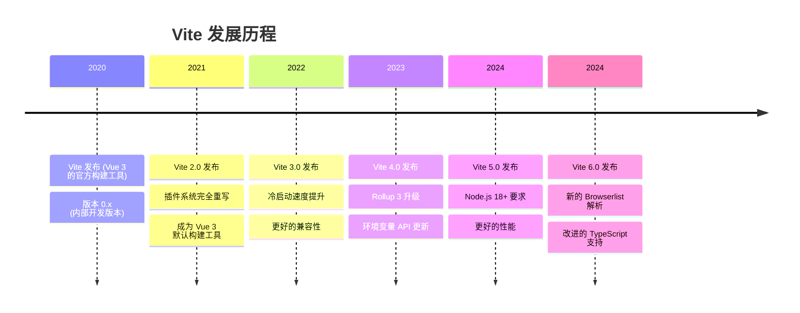
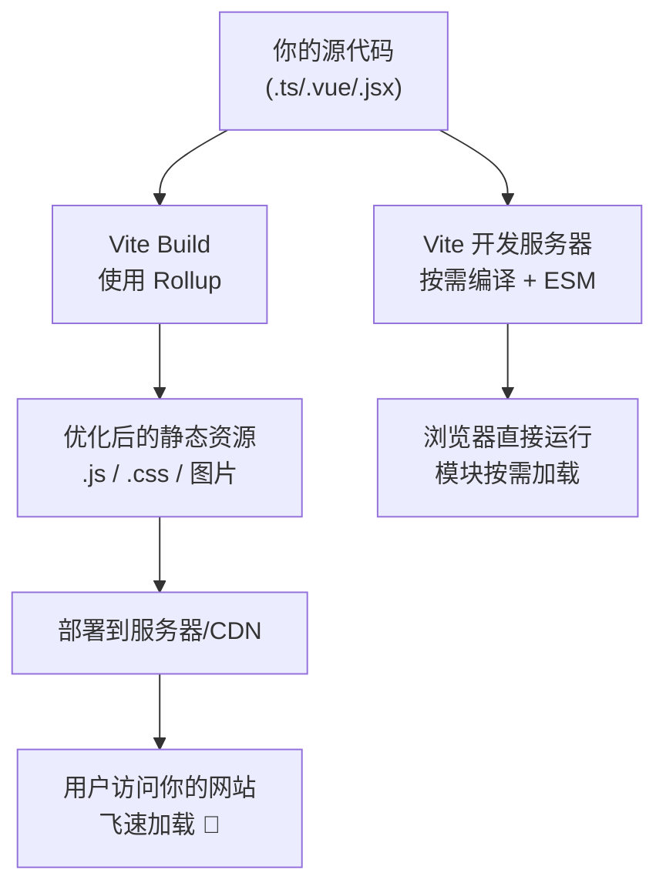
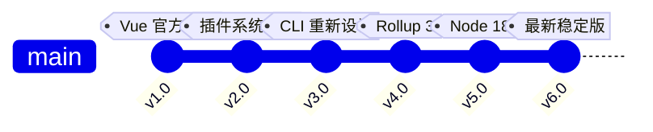
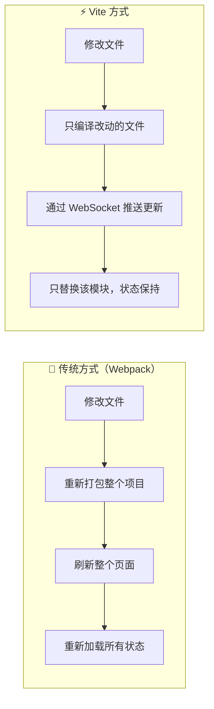

+++
title = "第1章 认识 Vite"
weight = 10
date = "2026-03-27T17:13:00+08:00"
type = "docs"
description = ""
isCJKLanguage = true
draft = false
+++

# Chapter-01-Knowing-Vite

# 第1章：认识 Vite

> 在正式开始之前，让我们先来一场时光旅行。回到2018年，彼时的前端江湖还是 Webpack 的天下。那一年，你打开一个中大型项目，喝了杯咖啡，回来发现——浏览器还在转圈圈。🥲
>
> 就在这时，一位 Vue 的缔造者轻轻挥了挥手，一个名为 **Vite** 的新物种悄然降临。它带来的不是改良，是革命。
>
> 本章我们将搞清楚：Vite 是什么？它从哪来？要往哪去？以及——为什么你应该在2026年把它学透？

---

## 1.1 什么是 Vite

### 1.1.1 Vite 的诞生背景与历史

如果把前端工具链比作一场宫斗剧，那 Vite 的故事绝对是最励志的那一个。

**Vite**（法语单词，读作 `/vit/`，意为"快"）诞生于 **2020年**，由 **Evan You**（尤雨溪）创建并开源。没错，就是那个写了 Vue、Vue Router、Vuex 的男人。可以说，Evan You 是前端界最会"造轮子"的男人之一，每次出手都直击痛点。

让我们来看看 Vite 的诞生背景：

- **痛点**：在 Vite 出现之前，前端项目，尤其是 Vue 项目，在开发时需要经历一个漫长的"打包"过程。Webpack 需要把整个项目代码分析一遍，构建依赖图，然后打包成一个（或几个）巨大的 bundle。这个过程在项目小的时候还能接受，但当项目膨胀到几百个模块时，冷启动时间轻松突破 **30秒甚至几分钟**。开发者就像在等一辆永远不来公交车。
- **时机**：2020年，ES Modules（ESM）在浏览器中已经得到了广泛支持。现代浏览器可以直接通过 `<script type="module">` 和 `import/export` 语法加载原生 ESM 代码，无需提前打包。这意味着，"边运行边转换"成为了可能。
- **灵感来源**：Vite 的开发时模式大量借鉴了 WMR（由 Preact 团队开发的一个创新工具）以及原生浏览器 ESM 的思路。

Vite 项目最初是作为 **Vue 3 的官方构建工具** 发布的，但它的设计从一开始就是**框架无关**的。Vue 团队维护着 Vite，同时也为 React、Svelte、Preact 等框架提供官方模板。

Vite 的 GitHub 仓库从发布之初就受到了社区的热烈追捧，star 数量以惊人的速度增长，如今已成为前端历史上最受欢迎的开源构建工具之一。



### 1.1.2 Vite 的设计理念

Vite 的设计哲学用一句话总结就是：**开发时飞快地运行，生产时优雅地打包。**

这听起来简单，但要理解它为什么能做到"快"，我们需要了解它的两大核心模式：

#### 🛠 开发模式：原生 ESM + No Bundle

在传统的 Webpack 构建模式中，开发者写代码时，Webpack 就已经在后台开始工作了。它会：
1. 从入口文件开始，分析所有 `import` 语句
2. 递归处理每一个依赖
3. 将所有模块打包成一个（或几个）bundle
4. 把打包后的文件发送给浏览器

这个过程叫做 **Bundle（打包）**。对于一个大型项目，这个过程可能需要 **30秒到几分钟**。

而 Vite 在开发模式下，完全抛弃了这种思路。它做了两件聪明的事：

**第一件事：利用浏览器原生 ESM。**

现代浏览器（2017年之后的主流浏览器）已经原生支持了 ES Modules。浏览器可以直接通过 `import` 语句从服务器获取模块。这意味着，**不需要在开发时把代码打包**，浏览器想用什么模块，直接问服务器要就行了！

Vite 的开发服务器就像一个超级智能的快递员：
- 浏览器说："我要 `src/main.js`！"
- Vite 服务器说："好嘞！"然后实时把 `main.js` 转换成浏览器能吃的格式（通常只是做一下语法转换，比如把 TypeScript 转成 JavaScript），然后送给浏览器。
- 浏览器继续说："我看到 `main.js` 里 `import { createApp } from 'vue'`！"于是 Vite 再去找 `vue` 这个包，转换，送过去。
- 浏览器又说："`main.js` 里 `import './style.css'`！"Vite 再次转换，送过去。

整个过程，Vite **从来没有把整个项目打包过**，它只是按需翻译，一块一块地送给浏览器。这就是传说中的 **"Dev Server"（开发服务器）**模式。

**第二件事：依赖预构建（Pre-Bundling）。**

虽然浏览器支持 ESM，但 `node_modules` 里的一些包可能还存在兼容性问题：
- 有些包导出的是 CommonJS 格式（`module.exports`），浏览器不认识
- 有些包有非常多的内部文件（比如 `lodash`），如果浏览器一个一个去请求，会产生**成百上千个 HTTP 请求**，性能反而更差

所以 Vite 使用 **esbuild**（一个由 Go 语言编写的高性能打包工具）在**项目启动时**对依赖进行一次预构建。`esbuild` 快到什么程度？官方说它的打包速度是 Webpack 的 **100倍以上**！预构建的结果会被缓存起来，下次启动直接用。

预构建完成后，开发流程变成这样：

```
浏览器请求 → Vite 服务器拦截 → 按需转换 → 发送给浏览器
```

#### 🏭 生产模式：Rollup 打包

到了生产环境，情况就不同了。浏览器原生 ESM 虽然好，但存在以下问题：
- 过多的 HTTP 请求会导致网络开销变大（每个文件一个请求）
- 源码直接暴露在网络上（安全性问题）
- 浏览器的 ESM 兼容性还是有差异

所以在生产构建时，Vite 会调用 **Rollup**（另一个超快的打包工具）把代码打包成最优化的静态资源。Rollup 擅长"Tree Shaking"——它会分析代码，把没用到的部分毫不留情地删掉，让最终的包体积尽可能小。

**生产构建流程：**



总结一下 Vite 的核心理念：

| 阶段 | 工具 | 特点 |
|------|------|------|
| 开发 | Vite Dev Server + esbuild | 启动极快，按需编译，原生 ESM |
| 生产 | Rollup | 代码分割，Tree Shaking，最优输出 |

### 1.1.3 Vite 与 Webpack、Parcel 的对比

俗话说的好，"没有对比就没有伤害"。让我们来看看 Vite、Webpack 和 Parcel 这三位"打包界"的老大哥们各自的看家本领。

#### Webpack

Webpack 由 Tobias Koppers 于 2012 年创建，至今已有十多年历史。它是前端模块打包的"老前辈"，几乎定义了现代前端工程的范式。

**优点：**
- **生态极其成熟**：Loader（加载器）和 Plugin（插件）多如牛毛，几乎找不到 Webpack 做不了的事情
- **强大的代码分割**：可以精细控制每个 chunk 的生成
- **无与伦比的定制性**：从 entry 到 output，从 module 到 plugin，每一个环节都可以深度定制
- **适合复杂应用**：大型企业级项目、巨无霸应用，Webpack 依然是首选

**缺点：**
- **配置复杂**：写一个完整的 Webpack 配置，可能需要几百行
- **冷启动慢**：大型项目冷启动时间感人
- **热更新（HMR）效率低**：修改一个文件，有时整个 bundle 要重新构建
- **学习曲线陡峭**：新手面对 `module`、`chunk`、`bundle`、`output` 这些概念往往一脸问号

```javascript
// Webpack 5 配置文件示例（仅作对比示意）
// 一个稍微完整的 Webpack 配置大概长这样
// 看看这配置量，够泡一碗面的功夫了 🍜
module.exports = {
  mode: 'development',
  entry: './src/index.js',
  output: {
    filename: '[name].[contenthash].js',
    path: path.resolve(__dirname, 'dist'),
    clean: true,
  },
  module: {
    rules: [
      {
        test: /\.tsx?$/,
        use: 'ts-loader',
        exclude: /node_modules/,
      },
      {
        test: /\.css$/,
        use: ['style-loader', 'css-loader', 'postcss-loader'],
      },
      {
        test: /\.(png|svg|jpg|jpeg|gif)$/i,
        type: 'asset/resource',
      },
    ],
  },
  plugins: [
    new HtmlWebpackPlugin({ template: './src/index.html' }),
    new DefinePlugin({ 'process.env.NODE_ENV': '"development"' }),
  ],
  resolve: {
    extensions: ['.tsx', '.ts', '.js', '.jsx'],
    alias: { '@': path.resolve(__dirname, 'src') },
  },
  devServer: {
    static: './dist',
    hot: true,
    port: 3000,
    proxy: { '/api': 'http://localhost:4000' },
  },
};
// 什么？还没写完？是的，这只是"稍微完整"的程度 😅
```

#### Parcel

Parcel 诞生于 2017 年，由 Toast（Devon Govett）开发。它的 slogan 是：**零配置构建工具**。

**优点：**
- **真正零配置**：不需要写任何配置文件，Parcel 会自动检测项目结构并完成构建
- **开箱即用的多格式支持**：内置支持 JS、CSS、HTML、图片、SVG 等，无需额外配置 loader
- **多线程编译**：利用多核CPU并行处理，加快构建速度

**缺点：**
- **生态不如 Webpack 丰富**：遇到特殊需求时可能需要找社区插件
- **自定义程度有限**：零配置是优点，但当你需要深度定制时，Parcel 的灵活性就显现出不足
- **性能在超大型项目中不如 Vite**：Parcel 虽然快，但在开发体验上仍不及 Vite

#### Vite

**优点：**
- **极速冷启动**：基于原生 ESM，开发服务器几乎瞬间启动（0.5秒~2秒）
- **真正的按需编译**：只编译当前访问的页面需要的代码
- **极快的 HMR**：热更新在50毫秒内完成，不管项目有多大
- **配置简洁**：核心配置非常直观，学习成本低
- **Rollup 生产构建**：生产构建质量高，Tree Shaking 效果出色
- **框架无关**：Vue、React、Svelte、Preact 都能用
- **esbuild 预构建**：依赖解析速度极快

**缺点：**
- **开发时依赖 Node.js Dev Server**：这意味着开发服务器必须运行（好在它资源占用很低）
- **对老旧浏览器支持需要额外插件**：`@vitejs/plugin-legacy` 可以帮忙，但会增加包体积
- **某些特殊场景需要 Rollup 插件知识**：因为 Vite 的插件系统借鉴了 Rollup，所以深入定制时还是要了解 Rollup

**三维度对比：**

| 特性 | Webpack | Parcel | Vite |
|------|---------|--------|------|
| 冷启动速度 | 慢（30s+） | 快（2~5s） | **极快（<2s）** |
| 热更新速度 | 较慢 | 快 | **极快（<50ms）** |
| 配置复杂度 | 高 | **零配置** | 低 |
| 生态成熟度 | **最成熟** | 一般 | 成熟且快速发展 |
| 生产包体积 | 可优化 | 中等 | **最小** |
| 框架支持 | 任何 | 任何 | **任何** |
| 学习曲线 | 陡峭 | 平缓 | **平缓** |

用一张图来总结就是：

```mermaid
bar chart
    title 前端构建工具速度对比 (示意图)
    "Webpack 冷启动": 35
    "Parcel 冷启动": 4
    "Vite 冷启动": 1
    "Webpack HMR": 5
    "Parcel HMR": 2
    "Vite HMR": 0.05
```

> 💡 小提示：上图数字只是示意，真实速度取决于项目规模、硬件配置等因素。但趋势是明确的：**Vite 在开发体验上具有碾压性的速度优势。**

### 1.1.4 Vite 的版本演变

Vite 从 2020 年发布至今，已经经历了多个重大版本的迭代。让我们来回顾一下每个版本的亮点：

#### Vite 1.x (2020年2月)

- 作为 Vue 3 的官方构建工具发布
- 奠定了"极速开发体验"的基础
- 但功能还比较基础，插件系统也比较简单
- 这个版本很多人可能都没用过就已经过去了 😅

#### Vite 2.0 (2021年2月) ⭐ 里程碑版本

- **完全重写了插件系统**：从基于 Rollup 1.x 的插件系统，改为基于 Rollup 插件系统并添加 Vite 特有的钩子（Hooks）
- **支持多框架**：不再只是 Vue 的专属工具，React、Svelte 等框架都可以使用
- **新的 CSS 处理方式**：支持 CSS Modules、PostCSS、CSS 预处理器
- **改进的依赖预构建**：使用 esbuild 进行依赖解析
- **实验性 SSR 支持**：服务端渲染的支持开始成熟

#### Vite 3.0 (2022年7月)

- **更快的冷启动**：通过改进 esbuild 预构建逻辑，进一步提升启动速度
- **新的开发服务器**：更好的 WebSocket 处理，HMR 更稳定
- **Vite CLI 改进**：`create-vite` 脚手架完全重新设计
- **环境变量 API 更新**：`.env` 文件的处理更加灵活
- **更好的 SPA 和 MPA 支持**：多页面应用配置更简洁

#### Vite 4.0 (2022年12月)

- **升级到 Rollup 3**：利用 Rollup 3 的改进，进一步优化构建产物
- **更好的兼容性**：改进了对各种边缘情况的处理
- **插件系统增强**：新增了一些实用的插件钩子
- **改进的 TypeScript 支持**：TS 配置更加智能

#### Vite 5.0 (2023年11月)

- **Node.js 18+ 要求**：不再支持 Node.js 16，顺应 Node.js 长期支持版本的变化
- **移除过时功能**：清理了一些废弃的 API
- **更快的构建速度**：Rollup 4 的升级带来了更好的性能
- **改进的 Worker 支持**：Web Worker 的使用更加便捷
- **更好的日志输出**：开发服务器的日志更加清晰易读

#### Vite 6.0 (2024年)

- **改进的 Browserlist 解析**：更智能的目标浏览器检测
- **更好的 TypeScript 5.x 支持**：利用 TypeScript 最新特性的优势
- **环境变量改进**：`loadEnv` 函数更加健壮
- **更好的 Wasm 支持**：WebAssembly 模块的处理更加完善
- **生态系统继续壮大**：更多官方和社区插件支持 Vite 6



> 📌 **版本选择建议**：如果是新项目，直接使用 Vite 6.x 就对了。如果是维护老项目，可以根据 Node.js 版本来决定——如果 Node.js 是 16，则需要使用 Vite 4.x 或 5.x。

---

## 1.2 为什么要学 Vite

### 1.2.1 开发效率的革命性提升

你有没有过这样的经历：

> 🧑‍💻 早晨到公司，打开电脑，启动项目，喝了杯咖啡（甚至泡了碗面），浏览器才终于显示出"Hello World"。😐

这就是传统打包工具给开发者带来的"时间税"。一个 30 秒启动的项目，一天重复启动个四五次，一周下来浪费的时间可能就是一个小时。这还是保守估计。

Vite 的出现，彻底终结了这种"咖啡等待文化"。它的极速冷启动让你：

- **节省时间**：项目启动从"泡一碗面"变成"打开一罐可乐"的时间
- **保持心流**：开发过程中几乎感受不到工具的存在，代码即所得
- **降低打断成本**：修改配置后无需长时间等待，重启即生效

更妙的是，Vite 的 HMR（热模块替换）快到让你怀疑人生——**文件保存，浏览器瞬间更新，中间连一个转圈圈都不给你看的机会**。

### 1.2.2 构建速度的飞跃

Vite 在构建速度上的提升，来自于它聪明的"按需"策略。

传统的 Webpack 构建，本质上是"先全部打包，再运行"。不管你改了一个字符还是一个文件，它都要重新分析整个世界。

Vite 的构建策略则是"需要什么，打包什么"。在开发时，每个模块按需转换；在生产时，Rollup 只打包真正被使用的代码。

实际数据对比（来自 Vite 官方基准测试，大型 Vue 3 项目）：

| 指标 | Webpack | Vite | 提升 |
|------|---------|------|------|
| 冷启动时间 | 30s~3min | <2s | **15~90倍** |
| 热更新时间 | 1~5s | <50ms | **20~100倍** |
| 生产构建时间 | 30s~2min | 10~30s | **3~6倍** |

### 1.2.3 现代前端开发的趋势

前端世界在 2020 年之后发生了巨大的变化：

- **浏览器对 ESM 的原生支持**：主流浏览器 95%+ 的用户都能使用原生 ESM
- **TypeScript 的普及**：越来越多的项目使用 TypeScript，Vite 对 TS 的支持是原生的
- **组件化开发普及**：Vue、React、Svelte 等框架的组件化开发模式成为主流
- **微前端架构兴起**：大型应用拆分为多个子应用，每个子应用都需要快速启动

Vite 正是为这个新时代而生的工具。它紧紧拥抱了现代浏览器的特性，把开发体验推向了新的高度。

### 1.2.4 Vue、React 官方推荐

**Vue 官方**的态度非常明确：

> Vue 3 的官方文档明确推荐使用 Vite 作为构建工具。Vue 官方团队同时维护着 Vite 的核心项目。

如果你在用 Vue 3，但还在用 Vue CLI（Webpack-based），Vue 官方已经建议你迁移到 Vite 了。Vue CLI 在 2023 年已经进入了维护模式，这意味着不会再有新功能了。

**React 官方**同样：

> React 官方在 2022 年正式将 Vite 列为推荐的构建工具之一，取代了之前的 Create React App（CRA）。React 官方文档中的示例，也从 CRA 迁移到了 Vite。

两大主流框架同时"带货" Vite，这阵仗，你品，你细品。😏

### 1.2.5 庞大的社区生态

Vite 背后有强大的社区支持：

- **官方插件生态**：Vue、React、Vue JSX、Babel 兼容、SSR 等官方维护的插件
- **社区插件爆炸式增长**：从 SVG 图标处理到 PWA 支持，从 Mock 数据到 ESLint 集成，几乎你需要的一切都有现成的插件
- **框架集成**：除了 Vue 和 React，Svelte、Preact、Solid、Qwik、Lit 等框架都有成熟的 Vite 集成方案
- **工具链集成**：Vite 与 TypeScript、PostCSS、Sass、Less、Stylus 等工具的无缝集成

现在你去 npm 上搜索 `vite-plugin`，能找到几百个插件。这就是生态的力量。

### 1.2.6 简单易用的配置

如果说 Webpack 的配置是一门"玄学"，那么 Vite 的配置就是"说明书"。Vite 的核心理念是：**约定优于配置**。大部分情况下，你不需要写任何配置，Vite 就能正常工作。

即使需要配置，Vite 的配置项也非常直观：

```javascript
// vite.config.js
// 95%的情况下，这个文件你只需要写这几行就够了
import { defineConfig } from 'vite'
import vue from '@vitejs/plugin-vue'

export default defineConfig({
  plugins: [vue()], // 加一个 Vue 插件就搞定了
  server: {
    port: 3000,     // 开发服务器端口
    proxy: {        // 代理配置，解决跨域问题
      '/api': 'http://localhost:4000'
    }
  }
})
```

对比 Webpack 那动辄几百行的配置，Vite 简直是"清爽本爽"。👏

---

## 1.3 Vite 的核心特性

### 1.3.1 极速冷启动

Vite 的冷启动速度是它最令人印象深刻的特点之一。让我来解释一下它是怎么做到的：

**传统方式（Webpack）：**
```
启动 → 分析所有模块依赖 → 打包所有代码 → 启动服务器 → 浏览器加载bundle
时间：30秒~3分钟 😰
```

**Vite 方式：**
```
启动 → esbuild预构建依赖（只处理node_modules） → 启动服务器 → 浏览器按需请求模块
时间：<2秒 🚀
```

Vite 之所以这么快，是因为它巧妙地利用了**两个层面的分离**：

1. **依赖层（node_modules）**：由 esbuild 在启动时一次性预构建并缓存。这部分通常比较大（几百个包），但内容相对稳定，不需要每次启动都重新分析。
2. **源代码层（你的业务代码）**：在浏览器请求时实时转换。代码量可能不大，但变化频繁。Vite 只需要转换你实际访问到的部分，而不是整个项目。

这就好比：
- 传统方式：去餐厅吃饭，厨师先把**整个厨房**都准备好，包括所有食材、调料、锅碗瓢盆，然后才开始做你点的菜
- Vite：去餐厅吃饭，厨师已经提前把**所有调料和常用食材**备好了（预构建），你点什么菜，厨师就做什么菜（按需编译）

### 1.3.2 即时热更新（HMR）

**HMR（Hot Module Replacement）** 是指在应用运行过程中，当某个模块发生变化时，只更新该模块，而不需要刷新整个页面或重新加载整个应用。

Vite 的 HMR 速度快到令人发指：**通常在 50 毫秒内完成**。

这意味着，当你：
- 修改了一个 Vue 组件的 `<template>`，页面瞬间更新，但**组件状态保持不变**
- 修改了一个 React 组件的样式，样式瞬间更新，但**React 组件的状态也保持不变**
- 修改了一个 CSS 文件，样式瞬间更新，**整个应用的状态完全不受影响**

HMR 就像是给你的应用装了一个"热插拔"系统——可以在不停止运行的情况下替换组件、样式或逻辑。



### 1.3.3 真正的按需编译

这是 Vite 最核心的设计哲学之一：**never bundle during dev**（开发时不打包）。

Vite 开发服务器不会在启动时打包整个项目。它只是在浏览器请求某个模块时，才实时地将该模块转换成浏览器能理解的格式。

举例说明：

假设你的项目有这样的结构：

```
src/
├── main.js          // 入口文件
├── utils/
│   ├── format.js    // 工具函数
│   └── validate.js  // 验证函数
├── components/
│   ├── Button.vue   // 按钮组件
│   └── Modal.vue    // 弹窗组件
└── styles/
    └── main.css     // 主样式文件
```

在 Webpack 中，启动时会一次性把所有文件打包。
在 Vite 中：

- 浏览器请求 `main.js` → Vite 实时转换 → 返回
- 浏览器发现 `main.js` 里有 `import './styles/main.css'` → 请求 `main.css` → Vite 转换（因为浏览器不能直接运行 CSS） → 返回
- 浏览器发现 `main.js` 里有 `import { formatDate } from './utils/format.js'` → 请求 `format.js` → Vite 转换 → 返回

**按需编译的好处是：项目不管有多大，启动速度都差不多。** 无论你的项目是 10 个文件还是 10000 个文件，Vite 启动都是瞬间的事，因为它根本不打包。

### 1.3.4 开箱即用的配置

Vite 的核心理念之一就是"零配置，但可配置"。对于大部分常见的项目结构，Vite 会自动识别并处理：

- 如果有 `index.html` 在项目根目录，Vite 会自动把它作为入口 HTML
- 如果有 `main.js` 或 `main.ts`，Vite 会自动识别为入口文件
- 如果有 `public` 目录，Vite 会把它当作静态资源目录
- CSS 文件会被自动处理，支持 `import` 和 `@import`
- JSON 文件可以直接 `import`

你甚至不需要告诉 Vite"我用的是 Vue"，只需要安装对应的插件并在配置里注册一下就好了：

```javascript
// vite.config.js
import { defineConfig } from 'vite'
import vue from '@vitejs/plugin-vue'  // 只需要安装并引入 Vue 插件

export default defineConfig({
  plugins: [vue()]  // 注册，一行搞定！
})
```

### 1.3.5 TypeScript 原生支持

Vite 对 TypeScript 的支持是"原生级"的——它内置了 TypeScript 的解析和转译能力，无需额外的 loader 或插件。

Vite 使用 esbuild 来处理 TypeScript，这意味着：

- **TypeScript 转 JavaScript 的速度是 `tsc` 的 20~30 倍**
- Vite 不会进行类型检查（这是 TypeScript 编译器的职责），它只做语法转换
- 类型错误不会阻止开发服务器的运行，你可以在浏览器里一边看着红红的报错，一边修复 TypeScript 问题

如果你想在开发时也进行类型检查，可以使用 `vite-plugin-checker`，它会在开发服务器运行时在后台运行 `tsc --noEmit`。

### 1.3.6 内置 CSS/JSON 导入支持

Vite 对 CSS 和 JSON 的支持是开箱即用的，不需要任何额外配置：

```javascript
// 导入 CSS 文件
import './styles/main.css'  // 自动处理
import styles from './styles/main.css'  // CSS Modules 支持

// 导入 JSON 文件
import packageJson from '../package.json'
console.log(packageJson.name)  // 输出项目名称
```

对于 CSS Modules，Vite 也支持，只需要使用 `*.module.css` 的命名方式：

```css
/* Button.module.css */
.button {
  background-color: blue;
  color: white;
}
```

```javascript
// 在 JS/TS 中使用
import styles from './Button.module.css'

const button = document.createElement('button')
button.className = styles.button  // 自动生成唯一的类名，防止冲突
button.textContent = '点击我'
document.body.appendChild(button)
```

### 1.3.7 智能依赖预构建

前面提到过，Vite 会用 esbuild 对 `node_modules` 中的依赖进行预构建。这个过程是智能的：

1. **CommonJS → ESM 转换**：很多老的 npm 包还在使用 CommonJS 格式（`module.exports`），Vite 会自动把它们转换成 ESM 格式
2. **合并小模块**：像 `lodash` 这样导出成百上千个函数的包，Vite 会把它们合并成更少的文件，减少 HTTP 请求数量
3. **缓存机制**：预构建的结果会被缓存到 `node_modules/.vite` 目录，只有当 `package.json` 或锁文件发生变化时，才会重新预构建

你可以通过 `optimizeDeps` 配置来自定义预构建的行为：

```javascript
// vite.config.js
export default defineConfig({
  optimizeDeps: {
    // 强制预构建某些依赖
    include: ['lodash', 'axios'],
    // 排除某些依赖，强制 Vite 不预构建它们
    exclude: ['some-problematic-package'],
    // esbuild 配置
    esbuildOptions: {
      // 支持 jsx 文件
      loader: { '.js': 'jsx' },
    }
  }
})
```

---

## 1.4 本章小结

### 🎉 本章总结

本章我们一起认识了 Vite 这位前端构建工具界的"新晋网红"。让我们来回顾一下学到了什么：

1. **Vite 的身世**：由 Vue 之父 Evan You 于 2020 年创建，基于浏览器原生 ESM 的极速构建工具

2. **核心设计理念**：开发时按需编译（No Bundle），生产时 Rollup 打包，既享受极速开发体验，又有高质量的生产产物

3. **速度对比**：相比 Webpack 30秒~3分钟的冷启动，Vite 可以做到 <2秒；HMR 从 1~5秒缩短到 <50毫秒

4. **版本演进**：从 2020 年的 v1.0 到如今的 v6.0，Vite 持续进化，生态日益完善

5. **为什么学 Vite**：开发效率革命性提升 + 框架官方推荐 + 社区生态繁荣 + 配置简单

### 📝 本章练习

在开始下一章之前，建议你完成以下小任务：

1. **动动手**：访问 [Vite 官网](https://vitejs.dev/)，感受一下官方文档的氛围，顺便看看 Vite 的版本号是不是已经比我写这个教程时更新了

2. **查一查**：去 GitHub 看看 [Vite 仓库](https://github.com/vitejs/vite)的 star 数量，感受一下它的受欢迎程度

3. **想一想**：在你的工作或项目中，目前用的是什么构建工具？如果是 Webpack，你最想改变它的哪个痛点？

---

> 📌 **预告**：下一章我们将进入实战环节——**环境准备与安装**。我们会手把手教你安装 Node.js、选择包管理器、创建第一个 Vite 项目。敬请期待！
