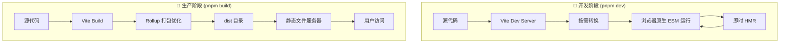
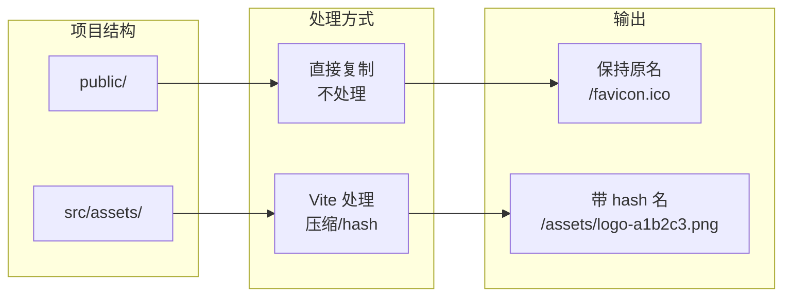

+++
title = "第3章 Vite 基础使用"
weight = 30
date = "2026-03-27T17:13:00+08:00"
type = "docs"
description = ""
isCJKLanguage = true
draft = false
+++

# Chapter-03-Vite-Basics

# 第3章：Vite 基础使用

> 恭喜你成功安装了 Vite，并运行了第一个项目！现在，我们要把这个"会用"变成"用得溜"。
>
> 这一章，我们来细细拆解 Vite 项目的每一个组成部分：入口 HTML 里藏着什么秘密？命令行的各种参数都是干嘛的？ES Modules 怎么玩？CSS、图片、JSON 这些资源怎么导入？路径别名怎么配？
>
> 学完这章，你对 Vite 项目的理解会上一个大台阶。准备好了吗？Let's go! 🚀

---

## 3.1 项目结构详解

### 3.1.1 index.html 的作用

在 Vite 项目中，`index.html` 不再是传统的"一个普通的 HTML 文件"，而是整个应用的**入口 HTML**。这是 Vite 与传统打包工具最大的区别之一。

**传统 Webpack 项目中**，入口 HTML 通常是由插件（如 `HtmlWebpackPlugin`）动态生成的，你可能根本不需要手动写一个 HTML 文件。

**Vite 项目中**，`index.html` 是你自己维护的，它就是浏览器访问的起点。

让我们看看一个典型的 Vite `index.html` 长什么样：

```html
<!DOCTYPE html>
<html lang="zh-CN">
  <head>
    <meta charset="UTF-8">
    <!--
      viewport 设置：
      - width=device-width：宽度等于设备宽度
      - initial-scale=1.0：初始缩放比例为1（不放大也不缩小）
      这两行是移动端适配的标配！
    -->
    <meta name="viewport" content="width=device-width, initial-scale=1.0">
    
    <!-- 网站标题，浏览器标签页上显示的名字 -->
    <title>我的 Vite 应用</title>
    
    <!-- 网站头像，浏览器标签页上的小图标 -->
    <link rel="icon" type="image/svg+xml" href="/vite.svg">
  </head>
  <body>
    <!--
      这个 div 是 Vue/React 应用的挂载点
      我们会在这里"挂载"整个应用
      注意 id="app"，这个 id 会和 main.js 里的代码对应
    -->
    <div id="app"></div>
    
    <!--
      重点来了！！！
      这是 Vite 项目的关键：
      - type="module" 表示这是一个 ES Module
      - src="/src/main.js" 是我们应用的入口文件
      浏览器加载这个 HTML 时，会自动加载 main.js
      main.js 再 import 其他模块，整个应用就启动起来了
    -->
    <script type="module" src="/src/main.js"></script>
  </body>
</html>
```

**关于 `type="module"` 的解释**：

在 ES Modules 出现之前，浏览器加载 JavaScript 文件是这样的：

```html
<!-- 传统方式：同步加载，文件按顺序执行 -->
<script src="/js/jquery.js"></script>
<script src="/js/app.js"></script>

<!-- 问题：如果 app.js 依赖 jquery.js，必须确保 jquery.js 先加载 -->
<!-- 而且所有文件会阻塞页面渲染 -->
```

有了 ES Modules 之后：

```html
<!-- ESM 方式：异步加载，模块间可以相互依赖 -->
<script type="module" src="/src/main.js"></script>

<!-- 浏览器会自动处理 main.js 里的 import 语句 -->
<!-- 按依赖关系自动下载所有模块 -->
<!-- 模块只在实际用到时才执行 -->
```

> 💡 **Vite 如何处理 index.html**：
> Vite 的开发服务器会拦截对 `index.html` 的请求，并做一些特殊处理：
> - 自动在 `<script type="module">` 里注入正确的路径
> - 处理 `<link href="...">` 和 `<a href="...">` 的路径
> - 如果需要，注入热更新的 WebSocket 代码
> 所以在开发时，`index.html` 是"动态"的。但在构建时，Vite 会生成一个真实的静态 `index.html`。

### 3.1.2 src 目录组织

`src` 目录是你的"主场"，所有的源代码都在这里。一个典型的 Vite + Vue 项目的 `src` 目录结构如下：

```
src/
├── assets/              # 资源目录（图片、字体、音频等，会被 Vite 处理）
│   ├── images/         # 图片资源
│   │   ├── logo.png
│   │   └── hero.jpg
│   ├── fonts/          # 字体资源
│   │   └── MyFont.woff2
│   └── icons/          # 图标资源
│       └── arrow.svg
│
├── components/          # 公共组件目录（可复用）
│   ├── Button.vue
│   ├── Modal.vue
│   └── UserCard.vue
│
├── views/              # 页面组件目录（对应路由）
│   ├── Home.vue
│   ├── About.vue
│   └── UserProfile.vue
│
├── router/             # 路由配置
│   └── index.js
│
├── stores/             # 状态管理（Pinia/Vuex）
│   └── user.js
│
├── composables/       # 组合式函数（Vue 3 特有）
│   ├── useUser.js
│   └── useTheme.js
│
├── utils/             # 工具函数
│   ├── format.js     # 格式化工具
│   └── validate.js   # 验证工具
│
├── services/          # API 服务
│   └── api.js
│
├── styles/            # 样式目录
│   ├── variables.css # CSS 变量
│   ├── reset.css     # CSS 重置
│   └── global.css    # 全局样式
│
├── App.vue           # 根组件
├── main.js           # 入口文件
└── main.css          # 全局 CSS
```

> 💡 **目录组织建议**：以上只是"推荐"的目录结构，不是强制的。Vite 对目录结构没有任何限制，你可以完全按照自己的喜好组织代码。常见的约定俗成是：
> - `components/` 放公共组件
> - `views/` 放页面级组件
> - `assets/` 放需要打包处理的资源
> - `public/` 放不需要打包的静态资源
>
> 如果项目很小，你甚至可以只用一个 `src` 目录平铺所有文件。

### 3.1.3 public 目录的使用

`public` 目录是 Vite 项目中一个特殊的目录。它的特点是：**目录里的文件不会被 Vite 处理，直接原封不动地复制到输出目录**。

**什么文件适合放在 public**：

| 文件类型 | 举例 | 原因 |
|----------|------|------|
| 网站图标 | `favicon.ico`, `apple-touch-icon.png` | 需要在根路径访问，文件名固定 |
| 第三方 SDK | `sdk.js` | 第三方库，不希望被 Vite 重新处理 |
| robots.txt | `robots.txt` | SEO 相关，必须在根路径 |
| 不带 hash 的文件 | `文件.txt` | 需要保持原文件名 |

**public 目录的使用方式**：

```bash
public/
├── favicon.ico        # 网站图标
├── robots.txt        # 搜索引擎爬虫规则
└── manifest.json     # PWA 清单文件
```

**在 HTML 中引用**：

```html
<!-- 在 index.html 中，直接写绝对路径（相对于 public 目录） -->
<link rel="icon" href="/favicon.ico">
<link rel="manifest" href="/manifest.json">

<!-- 也可以在 JS 中引用 -->
const faviconUrl = new URL('/favicon.ico', import.meta.url)
// import.meta.url 是当前文件的 URL，/favicon.ico 指向 public/favicon.ico
console.log(faviconUrl.href)  // http://localhost:5173/favicon.ico
```

**public vs assets 的核心区别**：

| 特性 | public/ | src/assets/ |
|------|---------|-------------|
| 是否被 Vite 处理 | ❌ 否，原封不动复制 | ✅ 是，会处理 |
| 路径引用方式 | `/favicon.ico`（绝对路径） | 相对路径或 `import` |
| 会不会加 hash | ❌ 不会，保持原名 | ✅ 会，加 hash 防缓存 |
| 适合放什么 | 图标、robots.txt、第三方 SDK | 图片、CSS、字体等需要优化的资源 |

```javascript
// 在 JavaScript 中引用 public 资源的方式
// ✅ 正确：使用字符串路径，在 HTML 中引用
const iconUrl = '/favicon.ico'

// ✅ 正确：使用 new URL() 获取完整 URL（Vite 会处理）
const iconUrl = new URL('/favicon.ico', import.meta.url).href

// ✅ 正确：使用 import 导入 assets 资源（Vite 会处理）
import iconUrl from './assets/icon.png'
// iconUrl 会变成一个带 hash 的 URL
console.log(iconUrl)  // /src/assets/icon.png?v=xxxxxx 或 base64
```

### 3.1.4 package.json 配置详解

`package.json` 是 Node.js 项目的"身份证"，记录了项目的所有元信息。让我们详细看看它的每个字段：

```json
{
  // 项目名称（npm 包发布时必须，私有项目可以随意）
  "name": "my-vite-app",
  
  // 项目版本号（遵循 semver 规范：主版本.次版本.补丁版本）
  // 1.0.0 → 1.1.0 → 1.1.1 → 2.0.0（大版本升级可能有破坏性变更）
  "version": "1.0.0",
  
  // 项目描述（发布到 npm 时显示）
  "description": "这是一个使用 Vite 构建的 Vue 应用",
  
  // 私有项目标记，设置为 true 可以防止意外发布到 npm
  "private": true,
  
  // 指定包管理器和版本（推荐实践）
  // 团队成员运行 npm/yarn/pnpm install 时会看到这个提示
  "packageManager": "pnpm@9.0.0",
  
  // 脚本命令（最重要的字段！）
  "scripts": {
    // 开发命令：启动 Vite 开发服务器
    "dev": "vite",
    
    // 构建命令：构建生产版本
    "build": "vite build",
    
    // 预览命令：预览生产构建结果（本地静态服务器）
    "preview": "vite preview",
    
    // 带参数的脚本示例
    "dev:host": "vite --host",        // 允许局域网访问
    "build:analyze": "vite build --mode analyze",  // 构建分析
    "preview:port": "vite preview --port 4173"    // 指定预览端口
    
    // 多个命令组合（需要 cross-env 或 concurrently）
    // "dev": "concurrently \"vite\" \"node server.js\""
  },
  
  // 项目依赖
  "dependencies": {
    // 生产环境必须依赖的包
    // 应用运行时需要的包
    "vue": "^3.4.0",
    "vue-router": "^4.3.0",
    "pinia": "^2.1.0",
    "axios": "^1.6.0"
  },
  
  // 开发依赖
  "devDependencies": {
    // 只有开发时需要的包，运行时不需要
    "vite": "^5.4.0",
    "@vitejs/plugin-vue": "^5.0.0",
    "sass": "^1.69.0"
  },
  
  // 浏览器兼容性配置（Vite 会参考这个来决定是否需要 polyfill）
  "browserslist": [
    "> 1%",           // 市场占有率大于 1% 的浏览器
    "last 2 versions", // 每个浏览器的最近两个版本
    "not dead"         // 仍然被维护的浏览器
  ],
  
  // 项目类型："module" 表示这是一个 ES Module 项目
  // 这样 package.json 里就可以用 import/export 了
  "type": "module",
  
  // engines 字段：指定 Node.js 版本要求
  "engines": {
    "node": ">=18.0.0",
    "pnpm": ">=8.0.0"
  }
}
```

**dependencies vs devDependencies 的区别**：

```mermaid
flowchart LR
    subgraph 生产环境
        A[用户浏览器]
        B[index.html]
        C[Vue 运行时]
        D[axios HTTP 库]
    end
    
    subgraph 开发环境
        E[你的电脑]
        F[Vite 开发服务器]
        G[vite]
        H[@vitejs/plugin-vue]
        I[Sass 编译器]
    end
    
    A --> C
    A --> D
    B --> C
    E --> F
    F --> G
    F --> H
    F --> I
    
    style C fill:#e1f5fe
    style D fill:#e1f5fe
    style G fill:#fff3e0
    style H fill:#fff3e0
    style I fill:#fff3e0
```

简单来说：
- **dependencies（生产依赖）**：应用运行时也需要，比如 Vue、React、axios、lodash
- **devDependencies（开发依赖）**：只有开发时才需要，比如 Vite、ESLint、Sass、测试工具

**安装依赖时的区别**：

```bash
# 安装 dependencies + devDependencies（正式安装）
npm install

# 只安装 dependencies（生产部署时）
npm install --production

# 安装单个包，加到 dependencies
npm install vue

# 安装单个包，加到 devDependencies
npm install -D vite
npm install --save-dev vite
```

### 3.1.5 vite.config.js/ts 配置入口

`vite.config.js`（或 `vite.config.ts`）是 Vite 的"总指挥"。当你需要自定义 Vite 的行为时，就要修改这个文件。

```javascript
// vite.config.js
// 注意：使用 ES Module 语法（import/export）

// 从 vite 包中导入 defineConfig 工具函数
// defineConfig 的作用是提供 TypeScript 类型提示
import { defineConfig } from 'vite'

// 如果使用 Vue 插件
import vue from '@vitejs/plugin-vue'

// 如果使用 React 插件
// import react from '@vitejs/plugin-react'

// defineConfig 是一个辅助函数，让你写配置时能有智能提示
// 它的参数是一个配置对象
export default defineConfig({
  // plugins 数组：注册各种插件
  plugins: [
    vue(),  // 启用 Vue 3 支持
    // react(),  // 启用 React 支持
  ],
  
  // root：项目根目录，相对于 vite.config.js 的位置
  // 默认值就是项目根目录，一般不需要改
  root: '.',
  
  // base：部署时的公共基础路径
  // 默认值是 /，表示部署在域名根目录
  // 如果部署在 example.com/my-app/，则设置为 /my-app/
  base: '/',
  
  // publicDir：公共资源目录，默认为 'public'
  // 这个目录的文件会直接复制到输出目录
  publicDir: 'public',
  
  // cacheDir：缓存目录，存储预构建依赖和编译缓存
  // 默认为 node_modules/.vite
  cacheDir: 'node_modules/.vite',
  
  // server：开发服务器配置
  server: {
    port: 5173,           // 开发服务器端口
    host: 'localhost',    // 开发服务器主机
    open: true,           // 启动后自动打开浏览器
    proxy: {},            // 代理配置（解决跨域）
  },
  
  // build：构建配置
  build: {
    outDir: 'dist',       // 输出目录
    sourcemap: false,     // 是否生成 sourcemap
    minify: 'esbuild',   // 压缩器：'esbuild' | 'terser'
  },
  
  // resolve：路径解析配置
  resolve: {
    alias: {
      '@': '/src',        // @ 指向 src 目录
    },
    extensions: ['.mjs', '.js', '.ts', '.jsx', '.tsx', '.json'],
  },
  
  // optimizeDeps：依赖预构建配置
  optimizeDeps: {
    include: [],          // 强制预构建的依赖
    exclude: [],          // 排除预构建的依赖
  },
})
```

> 💡 **配置文件的命名规则**：
> - `vite.config.js` — JavaScript 文件
> - `vite.config.mjs` — 纯 ES Module JavaScript 文件（type="module" 时使用）
> - `vite.config.ts` — TypeScript 文件（Vite 内置了 TS 解析，无需额外依赖）
> - `vite.config.mts` — 纯 ES Module TypeScript 文件
>
> 优先级：`vite.config.ts` > `vite.config.mjs` > `vite.config.js`

---

## 3.2 开发服务器命令

### 3.2.1 启动开发服务器

启动 Vite 开发服务器有多种方式：

```bash
# 方式一：使用 npm scripts（推荐，最简洁）
pnpm dev

# 方式二：直接使用 vite 命令
pnpm vite

# 方式三：使用 npx（不需要本地安装 vite）
npx vite

# 方式四：全局安装 vite 后直接用
vite
```

启动后，你会看到类似这样的输出：

```
  VITE v5.4.0  ready in 320 ms

  ➜  Local:   http://localhost:5173/
  ➜  Network: http://192.168.1.100:5173/
  ➜  press h + enter to show help
```

**常用参数**：

```bash
# 指定端口（默认是 5173）
pnpm dev --port 3000

# 允许局域网访问（其他设备可以用 IP 访问）
pnpm dev --host

# 启动后自动打开浏览器
pnpm dev --open

# 指定打开哪个浏览器
pnpm dev --open chrome

# 指定 SSL 证书（启用 HTTPS）
pnpm dev --https

# 强制预构建依赖
pnpm dev --force

# 自定义配置文件
pnpm dev --config my-vite.config.js
```

> 💡 **为什么端口是 5173**？这是 Vite 的"官方指定端口"，因为 Vite（发音 /vit/）= V + I + T + E = 5 + 1 + 7 + 3 = 14？不不不，纯粹是因为 5173 好记，官方就这么定了。😄

### 3.2.2 构建生产版本

当你的应用开发完成，要部署到服务器时，需要先构建生产版本：

```bash
# 构建命令
pnpm build

# 指定环境（默认使用 .env.production）
pnpm build --mode staging

# 构建但不压缩（方便调试）
pnpm build --mode development

# 强制重新构建（忽略缓存）
pnpm build --force

# 自定义配置文件
pnpm build --config my-vite.config.js
```

构建完成后，会在项目根目录生成 `dist` 文件夹，里面是优化后的静态文件：

```
dist/
├── index.html          # 优化后的入口 HTML
├── assets/             # 静态资源（CSS/JS/图片等）
│   ├── index-[hash].js  # 打包后的 JS
│   ├── index-[hash].css # 打包后的 CSS
│   └── [hash].png       # 处理过的图片
└── _vite.svg           # public 目录的文件（如果有）
```

> 💡 **hash 是什么**？Vite 在构建时会给资源文件名加上一个 hash（比如 `index-a1b2c3d4.js`）。这样当文件内容变化时，hash 也会变化，浏览器就会认为是新文件，从而避免缓存问题。

### 3.2.3 预览生产构建

构建完成后，你想在本地预览一下效果，可以使用 preview 命令：

```bash
# 预览生产构建（开启一个静态文件服务器）
pnpm preview

# 指定端口
pnpm preview --port 4173

# 允许局域网访问
pnpm preview --host

# 指定打开浏览器
pnpm preview --open
```

> ⚠️ **注意**：`pnpm dev` 和 `pnpm preview` 是两个完全不同的东西：
> - `dev` 启动的是**开发服务器**，源码实时变化，HMR 生效
> - `preview` 启动的是**静态文件服务器**，预览的是 `dist` 目录里已经构建好的文件

### 3.2.4 常用命令参数

Vite CLI 提供了很多命令行参数，下面是完整的参数速查表：

| 参数 | 缩写 | 说明 | 示例 |
|------|------|------|------|
| `--port` | `-p` | 指定端口 | `vite --port 3000` |
| `--host` | 无 | 允许局域网访问 | `vite --host` |
| `--open` | `-o` | 自动打开浏览器 | `vite --open` |
| `--https` | 无 | 启用 HTTPS | `vite --https` |
| `--force` | 无 | 强制重新构建/预构建 | `vite --force` |
| `--config` | `-c` | 指定配置文件 | `vite -c my-config.js` |
| `--mode` | `-m` | 指定环境模式 | `vite --mode staging` |
| `--debug` | 无 | 开启调试模式 | `vite --debug` |

### 3.2.5 开发服务器 vs 生产构建的区别

这是很多新手容易混淆的概念。让我来解释清楚：



**开发服务器的特点**：
- **按需编译**：只编译浏览器请求的模块
- **原生 ESM**：浏览器直接加载模块，不打包
- **HMR**：文件变化时，只更新变化的模块
- **快速启动**：依赖已预构建，启动极快
- **源码暴露**：浏览器可以直接看到源码（方便调试）
- **适合开发**：写代码 → 保存 → 瞬间看到效果

**生产构建的特点**：
- **完整打包**：所有模块打包成少量文件
- **代码优化**：Tree Shaking 删除未使用的代码
- **资源压缩**：JS/CSS/图片都会被压缩
- **hash 命名**：文件名带 hash，防缓存
- **静态文件**：生成纯静态文件，可部署到任何 CDN/服务器
- **适合部署**：上传 `dist` 目录到服务器

---

## 3.3 入口文件与模块系统

### 3.3.1 理解 ES Modules

**ES Modules（ESM）** 是 JavaScript 模块系统的官方标准，从 ES6（ES2015）开始被引入。它的出现，让 JavaScript 终于有了"模块化开发"的能力。

**核心概念**：
- 每个 `.js` 文件就是一个模块
- 模块之间通过 `import` 和 `export` 进行通信
- 模块默认是严格模式（`'use strict'`）
- 模块只会被执行一次，之后会被缓存

**浏览器原生支持**：

```html
<!-- 浏览器原生支持 ES Modules -->
<script type="module">
  // 这是一个 ES Module
  import { message } from './utils.js'
  console.log(message)  // Hello from ES Modules!
</script>
```

### 3.3.2 入口文件 main.js/main.ts

在 Vite 项目中，`main.js`（或 `main.ts`）是应用的入口文件。它的作用是：**创建 Vue/React 应用，并挂载到 DOM 上**。

一个 Vue 3 + Vite 项目的 `main.js` 长这样：

```javascript
// main.js —— Vue 应用的入口文件

// 导入 Vue 的 createApp 函数
// createApp 是 Vue 3 的应用创建函数
import { createApp } from 'vue'

// 导入根组件（App.vue）
import App from './App.vue'

// 导入全局样式
import './style.css'

// 创建 Vue 应用实例
// createApp 返回一个应用实例
const app = createApp(App)

// 如果使用了 Vue Router
// import router from './router'
// app.use(router)

// 如果使用了 Pinia（状态管理）
// import pinia from './stores'
// app.use(pinia)

// 将应用挂载到 DOM 上
// '#app' 是一个 CSS 选择器，选择 index.html 里的 <div id="app">
app.mount('#app')
```

对应的 `index.html`：

```html
<div id="app"></div>
<script type="module" src="/src/main.js"></script>
```

### 3.3.3 模块导入导出的几种方式

ES Modules 有多种导入导出的方式，下面一一讲解：

**命名导出（Named Export）** —— 导出多个值：

```javascript
// utils.js —— 命名导出
export const PI = 3.14159
export const E = 2.71828

export function add(a, b) {
  return a + b
}

export function multiply(a, b) {
  return a * b
}
```

```javascript
// main.js —— 导入时必须用同样的名字
import { PI, E, add, multiply } from './utils.js'

console.log(PI)         // 3.14159
console.log(add(1, 2))  // 3
console.log(multiply(3, 4))  // 12

// 可以用 as 起别名
import { add as sum } from './utils.js'
console.log(sum(1, 2))  // 3

// 可以用 * as 导入所有命名导出
import * as utils from './utils.js'
console.log(utils.PI)   // 3.14159
console.log(utils.add(1, 2))  // 3
```

**默认导出（Default Export）** —— 每个模块只能有一个默认导出：

```javascript
// math.js —— 默认导出
// 一个模块只能有一个 default export
export default function(a, b) {
  return a + b
}

// 也可以这样写
function divide(a, b) {
  return a / b
}
export default divide
```

```javascript
// main.js —— 导入时不需要花括号，可以随便起名字
import calculate from './math.js'
console.log(calculate(10, 2))  // 5

// 典型例子：Vue 组件默认导出
import MyComponent from './MyComponent.vue'
```

**命名 + 默认混合导出**：

```javascript
// config.js —— 可以同时有命名导出和默认导出
export const API_URL = 'https://api.example.com'
export const TIMEOUT = 5000

export default {
  name: 'My App',
  version: '1.0.0'
}
```

```javascript
// main.js
import defaultConfig, { API_URL, TIMEOUT } from './config.js'
console.log(defaultConfig.name)  // My App
console.log(API_URL)            // https://api.example.com
console.log(TIMEOUT)            // 5000
```

### 3.3.4 动态导入 import()

动态导入（Dynamic Import）是一种懒加载技术，允许我们在代码运行时才加载某个模块。这对于**路由懒加载**非常有用——用户访问某个页面时才加载对应的代码，减少首屏加载时间。

```javascript
// 静态导入（在文件顶部就加载）
import { add } from './utils.js'  // 页面加载时就加载

// 动态导入（需要时才加载）
// import() 返回一个 Promise
async function loadModule() {
  const module = await import('./utils.js')
  console.log(module.add(1, 2))  // 3
}

loadModule()
```

**Vue Router 中的动态导入（路由懒加载）**：

```javascript
// router/index.js
import { createRouter, createWebHistory } from 'vue-router'

// ❌ 静态导入（所有页面一次性加载）
// import Home from '../views/Home.vue'
// import About from '../views/About.vue'

// ✅ 动态导入（路由懒加载，只有访问时才加载）
const routes = [
  {
    path: '/',
    name: 'Home',
    component: () => import('../views/Home.vue')
  },
  {
    path: '/about',
    name: 'About',
    component: () => import('../views/About.vue')
  },
  {
    path: '/user/:id',
    name: 'User',
    // 路由懒加载 + 组件名命名
    component: () => import(/* webpackChunkName: "user" */ '../views/User.vue')
  },
]

const router = createRouter({
  history: createWebHistory(),
  routes,
})

export default router
```

**动态导入的优势**：

| 对比项 | 静态导入 | 动态导入 |
|--------|----------|----------|
| 加载时机 | 页面加载时 | 首次访问时 |
| 首屏速度 | 较慢 | 更快 |
| 总体积 | 不变 | 不变（只是分批加载） |
| 适用场景 | 小项目、公共组件 | 大项目、路由组件 |

> 💡 **小技巧**：如果你用 Webpack，动态导入会自动创建独立的 chunk 文件。Vite/Rollup 也一样，每个 `import()` 会生成一个独立的 chunk。

### 3.3.5 重新导出（re-export）

重新导出（Re-export）是一种"转发"导出，常用于创建"桶文件"（barrel file），方便其他模块从一个入口导入所有内容。

```javascript
// math/index.js —— 创建一个"桶文件"，导出所有子模块
// 这样其他地方只需要 import from './math' 就行了
export { add } from './add.js'
export { subtract } from './subtract.js'
export { multiply } from './multiply.js'
export { divide } from './divide.js'

// 还可以直接重新导出整个模块
export * from './constants.js'
```

```javascript
// 使用时
import { add, multiply, PI } from './math/index.js'
console.log(add(1, 2))     // 3
console.log(multiply(3, 4)) // 12
console.log(PI)             // 3.14159
```

### 3.3.6 条件导出

ES Modules 支持条件导出，可以根据运行环境（浏览器/Node.js）或者模块系统（CommonJS/ESM）导出不同的内容。

```javascript
// 条件导出示例
// package.json 中可以这样配置：
{
  "exports": {
    ".": {
      "import": "./dist/index.mjs",   // ES Module 环境
      "require": "./dist/index.cjs", // CommonJS 环境
      "browser": "./dist/browser.js"  // 浏览器环境
    }
  }
}
```

---

## 3.4 静态资源处理

### 3.4.1 引入 CSS 文件

在 Vite 项目中，CSS 文件可以直接导入，会被自动处理（PostCSS、预处理器等）：

```javascript
// main.js —— 在入口文件中导入 CSS
import './styles/main.css'

// 或者在组件中导入
// <script>
// import './Button.css'
// </script>
```

```css
/* main.css */
body {
  margin: 0;
  padding: 0;
  font-family: -apple-system, BlinkMacSystemFont, 'Segoe UI', Roboto, Oxygen, Ubuntu, Cantarell, sans-serif;
}
```

```css
/* button.css */
.button {
  padding: 8px 16px;
  border-radius: 4px;
  cursor: pointer;
}
```

**`@import` 语法**也支持：

```css
/* main.css */
@import './variables.css';
@import './reset.css';
@import './components.css';
```

### 3.4.2 引入图片资源

Vite 支持多种图片引入方式：

```javascript
// 方式一：import 引入
// 适合在 JS 中动态使用图片
import heroImage from './assets/hero.jpg'

const img = document.createElement('img')
img.src = heroImage
img.alt = 'Hero Image'
document.body.appendChild(img)

console.log(heroImage)  // /src/assets/hero.jpg?v=xxxxxx（带 hash 的 URL）
```

```vue
<!-- 方式二：在 Vue 组件中直接使用 -->
<!-- Vite 会自动处理 -->
<template>
  <div>
    
  </div>
</template>

<script setup>
import logoUrl from './assets/logo.png'
</script>

<style scoped>
.logo {
  background-image: url('./assets/logo.png');
}
</style>
```

```css
/* 方式三：在 CSS 中使用 url() */
.logo {
  background-image: url('./assets/logo.png');
  /* Vite 会处理这个路径 */
}
```

### 3.4.3 引入字体文件

Vite 对字体文件有良好的支持：

```javascript
// 方式一：import 引入字体文件
import './fonts/MyFont.woff2'

// 方式二：在 CSS 中使用 @font-face
@font-face {
  font-family: 'MyFont';
  src: url('./fonts/MyFont.woff2') format('woff2');
  font-weight: normal;
  font-style: normal;
  font-display: swap;  /* 字体加载策略：先显示后备字体 */
}
```

```css
/* 完整的 @font-face 示例 */
@font-face {
  font-family: 'CustomFont';
  /* 可以指定多个格式，浏览器会按顺序选择支持的 */
  src: 
    url('./fonts/CustomFont.woff2') format('woff2'),
    url('./fonts/CustomFont.woff') format('woff'),
    url('./fonts/CustomFont.ttf') format('truetype');
  font-weight: 400;
  font-style: normal;
  unicode-range: U+0000-00FF, U+0131, U+0152-0153;  /* 只加载英文字符 */
}

body {
  font-family: 'CustomFont', sans-serif;
}
```

> 💡 **字体格式说明**：
> - `.woff2`：体积最小，兼容性最好（现代浏览器支持），**首选**
> - `.woff`：体积小，兼容性好（IE9+）
> - `.ttf`：体积大，无压缩，兼容性好（Safari、iOS Safari）
> - `.otf`：OpenType 字体，功能多

### 3.4.4 引入 JSON 数据

Vite 原生支持直接 import JSON 文件：

```javascript
// 直接 import JSON
import packageJson from '../package.json'
import config from './config.json'

console.log(packageJson.name)      // 项目名
console.log(config.apiEndpoint)   // API 地址
console.log(config.features)       // [ 'auth', 'analytics', 'billing' ]
```

```json
// config.json
{
  "apiEndpoint": "https://api.example.com",
  "features": ["auth", "analytics", "billing"],
  "settings": {
    "theme": "dark",
    "language": "zh-CN"
  }
}
```

### 3.4.5 引入 SVG（作为组件 / 作为图片）

SVG 是前端开发中的"万能素材"，Vite 对 SVG 的支持非常灵活：

**方式一：作为图片引入**：

```javascript
// 作为静态图片引入
import iconUrl from './icons/arrow.svg'

const img = document.createElement('img')
img.src = iconUrl
img.width = 24
img.height = 24
document.body.appendChild(img)
```

```vue
<!-- 在 Vue 组件中使用 -->
<template>
  
</template>
```

**方式二：作为 SVG 组件引入**（需要插件 `@vitejs/plugin-vue`）：

```vue
<!-- 方式二：作为 Vue 组件引入 -->
<!-- 需要 vite.config.js 中配置 vite-plugin-vue 或 vite-plugin-svg -->
<template>
  <ArrowIcon class="arrow" />
</template>

<script setup>
import ArrowIcon from './icons/arrow.svg'
</script>

<style scoped>
.arrow {
  width: 24px;
  height: 24px;
  fill: currentColor;  /* 可以用 CSS 控制颜色！ */
}
</style>
```

**方式三：内联 SVG**：

```vue
<!-- 直接在模板中使用 SVG -->
<template>
  <svg width="24" height="24" viewBox="0 0 24 24" fill="none" stroke="currentColor">
    <path d="M5 12h14M12 5l7 7-7 7" stroke-width="2" stroke-linecap="round" stroke-linejoin="round"/>
  </svg>
</template>
```

### 3.4.6 引入音频/视频文件

Vite 对媒体文件的支持也是开箱即用的：

```javascript
// 导入音频文件
import clickSound from './assets/click.mp3'

// 创建 Audio 对象并播放
const audio = new Audio(clickSound)
audio.play()

// 或者直接设置 audio 标签的 src
const audioElement = document.createElement('audio')
audioElement.src = clickSound
audioElement.controls = true
document.body.appendChild(audioElement)
```

```javascript
// 导入视频文件
import videoFile from './assets/intro.mp4'

const videoElement = document.createElement('video')
videoElement.src = videoFile
videoElement.controls = true
videoElement.width = 640
document.body.appendChild(videoElement)
```

### 3.4.7 public vs assets 目录的区别

这是 Vite 中最容易混淆的概念之一。让我用一张图和表格来解释清楚：



| 特性 | public/ | src/assets/ |
|------|---------|-------------|
| 位置 | 项目根目录 | src/ 下 |
| Vite 处理 | ❌ 不处理，直接复制 | ✅ 压缩、优化、加 hash |
| 引用方式 | `/favicon.ico`（绝对路径） | `import logo from '@/assets/logo.png'` |
| 文件名 | 保持原名 | 自动改名（加 hash） |
| 适合放 | 图标、robots.txt、第三方 SDK | 图片、字体、CSS |
| 浏览器缓存 | 可能用缓存的旧文件 | 改名后强制获取新文件 |

**什么时候用 public**：

```javascript
// public/favicon.ico —— 网站图标，必须在根路径
// 在 index.html 中这样引用：
<link rel="icon" href="/favicon.ico">

// public/robots.txt —— 搜索引擎规则，必须在根路径
// 引用方式：
// <a href="/robots.txt">robots</a>

// public/sdk.js —— 第三方 SDK，不想被 Vite 重新打包
// 引用方式：
// <script src="/sdk.js"></script>
```

**什么时候用 assets**：

```javascript
// src/assets/logo.png —— 项目图片，需要优化
// Vite 会自动压缩、加 hash

// 正确引用方式：
import logoUrl from '@/assets/logo.png'

// 或者在模板中直接写相对路径：
//   ← Vite 会处理
```

### 3.4.8 资源 URL 转换规则

Vite 会对资源路径做转换处理，让你用起来更方便：

```javascript
// src/assets/image.png（小于 4KB，默认阈值）
// 会被转换成 base64，直接内联到 CSS/JS 中
// 减少 HTTP 请求

// src/assets/large-image.png（大于 4KB）
// 会被复制到 dist/assets/，带 hash 名
// URL 会变成 /assets/large-image-a1b2c3d4.png

// public 文件
// 不会被处理，直接复制
// URL 保持原名：/favicon.ico
```

> 💡 **调整 base64 内联阈值**：
> 如果你想调整"小于多少 KB 的图片会被内联"这个阈值，可以在 vite.config.js 中配置：
> ```javascript
> // vite.config.js
> export default defineConfig({
>   build: {
>     // 小于 8KB 的图片会被内联为 base64
>     assetsInlineLimit: 8 * 1024
>   }
> })
> ```

---

## 3.5 路径别名配置

### 3.5.1 为什么需要别名

在大型项目中，文件嵌套很深，导入路径会变成这样：

```javascript
// 噩梦般的相对路径
import { UserCard } from '../../../../components/UserCard/UserCard.vue'
import { formatDate } from '../../../../utils/date/formatDate.js'
import { API_URL } from '../../../../config/index.js'
```

每次移动文件，路径都要改一大堆。路径别名就是来解决这个问题的。

### 3.5.2 @ 别名的配置与使用

**第一步：配置 vite.config.js**

```javascript
// vite.config.js
import { defineConfig } from 'vite'
import path from 'path'

export default defineConfig({
  resolve: {
    alias: {
      // key 是别名，value 是实际路径
      // __dirname 是当前文件的目录名（vite.config.js 所在目录）
      '@': path.resolve(__dirname, './src'),
      
      // 可以定义多个别名
      '@components': path.resolve(__dirname, './src/components'),
      '@utils': path.resolve(__dirname, './src/utils'),
      '@views': path.resolve(__dirname, './src/views'),
      '@assets': path.resolve(__dirname, './src/assets'),
    }
  }
})
```

> ⚠️ **注意**：在 `vite.config.js` 中使用 `path` 模块，需要先导入：
> ```javascript
> import path from 'path'
> ```
> 如果你用的是 `vite.config.ts`，需要用 `import path from 'node:path'`（Node.js 18+ 支持 `node:` 前缀）

**第二步：在代码中使用**

```javascript
// 之前（相对路径，层级多了很痛苦）
import UserCard from '../../../../components/UserCard.vue'

// 之后（使用 @ 别名，爽！）
import UserCard from '@/components/UserCard.vue'
```

```vue
<!-- 在 Vue 模板中使用 -->
<template>
  <div>
    <UserCard :user="currentUser" />
    
  </div>
</template>

<script setup>
import UserCard from '@/components/UserCard.vue'
import { avatarUrl } from '@/assets/images/avatar.jpg'
import { formatDate } from '@/utils/date.js'
</script>
```

### 3.5.3 自定义路径别名

除了 `@`，你还可以定义任何你喜欢的别名：

```javascript
// vite.config.js
export default defineConfig({
  resolve: {
    alias: {
      // 项目根目录
      '~': path.resolve(__dirname, './'),
      
      // 样式目录
      '@style': path.resolve(__dirname, './src/styles'),
      
      // 配置目录
      '@cfg': path.resolve(__dirname, './config'),
      
      // 甚至可以用更短的别名
      'c': path.resolve(__dirname, './src/components'),
      'u': path.resolve(__dirname, './src/utils'),
    }
  }
})
```

```javascript
// 使用自定义别名
import styles from '@style/variables.css'
import config from '@cfg/app.json'
import Button from 'c/Button.vue'      // @components/Button.vue
import format from 'u/format.js'       // @utils/format.js
```

> 💡 **TypeScript 用户注意**：如果你使用 TypeScript，还需要在 `tsconfig.json` 中添加对应的路径映射，这样 IDE 才能正确识别：
> ```json
> // tsconfig.json
> {
>   "compilerOptions": {
>     "baseUrl": ".",
>     "paths": {
>       "@/*": ["./src/*"],
>       "@components/*": ["./src/components/*"],
>       "@utils/*": ["./src/utils/*"]
>     }
>   }
> }
> ```

---

## 3.6 本章小结

### 🎉 本章总结

这一章我们深入探索了 Vite 的基础使用，干货满满：

1. **项目结构详解**：了解了 `index.html`、`src/`、`public/`、`package.json`、`vite.config.js` 每个文件的职责和用法

2. **命令行使用**：学会了 `dev`、`build`、`preview` 三个核心命令，以及各种参数（`--port`、`--host`、`--open` 等）

3. **ES Modules**：深入理解了 `import/export` 的各种用法，包括命名导出、默认导出、动态导入 `import()`、重新导出、条件导出

4. **静态资源处理**：掌握了 CSS、图片、字体、JSON、SVG、音视频文件的引入方式，以及 `public` vs `assets` 的区别

5. **路径别名配置**：学会了配置 `@` 等别名，让导入路径更简洁

### 📝 本章练习

1. **动手实验**：打开你的 Vite 项目，找到 `index.html` 文件，把 `<title>` 改成你自己的名字，然后看看浏览器里标题变了没有

2. **尝试 CSS Modules**：创建一个 `Button.module.css` 文件，试试 CSS Modules 的用法

3. **路径别名实战**：在 `vite.config.js` 中配置 `@components` 别名，然后在代码中用它导入一个组件

4. **探索 public vs assets**：分别在这两个目录放一张图片，然后在代码中引用它们，感受两者的区别

5. **动态导入实验**：尝试用 `import()` 动态导入一个模块，用 `console.log` 打印看看返回的是什么

---

> 📌 **预告**：下一章我们将进入 **核心配置篇**，详细讲解 `vite.config.js` 的所有配置项，包括服务器配置（server）、构建配置（build）、解析配置（resolve）、依赖优化配置（optimizeDeps）、CSS 配置、日志配置等。敬请期待！
