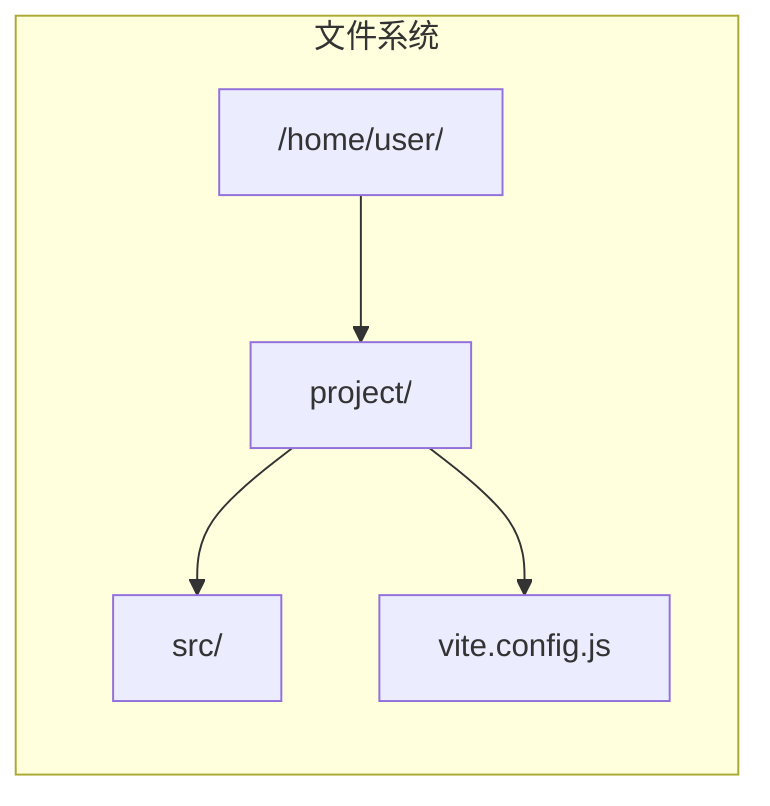
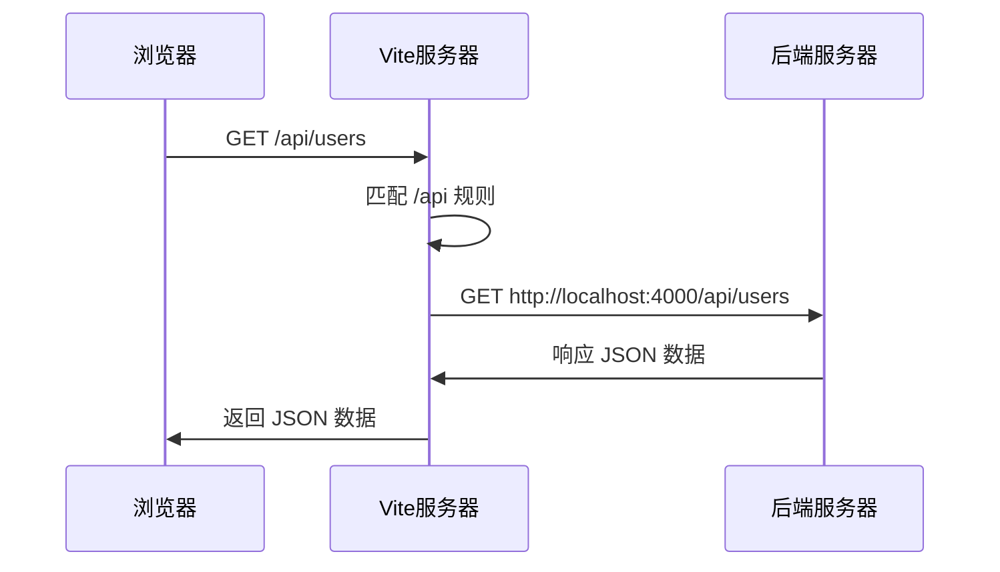
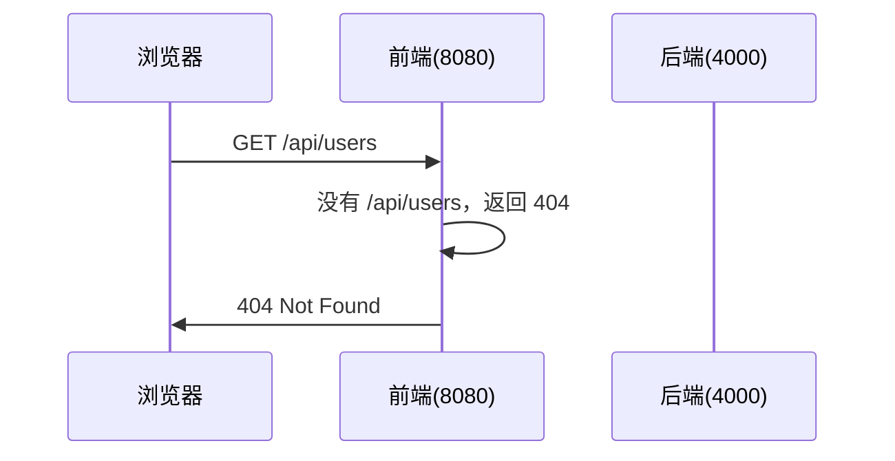

+++
title = "第4章 vite.config.js/ts 详解"
weight = 40
date = "2026-03-27T17:13:00+08:00"
type = "docs"
description = ""
isCJKLanguage = true
draft = false
+++

# Chapter-04-Vite-Config

# 第4章：vite.config.js/ts 详解

> 如果说 Vite 是一个王国，那 `vite.config.js` 就是这个王国的宪法——它定义了 Vite 的一切行为。
>
> 前面我们只是蜻蜓点水地看了看配置文件的皮毛，这一章我们要把它彻底讲透：root、base、publicDir、cacheDir 等基础配置；server 里的端口、代理、HMR；build 里的输出、优化、分包；resolve 里的别名、扩展名；optimizeDeps 里的预构建；CSS、PostCSS、LogLevel... 每一个配置项，我们都要讲清楚它是什么、怎么用、什么时候用。
>
> 这一章可能会稍微有点"干"，但绝对是硬核干货！建议泡杯咖啡，边看边实验。☕

---

## 4.1 配置文件基础

### 4.1.1 配置文件的位置与命名

在 Vite 项目根目录下，配置文件可以有以下几种命名方式：

| 文件名 | 说明 | 优先级 |
|--------|------|--------|
| `vite.config.js` | JavaScript 配置文件 | 中 |
| `vite.config.mjs` | 纯 ES Module JS 文件 | 中 |
| `vite.config.ts` | TypeScript 配置文件 | 高 |
| `vite.config.mts` | 纯 ES Module TS 文件 | 高 |

优先级从高到低：`vite.config.ts` > `vite.config.mts` > `vite.config.js` > `vite.config.mjs`。

> 💡 **什么时候用 TS**？如果你在项目中使用了 TypeScript，并且希望在配置文件中获得完整的类型提示和智能检查，用 `vite.config.ts` 是最好的选择。Vite 内置了 TypeScript 支持，不需要额外安装任何依赖。

**配置文件的默认位置**：

默认情况下，Vite 会从项目根目录寻找配置文件。如果你的配置文件不在根目录，或者叫其他名字，可以使用 `--config` 参数指定：

```bash
# 指定配置文件路径
vite build --config ./config/vite.config.js

# 指定不同的文件名
vite build --config vite.prod.config.js
```

### 4.1.2 配置文件的加载顺序

Vite 支持**环境文件（.env）**的自动加载，这些文件的加载顺序很重要：

```
vite.config.js
     ↓
.env                     # 所有环境都会加载
     ↓
.env.local              # 所有环境都会加载，但会被 git 忽略
     ↓
.env.[mode]             # 根据模式加载（mode 来自 --mode 参数或 NODE_ENV）
     ↓
.env.[mode].local       # 根据模式加载，但会被 git 忽略
```

> ⚠️ **优先级**：后面的文件会覆盖前面文件的配置。即 `.env.production` 会覆盖 `.env` 中同名的变量。

### 4.1.3 智能提示的配置

如果你使用 JavaScript（而不是 TypeScript），Vite 提供了一种方式来获得类型提示：

```javascript
// vite.config.js
// 第一行：添加类型注释，让 IDE 知道这是 Vite 配置对象
import { defineConfig } from 'vite'

/** @type {import('vite').UserConfig} */
export default defineConfig({
  // 写在这里的配置就有类型提示了！
  server: {
    port: 3000
  }
})
```

这个技巧使用了 JSDoc（JavaScript 的文档注释语法），VS Code 等 IDE 可以识别它并提供智能提示。

### 4.1.4 使用 defineConfig 辅助函数

`defineConfig` 是 Vite 提供的一个辅助函数，它的作用是**为配置对象提供 TypeScript 类型推断**：

```javascript
// vite.config.js
import { defineConfig } from 'vite'
import vue from '@vitejs/plugin-vue'

// 不使用 defineConfig（也能工作，但没有类型提示）
export default {
  plugins: [vue()],
}

// 使用 defineConfig（IDE 会提供完整的类型提示和智能补全）
export default defineConfig({
  plugins: [vue()],
  server: {
    port: 3000,
    proxy: {
      '/api': 'http://localhost:4000'
    }
  },
  build: {
    outDir: 'dist'
  }
})
```

> 💡 **好处**：
> 1. **类型提示**：IDE 能识别配置的完整类型结构
> 2. **拼写检查**：写错配置名时会有警告
> 3. **属性补全**：按 `.` 时能列出所有可用选项
>
> 强烈建议始终使用 `defineConfig`！

---

## 4.2 基本配置项

### 4.2.1 root：项目根目录

`root` 配置指定了 Vite 项目的根目录，默认为执行 `vite` 命令时所在的目录（通常就是 `package.json` 所在的目录）。

```javascript
// vite.config.js
import { defineConfig } from 'vite'

// 默认情况：项目根目录就是 vite.config.js 所在的目录
// 但你可以通过 root 改变它
export default defineConfig({
  // 相对路径，相对于当前工作目录（cwd）
  root: 'project',
  
  // 也可以使用绝对路径
  // root: path.resolve(__dirname, 'project'),
})
```



**使用场景**：当你有一个 monorepo（单体仓库）结构，或者项目源码不在根目录时，这个配置会很有用。

### 4.2.2 base：公共基础路径

`base` 配置定义了**部署到服务器时的公共基础路径**。这在你把应用部署到子路径时特别有用。

```javascript
// vite.config.js
export default defineConfig({
  // 部署在域名根目录（默认）
  base: '/',
  
  // 部署在 example.com/my-app/ 子路径下
  base: '/my-app/',
  
  // 部署在特定路径下
  base: '/static-site/',
})
```

**示例说明**：

| base 值 | 资源路径 | 实际 URL |
|---------|----------|----------|
| `/` | `/src/main.js` | `https://example.com/src/main.js` |
| `/my-app/` | `/src/main.js` | `https://example.com/my-app/src/main.js` |
| `/static/` | `/src/main.js` | `https://example.com/static/src/main.js` |

> ⚠️ **注意**：
> - `base` 值必须以 `/` 开头，以 `/` 结尾（除非是根 `/`）
> - 如果你用的是相对路径模式（`assetsPublicPath: '.'`），则 `base` 的作用会有不同

**使用场景**：
- 部署到 GitHub Pages（`/repository-name/`）
- 部署到子路径的 CDN
- 部署到 Nginx 子目录（`location /my-app {}`）

### 4.2.3 mode：模式配置

`mode` 定义了 Vite 运行的环境模式。默认有三种模式：
- `development`：开发模式（`pnpm dev` 时自动使用）
- `production`：生产模式（`pnpm build` 时自动使用）
- `test`：测试模式（`pnpm test` 时自动使用）

```javascript
// vite.config.js
export default defineConfig({
  // 可以自定义模式，但一般不需要改
  // mode: 'development',
  
  // 根据不同模式做不同配置
  build: {
    // 生产环境生成 sourcemap
    // 开发环境不生成（更快）
    sourcemap: process.env.NODE_ENV === 'production',
  }
})
```

**模式的实际作用**：
1. **决定加载哪个 `.env` 文件**：`.env.development` 或 `.env.production`
2. **注入到 `import.meta.env.MODE`**：可以在代码中访问当前模式

```javascript
// 在代码中判断当前模式
console.log(import.meta.env.MODE)  // 'development' 或 'production'
console.log(import.meta.env.DEV)    // true（开发模式）
console.log(import.meta.env.PROD)  // true（生产模式）
```

### 4.2.4 define：全局常量替换

`define` 允许你定义一些**全局常量**，在构建时会被替换到代码中。

```javascript
// vite.config.js
export default defineConfig({
  define: {
    // 定义一个全局常量
    __APP_VERSION__: JSON.stringify('1.0.0'),
    
    // 定义一个布尔值
    __DEBUG__: false,
    
    // 定义一个字符串（必须 JSON.stringify）
    __API_BASE__: JSON.stringify('https://api.example.com'),
  }
})
```

```javascript
// 在代码中使用
console.log(__APP_VERSION__)  // "1.0.0"
console.log(__DEBUG__)        // false
console.log(__API_BASE__)     // "https://api.example.com"
```

> ⚠️ **注意**：定义字符串时，必须用 `JSON.stringify()` 包装，否则会变成变量名而不是字符串。

**常见用途**：
- 注入应用版本号
- 注入构建时间
- 注入 API 地址
- 注入功能开关

```javascript
// 定义构建时间
export default defineConfig({
  define: {
    __BUILD_TIME__: JSON.stringify(new Date().toLocaleString()),
  }
})

// 在代码中
console.log('构建时间：' + __BUILD_TIME__)  // 构建时间：2024/3/27 15:00:00
```

### 4.2.5 publicDir：公共目录配置

`publicDir` 指定了**公共静态资源目录**，这个目录的文件会直接复制到输出目录（`dist`），不会经过任何处理。

```javascript
// vite.config.js
export default defineConfig({
  // 默认值：'public'
  // 文件会直接复制到 dist/public/
  publicDir: 'public',
  
  // 如果你不想使用 public 目录，设置为 false
  publicDir: false,
  
  // 使用自定义目录
  publicDir: 'static',
})
```

> 💡 **什么时候用 `publicDir: false`**？如果你的项目不需要 public 目录（比如纯组件库项目），可以禁用它，减少不必要的配置。

### 4.2.6 cacheDir：缓存目录

`cacheDir` 指定了 Vite 缓存文件的存储位置。Vite 会在这里缓存：
- 依赖预构建的结果
- 已处理的 CSS 文件
- 已转换的 source maps

```javascript
// vite.config.js
import path from 'path'

export default defineConfig({
  // 默认缓存目录：node_modules/.vite
  cacheDir: 'node_modules/.vite',
  
  // 自定义缓存目录
  cacheDir: path.resolve(__dirname, '.cache/vite'),
})
```

> 💡 **清理缓存**：有时候 Vite 缓存会出问题，导致修改不生效。这时可以删除 `node_modules/.vite` 目录，或者运行 `pnpm dev --force` 强制重新预构建。

### 4.2.7 envDir：环境变量目录

`envDir` 指定了 `.env` 文件所在的目录。默认是项目根目录。

```javascript
// vite.config.js
import path from 'path'

export default defineConfig({
  // .env 文件所在目录，默认是项目根目录
  envDir: path.resolve(__dirname, 'config/env'),
  
  // 假设 .env 文件放在 config/env/ 目录下
  // 那么 .env 文件应该放在 config/env/.env
  // 而不是项目根目录的 .env
})
```

---

## 4.3 服务器配置（server）

`server` 配置项控制 Vite 开发服务器的所有行为。这是使用最频繁的配置之一。

### 4.3.1 port：端口号配置

`port` 指定了开发服务器的端口号。

```javascript
// vite.config.js
export default defineConfig({
  server: {
    // 默认端口：5173
    port: 5173,
    
    // 如果 5173 被占用，Vite 会自动尝试下一个可用端口
    // 如果想禁止自动切换，使用 strictPort
    
    // 常用端口
    port: 3000,     // 常见开发端口
    port: 8080,    // 常见本地服务器端口
    port: 8000,    // 另一个常见端口
  }
})
```

### 4.3.2 host：主机配置

`host` 配置控制开发服务器绑定到哪个网络接口。

```javascript
// vite.config.js
export default defineConfig({
  server: {
    // 默认：只监听 localhost（只能本机访问）
    host: 'localhost',
    
    // 监听所有网络接口（其他设备可以通过 IP 访问）
    host: true,
    // 或者
    host: '0.0.0.0',
    
    // 监听特定 IP
    host: '192.168.1.100',
    
    // 监听特定网卡
    host: '0.0.0.0',  // 监听所有 IPv4
  }
})
```

**常见场景**：
- `localhost` / `127.0.0.1`：只有运行浏览器的这台电脑能访问
- `0.0.0.0` / `true`：局域网内的其他设备（如手机）也能访问

### 4.3.3 strictPort：严格端口

```javascript
// vite.config.js
export default defineConfig({
  server: {
    port: 3000,
    
    // 默认 false：如果 3000 被占用，会自动用下一个可用端口
    // 设置为 true：如果端口被占用，直接报错退出
    strictPort: true,
  }
})
```

### 4.3.4 https：HTTPS 配置

如果你需要使用 HTTPS 进行开发，Vite 支持配置 SSL 证书：

```javascript
// vite.config.js
import { defineConfig } from 'vite'
import path from 'path'

export default defineConfig({
  server: {
    https: true,  // 简单方式：自动生成自签名证书
    
    // 复杂方式：提供自己的证书
    https: {
      key: path.resolve(__dirname, 'cert/localhost-key.pem'),
      cert: path.resolve(__dirname, 'cert/localhost.pem'),
    }
  }
})
```

> 💡 **自签名证书警告**：自动生成的证书是自签名的，浏览器会显示"不安全"的警告。开发时可以直接忽略，或者点击"高级" → "继续前往"。

### 4.3.5 proxy：代理配置

`proxy` 是开发时最重要的配置之一，用于解决**跨域问题**。当你的前端需要请求后端 API，但后端 API 在另一个域名/端口时，就需要配置代理。

```javascript
// vite.config.js
export default defineConfig({
  server: {
    proxy: {
      // 配置代理规则
      '/api': {
        target: 'http://localhost:4000',  // 后端服务器地址
        changeOrigin: true,               // 修改请求头中的 Origin
        secure: false,                    // 是否验证 SSL 证书
      },
      
      '/auth': {
        target: 'http://localhost:4000',
        changeOrigin: true,
      },
      
      // 正则匹配
      '^/ws/.*': {
        target: 'ws://localhost:4000',    // WebSocket 代理
        ws: true,                         // 启用 WebSocket 代理
      },
    }
  }
})
```

**代理的工作原理**：



**没有代理时**：



**完整代理配置示例**：

```javascript
// vite.config.js
export default defineConfig({
  server: {
    proxy: {
      // 代理 API 请求
      '/api': {
        target: 'http://localhost:4000',
        changeOrigin: true,
        // 重写路径（去掉 /api 前缀）
        // 例如：/api/users → /users
        rewrite: (path) => path.replace(/^\/api/, ''),
      },
      
      // 代理 WebSocket
      '/ws': {
        target: 'ws://localhost:4000',
        ws: true,
      },
      
      // 代理静态资源
      '/cdn': {
        target: 'https://cdn.example.com',
        changeOrigin: true,
        rewrite: (path) => path.replace(/^\/cdn/, ''),
      },
    }
  }
})
```

> ⚠️ **注意**：代理只在开发环境（`pnpm dev`）生效。生产环境需要自己在 Nginx 等服务器上配置代理。

### 4.3.6 cors：跨域配置

Vite 开发服务器默认启用了 CORS（跨域资源共享）。如果你想自定义 CORS 设置：

```javascript
// vite.config.js
export default defineConfig({
  server: {
    // 默认 true：启用 CORS，允许所有来源
    cors: true,
    
    // 自定义 CORS 配置
    cors: {
      origin: 'http://localhost:3000',  // 允许的来源
      methods: ['GET', 'POST'],         // 允许的请求方法
      allowedHeaders: ['Content-Type', 'Authorization'],  // 允许的请求头
      credentials: true,                // 是否允许携带凭证
    },
    
    // 禁用 CORS（不推荐）
    cors: false,
  }
})
```

> 💡 **什么时候需要配置 cors**？默认的 `cors: true` 已经足够应对大多数开发场景。只有当你需要精细控制跨域策略时，才需要自定义配置。

### 4.3.7 open：自动打开浏览器

```javascript
// vite.config.js
export default defineConfig({
  server: {
    // 默认 false：不自动打开浏览器
    // 设置为 true：启动后自动打开默认浏览器
    open: true,
    
    // 指定 URL
    open: 'http://localhost:3000',
    
    // 指定浏览器（不常用）
    // macOS: 'Google Chrome'
    // Windows: 'chrome'
    open: {
      target: 'http://localhost:3000',
      browser: 'chrome',
    },
  }
})
```

### 4.3.8 hmr：热更新配置

HMR（热模块替换）的行为可以通过 `hmr` 配置项精细控制：

```javascript
// vite.config.js
export default defineConfig({
  server: {
    hmr: {
      // 默认 true：启用 HMR
      enabled: true,
      
      // 是否在连接失败时弹出浏览器提示
      overlay: true,
      
      // HMR 连接路径（WebSocket）
      // 默认不需要改，只有在特殊网络环境下可能需要
      // path: '/vite-hmr',
      
      // 端口（默认使用 server.port）
      // port: 5173,
    }
  }
})
```

**`overlay: true`** 的效果：当 HMR 更新出错时，Vite 会在页面上显示一个红色的报错浮层，而不是只在控制台打印错误。

### 4.3.9 watch：文件监听配置

`server.watch` 允许你配置 Vite 监听特定文件或目录的变化：

```javascript
// vite.config.js
import { defineConfig } from 'vite'

export default defineConfig({
  server: {
    watch: {
      // 监听额外的目录（除了 src 之外）
      // 默认：['src', 'public', 'index.html']
      // 但你可以通过 ignored 排除某些文件
      ignored: ['!**/node_modules/your-package/**'],
      
      // 监听间隔（ms）
      interval: 100,
      
      // 是否使用 poling（轮询）模式
      // 在某些网络文件系统（NFS）中使用
      usePolling: false,
      
      // 等待文件稳定的时间（ms）
      // 防止文件频繁变化时触发多次更新
      awaitWriteFinish: {
        stabilityThreshold: 200,
        pollInterval: 100,
      },
    }
  }
})
```

### 4.3.10 allowedHosts：允许的主机名

出于安全考虑，Vite 默认只允许从 localhost 访问。如果你需要从其他域名访问（比如通过 ngrok 暴露本地服务），需要配置 `allowedHosts`：

```javascript
// vite.config.js
export default defineConfig({
  server: {
    // 允许所有主机（不推荐用于生产）
    allowedHosts: 'all',
    
    // 允许特定主机
    allowedHosts: ['example.com', 'sub.example.com'],
    
    // 使用正则
    allowedHosts: [/.*\.example\.com/],
  }
})
```

### 4.3.11 fs.allow：允许访问的目录

Vite 开发服务器默认只能访问项目目录下的文件，防止意外暴露敏感文件。但有时候你可能需要访问其他目录：

```javascript
// vite.config.js
import path from 'path'

export default defineConfig({
  server: {
    fs: {
      // 默认：只允许访问项目根目录
      allow: [],
      
      // 允许访问项目根目录 + 上级目录的 packages
      allow: [
        path.resolve(__dirname, '..'),
      ],
      
      // 允许访问 node_modules 中的某个包
      allow: [
        path.resolve(__dirname, 'node_modules/my-package'),
      ],
      
      // 允许所有目录（不推荐！）
      // allow: ['..'],
    }
  }
})
```

---

## 4.4 构建配置（build）

`build` 配置项控制 Vite 的生产构建行为。

### 4.4.1 outDir：输出目录

```javascript
// vite.config.js
export default defineConfig({
  build: {
    // 默认：'dist'
    outDir: 'dist',
    
    // 自定义输出目录
    outDir: 'build',
    
    // 使用绝对路径
    // outDir: path.resolve(__dirname, 'output'),
  }
})
```

### 4.4.2 assetsDir：静态资源目录

```javascript
// vite.config.js
export default defineConfig({
  build: {
    // 静态资源输出到的子目录
    // 默认：'assets'
    // 最终输出：dist/assets/index-xxxx.js
    assetsDir: 'assets',
    
    // 如果你想把资源放在根目录
    assetsDir: '',
  }
})
```

### 4.4.3 sourcemap：源码映射

Sourcemap 可以在浏览器开发者工具中显示源代码，而不是压缩后的代码，方便调试。但会增加构建时间和输出文件体积。

```javascript
// vite.config.js
export default defineConfig({
  build: {
    // 默认：false（不生成 sourcemap）
    // 可选值：
    // - false: 不生成
    // - true: 生成 .js.map 文件
    // - 'inline': 内联到 JS 文件中（不生成单独文件）
    // - 'hidden': 生成但不引用（在 Nginx 配置里手动加）
    sourcemap: false,
    
    // 生产环境也生成 sourcemap
    sourcemap: true,
    
    // 内联 sourcemap
    sourcemap: 'inline',
  }
})
```

> 💡 **生产环境 sourcemap**：通常生产环境不需要 sourcemap，但如果需要方便线上调试，可以设置为 `true` 或 `'hidden'`（然后在 Nginx 中配置）。

### 4.4.4 minify：代码压缩

Vite 使用 esbuild 进行代码压缩，比传统的 terser 快 20-40 倍。

```javascript
// vite.config.js
export default defineConfig({
  build: {
    // 默认：'esbuild'（使用 esbuild 压缩）
    // 'terser'：使用 terser 压缩（更慢但压缩率可能更高）
    // false：不压缩（不推荐）
    minify: 'esbuild',
    
    // 如果使用 terser，需要安装
    // pnpm add -D terser
    minify: 'terser',
  }
})
```

**terser 配置**（如果你坚持要用 terser）：

```javascript
// vite.config.js
export default defineConfig({
  build: {
    minify: 'terser',
    terserOptions: {
      compress: {
        drop_console: true,  // 删除所有 console.log
        drop_debugger: true, // 删除所有 debugger
      },
    },
  }
})
```

### 4.4.5 target：浏览器兼容性目标

`target` 指定了构建产物要兼容的浏览器版本。Vite 会根据这个目标决定：
- 需要多少 polyfill
- 语法转换到哪个版本的 ECMAScript

```javascript
// vite.config.js
export default defineConfig({
  build: {
    // 默认：'esnext'（假设目标浏览器支持最新 ES 特性）
    target: 'esnext',
    
    // 兼容主流浏览器（不支持 IE11）
    target: ['es2020', 'edge88', 'firefox78', 'chrome87', 'safari14'],
    
    // 兼容老旧浏览器（包括 IE11）
    target: ['es2015', 'chrome49', 'firefox52', 'safari11'],
    
    // 指定具体的浏览器列表（在 package.json 的 browserslist 中也有效）
    // 推荐在 package.json 中配置：
    // "browserslist": ["> 1%", "last 2 versions", "not dead"]
  }
})
```

### 4.4.6 chunkSizeWarningLimit：警告阈值

Vite 默认会警告过大的 chunk（超过 500KB）。你可以通过这个配置调整阈值：

```javascript
// vite.config.js
export default defineConfig({
  build: {
    // 默认：500（KB）
    // 调大阈值，减少警告
    chunkSizeWarningLimit: 1000,  // 1MB
    
    // 关闭警告
    chunkSizeWarningLimit: Infinity,
  }
})
```

### 4.4.7 rollupOptions：Rollup 高级配置

Rollup 是 Vite 生产构建使用的打包器，`rollupOptions` 允许你深度定制 Rollup 的行为。

```javascript
// vite.config.js
import { defineConfig } from 'vite'

export default defineConfig({
  build: {
    rollupOptions: {
      // 输入（入口文件）
      input: {
        main: path.resolve(__dirname, 'index.html'),
        // 多页面应用
        about: path.resolve(__dirname, 'about.html'),
      },
      
      // 输出
      output: {
        // 打包后的文件名模板
        // [name]: 入口文件名
        // [hash]: chunk hash（内容变化时变化）
        // [id]: 模块 id
        entryFileNames: 'js/[name]-[hash].js',
        
        // 非入口 chunk（被多个入口共享的模块）
        chunkFileNames: 'js/[name]-[hash].js',
        
        // 静态资源（图片、字体等）
        assetFileNames: 'assets/[name]-[hash].[ext]',
        
        // 手动分包（把大库单独打包）
        manualChunks: {
          // 把 vue 相关打包到一起
          vue: ['vue', 'vue-router', 'pinia'],
          // 把 lodash 单独打包
          lodash: ['lodash-es'],
        },
        
        // 分隔符
        // 默认：'-'
        // chunkFileNames: '[name]-[hash].js',
      },
      
      // 外部依赖（不打包，由外部提供）
      // 常见场景：React、Vue 等大库通过 CDN 引入
      external: ['react', 'react-dom'],
      
      // plugins: [],
    }
  }
})
```

### 4.4.8 lib：库模式配置

如果你要构建一个**库**（而不是 Web 应用），Vite 提供了专门的库模式：

```javascript
// vite.config.js
import { defineConfig } from 'vite'
import vue from '@vitejs/plugin-vue'

export default defineConfig({
  build: {
    lib: {
      // 入口文件
      entry: path.resolve(__dirname, 'src/index.ts'),
      
      // 库名称（全局变量名）
      name: 'MyLibrary',
      
      // 文件名格式
      // 输出：dist/my-library.umd.cjs, dist/my-library.es.js
      fileName: (format) => `my-library.${format}.js`,
      
      // 支持的格式
      // 'es' | 'cjs' | 'umd' | 'iife'
      formats: ['es', 'cjs', 'umd'],
    },
    
    // 库模式下，不需要注入 CSS
    cssCodeSplit: false,
  }
})
```

### 4.4.9 cssCodeSplit：CSS 代码分割

```javascript
// vite.config.js
export default defineConfig({
  build: {
    // 默认：true（每个 chunk 单独生成一个 CSS 文件）
    // 设置为 false：所有 CSS 打包成一个文件
    cssCodeSplit: true,
    
    // 库模式通常关闭 CSS 分割
    cssCodeSplit: false,
  }
})
```

### 4.4.10 manifest：生成 manifest.json

```javascript
// vite.config.js
export default defineConfig({
  build: {
    // 生成 manifest.json（资源映射表）
    // 记录了每个资源文件的 hash、类型、入口关联等
    manifest: false,  // 默认 false
    
    // 输出到指定文件
    manifest: 'manifest.json',
  }
})
```

**manifest.json 示例**：

```json
{
  "src/main.js": {
    "file": "assets/main-a1b2c3d4.js",
    "src": "src/main.js",
    "isEntry": true,
    "css": ["assets/main-e5f6g7h8.css"]
  }
}
```

### 4.4.11 ssrManifest：生成 SSR manifest

如果你使用 SSR（服务端渲染），Vite 可以生成 SSR 资源映射：

```javascript
// vite.config.js
export default defineConfig({
  build: {
    // 生成 SSR manifest（用于 SSR）
    ssrManifest: false,  // 默认 false
    ssrManifest: true,
  }
})
```

### 4.4.12 emptyOutDir：清空输出目录

```javascript
// vite.config.js
export default defineConfig({
  build: {
    // 默认：true（构建前清空输出目录）
    // 设置为 false：不清空，保留旧文件
    emptyOutDir: true,
    
    // 在根目录构建时不警告
    emptyOutDir: true,
  }
})
```

---

## 4.5 解析配置（resolve）

`resolve` 配置项控制 Vite 如何解析模块路径。

### 4.5.1 alias：路径别名

```javascript
// vite.config.js
import path from 'path'

export default defineConfig({
  resolve: {
    alias: {
      // 常见配置
      '@': path.resolve(__dirname, 'src'),
      
      // 自定义别名
      '@components': path.resolve(__dirname, 'src/components'),
      '@utils': path.resolve(__dirname, 'src/utils'),
      '@views': path.resolve(__dirname, 'src/views'),
      '@assets': path.resolve(__dirname, 'src/assets'),
      '@styles': path.resolve(__dirname, 'src/styles'),
      
      // 使用函数（Vite 2.6.0+）
      alias: [
        { find: '@', replacement: path.resolve(__dirname, 'src') },
        { find: '~/', replacement: path.resolve(__dirname, 'src') + '/' },
      ],
    }
  }
})
```

> 💡 **TypeScript 用户**：记得在 `tsconfig.json` 中也添加对应的 paths 配置，否则 IDE 无法识别别名。

### 4.5.2 extensions：文件扩展名

```javascript
// vite.config.js
export default defineConfig({
  resolve: {
    // 默认扩展名列表
    extensions: ['.mjs', '.js', '.ts', '.jsx', '.tsx', '.json'],
    
    // 添加自定义扩展名
    extensions: ['.mjs', '.js', '.ts', '.jsx', '.tsx', '.json', '.vue'],
    
    // 建议：不要去掉 .vue，否则每次 import 都要写完整扩展名
  }
})
```

> ⚠️ **注意**：不要移除 `.json`，Vite 需要这个来解析 `package.json`。

### 4.5.3 mainFields：package.json 字段优先级

当 import 一个 npm 包时，Vite 会按照 `mainFields` 的顺序查找入口文件：

```javascript
// vite.config.js
export default defineConfig({
  resolve: {
    // 默认：['module', 'jsnext:main', 'jsnext']
    // module: ES Module 入口
    // jsnext:main: ES2015+ 入口
    // jsnext: 旧的 Rollup 格式
    mainFields: ['module', 'jsnext:main', 'jsnext'],
    
    // 针对某个包的特殊配置
    // 可以用 resolve.alias
  }
})
```

### 4.5.4 conditions：导出条件

```javascript
// vite.config.js
export default defineConfig({
  resolve: {
    // 导出条件，控制 package.json 中 exports 字段的解析
    // 默认：['import', 'module', 'browser', 'default']
    conditions: ['import', 'module', 'browser', 'default'],
    
    // 添加自定义条件
    conditions: ['import', 'module', 'browser', 'default', 'development'],
  }
})
```

### 4.5.5 symlinks：符号链接处理

```javascript
// vite.config.js
export default defineConfig({
  resolve: {
    // 默认：true（解析符号链接）
    // 设置为 false：保持符号链接的原始路径
    symlinks: true,
  }
})
```

### 4.5.6 preserveSymlinks：保留符号链接

```javascript
// vite.config.js
export default defineConfig({
  // preserveSymlinks 等价于 symlinks: false
  preserveSymlinks: false,
})
```

---

## 4.6 依赖优化配置（optimizeDeps）

`optimizeDeps` 控制 Vite 的依赖预构建行为。

### 4.6.1 include：强制预构建的依赖

```javascript
// vite.config.js
export default defineConfig({
  optimizeDeps: {
    // 强制预构建这些依赖
    // 场景：某些依赖在开发时有问题，需要强制预构建
    include: [
      // npm 包名
      'lodash-es',
      'axios',
      // 或者带路径
      'lodash-es/debounce',
    ],
  }
})
```

### 4.6.2 exclude：排除预构建的依赖

```javascript
// vite.config.js
export default defineConfig({
  optimizeDeps: {
    // 排除预构建（某些包预构建后反而有问题）
    exclude: [
      // 某些包可能和预构建冲突
      'some-problematic-package',
    ],
  }
})
```

### 4.6.3 esbuildOptions：esbuild 配置

```javascript
// vite.config.js
export default defineConfig({
  optimizeDeps: {
    // esbuild 配置
    esbuildOptions: {
      // 支持 JSX 文件
      loader: {
        '.js': 'jsx',
      },
      
      // 定义全局变量
      define: {
        GLOBAL: JSON.stringify('my-global-value'),
      },
      
      // 插件
      plugins: [],
    }
  }
})
```

### 4.6.4 holdUntilCrawlEnd：等待爬虫结束

```javascript
// vite.config.js
export default defineConfig({
  optimizeDeps: {
    // 默认：true
    // true：等所有页面都被访问后才完成预构建（确保所有依赖都被预构建）
    // false：完成初始依赖解析后立即完成（更快，但可能有遗漏）
    holdUntilCrawlEnd: true,
  }
})
```

---

## 4.7 CSS 配置

### 4.7.1 cssPreprocessOptions：预处理器选项

```javascript
// vite.config.js
export default defineConfig({
  css: {
    // 预处理器选项
    preprocessorOptions: {
      // SCSS/Sass 选项
      scss: {
        // 添加全局变量文件
        additionalData: `@import "@/styles/variables.scss";`,
        // 或者
        // additionalData: `@use "@/styles/variables.scss" as *;`,
        
        // API 选项
        api: 'modern-compiler',  // 或 'modern' | 'legacy'
        
        // 安静模式
        quietDeps: true,
      },
      
      // Less 选项
      less: {
        additionalData: `@import "@/styles/variables.less";`,
      },
      
      // Stylus 选项
      stylus: {
        additionalData: `@import "@/styles/variables.styl";`,
      },
    }
  }
})
```

### 4.7.2 postcss：PostCSS 配置

Vite 内置了 PostCSS 支持，配置方式有两种：

**方式一：在 vite.config.js 中配置**

```javascript
// vite.config.js
export default defineConfig({
  css: {
    postcss: {
      plugins: [
        // autoprefixer：自动添加 CSS 前缀
        // require('autoprefixer')
        
        // postcss-preset-env：现代 CSS 转换
        // require('postcss-preset-env')
      ],
    }
  }
})
```

**方式二：创建 postcss.config.js**

```javascript
// postcss.config.js
export default {
  plugins: {
    autoprefixer: {},
    'postcss-preset-env': {
      stage: 2,  // CSS 阶段
    },
  }
}
```

### 4.7.3 modules：CSS Modules 配置

```javascript
// vite.config.js
export default defineConfig({
  css: {
    modules: {
      // 类名生成规则
      // 'local' | 'global' | ((name, filename, css) => string)
      generateScopedName: '[name]__[local]___[hash:base64:5]',
      
      // 哈希算法
      // 'adler' | 'sha1' | 'md5' | 'hash'
      hashStrategy: 'hashed',
      
      // 是否导出 locals（类名映射）
      exportLocalsConvention: 'camelCaseOnly',  // 'camelCase' | 'kebabCase' | 'dashes' | 'dashesOnly'
      
      // 作用域类名
      scopeBehaviour: 'local',  // 'local' | 'global'
      
      // 全局类名（不会被哈希）
      globalModulePaths: [],
    }
  }
})
```

---

## 4.8 日志配置

### 4.8.1 logLevel：日志级别

```javascript
// vite.config.js
export default defineConfig({
  // 日志级别
  // 'info': 显示信息（默认）
  // 'warn': 只显示警告和错误
  // 'error': 只显示错误
  // 'silent': 不显示任何日志
  logLevel: 'info',
  
  // 可以使用命令行覆盖
  // pnpm dev -- --logLevel warn
})
```

### 4.8.2 customLogger：自定义日志

```javascript
// vite.config.js
import { defineConfig } from 'vite'

// 自定义日志记录器
const customLogger = {
  info: (msg) => {
    console.log(`[INFO] ${msg}`)
  },
  warn: (msg) => {
    console.warn(`[WARN] ${msg}`)
  },
  warnOnce: (msg) => {
    console.warn(`[WARN] ${msg}`)
  },
  error: (msg) => {
    console.error(`[ERROR] ${msg}`)
  },
  hasErrorLogged: (msg) => {
    return false
  },
  clearScreen: () => {
    console.clear()
  },
}

export default defineConfig({
  customLogger,
})
```

---

## 4.9 本章小结

### 🎉 本章总结

这一章我们深入研究了 `vite.config.js/ts` 的所有配置项，内容非常硬核：

1. **基础配置**：root、base、mode、define、publicDir、cacheDir、envDir

2. **服务器配置（server）**：端口、主机、代理、HMR、CORS、自动打开浏览器、文件监听、跨域安全

3. **构建配置（build）**：输出目录、sourcemap、压缩、兼容性目标、Rollup 高级配置、库模式、CSS 分割

4. **解析配置（resolve）**：路径别名、扩展名、主字段、符号链接处理

5. **依赖优化（optimizeDeps）**：强制预构建、排除预构建、esbuild 配置

6. **CSS 配置**：预处理器选项、PostCSS、CSS Modules

7. **日志配置**：日志级别、自定义日志器

### 📝 本章练习

1. **代理配置实战**：配置一个代理，把 `/api` 请求代理到 `http://localhost:3000`，然后在代码里 `fetch('/api/users')` 试试

2. **路径别名配置**：配置 `@components`、`@utils` 等别名，然后在代码中使用它们

3. **构建产物分析**：运行 `pnpm build`，然后看看 `dist` 目录里生成了什么文件，理解 Vite 的输出结构

4. **CSS Modules 实验**：创建一个 `.module.css` 文件，试试 CSS Modules 的类名生成规则

5. **手动分包**：配置 `rollupOptions.manualChunks`，把一个大的依赖库单独打包

---

> 📌 **预告**：下一章我们将进入 **插件系统**，学习 Vite 插件的工作原理、官方插件的使用、以及如何配置社区插件。敬请期待！
