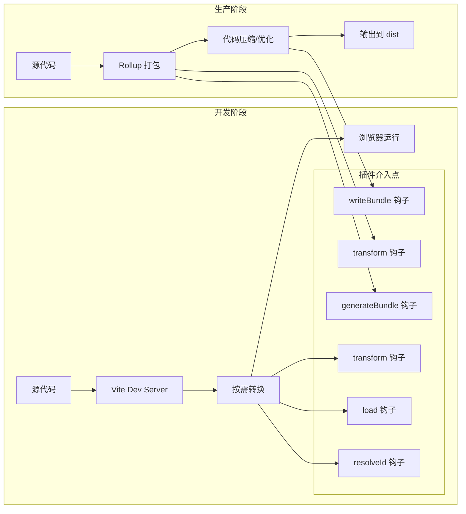
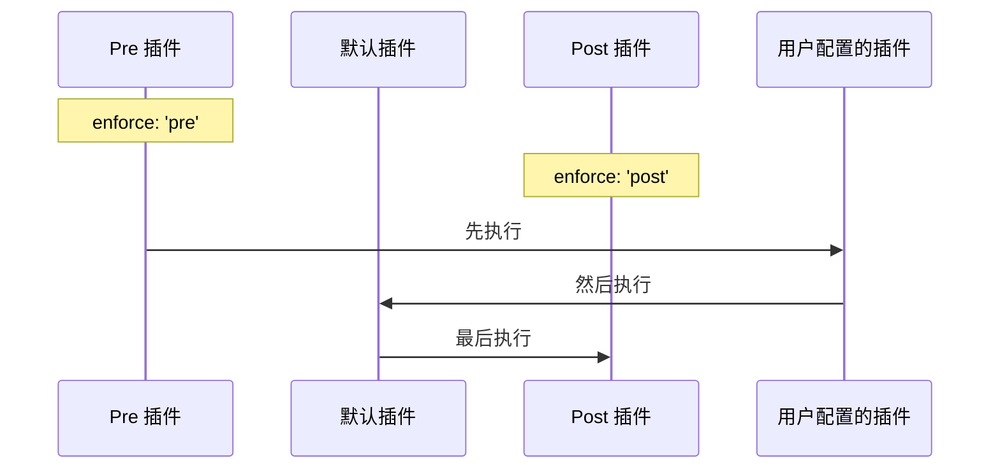

+++
title = "第5章 插件系统"
weight = 50
date = "2026-03-27T17:13:00+08:00"
type = "docs"
description = ""
isCJKLanguage = true
draft = false
+++

# Chapter-05-Plugin-System

# 第5章：插件系统

> 如果把 Vite 比作一辆汽车，那插件就是它的"外挂装备"——可以让汽车上天入地、潜水遁地。
>
> Vite 的插件系统借鉴了 Rollup 的插件设计，但又增加了一些 Vite 独有的钩子（Hooks）。有了插件，Vite 可以支持 Vue JSX、React、SSR、PWA、CSS Modules、CSS-in-JS、Mock 数据、图片压缩... 几乎你能想到的一切功能。
>
> 这一章，我们来深入探索 Vite 插件系统的原理、官方插件的使用、以及热门社区插件的配置。

---

## 5.1 插件概述

### 5.1.1 什么是 Vite 插件

**Vite 插件**是一段代码，它可以在 Vite 的生命周期中"插一脚"，对代码进行转换、添加功能、修改行为。

可以把 Vite 插件想象成装修房子时的各种"预制件"：
- 你可以装上"空调插件"（空调就工作了）
- 你可以装上"热水器插件"（热水就有了）
- 你可以装上"智能家居插件"（房子就变聪明了）

Vite 插件的作用类似：
- 装上 `@vitejs/plugin-vue` → Vite 就能处理 `.vue` 文件
- 装上 `@vitejs/plugin-react` → Vite 就能处理 React JSX 语法
- 装上 `vite-plugin-pwa` → Vite 项目就支持 PWA（渐进式 Web 应用）

### 5.1.2 插件的作用与原理

Vite 插件基于 **Rollup 插件** 设计，同时增加了 Vite 独有的钩子。插件的工作原理，可以用下面这张图来描述：



**Vite 插件钩子（按执行顺序）**：

| 钩子 | 阶段 | 说明 |
|------|------|------|
| `options` | 初始化 | 插件配置阶段，可以修改 Rollup 配置 |
| `buildStart` | 构建开始 | 开始构建时调用，可以初始化资源 |
| `resolveId` | 解析路径 | 遇到 import 时，插件可以决定实际加载什么文件 |
| `load` | 加载模块 | 加载模块内容 |
| `transform` | 转换代码 | 对代码进行转换（最常用的钩子） |
| `buildEnd` | 构建结束 | 构建结束时调用 |
| `generateBundle` | 生成产物前 | 打包成文件前调用 |
| `writeBundle` | 输出文件 | 文件写入磁盘时调用 |

**Vite 独有的钩子**（开发模式下才会调用）：

| 钩子 | 说明 |
|------|------|
| `configureServer` | 配置开发服务器 |
| `configurePreviewServer` | 配置预览服务器 |
| `transformIndexHtml` | 转换 index.html |
| `handleHotUpdate` | 处理热更新 |

### 5.1.3 官方插件 vs 社区插件

**官方插件**由 Vite 团队维护，质量有保证，更新及时：
- `@vitejs/plugin-vue` — Vue 3 支持
- `@vitejs/plugin-react` — React 支持
- `@vitejs/plugin-vue-jsx` — Vue JSX 支持
- `@vitejs/plugin-legacy` — 旧浏览器兼容
- `@vitejs/plugin-basic-ssl` — HTTPS 支持
- `@vitejs/plugin-inspect` — 插件审查

**社区插件**由社区开发，功能更丰富：
- `vite-plugin-pwa` — PWA 支持
- `unplugin-auto-import` — 自动导入 API
- `vite-plugin-svg-icons` — SVG 雪碧图
- `vite-plugin-mock` — Mock 数据
- `vite-plugin-compression` — 压缩
- `vite-plugin-eslint` — ESLint 集成

### 5.1.4 Vite 插件的兼容性

由于 Vite 插件借鉴了 Rollup 插件设计，大部分 Rollup 插件都可以在 Vite 中使用。但需要注意以下几点：

- **Vite 独有的钩子**（如 `configureServer`）只在 Vite 开发模式下生效
- **Rollup 插件**在开发和生产阶段都会生效
- **Vite 插件**可以访问 Vite 特有的上下文信息

---

## 5.2 常用官方插件

### 5.2.1 @vitejs/plugin-vue（Vue 3 支持）

这是 Vite 支持 Vue 3 的核心插件，让 Vite 能够解析和编译 `.vue` 单文件组件。

**安装**：

```bash
pnpm add -D @vitejs/plugin-vue
```

**配置**：

```javascript
// vite.config.js
import { defineConfig } from 'vite'
import vue from '@vitejs/plugin-vue'

export default defineConfig({
  plugins: [
    vue({
      // 是否启用 Vue 3 的 script setup 支持
      // 默认：true
      script: {
        defineProps: true,
        defineEmits: true,
      },
      
      // 自定义块处理
      customBlocks: {
        // docs: '@vitejs/plugin-vue-docs',
      },
    }),
  ],
})
```

**完整配置示例**：

```javascript
// vite.config.js
import { defineConfig } from 'vite'
import vue from '@vitejs/plugin-vue'

export default defineConfig({
  plugins: [
    vue({
      // Vue 3.4+ 的响应性语法糖
      reactivityTransform: true,
      
      // template 编译器选项
      template: {
        compilerOptions: {
          // 自定义元素处理
          isCustomElement: (tag) => tag.startsWith('ion-'),
        },
      },
      
      // script 块配置
      script: {
        // 启用 defineProps 的解构默认值的转换
        defineModel: true,
        // 自动导入 from 'vue'
        imports: ['vue'],
      },
    }),
  ],
})
```

### 5.2.2 @vitejs/plugin-vue-jsx（Vue JSX 支持）

让 Vite 支持 Vue 的 JSX 语法（和 React 的 JSX 略有不同）。

**安装**：

```bash
pnpm add -D @vitejs/plugin-vue-jsx
```

**配置**：

```javascript
// vite.config.js
import { defineConfig } from 'vite'
import vue from '@vitejs/plugin-vue'
import vueJsx from '@vitejs/plugin-vue-jsx'

export default defineConfig({
  plugins: [
    vue(),
    vueJsx({
      // JSX 插件选项
      // 是否启用 Vue 3 的 JSX 转换
      // 默认：true
      
      // 自定义 JSX  pragma
      // pragma: 'h',
      
      // 是否启用 Vue 3 的 TSX 支持
      // 需要配合 @vitejs/plugin-vue 使用
      injectH: true,  // 自动注入 h 函数
    }),
  ],
})
```

**使用示例**：

```vue
<script setup lang="tsx">
// 使用 JSX 语法写 Vue 组件
const name = '小明'
const handleClick = () => {
  console.log('点击了！')
}

return () => (
  <div class="container">
    <h1>你好，{name}！</h1>
    <button onClick={handleClick}>点我</button>
  </div>
)
</script>
```

### 5.2.3 @vitejs/plugin-react（React 支持）

这是 Vite 支持 React 的核心插件，提供了 Fast Refresh（快速刷新）等开发体验优化。

**安装**：

```bash
pnpm add -D @vitejs/plugin-react
```

**配置**：

```javascript
// vite.config.js
import { defineConfig } from 'vite'
import react from '@vitejs/plugin-react'

export default defineConfig({
  plugins: [
    react({
      // 是否启用 Fast Refresh（开发时热更新不丢失状态）
      // 默认：true
      fastRefresh: true,
      
      // JSX 运行时的配置
      // 'automatic': 新 JSX Transform（React 17+ 引入，不需要手动 import React）
      // 'classic': 经典 JSX Transform（需要每个文件 import React）
      jsxRuntime: 'automatic',
      
      // JSX 开发环境的配置
      // 推荐：'automatic'
      jsxImportSource: 'react',
    }),
  ],
})
```

**完整配置示例**：

```javascript
// vite.config.js
import { defineConfig } from 'vite'
import react from '@vitejs/plugin-react'

export default defineConfig({
  plugins: [
    react({
      // Fast Refresh
      fastRefresh: true,
      
      // 新 JSX Transform（推荐！）
      // 这样每个 .jsx/.tsx 文件不需要写 import React from 'react'
      jsxRuntime: 'automatic',
      
      // Babel 插件选项（如果需要额外的 Babel 转换）
      // babel: {
      //   plugins: [],
      //   parserOpts: {},
      // },
    }),
  ],
})
```

### 5.2.5 @vitejs/plugin-react-swc（React 支持，使用 SWC）

这是 `@vitejs/plugin-react` 的替代品，使用 SWC（Rust 写的编译器）替代 Babel，速度更快。

**安装**：

```bash
pnpm add -D @vitejs/plugin-react-swc
```

**配置**：

```javascript
// vite.config.js
import { defineConfig } from 'vite'
import react from '@vitejs/plugin-react-swc'

export default defineConfig({
  plugins: [
    react({
      // SWC 插件选项
      // 是否启用 Fast Refresh
      fastRefresh: true,
      
      // 生产构建时是否使用 SWC
      // 默认：true
      // 设为 false 则生产构建使用 Babel
    }),
  ],
})
```

> 💡 **什么时候用 `@vitejs/plugin-react-swc`**？如果你的项目构建时间很长，可以考虑用它替代 `@vitejs/plugin-react`，SWC 的编译速度比 Babel 快很多。

### 5.2.6 @vitejs/plugin-legacy（旧浏览器支持）

如果你需要支持老旧浏览器（如 IE11），可以使用这个插件。

**安装**：

```bash
pnpm add -D @vitejs/plugin-legacy
```

**配置**：

```javascript
// vite.config.js
import { defineConfig } from 'vite'
import legacy from '@vitejs/plugin-legacy'

export default defineConfig({
  plugins: [
    legacy({
      // 目标浏览器
      targets: ['defaults', 'not IE 11'],
      
      // 是否生成 polyfill
      // 默认：true
      polyfills: true,
      
      // HTML 文件的处理方式
      // 'default': 在现代浏览器中加载现代代码，legacy 浏览器加载 polyfill + legacy 代码
      // 'entry-es5': 在所有 HTML 中注入 ES5 polyfill
      renderLegacyChunks: true,
      
      // 自定义 polyfills
      // external: ['promise'],
    }),
  ],
})
```

> ⚠️ **注意**：支持 IE11 会显著增加构建产物体积。如果不是必须，建议不要支持 IE11。

### 5.2.7 @vitejs/plugin-basic-ssl（HTTPS 支持）

这个插件为开发服务器提供简单的自签名 HTTPS 支持。

**安装**：

```bash
pnpm add -D @vitejs/plugin-basic-ssl
```

**配置**：

```javascript
// vite.config.js
import { defineConfig } from 'vite'
import basicSsl from '@vitejs/plugin-basic-ssl'

export default defineConfig({
  plugins: [
    basicSsl(),
  ],
  server: {
    https: true,  // 仍然需要设置 https: true
  }
})
```

### 5.2.8 @vitejs/plugin-inspect（插件审查）

这个插件可以让你查看 Vite 插件对每个模块的转换过程，非常适合学习插件原理和调试。

**安装**：

```bash
pnpm add -D @vitejs/plugin-inspect
```

**配置**：

```javascript
// vite.config.js
import { defineConfig } from 'vite'
import vue from '@vitejs/plugin-vue'
import inspect from '@vitejs/plugin-inspect'

export default defineConfig({
  plugins: [
    vue(),
    inspect(),  // 启用了 inspect
  ],
})
```

启动开发服务器后，访问 `http://localhost:5173/__inspect/` 可以看到交互式的转换过程。

### 5.2.9 @vitejs/plugin-rsw（Rust 编译支持）

如果你想在 Vite 项目中使用 Rust 编写的 WebAssembly 模块，可以使用这个插件（需要安装 Rust 和 rsw）。

---

## 5.3 常用社区插件

### 5.3.1 unplugin-auto-import（自动导入 API）

这个插件可以自动导入你常用的 API（如 `ref`, `computed`, `onMounted` 等），再也不用每次都手动 import 了！

**安装**：

```bash
pnpm add -D unplugin-auto-import
```

**Vue 项目配置**：

```javascript
// vite.config.js
import { defineConfig } from 'vite'
import vue from '@vitejs/plugin-vue'
import AutoImport from 'unplugin-auto-import/vite'

export default defineConfig({
  plugins: [
    vue(),
    AutoImport({
      // 自动导入的 API
      imports: [
        // Vue Composition API
        'vue',
        'vue-router',
        'pinia',
        // 或者具体列出需要的 API
        // {
        //   'vue': ['ref', 'computed', 'watch', 'onMounted'],
        // },
      ],
      
      // 生成 TypeScript 类型声明文件
      // 这样 ESLint 和 IDE 不会报错
      dts: 'src/auto-imports.d.ts',
      
      // 是否在全局注入 eslint 注释
      eslintrc: {
        enabled: true,  // 生成 .eslintrc-auto-import.json
      },
      
      // resolvers 配置（处理第三方库的自动导入）
      resolvers: [
        // 如果用的是 Element Plus
        // ElementPlusResolver(),
        // 如果用的是 Ant Design Vue
        // AntDesignVueResolver(),
      ],
    }),
  ],
})
```

**生成 .eslintrc.json（如果启用了 eslintrc）**：

```json
// .eslintrc.json（部分）
{
  "extends": [
    "./.eslintrc-auto-import.json"
  ]
}
```

**使用示例**：

```vue
<!-- 之前：每个文件都要手动 import -->
<script setup>
import { ref, computed, onMounted } from 'vue'

const count = ref(0)
const doubled = computed(() => count.value * 2)

onMounted(() => {
  console.log('mounted!')
})
</script>

<!-- 之后：直接用，不需要 import -->
<script setup>
// 这些 API 会被自动导入！
const count = ref(0)
const doubled = computed(() => count.value * 2)

onMounted(() => {
  console.log('mounted!')
})
</script>
```

### 5.3.2 unplugin-vue-components（自动导入组件）

这个插件可以自动导入组件，再也不用 `import MyButton from '@/components/MyButton.vue'` 了！

**安装**：

```bash
pnpm add -D unplugin-vue-components
```

**配置**：

```javascript
// vite.config.js
import { defineConfig } from 'vite'
import vue from '@vitejs/plugin-vue'
import Components from 'unplugin-vue-components/vite'
import { VueUseAliases } from 'unplugin-vue-components/resolvers'

export default defineConfig({
  plugins: [
    vue(),
    Components({
      // 组件目录
      dirs: ['src/components'],
      
      // 组件的文件扩展名
      extensions: ['vue', 'md'],
      
      // 生成 TypeScript 类型声明
      dts: 'src/components.d.ts',
      
      // 解析器（自动解析 UI 库的组件）
      resolvers: [
        // VueUse 组件自动导入
        VueUseAliases(),
        // 如果用 Element Plus
        // ElementPlusResolver(),
        // 如果用 Ant Design Vue
        // AntDesignVueResolver(),
        // 如果用 Naive UI
        // NaiveUiResolver(),
      ],
      
      // 模板中的组件名前缀
      // 例如 <MyButton /> 会自动解析为 @/components/MyButton.vue
      directoryAsNamespace: true,
    }),
  ],
})
```

**使用示例**：

```vue
<!-- 之前 -->
<script setup>
import MyButton from '@/components/MyButton.vue'
import UserCard from '@/components/UserCard.vue'

// 注册组件
const Button = MyButton
const Card = UserCard
</script>

<!-- 之后 -->
<script setup>
// 不需要 import，组件会被自动解析！
// <MyButton /> → @/components/MyButton.vue
// <UserCard /> → @/components/UserCard.vue
</script>

<template>
  <MyButton>点击我</MyButton>
  <UserCard :user="currentUser" />
</template>
```

### 5.3.3 vite-plugin-pwa（PWA 支持）

PWA（Progressive Web App）让你的 Web 应用可以像原生应用一样被安装到桌面、接收推送通知、离线使用。

**安装**：

```bash
pnpm add -D vite-plugin-pwa
```

**配置**：

```javascript
// vite.config.js
import { defineConfig } from 'vite'
import vue from '@vitejs/plugin-vue'
import { VitePWA } from 'vite-plugin-pwa'

export default defineConfig({
  plugins: [
    vue(),
    VitePWA({
      // 是否自动更新
      registerType: 'autoUpdate',
      
      // PWA 配置
      workbox: {
        // Service Worker 的策略
        globPatterns: ['**/*.{js,css,html,ico,png,svg,woff,woff2}'],
        runtimeCaching: [
          {
            // 缓存策略
            urlPattern: /^https:\/\/api\.example\.com\/.*$/i,
            handler: 'NetworkFirst',
            options: {
              cacheName: 'api-cache',
              expiration: {
                maxEntries: 10,
                maxAgeSeconds: 60 * 60 * 24, // 1 天
              },
              cacheableResponse: {
                statuses: [0, 200],
              },
            },
          },
          {
            // 图片缓存
            urlPattern: /\.(?:png|jpg|jpeg|svg|gif|webp)$/,
            handler: 'CacheFirst',
            options: {
              cacheName: 'image-cache',
              expiration: {
                maxEntries: 50,
                maxAgeSeconds: 60 * 60 * 24 * 30, // 30 天
              },
            },
          },
        ],
      },
      
      // Web App Manifest 配置
      manifest: {
        name: '我的 Vite PWA 应用',
        short_name: 'VitePWA',
        description: '一个支持 PWA 的 Vite 应用',
        theme_color: '#ffffff',
        icons: [
          {
            src: '/pwa-192x192.png',
            sizes: '192x192',
            type: 'image/png',
          },
          {
            src: '/pwa-512x512.png',
            sizes: '512x512',
            type: 'image/png',
          },
        ],
      },
    }),
  ],
})
```

### 5.3.4 vite-plugin-svg-icons（SVG 图标雪碧图）

这个插件可以把多个 SVG 文件合并成一个雪碧图，减少 HTTP 请求。

**安装**：

```bash
pnpm add -D vite-plugin-svg-icons
```

**配置**：

```javascript
// vite.config.js
import { defineConfig } from 'vite'
import vue from '@vitejs/plugin-vue'
import { createSvgIconsPlugin } from 'vite-plugin-svg-icons'
import path from 'path'

export default defineConfig({
  plugins: [
    vue(),
    createSvgIconsPlugin({
      // SVG 文件目录
      iconDirs: [
        path.resolve(__dirname, 'src/assets/icons'),
      ],
      
      // Symbol ID 格式
      // #symbol-${dir}-${filename}
      symbolId: 'icon-[dir]-[name]',
      
      // 是否内联
      // 设为 true 可以减少请求但增加 HTML 大小
      svgoOptions: {
        plugins: [
          {
            name: 'preset-default',
            params: {
              overrides: {
                removeViewBox: false,  // 保留 viewBox
              },
            },
          },
        ],
      },
    }),
  ],
})
```

**使用**：

```vue
<template>
  <!-- 使用方式 -->
  <svg aria-hidden="true">
    <use href="#icon-arrow" />
  </svg>
  
  <!-- 或者封装成组件 -->
  <SvgIcon name="arrow" />
</template>

<script setup>
// 封装一个简单的 SvgIcon 组件
import { computed } from 'vue'

const props = defineProps({
  name: {
    type: String,
    required: true,
  },
})

const iconName = computed(() => `#icon-${props.name}`)
</script>

<style scoped>
svg {
  width: 1em;
  height: 1em;
  fill: currentColor;
}
</style>
```

### 5.3.5 vite-plugin-mock（Mock 数据）

这个插件可以在开发时提供 Mock 数据，方便前端独立开发。

**安装**：

```bash
pnpm add -D vite-plugin-mock
```

**配置**：

```javascript
// vite.config.js
import { defineConfig } from 'vite'
import vue from '@vitejs/plugin-vue'
import { viteMockServe } from 'vite-plugin-mock'

export default defineConfig({
  plugins: [
    vue(),
    viteMockServe({
      // mock 文件目录
      mockPath: 'mock',
      
      // 是否启用
      enable: true,
      
      // 注入 mock 文件的方式
      injectCode: `
        import { setupMockServer } from '@/mock/index'
        setupMockServer()
      `,
    }),
  ],
})
```

**创建 Mock 文件**：

```javascript
// mock/user.ts
import { defineMock } from 'vite-plugin-mock'

export default defineMock({
  // GET 请求
  'GET /api/user': {
    id: 1,
    name: '小明',
    age: 18,
  },
  
  // POST 请求
  'POST /api/login': (req) => {
    const { username, password } = req.body
    if (username === 'admin' && password === '123456') {
      return {
        code: 0,
        message: '登录成功',
        data: {
          token: 'mock-token-123456',
          user: { id: 1, name: '管理员' },
        },
      }
    }
    return {
      code: 1,
      message: '用户名或密码错误',
      data: null,
    }
  },
  
  // 使用函数
  'GET /api/list': (req) => {
    const { page = 1, pageSize = 10 } = req.query
    return {
      code: 0,
      data: {
        list: Array.from({ length: Number(pageSize) }).map((_, i) => ({
          id: (Number(page) - 1) * Number(pageSize) + i + 1,
          name: `用户 ${i + 1}`,
        })),
        total: 100,
        page: Number(page),
        pageSize: Number(pageSize),
      },
    }
  },
})
```

### 5.3.6 vite-plugin-compression（gzip/brotli 压缩）

这个插件可以在构建时生成 `.gz` 和 `.br` 压缩文件，让服务器可以直接返回压缩后的资源，减少传输体积。

**安装**：

```bash
pnpm add -D vite-plugin-compression
```

**配置**：

```javascript
// vite.config.js
import { defineConfig } from 'vite'
import vue from '@vitejs/plugin-vue'
import viteCompression from 'vite-plugin-compression'

export default defineConfig({
  plugins: [
    vue(),
    viteCompression({
      // 压缩算法：'gzip' | 'brotli' | 'both'
      algorithm: 'gzip',
      
      // 压缩级别
      compressionOptions: {
        level: 9,  // 最高压缩级别（最慢但最小）
      },
      
      // 需要压缩的文件扩展名
      ext: '.gz',
      
      // 小于这个大小的文件不压缩（bytes）
      threshold: 1024,
      
      // 是否删除原始文件
      deleteOriginFile: false,
      
      // 多个文件是否使用并行压缩
      parallel: true,
    }),
  ],
})
```

### 5.3.7 vite-plugin-checker（TypeScript/ESLint 检查）

这个插件可以在开发时在后台运行 TypeScript 和 ESLint 检查，发现错误立即通知你。

**安装**：

```bash
pnpm add -D vite-plugin-checker
```

**配置**：

```javascript
// vite.config.js
import { defineConfig } from 'vite'
import vue from '@vitejs/plugin-vue'
import checker from 'vite-plugin-checker'

export default defineConfig({
  plugins: [
    vue(),
    checker({
      // 启用 TypeScript 检查
      typescript: true,
      
      // 启用 ESLint 检查
      // eslint: {
      //   files: ['src'],
      //   extensions: ['.ts', '.tsx', '.vue'],
      // },
      
      // 是否在终端显示错误
      terminal: true,
      
      // Vue TSC 检查（检查模板类型）
      vueTsc: true,
    }),
  ],
})
```

### 5.3.8 vite-plugin-imagemin（图片压缩）

这个插件可以在构建时自动压缩图片，减少图片体积。

**安装**：

```bash
pnpm add -D vite-plugin-imagemin
```

**配置**：

```javascript
// vite.config.js
import { defineConfig } from 'vite'
import vue from '@vitejs/plugin-vue'
import viteImagemin from 'vite-plugin-imagemin'

export default defineConfig({
  plugins: [
    vue(),
    viteImagemin({
      // 压缩选项
      imageminOptions: {
        plugins: [
          // PNG 压缩
          ['gifsicle', { optimizationLevel: 7, interlaced: false }],
          ['pngquant', { quality: [0.8, 0.9], speed: 10 }],
          // JPG 压缩
          ['mozjpeg', { quality: 20, progressive: true }],
          // SVG 压缩
          ['svgo', {
            plugins: [
              { name: 'removeViewBox' },
              { name: 'removeDimensions' },
            ],
          }],
          // GIF 压缩
          ['pngquant', { quality: [0.8, 0.9] }],
        ],
      },
      
      // 是否在构建时输出日志
      // 默认：true
      disable: false,
      
      // 需要忽略的图片（glob 模式）
      // ignore: /\[\\\/\]_/,  // 忽略带下划线的图片
    }),
  ],
})
```

### 5.3.9 vite-plugin-pages（页面路由自动生成）

这个插件可以根据文件结构自动生成路由配置，非常适合 Vue Router 或 React Router。

**安装**：

```bash
pnpm add -D vite-plugin-pages
```

**配置（Vue 项目）**：

```javascript
// vite.config.js
import { defineConfig } from 'vite'
import vue from '@vitejs/plugin-vue'
import Pages from 'vite-plugin-pages'

export default defineConfig({
  plugins: [
    vue(),
    Pages({
      // 路由目录
      dirs: 'src/pages',
      
      // 扩展名
      extensions: ['vue', 'tsx'],
      
      // 路由文件名配置
      // 忽略文件名
      exclude: ['**/components/**', '**/layouts/**', '**/error/**'],
      
      // 路由级别
      routeStyle: 'vue-router',
    }),
  ],
})
```

**使用**：

```
src/
├── pages/
│   ├── index.vue          // / → 首页
│   ├── about.vue          // /about → 关于页
│   ├── users/
│   │   ├── index.vue      // /users → 用户列表
│   │   └── [id].vue       // /users/:id → 用户详情
│   └── blog/
│       ├── [year].vue     // /blog/:year → 年份归档
│       └── [year]/
│           └── [month].vue // /blog/:year/:month → 月份归档
```

自动生成的路由：

```javascript
[
  { path: '/', component: () => import('src/pages/index.vue') },
  { path: '/about', component: () => import('src/pages/about.vue') },
  { path: '/users', component: () => import('src/pages/users/index.vue') },
  { path: '/users/:id', component: () => import('src/pages/users/[id].vue') },
  { path: '/blog/:year', component: () => import('src/pages/blog/[year].vue') },
  { path: '/blog/:year/:month', component: () => import('src/pages/blog/[year]/[month].vue') },
]
```

### 5.3.10 vite-plugin-layouts（布局系统）

配合 `vite-plugin-pages` 使用，提供布局（Layout）功能。

**安装**：

```bash
pnpm add -D vite-plugin-layouts
```

**配置**：

```javascript
// vite.config.js
import { defineConfig } from 'vite'
import vue from '@vitejs/plugin-vue'
import Pages from 'vite-plugin-pages'
import Layouts from 'vite-plugin-layouts'

export default defineConfig({
  plugins: [
    vue(),
    Pages({
      extensions: ['vue'],
    }),
    Layouts({
      // 布局目录
      layoutsDir: 'src/layouts',
      
      // 默认布局
      defaultLayout: 'default',
    }),
  ],
})
```

### 5.3.11 vite-plugin-windicss（Windi CSS 支持）

Windi CSS 是一个下一代 CSS 工具类框架，提供即时的原子化 CSS 支持（类似 Tailwind CSS 但更快）。

**安装**：

```bash
pnpm add -D vite-plugin-windicss windicss
```

**配置**：

```javascript
// vite.config.js
import { defineConfig } from 'vite'
import vue from '@vitejs/plugin-vue'
import WindiCSS from 'vite-plugin-windicss'

export default defineConfig({
  plugins: [
    vue(),
    WindiCSS(),
  ],
})
```

**创建 windi.config.js**：

```javascript
// windi.config.js
import { defineConfig } from 'windicss/helpers'

export default defineConfig({
  // 配置
  darkMode: 'class',
  theme: {
    extend: {
      colors: {
        primary: '#3b82f6',
      },
    },
  },
})
```

### 5.3.12 vite-plugin-eslint（ESLint 集成）

在 Vite 开发时集成 ESLint 检查。

**安装**：

```bash
pnpm add -D vite-plugin-eslint
```

**配置**：

```javascript
// vite.config.js
import { defineConfig } from 'vite'
import vue from '@vitejs/plugin-vue'
import eslintPlugin from 'vite-plugin-eslint'

export default defineConfig({
  plugins: [
    vue(),
    eslintPlugin({
      // 配置
      include: ['src/**/*.ts', 'src/**/*.tsx', 'src/**/*.vue'],
      exclude: ['node_modules'],
      // 失败时是否强制退出
      failOnWarning: false,
      failOnError: false,
    }),
  ],
})
```

### 5.3.13 vite-plugin-progress（构建进度条）

这个插件可以在构建时显示进度条，让你知道构建进行到哪一步了。

**安装**：

```bash
pnpm add -D vite-plugin-progress
```

**配置**：

```javascript
// vite.config.js
import { defineConfig } from 'vite'
import vue from '@vitejs/plugin-vue'
import progress from 'vite-plugin-progress'

export default defineConfig({
  plugins: [
    vue(),
    progress(),
  ],
})
```

---

## 5.4 插件配置实战

### 5.4.1 插件的安装与引入

安装和引入插件的步骤很简单：

**第一步：安装插件包**

```bash
pnpm add -D 插件名
```

**第二步：在 vite.config.js 中引入**

```javascript
// vite.config.js
import vue from '@vitejs/plugin-vue'       // 官方插件用 @vitejs/plugin- 前缀
import AutoImport from 'unplugin-auto-import/vite'  // 社区插件
import Components from 'unplugin-vue-components/vite'
```

**第三步：在 plugins 数组中注册**

```javascript
// vite.config.js
export default defineConfig({
  plugins: [
    vue(),                    // 插件函数调用
    AutoImport({ ... }),     // 带配置
    Components({ ... }),
  ],
})
```

### 5.4.2 插件参数配置

每个插件都有自己的配置项，通常在插件函数中传入对象：

```javascript
// 示例：vite-plugin-pwa 的完整配置
VitePWA({
  registerType: 'autoUpdate',
  workbox: {
    globPatterns: ['**/*.{js,css,html}'],
  },
  manifest: {
    name: '我的应用',
    short_name: '应用',
    icons: [
      { src: '/pwa-192.png', sizes: '192x192', type: 'image/png' },
      { src: '/pwa-512.png', sizes: '512x512', type: 'image/png' },
    ],
  },
})
```

### 5.4.3 插件执行顺序（enforce）

插件的执行顺序可以通过 `enforce` 属性控制：

```javascript
// vite.config.js
export default defineConfig({
  plugins: [
    // pre 插件：优先执行（在大多数插件之前）
    {
      ...prePlugin,
      enforce: 'pre',
    },
    
    // 默认插件：普通执行顺序
    vue(),
    
    // post 插件：最后执行（在大多数插件之后）
    {
      ...postPlugin,
      enforce: 'post',
    },
  ],
})
```

**执行顺序图**：



### 5.4.4 多插件组合使用

一个典型的 Vue 3 + Vite 项目，通常会组合使用多个插件：

```javascript
// vite.config.js
import { defineConfig } from 'vite'
import vue from '@vitejs/plugin-vue'
import vueJsx from '@vitejs/plugin-vue-jsx'
import AutoImport from 'unplugin-auto-import/vite'
import Components from 'unplugin-vue-components/vite'
import Pages from 'vite-plugin-pages'
import Layouts from 'vite-plugin-layouts'
import { VitePWA } from 'vite-plugin-pwa'
import { VueUseAliases } from 'unplugin-vue-components/resolvers'

export default defineConfig({
  plugins: [
    // Vue 支持
    vue(),
    
    // Vue JSX 支持
    vueJsx(),
    
    // 页面路由自动生成（需要在 vue() 之后）
    Pages({
      dirs: 'src/pages',
    }),
    
    // 布局系统（需要在 Pages 之后）
    Layouts({
      layoutsDir: 'src/layouts',
    }),
    
    // 自动导入 API
    AutoImport({
      imports: ['vue', 'vue-router', 'pinia'],
      dts: 'src/auto-imports.d.ts',
    }),
    
    // 自动导入组件
    Components({
      dirs: ['src/components'],
      dts: 'src/components.d.ts',
      resolvers: [
        VueUseAliases(),  // VueUse 组件自动导入
      ],
    }),
    
    // PWA 支持
    VitePWA({
      registerType: 'autoUpdate',
      workbox: {
        globPatterns: ['**/*.{js,css,html,ico,png,svg}'],
      },
      manifest: {
        name: '我的 Vue 应用',
        short_name: 'VueApp',
        theme_color: '#4fc08d',
        icons: [
          { src: '/pwa-192.png', sizes: '192x192', type: 'image/png' },
          { src: '/pwa-512.png', sizes: '512x512', type: 'image/png' },
        ],
      },
    }),
  ],
})
```

### 5.4.5 条件性地启用插件

有时候我们希望某些插件只在特定环境下启用：

```javascript
// vite.config.js
import { defineConfig } from 'vite'
import vue from '@vitejs/plugin-vue'
import { viteMockServe } from 'vite-plugin-mock'
import { VueUseAliases } from 'unplugin-vue-components/resolvers'
import Components from 'unplugin-vue-components/vite'

// 判断是否为开发环境
const isDev = process.env.NODE_ENV === 'development'

export default defineConfig({
  plugins: [
    vue(),
    
    // Mock 插件只在开发环境启用
    viteMockServe({
      enable: isDev,
    }),
    
    // VueUse 自动导入
    Components({
      resolvers: [
        VueUseAliases(),
      ],
    }),
  ],
})
```

### 5.4.6 插件版本兼容检查

Vite 插件有版本概念，不同版本的 Vite 可能需要不同版本的插件。在安装插件时，最好指定兼容的版本：

```json
{
  "devDependencies": {
    "@vitejs/plugin-vue": "^5.0.0",
    "@vitejs/plugin-react": "^4.2.0",
    "vite-plugin-pwa": "^0.19.0"
  }
}
```

> 💡 **版本兼容性建议**：通常保持 Vite 和官方插件的大版本号一致比较安全。比如 Vite 5.x 配 `@vitejs/plugin-vue` 5.x。

---

## 5.5 本章小结

### 🎉 本章总结

这一章我们深入探索了 Vite 的插件系统：

1. **插件原理**：了解了 Vite/Rollup 插件钩子（resolveId、load、transform、buildStart、buildEnd 等）以及它们的作用时机

2. **官方插件**：学会了 `@vitejs/plugin-vue`、`@vitejs/plugin-react`、`@vitejs/plugin-react-swc`、`@vitejs/plugin-vue-jsx`、`@vitejs/plugin-legacy`、`@vitejs/plugin-inspect` 等官方插件的安装和配置

3. **社区插件**：探索了 13 个热门社区插件的用法，包括自动导入（AutoImport/Components）、PWA、SVG 雪碧图、Mock 数据、压缩、图片压缩、路由自动生成、ESLint 集成等

4. **插件实战**：掌握了插件的安装、引入、配置、执行顺序、组合使用、条件启用等实战技巧

### 📝 本章练习

1. **Vue 项目完整配置**：创建一个 Vue 项目，配置 AutoImport + Components + Pages + PWA

2. **React 项目配置**：创建一个 React 项目，配置 ESLint + PWA

3. **Mock 数据实战**：配置 Mock 插件，模拟一个用户登录接口

4. **插件执行顺序实验**：创建两个自定义插件，打印日志，观察执行顺序

5. **探索更多插件**：去 [awesome-vite](https://github.com/vitejs/awesome-vite) 看看还有什么有趣的插件

---

> 📌 **预告**：下一章我们将进入 **CSS 处理**，学习 Vite 对 CSS、SCSS、Less、Stylus、PostCSS、CSS Modules、Tailwind CSS、CSS-in-JS 等各种 CSS 技术的原生支持和配置。敬请期待！
