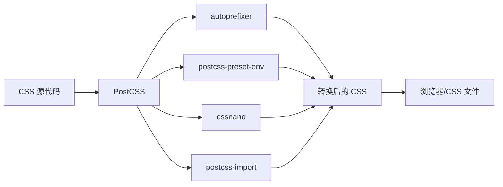

+++
title = "第6章 CSS 处理"
weight = 60
date = "2026-03-27T17:13:00+08:00"
type = "docs"
description = ""
isCJKLanguage = true
draft = false
+++

# Chapter-06-CSS-Processing

# 第6章：CSS 处理

> CSS 是前端开发中最"朴素"又最"复杂"的存在。说它朴素，是因为它语法简单到小学生都能写；说它复杂，是因为当你项目变大、团队协作、浏览器兼容、性能优化这些因素叠加进来时，CSS 就变成了一个深不见底的技术黑洞。
>
> 幸好，Vite 对 CSS 的支持堪称"瑞士军刀"级别的全面：原生 CSS、CSS Modules、CSS 预处理器（SCSS/Less/Stylus）、PostCSS、原子化 CSS（Tailwind/UnoCSS）、CSS-in-JS... 几乎涵盖了所有主流的 CSS 解决方案。
>
> 这一章，我们就把这些知识点一网打尽！

---

## 6.1 CSS 原生支持

### 6.1.1 直接导入 CSS 文件

Vite 对原生 CSS 的支持是开箱即用的，不需要任何配置。你只需要在入口文件或组件中 `import` CSS 文件，Vite 就会自动处理它。

```javascript
// main.js —— 在入口文件中导入全局 CSS
import './styles/main.css'
```

```vue
<!-- 在 Vue 组件中导入 -->
<script setup>
import './styles/button.css'
</script>
```

**CSS 文件示例**：

```css
/* main.css */
body {
  margin: 0;
  padding: 0;
  font-family: -apple-system, BlinkMacSystemFont, 'Segoe UI', Roboto, 'Helvetica Neue', Arial, sans-serif;
  background-color: #f5f5f5;
  color: #333;
  line-height: 1.6;
}

h1, h2, h3, h4, h5, h6 {
  margin: 0;
  font-weight: 600;
}

a {
  color: #3b82f6;
  text-decoration: none;
}

a:hover {
  text-decoration: underline;
}

button {
  cursor: pointer;
}
```

> 💡 **Vite 的 CSS 处理流程**：Vite 接到 CSS 文件后，会经过 PostCSS 处理（如果有配置），然后打包到输出文件中。如果启用了 CSS Modules，还会进行特殊处理。

### 6.1.2 CSS Modules（作用域隔离）

CSS Modules 是一种让 CSS 类名**局部作用域化**的技术。它可以防止不同组件之间的样式冲突，非常适合大型项目。

**核心概念**：普通的 CSS 类名是全局的，两个组件都定义了 `.button` 类，后面的会覆盖前面的。CSS Modules 通过生成唯一的哈希类名，让每个组件的样式都"私有化"。

**Vite 对 CSS Modules 的支持是原生的**，你只需要创建 `.module.css` 文件：

```css
/* src/components/Button.module.css */

/* 这个类名会被编译成类似 button__primary__a1b2c3 */
.button {
  padding: 8px 16px;
  border-radius: 4px;
  font-size: 14px;
  cursor: pointer;
  transition: all 0.2s;
}

/* 样式变体 */
.primary {
  background-color: #3b82f6;
  color: white;
}

.secondary {
  background-color: #e5e7eb;
  color: #374151;
}

.danger {
  background-color: #ef4444;
  color: white;
}

/* 状态样式 */
.disabled {
  opacity: 0.5;
  cursor: not-allowed;
}
```

**在 Vue 组件中使用**：

```vue
<template>
  <button
    :class="[
      styles.button,
      styles[variant],
      { [styles.disabled]: disabled }
    ]"
    :disabled="disabled"
    @click="$emit('click')"
  >
    <slot />
  </button>
</template>

<script setup>
import { computed } from 'vue'
import styles from './Button.module.css'

const props = defineProps({
  variant: {
    type: String,
    default: 'primary',
    validator: (v) => ['primary', 'secondary', 'danger'].includes(v)
  },
  disabled: {
    type: Boolean,
    default: false
  }
})
</script>
```

**在 React 组件中使用**：

```jsx
// src/components/Button.jsx
import styles from './Button.module.css'

export function Button({ variant = 'primary', disabled = false, children, onClick }) {
  return (
    <button
      className={[
        styles.button,
        styles[variant],
        disabled ? styles.disabled : ''
      ].filter(Boolean).join(' ')}
      disabled={disabled}
      onClick={onClick}
    >
      {children}
    </button>
  )
}
```

**生成的 HTML 和 CSS**：

```html
<!-- 浏览器中看到的 -->
<button class="Button_button__a1b2c3 Button_primary__d4e5f6 Button_disabled__g7h8i9">
  点击我
</button>
```

```css
/* Vite 生成的 CSS */
.Button_button__a1b2c3 {
  padding: 8px 16px;
  border-radius: 4px;
  font-size: 14px;
  cursor: pointer;
  transition: all 0.2s;
}
.Button_primary__d4e5f6 {
  background-color: #3b82f6;
  color: white;
}
```

**CSS Modules 配置**：

```javascript
// vite.config.js
export default defineConfig({
  css: {
    modules: {
      // 类名生成规则
      // local: 只对当前文件生效（默认）
      // global: 所有类名都是全局的
      scopeBehaviour: 'local',
      
      // 类名生成模板
      // [name] 是原始类名
      // [local] 是转换后的局部类名
      // [hash] 是哈希值
      generateScopedName: '[name]__[local]__[hash:base64:5]',
      
      // 导出 locals 的命名风格
      // 'camelCase' | 'kebabCase' | 'dashes' | 'dashesOnly'
      exportLocalsConvention: 'camelCase',
      
      // 不会被哈希的全局类名
      globalModulePaths: ['./src/styles/global.css'],
    }
  }
})
```

### 6.1.3 CSS 导入预处理器

Vite 对 CSS 预处理器（Sass、Less、Stylus）的支持是原生的，只需要安装对应的包即可：

```bash
# 安装 Sass/SCSS
pnpm add -D sass

# 安装 Less
pnpm add -D less

# 安装 Stylus
pnpm add -D stylus
```

安装后，Vite 会自动识别 `.scss`、`.sass`、`.less`、`.styl` 文件并处理它们。

**Sass/SCSS 使用示例**：

```scss
/* variables.scss —— 全局变量文件 */
$primary-color: #3b82f6;
$secondary-color: #6b7280;
$border-radius: 8px;
$font-family: -apple-system, BlinkMacSystemFont, 'Segoe UI', Roboto, sans-serif;

$spacing: (
  xs: 4px,
  sm: 8px,
  md: 16px,
  lg: 24px,
  xl: 32px,
);

$breakpoints: (
  sm: 640px,
  md: 768px,
  lg: 1024px,
  xl: 1280px,
);
```

```scss
/* mixins.scss —— 混入文件 */
@mixin flex-center {
  display: flex;
  justify-content: center;
  align-items: center;
}

@mixin card-shadow {
  box-shadow: 0 4px 6px -1px rgba(0, 0, 0, 0.1),
              0 2px 4px -1px rgba(0, 0, 0, 0.06);
}

@mixin responsive($breakpoint) {
  @if map-has-key($breakpoints, $breakpoint) {
    @media (min-width: map-get($breakpoints, $breakpoint)) {
      @content;
    }
  }
}

@mixin text-ellipsis {
  overflow: hidden;
  text-overflow: ellipsis;
  white-space: nowrap;
}
```

```scss
/* button.scss */
@import './variables.scss';
@import './mixins.scss';

.button {
  @include flex-center;
  padding: $spacing-sm $spacing-md;
  border-radius: $border-radius;
  font-family: $font-family;
  cursor: pointer;
  transition: all 0.2s ease;
  
  &--primary {
    background-color: $primary-color;
    color: white;
    &:hover { opacity: 0.9; }
  }
  
  &--secondary {
    background-color: $secondary-color;
    color: white;
  }
  
  @include responsive(md) {
    padding: $spacing-sm $spacing-lg;
  }
}
```

**Less 使用示例**：

```less
// variables.less
@primary-color: #3b82f6;
@secondary-color: #6b7280;
@border-radius: 8px;
@font-family: -apple-system, BlinkMacSystemFont, 'Segoe UI', Roboto, sans-serif;

@spacing-xs: 4px;
@spacing-sm: 8px;
@spacing-md: 16px;
@spacing-lg: 24px;
```

```less
// button.less
@import './variables.less';

.button {
  padding: @spacing-sm @spacing-md;
  border-radius: @border-radius;
  font-family: @font-family;
  cursor: pointer;
  transition: all 0.2s ease;
  
  &--primary {
    background-color: @primary-color;
    color: white;
    &:hover { opacity: 0.9; }
  }
  
  &--secondary {
    background-color: @secondary-color;
    color: white;
  }
}
```

---

## 6.2 CSS 预处理器

### 6.2.1 Sass/SCSS 配置与使用

Sass（Syntactically Awesome Style Sheets）是最流行的 CSS 预处理器，有两种语法：
- **SCSS**（Sassy CSS）：使用 `{}` 和 `;`，和普通 CSS 几乎一样，推荐使用
- **Sass**（缩进语法）：使用缩进，不使用 `{}`，是老式语法

**SCSS 高级特性**：

```scss
// 嵌套规则
.container {
  width: 100%;
  max-width: 1200px;
  margin: 0 auto;
  padding: 20px;
  
  .header {
    height: 60px;
    background: #fff;
    
    &__title {
      font-size: 24px;
      color: #333;
    }
    
    &--dark {
      background: #1a1a1a;
    }
  }
  
  .content {
    min-height: 400px;
  }
}

// & 符号引用父选择器
.link {
  color: blue;
  text-decoration: none;
  
  &:hover {
    text-decoration: underline;
  }
  
  &--important {
    color: red;
  }
}

// 属性嵌套（@nest 写法）
.box {
  font: {
    family: 'Arial';
    size: 14px;
    weight: bold;
  }
  
  border: {
    width: 1px;
    style: solid;
    color: #ccc;
  }
}

// @extend 继承
.message {
  padding: 16px;
  border-radius: 4px;
  border: 1px solid;
}

.success {
  @extend .message;
  border-color: green;
  color: green;
}

.error {
  @extend .message;
  border-color: red;
  color: red;
}

// @for 循环
@for $i from 1 through 3 {
  .col-#{$i} {
    width: $i * 33.333%;
  }
}

// @each 遍历
$colors: (primary: blue, secondary: gray, danger: red);

@each $name, $color in $colors {
  .text-#{$name} {
    color: $color;
  }
  
  .bg-#{$name} {
    background-color: $color;
  }
}

// @function 函数
@function px-to-rem($px) {
  @return $px / 16px * 1rem;
}

.title {
  font-size: px-to-rem(32px);  // 2rem
}
```

**Vite 中配置 SCSS 全局变量**：

```javascript
// vite.config.js
import { defineConfig } from 'vite'
import path from 'path'

export default defineConfig({
  css: {
    preprocessorOptions: {
      scss: {
        // 添加全局变量文件（自动注入到每个 SCSS 文件）
        additionalData: `
          @import "@/styles/variables.scss";
          @import "@/styles/mixins.scss";
        `,
        
        // Sass API 版本
        // 'modern' | 'legacy'
        api: 'modern',  // 推荐使用现代编译器
      }
    }
  }
})
```

### 6.2.2 Less 配置与使用

Less 是一个比 Sass 更简单的 CSS 预处理器，适合喜欢简洁语法的开发者。

**Less 高级特性**：

```less
// 变量
@primary-color: #3b82f6;
@font-family: -apple-system, sans-serif;
@border-radius: 8px;

// Mixins 混入
.flex-center() {
  display: flex;
  justify-content: center;
  align-items: center;
}

.button-base() {
  padding: 8px 16px;
  border-radius: @border-radius;
  cursor: pointer;
}

// 带参数的 mixin
.border-radius(@radius) {
  border-radius: @radius;
}

// 嵌套
.card {
  padding: 20px;
  background: #fff;
  
  .title {
    font-size: 24px;
    color: #333;
  }
  
  &:hover {
    box-shadow: 0 4px 12px rgba(0, 0, 0, 0.1);
  }
}

// 运算
@width: 100px;
@padding: 10px;

.box {
  width: @width + 20px;  // 120px
  padding: @padding * 2; // 20px
}

// 条件
.widget {
  @media (min-width: 768px) {
    width: 50%;
    
    & when (@enable-dark-mode = true) {
      background: #333;
    }
  }
}
```

**Vite 中配置 Less 全局变量**：

```javascript
// vite.config.js
export default defineConfig({
  css: {
    preprocessorOptions: {
      less: {
        // Less 4.x 的新语法
        // less: { math: 'always' }
        
        // 添加全局变量文件
        additionalData: `@import "@/styles/variables.less";`,
        
        // 启用 JavaScript 表达式（需要安装 less-plugin-functions）
        javascriptEnabled: true,
      }
    }
  }
})
```

### 6.2.3 Stylus 配置与使用

Stylus 是一个灵活且富有表现力的 CSS 预处理器，支持缩进语法和标准 CSS 语法。

**Stylus 高级特性**：

```stylus
// 变量
primary-color = #3b82f6
font-family = -apple-system, sans-serif

// Mixins
flex-center()
  display: flex
  justify-content: center
  align-items: center

border-radius(radius)
  border-radius: radius

// 嵌套
.card
  padding: 20px
  background: #fff
  
  .title
    font-size: 24px
    color: #333
  
  &:hover
    box-shadow: 0 4px 12px rgba(0, 0, 0, 0.1)

// 属性查找
撑满容器()
  position: absolute
  top: 0
  left: 0
  width: 100%
  height: 100%

.modal
  撑满容器()
  
// 循环
for i in 1..3
  .col-{i}
    width: (100 / 3) * i %
```

**Vite 中配置 Stylus 全局变量**：

```javascript
// vite.config.js
export default defineConfig({
  css: {
    preprocessorOptions: {
      stylus: {
        // 添加全局变量文件
        additionalData: `@import "@/styles/variables.styl"`,
        
        // 导入路径
        import: [
          path.resolve(__dirname, 'src/styles'),
        ],
      }
    }
  }
})
```

### 6.2.4 预处理器选项配置

**在 vite.config.js 中完整配置示例**：

```javascript
// vite.config.js
import { defineConfig } from 'vite'
import path from 'path'

export default defineConfig({
  css: {
    preprocessorOptions: {
      // SCSS 配置
      scss: {
        // 全局注入变量和混入
        additionalData: `
          @use "@/styles/variables.scss" as *;
          @use "@/styles/mixins.scss" as *;
        `,
        // 推荐使用现代编译器（更快）
        api: 'modern',
      },
      
      // Less 配置
      less: {
        additionalData: `@import "@/styles/variables.less";`,
        // Less 4.x 需要的配置
        lessOptions: {
          math: 'always',
        },
      },
      
      // Stylus 配置
      stylus: {
        additionalData: `@import "@/styles/variables.styl"`,
        import: [path.resolve(__dirname, 'src/styles')],
      },
    }
  }
})
```

> ⚠️ **注意**：如果你使用 `@use` 而不是 `@import` 来导入 SCSS 变量，需要注意 Vite 的 SCSS 编译选项。`@use` 是 Sass 模块系统的现代语法，推荐在新项目中使用。

---

## 6.3 CSS 后处理器

### 6.3.1 PostCSS 简介

PostCSS 是一个用 JavaScript 插件转换 CSS 的工具。它本身不做什么，需要配合各种插件使用。Vite 内置了 PostCSS 支持。

**PostCSS 的工作流程**：



**Vite 中的 PostCSS 配置文件**：

```javascript
// postcss.config.js
export default {
  plugins: {
    // autoprefixer：自动添加 CSS 前缀
    autoprefixer: {
      // 目标浏览器
      overrideBrowserslist: [
        '> 1%',
        'last 2 versions',
        'not dead',
      ],
    },
    
    // postcss-preset-env：现代 CSS 转换
    'postcss-preset-env': {
      stage: 2,  // CSS 阶段：0-4，2 是大多数项目推荐的值
      features: {
        // 启用嵌套
        'nesting-rules': true,
      },
    },
    
    // cssnano：CSS 压缩
    cssnano: {
      preset: 'default',
    },
  },
}
```

### 6.3.2 autoprefixer 自动前缀

autoprefixer 是最常用的 PostCSS 插件，它可以自动为 CSS 属性添加浏览器前缀。

**安装**：

```bash
pnpm add -D autoprefixer postcss
```

**使用**：

```css
/* 写代码时只需要写标准属性 */
.flex-container {
  display: flex;
  justify-content: center;
  align-items: center;
  user-select: none;
  transform: rotate(45deg);
  transition: all 0.3s;
}
```

```css
/* autoprefixer 处理后会自动添加前缀 */
.flex-container {
  display: -webkit-box;
  display: -ms-flexbox;
  display: flex;
  -webkit-box-pack: center;
  -ms-flex-pack: center;
  justify-content: center;
  -webkit-box-align: center;
  -ms-flex-align: center;
  align-items: center;
  -webkit-user-select: none;
  -moz-user-select: none;
  -ms-user-select: none;
  user-select: none;
  -webkit-transform: rotate(45deg);
  -ms-transform: rotate(45deg);
  transform: rotate(45deg);
  -webkit-transition: all 0.3s;
  -o-transition: all 0.3s;
  transition: all 0.3s;
}
```

### 6.3.3 postcss-preset-env（现代 CSS）

postcss-preset-env 允许你使用现代 CSS 特性，它会自动转换为兼容的旧 CSS。

**安装**：

```bash
pnpm add -D postcss-preset-env
```

**支持的现代 CSS 特性**：

```css
/* CSS 变量 */
:root {
  --primary-color: #3b82f6;
  --spacing: 16px;
}

.button {
  color: var(--primary-color);
  padding: var(--spacing);
}

/* 嵌套语法 */
.card {
  padding: 20px;
  
  .title {
    font-size: 24px;
    
    &:hover {
      color: var(--primary-color);
    }
  }
}

/* 自定义媒体查询 */
@custom-media --small (max-width: 480px);

@media (--small) {
  .card {
    padding: 10px;
  }
}

/* 颜色函数 */
.color {
  /* hwb() 颜色 */
  background-color: hwb(194 0% 0%);
  
  /* oklch() 颜色 */
  background-color: oklch(59% 0.16 245);
  
  /* color-mix() 混合颜色 */
  background-color: color-mix(in oklch, #34d399, #3b82f6);
}

/* @layer 层级 */
@layer base {
  body {
    margin: 0;
  }
}

@layer utilities {
  .text-center {
    text-align: center;
  }
}
```

### 6.3.4 postcss-import 处理

postcss-import 允许你使用 `@import` 来导入 CSS 文件，并内联到当前文件中。

**安装**：

```bash
pnpm add -D postcss-import
```

**使用**：

```css
/* main.css */
@import './reset.css';
@import './variables.css';
@import './components/button.css';

/* postcss-import 会把这些文件的内容都内联到这里 */
```

### 6.3.5 cssnano（CSS 压缩）

cssnano 会压缩 CSS 代码，移除空格、注释、优化选择器等，让 CSS 文件更小。

**安装**：

```bash
pnpm add -D cssnano
```

**使用**：

```css
/* 原始 CSS */
.my-class {
  background-color: #ffffff;
  color: #000000;
  font-family: -apple-system, BlinkMacSystemFont, 'Segoe UI', Roboto, sans-serif;
  font-weight: normal;
}

/* cssnano 压缩后 */
.my-class {
  background: #fff;
  color: #000;
  font: 16px/1 -apple-system, BlinkMacSystemFont, 'Segoe UI', Roboto, sans-serif;
  font-weight: 400;
}
```

### 6.3.6 自定义 PostCSS 配置

> ⚠️ **注意**：以下 PostCSS 配置是针对 **Tailwind CSS 3.x** 的配置方式。如果你使用的是 **Tailwind CSS 4.x**（使用 `@tailwindcss/vite` 插件），Lightning CSS 已经内置处理了嵌套，**不需要**在这里额外配置 `tailwindcss/nesting`，否则会产生冲突。

在 Vite 中，你可以通过 `postcss.config.js` 或者直接在 `vite.config.js` 中配置 PostCSS：

**方式一：创建 postcss.config.js（Tailwind 3.x）**：

```javascript
// postcss.config.js
export default {
  plugins: [
    // 插件按顺序执行
    require('postcss-import'),         // 先处理 @import
    require('tailwindcss/nesting'),    // 然后处理 tailwind 的嵌套
    require('tailwindcss'),            // 然后处理 tailwind
    require('autoprefixer'),           // 最后添加前缀
  ],
}
```

**方式二：在 vite.config.js 中配置**：

```javascript
// vite.config.js
import autoprefixer from 'autoprefixer'
import tailwindcss from 'tailwindcss'
import postcssPresetEnv from 'postcss-preset-env'

export default defineConfig({
  css: {
    postcss: {
      plugins: [
        postcssPresetEnv({
          stage: 2,
        }),
        autoprefixer({
          overrideBrowserslist: ['> 1%', 'last 2 versions'],
        }),
      ],
    },
  },
})
```

---

## 6.4 CSS 框架集成

### 6.4.1 Tailwind CSS 集成

Tailwind CSS 是目前最流行的原子化 CSS 框架，它通过提供大量预定义的 utility 类来实现样式。

**安装**：

```bash
# Tailwind CSS 4.x + Vite 插件方式（推荐）
pnpm add -D @tailwindcss/vite
```

**配置 Tailwind CSS 4.x（最新版本）**：

```javascript
// vite.config.js
import { defineConfig } from 'vite'
import tailwindcss from '@tailwindcss/vite'

export default defineConfig({
  plugins: [
    tailwindcss(),
  ],
})
```

```css
/* main.css */
/* Tailwind 4.x 的导入方式 */
@import "tailwindcss";

/* 可以添加自定义样式 */
@theme {
  --color-primary: #3b82f6;
  --font-family-sans: -apple-system, BlinkMacSystemFont, 'Segoe UI', Roboto, sans-serif;
}

/* 使用自定义主题 */
.my-component {
  color: var(--color-primary);
  font-family: var(--font-family-sans);
}
```

**Tailwind CSS 3.x 配置（如果你用的是旧版本）**：

```javascript
// tailwind.config.js
/** @type {import('tailwindcss').Config} */
export default {
  content: [
    './index.html',
    './src/**/*.{vue,js,ts,jsx,tsx}',
  ],
  theme: {
    extend: {
      colors: {
        primary: '#3b82f6',
      },
    },
  },
  plugins: [],
}
```

```css
/* src/style.css */
@tailwind base;
@tailwind components;
@tailwind utilities;

@layer components {
  .btn {
    @apply px-4 py-2 bg-primary text-white rounded;
  }
}
```

### 6.4.2 UnoCSS 集成

UnoCSS 是新一代的原子化 CSS 引擎，由 Vite 的作者（Anthony Fu）创建，速度极快，可以实时生成样式。

**安装**：

```bash
pnpm add -D unocss
```

**配置**：

```javascript
// vite.config.js
import { defineConfig } from 'vite'
import vue from '@vitejs/plugin-vue'
import UnoCSS from 'unocss/vite'

export default defineConfig({
  plugins: [
    vue(),
    UnoCSS(),
  ],
})
```

```javascript
// uno.config.ts
import { defineConfig, presetUno, presetAttributify, presetIcons } from 'unocss'

export default defineConfig({
  // 预设
  presets: [
    // Uno 是 Tailwind CSS 兼容的预设
    presetUno(),
    // 属性模式
    presetAttributify(),
    // 图标
    presetIcons({
      // 使用 Iconify 图标库
      scale: 1.2,
      cdn: 'https://esm.sh/',
    }),
  ],
  
  // 自定义主题
  theme: {
    colors: {
      primary: '#3b82f6',
    },
  },
  
  // 自定义快捷方式
  shortcuts: {
    'btn': 'px-4 py-2 rounded-lg font-semibold cursor-pointer transition-all',
    'btn-primary': 'btn bg-primary text-white hover:bg-primary/90',
  },
  
  // 自定义规则
  rules: [
    // 固定宽高比
    ['aspect-square', { 'aspect-ratio': '1 / 1' }],
    ['aspect-video', { 'aspect-ratio': '16 / 9' }],
  ],
})
```

```vue
<!-- 使用 -->
<template>
  <div class="p-4">
    <h1 class="text-3xl font-bold text-primary">Hello UnoCSS!</h1>
    <button class="btn-primary">点击我</button>
  </div>
</template>

<script setup>
import 'uno.css'
</script>
```

### 6.4.3 Bootstrap 集成

Bootstrap 是老牌 CSS 框架，提供了大量组件和工具类。

**安装**：

```bash
pnpm add bootstrap @popperjs/core
```

**配置**：

```javascript
// main.js
import 'bootstrap/dist/css/bootstrap.min.css'
import 'bootstrap/dist/js/bootstrap.bundle.min.js'
```

### 6.4.4 Ant Design 集成

Ant Design 是蚂蚁金服出品的 React UI 库，也支持 Vue。

**Vue 项目安装 Ant Design Vue**：

```bash
pnpm add ant-design-vue @ant-design/icons-vue
```

**配置**：

```javascript
// main.js
import { createApp } from 'vue'
import Antd from 'ant-design-vue'
import 'ant-design-vue/dist/reset.css'
import App from './App.vue'

const app = createApp(App)
app.use(Antd)
app.mount('#app')
```

**使用自动导入（推荐）**：

```javascript
// vite.config.js
import Components from 'unplugin-vue-components/vite'
import { AntDesignVueResolver } from 'unplugin-vue-components/resolvers'

export default defineConfig({
  plugins: [
    Components({
      resolvers: [
        AntDesignVueResolver(),
      ],
    }),
  ],
})
```

### 6.4.5 Material Design 集成

**Element Plus（Vue 3）**：

```bash
pnpm add element-plus
```

```javascript
// main.js
import { createApp } from 'vue'
import ElementPlus from 'element-plus'
import 'element-plus/dist/index.css'
import App from './App.vue'

const app = createApp(App)
app.use(ElementPlus)
app.mount('#app')
```

---

## 6.5 CSS-in-JS 方案

CSS-in-JS 是一种将 CSS 样式写在 JavaScript 文件中的技术，它有以下优点：
- 样式和组件在一起，易于管理
- 自动支持 CSS Modules
- 可以使用 JavaScript 变量和逻辑

### 6.5.1 CSS Modules（推荐，原生支持）

见 6.1.2 节。

### 6.5.2 Styled Components

Styled Components 是 React 生态中最流行的 CSS-in-JS 库。

**安装**：

```bash
pnpm add styled-components
```

**React 项目配置**：

```javascript
// vite.config.js
import { defineConfig } from 'vite'
import react from '@vitejs/plugin-react'
import tsconfigPaths from 'vite-tsconfig-paths'

export default defineConfig({
  plugins: [
    react(),
    tsconfigPaths(),
  ],
})
```

**使用**：

```jsx
// Button.jsx
import styled from 'styled-components'

const ButtonWrapper = styled.button`
  padding: 8px 16px;
  border-radius: 8px;
  font-size: 14px;
  font-weight: 600;
  cursor: pointer;
  transition: all 0.2s;
  
  /* 根据 props 动态生成样式 */
  background-color: ${props => 
    props.$variant === 'primary' ? '#3b82f6' :
    props.$variant === 'danger' ? '#ef4444' : '#e5e7eb'
  };
  color: ${props => 
    props.$variant === 'secondary' ? '#374151' : 'white'
  };
  
  /* 伪类和伪元素 */
  &:hover {
    opacity: 0.9;
    transform: translateY(-1px);
  }
  
  &:disabled {
    opacity: 0.5;
    cursor: not-allowed;
  }
`

export function Button({ variant = 'primary', disabled = false, children, onClick }) {
  return (
    <ButtonWrapper 
      $variant={variant} 
      disabled={disabled}
      onClick={onClick}
    >
      {children}
    </ButtonWrapper>
  )
}
```

### 6.5.3 Emotion

Emotion 是另一个流行的 CSS-in-JS 库，比 Styled Components 更灵活。

**安装**：

```bash
pnpm add @emotion/react @emotion/styled
```

**使用**：

```jsx
/** @jsxImportSource @emotion/react */
import { css } from '@emotion/react'

const buttonStyle = css`
  padding: 8px 16px;
  border-radius: 8px;
  background-color: #3b82f6;
  color: white;
  cursor: pointer;
  
  &:hover {
    opacity: 0.9;
  }
`

export function Button({ children, onClick }) {
  return (
    <button css={buttonStyle} onClick={onClick}>
      {children}
    </button>
  )
}
```

### 6.5.4 Vanilla Extract（零运行时）

Vanilla Extract 是 CSS-in-JS 的另一种方案，它在构建时生成静态 CSS 文件，运行时零开销。

**安装**：

```bash
pnpm add @vanilla-extract/css @vanilla-extract/vite-plugin
```

**配置**：

```javascript
// vite.config.js
import { defineConfig } from 'vite'
import vue from '@vitejs/plugin-vue'
import { vanillaExtractPlugin } from '@vanilla-extract/vite-plugin'

export default defineConfig({
  plugins: [
    vue(),
    vanillaExtractPlugin(),
  ],
})
```

**使用**：

```typescript
// Button.css.ts
import { style, styleVariants } from '@vanilla-extract/css'

export const button = style({
  padding: '8px 16px',
  borderRadius: '8px',
  cursor: 'pointer',
})

export const buttonVariant = styleVariants({
  primary: {
    backgroundColor: '#3b82f6',
    color: 'white',
  },
  secondary: {
    backgroundColor: '#e5e7eb',
    color: '#374151',
  },
})
```

```vue
<!-- Vue 组件中使用 -->
<template>
  <button :class="[styles.button, styles.buttonVariant.primary]">
    点击我
  </button>
</template>

<script setup lang="ts">
import * as styles from './Button.css.ts'
</script>
```

### 6.5.5 Linaria（零运行时）

Linaria 类似于 Vanilla Extract，也是生成静态 CSS，但使用方式更像 CSS-in-JS。

**安装**：

```bash
pnpm add @linaria/core @linaria/vite-plugin
```

**配置**：

```javascript
// vite.config.js
import { defineConfig } from 'vite'
import vue from '@vitejs/plugin-vue'
import { linaria } from '@linaria/vite-plugin'

export default defineConfig({
  plugins: [
    vue(),
    linaria({
      // 包含 .js/.jsx/.ts/.tsx 文件
      include: ['**/*.{jsx,tsx}'],
    }),
  ],
})
```

---

## 6.6 本章小结

### 🎉 本章总结

这一章我们深入学习了 Vite 的 CSS 处理能力：

1. **原生 CSS**：直接导入、CSS Modules 局部作用域

2. **CSS 预处理器**：Sass/SCSS（嵌套、变量、Mixin、继承、循环）、Less（变量、Mixin、运算）、Stylus（灵活语法）

3. **PostCSS**：autoprefixer 自动前缀、postcss-preset-env 现代 CSS、cssnano 压缩

4. **CSS 框架集成**：Tailwind CSS 4.x、UnoCSS、Bootstrap、Ant Design、Element Plus

5. **CSS-in-JS**：Styled Components、Emotion、Vanilla Extract（零运行时）、Linaria

### 📝 本章练习

1. **CSS Modules 实验**：创建一个 `.module.css` 文件，试试 CSS Modules 的哈希类名生成

2. **SCSS 全局变量**：配置 SCSS 的 `additionalData`，让每个 SCSS 文件都能直接使用全局变量

3. **Tailwind CSS**：创建一个 Tailwind CSS 项目，体验原子化 CSS 的魅力

4. **PostCSS 配置**：配置 autoprefixer + postcss-preset-env，体验现代 CSS

5. **CSS-in-JS 选型**：对比 Styled Components 和 Vanilla Extract，选择一个用于你的项目

---

> 📌 **预告**：下一章我们将进入 **静态资源与构建优化**，学习资源处理、图片优化、代码分割、构建分析、压缩配置、Worker 与 WebAssembly 等内容。敬请期待！
